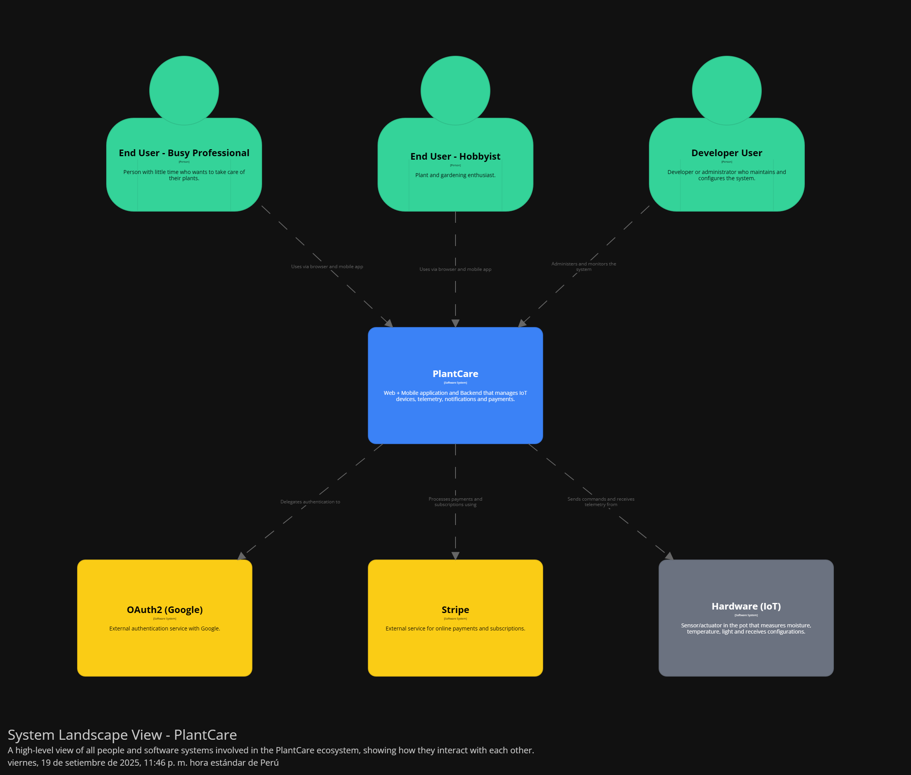
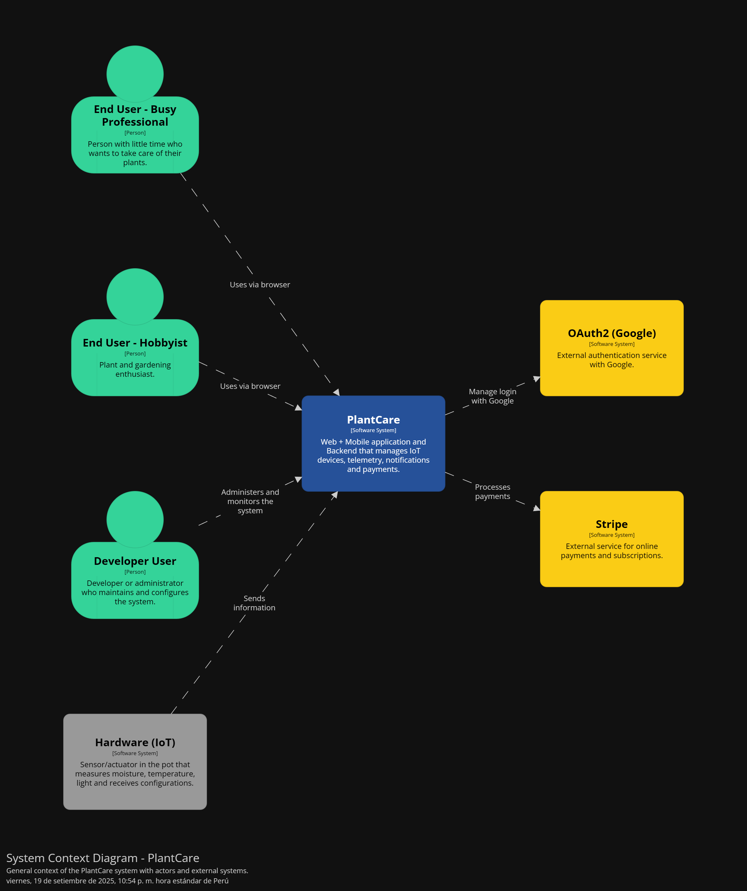
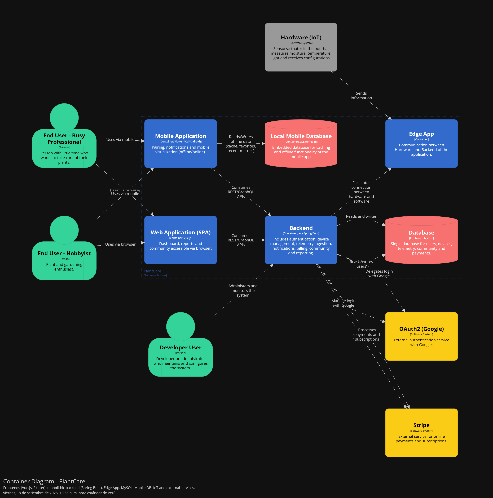

    
    </img> <strong>Universidad Peruana de Ciencias Aplicadas</strong> 
     
Ingeniería de Software

    
8vo Ciclo

     <strong>Arquitecturas de Software Emergentes</strong> 
     
Sección: 11770

    
Profesor: Christian Luis De Los Rios Fernandez
 

    <strong>"Informe del Trabajo Final"</strong> 
     <strong>Startup: </strong> 
     <strong>Producto: Oryxen</strong>  

    <h3 align="center">Integrantes:</h3>

    <table align="center">
        <tr>
            <th style="text-align:center;">Apellidos y Nombres</th>
            <th style="text-align:center;">Código</th>
        </tr>
        <tr>
            <td style="text-align:center;">Estrada Cajamune, Abraham Andrés</td>
            <td style="text-align:center;">U</td>
        </tr>
        <tr>
            <td style="text-align:center;">Nanfuñay Liza, Pedro Jesús</td>
            <td style="text-align:center;">U202215462</td>
        </tr>
        <tr>
            <td style="text-align:center;">Pachas Chavez, Alejandro Alberto</td>
            <td style="text-align:center;">U</td>
        </tr>
        <tr>
            <td style="text-align:center;">Zevallos Linares, Alessandro Netto</td>
            <td style="text-align:center;">U</td>
        </tr>
    </table>
    

</body>

 
 
Abril, 2026

  

# Registro de Versiones del Informe

| Versión | Fecha | Autor | Descripción de Modificación |
| ----------- | ----------- | ----------- | ----------- |
| TB1 | 15/04/2026 |  |  |

# Project Report Collaboration Insights

URL de la organización del proyecto:

**TB1**

# Contenido

## Tabla de contenidos

[Registro de Versiones del Informe](#registro-de-versiones-del-informe)

[Project Report Collaboration Insights](#project-report-collaboration-insights)

[Student Outcome](#student-outcome)

### [Capítulo I: Introducción](#capítulo-i-introducción)

- [1.1 Startup Profile](#11-startup-profile)  
    - [1.1.1. Descripción de la Startup](#111-descripción-de-la-startup)  
    - [1.1.2. Perfiles de integrantes del equipo](#112-perfiles-de-integrantes-del-equipo)  
- [1.2. Solution Profile](#12-solution-profile)  
    - [1.2.1 Antecedentes y problemática](#121-antecedentes-y-problemática)  
    - [1.2.2 Lean UX Process](#122-lean-ux-process)  
        - [1.2.2.1. Lean UX Problem Statements](#1221-lean-ux-problem-statements)  
        - [1.2.2.2. Lean UX Assumptions](#1222-lean-ux-assumptions)  
        - [1.2.2.3. Lean UX Hypothesis Statements](#1223-lean-ux-hypothesis-statements)  
        - [1.2.2.4. Lean UX Canvas](#1224-lean-ux-canvas)  
- [1.3. Segmentos objetivo](#13-segmentos-objetivo)

### [Capítulo II: Requirements Elicitation & Analysis](#capítulo-ii-requirements-elicitation--analysis)

- [2.1. Competidores](#21-competidores)  
    - [2.1.1. Análisis competitivo](#211-análisis-competitivo)  
    - [2.1.2. Estrategias y tácticas frente a competidores](#212-estrategias-y-tácticas-frente-a-competidores)  
- [2.2. Entrevistas](#22-entrevistas)  
    - [2.2.1. Diseño de entrevistas](#221-diseño-de-entrevistas)  
    - [2.2.2. Registro de entrevistas](#222-registro-de-entrevistas)  
    - [2.2.3. Análisis de entrevistas](#223-análisis-de-entrevistas)  
- [2.3. Needfinding](#23-needfinding)  
    - [2.3.1. User Personas](#231-user-personas)  
    - [2.3.2. User Task Matrix](#232-user-task-matrix)  
    - [2.3.3. User Journey Mapping](#233-user-journey-mapping)  
    - [2.3.4. Empathy Mapping](#234-empathy-mapping)  
    - [2.3.5. As-is Scenario Mapping](#235-as-is-scenario-mapping)
- [2.4. Ubiquitous Language](#25-ubiquitous-language)  

### [Capítulo III: Requirements Specification](#capítulo-iii-requirements-specification)  

- [3.1. To-Be Scenario Mapping](#31-to-be-scenario-mapping)  
- [3.2. User Stories](#32-user-stories)  
- [3.3. Product Backlog](#33-product-backlog)  
- [3.4. Impact Mapping](#34-impact-mapping)

### [Capítulo IV: Strategic-Level Software Design](#capítulo-iv-strategic-level-software-design)

- [4.1. Strategic-Level Attribute-Driven Design](#41-strategic-level-attribute-driven-design)  
    - [4.1.1. Design Purpose.](#411-design-purpose)  
    - [4.1.2. Attribute-Driven Design Inputs](#412-attribute-driven-design-inputs)  
        - [4.1.2.1. Primary Functionality (Primary User Stories)](#4121-primary-functionality)  
        - [4.1.2.2. Quality attribute Scenarios](#4122-quality-attribute-scenario)  
        - [4.1.2.3. Constraints](#4123-constraints)  
        - [4.1.3. Architectural Drivers Backlog](#413-architectural-drivers-backlog)  
        - [4.1.4. Architectural Design Decisions](#414-architectural-design-decisions)  
        - [4.1.5. Quality Attribute Scenario Refinements](#415-quality-attribute-scenario-refinements)  
- [4.2. Strategic-Level Domain-Driven Design.](#42-strategic-level-domain-driven-design)  
    - [4.2.1. EventStorming.](#421-eventstorming)  
    - [4.2.2. Candidate Context Discovery](#422-candidate-context-discovery)  
    - [4.2.3. Domain Message Flows Modeling](#423-domain-message-flows-modeling)  
    - [4.2.4. Bounded Context Canvases](#424-bounded-context-canvases)  
    - [4.2.5. Context Mapping](#425-context-mapping)  
- [4.3. Software Architecture](#43-software-architecture)  
    - [4.3.1. Software Architecture System Landscape Diagram](#431-software-architecture-system-landscape-diagram)  
    - [4.3.2. Software Architecture Context Level Diagrams](#432-software-architecture-context-level-diagrams)  
    - [4.3.3. Software Architecture Container Level Diagrams](#433-software-architecture-container-level-diagrams)  
    - [4.3.4. Software Architecture Deployment Diagrams](#434-software-architecture-deployment-diagrams)

#### [Conclusiones](#conclusiones)  
- [Conclusiones y recomendaciones.](#conclusiones-y-recomendaciones)  

#### [Bibliografía](#bibliografía)  

#### [Anexos](#anexos)
 

# Student Outcome

El curso contribuye al cumplimiento del Student Outcome ABET:
**ABET – EAC - Student Outcome 3**

**Criterio:** Capacidad de comunicarse efectivamente con un rango de audiencias.
En el siguiente cuadro se describe las acciones realizadas y enunciados de conclusiones por parte del grupo, que permiten sustentar el haber alcanzado el logro del ABET – EAC - Student Outcome 3.

| Criterio específico | Acciones Realizadas | Conclusiones |
| ------------------- | ------------------- | ------------ |
| Comunica oralmente sus ideas y/o resultados con objetividad a público de diferentes especialidades y niveles jerarquicos, en el marco del desarrollo de un proyecto en ingeniería. | |
| Comunica en forma escrita ideas y/o resultados con objetividad a público de diferentes especialidades y niveles jerarquicos, en el marco del desarrollo de un proyecto en ingeniería. | |

 

# Capítulo I: Introducción

## 1.1. Startup Profile

### 1.1.1. Descripción de la Startup

### 1.1.2. Perfiles de integrantes del equipo

## 1.2. Solution Profile

### 1.2.1 Antecedentes y problemática

### 1.2.2 Lean UX Process.

#### 1.2.2.1. Lean UX Problem Statements

#### 1.2.2.2. Lean UX Assumptions

#### 1.2.2.3. Lean UX Hypothesis Statements

#### 1.2.2.4. Lean UX Canvas

## 1.3. Segmentos Objetivo

# Capítulo II: Requirements Elicitation & Analysis

## 2.1. Competidores

### 2.1.1. Análisis competitivo

### 2.1.2. Análisis competitivo

## 2.2. Entrevistas

### 2.2.1. Diseño de entrevistas

### 2.2.2. Registro de entrevistas

### 2.2.3. Análisis de entrevistas.

## 2.3.	Needfinding

### 2.3.1. User Persons

### 2.3.2. User Task Matrix

### 2.3.3. Empathy Mapping

### 2.3.4. As-is Scenario Mapping.

## 2.4. Ubiquitous Language

# Capítulo III: Requirements Specification

## 3.1. To-be Scenario Mapping

## 3.2 User Stories

## 3.3 Impact Mapping

## 3.4. Product Backlog

# Capítulo IV: Strategic-Level Software Design

## 4.1.	Strategic-Level Attribute-Driven Design

En esta sección, se evidencia la aplicación del método Attribute-Driven Design (ADD) para la arquitectura de la solución. Este proceso sistemático permite diseñar una arquitectura de software centrada en la satisfacción de los requisitos de calidad y los objetivos comerciales.

### 4.1.1. Design Purpose

El propósito de diseño de esta arquitectura es transformar la interacción tradicional entre las personas y el cuidado de la naturaleza a través de la tecnología. Buscando resolver la problemática de la alta tasa de mortalidad de plantas domésticas en entornos urbanos, donde la falta de tiempo y de conocimiento técnico son los principales causantes.

A continuación, se detallan los ejes centrales que orientan este proceso de diseño:

**Facilitar una Experiencia de Usuario Intuitiva y Natural**  
El diseño busca ofrecer una plataforma tecnológica que sea tan simple de usar como regar una maceta. Nos enfocamos en eliminar barreras técnicas como la vinculación de sensores mediante códigos QR y la interpretación de datos de telemetría sin usar tecnicismos complejos. El objetivo central es permitir que cualquier persona comprenda y sienta que tiene el control total del estado de sus plantas desde cualquier dispositivo.

**Automatización Inteligente para Aumentar la Productividad**  
El diseño arquitectónico busca que el sistema sea lo suficientemente inteligente para actuar por su cuenta y mandar avisos al usuario cuando sea necesario. Al automatizar tareas críticas como el riego basado en umbrales de humedad y la predicción climática, el sistema garantiza una mayor eficiencia, asegurando que los recursos (como el agua y fertilizantes) se utilicen de manera óptima, reduciendo el esfuerzo manual y minimizando el error humano.

**Soluciones pensadas para el usuario y para el negocio**  
La arquitectura está diseñada para ser flexible y escalar junto con las necesidades de nuestros usuarios, tomando en cuenta nuestros dos segmentos objetivos identificados:

- **Segmento Objetivo 1 - Personas Ocupadas:** Enfocado en soluciones eficientes y la autonomía (riego automático y alertas críticas).
- **Segmento Objetivo 2 - Aficionados a la jardinería:** Enfocado en analizar datos y gráficos, y ofrecer un aprendizaje contínuo a través de un asistente que permita aplicar los conocimientos y acciones recomendadas en sus plantas.

Desde la perspectiva del negocio, el diseño permite un modelo de crecimiento modular, facilitando la integración de nuevas especies en el catálogo botánico y la monetización a través de servicios premium (analítica avanzada y reportes), garantizando así la viabilidad técnica y comercial de la solución.

### 4.1.2. Attribute-Driven Design Inputs

En esta sección, identificamos los puntos críticos que tienen mayor relevancia y que guiarán el proceso de diseño. Estos se dividen en la funcionalidad primaria (lo que el sistema debe hacer), los atributos de calidad (cómo de bien debe hacerlo) y las restricciones técnicas (los límites dentro de los cuales debemos operar).

#### 4.1.2.1. Primary Functionality (Primary User Stories)

- Vinculación simplificada de dispositivo (US-042): Esta funcionalidad es el punto de entrada al ecosistema IoT. Técnicamente, nos obliga a diseñar un servicio de aprovisionamiento capaz de validar identidades únicas (IDs de sensores) y mapearlas de forma segura a perfiles de plantas específicos. La arquitectura debe garantizar que esta "llave de entrada" sea infalible y que la relación entre el hardware físico y el gemelo digital en la nube sea consistente desde el primer segundo.

- Recepción de datos en tiempo real (US-044): Monitorear una planta cada 30 segundos parece sencillo, pero cuando multiplicamos esto por miles de usuarios, nos enfrentamos a un reto de ingesta masiva de datos. Esta historia impacta la arquitectura al exigir un protocolo de comunicación ligero (como MQTT) y un backend capaz de procesar flujos de telemetría constantes sin latencia, asegurando que lo que el usuario ve en su pantalla sea el estado actual de su planta y no una foto del pasado.

- Alertas con diagnóstico integrado e IA (US-036): Aquí es donde el sistema deja de ser un termómetro y se convierte en un experto. Esta historia obliga a la arquitectura a integrar un "motor de reglas" y servicios de inferencia de Inteligencia Artificial. El sistema no solo debe enviar una notificación, sino que debe consultar simultáneamente variables históricas, condiciones climáticas actuales y modelos de visión artificial para ofrecer un diagnóstico. Esto impacta directamente en cómo se interconectan los microservicios de notificación con los de analítica.

- Gestión de Riego Autónomo (US-051): Al ser una solución que busca la autonomía total, esta historia define la comunicación bidireccional. La arquitectura no solo debe recibir datos, sino también "hablar" de vuelta al hardware para accionar bombas de agua. Esto introduce la necesidad de un sistema de alta disponibilidad: si el servicio de riego falla o pierde conexión, la lógica de seguridad debe estar integrada tanto en la nube como en el dispositivo físico (Edge Computing).

#### 4.1.2.2. Quality attribute Scenarios

| ID | Atributo | Fuente | Estímulo | Artefacto | Entorno | Respuesta | Medida |
| -- | -------- | ------ | -------- | --------- | ------- | --------- | ------ |
| QA-01 | Disponibilidad | Sensor IoT | Pérdida de conexión Wi-Fi o fallo de energía | Backend | Operación normal del sistema | El sistema detecta la pérdida de conexión y notifica al usuario del estado offline. | Notificación enviada en menos de 60 segundos tras la pérdida de señal. |
| QA-02 | Rendimiento | Sensores del sistema | Servicio de captura y transmisión de datos de múltiples usuarios | Message Broker (MQTT) | Carga pico de usuarios activos | El sistema procesa las lecturas y actualiza los dashboards en tiempo real sin bloquear el hilo principal. | Latencia menor a 2 segundos desde el sensor físico hasta la aplicación. |
| QA-03 | Seguridad | Usuario final | Carga de fotografía a la comunidad | Microservicio de procesamiento de imágenes | Sesión activa de usuario | El sistema analiza la imagen y elimina metadatos EXIF y coordenadas GPS automáticamente. | 100% de las fotos publicadas deben haber eliminado datos sensibles antes de que la imagen sea pública. |
| QA-04 | Usabilidad | Usuario nuevo | Vinculación de un nuevo sensor mediante código QR | Interfaz de usuario (App Móvil) o Servicio de Registro | Proceso de configuración inicial | El sistema reconoce el hardware, valida su identidad y completa el registro de la planta. | El proceso completo de vinculación debe completarse en menos de 30 segundos por el 95% de los usuarios. |
| QA-05 | Confiabilidad | Motor de Reglas IA | Decisión de riego automático basada en sensores | Actuador (Bomba de agua) | Operación autónoma | El sistema ejecuta el riego solo si los datos son consistentes y el clima lo permite. | 0 incidencias de riego accidental por fallos de lógica o lecturas erróneas de sensores. |

- **QA-01:**
En un sistema de cuidado de plantas, este debe ser capaz de detectar cuando un dispositivo pierde conexión. Esto garantiza que el usuario reciba una alerta en menos de 60 segundos que indica que debe intervenir manualmente en dicha maceta.

- **QA-02:**
La experiencia de flujo de datos de los sensores hasta la pltaforma debe ser constante. Por lo que, nuestra arquitectura debe soportar gran cantidades de datos de múltiples sensores simultáneamente, manteniendo una respuesta visual en la aplicación menor a 2 segundos.

- **QA-03:**
Al permitir que los usuarios compartan fotos de sus plantas, el sistema debe garantizar que ninguna imagen contenga información confidencial como coordenadas GPS o información del dispostivio que pueda vulnerar la seguridad del usuario.

- **QA-04:**
Al utilizar tecnologías IoT, debemos simplificar el proceso de su uso para que cualquier usuario pueda entender como funciona y darle el uso que necesite, como el monitoreo de sus plantas.

- **QA-05:**
Al automatizar procesos de cuidado como el riego impulsado por una IA, la precisión de estas acciones deben ser altas. Por lo que, el sistema debe
Cuando le delegamos a una IA la decisión de regar, la precisión es cruzar las lecturas del sensor de humedad con el pronóstico del clima (API meteorológica) para evitar excesos de agua. Evitando errores de ejecución y asegurando la autonomía del servicio.

#### 4.1.2.3. Constraints

En esta sección se detallan las restricciones técnicas y de negocio que actúan como directrices innegociables para el desarrollo de la solución Oryxen. Estos límites han sido establecidos para asegurar la estandarización tecnológica, la eficiencia en el procesamiento de telemetría IoT y el cumplimiento de los estándares de calidad exigidos para el proyecto.

A continuación, se presentan los constraints representados mediante Technical Stories:

| Technical Story ID | Título | Descripción | Criterios de Aceptación | Relacionado con (Epic ID) |
| :--- | :--- | :--- | :--- | :--- |
| **CON-01** | Backend Framework | Como Arquitecto de Software, requiero que el desarrollo del backend se realice utilizando el framework .NET con C#, para garantizar un alto rendimiento en el procesamiento de datos concurrentes y estandarizar el código. | **Escenario 01: Verificación de tecnología backend** Dado que un desarrollador debe crear un nuevo microservicio para Oryxen, Cuando se selecciona el stack tecnológico, Entonces se debe utilizar C# sobre el framework .NET 8 o superior.  **Escenario 02: Implementación de la persistencia** Dado que el sistema requiere almacenar datos de telemetría, Cuando se define la capa de acceso a datos, Entonces se debe implementar Entity Framework Core como ORM oficial. | |
| **CON-02** | Frontend Framework | Como Líder Técnico, requiero que las aplicaciones web se desarrollen utilizando el framework Vue.js, para asegurar una experiencia de usuario reactiva y cumplir con los lineamientos tecnológicos del proyecto. | **Escenario 01: Implementación del Dashboard Web** Dado que un desarrollador frontend inicia la construcción del panel de control, Cuando se define la estructura del proyecto web, Entonces se debe utilizar Vue 3 para gestionar los componentes de la interfaz.  **Escenario 02: Integración de componentes UI** Dado que el equipo de diseño requiere una interfaz responsiva, Cuando se integran bibliotecas de componentes, Entonces se deben utilizar PrimeVue o Vuetify compatibles con Vue.js. | |
| **CON-03** | Mobile Native Strategy | Como Desarrollador Móvil, requiero que las aplicaciones móviles se construyan con tecnologías nativas (Kotlin para Android, Swift para iOS), para evitar cuellos de botella en rendimiento y aprovechar al máximo el hardware del dispositivo. | **Escenario 01: Desarrollo del módulo Android** Dado que se inicia el desarrollo de la aplicación para smartphones Android, Cuando se selecciona el lenguaje de programación en el IDE, Entonces se debe utilizar estrictamente Kotlin.  **Escenario 02: Desarrollo del módulo iOS** Dado que se inicia el desarrollo de la aplicación para dispositivos Apple, Cuando se compila el código fuente móvil, Entonces se debe utilizar Swift, descartando cualquier framework de desarrollo híbrido. | |
| **CON-04** | Cloud Deployment | Como Ingeniero DevOps, requiero que la infraestructura se despliegue en contenedores dentro de una plataforma de nube pública, para garantizar la disponibilidad, el auto-escalado y la fácil gestión de los picos de tráfico. | **Escenario 01: Contenerización de microservicios** Dado que el código de un servicio ha pasado las pruebas de integración, Cuando se inicia el flujo de despliegue continuo, Entonces el sistema debe empaquetar el servicio en una imagen Docker.  **Escenario 02: Orquestación en Nube Pública** Dado que las imágenes de los contenedores están listas en el registro, Cuando se realiza el despliegue a producción, Entonces se deben alojar en servicios administrados de AWS, Azure o Google Cloud. ||
| **CON-05** | IoT Communication Protocol | Como Ingeniero IoT, requiero que la comunicación entre los sensores físicos y la nube utilice el protocolo MQTT, para asegurar una transmisión de telemetría ligera y estable. | **Escenario 01: Envío de telemetría desde sensores** Dado que un sensor IoT detecta un cambio en la humedad del suelo, Cuando el dispositivo intenta enviar la información a la nube, Entonces el mensaje debe publicarse a través de un tópico MQTT hacia el Broker central.  **Escenario 02: Recepción de comandos de riego** Dado que el sistema decide activar una bomba de agua autónoma, Cuando se envía la orden desde el backend, Entonces el dispositivo debe recibir el comando mediante una suscripción activa al protocolo MQTT. ||
| **CON-06** | Authentication Standard | Como Arquitecto de Seguridad, requiero que la autenticación y autorización de usuarios se gestione mediante el estándar OAuth 2.0 y tokens JWT, para asegurar un acceso sin estado (stateless) seguro entre microservicios. | **Escenario 01: Generación de token seguro** Dado que un usuario ingresa credenciales válidas en el login, Cuando el servidor de identidad procesa la solicitud, Entonces el sistema debe emitir un token JWT firmado criptográficamente con una expiración definida.  **Escenario 02: Acceso a rutas protegidas** Dado que un cliente (Web o Móvil) intenta consumir un endpoint protegido, Cuando envía la solicitud HTTP, Entonces debe incluir el token JWT en el header de Autorización (Bearer) para que el API Gateway permita el paso. | |
| **CON-07** | API Documentation | Como Desarrollador Frontend/Móvil, requiero que todas las APIs RESTful expuestas por el backend estén documentadas bajo la especificación OpenAPI (Swagger), para garantizar un contrato claro y facilitar la integración entre equipos. | **Escenario 01: Exposición del contrato API** Dado que el equipo backend despliega un nuevo microservicio, Cuando el servicio se inicia en el entorno de desarrollo, Entonces debe autogenerar y exponer una interfaz Swagger accesible vía navegador.  **Escenario 02: Consumo por parte del cliente** Dado que un desarrollador frontend necesita integrar la vista de "Mis Plantas", Cuando consulta la documentación de la API, Entonces debe visualizar claramente los schemas exactos de los request y responses esperados. | |
| **CON-08** | Data Privacy & Sanitization | Como Oficial de Privacidad (DPO), requiero que todas las imágenes compartidas en la comunidad pasen por un proceso automatizado de sanitización para eliminar metadatos, garantizando la privacidad y ubicación de los usuarios. | **Escenario 01: Sanitización de imágenes** Dado que un usuario sube la foto de su planta para pedir consejos, Cuando el backend recibe el archivo binario, Entonces debe eliminar automáticamente todos los datos EXIF (incluyendo coordenadas GPS) antes de guardarlo en el Storage.  **Escenario 02: Protección de datos sensibles** Dado que el sistema requiere registrar nuevos usuarios, Cuando se guarda el registro en la base de datos, Entonces la contraseña debe almacenarse utilizando un algoritmo de hashing robusto (como BCrypt) con un factor de trabajo adecuado. | |
| **CON-09** | Code Versioning Strategy | Como Líder Técnico / Scrum Master, requiero que el control de código fuente siga estrictamente el modelo GitFlow y el estándar de Conventional Commits, para mantener un historial trazable y facilitar integraciones continuas (CI/CD). | **Escenario 01: Creación de ramas de trabajo** Dado que un desarrollador comienza a trabajar en una nueva historia de usuario, Cuando crea su rama local desde el repositorio base, Entonces debe utilizar la nomenclatura estándar (ej. `feature/US-042-vincular-sensor`).  **Escenario 02: Registro de cambios (Commits)** Dado que un desarrollador finaliza un bloque de código, Cuando realiza el commit en la terminal, Entonces debe usar la sintaxis de Conventional Commits (ej. `feat(iot): add QR scanning capability`). | |
| **CON-10** | External AI Integration | Como Ingeniero de Software, requiero que el motor de diagnóstico inteligente se implemente consumiendo APIs de modelos de IA de terceros (ej. OpenAI, Gemini) en lugar de entrenar modelos locales, para optimizar costos de infraestructura en la etapa de startup. | **Escenario 01: Delegación de inferencia** Dado que el sistema detecta una anomalía compleja en las métricas de una planta, Cuando se requiere generar un diagnóstico en texto natural, Entonces el backend debe enviar el contexto mediante un prompt seguro a la API de IA externa para procesar la respuesta.  **Escenario 02: Protección de credenciales (API Keys)** Dado que el sistema se conecta a un proveedor de IA, Cuando se realiza la petición HTTP al modelo, Entonces la llave de acceso (API Key) debe ser inyectada exclusivamente desde las variables de entorno del servidor, nunca expuesta en el código cliente. | |
## 4.2.	Strategic-Level Domain-Driven Design

### 4.2.1. EventStorming

Para la elaboración del EventStorming, el equipo se organizó para encontrar una primera aproximación al
 modelado del dominio de nuestro proyecto. Durante este proceso seguimos una serie de 9 pasos

 **Paso 1: Collect Domain Events** En este primer paso, identificamos todos los eventos relevantes del dominio
 que ocurren en nuestro sistema. Estos eventos representan hechos importantes que suceden durante el
 proceso de negocio y los capturamos con post-its de color naranja

 

 **Paso 2: Timeline** Organizamos todos los eventos identificados en una línea temporal, colocándolos en orden
 cronológico para visualizar mejor el flujo del proceso y entender la secuencia natural de acciones en el
 sistema.

**Paso 3: Pain and Pivotal points** Identificamos los puntos problemáticos (pain points) y los momentos clave
 (pivotal points) en nuestro proceso. Estos representan áreas que requieren atención especial o que son críticas
 para el funcionamiento del sistema.

 **Paso 4: Commands** Agregamos los comandos (representados con post-its azules) que desencadenan los
 eventos. Estos comandos son las acciones que los usuarios o sistemas externos realizan para provocar
 cambios en el sistema

**Paso 5: Policies** Definimos las políticas o reglas de negocio (con post-its morados) que reaccionan a ciertos
 eventos y generan nuevos eventos como resultado. Estas políticas automatizan decisiones basadas en eventos
 previos.

**Paso 6: Read models**  Identificamos los modelos de lectura o vistas que los usuarios necesitan para tomar
 decisiones. Estos representan la información que debe estar disponible en determinados puntos del proceso.

 

  **Paso 7: External System** Marcamos los sistemas externos (con post-its rosados) que interactúan con nuestra
 solución. Estos son componentes fuera de nuestro control directo pero que tienen influencia en el proceso

**Paso 8: Aggregates** Agrupamos los comandos y eventos relacionados en unidades lógicas llamadas
 agregados (representados con post-its amarillos). Cada agregado encapsula un conjunto coherente de
 funcionalidades. 

 

  **Paso 9: Bounded Context** Finalmente, identificamos los contextos delimitados o bounded contexts, que son
 áreas de responsabilidad distintas dentro del sistema.

 

### 4.2.2. Candidate Context Discovery

 A partir del EventStorming realizado en Miro, nuestro equipo llevó a cabo una sesión de Candidate Context
 Discovery para identificar los bounded contexts de nuestra solución. Utilizamos principalmente la técnica
 look-for-pivotal-events durante la sesión.
 
 
 **Proceso de identificación**
 Comenzamos revisando el modelo completo que habíamos construido, prestando especial atención a los
 eventos pivote y agregados identificados

Detección de agrupaciones naturales: Identificamos patrones y agrupaciones naturales de comandos, eventos
 y políticas que trabajaban sobre las mismas entidades o procesos. 

 

 Una vez relacionado todo el event storming hacemos la agrupacion para infetificar y aplicar el contexto de los bouded context 

 **1. Start-with-Value**

Comenzamos identificando las áreas core del dominio, es decir, aquellas con mayor impacto en la propuesta de valor del sistema.

- Core: Plant Management, Device Management (IoT), Data Telemetry, Analytics.

- Supporting: Auth & Identity,  Subscription, Notification .

- generic: , Community.

**2.- Start-with-Simple**

Para no perdernos en la complejidad, descompusimos el flujo en pasos secuenciales simples, lo que permitió distinguir qué parte del sistema debía encargarse de cada responsabilidad.

**3.- Look-for-Pivotal-Events**
Identificamos eventos clave que marcaban transiciones entre subsistemas. Ejemplos:

- “Sensor data received” → frontera entre Device Management y Data Telemetry.

- “Subscription activated” → frontera entre Billing y Platform.

- “Rule triggered” → frontera entre Notification Engine y Plant Management.

__Primer agrupamiento__ 
Se delimitaron los contextos básicos de Auth & Identity y Device Management (IoT). Estos responden a responsabilidades claras: autenticación de usuarios y control de hardware. 

__Segundo agrupamiento__

Se aislaron los contextos centrales de negocio: Plant Management y Data Telemetry. Aquí ubicamos la lógica principal sobre cuidado y monitoreo de plantas.

__Tercer agrupamiento__ 

Se añadieron los contextos complementarios: Notification y Community, encargados de interacción y comunicación entre usuarios y el sistema.

Consolidación final
El resultado fue un mapa de 8 bounded contexts:

- Auth & Identity

- Device Management (IoT)

- Subscription

- Plant Management

- Data Telemetry

- Analytics

- Notification 

- Community 

Cada uno de ellos tiene responsabilidades y fronteras bien definidas, reduciendo la complejidad y facilitando la futura arquitectura basada en microservicios o módulos independientes.

### 4.2.3.	Domain Message Flows Modeling

### 4.2.4.	Bounded Context Canvases

### 4.2.5.	Context Mapping

## 4.3.	Software Architecture
Los diagramas de arquitectura de software nos ayudan a plantear el sistema de nuestro software, basándonos en el enfoque de desarrollo de Domain Driven Design.

### 4.3.1.	Software Architecture System Landscape Diagram

Este diagrama representa todos los actores y sistemas del ecosistema Oryxen en un solo nivel: usuarios, Oryxen, servicios externos (Google OAuth2, Stripe), y el dispositivo IoT.

### 4.3.2.	Software Architecture Context Level Diagrams

Este diagrama muestra el sistema Oryxen en su entorno, destacando las interacciones con los distintos usuarios (profesionales ocupados, aficionados y desarrolladores), los servicios externos (Google OAuth2 y Plants API) y el dispositivo IoT.

### 4.3.3.	Software Architecture Container Level Diagrams

Detalla la arquitectura interna de Oryxen en términos de contenedores: aplicación web, aplicación móvil, backend, bases de datos (web y móvil) y la Edge App para el dispositivo IoT. También muestra cómo se conectan entre sí y con sistemas externos.

### 4.3.4.	Software Architecture Deployment Diagrams

Describe cómo Oryxen se despliega en producción: servidores en la nube (Web Server, App Server, Database Server), dispositivos móviles de los usuarios y el dispositivo IoT físico. Cada contenedor está ubicado en el nodo correspondiente.

# Conclusiones

## Conclusiones y recomendaciones

# Bibliografía

# Anexos
