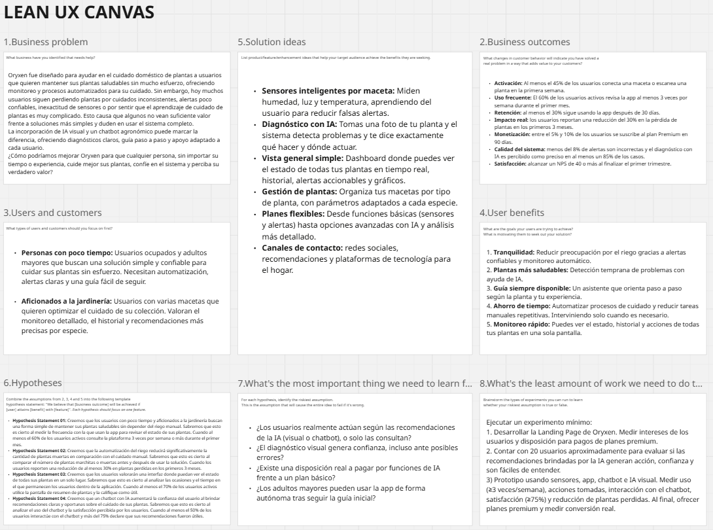
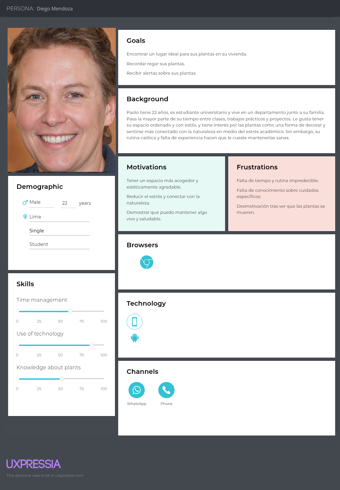
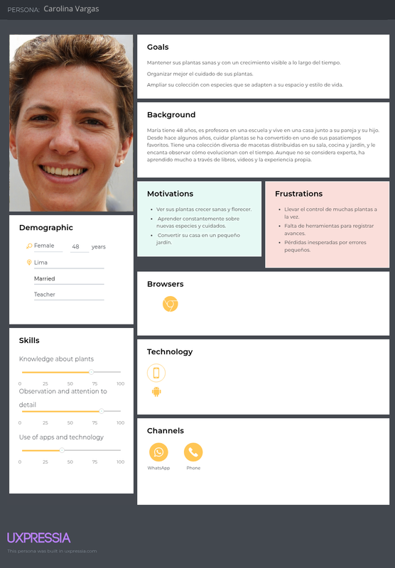
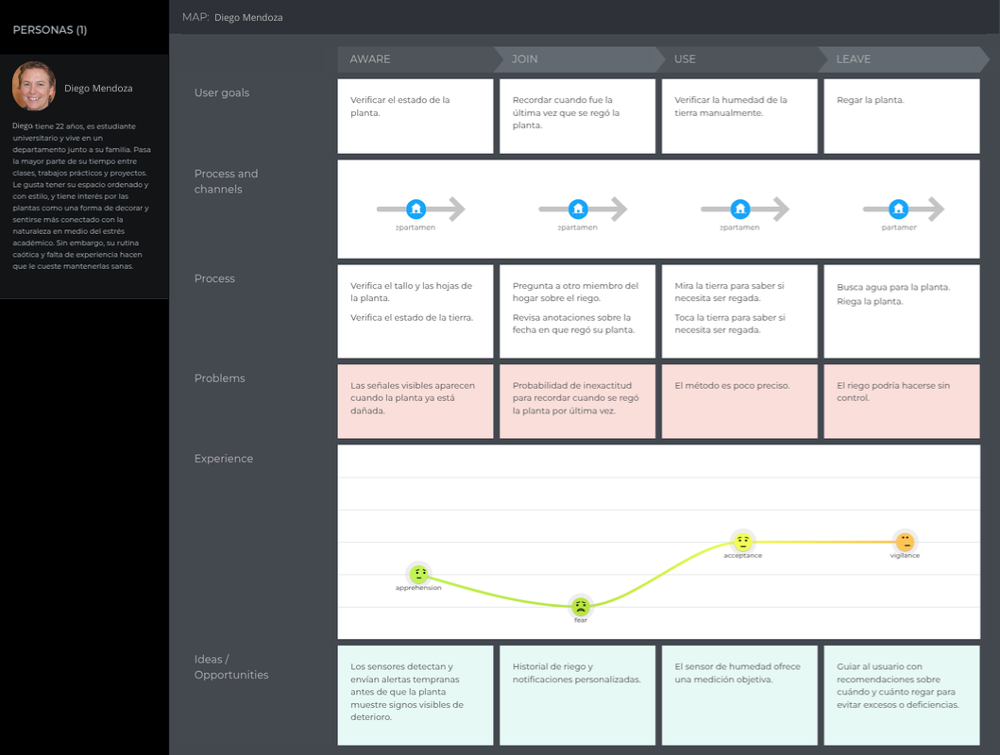
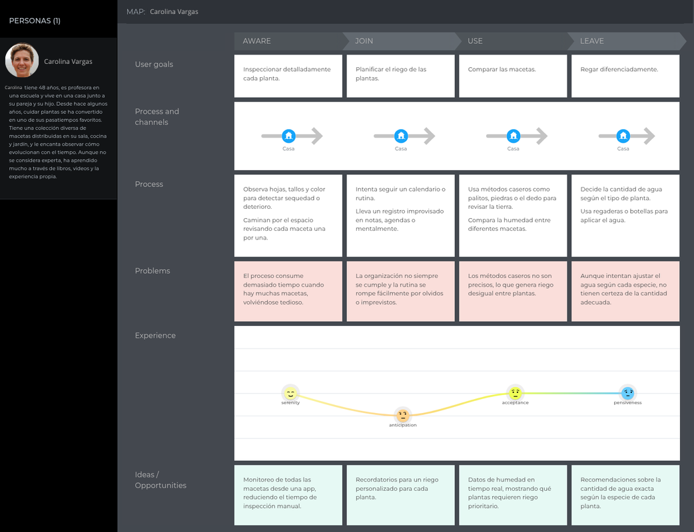
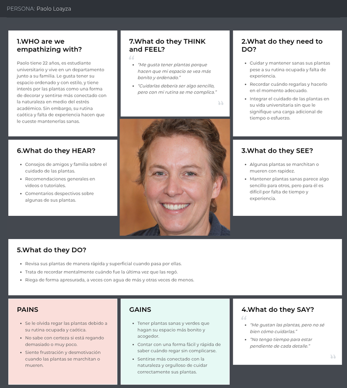
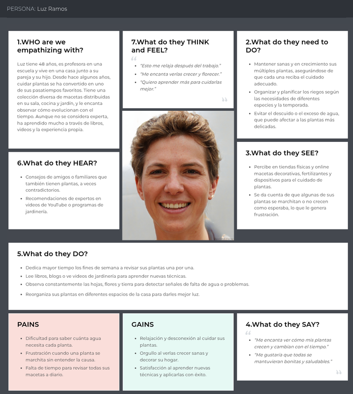

    
    </img> <strong>Universidad Peruana de Ciencias Aplicadas</strong> 
     
Ingeniería de Software

    
8vo Ciclo

     <strong>Arquitecturas de Software Emergentes</strong> 
     
Sección: 11770

    
Profesor: Christian Luis De Los Rios Fernandez
 

    <strong>"Informe del Trabajo Final"</strong> 
     <strong>Startup: GrassFarming</strong> 
     <strong>Producto: Oryxen</strong>  

    <h3 align="center">Integrantes:</h3>

    <table align="center">
        <tr>
            <th style="text-align:center;">Apellidos y Nombres</th>
            <th style="text-align:center;">Código</th>
        </tr>
        <tr>
            <td style="text-align:center;">Estrada Cajamune, Abraham Andrés</td>
            <td style="text-align:center;">U</td>
        </tr>
        <tr>
            <td style="text-align:center;">Nanfuñay Liza, Pedro Jesús</td>
            <td style="text-align:center;">U202215462</td>
        </tr>
        <tr>
            <td style="text-align:center;">Pachas Chavez, Alejandro Alberto</td>
            <td style="text-align:center;">U201917598</td>
        </tr>
        <tr>
            <td style="text-align:center;">Zevallos Linares, Alessandro Netto</td>
            <td style="text-align:center;">U</td>
        </tr>
    </table>
    

</body>

 
 
Abril, 2026

  

# Registro de Versiones del Informe

| Versión | Fecha | Autor | Descripción de Modificación |
| ----------- | ----------- | ----------- | ----------- |
| TB1 | 15/04/2026 |  |  |

# Project Report Collaboration Insights

URL de la organización del proyecto:

**TB1**

# Contenido

## Tabla de contenidos

[Registro de Versiones del Informe](#registro-de-versiones-del-informe)

[Project Report Collaboration Insights](#project-report-collaboration-insights)

[Student Outcome](#student-outcome)

### [Capítulo I: Introducción](#capítulo-i-introducción)

- [1.1 Startup Profile](#11-startup-profile)  
    - [1.1.1. Descripción de la Startup](#111-descripción-de-la-startup)  
    - [1.1.2. Perfiles de integrantes del equipo](#112-perfiles-de-integrantes-del-equipo)  
- [1.2. Solution Profile](#12-solution-profile)  
    - [1.2.1 Antecedentes y problemática](#121-antecedentes-y-problemática)  
    - [1.2.2 Lean UX Process](#122-lean-ux-process)  
        - [1.2.2.1. Lean UX Problem Statements](#1221-lean-ux-problem-statements)  
        - [1.2.2.2. Lean UX Assumptions](#1222-lean-ux-assumptions)  
        - [1.2.2.3. Lean UX Hypothesis Statements](#1223-lean-ux-hypothesis-statements)  
        - [1.2.2.4. Lean UX Canvas](#1224-lean-ux-canvas)  
- [1.3. Segmentos objetivo](#13-segmentos-objetivo)

### [Capítulo II: Requirements Elicitation & Analysis](#capítulo-ii-requirements-elicitation--analysis)

- [2.1. Competidores](#21-competidores)  
    - [2.1.1. Análisis competitivo](#211-análisis-competitivo)  
    - [2.1.2. Estrategias y tácticas frente a competidores](#212-estrategias-y-tácticas-frente-a-competidores)  
- [2.2. Entrevistas](#22-entrevistas)  
    - [2.2.1. Diseño de entrevistas](#221-diseño-de-entrevistas)  
    - [2.2.2. Registro de entrevistas](#222-registro-de-entrevistas)  
    - [2.2.3. Análisis de entrevistas](#223-análisis-de-entrevistas)  
- [2.3. Needfinding](#23-needfinding)  
    - [2.3.1. User Personas](#231-user-personas)  
    - [2.3.2. User Task Matrix](#232-user-task-matrix)  
    - [2.3.3. User Journey Mapping](#233-user-journey-mapping)  
    - [2.3.4. Empathy Mapping](#234-empathy-mapping)  
- [2.4. Big Picture EventStorming](#24-big-picture-eventstorming)  
- [2.5. Ubiquitous Language](#25-ubiquitous-language)  

### [Capítulo III: Requirements Specification](#capítulo-iii-requirements-specification)  

- [3.1. To-Be Scenario Mapping](#31-to-be-scenario-mapping)  
- [3.2. User Stories](#32-user-stories)  
- [3.3. Product Backlog](#33-product-backlog)  
- [3.4. Impact Mapping](#34-impact-mapping)

### [Capítulo IV: Strategic-Level Software Design](#capítulo-iv-strategic-level-software-design)

- [4.1. Strategic-Level Attribute-Driven Design](#41-strategic-level-attribute-driven-design)  
    - [4.1.1. Design Purpose.](#411-design-purpose)  
    - [4.1.2. Attribute-Driven Design Inputs](#412-attribute-driven-design-inputs)  
        - [4.1.2.1. Primary Functionality (Primary User Stories)](#4121-primary-functionality-primary-user-stories)  
        - [4.1.2.2. Quality attribute Scenarios](#4122-quality-attribute-scenarios)  
        - [4.1.2.3. Constraints](#4123-constraints)  
        - [4.1.3. Architectural Drivers Backlog](#413-architectural-drivers-backlog)  
        - [4.1.4. Architectural Design Decisions](#414-architectural-design-decisions)  
        - [4.1.5. Quality Attribute Scenario Refinements](#415-quality-attribute-scenario-refinements)  
- [4.2. Strategic-Level Domain-Driven Design](#42-strategic-level-domain-driven-design)  
    - [4.2.1. EventStorming](#421-eventstorming)  
    - [4.2.2. Candidate Context Discovery](#422-candidate-context-discovery)  
    - [4.2.3. Domain Message Flows Modeling](#423-domain-message-flows-modeling)  
    - [4.2.4. Bounded Context Canvases](#424-bounded-context-canvases)  
    - [4.2.5. Context Mapping](#425-context-mapping)  
- [4.3. Software Architecture](#43-software-architecture)  
    - [4.3.1. Software Architecture System Landscape Diagram](#431-software-architecture-system-landscape-diagram)  
    - [4.3.2. Software Architecture Context Level Diagrams](#432-software-architecture-context-level-diagrams)  
    - [4.3.3. Software Architecture Container Level Diagrams](#433-software-architecture-container-level-diagrams)  
    - [4.3.4. Software Architecture Deployment Diagrams](#434-software-architecture-deployment-diagrams)

#### [Conclusiones](#conclusiones)  
- [Conclusiones y recomendaciones.](#conclusiones-y-recomendaciones)  

#### [Bibliografía](#bibliografía)  

#### [Anexos](#anexos)
 

# Student Outcome

El curso contribuye al cumplimiento del Student Outcome ABET:
**ABET – EAC - Student Outcome 3**

**Criterio:** Capacidad de comunicarse efectivamente con un rango de audiencias.
En el siguiente cuadro se describe las acciones realizadas y enunciados de conclusiones por parte del grupo, que permiten sustentar el haber alcanzado el logro del ABET – EAC - Student Outcome 3.

| Criterio específico | Acciones Realizadas | Conclusiones |
| ------------------- | ------------------- | ------------ |
| Comunica oralmente sus ideas y/o resultados con objetividad a público de diferentes especialidades y niveles jerarquicos, en el marco del desarrollo de un proyecto en ingeniería. | |
| Comunica en forma escrita ideas y/o resultados con objetividad a público de diferentes especialidades y niveles jerarquicos, en el marco del desarrollo de un proyecto en ingeniería. | |

 

# Capítulo I: Introducción

## 1.1. Startup Profile

### 1.1.1. Descripción de la Startup

Nuestra startup **"GrassFarming"** se enfoca en simplificar el cuidado de plantas mediante una solución inteligente que automatiza tareas esenciales y brinda asistencia continua al usuario. Con nuestra plataforma **"Oryxen"**, nos centramos en ayudar a personas amantes de la jardinería con agendas ocupadas y a adultos mayores, quienes suelen enfrentar dificultades para mantener sus plantas saludables debido al olvido o la falta de tiempo. La solución integra funciones de riego automático, monitoreo con sensores y un chatbot inteligente que brinda recomendaciones personalizadas. A través de la interfaz, los usuarios podrán visualizar fácilmente el estado de todas sus plantas, recibir alertas y gestionar su cuidado de manera práctica y confiable. Con ello, se busca reducir la pérdida de plantas, mejorar la experiencia del usuario y aumentar su satisfacción.

**Misión:** Facilitar el cuidado de plantas mediante automatización e inteligencia artificial, ofreciendo una experiencia más accesible, práctica y confiable.

**Visión:** Convertirnos en una solución líder en el cuidado inteligente de plantas, promoviendo hogares más saludables y conectados con la naturaleza.

**Logotipo de la Startup:**

**Logotipo de la Solución:**

### 1.1.2. Perfiles de integrantes del equipo

| Integrante | Descripción | Conocimientos |
| ---------- | ----------- | ------------- |
| **Alejandro Alberto Pachas Chávez - u201917598**  | Mi nombre es Alejandro Alberto Pachas Chávez, tengo 24 años y actualmente curso la carrera de Ingeniería de Software. Me describo como una persona creativa, responsable y constante, con una fuerte disposición para colaborar en equipo. Mi objetivo es contribuir positivamente al grupo y alcanzar las metas propuestas. | Cuento con experiencia en lenguajes de programación como JavaScript, TypeScript y Go; además de desarrollo web utilizando frameworks como React y Next.js, y manejo de bases de datos tanto relacionales como no relacionales, incluyendo PostgreSQL y Firebase.  |
| **Pedro Jesús Nanfuñay Liza - u202215462**  | Mi nombre es Pedro Jesús Nanfuñay Liza, tengo 20 años y soy estudiante de la carrera de Ingeniería de Software. Me considero una persona creativa, responsable, perseverante y siempre dispuesto a trabajar en equipo. Espero aportar de manera positiva al equipo y cumplir con los objetivos establecidos. | Tengo conocimientos en lenguajes de programación como C++, Java y Python; en el desarrollo web con frameworks Angular y Primevue, y en base de datos relacionales y no relacionales como SQL y MongoDB. |

## 1.2. Solution Profile

### 1.2.1 Antecedentes y problemática

| LAS 5W y 2H | Pregunta | Descripción |
| ----------- | -------- | ----------- |
| What? | ¿Cuál es el problema? | Personas ocupadas, aficionados a la jardinería y adultos mayores no logran mantener un nivel de salud óptima en sus plantas (humedad, luz solar, etc.) por falta de tiempo u olvidos, lo que provoca plantas marchitas o muertas, frustración y menor bienestar. |
| When? | ¿Cuándo sucede el problema? | Ocurre de forma recurrente, especialmente durante semanas de alta carga laboral, viajes y en épocas de clima cambiante.                                                       |
| Where?  | ¿Dónde sucede el problema? | Principalmente en hogares, departamentos, oficinas, entre otros espacios, donde hay variedad de plantas y el control manual resulte complicado. |
| Why? | ¿Por qué sucede el problema? | Por la combinación de múltiples factores como la falta de tiempo, ausencia de recordatorios útiles y desconocimiento de necesidades específicas de riego y cuidado de cada especie. |
| Who? | ¿Qué llevara a las personas a usar nuestro producto? | Personas que desean mantener un cuidado óptimo de sus plantas con menos esfuerzo y que les permita cumplir con sus otras responsabilidades, con el objetivo de facilitar el proceso de cuidado y disminuir el tiempo necesario. |
| How? | ¿En qué condiciones los clientes usaran nuestro producto? | Los clientes usarán la aplicación y sensores en entornos con acceso a internet, para monitorear el estado de sus plantas, recibir alertas y automatizar el riego. |
| How Much? | ¿Con qué frecuencia o en qué cantidad se utilizará nuestro producto? | La frecuencia de uso será diario o semanal según la especie de la planta y estación del año. Las notificaciones pueden activarse varias veces al mes por maceta, y el sistema puede comenzar con pocas plantas y escalar según las necesidades del usuario. |

### 1.2.2 Lean UX Process

#### 1.2.2.1. Lean UX Problem Statements

Oryxen fue diseñado para ayudar a los usuarios a mantener sus plantas saludables mediante sensores que registran parámetros como la humedad, oxígeno, etc; para automatizar procesos de cuidado y brindar asistencia inteligente, reduciendo la carga del cuidado manual. 

Hemos observado que los usuarios, especialmente personas con agendas ocupadas y adultos mayores, no logran mantener un cuidado constante, lo que provoca la pérdida de plantas, frustración y una menor continuidad en la creación de áreas verdes.

¿Cómo podríamos mejorar Oryxen para que nuestros clientes tengan más éxito según su disponibilidad de tiempo y conocimientos previos en el cuidado de plantas, incrementando el interés de las personas por cultivar más plantas y reduciendo la carga de cuidado manual?

#### 1.2.2.2. Lean UX Assumptions

**Business Assumptions:**

1. Creo que mis clientes necesitan mantener sus plantas saludables sin depender de recordatorios manuales o tiempo constante.
2. Estas necesidades puede ser solucionadas con un sistema inteligente que automatice los cuidados y monitoree las plantas mediante sensores e IA.
3. Mis primeros clientes son (o serán) personas con agendas ocupadas, adultos mayores y aficionados a la jardinería.
4. El valor número 1 que un cliente quiere obtener de mi servicio es mantener sus plantas vivas sin esfuerzo y ver su estado mediante un panel de control.
5. El cliente también puede obtener estos beneficios adicionales: Automatizar procesos de cuidado, ahorrar tiempo, obtener bienestar y aprender sobre el cuidado de plantas.
6. Obtendré la mayoría de mis clientes a través de redes sociales, recomendaciones (boca a boca) y marketplaces de tecnología/hogar inteligente.
7. Ganaré dinero a través de planes premium y paquetes con objetos que ayudarán al cliente a entender mejor el proceso de cuidado de plantas.
8. Mi principal competencia en el mercado serán aplicaciones de recordatorio de riego y sistemas básicos de riego automático.
9. Los venceremos por integrar automatización de cuidado con sensores y la implementación de un chatbot impulsado con IA en una sola solución simple y accesible.
10. Mi mayor riesgo de producto es que los usuarios no perciban suficiente valor frente a soluciones más simples o no adopten el hardware.
11. Resolveremos esto a través de una experiencia fácil de usar, funciones claras e intuitivas, soporte técnico constante y demostración de los resultados de la solución en casos reales.
12. Otras suposiciones que tenemos que podrían resultar falsas serían que los usuarios no estén dispuestos a pagar por los planes premium de la solución y o que confíen demasiado en la automatización para el cuidado de sus plantas.

**User Assumptions:**

1. ¿Quién es el usuario? Personas ocupadas, amantes de la jardinería y personas de la tercera edad que desean gestionar de manera efectiva la salud de sus plantas.
2. ¿Dónde encaja nuestro producto en su trabajo o vida? Se integra en el flujo de vida diaria de cada cliente, permitiendo revisar y analizar la información de sus plantas cuando lo deseen.
3. ¿Qué problemas tiene nuestro producto y cómo los resolvemos? Problema: Arduo cuidado manual y uso de tiempo para el cuidado de plantas. Solución: Plataforma unificada con automatización y acceso centralizado a toda la información.
4. ¿Cuándo y cómo es usado nuestro producto? Durante el hábito de cultivar plantas, donde los clientes buscan mantener saludables a sus plantas.
5. ¿Qué características son importantes? Interfaz intuitiva y responsive, sincronización en tiempo real e integración con sistemas existentes.
6. ¿Cómo debe verse y comportarse nuestro producto? Diseño limpio y profesional, navegación simple, tiempo de respuesta rápido y accesible desde múltiples dispositivos.

**Priorización de suposiciones:**

Siguiendo la metodología Lean UX de Jeff Gothelf, priorizamos nuestras suposiciones con base en dos criterios principales: nivel de riesgo y nivel de conocimiento. El objetivo es identificar aquellas suposiciones de alto riesgo y bajo conocimiento para validarlas primero a través de experimentos y pruebas con usuarios.

**Suposiciones de Alta Prioridad (Alto Riesgo + Bajo Conocimiento):**

1. Los usuarios realmente adoptarán una solución de cuidado automático si perciben que les ahorra tiempo y reduce el trabajo manual.
2. Los adultos mayores y personas con agendas ocupadas confiarán en un sistema automatizado para el cuidado de sus plantas.
3. Los usuarios valorarán una interfaz que muestre el estado de todas sus plantas de forma clara y centralizada.
4. La integración de sensores, riego automático y funciones con IA será percibida como útil y no como compleja.

**Suposiciones de prioridad media (Riesgo medio + conocimiento medio):**

5. Los usuarios estarán dispuestos a leer notificaciones y alertas frecuentes para monitorear sus plantas.
6. La solución será útil tanto para personas con pocas plantas como para quienes tienen varias.
7. Los usuarios confiarán en las recomendaciones del chatbot para tomar decisiones de cuidado.
8. La automatización del riego será suficiente para reducir significativamente la cantidad de plantas muertas.

**Suposiciones de baja prioridad (Bajo riesgo + alto conocimiento):**

9. Los usuarios prefieren interfaces simples, intuitivas y fáciles de entender.
10. La visualización del estado de las plantas en una sola plataforma mejora la experiencia de uso.
11. Los usuarios valoran recibir recordatorios y recomendaciones personalizadas.
12. Los dispositivos móviles y la conectividad a internet son accesibles para la mayoría de nuestros usuarios.

Estas suposiciones de alta prioridad serán las primeras en validarse mediante entrevistas, pruebas de concepto y prototipos, antes de proceder con el desarrollo completo de Oryxen.

#### 1.2.2.3. Lean UX Hypothesis Statements

- **Hypothesis Statement 01:**  
Creemos que los usuarios amantes de la jardinería con agendas ocupadas y los adultos mayores buscan una forma simple de mantener sus plantas saludables sin depender del riego manual.
Sabremos que esto es cierto al medir la frecuencia con la que usan la app para revisar el estado de sus plantas.
Cuando al menos el 60% de los usuarios activos consulte la plataforma 3 veces por semana o más durante el primer mes.

- **Hypothesis Statement 02:**  
Creemos que la automatización del riego reducirá significativamente la cantidad de plantas muertas en comparación con el cuidado manual.
Sabremos que esto es cierto al comparar el número de plantas marchitas o muertas antes y después de usar la solución.
Cuando los usuarios reporten una reducción de al menos 30% en plantas perdidas en los primeros 3 meses.

- **Hypothesis Statement 03:**  
Creemos que los usuarios valorarán una interfaz donde puedan ver el estado de todas sus plantas en un solo lugar.
Sabremos que esto es cierto al analizar las ocasiones y el tiempo en el que permanecen los usuarios dentro de la aplicación.
Cuando al menos el 70% de los usuarios activos utilice la pantalla de resumen de plantas y la califique como útil.

- **Hypothesis Statement 04:**  
Creemos que un chatbot con IA aumentará la confianza del usuario al brindar recomendaciones claras y oportunas sobre el cuidado de sus plantas.
Sabremos que esto es cierto al analizar el uso del chatbot y la satisfacción percibida por los usuarios.
Cuando al menos el 50% de los usuarios interactúe con el chatbot y más del 75% declare que sus recomendaciones fueron útiles.

#### 1.2.2.4. Lean UX Canvas

## 1.3. Segmentos Objetivo

Para asegurar el éxito de Oryxen, hemos identificado dos segmentos clave que serán el foco principal de nuestras estrategias de desarrollo y marketing. Estos segmentos representan a nuestros usuarios ideales y nos permitirán adaptar nuestras funcionalidades y servicios a sus necesidades específicas, maximizando así el impacto de la plataforma.

- **Segmento Objetivo 1 – Personas ocupadas:** Edades comprendidas entre 25 y 45 años que viven en zonas urbanas y llevan un ritmo de vida acelerado. Suelen tener entre 1 y 5 plantas en casa o en su lugar de trabajo, que utilizan para embellecer sus entornos, reducir el estrés y fomentar su bienestar. Les gusta tener plantas, pero no siempre tienen el tiempo o la constancia para cuidarlas bien, lo que muchas veces termina en frustración cuando se deterioran o mueren. Buscan una solución práctica que funcione casi sola y les dé tranquilidad.

- **Segmento Objetivo 2 – Aficionados a la jardinería:** Personas de múltiples rangos de edad que disfrutan del cuidado de sus plantas y suelen tener entre 5 y 20 de distintas especies. Les interesa que sus plantas estén en las mejores condiciones posibles, por lo que valoran entender aspectos como el riego, la humedad o el tipo de suelo. Buscan un mayor control y seguimiento para optimizar el cuidado de sus plantas.

# Capítulo II: Requirements Elicitation & Analysis

## 2.1. Competidores

En el mercado de soluciones digitales para el cuidado de plantas, se han identificado tres competidores representativos que cubren distintos frentes de valor: desde aplicaciones móviles con IA hasta electrodomésticos de jardinería inteligente. Cada uno aborda parcialmente el problema que **Oryxen** resuelve de forma integral, lo que permite posicionar con claridad las ventajas de nuestra propuesta.

**Planta (Strömming & Löf AB)**  
Aplicación móvil sueca con más de 10 millones de descargas que asiste a los usuarios en el cuidado de sus plantas mediante recordatorios, identificación por foto con IA, medidor de luz con la cámara del celular y una extensa base de datos de especies. Es un competidor directo en el plano **software** pero no integra hardware, por lo que depende de la memoria y disciplina del usuario para ejecutar cada tarea. Su plan premium se comercializa por suscripción anual a bajo costo.

**Click & Grow (Smart Garden 3 / 9 / 25)**  
Compañía estonia que ofrece jardines inteligentes de interior en formato de electrodoméstico: una maceta cerrada con riego automatizado, luces LED de crecimiento y cápsulas propietarias ("plant pods") con semillas preparadas. Es un competidor **hardware** de gama media-alta, pero orientado exclusivamente al cultivo de hierbas, vegetales y flores dentro de su propio ecosistema cerrado; no permite monitorear las plantas que el usuario ya tiene en casa.

**Gardyn (Home Kit 3.0 con Kelby AI)**  
Startup estadounidense que vende un huerto vertical hidropónico para el hogar, controlado por una IA propia llamada **Kelby** que utiliza cámaras integradas para detectar el estado de cada planta y recomendar acciones. Funciona con un modelo de suscripción ("Gardyn Membership") que incluye envío recurrente de yCubes (semillas) y soporte. Representa el segmento **premium + IA** y es el competidor más cercano en filosofía, aunque a un precio muy elevado y atado a su propio formato de cultivo.

**¿Por qué llevar a cabo este análisis?**  
**Pregunta clave:** ¿Cómo se posiciona **Oryxen** frente a una app popular sin hardware (Planta), un electrodoméstico de cultivo cerrado (Click & Grow) y una solución premium con IA y cámara (Gardyn), considerando propuesta de valor, mercado objetivo, modelo de negocio y capacidades tecnológicas?

### 2.1.1. Análisis competitivo

<table border="1" cellspacing="0" cellpadding="5">
  <tr>
    <th colspan="5">Competitive Analysis Landscape - Oryxen (GrassFarming)</th>
  </tr>
  <tr>
    <td>¿Por qué llevar a cabo este análisis?</td>
    <td colspan="4">Identificar fortalezas y debilidades frente a competidores de software (apps de cuidado con IA), electrodomésticos de cultivo cerrado y huertos inteligentes premium, con el fin de posicionar a Oryxen como la única solución modular que convierte las plantas que el usuario ya posee en plantas inteligentes, combinando sensores, riego automático y un chatbot con IA a un precio accesible.</td>
  </tr>
  <tr>
    <td colspan="5"></td>
  </tr>
  <tr>
    <th>(En la cabecera colocar por cada competidor nombre y logo)</th>
    <th>Oryxen (GrassFarming)</th>
    <th>Competidor 1: Planta</th>
    <th>Competidor 2: Click & Grow</th>
    <th>Competidor 3: Gardyn</th>
  </tr>

  <tr>
    <th colspan="5" style="text-align: center;"><strong>Perfil</strong></th>
  </tr>
  <tr>
    <td>Overview</td>
    <td>Solución IoT modular que convierte las macetas existentes del usuario en plantas inteligentes mediante sensores, riego automático, chatbot con IA y panel de control web/móvil.</td>
    <td>Aplicación móvil con recordatorios, identificación de plantas por foto, medidor de luz vía cámara y base de datos de especies. Solo software.</td>
    <td>Electrodoméstico de jardinería indoor con riego automatizado, luces LED y cápsulas propietarias de semillas.</td>
    <td>Huerto vertical hidropónico premium con IA "Kelby" y cámaras integradas, controlado desde una app.</td>
  </tr>
  <tr>
    <td>Ventaja competitiva</td>
    <td>Combina automatización + IA conversacional sobre las plantas que el usuario ya tiene. Sensores modulares de bajo costo y chatbot entrenado para asistir de forma personalizada.</td>
    <td>Enorme base de usuarios, marca consolidada y una experiencia de app pulida con identificación de plantas por IA.</td>
    <td>Jardín llave en mano: el usuario solo conecta el aparato y añade agua cada varias semanas.</td>
    <td>IA con visión por cámara que detecta en tiempo real el estado de cada planta; experiencia "set and forget" de gama alta.</td>
  </tr>
  <tr>
    <td>¿Qué valor ofrece a los clientes?</td>
    <td>Tranquilidad, ahorro de tiempo y reducción de pérdidas para las plantas que ya poseen, con acompañamiento por IA al nivel de un experto.</td>
    <td>Educación básica y recordatorios para usuarios principiantes, a un costo muy bajo.</td>
    <td>Posibilidad de cultivar hierbas y vegetales frescos en casa sin experiencia previa.</td>
    <td>Producción de alimentos en casa con mínimo esfuerzo y una experiencia tech-premium guiada por IA.</td>
  </tr>

  <tr>
    <th colspan="5" style="text-align: center;"><strong>Perfil de Marketing</strong></th>
  </tr>
  <tr>
    <td>Mercado objetivo</td>
    <td>Personas ocupadas (25–45) y aficionados a la jardinería en zonas urbanas, así como adultos mayores que buscan asistencia continua para sus plantas ya existentes.</td>
    <td>Usuarios principiantes y casuales que quieren recordatorios y aprender sobre sus plantas desde el celular.</td>
    <td>Usuarios de clase media-alta interesados en cocina casera, hierbas frescas y decoración indoor.</td>
    <td>Hogares tech-premium y foodies interesados en autoabastecimiento y hidroponia en EE. UU.</td>
  </tr>
  <tr>
    <td>Estrategias de marketing</td>
    <td>Redes sociales, creadores de contenido de jardinería, alianzas con viveros locales y campañas en marketplaces de hogar inteligente.</td>
    <td>App store optimization, freemium agresivo y marketing viral en TikTok/Instagram.</td>
    <td>E-commerce propio, presencia en retailers de diseño y campañas en sostenibilidad.</td>
    <td>Publicidad digital, ferias tecnológicas (CES) y modelo D2C con membresía.</td>
  </tr>

  <tr>
    <th colspan="5" style="text-align: center;"><strong>Perfil de Producto</strong></th>
  </tr>
  <tr>
    <td>Productos & Servicios</td>
    <td>Kit de sensores IoT modulares + módulo de riego automático + aplicación móvil/web + chatbot con IA + planes básico y premium por suscripción.</td>
    <td>Aplicación móvil iOS/Android con plan gratuito y Planta Premium.</td>
    <td>Jardín inteligente cerrado (Smart Garden 3/9/25) + cápsulas de semillas recurrentes.</td>
    <td>Home Kit 3.0 hidropónico + Gardyn Membership + yCubes (semillas) + IA Kelby.</td>
  </tr>
  <tr>
    <td>Precios & Costos</td>
    <td>Kit inicial accesible + suscripción mensual (plan básico gratuito, premium con IA y sensores adicionales).</td>
    <td>App gratuita + Planta Premium ≈ USD 30/año.</td>
    <td>USD 100–600 según tamaño + cápsulas de semillas recurrentes (USD 10–30 por set).</td>
    <td>USD 700+ por el Home Kit + membresía mensual con yCubes incluidos.</td>
  </tr>
  <tr>
    <td>Canales de distribución</td>
    <td>App móvil + Plataforma web + alianzas con viveros y tiendas de hogar inteligente en Perú/LATAM.</td>
    <td>App Store y Google Play (global).</td>
    <td>Sitio propio, Amazon y retail de decoración (internacional).</td>
    <td>Sitio propio D2C (principalmente EE. UU.).</td>
  </tr>

  <tr>
    <th colspan="5" style="text-align: center;"><strong>Análisis SWOT</strong></th>
  </tr>
  <tr>
    <td>Fortalezas</td>
    <td>
      <ul>
        <li>Único que combina sensores + riego automático + chatbot con IA</li>
        <li>Trabaja sobre las plantas y macetas que el usuario ya posee</li>
        <li>Sensores modulares de bajo costo</li>
        <li>Plan freemium accesible para LATAM</li>
      </ul>
    </td>
    <td>
      <ul>
        <li>Marca consolidada y comunidad grande</li>
        <li>IA de identificación por foto muy madura</li>
        <li>Costo mínimo para el usuario final</li>
      </ul>
    </td>
    <td>
      <ul>
        <li>Automatización total del cultivo</li>
        <li>Diseño atractivo y llave en mano</li>
        <li>Experiencia educativa para principiantes</li>
      </ul>
    </td>
    <td>
      <ul>
        <li>Visión por cámara + IA para diagnóstico</li>
        <li>Modelo de suscripción recurrente consolidado</li>
        <li>Branding tecnológico premium</li>
      </ul>
    </td>
  </tr>
  <tr>
    <td>Debilidades</td>
    <td>
      <ul>
        <li>Startup nueva sin posicionamiento consolidado</li>
        <li>Presupuesto de marketing inicial limitado</li>
        <li>Requiere validación del hardware a mayor escala</li>
      </ul>
    </td>
    <td>
      <ul>
        <li>No tiene hardware: depende totalmente del usuario para ejecutar tareas</li>
        <li>No riega, no mide humedad real del suelo</li>
      </ul>
    </td>
    <td>
      <ul>
        <li>Ecosistema cerrado: solo funciona con sus cápsulas</li>
        <li>No sirve para las plantas existentes del usuario</li>
        <li>Costo recurrente de semillas propietarias</li>
      </ul>
    </td>
    <td>
      <ul>
        <li>Precio muy elevado</li>
        <li>Disponibilidad geográfica restringida</li>
        <li>Formato único (no se adapta a macetas)</li>
      </ul>
    </td>
  </tr>
  <tr>
    <td>Oportunidades</td>
    <td>
      <ul>
        <li>Crecimiento del hogar inteligente en LATAM</li>
        <li>Auge de la jardinería urbana post-pandemia</li>
        <li>Adopción masiva de asistentes con IA</li>
      </ul>
    </td>
    <td>
      <ul>
        <li>Monetizar su base con funciones premium</li>
        <li>Extender hacia integraciones con hardware de terceros</li>
      </ul>
    </td>
    <td>
      <ul>
        <li>Tendencia "grow your own food"</li>
        <li>Expansión a mercados emergentes</li>
      </ul>
    </td>
    <td>
      <ul>
        <li>Expansión internacional</li>
        <li>Alianzas con retailers de alimentos orgánicos</li>
      </ul>
    </td>
  </tr>
  <tr>
    <td>Amenazas</td>
    <td>
      <ul>
        <li>Entrada de grandes players (Xiaomi, Google Home) al segmento</li>
        <li>Fallas de hardware que erosionen la confianza del usuario</li>
        <li>Apps gratuitas con IA como alternativa "suficiente"</li>
      </ul>
    </td>
    <td>
      <ul>
        <li>Aparición de competidores con hardware integrado</li>
        <li>Fatiga de suscripciones</li>
      </ul>
    </td>
    <td>
      <ul>
        <li>Usuarios que prefieren soluciones abiertas y modulares</li>
        <li>Alternativas más baratas en Amazon</li>
      </ul>
    </td>
    <td>
      <ul>
        <li>Competencia de soluciones modulares más económicas</li>
        <li>Sensibilidad al precio en contextos de recesión</li>
      </ul>
    </td>
  </tr>
</table>

### 2.1.2. Estrategias y tácticas frente a competidores

**Estrategias generales de Oryxen**
- Diferenciación por la **integración de automatización + IA conversacional** aplicada sobre las plantas que el usuario ya posee, sin obligarlo a migrar a un ecosistema cerrado.
- Ecosistema **hardware + software modular**: sensores independientes, riego automatizado y panel centralizado accesible desde web y móvil.
- Modelo de negocio **freemium** con un plan gratuito para usuarios nuevos y un plan premium con chatbot avanzado y sensores adicionales.
- Posicionamiento como un **aliado cotidiano** para hogares ocupados y aficionados latinoamericanos, con precios adaptados al mercado regional.

---

**Tácticas frente a competidores**

| Competidor | Estrategia | Táctica |
|------------|------------|---------|
| **Planta** | Complementar y superar el "solo software" con hardware | Mostrar que los recordatorios sin sensores siguen dependiendo del usuario; Oryxen ejecuta, no solo recuerda. Ofrecer importación de especies desde apps de recordatorio como puente de migración. |
| **Click & Grow** | Diferenciarse del ecosistema cerrado | Comunicar que Oryxen funciona con cualquier maceta y planta que el usuario ya tenga, sin depender de cápsulas propietarias ni de un solo tipo de cultivo. |
| **Gardyn** | Competir por valor frente a una solución premium y regional | Ofrecer capacidades de IA equivalentes (diagnóstico conversacional por especie) a una fracción del costo y con disponibilidad en LATAM, sin obligar al usuario a comprar un huerto vertical completo. |

## 2.2. Entrevistas

### 2.2.1. Diseño de entrevistas

**Preguntas generales (aplicables a todos los entrevistados):**

- Edad, género, distrito de residencia.
- Ocupación y nivel de estudios.
- ¿Qué dispositivos usas con mayor frecuencia (celular, tablet, laptop)?
- ¿En qué canales digitales pasas más tiempo (redes sociales, apps de productividad, etc.)?
- ¿Qué marcas o productos tecnológicos usas y confías?

---

**Segmento 1 – Personas ocupadas**

Objetivo: entender cómo encaja Oryxen en la vida diaria de personas con poco tiempo disponible y qué tanto valoran la automatización del cuidado de plantas.

- ¿Con qué frecuencia tienes dificultades para mantener el cuidado constante de tus plantas (riego, luz, etc.)?
- ¿Qué sientes o haces cuando notas que una planta se está marchitando?
- ¿Cuántas plantas tienes actualmente y dónde las mantienes (casa, oficina, balcón, etc.)?
- ¿Cuánto tiempo dedicas al cuidado de tus plantas en una semana típica?
- ¿Qué es lo más difícil para ti al cuidar tus plantas? (ej. saber cuándo regar, identificar problemas, falta de tiempo)
- ¿Has perdido plantas anteriormente? ¿Por qué crees que ocurrió?
- ¿Usas actualmente alguna app, recordatorio o método para cuidar tus plantas? Si es sí, ¿te funcionó o no y por qué?
- ¿Qué tan útil te parecería que un sistema riegue automáticamente tus plantas cuando lo necesiten?
- Si pudieras tomar una foto de tu planta y recibir un diagnóstico con recomendaciones claras, ¿lo usarías? ¿Por qué?
- ¿Confiarías en recomendaciones generadas por una IA para cuidar tus plantas? ¿Qué necesitarías para confiar en ellas?
- ¿Estarías dispuesto(a) a instalar sensores en tus macetas? ¿Qué te detendría?
- ¿Pagarías por una solución que mantenga tus plantas saludables automáticamente? ¿Cuánto aproximadamente?

---

**Segmento 2 – Aficionados a la jardinería**

Objetivo: descubrir su nivel de compromiso, el detalle con el que cuidan sus plantas y su apertura a integrar tecnología avanzada en su rutina.

- ¿Cuántas plantas tienes actualmente y qué tipos te interesan más?
- ¿Cómo organizas el cuidado de tus plantas (riego, luz, seguimiento)?
- ¿Cuál es el mayor reto que enfrentas al cuidar varias plantas?
- ¿Has perdido plantas por errores de cuidado? ¿Qué crees que pasó?
- ¿Te gustaría llevar un seguimiento del estado de tus plantas (historial, cambios, evolución)?
- ¿Qué tan útil te parecería ver datos como humedad, temperatura o estado en tiempo real?
- Si pudieras tomar una foto y recibir un diagnóstico con recomendaciones específicas, ¿lo usarías?
- ¿Qué nivel de confianza tendrías en recomendaciones hechas por una IA?
- ¿Estarías dispuesto(a) a usar sensores en tus macetas para mejorar el cuidado? ¿Por qué?
- ¿Pagarías por funciones avanzadas (IA, análisis, recomendaciones)? ¿Qué tipo de pago prefieres?

### 2.2.2. Registro de entrevistas

#### Segmento 1: Personas ocupadas

#### Segmento 2: Aficionados a la jardinería

**Entrevista 1:**

- Nombres y apellidos: Renzo Fabricio Abad La Torre
- Edad: 21 años
- Distrito de residencia: Comas, Lima
- Ocupación: Estudiante universitario
- Estado civil: Soltero
- Composición familiar: Vive con sus padres
- Inicio de la entrevista: 0:03
- Fin de la entrevista: 4:23

**Registro visual de la entrevista:**

**Resumen descriptivo de la entrevista:**

El entrevistado, Renzo Fabricio Abad La Torre , es un estudiante universitario que nos comparte su afición hacia el cuidado de plantas. Él nos comenta el proceso por el que pasa para cuidar de manera correcta de sus plantas de interiores, contanto actualmente con 10 de este tipo, que aunque sea de su agrado, considera que le toma más tiempo del que le gustaría.

En relación al cuidado de sus plantas, indica que riegua un aprox de 3-4 veces al día. Así mismo, considera que el mayor reto que enfrenta es encontrar un lugar idóneo para el crecimiento de sus plantas y monitorear su salud manualmente. Además, indica que tuvo plantas que se marchitaron debido al descuido por atender sus demás responsabilidades.

Respecto al seguimiento de cuidado de plantas, considera que sería una útil para él una aplicación que lo apoye en este proceso a través de una interfaz general para que sea más sencillo y rápido leer la información. Así mismo, considera que herramientas como los sensores impulsados con IAs son herramientas muy útiles y confía en este tipo de herramientas. Por lo que estaría dispuesto a considerar el punto de vista de la IA. Estos datos nos indican que tiene interés en este tipo de herramientas y en nuestra solución.

**Características identificadas a partir de la entrevista:**

- Practica el cuidado de plantas como hobby.
- Mantiene un cuidado manual para sus plantas de interiores.
- Ha experimentado dificultades para monitorear la salud de sus plantas.
- Busca optimizar el proceso de cuidado para que sea más sencillo y rápido.
- Valora herramientas impulsadas con IA.
- Considera importante la simplicidad y diseño de en una aplicación.

### 2.2.3. Análisis de entrevistas

**Análisis del Segmento 1 – Personas ocupadas:**

Las entrevistas revelan que los usuarios de este segmento valoran tener plantas por el bienestar y la estética que aportan a sus espacios, pero enfrentan dificultades constantes para cuidarlas debido a la falta de tiempo, el olvido y, en algunos casos, el espacio limitado en departamentos y oficinas. Los entrevistados comparten un patrón común: olvidan regar sus plantas varias veces al mes, y aunque algunos utilizan recordatorios genéricos, estos no son suficientes para evitar la pérdida.

Todos los entrevistados usan dispositivos tecnológicos con fluidez (smartphone y laptop) y muestran interés en una solución digital que facilite el cuidado. Coinciden en que Oryxen sería muy útil para automatizar el riego y emitir recordatorios contextuales, reduciendo así el esfuerzo y los olvidos. Varios manifestaron disposición para pagar por una membresía siempre que el costo sea razonable y los beneficios sean claros.

En síntesis, las entrevistas confirman una necesidad clara: las personas quieren cuidar sus plantas, pero requieren una herramienta inteligente que automatice tareas y les ayude a mantenerlas saludables sin demandar tiempo ni atención constante. Oryxen se presenta como una solución práctica, eficiente y emocionalmente valiosa para este segmento.

**Análisis del Segmento 2 – Aficionados a la jardinería:**

Las entrevistas con aficionados reflejan distintos perfiles de usuarios con un interés común: el gusto por las plantas y el deseo de cuidarlas adecuadamente, aunque todos enfrentan dificultades relacionadas con el riego, los olvidos y la falta de información sobre las condiciones ambientales. Se identificaron usuarios metódicos y previsores que cuidan entre 7 y 15 macetas y buscan una herramienta que les permita registrar el progreso de sus plantas, visualizar estadísticas y anticiparse a problemas climáticos.

Los aficionados más jóvenes destacan por su buen manejo tecnológico y su preferencia por apps visuales, sencillas y prácticas, con alertas personalizadas y monitoreo de humedad en tiempo real. Algunos prefieren pagar una sola vez por el hardware, mientras que otros valoran el acceso a funciones avanzadas mediante una suscripción mensual, siempre que la herramienta ofrezca beneficios tangibles y sea fácil de usar.

Los perfiles más tradicionales, aunque menos expertos en tecnología, están abiertos a adoptarla si la solución es clara, intuitiva y les ayuda a mejorar sus hábitos de cuidado. Les atraen especialmente las apps con gráficos, estadísticas y notificaciones visuales.

En conjunto, las entrevistas evidencian que los principales retos en el cuidado de las plantas son la falta de constancia, los errores de riego y la influencia del clima, y que existe una alta disposición a adoptar soluciones tecnológicas siempre que sean simples, visuales y realmente útiles. Oryxen se presenta como una solución ideal al ofrecer un sistema IoT capaz de automatizar recordatorios, monitorear el estado de las plantas y brindar información contextual mediante su chatbot con IA, adaptándose a distintos tipos de usuarios: desde los más experimentados y metódicos hasta los más tradicionales o principiantes.

## 2.3. Needfinding

A través de la observación, entrevistas y análisis, se busca profundizar en las problemáticas que enfrentan nuestros segmentos objetivos. Este apartado se enfoca en recopilar información relevante que sirva como base para la creación del User Persona, User Task Matrix, User Journey Maps y Empathy Mapping.

### 2.3.1. User Personas

Se trata de una representación ficticia de un usuario, basada en datos reales de comportamientos observados. Estas representaciones incluyen detalles como edad, ocupación, motivaciones y frustraciones, lo que ayuda a orientar la toma de decisiones y a crear productos más efectivos, enfocados en las necesidades reales del usuario. La herramienta que se utilizó para mostrar la información fue UXPressia.

**Segmento Objetivo 1: Personas ocupadas**

Este perfil refleja a un joven profesional que busca incorporar plantas a su rutina como una forma de mejorar su espacio de trabajo y reducir el estrés, pero que enfrenta obstáculos por su falta de tiempo, experiencia y constancia. Está abierto a usar tecnología que le facilite el cuidado y le brinde recordatorios prácticos, sin complicaciones adicionales en su día a día.

**Persona:** Diego Mendoza

**Segmento Objetivo 2: Aficionados a la jardinería**

Este perfil refleja a una persona apasionada por las plantas, que ha convertido el cuidado de su colección en parte de su rutina y bienestar diario. Tiene conocimientos básicos o intermedios, disfruta investigando sobre especies, y encuentra satisfacción en ver crecer sus plantas. Aunque ya tiene experiencia, busca herramientas que le ayuden a organizar mejor los cuidados, registrar sus avances y seguir aprendiendo.

**Persona:** Carolina Vargas

### 2.3.2. User Task Matrix

El User Task Matrix permite identificar y comparar los procesos clave de cada segmento, destacando sus similitudes en cuanto a frecuencia e importancia.

|**Necesidad / Función**|**Importancia (Personas ocupadas)**|**Frecuencia (Personas ocupadas)**|**Importancia (Aficionados)**|**Frecuencia (Aficionados)**|
| :- | :- | :- | :- | :- |
|Revisar manualmente la humedad del suelo |Alta|Media|Alta|Media|
|Interpretar señales visuales de la planta |Alta|Baja|Alta|Media|
|Regar las plantas en horarios fijos |Media|Baja|Media|Media|
|Consultar fuentes variadas para saber cuándo y cuánto regar|Media|Baja|Alta|Alta|
|Revisar el clima manualmente para ajustar el riego |Media|Baja|Media|Media|
|Tomar notas manuales del riego |Baja|Baja|Media|Media|
|Recorrer todas las macetas para revisar planta por planta|Baja|Baja|Alta|Alta|

En la matriz presentada, se pueden observar las siguientes tareas con mayor frecuencia e importancia:

- **Personas ocupadas**:

  - **Revisar manualmente la humedad del suelo**  
    Funcionalidad **más crítica**, con **importancia alta y frecuencia media**.  
    Las personas ocupadas necesitan un sistema confiable para medir la humedad del suelo, facilitando el riego de sus plantas sin depender de su disponibilidad.

  - **Regar las plantas en horarios fijos y revisar el clima manualmente**  
    Tareas de **media importancia** pero **frecuencia baja**. Son actividades que los usuarios intentan cumplir, pero que olvidan fácilmente.

  - **Tomar notas manuales del riego**  
    De **importancia y frecuencia baja**. No forman parte de su rutina diaria, por lo que pueden ofrecerse como funciones secundarias u opcionales dentro de Oryxen.

- **Aficionados a la jardinería**:

  - **Consultar fuentes variadas para saber cuándo y cuánto regar**  
    Funcionalidad **más crítica**, con **alta importancia y frecuencia**.  
    Requieren herramientas externas para garantizar el cuidado óptimo de sus plantas, por lo que valoran que Oryxen centralice esta información.

  - **Interpretar señales visuales de la planta**  
    Tareas de **alta importancia** pero **frecuencia media**.  
    Requieren experiencia y apoyo visual para comprobar el estado real de cada especie.

  - **Recorrer todas las macetas para revisar planta por planta**  
    Actividad de **alta importancia** y de **frecuencia alta**, que puede ser optimizada mediante el panel centralizado de Oryxen.

### 2.3.3. User Journey Mapping

El User Journey Mapping fue creado con el objetivo de entender cómo los usuarios experimentan nuestra plataforma. Este proceso describe paso a paso las acciones que realizan, los posibles obstáculos que enfrentan y las emociones que experimentan durante la interacción. De esta manera, nos permite detectar áreas de mejora para optimizar la usabilidad y aumentar la satisfacción del usuario.

#### Segmento 1: Personas ocupadas

En este User Journey Map se muestra la experiencia actual de Diego Mendoza, una persona ocupada que vive en un departamento y necesita atender sus plantas entre sus responsabilidades diarias.

#### Segmento 2: Aficionados a la jardinería

En este User Journey Map se muestra la experiencia actual de Carolina Vargas, una aficionada a las plantas que vive en una casa y dedica parte de su día al cuidado de múltiples macetas de distintas especies.

### 2.3.4. Empathy Mapping

Para desarrollar el Empathy Map, nos basamos en la información recopilada de nuestros dos User Personas, quienes representan a nuestros segmentos objetivo. Este recurso nos facilita una comprensión más profunda de las necesidades, pensamientos, emociones y conductas de los usuarios, lo que nos permite crear soluciones mejor adaptadas a sus expectativas y experiencias reales.

#### Segmento 1: Personas ocupadas

En el siguiente Empathy Map tenemos a Diego Mendoza, un joven profesional que vive en un departamento. Él lucha diariamente para conservar sus plantas en buen estado mientras equilibra su carga laboral y personal.

#### Segmento 2: Aficionados a la jardinería

En el siguiente Empathy Map observamos a Carolina Vargas, una mujer que vive en casa con su familia. Ella es una aficionada a las plantas que dedica tiempo recurrente al cuidado detallado de su colección.

## 2.4. Big Picture EventStorming

Es un taller colaborativo diseñado para que un grupo de personas (desarrolladores, expertos en el negocio, gerentes de producto, etc.) exploren y entiendan un dominio de negocio complejo de manera rápida.

**Sus objetivos principales son:**

- **Alinear a todos:** Asegurarse de que todo el equipo tenga el mismo entendimiento del proceso de negocio.
- **Identificar problemas:** Descubrir cuellos de botella, dudas y complejidades que no son obvias a simple vista.
- **Crear un lenguaje común:** Empezar a construir un "lenguaje ubicuo", es decir, un vocabulario compartido entre los expertos del negocio y el equipo técnico.

***1. Preparing the room***

Para garantizar comodidad, eficiencia y colaboración en tiempo real, elegimos la plataforma Discord como entorno virtual para nuestro primer encuentro. Allí, nos reunimos con el objetivo de alinear la comprensión del negocio, identificar dudas clave, mapear problemas recurrentes y fomentar un ambiente de confianza y comunicación abierta basado en el dominio del problema: el cuidado automatizado de plantas en entornos domésticos y de oficina con Oryxen.

***2. Energizing the audience***

Para activar la atención y crear un clima positivo, iniciamos la sesión con una breve rutina de estiramientos físicos realizados desde nuestros espacios personales, seguida de un ejercicio cognitivo ligero (como un juego de memoria o resolución rápida de acertijos). Esta actividad buscó estimular la concentración, reducir la tensión y promover la conexión humana entre los participantes antes de abordar temas complejos.

***3. Briefing and presenting the plan***

A continuación, presentamos los objetivos centrales del proyecto: desarrollar Oryxen, un producto IoT que facilite el cuidado automatizado de plantas en espacios urbanos —ya sean pequeños departamentos, oficinas u hogares más amplios— mediante sensores inteligentes, riego automático, alertas personalizadas y un chatbot conversacional potenciado con IA.

Además, explicamos el modelo de negocio: un servicio de suscripción mensual que ofrece soporte técnico, recomendaciones personalizadas por especie y actualizaciones continuas, generando ingresos sostenibles. También se revisaron las convenciones básicas del negocio, como los roles esperados, los plazos clave y las herramientas de trabajo a utilizar.

***4. Generating Domain Events***

Pedimos a los participantes que escriban en post-its amarillos los "eventos" que ocurren en el proceso. Un evento es algo relevante para el negocio que ya sucedió (se escribe en pasado, ej: "Usuario registró planta", "Sensor reportó humedad baja", "Riego automático se activó").

***5. Sorting Domain Events***

Pedimos al equipo que ordene cronológicamente los eventos colocados en post-its amarillos sobre una pared, de izquierda a derecha, para construir una línea temporal del proceso de cuidado automatizado de plantas con Oryxen.

Este ejercicio no es solo un mero ordenamiento: es el momento más valioso de la sesión. Al debatir si el orden propuesto es correcto, el equipo comienza a revelar diferencias en sus percepciones, asunciones ocultas y malentendidos sobre cómo funciona realmente el proceso. Estas discusiones, lejos de ser conflictos, son oportunidades clave para alinear la comprensión colectiva, identificar brechas en el flujo del negocio y construir un modelo compartido y preciso del dominio.

***6. Adding Actors and External Systems***

Para profundizar en la modelación del dominio, asignamos colores distintos a los elementos clave que interactúan con los eventos ya ordenados:

- **Actores:** Utilizando post-its de color naranja, identificamos quién (o qué rol) inicia o participa en cada evento. Estos actores representan personas, roles o entidades externas que intervienen en el proceso —por ejemplo: "Usuario final", "Administrador de Oryxen", "Agente del chatbot de IA". Esto permite mapear las responsabilidades humanas y lógicas dentro del flujo.

- **Sistemas Externos:** Con post-its de color azul, señalamos los sistemas, servicios o plataformas externas con los que el producto interactúa como "Pasarela de pagos", "Servicio de envío del kit de sensores", "API de clima local" o "Proveedor de modelos de IA para el chatbot". Esto ayuda a definir los puntos de integración necesarios y a anticipar dependencias técnicas.

- **Problemas o Dudas:** Utilizamos el rojo para identificar dudas o problemas en lugar de detenernos a debatir o discutir durante la sesión.

***7. Storytelling***

Se recorre cronológicamente la línea de eventos, desde el inicio hasta el final, narrando la historia que los post-its construyen colectivamente. Esta narrativa permite validar la coherencia del flujo, identificar saltos lógicos, confirmar la secuencia de acciones y detectar eventuales omisiones o redundancias en el proceso de Oryxen.

***8. Reverse storytelling***

Como complemento, se puede realizar una narración inversa: partir del último evento y retroceder hasta el inicial. Este enfoque revela dependencias ocultas, puntos de fricción no evidentes en el sentido directo y posibles fallos en la causalidad del proceso. Es especialmente útil para desafiar supuestos y descubrir interacciones críticas que podrían pasar desapercibidas al seguir solo el orden tradicional.

***9. Closing***

Al cierre de la sesión, se evalúan los logros alcanzados:

- La construcción de un entendimiento compartido del dominio del negocio.
- La identificación clara de problemas, dudas y puntos de incertidumbre.
- El surgimiento de un lenguaje común entre los participantes, que facilita la comunicación técnica y operativa en futuras etapas del desarrollo de Oryxen.

## 2.5. Ubiquitous Language

| **Term** | **Definition** |
|----------|----------------|
| **Watering Threshold** | The minimum acceptable humidity level for a specific plant, which triggers a notification or an automatic watering action when reached. |
| **Humidity Sensor** | Component that measures the soil moisture level in the pot. |
| **Humidity Level** | Percentage value indicating the amount of water in the soil. |
| **Control Panel** | Main screen showing the overall status of all registered plants. |
| **Plant Profile** | Information linked to a specific plant (species, location, pot, threshold, photos). |
| **Push Notification** | Mobile message notifying the user about plant status, watering events or AI recommendations. |
| **Automatic Watering** | Action performed by the Oryxen device to water a plant when its humidity falls below the configured threshold. |
| **AI Chatbot** | Conversational assistant that provides personalized care recommendations based on plant data and user questions. |
| **Update Status** | Action of confirming in the app that the plant has been watered or cared for manually. |
| **Receive Notification** | Action of being alerted when a plant requires watering, is in a risk state or needs attention. |
| **Register Plant** | Action of adding a new plant into the system with its data, species and assigned sensor. |
| **Subscription Plan** | Service tier (free or premium) that defines the features and capabilities available to a user. |
| **Web Platform / Mobile App** | Digital interface accessible via computer or smartphone where users view and manage information about their plants. |
| **Device Monitoring** | Functionality that allows users to configure, monitor or troubleshoot installed IoT sensors from Oryxen. |

# Capítulo III: Requirements Specification

## 3.1. To-be Scenario Mapping
To-Be Scenario Map 1- Segmento de : Personas Ocupadas

To-Be Scenario Map 2- Segmento de : Aficionados

## 3.2 User Stories

### Épicas
| Epic / Story ID | Título | Descripción | Criterios de Aceptación | Relacionado con (Epic ID) |
|-----------------|--------|-------------|--------------------------|--------------------------|
| EPIC 001 | Landing Page |Como visitante, quiero acceder a una landing page con contenido diferenciado para personas ocupadas y aficionados, para identificar rápidamente cómo el producto se adapta a mi perfil específico.|**Escenario 01: Contenido para personas ocupadas** - Dado que un visitante del segmento "personas ocupadas" accede al sitio - Cuando navega por las secciones - Entonces encuentra casos de uso sobre automatización y ahorro de tiempo - Y ve testimonios de usuarios con perfiles similares al suyo   **Escenario 02: Contenido para aficionados** - Dado que un visitante del segmento "aficionados" explora el sitio - Cuando revisa las funcionalidades - Entonces encuentra información sobre herramientas avanzadas y análisis de datos - Y ve ejemplos de diagnósticos detallados y seguimiento histórico  	**Reglas de Negocio:** - La landing page debe cargar completamente en menos de 3 segundos en conexión 4G - El contenido debe estar disponible en español e inglés - Los testimonios deben ser de usuarios reales verificados - Los CTAs deben ser visibles sin necesidad de scroll en viewport móvil|N/A|
| EPIC 002 | Autenticación y Seguridad |Como usuario, quiero registrarme e iniciar sesión de forma segura, para proteger mis datos personales y el historial de mis plantas. |**Escenario 01: Registro seguro** - Dado que un visitante se registra en la plataforma - Cuando proporciona email válido y contraseña segura - Entonces recibe confirmación por correo electrónico - Y sus credenciales se almacenan de forma encriptada **Escenario 02: Inicio de sesión confiable** - Dado que un usuario registrado intenta acceder - Cuando ingresa credenciales correctas - Entonces el sistema autentica y redirige a su dashboard - Y la sesión se mantiene segura durante la navegación **Reglas de Seguridad:** - Las contraseñas deben tener mínimo 8 caracteres con al menos 1 mayúscula, 1 número y 1 carácter especial - Los tokens de sesión expiran después de 24 horas de inactividad - Máximo 5 intentos de login fallidos antes de bloqueo temporal por 30 minutos - Todos los datos sensibles deben encriptarse en tránsito y en reposo|N/A|
| EPIC 003 | Gestión Básica de Plantas |Como usuario, quiero registrar y administrar mis plantas de manera sencilla, para tener un control centralizado de todas mis plantas en un solo lugar. |**Escenario 01: Registro simplificado** - Dado que un usuario quiere agregar una nueva planta - Cuando completa información básica (nombre, especie, ubicación) - Entonces la planta queda registrada en su dashboard - Y el proceso se completa en menos de 2 minutos **Escenario 02: Visualización unificada** - Dado que un usuario tiene múltiples plantas registradas - Cuando accede a su dashboard principal - Entonces ve todas sus plantas con estado actual de salud - Y puede identificar rápidamente las que necesitan atención **Reglas de Límites:** - Usuarios gratuitos pueden registrar hasta 5 plantas - Usuarios premium pueden registrar hasta 50 plantas - El nombre de planta no puede exceder 50 caracteres - No se permiten caracteres especiales en nombres de plantas excepto guiones|N/A|
| EPIC 004 | Monitoreo Automatizado para Personas Ocupadas |Como persona ocupada, quiero que el sistema monitoree automáticamente mis plantas y me notifique solo cuando sea estrictamente necesario, para liberarme de la carga mental de recordar constantemente su cuidado.|**Escenario 01: Notificación proactiva** - Dado que una planta alcanza umbral crítico de humedad - Cuando el sistema detecta la necesidad urgente - Entonces envía una notificación push directa y clara - Y el usuario no necesita revisar la app constantemente **Escenario 02: Modo silencioso** - Dado que todas las plantas están en estado óptimo - Cuando el usuario revisa la aplicación - Entonces ve un estado "Todo en orden" - Y no recibe notificaciones innecesarias **Reglas de Notificaciones:** - No se envían notificaciones entre 10 PM y 7 AM hora local del usuario - Máximo 3 notificaciones por día para usuarios del plan básico - Las notificaciones críticas ignoran el modo silencioso del dispositivo - Se requiere confirmación de lectura para notificaciones críticas|N/A|
| EPIC 005 | Herramientas Avanzadas para Aficionados |Como aficionado a las plantas, quiero acceder a diagnósticos detallados, historiales extensos y recomendaciones personalizadas, para profundizar en mi conocimiento y optimizar el cuidado basado en datos.|**Escenario 01: Diagnóstico detallado** - Dado que una planta muestra signos de estrés - Cuando el usuario consulta el diagnóstico avanzado - Entonces recibe información sobre posibles causas (exceso de agua, falta de luz, etc.) - Y ve soluciones específicas recomendadas **Escenario 02: Historial completo** - Dado que un usuario quiere analizar tendencias - Cuando accede al historial de una planta - Entonces visualiza gráficos de evolución de humedad, temperatura y luz - Y puede comparar con períodos anteriores **Reglas de Acceso:** - Los diagnósticos avanzados requieren suscripción premium - El historial se retiene por 24 meses para usuarios premium, 3 meses para básicos - Los reportes PDF no pueden exceder 10MB de tamaño - Los datos de exportación incluyen solo información del usuario, no de la comunidad|N/A|
| EPIC 006 | Comunidad y Colaboración entre Usuarios |Como usuario, quiero participar en una comunidad donde pueda compartir experiencias, recibir consejos de otros cuidadores y colaborar en el cuidado de plantas, para enriquecer mi conocimiento y sentirme parte de una red de apoyo. |**Escenario 01: Experiencia comunitaria integrada** - Dado que un usuario completa el registro básico - Cuando accede por primera vez a la comunidad - Entonces encuentra contenido relevante según sus tipos de plantas - Y puede interactuar inmediatamente con otros usuarios afines**Escenario 02: Valor educativo continuo** - Dado que un usuario participa regularmente en la comunidad - Cuando comparte y recibe feedback - Entonces acumula conocimiento aplicable a sus plantas - Y mejora progresivamente sus técnicas de cuidado **Reglas de Comunidad:** - Usuarios nuevos no pueden publicar enlaces externos hasta tener 10 reputación - Las fotos compartidas no pueden exceder 5MB ni contener metadatos de ubicación - El contenido se modera automáticamente con lista de palabras prohibidas - Usuarios pueden reportar contenido, con 3 reportes se suspende publicación automáticamente    | N/A|
| EPIC 007 | Alertas Inteligentes Contextuales|Como usuario, quiero recibir alertas contextuales que me indiquen no solo el problema sino también causas posibles y soluciones, para tomar acciones informadas rápidamente.|**Escenario 01: Alerta con diagnóstico** - Dado que la humedad del suelo baja críticamente - Cuando se genera la alerta - Entonces incluye posible causa (temperatura alta, suelo muy drenante, maceta pequeña) - Y sugiere acciones específicas (regar inmediatamente, mover a sombra, transplantar) **Escenario 02: Alertas preventivas** - Dado que una planta muestra tendencia descendente en salud - Cuando el sistema detecta patrón de deterioro - Entonces envía alerta preventiva antes de llegar a estado crítico - Y recomienda acciones correctivas tempranas **Reglas de Alertas:** - Las alertas preventivas requieren tendencia consistente de 72 horas - El diagnóstico automático considera máximo 3 causas probables por alerta - Las soluciones sugeridas deben estar validadas por al menos 10 casos exitosos en la comunidad - No se generan alertas por fluctuaciones menores al 5% en rangos normales|N/A|
| EPIC 008 | Configuración Inteligente de Dispositivos|Como usuario, quiero vincular y configurar fácilmente mis sensores IoT con perfiles predefinidos según mi tipo de planta y ubicación, para que el dispositivo comience a monitorear automáticamente sin necesidad de configuración técnica compleja.|**Escenario 01: Vinculación simplificada** - Dado que un usuario adquiere un nuevo sensor - Cuando escanea el código QR del dispositivo - Entonces el sistema lo detecta automáticamente - Y guía al usuario en asignarlo a una planta específica **Escenario 02: Configuración automática por tipo de planta** - Dado que un usuario selecciona "Suculenta" al registrar planta - Cuando vincula el sensor - Entonces el sistema aplica automáticamente umbrales de humedad para suculentas - Y configura frecuencias de monitoreo adecuadas **Reglas de Dispositivos:** - Máximo 3 dispositivos por usuario en plan básico, ilimitado en premium - Los dispositivos deben recertificar conexión cada 24 horas - La batería crítica se define como menor al 15% de capacidad - Los datos de sensores se muestran con precisión de ±2% para humedad, ±0.5°C para temperatura|N/A| 
| EPIC 009 | Gestión de suscripciones|Como usuario, quiero elegir entre diferentes modelos de pago (compra única de hardware o suscripción mensual con servicios premium) según mis necesidades y presupuesto, para acceder a las funcionalidades que más valoro.|**Escenario 01: Opción de compra única** - Dado que un usuario prefiere pago único - Cuando selecciona el plan básico - Entonces accede a funciones esenciales de monitoreo - Y no tiene compromisos de pago recurrentes **Escenario 02: Suscripción premium** - Dado que un usuario quiere funcionalidades avanzadas - Cuando elige suscripción mensual - Entonces desbloquea diagnósticos avanzados, historiales extensos e integración con clima - Y puede cancelar en cualquier momento **Reglas de Facturación:** - Las suscripciones se renuevan automáticamente 24 horas antes del vencimiento - Período de gracia de 7 días para pagos fallidos antes de suspensión - Reembolsos completos dentro de primeros 14 días de suscripción - Los cambios de plan premium a básico mantienen funciones hasta fin de período pagado|N/A|
### Historias de usuario
| Epic / Story ID | Título | Descripción | Criterios de Aceptación | Relacionado con (Epic ID) |
|-----------------|--------|-------------|--------------------------|--------------------------|
|US-001|Acceso a la Landing Page|Como visitante, quiero acceder a una landing page optimizada desde cualquier dispositivo, para conocer rápidamente los beneficios del producto y cómo se adapta a diferentes tipos de usuarios.  | **Escenario 01: Acceso correcto** - Dado que un visitante accede a la URL de la aplicación - Cuando carga la página desde un navegador compatible - Entonces la landing page se muestra correctamente - Y el contenido principal es visible en menos de 3 segundos **Escenario 02: Responsividad** - Dado que un visitante accede desde un dispositivo móvil - Cuando carga la landing page - Entonces la página se adapta al tamaño de pantalla - Y los elementos principales son accesibles sin perder funcionalidad  **Reglas de negocio:** - La página debe ser accesible desde cualquier dispositivo con conexión a internet y navegador compatible con HTML5. - El tiempo de carga del contenido principal no debe superar los 3 segundos en conexiones estándar (4G o fibra).|EPIC 001|
|US-002|Secciones informativas diferenciadas|Como visitante, quiero ver secciones que muestren cómo el producto beneficia tanto a personas ocupadas como a aficionados, para identificar cómo se adapta a mis necesidades específicas.|**Escenario 01: Beneficios para personas ocupadas** - Dado que un visitante explora la landing page - Cuando revisa las secciones informativas - Entonces encuentra contenido sobre automatización y ahorro de tiempo - Y ve cómo el sistema libera la carga mental del cuidado constante Escenario 02: Beneficios para aficionados - Dado que un visitante con interés en datos accede al sitio - Cuando navega por las funcionalidades - Entonces encuentra información sobre herramientas avanzadas y análisis detallados - Y comprende cómo puede optimizar sus cuidados basado en datos|EPIC-001|
|US-003|Call to Action contextual|Como visitante, quiero encontrar botones de acción claros y contextualizados según mis intereses, para iniciar mi relación con el producto de manera sencilla.|**Escenario 01: CTA para registro** - Dado que un visitante decide registrarse - Cuando hace clic en "Comenzar ahora" o "Registrarse" - Entonces es redirigido al formulario de registro - Y la transición ocurre sin errores ni demoras **Escenario 02: CTA para más información** - Dado que un visitante quiere conocer más detalles - Cuando selecciona "Ver planes" o "Conocer funcionalidades" - Entonces accede a secciones específicas con información detallada - Y puede comparar opciones según sus necesidades **Reglas de negocio:** -Todos los botones de acción deben redirigir a rutas válidas dentro del ecosistema del producto (registro, planes, información). - Las llamadas a la acción deben mantenerse visibles en todas las resoluciones (no ocultarse en móviles).|EPIC-001|
|US-004|Testimonios segmentados|Como visitante, quiero ver testimonios de usuarios reales que representen diferentes perfiles (ocupados y aficionados), para confiar en que el producto funciona para casos similares al mío.|**Escenario 01: Testimonios diversos** - Dado que un visitante revisa la sección de testimonios - Cuando explora las experiencias compartidas - Entonces encuentra casos de personas ocupadas que resolvieron problemas de olvido - Y también casos de aficionados que mejoraron sus técnicas de cuidado **Escenario 02: Credibilidad de testimonios** - Dado que un visitante evalúa la confiabilidad del producto - Cuando revisa los testimonios - Entonces cada testimonio incluye nombre y contexto de uso real - Y las imágenes refuerzan la autenticidad de las experiencias **Reglas de negocio:** -Los testimonios deben corresponder a usuarios reales y verificados del producto. - Cada testimonio debe incluir al menos el nombre y contexto del usuario. - Las imágenes asociadas no pueden vulnerar la privacidad ni contener información sensible.|EPIC-001|
|US-005|Registro de usuario|Como visitante, quiero registrarme con datos básicos protegidos, para crear una cuenta segura que salvaguarde mi información personal y el historial de mis plantas.|**Escenario 01: Registro exitoso con validación** - Dado que un visitante accede al formulario de registro - Cuando completa nombre, email válido y contraseña segura - Entonces el sistema crea la cuenta y envía confirmación por email - Y las credenciales se almacenan de forma encriptada **Escenario 02: Protección contra datos inválidos** - Dado que un visitante ingresa email inválido o contraseña débil - Cuando intenta registrarse - Entonces el sistema muestra mensajes de error específicos - Y no permite el registro hasta corregir los problemas de seguridad **Reglas de negocio:** -Cada usuario debe registrarse con un correo electrónico único y verificado. - Las contraseñas deben cumplir políticas mínimas de seguridad (mínimo 8 caracteres, mayúsculas, minúsculas, número y símbolo). - El sistema debe encriptar las contraseñas antes de almacenarlas.|EPIC-002|
|US-006|Inicio de sesión|Como usuario registrado, quiero autenticarme de forma segura con mis credenciales, para acceder de manera protegida a mis plantas y dispositivos.|**Escenario 01: Autenticación exitosa** - Dado que un usuario registrado ingresa credenciales válidas - Cuando el sistema verifica la identidad - Entonces se concede acceso al dashboard principal - Y se establece una sesión segura con token de autenticación **Escenario 02: Protección contra acceso no autorizado** - Dado que un usuario ingresa credenciales incorrectas - Cuando el sistema detecta el error - Entonces muestra mensaje genérico "Credenciales inválidas" - Y registra el intento fallido para monitoreo de seguridad **Reglas de negocio:** -Cada sesión debe generar un token JWT válido por tiempo limitado (24 h).|EPIC-002|
|US-007|Recuperación de contraseña|	Como usuario, quiero recuperar mi cuenta de forma segura si olvido mis credenciales, para mantener el acceso protegido a mi información.|**Escenario 01: Solicitud de recuperación segura** - Dado que un usuario solicita recuperar contraseña - Cuando ingresa su email registrado - Entonces el sistema envía enlace temporal con token de seguridad - Y el enlace expira después de un tiempo limitado **Escenario 02: Restablecimiento confirmado** - Dado que un usuario accede al enlace de recuperación - Cuando define una nueva contraseña segura - Entonces el sistema actualiza las credenciales y notifica el cambio - Y todas las sesiones activas se cierran automáticamente **Reglas de negocio:** - Los tokens de recuperación solo pueden usarse una vez.|EPIC-002|
|US-008|Gestión de sesión|Como usuario, quiero que mi sesión se maneje de forma segura, protegiendo mis datos contra accesos no autorizados por inactividad.|**Escenario 01: Cierre manual seguro** - Dado que un usuario autenticado cierra sesión - Cuando selecciona la opción de logout - Entonces todas las tokens de acceso se invalidan - Y se redirige a la página de login con confirmación **Escenario 02: Protección por inactividad** - Dado que un usuario permanece inactivo por 30 minutos - Cuando el sistema detecta la inactividad - Entonces cierra automáticamente la sesión por seguridad - Y muestra mensaje informando la expiración por seguridad **Reglas de negocio:** - Cada usuario puede mantener máximo una sesión activa por dispositivo. - Los tokens de sesión deben invalidarse al cerrar sesión o cambiar credenciales.|EPIC-002|
|US-009|Autenticación externa segura|Como usuario, quiero autenticarme mediante proveedores confiables como Google, para acceder rápidamente manteniendo estándares de seguridad.|**Escenario 01: Autenticación OAuth2 exitosa** - Dado que un usuario selecciona "Iniciar con Google" - Cuando completa el flujo de autorización OAuth2 - Entonces el sistema crea o recupera la cuenta asociada - Y establece una sesión segura con los mismos privilegios **Escenario 02: Manejo seguro de fallos** - Dado que la autenticación externa falla - Cuando el sistema recibe error del proveedor - Entonces muestra mensaje genérico sin detalles técnicos - Y permite intentar nuevamente o usar método alternativo **Reglas de negocio:** - El sistema solo debe permitir autenticación mediante proveedores externos aprobados. - n caso de error en el flujo OAuth2, el sistema no debe revelar información técnica ni del proveedor. |EPIC-002|
|US-010|Cerrar sesión|Como usuario, quiero cerrar sesión de manera definitiva en todos los dispositivos, para garantizar la privacidad de mis datos al usar equipos compartidos.|**Escenario 01: Cierre de sesión global** - Dado que un usuario cierra sesión manualmente - Cuando confirma la acción - Entonces se invalidan todos los tokens de acceso activos - Y se eliminan los datos temporales del dispositivo local **Escenario 02: Confirmación de cierre seguro** - Dado que un usuario cierra sesión exitosamente - Cuando intenta acceder a páginas protegidas - Entonces el sistema redirige al login solicitando reautenticación - Y no muestra información sensible en URLs o caché **Reglas de negocio:** - El cierre de sesión debe invalidar todos los tokens activos asociados al usuario.|EPIC-002|
|US-011|Registro simplificado de planta|Como usuario, quiero registrar una nueva planta completando información básica esencial, para tener un control centralizado de mis plantas sin complicaciones.|**Escenario 01: Registro exitoso** - Dado que un usuario está en el formulario de registro de planta - Cuando completa nombre, especie y ubicación (campos obligatorios) - Entonces la planta se guarda automáticamente en su dashboard - Y el proceso se completa en menos de 2 minutos **Escenario 02: Validación de campos esenciales** - Dado que un usuario deja campos obligatorios en blanco - Cuando intenta guardar la planta - Entonces el sistema muestra mensajes claros indicando los campos requeridos - Y no permite el registro hasta completar la información mínima  **Reglas de negocio:** -Cada planta debe estar asociada a un usuario autenticado. - Los campos nombre, especie y ubicación son obligatorios para crear una planta. - No se permite registrar dos plantas con el mismo nombre dentro de la misma cuenta de usuario. - El sistema debe registrar automáticamente fecha de creación y última modificación.|EPIC-003|
|US-012|Edición rápida de información de planta|Como usuario, quiero editar la información básica de una planta registrada, para mantener mis datos actualizados de manera ágil.|**Escenario 01: Edición exitosa** - Dado que un usuario selecciona una planta de su lista - Cuando modifica información básica (nombre, especie, ubicación) y guarda - Entonces los cambios se actualizan inmediatamente en el sistema - Y la información modificada se refleja al instante en todas las vistas **Escenario 02: Cancelación de edición** - Dado que un usuario está editando una planta - Cuando decide cancelar los cambios - Entonces regresa a la vista anterior sin modificar la información - Y los datos originales se mantienen intactos **Reglas de negocio:** -Solo el usuario propietario puede editar la información de una planta. - Los cambios deben reflejarse de forma inmediata y persistirse en la base de datos. -  No se permite guardar una edición si los campos obligatorios quedan vacíos.|EPIC-003|
|US-013|Eliminación confirmada de planta|Como usuario, quiero eliminar plantas que ya no cuido, para mantener mi lista actualizada y ordenada.|**Escenario 01: Eliminación con confirmación** - Dado que un usuario selecciona eliminar una planta - Cuando confirma la acción en el diálogo de verificación - Entonces la planta desaparece de su lista principal - Y el sistema muestra mensaje de confirmación de eliminación **Escenario 02: Cancelación de eliminación** - Dado que un usuario inicia el proceso de eliminación - Cuando decide cancelar en el diálogo de confirmación - Entonces la planta permanece en su lista sin cambios - Y regresa a la vista normal de gestión de plantas  **Reglas de negocio:** -Toda eliminación debe requerir confirmación explícita del usuario. - Las alertas y registros asociados a la planta deben quedar desactivados automáticamente.  -No se permite eliminar una planta vinculada a sensores activos sin aviso previo.|EPIC-003|
|US-014|Configuración de parámetros básicos|Como usuario, quiero definir parámetros esenciales para cada planta, para personalizar el monitoreo según sus necesidades específicas.|**Escenario 01: Configuración de umbrales básicos** - Dado que un usuario accede a la configuración de una planta - Cuando define niveles de humedad mínimos y máximos recomendados - Entonces los parámetros se guardan asociados al perfil de la planta - Y el sistema los utiliza para generar alertas personalizadas **Escenario 02: Aplicación de perfiles predefinidos** - Dado que un usuario selecciona "Suculenta" como especie - Cuando el sistema sugiere parámetros automáticos para esa especie - Entonces el usuario puede aceptar la configuración recomendada - Y los umbrales se aplican automáticamente sin configuración manual **Reglas de negocio:** - Cada planta debe tener configurados al menos los umbrales mínimos y máximos de humedad. - Los valores de umbrales deben estar dentro de rangos válidos definidos por el sistema|EPIC-003|
|US-015|Visualización unificada de plantas|Como usuario, quiero ver todas mis plantas en una vista consolidada con estado de salud, para tener una visión rápida del estado general de mi colección.|**Escenario 01: Lista principal organizada** - Dado que un usuario tiene múltiples plantas registradas - Cuando accede a la sección "Mis plantas" - Entonces visualiza una lista con nombre, especie, ubicación y estado de salud - Y puede identificar rápidamente las plantas que necesitan atención prioritaria **Escenario 02: Visualización responsive** - Dado que un usuario accede desde dispositivo móvil - Cuando navega por su lista de plantas - Entonces la interfaz se adapta al tamaño de pantalla manteniendo legibilidad - Y todas las funcionalidades principales permanecen accesibles **Reglas de negocio:** -Solo deben mostrarse las plantas activas del usuario autenticado. - Cada planta debe mostrar su último estado de salud calculado con base en sus umbrales y mediciones recientes. - El listado debe ordenarse por prioridad de atención|EPIC-003|
|US-016|Alertas esenciales de riego|Como persona ocupada, quiero recibir solo notificaciones críticas cuando mis plantas necesiten riego urgente, para actuar rápidamente sin saturación de alertas.|**Escenario 01: Alerta solo en umbral crítico** - Dado que la humedad del suelo baja por debajo del nivel de emergencia - Cuando el sistema detecta riesgo inminente para la planta - Entonces envía una notificación push clara y urgente - Y no notifica por fluctuaciones menores dentro de rangos seguros  **Reglas de negocio:** -El sistema solo debe generar una alerta de riego cuando la humedad del suelo esté por debajo del umbral crítico configurado para la planta. - No se deben enviar notificaciones por pequeñas fluctuaciones dentro del rango seguro. - Si existen múltiples plantas en estado crítico, las alertas deben agruparse en una sola notificación resumen.|EPIC-004|
|US-017|Notificaciones de temperatura extrema|Como persona ocupada, quiero ser alertado solo cuando la temperatura represente peligro real para mis plantas, para evitar distracciones por variaciones normales.|**Escenario 01: Alerta por temperatura peligrosa** - Dado que la temperatura supera umbrales de supervivencia de la planta - Cuando la condición extrema persiste más de 15 minutos - Entonces se envía alerta con acción inmediata requerida - Y se suprime notificación por variaciones estacionales normales  **Reglas de negocio:** - El sistema debe emitir alertas solo cuando la temperatura esté fuera de los umbrales de supervivencia definidos para la especie.|EPIC-004|
|US-018|Recordatorios programados simplificados|Como persona ocupada, quiero recordatorios básicos en horarios convenientes, para integrar el cuidado de plantas en mi rutina sin complicaciones.|**Escenario 01: Recordatorio en horario accesible** - Dado que un usuario configura horario de recordatorio - Cuando llega el momento programado en horario no laboral - Entonces recibe notificación simple con lista de plantas a revisar - Y la alerta no interrumpe durante horas ocupadas  **Reglas de negocio:** - Los recordatorios deben configurarse solo en horarios definidos como “no laborales” o convenientes por el usuario. - El sistema debe permitir un máximo de un recordatorio activo por planta al mismo tiempo.|EPIC-004|
|US-019|Monitoreo detallado de humedad ambiental|Como aficionado, quiero monitorear precisamente la humedad del aire, para optimizar el microclima de mis plantas especializadas.|**Escenario 01: Análisis de humedad ambiental** - Dado que un sensor mide humedad ambiental fuera de rango ideal - Cuando el aficionado consulta los datos detallados - Entonces ve gráficos de tendencia y correlación con temperatura - Y recibe recomendaciones técnicas específicas para ajustar  **Reglas de negocio:** - Los datos anómalos o incompletos deben marcarse y excluirse del análisis gráfico|EPIC-005|
|US-020|Visualización avanzada en tiempo real|Como aficionado, quiero ver datos de sensores en tiempo real con múltiples parámetros, para realizar análisis instantáneos del estado de mis plantas.|**Escenario 01: Dashboard avanzado en tiempo real** - Dado que un aficionado accede al dashboard - Cuando los sensores envían datos continuamente - Entonces visualiza múltiples métricas simultáneamente con actualización en segundos - Y puede correlacionar humedad, temperatura y luz en una vista  **Reglas de negocio:** -Los valores mostrados deben estar sincronizados con el timestamp más reciente disponible|EPIC-005|
|US-021|Análisis histórico con gráficos avanzados|Como aficionado, quiero analizar tendencias históricas con gráficos interactivos, para identificar patrones y mejorar mis técnicas de cuidado.|**Escenario 01: Análisis de tendencias multivariable** - Dado que un aficionado selecciona rango de fechas - Cuando explora los datos históricos - Entonces puede superponer múltiples variables en gráficos comparativos - Y identificar correlaciones entre condiciones ambientales y salud de plantas  **Reglas de negocio:** - Los usuarios pueden consultar datos históricos dentro de un rango máximo   - Las consultas históricas deben optimizarse para no sobrecargar el servidor|EPIC-005|
|US-022|Reportes semanales detallados|Como aficionado, quiero recibir reportes semanales exhaustivos, para realizar seguimiento meticuloso del progreso de mis plantas.|**Escenario 01: Reporte técnico semanal** - Dado que finaliza la semana - Cuando el sistema genera el reporte automático - Entonces incluye análisis de varianza, tendencias y comparativas - Y destaca anomalías con explicaciones técnicas detalladas **Reglas de negocio:** - El sistema debe generar automáticamente un reporte semanal para cada usuario activo con plantas monitoreadas|EPIC-005|
|US-023|Reportes de largo plazo|Como aficionado, quiero acceder a reportes mensuales y anuales consolidados, para entender la evolución estacional de mi colección.|**Escenario 01: Análisis estacional** - Dado que un aficionado solicita reporte mensual/anual - Cuando el sistema procesa los datos acumulados - Entonces genera análisis comparativo entre períodos - Y identifica patrones estacionales y efectividad de cuidados  **Reglas de negocio:** -Los reportes mensuales y anuales deben generarse a partir de los datos validados acumulados. - El sistema debe comparar períodos consecutivos para detectar mejoras o deterioros en las condiciones.|EPIC-005|
|US-024|Exportación para análisis externo|Como aficionado, quiero exportar datos crudos en formatos analíticos, para realizar estudios avanzados con herramientas especializadas.|**Escenario 01: Exportación de datos completos** - Dado que un aficionado necesita analizar datos externamente - Cuando selecciona exportar dataset completo - Entonces recibe archivo con todos los datos crudos y metadatos - Y puede importarlo en software de análisis especializado **Reglas de negocio:** - Los formatos permitidos son .csv, .xlsx y .json para compatibilidad con software analítico externo|EPIC-005|
|US-025|Diagnóstico automático en alertas|Como usuario, quiero que las alertas incluyan diagnóstico automático de causas, para entender el problema raíz y aplicar la solución correcta.|**Escenario 01: Alerta con diagnóstico contextual** - Dado que se detecta un problema en una planta - Cuando el sistema analiza múltiples variables - Entonces la alerta incluye probable causa (ej: "Posible exceso de riego por drenaje insuficiente") - Y sugiere solución específica ("Reducir frecuencia de riego en 50%") **Reglas de negocio:** -Las recomendaciones deben estar basadas en guías validadas del sistema y no generarse sin evidencia contextual.|EPIC-005|
|US-026|	Historial de diagnósticos|Como usuario, quiero revisar el historial de alertas y diagnósticos anteriores, para aprender de patrones recurrentes y mejorar mis cuidados.|**Escenario 01: Consulta de historial diagnóstico** - Dado que un usuario quiere aprender de experiencias pasadas - Cuando accede al historial de alertas - Entonces ve cada alerta con diagnóstico aplicado y resultado - Y puede filtrar por tipo de problema o planta específica **Reglas de negocio:** -Cada usuario debe poder acceder solo a su propio historial de alertas y diagnósticos.  - El historial debe registrar fecha, diagnóstico, acción recomendada y resultado final. |EPIC-006|
|US-027|Integración automática a la comunidad|Como usuario registrado, quiero ser parte automáticamente de la comunidad según mis intereses de plantas, para comenzar a colaborar inmediatamente sin trámites adicionales.|**Escenario 01: Acceso inmediato** - Dado que un usuario completa su registro en la plataforma - Cuando accede por primera vez a la aplicación - Entonces ya es miembro activo de la comunidad - Y ve contenido personalizado según sus plantas registradas **Escenario 02: Personalización por intereses** - Dado que un usuario tiene plantas de especies específicas - Cuando explora la comunidad - Entonces encuentra grupos y discusiones relevantes a sus especies - Y recibe recomendaciones de usuarios con plantas similares **Reglas de negocio:** -Todo usuario registrado debe ser asignado automáticamente a la comunidad al completar su perfil inicial. - La categorización dentro de la comunidad debe basarse en especies de plantas registradas e intereses declarados.|EPIC 006|
|US-028|Feed comunitario|Como usuario, quiero ver un feed personalizado con publicaciones relevantes a mis plantas y nivel de experiencia, para encontrar contenido útil rápidamente.|**Escenario 01: Contenido contextual** - Dado que un usuario accede al feed comunitario - Cuando el sistema analiza sus plantas e historial - Entonces muestra publicaciones prioritarias según sus necesidades actuales - Y sugiere contenido educativo basado en sus especies Escenario 02: Actualización en tiempo real - Dado que un usuario está navegando el feed - Cuando otros usuarios publican nuevo contenido relevante - Entonces el feed se actualiza dinámicamente - Y destaca publicaciones con alta interacción de la comunidad **Reglas de negocio:** -El contenido mostrado debe priorizar publicaciones relacionadas con especies, ubicación o temas de interés del usuario. |EPIC 006|
|US-029|	Compartir experiencias de cuidado|Como usuario, quiero compartir mis aprendizajes y técnicas exitosas de cuidado, para contribuir al conocimiento colectivo y ayudar a otros cuidadores.|**Escenario 01: Publicación de consejos estructurados** - Dado que un usuario quiere compartir un consejo - Cuando utiliza el formulario de publicación guiada - Entonces puede categorizar por tipo de planta, problema y solución - Y otros usuarios pueden aplicar fácilmente sus recomendaciones**Escenario 02: Validación comunitaria** - Dado que un usuario publica un consejo - Cuando otros usuarios lo aplican exitosamente - Entonces recibe retroalimentación positiva y reputación - Y el consejo gana visibilidad en la comunidad **Reglas de negocio:** -Toda publicación debe incluir al menos una categoría (tipo de planta, problema o técnica). - Los usuarios pueden recibir “reconocimiento comunitario” basado en validaciones positivas.|EPIC 006|
|US-030|Compartir progreso con fotos seguras|Como usuario, quiero compartir el progreso de mis plantas mediante fotos procesadas para privacidad, para documentar evolución sin comprometer mi seguridad.|**Escenario 01: Subida segura de imágenes** - Dado que un usuario selecciona una foto para compartir - Cuando el sistema procesa la imagen - Entonces elimina automáticamente metadatos de ubicación y dispositivo - Y aplica compresión que mantiene calidad pero protege privacidad**Escenario 02: Galería de progreso** - Dado que un usuario comparte múltiples fotos de una planta - Cuando otros usuarios visitan su perfil - Entonces pueden ver la evolución temporal organizada - Y aprender del progreso documentado **Reglas de negocio:** - El sistema debe comprimir las imágenes garantizando equilibrio entre calidad y seguridad|EPIC 006|
|US-031|Sistema de feedback para mejorar alertas|Como usuario, quiero evaluar la utilidad de las alertas recibidas, para contribuir a que el sistema aprenda y mejore su precisión para todos.|**Escenario 01: Evaluación simple de alertas** - Dado que un usuario recibe una notificación del sistema - Cuando marca si fue útil o no - Entonces el sistema registra el feedback anónimamente - Y ajusta algoritmos para futuras alertas similares **Escenario 02: Aprendizaje colectivo** - Dado que múltiples usuarios evalúan alertas similares - Cuando el sistema detecta patrones de feedback - Entonces mejora la precisión de umbrales y timing - Y reduce falsos positivos para toda la comunidad **Reglas de negocio:** - El feedback de los usuarios sobre alertas debe almacenarse de forma anónima y agregada.  - No se puede modificar ni eliminar retroalimentación una vez registrada.|EPIC 006|
|US-032|	Interacción y aprendizaje comunitario|Como usuario, quiero recibir comentarios y reacciones en mis publicaciones, para aprender de perspectivas diversas y mejorar mis técnicas.|Escenario 01: Notificaciones de interacción - Dado que un usuario publica contenido en la comunidad - Cuando otros usuarios comentan o reaccionan - Entonces recibe notificaciones organizadas por relevancia - Y puede responder fácilmente desde cualquier dispositivo**Escenario 02: Construcción de conocimiento** - Dado que se genera una discusión técnica en una publicación - Cuando múltiples usuarios comparten experiencias - Entonces se forma un hilo de conocimiento valioso - Y todos los participantes aprenden de las soluciones compartidas **Reglas de negocio:** - Los usuarios deben poder comentar o reaccionar únicamente en publicaciones públicas.|EPIC 006|
|US-033|Compartir en redes sociales externas|Como usuario, quiero compartir logros significativos en mis redes sociales, para inspirar a otros y documentar mis éxitos en el cuidado de plantas.|**Escenario 01: Compartir logros** - Dado que un usuario tiene un logro significativo (primera flor, recuperación exitosa) - Cuando selecciona compartir en redes sociales - Entonces genera un post optimizado con imagen y descripción - Y incluye enlace de regreso para atraer nuevos usuarios**Escenario 02: Personalización de compartido** - Dado que un usuario quiere compartir contenido - Cuando selecciona la plataforma destino - Entonces adapta automáticamente formato y extensión - Y mantiene atribución a la comunidad.  **Reglas de negocio:** - Solo se pueden compartir publicaciones o logros propios del usuario.|EPIC 006|
|US-034|	Moderación proactiva de contenido|Como administrador, quiero mantener un ambiente seguro y constructivo en la comunidad, para garantizar que todos los usuarios tengan una experiencia positiva.|**Escenario 01: Revisión escalable de contenido** - Dado que se publica nuevo contenido en la comunidad - Cuando el sistema detecta posibles violaciones de normas - Entonces prioriza esas publicaciones para revisión humana - Y sugiere acciones basadas en historial de moderación **Escenario 02: Transparencia en moderación** - Dado que un administrador modera una publicación - Cuando toma una acción (aprobar, editar, eliminar) - Entonces registra la razón específica en logs auditables - Y notifica al usuario con explicación clara cuando aplica **Reglas de negocio:** - Los administradores deben ser notificados de contenido reportado para validación manual.|EPIC 006|
|US-035|Protección automática de privacidad en fotos|Como usuario, quiero que todas mis fotos sean procesadas automáticamente para eliminar información sensible, para compartir libremente sin preocupaciones de seguridad.|**Escenario 01: Sanitización automática** - Dado que un usuario sube cualquier foto a la plataforma - Cuando el sistema procesa la imagen - Entonces elimina EXIF data, ubicación GPS y metadatos del dispositivo - Y aplica marca de agua discreta para protección de derechos **Escenario 02: Verificación de privacidad** - Dado que una foto ha sido procesada - Cuando el usuario revisa la publicación - Entonces puede confirmar que no contiene información sensible - Y recibe explicación de las protecciones aplicadas **Reglas de negocio:** - El usuario debe poder verificar visualmente que su foto fue procesada antes de hacerse pública.|EPIC 006|
| US-036          | Alertas con diagnóstico integrado            | Como usuario, quiero recibir notificaciones que incluyan diagnóstico automático del problema, para entender la causa raíz y aplicar la solución correcta inmediatamente.                                                       | **Escenario 01: Diagnóstico contextual automático** - Dado que se detecta humedad críticamente baja en una planta - Cuando el sistema analiza variables ambientales simultáneas - Entonces la alerta identifica causa probable (ej: "Temperatura alta aumentó evaporación") - Y recomienda solución específica ("Regar ahora y considerar mover a sombra parcial")  **Escenario 02: Múltiples causas posibles** - Dado que una planta muestra estrés por múltiples factores - Cuando el sistema evalúa correlaciones - Entonces prioriza las 2-3 causas más probables - Y sugiere acciones para cada escenario posible  **Reglas de negocio:** -Cada alerta debe generarse solo después de analizar al menos dos variables ambientales correlacionadas | EPIC 007                   |
| US-037          | Alertas preventivas basadas en tendencias    | Como usuario, quiero recibir advertencias tempranas cuando mis plantas muestren patrones de deterioro, para intervenir antes de que los problemas se vuelvan críticos.                                                         | **Escenario 01: Detección de tendencia negativa** - Dado que una planta muestra disminución gradual en salud - Cuando el sistema identifica patrón consistente por 3+ días - Entonces envía alerta preventiva con análisis de tendencia - Y sugiere ajustes proactivos en cuidado  **Escenario 02: Alerta de riesgo estacional** - Dado que cambia la estación y las condiciones ambientales - Cuando el sistema proyecta impacto en plantas específicas - Entonces envía recomendaciones preventivas estacionales - Y ajusta umbrales de alerta automáticamente  **Reglas de negocio:** -El sistema debe evitar generar alertas preventivas si los datos presentan vacíos o inconsistencias.  - Los umbrales de alerta deben reajustarse automáticamente tras cada intervención o cambio de estación.| EPIC 007                   |
| US-038          | Alertas con soluciones escalonadas           | Como usuario, quiero que las alertas sugieran acciones inmediatas y planes a largo plazo, para resolver problemas tanto urgentes como estructurales.                                                                           | **Escenario 01: Solución inmediata + preventiva** - Dado que se detecta problema de humedad recurrente - Cuando se genera la alerta - Entonces sugiere acción inmediata ("Regar ahora") - Y recomienda solución permanente ("Considerar maceta con mejor drenaje")  **Escenario 02: Plan de acción progresivo** - Dado que una planta tiene problema complejo - Cuando el usuario consulta la alerta extendida - Entonces muestra plan de 3 pasos con timeline - Y incluye indicadores de éxito para cada etapa  **Reglas de negocio:** - Cada alerta debe ofrecer una acción inmediata y una acción a largo plazo, claramente diferenciadas.| EPIC 007                   |
| US-039          | Alertas personalizadas por tipo de usuario   | Como usuario, quiero recibir alertas adaptadas a mi nivel de experiencia y disponibilidad, para obtener recomendaciones que pueda implementar fácilmente.                                                                      | **Escenario 01: Alertas para principiantes** - Dado que un usuario tiene perfil de "principiante" - Cuando se genera una alerta - Entonces usa lenguaje simple y acciones básicas - Y evita terminología técnica compleja  **Escenario 02: Alertas para expertos** - Dado que un usuario tiene perfil de "experimentado" - Cuando se genera una alerta - Entonces incluye datos técnicos y opciones avanzadas - Y sugiere experimentos o ajustes finos **Reglas de negocio:** - Las terminologías técnicas deben evitarse por completo en perfiles de principiantes.| EPIC 007                   |
| US-040          | Sistema de confirmación y seguimiento        | Como usuario, quiero confirmar cuando he aplicado las soluciones sugeridas y recibir seguimiento, para cerrar el ciclo de cuidado y mejorar el aprendizaje.                                                                    | **Escenario 01: Confirmación de acción tomada** - Dado que un usuario recibe una alerta con solución - Cuando marca "Acción completada" - Entonces el sistema registra la intervención - Y programa seguimiento automático en 24-48 horas  **Escenario 02: Seguimiento de efectividad** - Dado que un usuario aplicó una solución recomendada - Cuando pasa el período de seguimiento - Entonces el sistema verifica si el problema se resolvió - Y solicita feedback sobre la efectividad de la recomendación **Reglas de negocio:** -Cada alerta con acción recomendada debe permitir al usuario marcarla como “acción completada”. | EPIC 007                   |
| US-041          | Alertas con integración de conocimiento comunitario | Como usuario, quiero que las alertas incluyan soluciones validadas por la comunidad, para beneficiarme de la experiencia colectiva de otros cuidadores.                                                                       | **Escenario 01: Soluciones comunitarias validadas** - Dado que se detecta un problema común - Cuando se genera la alerta - Entonces incluye soluciones con alta tasa de éxito reportada por la comunidad - Y muestra testimonios de usuarios que resolvieron problema similar  **Escenario 02: Enlace a discusiones relevantes** - Dado que un usuario quiere profundizar en un problema - Cuando consulta una alerta extendida - Entonces muestra enlaces a discusiones comunitarias sobre el mismo tema - Y sugiere expertos en la comunidad que pueden ayudar  **Reglas de negocio:** - Las alertas deben incluir recomendaciones con base en soluciones validadas por usuarios con alta reputación dentro de la comunidad.| EPIC 007                   |
| US-042          | Vinculación simplificada de dispositivo   | Como usuario, quiero vincular nuevos sensores IoT mediante escaneo de código QR, para comenzar a monitorear mis plantas inmediatamente sin configuración técnica compleja.                          | **Escenario 01: Registro por QR** - Dado que un usuario adquiere un nuevo sensor compatible - Cuando escanea el código QR del dispositivo con la app - Entonces el sistema detecta automáticamente el modelo y características - Y guía al usuario para asignarlo a una planta específica  **Escenario 02: Configuración automática** - Dado que un usuario vincula un sensor a una planta registrada - Cuando la planta tiene especie definida (ej: "Suculenta") - Entonces el sistema aplica umbrales predefinidos para esa especie - Y configura frecuencias de monitoreo óptimas automáticamente  **Reglas de negocio:** - Cada dispositivo debe tener un código QR único que contenga su ID, modelo y clave de autenticación.| EPIC 008                   |
| US-043          | Configuración inteligente por perfil de planta | Como usuario, quiero que el sistema configure automáticamente los parámetros del dispositivo según el tipo de planta, para optimizar el monitoreo sin requerir conocimiento técnico.                  | **Escenario 01: Aplicación de perfiles predefinidos** - Dado que un usuario selecciona "Orquídea" al registrar una planta - Cuando vincula un sensor a esa planta - Entonces el sistema aplica parámetros específicos para orquídeas (humedad alta, luz indirecta) - Y ajusta sensibilidad de alertas según necesidades de la especie  **Escenario 02: Personalización de parámetros automáticos** - Dado que un usuario tiene configuración automática activa - Cuando el sistema detecta condiciones ambientales locales - Entonces ajusta umbrales considerando clima y estación - Y notifica al usuario sobre los ajustes aplicados  **Reglas de negocio:** - Los perfiles predefinidos de planta deben estar almacenados en una base de conocimiento estandarizada (catálogo de especies)  -El sistema debe aplicar automáticamente umbrales y sensibilidades según la especie seleccionada.| EPIC 008                   |
| US-044          | Recepción de datos en tiempo real         | Como usuario, quiero ver las lecturas de mis sensores actualizarse en tiempo real, para monitorear el estado actual de mis plantas instantáneamente.                                                | **Escenario 01: Actualización continua** - Dado que un dispositivo está transmitiendo datos - Cuando el usuario visualiza el dashboard de una planta - Entonces los valores de humedad, temperatura y luz se actualizan cada 30 segundos - Y los cambios se reflejan sin necesidad de recargar manualmente  **Escenario 02: Indicadores de estado de conexión** - Dado que un dispositivo está operativo - Cuando el usuario revisa el estado del sensor - Entonces ve indicador visual de "Conectado" y última actualización - Y puede ver historial de estabilidad de conexión  **Reglas de negocio:** -Los dispositivos deben enviar lecturas en intervalos de 30 segundos por defecto, ajustables por configuración. - Si un dispositivo no envía datos durante más de 2 minutos, debe marcarse como “en riesgo de desconexión”.| EPIC 008                   |
| US-045          | Gestión proactiva de conectividad         | Como usuario, quiero ser notificado proactivamente sobre problemas de conexión del dispositivo, para mantener el monitoreo continuo de mis plantas.                                                 |**Escenario 01: Alerta de desconexión** - Dado que un dispositivo vinculado pierde conexión - Cuando el sistema detecta falta de comunicación por 5 minutos - Entonces envía notificación push informando la desconexión - Y sugiere verificar batería, WiFi o posición del dispositivo **Escenario 02: Reconexión automática** - Dado que un dispositivo se reconecta después de falla - Cuando restablece comunicación con el servidor - Entonces el sistema notifica la reconexión exitosa - Y sincroniza datos acumulados durante el período offline **Reglas de negocio:** - Una alerta de desconexión se genera tras 5 minutos consecutivos sin comunicación con el servidor.  - El sistema debe intentar reconexión automática antes de emitir alerta al usuario.| EPIC 008                   |
| US-046          | Selección flexible de planes              | Como usuario, quiero elegir entre diferentes modelos de pago según mis necesidades, para acceder a las funcionalidades que mejor se adapten a mi presupuesto y nivel de uso.                        | **Escenario 01: Opción de compra única** - Dado que un usuario prefiere evitar suscripciones recurrentes - Cuando selecciona el plan "Básico" de pago único - Entonces accede a funciones esenciales de monitoreo permanente - Y no tiene compromisos de pago mensuales recurrentes  **Escenario 02: Suscripción premium** - Dado que un usuario quiere funcionalidades avanzadas - Cuando elige suscripción mensual o anual - Entonces desbloquea inmediatamente diagnósticos avanzados e historiales extensos - Y puede probar todas las funciones premium durante el período de pago  **Reglas de negocio:** - Los planes disponibles deben estar definidos en un catálogo dinámico administrable desde backend.  - Los beneficios de cada plan deben actualizarse inmediatamente tras el pago o cambio.| EPIC 009                   |
| US-047          | Gestión segura de métodos de pago         | Como usuario, quiero administrar mi información de pago de forma segura, para mantener mis suscripciones activas y actualizadas.                                                                    | **Escenario 01: Actualización de tarjeta** - Dado que un usuario necesita actualizar su método de pago - Cuando agrega nueva tarjeta en la sección de facturación - Entonces el sistema valida y tokeniza la información de forma segura - Y confirma que el nuevo método está disponible para futuros cobros  **Escenario 02: Rotación segura de credenciales** - Dado que un usuario reemplaza su método de pago principal - Cuando el sistema procesa el cambio - Entonces invalida los tokens anteriores inmediatamente - Y notifica sobre la actualización exitosa  **Reglas de negocio:** - Los datos de tarjetas deben ser tokenizados y nunca almacenados directamente por el sistema.| EPIC 009                   |
| US-048          | Cancelación flexible de suscripciones     | Como usuario, quiero poder cancelar mi suscripción en cualquier momento, para tener control total sobre mis gastos recurrentes.                                                                    | **Escenario 01: Cancelación inmediata con acceso hasta fin de período** - Dado que un usuario decide cancelar su suscripción - Cuando confirma la cancelación en la app - Entonces el acceso premium se mantiene hasta el final del período pagado - Y no se realizan cobros recurrentes adicionales  **Escenario 02: Confirmación de cancelación** - Dado que un usuario completa el proceso de cancelación - Cuando el sistema procesa la solicitud - Entonces envía comprobante de cancelación por email - Y muestra confirmación en la app con fecha de finalización  **Reglas de negocio:** - La cancelación debe poder realizarse sin intervención del soporte técnico. - Tras cancelar, el acceso premium se mantiene hasta el final del período ya pagado.| EPIC 009                   |
| US-049          | Transparencia en historial de pagos       | Como usuario, quiero consultar mi historial completo de transacciones, para tener control y registro de todos mis pagos y suscripciones.                                                            | **Escenario 01: Consulta de historial financiero** - Dado que un usuario accede a su historial de pagos - Cuando navega por las transacciones - Entonces ve fecha, monto, método de pago y concepto de cada cargo - Y puede filtrar por tipo de transacción (suscripción, compra única, etc.)  **Escenario 02: Descarga de comprobantes** - Dado que un usuario necesita un comprobante específico - Cuando selecciona descargar recibo de pago - Entonces genera PDF con detalles completos de la transacción - Y el documento incluye información fiscal requerida  **Reglas de negocio:** -Todas las transacciones deben registrarse con número único, monto, fecha y método de pago. - El historial debe conservar al menos 12 meses de registros accesibles para el usuario.| EPIC 009                   |
| US-050          | Recordatorios de renovación               | Como usuario, quiero recibir notificaciones anticipadas sobre renovaciones de suscripción, para gestionar mis finanzas proactivamente.                                                              | **Escenario 01: Alerta de renovación próxima** - Dado que un usuario tiene suscripción activa - Cuando faltan 3 días para la renovación automática - Entonces recibe notificación push y email recordatorio - Y el mensaje incluye monto a cobrar y fecha exacta  **Escenario 02: Confirmación post-renovación** - Dado que se procesa una renovación de suscripción - Cuando el cobro es exitoso - Entonces el sistema notifica la renovación completada - Y envía comprobante del nuevo período de servicio  **Reglas de negocio:** - El sistema debe enviar notificación 3 días antes de la renovación automática. - El recordatorio debe incluir monto, fecha exacta y método de pago configurado. - Tras renovación exitosa, debe emitirse comprobante digital inmediato.| EPIC 009                   |

### Historias técnicas
| Epic / Story ID | Título | Descripción | Criterios de Aceptación | Relacionado con (Epic ID) |
|-----------------|---------|-------------|--------------------------|----------------------------|
| TS-001 | Autenticación con JWT | Como desarrollador frontend, quiero autenticar usuarios mediante email y contraseña para obtener un token JWT que permita acceder a recursos protegidos. | **Escenario: Inicio de sesión exitoso** Dado un usuario con credenciales válidas Cuando se envía una solicitud POST /auth/login Entonces el sistema responde con 200 OK y un token JWT válido.  **Escenario: Credenciales inválidas** Dado un usuario con credenciales incorrectas Cuando intenta iniciar sesión Entonces el sistema responde con 401 Unauthorized y mensaje de error.  **Reglas:** - El token expira a las 24 horas. - Después de 3 intentos fallidos consecutivos, se bloquea el acceso por 15 minutos. | EPIC-002 |
| TS-002 | Registro de usuarios con validación segura | Como desarrollador frontend, quiero permitir que los usuarios se registren con validación segura, para garantizar la integridad y confidencialidad de los datos. | **Escenario: Registro exitoso** Dado un usuario nuevo con datos válidos Cuando envía la solicitud POST /auth/register Entonces el sistema crea el usuario y responde con 201 Created.  **Escenario: Datos inválidos o incompletos** Dado que el usuario omite campos requeridos Cuando intenta registrarse Entonces el sistema responde con 400 Bad Request y errores de validación.  **Reglas:** - Contraseñas deben tener al menos 8 caracteres, una mayúscula, un número y un símbolo. - El correo electrónico debe ser único y verificado. | EPIC-002 |
| TS-003 | Control de acceso basado en roles | Como desarrollador backend, quiero implementar un control de acceso por roles (usuario, administrador) para restringir el uso de endpoints sensibles. | **Escenario: Usuario autorizado** Dado que un usuario tiene rol “administrador” Cuando accede a un endpoint protegido Entonces el sistema responde con 200 OK.  **Escenario: Usuario sin permisos** Dado un usuario con rol “usuario” Cuando intenta acceder a un endpoint restringido Entonces el sistema responde con 403 Forbidden.  **Reglas:** - Los roles deben definirse desde base de datos. - El middleware valida los permisos antes de procesar la solicitud. | EPIC-002 |
| TS-004 | Interfaz de gestión de dispositivos | Como desarrollador backend, quiero implementar las operaciones CRUD para los dispositivos IoT vinculados a usuarios, para administrar su registro, edición y eliminación. | **Escenario: Registro de dispositivo** Dado un usuario con cuenta activa Cuando envía una solicitud con los datos del dispositivo Entonces el sistema registra el dispositivo y responde con 201 Created.  **Escenario: Eliminación de dispositivo inexistente** Dado un ID no registrado Cuando se intenta eliminar Entonces el sistema responde con 404 Not Found.  **Reglas:** - Cada usuario puede registrar hasta 3 dispositivos en plan básico. - El sistema valida duplicados por número de serie. | EPIC-008 |
| TS-005 | Visualización en tiempo real de sensores | Como desarrollador frontend, quiero mostrar datos de los sensores en tiempo real, para que el usuario observe el estado actual de sus plantas. | **Escenario: Datos en tiempo real disponibles** Dado un dispositivo IoT activo Cuando el sistema recibe lecturas de sensores Entonces los valores se actualizan automáticamente en la interfaz.  **Escenario: Dispositivo desconectado** Dado un sensor sin conexión Cuando el usuario abre el panel Entonces se muestra estado “sin conexión” y último valor registrado.  **Reglas:** - Las actualizaciones deben recibirse cada 5 segundos máximo. - Si no hay datos por más de 1 minuto, mostrar alerta de desconexión. | EPIC-004 |
| TS-006 | Visualización histórica de métricas | Como desarrollador frontend, quiero mostrar el historial de métricas ambientales (humedad, temperatura, luz) para cada planta. | **Escenario: Historial existente** Dado que una planta tiene registros previos Cuando el usuario accede al historial Entonces el sistema muestra un gráfico con datos ordenados cronológicamente.  **Escenario: Sin datos históricos** Dado que la planta no tiene lecturas registradas Cuando el usuario accede al historial Entonces se muestra mensaje “Aún no hay datos disponibles”. | EPIC-005 |
| TS-007 | Sistema de notificaciones y alertas | Como desarrollador backend, quiero generar notificaciones automáticas basadas en umbrales de humedad, temperatura o luz. | **Escenario: Alerta crítica** Dado que la humedad baja por debajo del umbral definido Cuando el sistema detecta la condición Entonces se genera una alerta tipo “crítica” y se envía al usuario.  **Reglas:** - No se envían notificaciones entre 22:00 y 07:00. - Notificaciones críticas se almacenan hasta ser marcadas como leídas. | EPIC-007 |
| TS-008 | Sistema de manejo de plantas | Como desarrollador backend, quiero permitir registrar, editar, listar y eliminar plantas asociadas a cada usuario. | **Escenario: Creación exitosa** Dado que un usuario envía datos válidos de una planta Cuando realiza la solicitud POST /plants Entonces el sistema responde con 201 Created.  **Escenario: Eliminación exitosa** Dado un ID válido Cuando el usuario solicita eliminar una planta Entonces el sistema responde con 200 OK y mensaje de confirmación.  **Reglas:** - Usuarios básicos: máximo 5 plantas. - Usuarios premium: hasta 50 plantas. | EPIC-003 |
| TS-009 | Dashboard de estado de plantas | Como desarrollador frontend, quiero mostrar en un panel el estado general de las plantas, incluyendo humedad, temperatura y alertas recientes. | **Escenario: Datos disponibles** Dado un usuario con plantas registradas Cuando accede a su dashboard Entonces visualiza todas sus plantas con su estado de salud actual.  **Escenario: Sin plantas registradas** Dado un usuario nuevo Cuando abre el panel Entonces el sistema muestra el mensaje “No tienes plantas registradas aún”. | EPIC-003 |
| TS-010 | Comentarios en comunidad | Como desarrollador backend, quiero permitir que los usuarios publiquen, editen y eliminen comentarios en las publicaciones de la comunidad. | **Escenario: Publicación exitosa** Dado que un usuario autenticado comenta en una publicación Cuando envía su texto Entonces el sistema guarda el comentario y responde con 201 Created.  **Reglas:** - Los comentarios no pueden exceder 300 caracteres. - No se permiten enlaces ni contenido ofensivo. | EPIC-006 |
| TS-011 | Reacciones y métricas comunitarias | Como desarrollador backend, quiero permitir que los usuarios reaccionen a publicaciones y que el sistema contabilice las interacciones. | **Escenario: Reacción válida** Dado un usuario autenticado Cuando selecciona una reacción Entonces se guarda y actualiza el contador total.  **Escenario: Reacción repetida** Dado un usuario que ya reaccionó Cuando intenta repetir la misma acción Entonces el sistema la ignora o la elimina según el diseño funcional. | EPIC-006 |
| TS-012 | Integración con API meteorológica | Como desarrollador backend, quiero integrar datos climáticos externos para mejorar las recomendaciones de cuidado de las plantas. | **Escenario: Respuesta exitosa** Dado que el sistema consulta la API externa Cuando recibe datos válidos Entonces almacena la información y la asocia a cada planta.  **Reglas:** - Consultas limitadas a 1 por hora por ubicación. - Datos de clima se cachean 30 minutos. | EPIC-008 |
| TS-013 | Generación de reportes descargables | Como desarrollador frontend, quiero permitir que los usuarios descarguen reportes PDF con métricas y diagnósticos de sus plantas. | **Escenario: Reporte disponible** Dado un usuario premium Cuando solicita un reporte Entonces el sistema genera el PDF y responde con un enlace de descarga.  **Escenario: Usuario básico** Dado un usuario del plan gratuito Cuando intenta generar un reporte Entonces el sistema muestra mensaje de restricción. | EPIC-005 |
| TS-014 | Gestión de planes de suscripción | Como desarrollador backend, quiero implementar la lógica para registrar, actualizar o cancelar suscripciones de los usuarios. | **Escenario: Alta de suscripción** Dado un usuario nuevo Cuando selecciona un plan premium Entonces el sistema registra la suscripción y habilita funciones avanzadas.  **Escenario: Cancelación de suscripción** Dado un usuario premium Cuando cancela su plan Entonces el sistema mantiene los beneficios hasta el fin del período pagado. | EPIC-009 |
| TS-015 | Integración con pasarela de pago | Como desarrollador backend, quiero integrar la API de pagos para procesar cobros automáticos de suscripciones y compras únicas. | **Escenario: Pago exitoso** Dado que el usuario envía datos de pago válidos Cuando la pasarela confirma la transacción Entonces el sistema marca la suscripción como activa y registra el comprobante.  **Escenario: Error en transacción** Dado un fallo en el procesamiento del pago Cuando la pasarela devuelve error Entonces el sistema registra el intento fallido y notifica al usuario. | EPIC-009 |

## 3.3 Impact Mapping

### Segmento 1: Personas ocupadas

Para el segmento de este usuario se elaboró un Impact Mapping con el objetivo de aumentar la participación activa en la plataforma y reducir la incertidumbre sobre el cuidado de las plantas. Esta herramienta nos permitió identificar los comportamientos clave que se desean promover en los usuarios, como consultar el estado de la humedad y configurar recordatorios automáticos de riego. A partir de ello, se definieron deliverables y user stories que guían el desarrollo de funcionalidades útiles y alineadas con las necesidades reales de los jóvenes universitarios que buscan mantener sus plantas sanas pese a su rutina ocupada.

**Enlace para visualizar el Impact Map en UXPressia:**
[https://uxpressia.com/w/KPfTT/i/OYO5E](https://uxpressia.com/w/KPfTT/i/OYO5E)

### Segmento 2: Aficionados 

Para el segmento del usuario aficionado se elaboró un Impact Mapping con el objetivo de incrementar el control sobre el cuidado de múltiples plantas y reducir la pérdida de macetas por riego inadecuado. Esta herramienta permitió identificar los comportamientos clave que se desean promover en los usuarios, como registrar cada planta en la plataforma y consultar el historial de riego y humedad. A partir de ello, se definieron deliverables y user stories que guían el desarrollo de funcionalidades prácticas y alineadas con las necesidades reales de personas que ven en el cuidado de plantas un pasatiempo y una fuente de satisfacción personal.

**Enlace para visualizar el Impact Map en UXPressia:**
[https://uxpressia.com/w/KPfTT/i/ZTr9f](https://uxpressia.com/w/KPfTT/i/ZTr9f)

## 3.4. Product Backlog

|Orden|User Story Id|Título|Descripción|Story Points (1/2/3/5/8)|
|-----|-------------|------|-----------|------------------------|
| 1 | US-042 | Vinculación simplificada de dispositivo | Como usuario, quiero vincular nuevos sensores IoT mediante escaneo de código QR | 8 |
| 2 | US-044 | Recepción de datos en tiempo real | Como usuario, quiero ver las lecturas de mis sensores actualizarse en tiempo real | 5 |
| 3 | US-016 | Alertas esenciales de riego | Como persona ocupada, quiero recibir solo notificaciones críticas cuando mis plantas necesiten riego urgente | 5 |
| 4 | US-017 | Notificaciones de temperatura extrema | Como persona ocupada, quiero ser alertado solo cuando la temperatura represente peligro real | 3 |
| 5 | US-018 | Recordatorios programados simplificados | Como persona ocupada, quiero recordatorios básicos en horarios convenientes | 3 |
| 6 | US-025 | Diagnóstico automático en alertas | Como usuario, quiero que las alertas incluyan diagnóstico automático de causas | 5 |
| 7 | US-036 | Alertas con diagnóstico integrado | Como usuario, quiero recibir notificaciones que incluyan diagnóstico automático del problema | 8 |
| 8 | US-037 | Alertas preventivas basadas en tendencias | Como usuario, quiero recibir advertencias tempranas cuando mis plantas muestren patrones de deterioro | 8 |
| 9 | US-038 | Alertas con soluciones escalonadas | Como usuario, quiero que las alertas sugieran acciones inmediatas y planes a largo plazo | 5 |
| 10 | US-039 | Alertas personalizadas por tipo de usuario | Como usuario, quiero recibir alertas adaptadas a mi nivel de experiencia y disponibilidad | 5 |
| 11 | US-040 | Sistema de confirmación y seguimiento | Como usuario, quiero confirmar cuando he aplicado las soluciones sugeridas y recibir seguimiento | 5 |
| 12 | US-041 | Alertas con conocimiento comunitario | Como usuario, quiero que las alertas incluyan soluciones validadas por la comunidad | 5 |
| 13 | US-043 | Configuración inteligente por perfil | Como usuario, quiero que el sistema configure automáticamente los parámetros del dispositivo según el tipo de planta | 5 |
| 14 | US-045 | Gestión proactiva de conectividad | Como usuario, quiero ser notificado proactivamente sobre problemas de conexión del dispositivo | 5 |
| 15 | US-011 | Registro simplificado de planta | Como usuario, quiero registrar una nueva planta completando información básica esencial | 3 |
| 16 | US-012 | Edición rápida de información de planta | Como usuario, quiero editar la información básica de una planta registrada | 2 |
| 17 | US-013 | Eliminación confirmada de planta | Como usuario, quiero eliminar plantas que ya no cuido | 2 |
| 18 | US-014 | Configuración de parámetros básicos | Como usuario, quiero definir parámetros esenciales para cada planta | 3 |
| 19 | US-015 | Visualización unificada de plantas | Como usuario, quiero ver todas mis plantas en una vista consolidada con estado de salud | 5 |
| 20 | US-005 | Registro de usuario | Como visitante, quiero registrarme con datos básicos protegidos, para crear una cuenta segura | 5 |
| 21 | US-006 | Inicio de sesión | Como usuario registrado, quiero autenticarme de forma segura con mis credenciales | 3 |
| 22 | US-007 | Recuperación de contraseña | Como usuario, quiero recuperar mi cuenta de forma segura si olvido mis credenciales | 3 |
| 23 | US-008 | Gestión de sesión | Como usuario, quiero que mi sesión se maneje de forma segura | 2 |
| 24 | US-009 | Autenticación externa segura | Como usuario, quiero autenticarme mediante proveedores confiables como Google | 5 |
| 25 | US-010 | Cerrar sesión | Como usuario, quiero cerrar sesión de manera definitiva en todos los dispositivos | 2 |
| 26 | US-019 | Monitoreo detallado de humedad | Como aficionado, quiero monitorear precisamente la humedad del aire | 5 |
| 27 | US-020 | Visualización avanzada en tiempo real | Como aficionado, quiero ver datos de sensores en tiempo real con múltiples parámetros | 8 |
| 28 | US-021 | Análisis histórico con gráficos avanzados | Como aficionado, quiero analizar tendencias históricas con gráficos interactivos | 8 |
| 29 | US-022 | Reportes semanales detallados | Como aficionado, quiero recibir reportes semanales exhaustivos | 5 |
| 30 | US-023 | Reportes de largo plazo | Como aficionado, quiero acceder a reportes mensuales y anuales consolidados | 8 |
| 31 | US-024 | Exportación para análisis externo | Como aficionado, quiero exportar datos crudos en formatos analíticos | 5 |
| 32 | US-026 | Historial de diagnósticos | Como usuario, quiero revisar el historial de alertas y diagnósticos anteriores | 5 |
| 33 | US-001 | Acceso a la Landing Page | Como visitante, quiero acceder a una landing page optimizada desde cualquier dispositivo | 3 |
| 34 | US-002 | Secciones informativas diferenciadas | Como visitante, quiero ver secciones que muestren cómo el producto beneficia tanto a personas ocupadas como a aficionados | 3 |
| 35 | US-003 | Call to Action contextual | Como visitante, quiero encontrar botones de acción claros y contextualizados según mis intereses | 2 |
| 36 | US-004 | Testimonios segmentados | Como visitante, quiero ver testimonios de usuarios reales que representen diferentes perfiles | 3 |
| 37 | US-046 | Selección flexible de planes | Como usuario, quiero elegir entre diferentes modelos de pago según mis necesidades | 3 |
| 38 | US-047 | Gestión segura de métodos de pago | Como usuario, quiero administrar mi información de pago de forma segura | 3 |
| 39 | US-048 | Cancelación flexible de suscripciones | Como usuario, quiero poder cancelar mi suscripción en cualquier momento | 2 |
| 40 | US-049 | Transparencia en historial de pagos | Como usuario, quiero consultar mi historial completo de transacciones | 3 |
| 41 | US-050 | Recordatorios de renovación | Como usuario, quiero recibir notificaciones anticipadas sobre renovaciones de suscripción | 2 |
| 42 | US-027 | Integración automática a la comunidad | Como usuario registrado, quiero ser parte automáticamente de la comunidad según mis intereses | 3 |
| 43 | US-028 | Feed comunitario | Como usuario, quiero ver un feed personalizado con publicaciones relevantes | 5 |
| 44 | US-029 | Compartir experiencias de cuidado | Como usuario, quiero compartir mis aprendizajes y técnicas exitosas de cuidado | 3 |
| 45 | US-030 | Compartir progreso con fotos seguras | Como usuario, quiero compartir el progreso de mis plantas mediante fotos procesadas para privacidad | 5 |
| 46 | US-031 | Sistema de feedback para alertas | Como usuario, quiero evaluar la utilidad de las alertas recibidas | 3 |
| 47 | US-032 | Interacción y aprendizaje comunitario | Como usuario, quiero recibir comentarios y reacciones en mis publicaciones | 3 |
| 48 | US-033 | Compartir en redes sociales externas | Como usuario, quiero compartir logros significativos en mis redes sociales | 3 |
| 49 | US-034 | Moderación proactiva de contenido | Como administrador, quiero mantener un ambiente seguro y constructivo en la comunidad | 8 |
| 50 | US-035 | Protección automática de privacidad | Como usuario, quiero que todas mis fotos sean procesadas automáticamente para eliminar información sensible | 5 |

# Capítulo IV: Strategic-Level Software Design

## 4.1.	Strategic-Level Attribute-Driven Design

### 4.1.1. Design Purpose

### 4.1.2. Attribute-Driven Design Inputs

#### 4.1.2.1. Primary Functionality (Primary User Stories)

#### 4.1.2.2. Quality attribute Scenarios

#### 4.1.2.3. Constraints

## 4.2.	Strategic-Level Domain-Driven Design

### 4.2.1. EventStorming

### 4.2.2. Candidate Context Discovery

### 4.2.3.	Domain Message Flows Modeling

### 4.2.4.	Bounded Context Canvases

### 4.2.5.	Context Mapping

## 4.3.	Software Architecture

### 4.3.1.	Software Architecture System Landscape Diagram

### 4.3.2.	Software Architecture Context Level Diagrams

### 4.3.3.	Software Architecture Container Level Diagrams

### 4.3.4.	Software Architecture Deployment Diagrams

# Conclusiones

## Conclusiones y recomendaciones

# Bibliografía

# Anexos
