<div align="center">    
    </img><br><strong>Universidad Peruana de Ciencias Aplicadas</strong><br>
    <br><p>Ingeniería de Software</p>
    <p>8vo Ciclo</p>
    <br><strong>Arquitecturas de Software Emergentes</strong><br>
    <br><p>Sección: 11770</p>
    <p>Profesor: Christian Luis De Los Rios Fernandez</p><br>
</div>

<p align="center">
    <strong>"Informe del Trabajo Final"</strong><br>
    <br><strong>Startup: GrassFarming</strong><br>
    <br><strong>Producto: Oryxen</strong><br><br>
</p>

<div>
    <h3 align="center">Integrantes:</h3>
</div>

<div>
    <table align="center">
        <tr>
            <th style="text-align:center;">Apellidos y Nombres</th>
            <th style="text-align:center;">Código</th>
        </tr>
        <tr>
            <td style="text-align:center;">Estrada Cajamune, Abraham Andrés</td>
            <td style="text-align:center;">U202112164</td>
        </tr>
        <tr>
            <td style="text-align:center;">Nanfuñay Liza, Pedro Jesús</td>
            <td style="text-align:center;">U202215462</td>
        </tr>
        <tr>
            <td style="text-align:center;">Zevallos Linares, Alessandro Netto</td>
            <td style="text-align:center;">U202216035</td>
        </tr>
    </table>
    </div>
</div>

<br>
<br><p align="center">Junio, 2026</p>
<br><br>


# Registro de Versiones del Informe

| Versión | Fecha | Autor | Descripción de Modificación |
| ----------- | ----------- | ----------- | ----------- |
| TB1 | 15/04/2026 | - Estrada Cajamune, Abraham Andrés <br> - Nanfuñay Liza, Pedro Jesús <br> - Pachas Chavez, Alejandro Alberto <br> - Zevallos Linares, Alessandro Netto | Se han incluido los siguientes capítulos: <br> - Capítulo I: Introducción <br> - Capítulo II: Requirements Elicitation & Analysis <br> - Capítulo III: Requirements Specification <br> - Capítulo IV: Strategic-Level Software Design |
| TP1 | 30/04/2026 | - Estrada Cajamune, Abraham Andrés <br> - Nanfuñay Liza, Pedro Jesús <br> - Pachas Chavez, Alejandro Alberto <br> - Zevallos Linares, Alessandro Netto | Se han incluido los siguientes capítulos: <br> - Capítulo V: Tactical-Level Software Design <br> - Capítulo VI: Solution UX Design <br> - Avance de Capítulo VII (SCM, Sprint 1 Backlog) y Conclusiones preliminares. |
| TB2 | 02/06/2026 | - Estrada Cajamune, Abraham Andrés <br> - Nanfuñay Liza, Pedro Jesús <br>- Zevallos Linares, Alessandro Netto | Se han incluido: <br> - Capítulo VII completado con Sprint 1 (Planning, Backlog, Development, Testing, Execution, Services Documentation, Deployment Evidence y Team Collaboration Insights). <br> - Avance de Sprint 2 Planning. <br> - Primera versión de Video About-the-Product y Video About-the-Team. <br> - Avance de Validation Interviews y Evaluaciones Heurísticas. |
| TF1 | 22/06/2026 | - Estrada Cajamune, Abraham Andrés <br> - Nanfuñay Liza, Pedro Jesús <br>- Zevallos Linares, Alessandro Netto |Se han incluido: <br> - Capítulo VII completado: Sprint 2 (Planning, Backlog, Development, Testing, Execution, Services Documentation, Software Deployment y Team Collaboration Insights). <br> - Registro de Entrevistas de Validación (3 por segmento) y Evaluaciones Heurísticas completas (Usabilidad, Arquitectura de Información, Diseño Inclusivo). <br> - Video About-the-Product y Video About-the-Team finalizados con guiones y pauta de secuencias. <br> - Conclusiones finales con contraste Lean UX (Problem Statements, Assumptions, Hypothesis Statements) y Roadmap de expansión Estratégica. <br> - Versión final de Bibliografía y Anexos. |

# Project Report Collaboration Insights

**URL de la organización del proyecto:** https://github.com/1ASI0728-2610-11770-G4-Oryxen<br>
**URL del repositorio del informe:** https://github.com/1ASI0728-2610-11770-G4-Oryxen/Documentation-Report


**TB1** <br>
Las tareas asignadas a la TB1 han sido finalizadas y se encuentran correctamente documentadas en el repositorio correspondiente al informe.

En esta entrega se redactaron los contenidos correspondientes utilizando formato Markdown, y se realizaron "Conventional Commits" para documentar el avance en el repositorio. Así mismo, se generaron los recursos necesarios y se añadieron las imágenes al repositorio en la carpeta "assets" correspondiente a cada rama del informe.


**TP1** <br>
Las tareas asignadas a la TP1 han sido finalizadas y se encuentran correctamente documentadas en el repositorio correspondiente al informe.

En esta entrega se redactaron los contenidos correspondientes a los capítulos V y VI, que constan en la documentación de los bounded contexts identificados que seguirá nuestra arquitectura y el diseño UX que seguirá nuestra solución para desarrollar los canales que podrán usar nuestros usuarios.


**TB2** <br>
Las tareas asignadas a la TB2 han sido finalizadas y se encuentran correctamente documentadas en el repositorio correspondiente al informe.

En esta entrega se completó el Capítulo VII con la implementación del Sprint 1 (Landing Page, Web Application, Backend con Auth y Telemetría IoT), se documentó la Suite de Pruebas (xUnit + BDD Gherkin), el despliegue de los productos digitales y se prepararon las entrevistas de validación con usuarios de los dos segmentos objetivo.


**TF1** <br>
Las tareas asignadas al TF1 han sido finalizadas y se encuentran correctamente documentadas en el repositorio correspondiente al informe.

En esta entrega final se completó el Ciclo de Vida Completo del Proyecto con:
- Sprint 2 documentado (funcionalidades premium: Stripe Payments, FCM Push Notifications, Analytics Dashboard, Community Feed).
- 6 entrevistas de validación UX con usuarios reales (3 por segmento objetivo).
- Matriz completa de Evaluación Heurística (Usabilidad, Arquitectura de Información, Diseño Inclusivo) según Anexo D del curso.
- Videos About-the-Product y About-the-Team con guiones, pauta de secuencias y testimonio ABET 3 de cada integrante.
- Conclusiones finales contrastando Problem Statements, Assumptions e Hypothesis Statements de Lean UX contra resultados obtenidos.
- Roadmap de expansión estratégica del producto.


# Contenido

## Tabla de contenidos

[Registro de Versiones del Informe](#registro-de-versiones-del-informe)

[Project Report Collaboration Insights](#project-report-collaboration-insights)

[Student Outcome](#student-outcome)

### [Capítulo I: Introducción](#capítulo-i-introducción)

- [1.1 Startup Profile](#11-startup-profile)  
    - [1.1.1. Descripción de la Startup](#111-descripción-de-la-startup)  
    - [1.1.2. Perfiles de integrantes del equipo](#112-perfiles-de-integrantes-del-equipo)  
- [1.2. Solution Profile](#12-solution-profile)  
    - [1.2.1 Antecedentes y problemática](#121-antecedentes-y-problemática)  
    - [1.2.2 Lean UX Process](#122-lean-ux-process)  
        - [1.2.2.1. Lean UX Problem Statements](#1221-lean-ux-problem-statements)  
        - [1.2.2.2. Lean UX Assumptions](#1222-lean-ux-assumptions)  
        - [1.2.2.3. Lean UX Hypothesis Statements](#1223-lean-ux-hypothesis-statements)  
        - [1.2.2.4. Lean UX Canvas](#1224-lean-ux-canvas)  
- [1.3. Segmentos objetivo](#13-segmentos-objetivo)

### [Capítulo II: Requirements Elicitation & Analysis](#capítulo-ii-requirements-elicitation--analysis)

- [2.1. Competidores](#21-competidores)  
    - [2.1.1. Análisis competitivo](#211-análisis-competitivo)  
    - [2.1.2. Estrategias y tácticas frente a competidores](#212-estrategias-y-tácticas-frente-a-competidores)  
- [2.2. Entrevistas](#22-entrevistas)  
    - [2.2.1. Diseño de entrevistas](#221-diseño-de-entrevistas)  
    - [2.2.2. Registro de entrevistas](#222-registro-de-entrevistas)  
    - [2.2.3. Análisis de entrevistas](#223-análisis-de-entrevistas)  
- [2.3. Needfinding](#23-needfinding)  
    - [2.3.1. User Personas](#231-user-personas)  
    - [2.3.2. User Task Matrix](#232-user-task-matrix)  
    - [2.3.3. User Journey Mapping](#233-user-journey-mapping)  
    - [2.3.4. Empathy Mapping](#234-empathy-mapping)  
- [2.4. Big Picture EventStorming](#24-big-picture-eventstorming)  
- [2.5. Ubiquitous Language](#25-ubiquitous-language)  

### [Capítulo III: Requirements Specification](#capítulo-iii-requirements-specification)  

- [3.1. To-Be Scenario Mapping](#31-to-be-scenario-mapping)  
- [3.2. User Stories](#32-user-stories)  
- [3.3. Impact Mapping](#33-impact-mapping)
- [3.4. Product Backlog](#34-product-backlog)  

### [Capítulo IV: Strategic-Level Software Design](#capítulo-iv-strategic-level-software-design)

- [4.1. Strategic-Level Attribute-Driven Design](#41-strategic-level-attribute-driven-design)  
    - [4.1.1. Design Purpose](#411-design-purpose)  
    - [4.1.2. Attribute-Driven Design Inputs](#412-attribute-driven-design-inputs)  
        - [4.1.2.1. Primary Functionality (Primary User Stories)](#4121-primary-functionality-primary-user-stories)  
        - [4.1.2.2. Quality attribute Scenarios](#4122-quality-attribute-scenarios)  
        - [4.1.2.3. Constraints](#4123-constraints)  
        - [4.1.3. Architectural Drivers Backlog](#413-architectural-drivers-backlog)  
        - [4.1.4. Architectural Design Decisions](#414-architectural-design-decisions)  
        - [4.1.5. Quality Attribute Scenario Refinements](#415-quality-attribute-scenario-refinements)  
- [4.2. Strategic-Level Domain-Driven Design](#42-strategic-level-domain-driven-design)  
    - [4.2.1. EventStorming](#421-eventstorming)  
    - [4.2.2. Candidate Context Discovery](#422-candidate-context-discovery)  
    - [4.2.3. Domain Message Flows Modeling](#423-domain-message-flows-modeling)  
    - [4.2.4. Bounded Context Canvases](#424-bounded-context-canvases)  
    - [4.2.5. Context Mapping](#425-context-mapping)  
- [4.3. Software Architecture](#43-software-architecture)  
    - [4.3.1. Software Architecture System Landscape Diagram](#431-software-architecture-system-landscape-diagram)  
    - [4.3.2. Software Architecture Context Level Diagrams](#432-software-architecture-context-level-diagrams)  
    - [4.3.3. Software Architecture Container Level Diagrams](#433-software-architecture-container-level-diagrams)  
    - [4.3.4. Software Architecture Deployment Diagrams](#434-software-architecture-deployment-diagrams)

### Capítulo V: Tactical-Level Software Design
- [Registro de Versiones del Informe](#registro-de-versiones-del-informe)
- [Project Report Collaboration Insights](#project-report-collaboration-insights)
- [Contenido](#contenido)
  - [Tabla de contenidos](#tabla-de-contenidos)
    - [Capítulo I: Introducción](#capítulo-i-introducción)
    - [Capítulo II: Requirements Elicitation \& Analysis](#capítulo-ii-requirements-elicitation--analysis)
    - [Capítulo III: Requirements Specification](#capítulo-iii-requirements-specification)
    - [Capítulo IV: Strategic-Level Software Design](#capítulo-iv-strategic-level-software-design)
    - [Capítulo V: Tactical-Level Software Design](#capítulo-v-tactical-level-software-design)
    - [Capítulo VI: Solution UX Design (#capítulo-vi-solution-ux-design)](#capítulo-vi-solution-ux-design-capítulo-vi-solution-ux-design)
    - [Capítulo VII: Product Implementation, Validation \& Deployment(#capítulo-vii-product-implementation-validation--deployment)](#capítulo-vii-product-implementation-validation--deploymentcapítulo-vii-product-implementation-validation--deployment)
    - [Conclusiones(#conclusiones)](#conclusionesconclusiones)
    - [Bibliografía (#bibliografía)](#bibliografía-bibliografía)
    - [Anexos (#anexos)](#anexos-anexos)
- [Student Outcome](#student-outcome)
- [Capítulo I: Introducción](#capítulo-i-introducción-1)
  - [1.1. Startup Profile](#11-startup-profile)
    - [1.1.1. Descripción de la Startup](#111-descripción-de-la-startup)
    - [1.1.2. Perfiles de integrantes del equipo](#112-perfiles-de-integrantes-del-equipo)
  - [1.2. Solution Profile](#12-solution-profile)
    - [1.2.1 Antecedentes y problemática](#121-antecedentes-y-problemática)
    - [1.2.2 Lean UX Process](#122-lean-ux-process)
      - [1.2.2.1. Lean UX Problem Statements](#1221-lean-ux-problem-statements)
      - [1.2.2.2. Lean UX Assumptions](#1222-lean-ux-assumptions)
      - [1.2.2.3. Lean UX Hypothesis Statements](#1223-lean-ux-hypothesis-statements)
      - [1.2.2.4. Lean UX Canvas](#1224-lean-ux-canvas)
  - [1.3. Segmentos Objetivo](#13-segmentos-objetivo)
- [Capítulo II: Requirements Elicitation \& Analysis](#capítulo-ii-requirements-elicitation--analysis-1)
  - [2.1. Competidores](#21-competidores)
    - [2.1.1. Análisis competitivo](#211-análisis-competitivo)
    - [2.1.2. Estrategias y tácticas frente a competidores](#212-estrategias-y-tácticas-frente-a-competidores)
      - [2.1.2.1. Modelo de Monetización y Conversión Freemium](#2121-modelo-de-monetización-y-conversión-freemium)
      - [2.1.2.2. Análisis financiero básico del Sensor Lite](#2122-análisis-financiero-básico-del-sensor-lite)
      - [2.1.2.3. Operaciones de hardware: distribución, instalación y soporte](#2123-operaciones-de-hardware-distribución-instalación-y-soporte)
      - [2.1.2.4. SLA y atención al cliente](#2124-sla-y-atención-al-cliente)
      - [2.1.2.5. Comunidad como activo de monetización](#2125-comunidad-como-activo-de-monetización)
  - [2.2. Entrevistas](#22-entrevistas)
    - [2.2.1. Diseño de entrevistas](#221-diseño-de-entrevistas)
    - [2.2.2. Registro de entrevistas](#222-registro-de-entrevistas)
      - [Segmento 1: Personas ocupadas](#segmento-1-personas-ocupadas)
      - [Segmento 2: Aficionados a la jardinería](#segmento-2-aficionados-a-la-jardinería)
    - [2.2.3. Análisis de entrevistas](#223-análisis-de-entrevistas)
  - [2.3. Needfinding](#23-needfinding)
    - [2.3.1. User Personas](#231-user-personas)
    - [2.3.2. User Task Matrix](#232-user-task-matrix)
    - [2.3.3. User Journey Mapping](#233-user-journey-mapping)
      - [Segmento 1: Personas ocupadas](#segmento-1-personas-ocupadas-1)
      - [Segmento 2: Aficionados a la jardinería](#segmento-2-aficionados-a-la-jardinería-1)
    - [2.3.4. Empathy Mapping](#234-empathy-mapping)
      - [Segmento 1: Personas ocupadas](#segmento-1-personas-ocupadas-2)
      - [Segmento 2: Aficionados a la jardinería](#segmento-2-aficionados-a-la-jardinería-2)
  - [2.4. Big Picture EventStorming](#24-big-picture-eventstorming)
  - [2.5. Ubiquitous Language](#25-ubiquitous-language)
- [Capítulo III: Requirements Specification](#capítulo-iii-requirements-specification-1)
  - [3.1. To-be Scenario Mapping](#31-to-be-scenario-mapping)
  - [3.2 User Stories](#32-user-stories)
    - [Epics](#epics)
    - [User Stories](#user-stories)
    - [Technical Stories](#technical-stories)
  - [3.3 Impact Mapping](#33-impact-mapping)
    - [Segmento 1: Personas ocupadas](#segmento-1-personas-ocupadas-3)
    - [Segmento 2: Aficionados](#segmento-2-aficionados)
  - [3.4. Product Backlog](#34-product-backlog)
- [Capítulo IV: Strategic-Level Software Design](#capítulo-iv-strategic-level-software-design-1)
  - [4.1.	Strategic-Level Attribute-Driven Design](#41strategic-level-attribute-driven-design)
    - [4.1.1. Design Purpose](#411-design-purpose)
    - [4.1.2. Attribute-Driven Design Inputs](#412-attribute-driven-design-inputs)
      - [4.1.2.1. Primary Functionality (Primary User Stories)](#4121-primary-functionality-primary-user-stories)
      - [4.1.2.2. Quality attribute Scenarios](#4122-quality-attribute-scenarios)
      - [4.1.2.3. Constraints](#4123-constraints)
    - [4.1.3. Architectural Drivers Backlog](#413-architectural-drivers-backlog)
    - [4.1.4. Architectural Design Decisions](#414-architectural-design-decisions)
    - [4.1.5. Quality Attribute Scenario Refinements](#415-quality-attribute-scenario-refinements)
  - [4.2.	Strategic-Level Domain-Driven Design](#42strategic-level-domain-driven-design)
    - [4.2.1. EventStorming](#421-eventstorming)
    - [4.2.2. Candidate Context Discovery](#422-candidate-context-discovery)
    - [4.2.3.	Domain Message Flows Modeling](#423domain-message-flows-modeling)
    - [4.2.4.	Bounded Context Canvases](#424bounded-context-canvases)
    - [4.2.5.	Context Mapping](#425context-mapping)
      - [1. Revisión de la información recolectada](#1-revisión-de-la-información-recolectada)
      - [2. Preguntas exploratorias](#2-preguntas-exploratorias)
      - [3. Diseño de mapas candidatos](#3-diseño-de-mapas-candidatos)
      - [4. Aplicación de buenas prácticas en los context maps](#4-aplicación-de-buenas-prácticas-en-los-context-maps)
      - [Evidencia gráfica](#evidencia-gráfica)
  - [4.3.	Software Architecture](#43software-architecture)
    - [4.3.1. Software Architecture System Landscape Diagram](#431-software-architecture-system-landscape-diagram)
    - [4.3.2.	Software Architecture Context Level Diagrams](#432software-architecture-context-level-diagrams)
    - [4.3.3.	Software Architecture Container Level Diagrams](#433software-architecture-container-level-diagrams)
    - [4.3.4.	Software Architecture Deployment Diagrams](#434software-architecture-deployment-diagrams)
- [Capítulo V: Tactical-Level Software Design](#capítulo-v-tactical-level-software-design-1)
  - [5.1. Bounded Context: Auth \& Identity Integration](#51-bounded-context-auth--identity-integration)
    - [5.1.1. Domain Layer](#511-domain-layer)
    - [5.1.2. Interface Layer](#512-interface-layer)
    - [5.1.3. Application Layer](#513-application-layer)
    - [5.1.4. Infrastructure Layer](#514-infrastructure-layer)
    - [5.1.5. Bounded Context Software Architecture Component Level Diagrams](#515-bounded-context-software-architecture-component-level-diagrams)
    - [5.1.6. Bounded Context Software Architecture Code Level Diagrams](#516-bounded-context-software-architecture-code-level-diagrams)
      - [5.1.6.1. Bounded Context Domain Layer Class Diagrams](#5161-bounded-context-domain-layer-class-diagrams)
      - [5.1.6.2. Bounded Context Database Design Diagram](#5162-bounded-context-database-design-diagram)
    - [5.1.7 Mobile Client-Side Security Hardening](#517-mobile-client-side-security-hardening)
      - [5.1.7.1 EncryptedSharedPreferences con Android Keystore](#5171-encryptedsharedpreferences-con-android-keystore)
      - [5.1.7.2 Interceptor OkHttp de Renovación Automática de Token (Refresh Token Rotation)](#5172-interceptor-okhttp-de-renovación-automática-de-token-refresh-token-rotation)
      - [5.1.7.3 SessionEventBus: Señalización de Sesión Expirada](#5173-sessioneventbus-señalización-de-sesión-expirada)
      - [5.1.7.4 Erradicación de Datos Hardcodeados](#5174-erradicación-de-datos-hardcodeados)
  - [5.2. Bounded Context: Plant Management](#52-bounded-context-plant-management)
    - [5.2.1. Domain Layer](#521-domain-layer)
    - [5.2.2. Interface Layer](#522-interface-layer)
    - [5.2.3. Application Layer](#523-application-layer)
    - [5.2.4. Infrastructure Layer](#524-infrastructure-layer)
    - [5.2.5. Bounded Context Software Architecture Component Level Diagrams](#525-bounded-context-software-architecture-component-level-diagrams)
    - [5.2.6. Bounded Context Software Architecture Code Level Diagrams](#526-bounded-context-software-architecture-code-level-diagrams)
      - [5.2.6.2. Bounded Context Database Design Diagram](#5262-bounded-context-database-design-diagram)
  - [5.3. Bounded Context: Device Management IoT](#53-bounded-context-device-management-iot)
    - [5.3.1. Domain Layer](#531-domain-layer)
    - [5.3.2. Interface Layer](#532-interface-layer)
    - [5.3.3. Application Layer](#533-application-layer)
    - [5.3.4. Infrastructure Layer](#534-infrastructure-layer)
    - [5.3.5. Bounded Context Software Architecture Component Level Diagrams](#535-bounded-context-software-architecture-component-level-diagrams)
    - [5.3.6. Bounded Context Software Architecture Code Level Diagrams](#536-bounded-context-software-architecture-code-level-diagrams)
      - [5.3.6.1. Bounded Context Domain Layer Class Diagrams](#5361-bounded-context-domain-layer-class-diagrams)
      - [5.3.6.2. Bounded Context Database Design Diagram](#5362-bounded-context-database-design-diagram)
  - [5.4. Bounded Context: Artificial Intelligence (AI)](#54-bounded-context-artificial-intelligence-ai)
    - [5.4.1. Domain Layer](#541-domain-layer)
    - [5.4.2. Interface Layer](#542-interface-layer)
    - [5.4.3. Application Layer](#543-application-layer)
    - [5.4.4. Infrastructure Layer](#544-infrastructure-layer)
    - [5.4.5. Bounded Context Software Architecture Component Level Diagrams](#545-bounded-context-software-architecture-component-level-diagrams)
    - [5.4.6. Bounded Context Software Architecture Code Level Diagrams](#546-bounded-context-software-architecture-code-level-diagrams)
      - [5.4.6.1. Bounded Context Domain Layer Class Diagrams](#5461-bounded-context-domain-layer-class-diagrams)
      - [5.4.6.2. Bounded Context Database Design Diagram](#5462-bounded-context-database-design-diagram)
    - [5.4.7. BDD Feature — Diagnóstico Multimodal de Salud Vegetal](#547-bdd-feature--diagnóstico-multimodal-de-salud-vegetal)
  - [5.5. Bounded Context: Analysis \& Reporting](#55-bounded-context-analysis--reporting)
    - [5.5.1. Domain Layer](#551-domain-layer)
    - [5.5.2. Interface Layer](#552-interface-layer)
    - [5.5.3. Application Layer](#553-application-layer)
    - [5.5.4. Infrastructure Layer](#554-infrastructure-layer)
    - [5.5.5. Frontend Web: Vue 3 + TypeScript](#555-frontend-web-vue-3--typescript)
    - [5.5.6. Frontend Mobile: Kotlin + Jetpack Compose](#556-frontend-mobile-kotlin--jetpack-compose)
    - [5.5.7. Bounded Context Software Architecture Component Level Diagrams](#557-bounded-context-software-architecture-component-level-diagrams)
    - [5.5.8. Bounded Context Software Architecture Code Level Diagrams](#558-bounded-context-software-architecture-code-level-diagrams)
      - [5.5.8.1. Bounded Context Domain Layer Class Diagrams](#5581-bounded-context-domain-layer-class-diagrams)
      - [5.5.8.2. Bounded Context Database Design Diagram](#5582-bounded-context-database-design-diagram)
    - [5.5.9. Especificación BDD (Gherkin)](#559-especificación-bdd-gherkin)
  - [5.6. Bounded Context: Notification](#56-bounded-context-notification)
    - [5.6.1. Domain Layer](#561-domain-layer)
    - [5.6.2. Interface Layer (API)](#562-interface-layer-api)
    - [5.6.3. Application Layer](#563-application-layer)
    - [5.6.4. Infrastructure Layer](#564-infrastructure-layer)
    - [5.6.5. Bounded Context Software Architecture Component Level Diagrams](#565-bounded-context-software-architecture-component-level-diagrams)
    - [5.6.6. Bounded Context Software Architecture Code Level Diagrams](#566-bounded-context-software-architecture-code-level-diagrams)
      - [5.6.6.1. Bounded Context Domain Layer Class Diagram](#5661-bounded-context-domain-layer-class-diagram)
      - [5.6.6.2. Bounded Context Database Design Diagram](#5662-bounded-context-database-design-diagram)
  - [5.7. Bounded Context: Billing and Subscription](#57-bounded-context-billing-and-subscription)
    - [5.7.1. Domain Layer](#571-domain-layer)
    - [5.7.2. Interface Layer](#572-interface-layer)
    - [5.7.3. Application Layer](#573-application-layer)
    - [5.7.4. Infrastructure Layer](#574-infrastructure-layer)
    - [5.7.5. Bounded Context Software Architecture Component Level Diagrams](#575-bounded-context-software-architecture-component-level-diagrams)
    - [5.7.6. Bounded Context Software Architecture Code Level Diagrams](#576-bounded-context-software-architecture-code-level-diagrams)
      - [5.7.6.1. Bounded Context Domain Layer Class Diagrams](#5761-bounded-context-domain-layer-class-diagrams)
      - [5.7.6.2. Bounded Context Database Design Diagram](#5762-bounded-context-database-design-diagram)
  - [5.8. Bounded Context: Community](#58-bounded-context-community)
    - [5.8.1. Domain Layer](#581-domain-layer)
    - [5.8.2. Interface Layer](#582-interface-layer)
    - [5.8.3. Application Layer](#583-application-layer)
    - [5.8.4. Infrastructure Layer](#584-infrastructure-layer)
    - [5.8.5. Bounded Context Software Architecture Component Level Diagrams](#585-bounded-context-software-architecture-component-level-diagrams)
    - [5.8.6. Bounded Context Software Architecture Code Level Diagrams](#586-bounded-context-software-architecture-code-level-diagrams)
      - [5.8.6.1. Bounded Context Domain Layer Class Diagrams](#5861-bounded-context-domain-layer-class-diagrams)
      - [5.8.6.2. Bounded Context Database Design Diagram](#5862-bounded-context-database-design-diagram)
- [Capítulo VI: Solution UX Design](#capítulo-vi-solution-ux-design)
  - [6.1. Style Guidelines](#61-style-guidelines)
    - [6.1.1. General Style Guidelines](#611-general-style-guidelines)
    - [6.1.2. Web, Mobile \& Devices Style Guidelines](#612-web-mobile--devices-style-guidelines)
      - [A. Web Style Guidelines (Landing Page \& Web App)](#a-web-style-guidelines-landing-page--web-app)
      - [B. Mobile Style Guidelines (Native iOS \& Android)](#b-mobile-style-guidelines-native-ios--android)
      - [C. Devices (IoT Hardware) Style \& Feedback Guidelines](#c-devices-iot-hardware-style--feedback-guidelines)
  - [6.2. Information Architecture](#62-information-architecture)
    - [6.2.1. Organization Systems](#621-organization-systems)
    - [6.2.2. Labeling Systems](#622-labeling-systems)
      - [A. Navigation Labels](#a-navigation-labels)
      - [B. Action Labels](#b-action-labels)
      - [C. Status and Alert Labels](#c-status-and-alert-labels)
      - [D. Form and Data Labels](#d-form-and-data-labels)
      - [E. Search and Filter Labels](#e-search-and-filter-labels)
      - [F. Feedback Labels](#f-feedback-labels)
    - [6.2.3. Searching Systems](#623-searching-systems)
    - [6.2.4. SEO Tags and Meta Tags](#624-seo-tags-and-meta-tags)
      - [A. Landing Page](#a-landing-page)
      - [B. Web Application](#b-web-application)
      - [C. Mobile Application](#c-mobile-application)
    - [6.2.5. Navigation Systems](#625-navigation-systems)
      - [A. Landing Page Navigation](#a-landing-page-navigation)
      - [B. Web Application Navigation (Dashboard)](#b-web-application-navigation-dashboard)
      - [C. Mobile Application Navigation](#c-mobile-application-navigation)
  - [6.3. Landing Page UI Design](#63-landing-page-ui-design)
      - [6.3.1. Landing Page Wireframe](#631-landing-page-wireframe)
      - [6.3.2. Landing Page Mock-up](#632-landing-page-mock-up)
  - [6.4. Applications UX/UI Design](#64-applications-uxui-design)
    - [6.4.1. Applications Wireframes](#641-applications-wireframes)
    - [6.4.2. Applications Wireflow Diagrams](#642-applications-wireflow-diagrams)
    - [6.4.3. Applications Mock-ups](#643-applications-mock-ups)
    - [6.4.4. Applications User Flow Diagrams](#644-applications-user-flow-diagrams)
      - [A. Flujo 1: Onboarding y Registro Manual de Planta (Plan Básico / Freemium)](#a-flujo-1-onboarding-y-registro-manual-de-planta-plan-básico--freemium)
      - [B. Flujo 2: Vinculación de Hardware "Sensor Lite" (Expansión de la experiencia)](#b-flujo-2-vinculación-de-hardware-sensor-lite-expansión-de-la-experiencia)
      - [C. Flujo 3: Diagnóstico Visual con Inteligencia Artificial (Plan Premium)](#c-flujo-3-diagnóstico-visual-con-inteligencia-artificial-plan-premium)
    - [6.5. Applications Prototyping](#65-applications-prototyping)
- [Capítulo VII: Product Implementation, Validation \& Deployment](#capítulo-vii-product-implementation-validation--deployment)
  - [7.1. Software Configuration Management](#71-software-configuration-management)
    - [7.1.1. Software Development Environment Configuration](#711-software-development-environment-configuration)
    - [7.1.2. Source Code Management](#712-source-code-management)
    - [7.1.3. Source Code Style Guide \& Conventions](#713-source-code-style-guide--conventions)
    - [7.1.4. Software Deployment Configuration](#714-software-deployment-configuration)
  - [7.2. Solution Implementation](#72-solution-implementation)
    - [7.2.1. Sprint 1](#721-sprint-1)
      - [7.2.1.1. Sprint Planning 1](#7211-sprint-planning-1)
      - [7.2.1.2. Sprint Backlog 1](#7212-sprint-backlog-1)
      - [7.2.1.3. Development Evidence for Sprint Review](#7213-development-evidence-for-sprint-review)
      - [7.2.1.4. Testing Suite Evidence for Sprint Review](#7214-testing-suite-evidence-for-sprint-review)
        - [Estructura de la Suite de Pruebas](#estructura-de-la-suite-de-pruebas)
        - [A. Pruebas Unitarias — `PlantHealthCalculator` (Dominio)](#a-pruebas-unitarias--planthealthcalculator-dominio)
        - [B. Pruebas Unitarias — `AuthService` (Aplicación)](#b-pruebas-unitarias--authservice-aplicación)
        - [C. Especificaciones BDD (Gherkin .feature)](#c-especificaciones-bdd-gherkin-feature)
        - [D. Resultados de Ejecución](#d-resultados-de-ejecución)
        - [E. Mapeo User Stories → Testing Suite](#e-mapeo-user-stories--testing-suite)
      - [7.2.1.5.	Execution Evidence for Sprint Review](#7215execution-evidence-for-sprint-review)
      - [7.2.1.6. Services Documentation Evidence for Sprint Review](#7216-services-documentation-evidence-for-sprint-review)
      - [7.2.1.7. Software Deployment Evidence for Sprint Review](#7217-software-deployment-evidence-for-sprint-review)
      - [7.2.1.8. Team Collaboration Insights during Sprint](#7218-team-collaboration-insights-during-sprint)
    - [7.3. Validation Interviews](#73-validation-interviews)
    - [7.3.1. Diseño de Entrevistas](#731-diseño-de-entrevistas)
    - [7.3.2. Registro de Entrevistas](#732-registro-de-entrevistas)
      - [Segmento 1 — Personas Ocupadas](#segmento-1--personas-ocupadas)
      - [Segmento 2 — Aficionados a la Jardinería](#segmento-2--aficionados-a-la-jardinería)
    - [7.3.3. Evaluaciones según heurísticas](#733-evaluaciones-según-heurísticas)
    - [7.4. Video About-the-Product](#74-video-about-the-product)
  - [Video About-the-Team](#video-about-the-team)
- [Conclusiones](#conclusiones)
  - [Conclusiones y recomendaciones](#conclusiones-y-recomendaciones)
- [Bibliografía](#bibliografía)
- [Anexos](#anexos)
  - [Anexo A — Enlaces del Proyecto](#anexo-a--enlaces-del-proyecto)
  - [Anexo B — Videos de Exposición](#anexo-b--videos-de-exposición)
### Capítulo VI: Solution UX Design (#capítulo-vi-solution-ux-design)
  - [6.1. Style Guidelines](#61-style-guidelines)
    - [6.1.1. General Style Guidelines](#611-general-style-guidelines)
    - [6.1.2. Web, Mobile \& Devices Style Guidelines](#612-web-mobile--devices-style-guidelines)
      - [A. Web Style Guidelines (Landing Page \& Web App)](#a-web-style-guidelines-landing-page--web-app)
      - [B. Mobile Style Guidelines (Native iOS \& Android)](#b-mobile-style-guidelines-native-ios--android)
      - [C. Devices (IoT Hardware) Style \& Feedback Guidelines](#c-devices-iot-hardware-style--feedback-guidelines)
  - [6.2. Information Architecture](#62-information-architecture)
    - [6.2.1. Organization Systems](#621-organization-systems)
    - [6.2.2. Labeling Systems](#622-labeling-systems)
      - [A. Navigation Labels](#a-navigation-labels)
      - [B. Action Labels](#b-action-labels)
      - [C. Status and Alert Labels](#c-status-and-alert-labels)
      - [D. Form and Data Labels](#d-form-and-data-labels)
      - [E. Search and Filter Labels](#e-search-and-filter-labels)
      - [F. Feedback Labels](#f-feedback-labels)
    - [6.2.3. Searching Systems.](#623-searching-systems)
    - [6.2.4. SEO Tags and Meta Tags](#624-seo-tags-and-meta-tags)
      - [A. Landing Page](#a-landing-page)
      - [B. Web Application](#b-web-application)
      - [C. Mobile Application](#c-mobile-application)
    - [6.2.5. Navigation Systems](#625-navigation-systems)
      - [A. Landing Page Navigation](#a-landing-page-navigation)
      - [B. Web Application Navigation (Dashboard)](#b-web-application-navigation-dashboard)
      - [C. Mobile Application Navigation](#c-mobile-application-navigation)
    - [6.3. Landing Page UI Design](#63-landing-page-ui-design)
      - [6.3.1. Landing Page Wireframe](#631-landing-page-wireframe)
      - [6.3.1. Landing Page Mock-up](#631-landing-page-mock-up)
  - [6.4. Applications UX/UI Design](#64-applications-uxui-design)
    - [6.4.1. Applications Wireframes](#641-applications-wireframes)
    - [6.4.2. Applications Wireflow Diagrams](#642-applications-wireflow-diagrams)
    - [6.4.3. Applications Mock-ups](#643-applications-mock-ups)
    - [6.4.4. Applications User Flow Diagrams](#644-applications-user-flow-diagrams)
      - [A. Flujo 1: Onboarding y Registro Manual de Planta (Plan Básico / Freemium)](#a-flujo-1-onboarding-y-registro-manual-de-planta-plan-básico--freemium)
      - [B. Flujo 2: Vinculación de Hardware "Sensor Lite" (Expansión de la experiencia)](#b-flujo-2-vinculación-de-hardware-sensor-lite-expansión-de-la-experiencia)
      - [C. Flujo 3: Diagnóstico Visual con Inteligencia Artificial (Plan Premium)](#c-flujo-3-diagnóstico-visual-con-inteligencia-artificial-plan-premium)
    - [6.5. Applications Prototyping](#65-applications-prototyping)
### Capítulo VII: Product Implementation, Validation \& Deployment(#capítulo-vii-product-implementation-validation--deployment)
  - [7.1. Software Configuration Management](#71-software-configuration-management)
    - [7.1.1. Software Development Environment Configuration](#711-software-development-environment-configuration)
    - [7.1.2. Source Code Management](#712-source-code-management)
    - [7.1.3. Source Code Style Guide \& Conventions](#713-source-code-style-guide--conventions)
    - [7.1.4. Software Deployment Configuration](#714-software-deployment-configuration)
  - [7.2. Solution Implementation](#72-solution-implementation)
    - [7.2.1. Sprint 1](#721-sprint-1)
      - [7.2.1.1. Sprint Planning 1](#7211-sprint-planning-1)
      - [7.2.1.2. Sprint Backlog 1](#7212-sprint-backlog-1)
      - [7.2.1.3. Development Evidence for Sprint Review](#7213-development-evidence-for-sprint-review)
      - [7.2.1.4. Testing Suite Evidence for Sprint Review](#7214-testing-suite-evidence-for-sprint-review)
        - [Estructura de la Suite de Pruebas](#estructura-de-la-suite-de-pruebas)
        - [A. Pruebas Unitarias — `PlantHealthCalculator` (Dominio)](#a-pruebas-unitarias--planthealthcalculator-dominio)
        - [B. Pruebas Unitarias — `AuthService` (Aplicación)](#b-pruebas-unitarias--authservice-aplicación)
        - [C. Especificaciones BDD (Gherkin .feature)](#c-especificaciones-bdd-gherkin-feature)
        - [D. Resultados de Ejecución](#d-resultados-de-ejecución)
        - [E. Mapeo User Stories → Testing Suite](#e-mapeo-user-stories--testing-suite)
      - [7.2.1.5.	Execution Evidence for Sprint Review](#7215execution-evidence-for-sprint-review)
      - [7.2.1.6. Services Documentation Evidence for Sprint Review](#7216-services-documentation-evidence-for-sprint-review)
      - [7.2.1.7. Software Deployment Evidence for Sprint Review](#7217-software-deployment-evidence-for-sprint-review)
      - [7.2.1.8. Team Collaboration Insights during Sprint](#7218-team-collaboration-insights-during-sprint)
    - [7.3. Validation Interviews](#73-validation-interviews)
    - [7.3.1. Diseño de Entrevistas](#731-diseño-de-entrevistas)
    - [7.3.2. Registro de Entrevistas](#732-registro-de-entrevistas)
      - [Segmento 1 — Personas Ocupadas](#segmento-1--personas-ocupadas)
      - [Segmento 2 — Aficionados a la Jardinería](#segmento-2--aficionados-a-la-jardinería)
    - [7.3.3. Evaluaciones según heurísticas](#733-evaluaciones-según-heurísticas)
    - [7.4. Video About-the-Product](#74-video-about-the-product)
  - [Video About-the-Team](#video-about-the-team)
### Conclusiones(#conclusiones)
  - [Conclusiones y recomendaciones](#conclusiones-y-recomendaciones)
### Bibliografía (#bibliografía)
### Anexos (#anexos)
  - [Anexo A — Enlaces del Proyecto](#anexo-a--enlaces-del-proyecto)
  - [Anexo B — Videos de Exposición](#anexo-b--videos-de-exposición)

<br>


# Student Outcome

El curso contribuye al cumplimiento del Student Outcome ABET:
**ABET – EAC - Student Outcome 3**

**Criterio:** Capacidad de comunicarse efectivamente con un rango de audiencias.
En el siguiente cuadro se describe las acciones realizadas y enunciados de conclusiones por parte del grupo, que permiten sustentar el haber alcanzado el logro del ABET – EAC - Student Outcome 3.

| Criterio específico | Acciones Realizadas | Conclusiones |
| ------------------- | ------------------- | ------------ |
| Comunica oralmente sus ideas y/o resultados con objetividad a público de diferentes especialidades y niveles jerarquicos, en el marco del desarrollo de un proyecto en ingeniería. | **Pedro Jesús Nanfuñay Liza** <br> **TB1** <br> Demostré capacidad de comunicar mi comprensión de la problemática que abordamos; así como, el planteamiento de una solución tecnológica que la resuelva. Además, de exponer los fundamentos técnicos y requisitos funcionales para la solución, usando un lenguaje empático para los distintos grupos de usuarios.<br>**TP1:** Expliqué verbalmente ante el equipo las decisiones visuales adoptadas para los Mock-ups de la Landing Page y las aplicaciones, justificando cómo los lineamientos generales de estilo y la arquitectura de información responden directamente a las expectativas de los usuarios aficionados y ocupados.<br>**TB2:** Presenté en la exposición grupal el flujo end-to-end logrado en el Sprint 1 (registro → login → telemetría con Health Score), explicando ante el docente cómo la Web Application consume la API REST del backend.<br>**TF1:** Sustenté oralmente el módulo de Analytics Dashboard y su valor diferencial para el segmento de aficionados, y participé en el video About-the-Team describiendo mi aporte al ciclo de vida completo del producto.<br><br> **Abraham Andres Estrada Cajamune**<br>**TB1:** Dirigió la comunicación con los usuarios finales durante la etapa de investigación, realizando el registro y moderación de las entrevistas para extraer necesidades críticas de los segmentos objetivo. Asimismo, sustentó oralmente ante el equipo y el docente las decisiones técnicas del Capítulo IV, traduciendo requerimientos de negocio en restricciones arquitectónicas viables.<br>**TP1:** Sustenté las decisiones de diseño táctico para los contextos delimitados (Plant Management y Community), y comuniqué los lineamientos de diseño web/móvil y flujos de usuario (User Flows) al equipo para alinear las capacidades del backend con la experiencia final del usuario en LATAM.<br>**TB2:** Dirigí la demostración en vivo del despliegue del Sprint 1 (Landing Page en Firebase Hosting, backend dockerizado y Swagger UI), explicando las decisiones de configuración ante el docente.<br>**TF1:** Sustenté la arquitectura final de despliegue (contenedores, imagen en GHCR y propuesta sobre Google Cloud Run) y las decisiones de negocio del modelo de conversión Freemium → Premium durante la sustentación sincrónica y el video About-the-Team.<br><br> **Alessandro Netto Zevallos Linares**<br>**TB1:** Durante el desarrollo del TB1, aporté la idea principal del proyecto y participé en su explicación, comunicando la problemática identificada y la solución propuesta de manera clara y estructurada, considerando la comprensión de distintos tipos de audiencia. <br>**TP1:** Expuse los sistemas de búsqueda (Searching Systems) y demostré la interacción real del usuario a través del Prototipado de las aplicaciones (Applications Prototyping), comunicando de forma visual y dinámica cómo el software resuelve los dolores del cliente.<br>**TB2:** Presenté la Landing Page desplegada y su narrativa de conversión por segmentos, demostrando en vivo la responsividad y los CTAs contextuales.<br>**TF1:** Expliqué el flujo de suscripción Premium (Stripe Checkout) y las notificaciones push (FCM) en la exposición final, adaptando el nivel técnico al tipo de audiencia, y aporté mi testimonio ante cámara en el video About-the-Team. | **TB1:** Como equipo, concluimos que la facultad de adaptar el discurso según la audiencia es una competencia crítica para el éxito del proyecto. La interacción directa con usuarios no técnicos en el **Capítulo II** nos permitió validar la problemática de Oryxen desde una perspectiva humana y empática. Por otro lado, la defensa de los perfiles de la startup (**Capítulo I**) y de la arquitectura estratégica (**Capítulo IV**) ante el docente, demostró nuestra capacidad de emplear un lenguaje técnico-formal para sustentar la viabilidad de una solución de ingeniería ante niveles jerárquicos de evaluación. <br> <br>**TP1:** En esta segunda entrega, concluimos que la comunicación oral efectiva requiere integrar perspectivas técnicas y de diseño (UX/UI). Discutir verbalmente los Wireflows, Prototipos y Bounded Contexts nos permitió alinear la viabilidad del software (backend) con la usabilidad de la interfaz (frontend), logrando un consenso rápido en equipo para la toma de decisiones arquitectónicas y de diseño.<br><br>**TB2:** Concluimos que exponer un producto en funcionamiento (demostración en vivo del Sprint 1) exige una preparación distinta a la de exponer artefactos de diseño: la audiencia evalúa lo que ve ejecutarse. Ensayar el guion de la demostración y anticipar preguntas sobre posibles fallos fortaleció nuestra capacidad de defensa técnica.<br><br>**TF1:** Al cierre del proyecto, confirmamos que la comunicación oral efectiva integra negocio, arquitectura y evidencia: en la sustentación final cada integrante defendió tanto decisiones técnicas (bounded contexts, contenedores, despliegue) como decisiones de negocio (conversión Freemium → Premium, operación del Sensor Lite, SLA de soporte), demostrando la capacidad de adaptar el discurso a audiencias de distintas especialidades y niveles jerárquicos, tal como exige el ABET – EAC Student Outcome 3.|
| Comunica en forma escrita ideas y/o resultados con objetividad a público de diferentes especialidades y niveles jerarquicos, en el marco del desarrollo de un proyecto en ingeniería. | **Pedro Jesús Nanfuñay Liza** <br> **TB1** <br> Redacté la documentación con un enfoque en los objetivos de nuestra solución, garantizando que la coherencia y claridad de la información sea recepcionada por los usuarios en relación en lo que consiste nuestra plataforma y sobre los resultados de la arquitectura ADD. <br>**TP1:** Elaboré la documentación formal de la Arquitectura de Información y las Guías de Estilo Generales en el Capítulo VI, utilizando terminología estandarizada de diseño visual para acompañar la entrega de los Mock-ups de alta fidelidad.<br>**TB2:** Documenté el Sprint Planning 1 y el Sprint Backlog 1 con criterios de estimación en Story Points, y redacté la evidencia de servicios del sprint (endpoints REST con ejemplos de request/response en OpenAPI).<br>**TF1:** Redacté la documentación del Sprint 2 correspondiente a Analytics Dashboard y Community Feed, y las subsecciones de monetización del Capítulo II, declarando explícitamente los supuestos académicos del modelo financiero.<br> <br> **Abraham Andres Estrada Cajamune**<br>**TB1:** Además, fue responsable de la especificación de 10 Technical Stories para los Constraints en el Capítulo IV, utilizando la sintaxis Gherkin (Given-When-Then) para comunicar de forma objetiva las reglas técnicas a desarrolladores y stakeholders. <br>**TP1:** Redacté formalmente en Markdown la documentación técnica de los Bounded Contexts a nivel táctico (Domain Layer, ERD, C4 Components). Además, documenté los lineamientos de estilo responsivo (Material Design) y los diagramas de flujo de usuario (User Flows), estructurando la información técnica y de UX/UI con claridad.<br>**TB2:** Documenté la configuración de despliegue de la solución (sección 7.1.4), el pipeline de CI/CD con GitHub Actions y la evidencia de despliegue del Sprint 1.<br>**TF1:** Redacté la versión final del Capítulo IV (mapeo Bounded Context → Container y diagrama de despliegue con nodos reales), los Bounded Context Canvases y la matriz de cumplimiento del feedback docente, asegurando trazabilidad entre observaciones y correcciones aplicadas.<br> <br> **Alessandro Netto Zevallos Linares**<br>**TB1:** Me encargué de la redacción del documento del proyecto, organizando la información de manera clara y coherente, describiendo la idea principal, los objetivos y la propuesta de solución, utilizando un lenguaje adecuado para facilitar la comprensión por parte de distintos públicos. <br>**TP1:** Elaboré la documentación explicativa de los sistemas de búsqueda (Searching Systems) y los principios rectores de UX/UI aplicados a las plataformas de Oryxen, traduciendo requerimientos de interacción en especificaciones técnicas de diseño listas para su implementación.<br>**TB2:** Redacté la evidencia de ejecución del Sprint 1 (capturas comentadas de Landing Page, Web y Mobile Application), vinculando cada vista implementada con su User Story de origen.<br>**TF1:** Redacté los guiones y pautas de secuencias de los videos About-the-Product y About-the-Team, y las conclusiones finales del informe con el contraste de las hipótesis Lean UX contra los resultados de las entrevistas de validación. | **TB1:** El equipo concluye que la documentación formal y estructurada es el pilar de la transparencia en ingeniería de software. A través de la redacción del Lean UX Canvas (**Capítulo I**), los artefactos de Needfinding (**Capítulo II**) y el Software Design de nivel estratégico (**Capítulo IV**), logramos sintetizar información compleja en documentos claros y trazables. El uso de estándares como **Gherkin** y el modelo **C4** en el diseño de software asegura que la comunicación escrita sea objetiva, permitiendo que tanto stakeholders de negocio como desarrolladores técnicos comprendan el ecosistema de Oryxen sin ambigüedades <br>**TP1:** Concluimos que la comunicación escrita en el diseño a nivel táctico y UX es esencial para trazar un puente entre el diseño y el desarrollo. La correcta documentación en Markdown de los diagramas de componentes, ERDs, Guías de Estilo y diagramas de flujo de usuario (User Flows) nos permite entregar especificaciones sin ambigüedades, asegurando que cualquier miembro técnico o evaluador pueda comprender a fondo el funcionamiento y la estructura interactiva de las aplicaciones.<br><br>**TB2:** Concluimos que la documentación de evidencias de implementación (commits, pruebas, despliegues) convierte el informe en un registro auditable del ciclo de vida: cada afirmación del documento debe poder rastrearse hasta un artefacto verificable en los repositorios de la organización.<br><br>**TF1:** Al cerrar el proyecto, concluimos que la comunicación escrita rigurosa exige honestidad documental: distinguir entre lo implementado con evidencia, lo diseñado pendiente de ejecución y los supuestos académicos del modelo de negocio. Esta disciplina, aplicada en la versión final del informe, es la que permite que audiencias técnicas, académicas y de negocio confíen en el documento como fuente única de verdad del proyecto Oryxen.|

<br>


# Capítulo I: Introducción

## 1.1. Startup Profile

### 1.1.1. Descripción de la Startup

Nuestra startup **"GrassFarming"** se enfoca en simplificar el cuidado de plantas mediante una solución inteligente que automatiza tareas esenciales y brinda asistencia continua al usuario. Con nuestra plataforma **"Oryxen"**, nos centramos en ayudar a personas amantes de la jardinería y personas con agendas ocupadas, quienes suelen enfrentar dificultades para mantener sus plantas saludables debido al olvido o la falta de tiempo. La solución integra funciones de riego automático, monitoreo con sensores y un chatbot inteligente que brinda recomendaciones personalizadas. A través de la interfaz, los usuarios podrán visualizar fácilmente el estado de todas sus plantas, recibir alertas y gestionar su cuidado de manera práctica y confiable. Con ello, se busca reducir la pérdida de plantas, mejorar la experiencia del usuario y aumentar su satisfacción.

La propuesta de valor de Oryxen se basa en tres pilares diferenciales:

- **Automatización inteligente:** El sistema automatiza tareas esenciales como el monitoreo constante y el riego de las plantas mediante sensores IoT y módulos de riego automático, reduciendo la dependencia de recordatorios manuales.
- **IA visual y asistencia personalizada:** Oryxen incorpora inteligencia artificial capaz de analizar imágenes y datos de las plantas para detectar posibles problemas, interpretar su estado y brindar recomendaciones personalizadas mediante un chatbot inteligente.
- **Seguimiento centralizado:** Los usuarios pueden visualizar en una sola plataforma el estado de todas sus plantas en tiempo real, recibiendo alertas, recomendaciones y métricas de cuidado desde cualquier dispositivo.

A diferencia de soluciones tradicionales que solo recuerdan tareas o funcionan dentro de ecosistemas cerrados, Oryxen transforma las plantas y macetas que el usuario ya posee en un sistema inteligente, accesible y escalable.

Con ello, se busca reducir la pérdida de plantas, disminuir la carga del cuidado manual, optimizar el tiempo de los usuarios y mejorar la experiencia general del cuidado de plantas.

**Misión:** Facilitar el cuidado de plantas mediante automatización, inteligencia artificial visual y monitoreo inteligente, ofreciendo una experiencia accesible, práctica y confiable.

**Visión:** Convertirnos en la solución líder de cuidado inteligente de plantas en Latinoamérica, integrando automatización e inteligencia artificial para promover hogares más saludables y conectados con la naturaleza.

**Logotipo de la Startup:**


**Logotipo de la Solución:**


### 1.1.2. Perfiles de integrantes del equipo

| Integrante | Descripción | Conocimientos |
| ---------- | ----------- | ------------- |
| **Pedro Jesús Nanfuñay Liza - u202215462**  | Mi nombre es Pedro Jesús Nanfuñay Liza, tengo 20 años y soy estudiante de la carrera de Ingeniería de Software. Me considero una persona creativa, responsable, perseverante y siempre dispuesto a trabajar en equipo. Espero aportar de manera positiva al equipo y cumplir con los objetivos establecidos. | Tengo conocimientos en lenguajes de programación como C++, Java y Python; en el desarrollo web con frameworks Angular y Primevue, y en base de datos relacionales y no relacionales como SQL y MongoDB. |
| **Zevallos Linares, Alessandro Netto - u202216035**  | Mi nombre es Alessandro Netto Zevallos Linares, tengo 22 años y soy estudiante de Ingeniería de Software con un fuerte interés en el desarrollo de productos digitales y la tecnología. En mi tiempo libre, me gusta jugar videojuegos. También tengo un interés especial en la música, lo que me ayuda a equilibrar mi vida académica y personal. | Tengo conocimientos en JavaScript, React, Next.js, Angular, Vue, Java, Flutter, Kotlin, y en base de datos como SQL y MongoDB. |
| **Abraham Andres Estrada Cajamune - U202112164**  | Mi nombre es Abraham Andres Estrada Cajamune, tengo 22 años y soy estudiante de la carrera de Ingeniería de Software, cursando el 9no ciclo. Me califico como una persona responsable, trabajando a presión y con buena disposición en trabajar en equipo. Mi interés está en el desarrollo web y movil. |  A lo largo de mis estudios universitarios he adquirido las bases sólidas en lenguajes de programación como Java, C++, Python, utilizando Frameworks como Angular y Vue y un fuerte conocimiento en el manejo de bases de datos. |


## 1.2. Solution Profile

### 1.2.1 Antecedentes y problemática

| LAS 5W y 2H | Pregunta | Descripción |
| ----------- | -------- | ----------- |
| What? | ¿Cuál es el problema? | Personas ocupadas y aficionados a la jardinería no logran mantener un nivel de salud óptima en sus plantas (humedad, luz solar, etc.) por falta de tiempo u olvidos, lo que provoca plantas marchitas o muertas, frustración y menor bienestar. |
| When? | ¿Cuándo sucede el problema? | Ocurre de forma recurrente, especialmente durante semanas de alta carga laboral, viajes y en épocas de clima cambiante.                                                       |
| Where?  | ¿Dónde sucede el problema? | Principalmente en hogares, departamentos, oficinas, entre otros espacios, donde hay variedad de plantas y el control manual resulte complicado. |
| Why? | ¿Por qué sucede el problema? | Por la combinación de múltiples factores como la falta de tiempo, ausencia de recordatorios útiles y desconocimiento de necesidades específicas de riego y cuidado de cada especie. |
| Who? | ¿Qué llevara a las personas a usar nuestro producto? | Personas que desean mantener un cuidado óptimo de sus plantas con menos esfuerzo y que les permita cumplir con sus otras responsabilidades, con el objetivo de facilitar el proceso de cuidado y disminuir el tiempo necesario. |
| How? | ¿En qué condiciones los clientes usaran nuestro producto? | Los clientes usarán la aplicación y sensores en entornos con acceso a internet, para monitorear el estado de sus plantas, recibir alertas y automatizar el riego. |
| How Much? | ¿Con qué frecuencia o en qué cantidad se utilizará nuestro producto? | La frecuencia de uso será diario o semanal según la especie de la planta y estación del año. Las notificaciones pueden activarse varias veces al mes por maceta, y el sistema puede comenzar con pocas plantas y escalar según las necesidades del usuario. |

**Alcance realista del dolor del usuario**

El equipo reconoce de forma explícita que la problemática abordada por Oryxen constituye un **dolor cotidiano de intensidad moderada**, y no un problema económico o social crítico. La pérdida de plantas domésticas genera frustración recurrente, gasto repetido en reposición y abandono del hábito de jardinería, pero no compromete la subsistencia ni la seguridad de los usuarios. En consecuencia, la propuesta de valor del producto no se sustenta en un impacto social crítico, sino en cuatro vectores verificables en las entrevistas registradas en la sección 2.2:

1. **Conveniencia y ahorro de tiempo:** reducir el esfuerzo manual de revisión planta por planta y la carga mental de recordar riegos, valorado especialmente por el segmento de personas ocupadas.
2. **Prevención de pérdidas recurrentes:** los entrevistados de ambos segmentos declararon haber perdido plantas por exceso o falta de riego y por detección tardía de problemas; la automatización y las alertas reducen ese modo de fallo.
3. **Bienestar y experiencia:** los entrevistados asocian el cuidado de plantas a la reducción del estrés y a la mejora de sus espacios; sostener ese hábito con menos fricción es en sí mismo el valor.
4. **Aprendizaje asistido:** el segmento de aficionados valora comprender variables (humedad, luz, temperatura) y mejorar sus técnicas; el diagnóstico por IA y la comunidad habilitan jardinería urbana asistida.

Bajo este marco, el proyecto es válido como caso académico de arquitectura emergente (IoT + IA + SaaS) y como oportunidad de negocio de nicho basada en conveniencia y automatización doméstica, con las limitaciones que se declaran a continuación.

**Limitaciones del problema:**

- No se dispone de estadísticas públicas verificadas sobre la tasa de mortalidad de plantas domésticas en Lima Metropolitana; las afirmaciones de frecuencia del problema se sustentan únicamente en las entrevistas propias registradas en la sección 2.2 (muestra pequeña, no representativa estadísticamente).
- La disposición de pago declarada en entrevistas es una intención, no una conversión demostrada; el modelo financiero de la sección 2.1.2 se construye **bajo supuestos académicos**.
- El dolor es evitable con alternativas de costo cero (recordatorios manuales, apps gratuitas); la retención del producto depende de que la automatización demuestre valor superior sostenido.

### 1.2.2 Lean UX Process

#### 1.2.2.1. Lean UX Problem Statements

Oryxen fue diseñado para ayudar a los usuarios a mantener sus plantas saludables mediante la integración de automatización inteligente, inteligencia artificial visual y seguimiento centralizado. La solución utiliza sensores IoT, módulos de riego automático y análisis visual asistido por IA para monitorear continuamente el estado de las plantas y reducir la carga del cuidado manual.

Hemos observado que los usuarios, especialmente personas con agendas ocupadas y aficionados a la jardinería, no logran mantener un cuidado constante, lo que provoca la pérdida de plantas, frustración y una menor continuidad en la creación de áreas verdes.

Además, las soluciones existentes suelen enfocarse únicamente en recordatorios manuales o en ecosistemas cerrados de hardware, sin ofrecer una experiencia integral que combine automatización, diagnóstico inteligente y monitoreo unificado.

¿Cómo podríamos mejorar Oryxen para que nuestros clientes tengan más éxito según su disponibilidad de tiempo y conocimientos previos en el cuidado de plantas, utilizando automatización, IA visual y seguimiento centralizado para reducir la carga de cuidado manual y aumentar la supervivencia de las plantas?

#### 1.2.2.2. Lean UX Assumptions

**Business Assumptions:**

1. Creo que mis clientes necesitan mantener sus plantas saludables sin depender constantemente de supervisión manual.
2. Estas necesidades pueden ser solucionadas mediante una plataforma que combine automatización, IA visual y monitoreo centralizado.
3. Mis primeros clientes serán personas con agendas ocupadas y aficionados a la jardinería.
4. El valor número 1 que un cliente quiere obtener de mi servicio es tranquilidad al saber que sus plantas están siendo monitoreadas y cuidadas automáticamente.
5. El cliente también puede obtener beneficios adicionales como ahorro de tiempo, recomendaciones inteligentes y reducción de pérdida de plantas.
6. Obtendré la mayoría de mis clientes a través de redes sociales, recomendaciones y marketplaces de hogar inteligente.
7. Ganaré dinero a través de planes premium, venta de sensores y módulos inteligentes.
8. Mi principal competencia en el mercado serán aplicaciones de cuidado de plantas y sistemas de automatización básica.
9. Los venceremos al integrar automatización, IA visual y seguimiento centralizado en una sola solución accesible y adaptable.
10. Mi mayor riesgo de producto es que los usuarios no perciban suficiente valor diferencial frente a soluciones más simples.
11. Resolveremos esto demostrando resultados reales mediante monitoreo inteligente y automatización efectiva.
12. Otra posible suposición falsa es que algunos usuarios no estén dispuestos a adoptar hardware inteligente en sus hogares.

**User Assumptions:**

1. ¿Quién es el usuario? Personas ocupadas y amantes de la jardinería que desean gestionar la salud de sus plantas de forma eficiente.
2. ¿Dónde encaja nuestro producto en su vida? En el cuidado diario de plantas dentro del hogar, oficinas y espacios personales.
3. ¿Qué problemas tiene nuestro producto y cómo los resolvemos? Problema: cuidado manual complejo y pérdida frecuente de plantas. Solución: automatización inteligente, IA visual y acceso centralizado a la información.
4. ¿Cuándo y cómo es usado nuestro producto? Durante el cuidado cotidiano de plantas, monitoreando su estado desde cualquier dispositivo.
5. ¿Qué características son importantes? Automatización confiable, visualización centralizada, análisis inteligente y facilidad de uso.
6. ¿Cómo debe verse y comportarse nuestro producto? Diseño limpio, intuitivo, rápido y accesible desde múltiples dispositivos.

**Priorización de suposiciones:**

Siguiendo la metodología Lean UX de Jeff Gothelf, priorizamos nuestras suposiciones con base en dos criterios principales: nivel de riesgo y nivel de conocimiento. El objetivo es identificar aquellas suposiciones de alto riesgo y bajo conocimiento para validarlas primero a través de experimentos y pruebas con usuarios.

**Suposiciones de Alta Prioridad (Alto Riesgo + Bajo Conocimiento):**

1. Los usuarios adoptarán una solución de automatización inteligente si perciben una reducción real del trabajo manual.
2. Los usuarios confiarán en recomendaciones generadas mediante IA visual para el cuidado de sus plantas.
3. Los usuarios valorarán una plataforma centralizada que les permita monitorear todas sus plantas desde un solo lugar.
4. La combinación de automatización, IA visual y monitoreo centralizado será percibida como una propuesta diferencial y útil.

**Suposiciones de prioridad media (Riesgo medio + conocimiento medio):**

5. Los usuarios estarán dispuestos a recibir alertas y recomendaciones frecuentes.
6. La solución será útil tanto para usuarios principiantes como avanzados.
7. Los usuarios confiarán en las recomendaciones generadas por el chatbot inteligente.
8. La automatización reducirá significativamente la pérdida de plantas.

**Suposiciones de baja prioridad (Bajo riesgo + alto conocimiento):**

9. Los usuarios prefieren interfaces simples e intuitivas.
10. La centralización de información mejora la experiencia de uso.
11. Los usuarios valoran recomendaciones personalizadas.
12. Los dispositivos móviles y el acceso a internet son accesibles para la mayoría de usuarios.

Estas suposiciones de alta prioridad serán las primeras en validarse mediante entrevistas, pruebas de concepto y prototipos antes de proceder con el desarrollo completo de Oryxen.

#### 1.2.2.3. Lean UX Hypothesis Statements

- **Hypothesis Statement 01:**  
Creemos que los usuarios con agendas ocupadas buscarán automatizar el cuidado de sus plantas para reducir tiempo y esfuerzo manual.  
Sabremos que esto es cierto al medir la frecuencia con la que utilizan las funciones automáticas de monitoreo y riego.  
Cuando al menos el 60% de los usuarios activos mantenga activadas las funciones automáticas durante el primer mes.

- **Hypothesis Statement 02:**  
Creemos que la integración de IA visual permitirá detectar problemas de salud en las plantas de manera más eficiente que el cuidado manual tradicional.  
Sabremos que esto es cierto al analizar la percepción de utilidad y precisión de las recomendaciones generadas por la IA.  
Cuando más del 70% de los usuarios califique las recomendaciones visuales como útiles y precisas.

- **Hypothesis Statement 03:**  
Creemos que los usuarios valorarán una plataforma centralizada donde puedan visualizar el estado de todas sus plantas en tiempo real.  
Sabremos que esto es cierto al analizar el uso de la pantalla principal de monitoreo.  
Cuando al menos el 75% de los usuarios utilice frecuentemente el panel centralizado de seguimiento.

- **Hypothesis Statement 04:**  
Creemos que la combinación de automatización, IA visual y seguimiento centralizado aumentará la confianza y satisfacción del usuario.  
Sabremos que esto es cierto mediante encuestas de satisfacción y retención de usuarios.  
Cuando más del 80% de los usuarios considere que Oryxen facilita significativamente el cuidado de sus plantas.

#### 1.2.2.4. Lean UX Canvas


## 1.3. Segmentos Objetivo

Para asegurar el éxito de Oryxen, hemos identificado dos segmentos clave que serán el foco principal de nuestras estrategias de desarrollo y marketing. Estos segmentos representan a nuestros usuarios ideales y nos permitirán adaptar nuestras funcionalidades y servicios a sus necesidades específicas, maximizando así el impacto de la plataforma.

- **Segmento Objetivo 1 – Personas ocupadas:** Edades comprendidas entre 25 y 45 años que viven en zonas urbanas y llevan un ritmo de vida acelerado. Suelen tener entre 1 y 5 plantas en casa o en su lugar de trabajo, que utilizan para embellecer sus entornos, reducir el estrés y fomentar su bienestar. Les gusta tener plantas, pero no siempre tienen el tiempo o la constancia para cuidarlas bien, lo que muchas veces termina en frustración cuando se deterioran o mueren. Buscan una solución práctica que funcione casi sola y les dé tranquilidad.

- **Segmento Objetivo 2 – Aficionados a la jardinería:** Personas de múltiples rangos de edad que disfrutan del cuidado de sus plantas y suelen tener entre 5 y 20 de distintas especies. Les interesa que sus plantas estén en las mejores condiciones posibles, por lo que valoran entender aspectos como el riego, la humedad o el tipo de suelo. Buscan un mayor control y seguimiento para optimizar el cuidado de sus plantas.

# Capítulo II: Requirements Elicitation & Analysis

## 2.1. Competidores

En el mercado de jardinería inteligente, existen soluciones que van desde aplicaciones móviles con funciones básicas de seguimiento hasta ecosistemas avanzados de automatización y monitoreo. Hemos identificado tres frentes competitivos que nos permiten definir nuestra estrategia de diferenciación, lo que permitiría a **Oryxen** destacar en el ámbito tecnológico y económico, especialmente considerando las limitaciones de adopción de hardware en LATAM.


**Planta (Strömming & Löf AB)**
Es una aplicación móvil enfocada en el cuidado de plantas. Permite identificar plantas por foto, crear recordatorios personalizados, usar un medidor de luz y recibir recomendaciones y diagnósticos de problemas comunes. Su fortaleza está en el software y en la facilidad de uso, pero depende por completo de que el usuario ejecute las acciones manualmente. Por eso, compite con Oryxen en la parte de acompañamiento digital, aunque no automatiza el cuidado físico de la planta. <br>
**Diferenciación:** Oryxen elimina el error humano y la disciplina requerida, pasando de un "recordatorio" a una "acción automatizada".

**Xiaomi Mi Flora / Smart Home Ecosystem**  
Xiaomi representa la mayor amenaza debido a su capacidad de escala y precios agresivos. Sus sensores de suelo son económicos y se integran a ecosistemas de hogar inteligente como Xiaomi Home y Google Home. Sus dispositivos permiten monitorear variables como humedad, temperatura y luz, ofreciendo datos básicos sobre el estado de las plantas. <br>
**Diferenciación:** Oryxen no solo recibe datos, los interpreta, ejecuta y explica las acciones que realiza impulsado por IA.

**Gardyn (Home Kit 3.0 con Kelby AI)**  
Es el referente tecnológico con visión artificial. Sin embargo, su costo superior a los $700 USD y su formato cerrado lo hacen inviable para el mercado masivo en LATAM. Utiliza una IA propia llamada **Kelby** que utiliza cámaras integradas para detectar el estado de cada planta y recomendar acciones. Funciona con un modelo de suscripción ("Gardyn Membership") que incluye envío recurrente de yCubes (semillas) y soporte. <br>

**Diferenciación:** Oryxen propone una solución modular y más accesible, enfocada en las macetas y plantas que el usuario ya posee, integrando automatización e IA sin requerir un sistema de cultivo propietario. Bajo los supuestos del modelo financiero de la sección 2.1.2.2 (Sensor Lite a USD 49 frente a un kit Gardyn superior a USD 700), el costo de entrada al ecosistema con hardware se reduce en más de un 90%; en la modalidad Freemium sin hardware, el costo de entrada es nulo. Estas cifras se declaran como estimaciones académicas propias, no como comparativa de precios auditada.

### 2.1.1. Análisis competitivo

<table border="1" cellspacing="0" cellpadding="5">
  <tr>
    <th colspan="5">Competitive Analysis Landscape - Oryxen (GrassFarming)</th>
  </tr>
  <tr>
    <td>¿Por qué llevar a cabo este análisis?</td>
    <td colspan="4">Identificar fortalezas, debilidades y oportunidades frente a competidores de software, ecosistemas IoT y soluciones premium de jardinería inteligente, con el fin de posicionar a Oryxen como una alternativa modular y accesible para el mercado latinoamericano, enfocada en automatización, monitoreo y asistencia inteligente sobre las plantas que el usuario ya posee.</td>
  </tr>
  <tr>
    <td colspan="5"></td>
  </tr>
  <tr>
    <th></th>
    <th></th>
    <th></th>
    <th></th>
    <th></th>
  </tr>

  <tr>
    <th colspan="5" style="text-align: center;"><strong>Perfil</strong></th>
  </tr>
  <tr>
    <td>Overview</td>
    <td>Plataforma modular de jardinería inteligente que combina sensores IoT, automatización de riego, IA visual y chatbot conversacional para ayudar a usuarios urbanos a cuidar las plantas que ya poseen.</td>
    <td>Aplicación móvil enfocada en recordatorios, identificación de plantas y recomendaciones de cuidado mediante IA.</td>
    <td>Ecosistema IoT de hogar inteligente con sensores accesibles para monitorear variables como humedad, temperatura y luz.</td>
    <td>Sistema premium de jardinería indoor que combina automatización, cámaras y visión artificial mediante su IA “Kelby”.</td>
  </tr>
  <tr>
    <td>Ventaja competitiva</td>
    <td>Integra monitoreo, automatización e IA sobre macetas existentes sin obligar al usuario a migrar a un ecosistema cerrado o realizar una inversión inicial elevada.</td>
    <td>Facilidad de uso, gran base de usuarios y experiencia digital enfocada en usuarios principiantes.</td>
    <td>Sensores de bajo costo e integración con ecosistemas de smart home ampliamente utilizados.</td>
    <td>Alto nivel de automatización y monitoreo avanzado mediante visión artificial e IA.</td>
  </tr>
  <tr>
    <td>¿Qué valor ofrece a los clientes?</td>
    <td>Reduce el esfuerzo manual, disminuye pérdidas de plantas y ayuda a usuarios con poco tiempo mediante automatización progresiva y recomendaciones personalizadas.</td>
    <td>Ayuda a recordar tareas de cuidado y aprender conceptos básicos de jardinería.</td>
    <td>Permite monitorear variables ambientales de manera económica y sencilla.</td>
    <td>Ofrece una experiencia premium de cultivo indoor con mínima intervención del usuario.</td>
  </tr>

  <tr>
    <th colspan="5" style="text-align: center;"><strong>Perfil de Marketing</strong></th>
  </tr>
  <tr>
    <td>Mercado objetivo</td>
    <td>Personas ocupadas y aficionados a la jardinería en zonas urbanas que buscan reducir el tiempo y esfuerzo del cuidado manual.</td>
    <td>Usuarios casuales o principiantes interesados en aprender sobre cuidado de plantas.</td>
    <td>Usuarios interesados en automatización del hogar y dispositivos inteligentes accesibles.</td>
    <td>Usuarios premium interesados en cultivo indoor automatizado y tecnología avanzada.</td>
  </tr>
  <tr>
    <td>Estrategias de marketing</td>
    <td>Redes sociales, contenido educativo, alianzas con viveros locales y marketplaces de hogar inteligente.</td>
    <td>Freemium, posicionamiento en App Store/Google Play y contenido viral en redes sociales.</td>
    <td>Ecosistema Xiaomi Home, precios competitivos y distribución global masiva.</td>
    <td>Marketing premium, modelo D2C y posicionamiento tecnológico.</td>
  </tr>

  <tr>
    <th colspan="5" style="text-align: center;"><strong>Perfil de Producto</strong></th>
  </tr>
  <tr>
    <td>Productos & Servicios</td>
    <td>App móvil/web + IA visual + chatbot + sensores opcionales + riego automático modular + dashboard centralizado.</td>
    <td>Aplicación móvil con recordatorios y recomendaciones de cuidado.</td>
    <td>Sensores inteligentes y dispositivos integrados a Xiaomi Home.</td>
    <td>Home Kit hidropónico + IA Kelby + cámaras + membresía premium.</td>
  </tr>
  <tr>
    <td>Precios & Costos</td>
    <td>Bajo costo de entrada: acceso inicial sin hardware obligatorio y posibilidad de escalar progresivamente.</td>
    <td>Bajo costo anual mediante suscripción móvil.</td>
    <td>Hardware económico orientado al mercado masivo.</td>
    <td>Alto costo inicial y suscripción recurrente.</td>
  </tr>
  <tr>
    <td>Canales de distribución</td>
    <td>Aplicación móvil/web, marketplaces y alianzas con viveros y tiendas tecnológicas locales.</td>
    <td>App Store y Google Play.</td>
    <td>E-commerce y retail tecnológico global.</td>
    <td>Venta directa mediante plataforma propia.</td>
  </tr>

  <tr>
    <th colspan="5" style="text-align: center;"><strong>Análisis SWOT</strong></th>
  </tr>
  <tr>
    <td>Fortalezas</td>
    <td>
      <ul>
        <li>Entrada progresiva sin hardware obligatorio</li>
        <li>Automatización + IA conversacional + monitoreo</li>
        <li>Compatible con macetas existentes</li>
        <li>Enfoque económico y modular para LATAM</li>
      </ul>
    </td>
    <td>
      <ul>
        <li>Gran comunidad de usuarios</li>
        <li>Experiencia intuitiva</li>
        <li>Barrera de entrada mínima</li>
      </ul>
    </td>
    <td>
      <ul>
        <li>Precios accesibles</li>
        <li>Integración smart home consolidada</li>
        <li>Amplia disponibilidad</li>
      </ul>
    </td>
    <td>
      <ul>
        <li>Automatización avanzada</li>
        <li>IA basada en visión artificial</li>
        <li>Experiencia premium consolidada</li>
      </ul>
    </td>
  </tr>
  <tr>
    <td>Debilidades</td>
    <td>
      <ul>
        <li>Startup sin posicionamiento consolidado</li>
        <li>Necesita validar confianza en IA y automatización</li>
        <li>Dependencia inicial de adquisición de usuarios</li>
      </ul>
    </td>
    <td>
      <ul>
        <li>No automatiza acciones físicas</li>
        <li>Depende totalmente del usuario</li>
      </ul>
    </td>
    <td>
      <ul>
        <li>Monitoreo limitado</li>
        <li>No incluye IA especializada en jardinería</li>
      </ul>
    </td>
    <td>
      <ul>
        <li>Precio elevado</li>
        <li>Ecosistema cerrado</li>
        <li>Baja accesibilidad para LATAM</li>
      </ul>
    </td>
  </tr>
  <tr>
    <td>Oportunidades</td>
    <td>
      <ul>
        <li>Crecimiento del smart home en LATAM</li>
        <li>Aumento de jardinería urbana post-pandemia</li>
        <li>Mayor adopción de IA conversacional</li>
      </ul>
    </td>
    <td>
      <ul>
        <li>Expandirse hacia automatización física</li>
        <li>Integración con hardware de terceros</li>
      </ul>
    </td>
    <td>
      <ul>
        <li>Integración con hardware de terceros</li>
        <li>Nuevos sensores domésticos</li>
      </ul>
    </td>
    <td>
      <ul>
        <li>Expansión internacional</li>
        <li>Crecimiento de agricultura indoor</li>
      </ul>
    </td>
  </tr>
  <tr>
    <td>Amenazas</td>
    <td>
      <ul>
        <li>Competencia de ecosistemas IoT consolidados</li>
        <li>Percepción de bajo valor frente a apps gratuitas</li>
        <li>Sensibilidad al precio del hardware en LATAM</li>
      </ul>
    </td>
    <td>
      <ul>
        <li>Ingreso de competidores con automatización</li>
        <li>Fatiga de suscripciones</li>
      </ul>
    </td>
    <td>
      <ul>
        <li>Competidores especializados con IA</li>
        <li>Dependencia del ecosistema Xiaomi</li>
      </ul>
    </td>
    <td>
      <ul>
        <li>Mercado reducido fuera del segmento premium</li>
        <li>Alta barrera económica</li>
      </ul>
    </td>
  </tr>
</table>

### 2.1.2. Estrategias y tácticas frente a competidores

**Estrategias generales de Oryxen**
- Diferenciación por la **integración de automatización + IA conversacional** aplicada sobre las plantas que el usuario ya posee, sin obligarlo a migrar a un ecosistema cerrado.
- Ecosistema **hardware + software modular**: sensores independientes, riego automatizado y panel centralizado accesible desde web y móvil.
- Modelo de negocio Freemium 100% software para eliminar la barrera de entrada al hardware en LATAM, escalable mediante la venta de un 'Sensor Lite' básico de bajo costo, y un Plan Premium que rentabiliza el negocio bloqueando funciones avanzadas de IA e historial completo de datos.
- Posicionamiento como un **aliado cotidiano** para hogares ocupados y aficionados latinoamericanos, con precios adaptados al mercado regional.
Hemos identificado diversas estrategias y tácticas para diferenciarnos y competir de manera efectiva dentro del mercado de jardinería inteligente y automatización del hogar. Oryxen busca posicionarse como una solución accesible y especializada para el cuidado de plantas en entornos urbanos, combinando automatización, monitoreo e inteligencia artificial en una sola plataforma.

**1. Estrategias de Diferenciación:** <br>

**Automatización Integral del Cuidado:**
A diferencia de competidores como Planta, que se limitan a la gestión de software y recordatorios. Oryxen incorpora sensores y módulos de riego que permiten automatizar tareas de cuidado y reducir la dependencia del usuario en actividades repetitivas.

**IA especializada en jardinería:**
Oryxen integra chatbot conversacional y diagnóstico visual por IA para interpretar el estado de las plantas y recomendar acciones específicas según la especie, el entorno y las condiciones detectadas por los sensores. Esto permite ofrecer una experiencia más personalizada que los sistemas IoT tradicionales.

**Dashboard centralizado y monitoreo inteligente:**
La plataforma permite visualizar el estado de todas las plantas desde una sola interfaz, incluyendo historial de riego, humedad, alertas y recomendaciones automáticas. Esto brinda mayor control a usuarios con múltiples plantas o poco tiempo disponible.


**2. Tácticas de Marketing:** <br>

**Contenido educativo y redes sociales:**
Se implementarán campañas digitales orientadas a los dos segmentos objetivo (personas ocupadas de zonas urbanas y aficionados a la jardinería), utilizando contenido educativo sobre cuidado de plantas, automatización e IA aplicada al hogar.

**Alianzas con viveros y tiendas tecnológicas:**
Oryxen buscará colaborar con viveros locales y marketplaces tecnológicos para aumentar visibilidad, facilitar pruebas del producto y fortalecer la confianza del usuario en etapas tempranas.

**Demostraciones y onboarding simplificado:**
Se priorizará una experiencia de configuración sencilla y demostraciones prácticas del monitoreo y diagnóstico por IA, reduciendo la percepción de complejidad tecnológica asociada al hardware IoT.


**3. Estrategias de Precios:** <br>

**Modelo freemium con adopción progresiva:**
Los usuarios podrán iniciar utilizando funciones gratuitas como chatbot básico, monitoreo manual y diagnóstico visual, sin necesidad de adquirir hardware desde el inicio. Posteriormente podrán incorporar sensores o automatización según sus necesidades y presupuesto.

**Planes escalables según cantidad de plantas:**
Se ofrecerán planes premium orientados a usuarios con múltiples macetas o necesidades avanzadas, incluyendo automatización inteligente, historial avanzado y análisis personalizados.

**Hardware modular de bajo costo:**
A diferencia de soluciones premium cerradas, Oryxen priorizará sensores independientes y compatibles con diferentes tipos de macetas, permitiendo reducir costos y facilitar el acceso en el mercado latinoamericano.


**4. Expansión y Adaptabilidad:** <br>

**Enfoque inicial en Lima Metropolitana:**
La startup comenzará enfocándose en usuarios urbanos de Lima Metropolitana, donde existe un crecimiento sostenido en el uso de plantas ornamentales y dispositivos smart home. Posteriormente se evaluará la expansión nacional e internacional.

**Compatibilidad con ecosistemas existentes:**
Oryxen buscará integrarse progresivamente con plataformas de hogar inteligente y asistentes virtuales, permitiendo aumentar compatibilidad y competitividad frente a ecosistemas consolidados como Xiaomi o Google Home.

**Aprendizaje continuo mediante feedback del usuario:**
El sistema utilizará interacciones y retroalimentación de los usuarios para mejorar la precisión de alertas, recomendaciones y diagnósticos visuales, fortaleciendo la confianza en la plataforma con el tiempo.

---

**Tabla de riesgo competitivo**

Como cierre del análisis competitivo, se identifican los principales riesgos de mercado frente a los competidores estudiados, con su impacto estimado, probabilidad y mitigación propuesta. Las valoraciones son cualitativas y fueron definidas por consenso del equipo bajo supuestos académicos.

| Riesgo | Competidor asociado | Impacto | Probabilidad | Mitigación |
|---|---|---:|---:|---|
| El plan gratuito de una app consolidada resulta "suficientemente bueno" y el usuario no percibe valor en la automatización | Planta | Alto | Alta | Posicionar el diferencial en la acción física (riego automatizado + sensores) que ninguna app pura puede replicar; *aha moment* de diagnóstico IA en las primeras 72 horas |
| Guerra de precios de hardware: sensores masivos a bajo costo erosionan el margen del Sensor Lite | Xiaomi Mi Flora / ecosistema smart home | Alto | Media | Competir por experiencia integrada (sensor + diagnóstico IA + comunidad en una sola app) y no por precio unitario; empaquetar el hardware con meses de suscripción |
| Entrada de un jugador premium a LATAM con financiamiento superior | Gardyn | Medio | Baja | Foco en el segmento de macetas existentes (no cultivo propietario) y en precios regionales; velocidad de iteración local |
| Dependencia de ecosistemas de terceros (Google Home, Xiaomi Home) que integren funciones equivalentes de forma nativa | Xiaomi / Google | Medio | Media | Integraciones progresivas con dichos ecosistemas en lugar de competir frontalmente; el valor propio queda en la capa de IA especializada en jardinería |
| Fatiga de suscripciones del usuario LATAM: cancelación temprana del plan Premium | Todos | Alto | Media | Efectos de red de la comunidad (sección 2.1.2.5), alertas comunitarias exclusivas y bundle hardware + suscripción que ancla la permanencia |

---

#### 2.1.2.1. Modelo de Monetización y Conversión Freemium

**Funnel de adquisición y conversión (AARRR adaptado)**

El modelo Freemium de Oryxen se gestiona como un embudo de cinco etapas. Cada etapa tiene una métrica objetivo declarada **bajo supuestos académicos** (no existen aún cohortes reales que las validen):

| Etapa | Definición operativa | Métrica objetivo (Año 1) |
|---|---|---|
| **Adquisición** | Visitante de la Landing Page que crea una cuenta gratuita | ≥ 8% de conversión visita → registro |
| **Activación** | Usuario que registra al menos 1 planta y completa el onboarding | ≥ 60% de los registrados en las primeras 48 h |
| **Conversión (aha moment)** | Usuario que ejecuta su primer diagnóstico visual con IA | ≥ 40% de los activados dentro de las primeras 72 h |
| **Monetización** | Usuario gratuito que activa el plan Premium o compra el Sensor Lite | 3.5% mensual (ver métricas SaaS) |
| **Retención** | Suscriptor Premium activo al tercer mes | ≥ 85% de la cohorte |

**Tabla de planes y límites del plan gratuito**

| Capacidad | Plan Freemium | Plan Premium ($8.99 USD/mes) |
|---|---|---|
| Plantas registradas | Hasta 3 | Ilimitadas |
| Registro manual de riego y recordatorios | ✔ | ✔ |
| Diagnóstico visual con IA | 2 diagnósticos/mes | Ilimitado |
| Historial de telemetría | Últimos 7 días | Historial completo + exportación CSV/PDF |
| Analytics Dashboard (tendencias, comparativas) | — | ✔ |
| Notificaciones push | Máximo 3/día, solo críticas | Configurables por tipo y planta |
| Alertas comunitarias de plagas (geolocalizadas) | — | ✔ (exclusivo) |
| Vinculación de Sensor Lite | 1 dispositivo | Hasta 10 dispositivos |
| Riego automático programable | — | ✔ |
| Soporte | Comunidad + Help Center | Chat prioritario (SLA sección 2.1.2.4) |

**Razones para pagar (drivers de conversión):**

1. Tope de 3 plantas: el aficionado promedio entrevistado mantiene entre 7 y 15 macetas, por lo que supera el límite gratuito de forma natural.
2. Diagnóstico IA ilimitado: el evento de mayor valor percibido en las entrevistas de validación.
3. Historial y analítica: el segmento aficionado declaró explícitamente interés en estadísticas y evolución (sección 2.2.3).
4. Alertas comunitarias de plagas: valor colectivo exclusivo Premium, no replicable individualmente.
5. Automatización del riego: requiere Premium + hardware, y constituye la promesa central para personas ocupadas.

**Riesgo declarado — suficiencia del plan gratuito:** existe el riesgo de que un usuario con 1–3 plantas y disciplina de riego perciba el plan gratuito como suficiente de forma indefinida. Se acepta ese comportamiento como costo de adquisición del modelo Freemium: ese usuario alimenta la comunidad y el boca a boca. La mitigación no es degradar el plan gratuito, sino que el producto muestre valor incremental contextual (por ejemplo, al fallar un riego manual o al detectar una anomalía que el plan gratuito no puede diagnosticar por haber agotado su cuota mensual de IA).

**Conversión Freemium → Premium: Métricas Objetivo SaaS/IoT**

El modelo Freemium de Oryxen posiciona la aplicación gratuita como canal de adquisición principal. La conversión al plan Premium y la compra del Sensor Lite son los eventos de monetización críticos del negocio. Las siguientes métricas guían las decisiones de diseño de producto y estrategia de crecimiento:

| Métrica | Definición | Objetivo Año 1 | Objetivo Año 2 |
|---------|-----------|----------------|----------------|
| **Tasa de Conversión MoM (Freemium→Premium)** | % de usuarios del plan gratuito que activan Premium en el mes | 3.5% | 5.0% |
| **Churn Rate Mensual (Premium)** | % de suscriptores Premium que cancelan en el mes | < 2.5% | < 2.0% |
| **LTV / CAC Ratio** | Valor de vida del cliente vs. costo de adquisición por canal digital | > 2.5:1 | > 3:1 |
| **ARPU Mensual (Premium)** | Ingreso promedio por usuario premium activo | $8.99 USD | $10.99 USD |
| **Net Revenue Retention (NRR)** | Retención de ingresos considerando expansión (upsell hardware) y churn | > 105% | > 110% |
| **Payback Period (CAC)** | Meses para recuperar el costo de adquisición con ingresos recurrentes | ≤ 6 meses | ≤ 4 meses |
| **DAU/MAU (Engagement Index)** | Ratio de usuarios activos diarios sobre mensuales | > 25% | > 35% |

**Supuesto clave de conversión:** La funcionalidad de diagnóstico visual por IA (foto de planta → diagnóstico instantáneo) actúa como *aha moment* que dispara la conversión. El objetivo es que el usuario experimente este evento dentro de las primeras 72 horas de uso gratuito, antes de que ocurra el mayor riesgo de abandono (ventana de drop-off día 1–3).

---

#### 2.1.2.2. Análisis financiero básico del Sensor Lite

> **Advertencia metodológica:** todos los valores de esta subsección son **supuestos académicos** construidos por el equipo con fines de modelado. No existe cotización real de fabricante (EMS), ni tarifario logístico contratado, ni ventas históricas. Antes de cualquier decisión real de inversión, cada parámetro debe reemplazarse por cotizaciones verificables.

El Sensor Lite representa el componente de hardware de entrada al ecosistema Oryxen IoT. A continuación se establece el modelo financiero para evaluar la viabilidad y el punto de equilibrio de la línea de hardware.

**Supuestos financieros por unidad (Año 1):**

| Parámetro | Valor | Nota |
|-----------|-------|------|
| COGS — fabricación + componentes electrónicos | $18.00 USD | Producción en lotes mínimos de 500 unidades |
| Costo logístico unitario (almacén + última milla Lima) | $7.00 USD | Operador logístico regional |
| **Costo total unitario (COGS + logística)** | **$25.00 USD** | |
| Precio de venta al público (PVP) | $49.00 USD | Incluye 3 meses de suscripción Premium |
| **Margen bruto unitario de hardware** | **$24.00 USD (49%)** | |
| Valor nominal de la suscripción incluida (3 × $8.99) | $26.97 USD | Reconocido como descuento de adquisición en el modelo |
| Ingreso neto efectivo por hardware en Year 1 (margen − costo promo) | ~$20.00 USD | |

**Cálculo de Break-Even mensual (Año 1):**

| Concepto | Valor |
|----------|-------|
| Costos fijos mensuales estimados (infraestructura cloud, soporte, marketing) | $2,500 USD |
| Unidades necesarias para cubrir costos fijos **solo con margen de hardware** | 2,500 ÷ 24 = **105 unidades/mes** |
| Unidades necesarias **incorporando ingresos recurrentes de suscripción** (retención 80% tras período de regalo) | 2,500 ÷ (24 + 7.19*) ≈ **80 unidades/mes** |

*$7.19 = ARPU $8.99 × 80% de retención × participación de usuarios hardware sobre el total*

**Análisis de Payback por usuario hardware:**

El costo de adquisición total de un usuario hardware es `COGS ($25) + CAC digital estimado ($8) = $33.00`. El retorno se compone de:

- Margen inmediato de hardware: **$24.00**
- Ingresos recurrentes de suscripción post-período regalo (meses 4–12): 9 × $8.99 = **$80.91**
- **Total Year 1 por usuario hardware: $104.91 USD**
- **ROI sobre la inversión de adquisición ($33): 218%**
- El payback de la inversión de adquisición se alcanza dentro del **primer mes** gracias al margen de hardware, haciendo que cada unidad vendida sea rentable desde la transacción inicial — siempre bajo los supuestos declarados.

**Análisis de sensibilidad (variación de los supuestos críticos):**

| Escenario | Supuesto alterado | Efecto sobre el break-even mensual |
|---|---|---|
| Base | COGS+logística $25, PVP $49, fijos $2,500 | ~105 unidades/mes (solo hardware) |
| Pesimista de costo | COGS+logística sube 20% → $30 | 2,500 ÷ 19 ≈ **132 unidades/mes** |
| Pesimista de precio | PVP baja a $39 por presión competitiva (Xiaomi) | 2,500 ÷ 14 ≈ **179 unidades/mes** |
| Pesimista de retención | Retención post-regalo cae de 80% a 60% | El aporte recurrente por usuario baja de ~$7.19 a ~$5.39; break-even combinado ≈ **85 unidades/mes** |
| Optimista de escala | Lote de 2,000 unidades reduce COGS 15% | 2,500 ÷ 27.3 ≈ **92 unidades/mes** (solo hardware) |

La conclusión del análisis es que el modelo es más sensible al **precio de venta** que al costo de fabricación: una guerra de precios contra hardware masivo (riesgo identificado en la tabla de riesgo competitivo) casi duplica el volumen necesario para el equilibrio. Esto refuerza la decisión estratégica de no competir por precio unitario sino por experiencia integrada y por el bundle hardware + suscripción.

---

---

#### 2.1.2.3. Operaciones de hardware: distribución, instalación y soporte

**Cadena de Distribución y Logística**

El proceso logístico del Sensor Lite cubre desde la fabricación hasta la activación en campo del dispositivo:

```
[Proveedor / Fabricante (EMS)] → [Control de Calidad (QA)] → [Almacén Central GrassFarming — Lima]
    → [Operador Logístico (Shalom / Olva Express)] → [Despacho Última Milla] → [Usuario Final]
```

**Etapas del flujo logístico:**

| Etapa | Responsable | Descripción | SLA Interno |
|-------|-------------|-------------|-------------|
| **Fabricación y QA** | Proveedor EMS + GrassFarming QA | Lotes mínimos de 500 unidades. Prueba de firmware, calibración de sensores y verificación de conectividad BLE/WiFi antes del despacho | 15 días hábiles por lote |
| **Recepción en almacén central** | Operaciones GrassFarming | Verificación de inventario, asignación de Serial Number único y código QR de activación por unidad | 2 días hábiles |
| **Procesamiento del pedido** | Sistema automatizado (ERP/WMS) | Picking, packing y generación de guía de despacho al confirmar pago en plataforma | < 24 horas hábiles |
| **Despacho y tránsito** | Operador logístico (Shalom/Olva) | Lima Metropolitana: 1–2 días hábiles. Provincias: 3–5 días hábiles | Según cobertura del operador |
| **Notificación al usuario** | Sistema Oryxen (push + email) | Código de seguimiento y enlace al flujo de activación en la app | Inmediato al registrar despacho |

---

**Proceso de Activación del Sensor Lite (Device Provisioning)**

El proceso de activación sigue un flujo guiado dentro de la aplicación Oryxen, minimizando la fricción técnica para usuarios sin experiencia en IoT:

**Paso 1 — Escaneo del Código QR:** El usuario accede a "Mis Dispositivos" → "Agregar Sensor" y escanea el código QR único impreso en la etiqueta del Sensor Lite. El QR codifica el `deviceSerial`, `deviceModel` y `firmwareVersion`. El backend pre-valida que el serial no esté registrado previamente.

**Paso 2 — Modo Pairing BLE:** El usuario presiona el botón físico de pairing durante 3 segundos hasta que el LED indicador parpadea en azul (1 Hz), señalando modo de descubrimiento BLE.

**Paso 3 — Descubrimiento y Conexión BLE:** La app activa el escáner BLE y detecta el dispositivo por su `advertisedName` (`ORYXEN-{últimos 4 dígitos del serial}`). El usuario confirma la conexión. El canal BLE se establece cifrado (AES-128 CCM).

**Paso 4 — Provisioning de Red WiFi:** La app solicita las credenciales de la red WiFi (SSID + contraseña, solo redes 2.4 GHz). Las credenciales se transmiten al Sensor Lite a través del canal BLE seguro y se almacenan en memoria flash cifrada (EEPROM con AES-128).

**Paso 5 — Conexión a Internet y Registro en Backend:** El Sensor Lite conecta a la red WiFi y realiza una solicitud HTTPS al endpoint de registro del Device Management BC (`/api/v1/devices/provision`), incluyendo `deviceSerial`, `firmwareVersion` y `userId` obtenido del JWT de la app. El backend registra el dispositivo, valida la suscripción y habilita la telemetría.

**Paso 6 — Confirmación y Primera Lectura:** La app recibe confirmación de activación exitosa. El LED pasa a verde fijo. La primera lectura de telemetría (humedad, temperatura, luz) aparece en el dashboard en menos de 60 segundos. El evento `DeviceActivatedEvent` es consumido por el BC Analysis & Reporting para inicializar la línea base de métricas históricas.

---

**Política de Devoluciones y Garantía**

| Política | Condiciones | Plazo | Proceso |
|----------|-------------|-------|---------|
| **Devolución por insatisfacción** | Hardware en estado original, sin uso efectivo, en embalaje original | 30 días calendario desde recepción | Usuario solicita devolución en app → Código de devolución generado → Envío con carrier de GrassFarming → Reembolso en 5–7 días hábiles al medio de pago original |
| **Garantía por defecto de fábrica** | Falla de componentes electrónicos, sensores descalibrados, falla de conectividad BLE/WiFi sin causa externa, daño en PCB por fabricación | 12 meses desde fecha de compra | RMA iniciado en Nivel 2 de soporte → Diagnóstico remoto → Envío de unidad de reemplazo en 5–7 días hábiles → Unidad defectuosa retornada con guía prepagada |
| **Exclusiones de garantía** | Daño físico por caídas, inmersión total en agua, cortocircuito por alimentación externa incorrecta, modificación del firmware por el usuario | — | Se ofrece opción de compra de reemplazo a precio reducido ($35 USD) |

---

#### 2.1.2.4. SLA y atención al cliente

El soporte al cliente de Oryxen se estructura en canales formales, niveles de escalamiento y tiempos objetivo. Las responsabilidades del usuario incluyen: mantener el firmware del Sensor Lite actualizado vía OTA, operar el dispositivo dentro de las condiciones declaradas (interiores, sin inmersión) y proporcionar información de diagnóstico cuando el soporte la solicite. Quedan fuera del alcance del soporte: asesoría agronómica profesional, hardware de terceros y modificaciones de firmware realizadas por el usuario.

**Canales de Atención:**

| Canal | Disponibilidad | Uso principal |
|-------|---------------|---------------|
| **In-App Live Chat** | Lun–Vie 8:00–20:00, Sáb 9:00–14:00 (GMT-5) | Consultas generales, guía de activación, billing |
| **WhatsApp Business (Enterprise API)** | Lun–Vie 8:00–20:00; respuesta automatizada 24/7 para FAQs | Seguimiento de pedidos, reporte de falla de hardware |
| **Email (soporte@oryxen.io)** | 24/7 (respuesta en horario laboral) | Solicitudes formales de RMA, garantías, escalamientos documentados |
| **Portal de Auto-Servicio (Help Center)** | 24/7 | Base de conocimiento, FAQs, guías de activación en video, estado del servicio |

**Tabla Formal de SLA por Nivel de Escalamiento:**

| Nivel | Equipo | Tipo de Incidente | Canal de Ingreso | Tiempo de 1ª Respuesta | Objetivo de Resolución | Criterio de Escalamiento |
|-------|--------|-------------------|-----------------|-----------------------|------------------------|--------------------------|
| **Nivel 1** — Atención al Cliente (Customer Success) | Agente de soporte general | Preguntas de uso, configuración inicial de la app, gestión de cuenta y billing, seguimiento del pedido del Sensor Lite, guía de activación paso a paso | In-App Chat, WhatsApp, Email | **< 1 hora** (horario laboral) | **< 4 horas** | No resuelto en < 4 horas de respuesta activa → escalamiento automático a Nivel 2 |
| **Nivel 2** — Especialista Técnico (Hardware & IoT) | Técnico certificado en IoT | Falla de conectividad BLE o WiFi post-activación, sensor con lecturas fuera de rango (descalibrado), falla de actualización de firmware (OTA), pérdida de telemetría, inicio de proceso RMA | Ticket interno generado desde Nivel 1 | **< 4 horas** (horario laboral) | **< 24 horas** | Diagnóstico confirma falla de software o infraestructura → escalamiento a Nivel 3. Falla de hardware confirmada → inicio de RMA |
| **Nivel 3** — Ingeniería de Software / DevOps | Ingeniero de backend / SRE | Bugs reproducibles en plataforma web/móvil, pérdida o corrupción de datos de telemetría, fallas sistemáticas del modelo IA, incidentes de infraestructura (caída de servicio, latencia elevada), vulnerabilidades de seguridad reportadas | Escalamiento interno desde Nivel 2 / reporte directo de QA | **< 4 horas** | **< 72 horas** (bugs complejos); **< 4 horas** (incidentes críticos P0) | Post-mortem obligatorio para P0 y P1. Ticket cerrado solo con evidencia de fix deployado en producción |

**Clasificación de Incidentes por Prioridad:**

| Prioridad | Descripción | SLA de Resolución |
|-----------|-------------|-------------------|
| **P0 — Crítico** | Plataforma inaccesible para todos los usuarios, pérdida masiva de datos, vulnerabilidad de seguridad activa | < 4 horas (Nivel 3 on-call 24/7) |
| **P1 — Alto** | Falla de funcionalidad core para > 20% de usuarios (diagnóstico IA, telemetría, billing) | < 8 horas |
| **P2 — Medio** | Falla de funcionalidad no crítica, bug reproducible, hardware individual con falla | < 24 horas |
| **P3 — Bajo** | Consultas generales, mejoras solicitadas, bugs cosméticos | < 72 horas |

---

#### 2.1.2.5. Comunidad como activo de monetización

**BC Community y su Rol en la Retención Premium**

El Bounded Context **Community** es un diferenciador estratégico que genera efectos de red directamente vinculados al modelo de monetización. Su impacto en las métricas clave de ingresos se manifiesta en tres mecanismos concretos:

**1. Reducción del Churn por Switching Costs Sociales:** Los usuarios Premium que participan activamente en la comunidad (comparten progreso de plantas, responden preguntas, reciben reconocimientos de la comunidad) desarrollan capital social dentro de la plataforma. Cancelar la suscripción implica perder ese capital, incrementando los switching costs no económicos. Como referencia cualitativa, la literatura de producto documenta que las plataformas con componente social tienden a registrar menor churn que sus equivalentes sin él; el equipo declara este supuesto como hipótesis de diseño a validar con cohortes propias, no como cifra verificada.

**2. Alertas Comunitarias de Plagas como Feature Premium Exclusivo:** La posibilidad de compartir y recibir alertas validadas por la comunidad sobre plagas o enfermedades detectadas en zonas geográficas cercanas (geolocalización opt-in) es una funcionalidad exclusiva del plan Premium. Este feature genera valor colectivo creciente con la base de usuarios activos, reforzando el modelo de red: a más usuarios Premium activos, más valiosa es la alerta comunitaria para todos. Esto crea un *positive feedback loop* entre crecimiento de usuarios y valor percibido del plan Premium.

**3. Foros de Soporte Colaborativo como Deflector de Tickets (Nivel 0):** La comunidad actúa como primera línea de soporte entre pares, reduciendo el volumen de tickets que escalan al Nivel 1 del soporte formal. Bajo supuestos académicos, el equipo estima que esta deflexión puede reducir de forma apreciable el costo operativo de soporte, mejorando el margen neto del plan Premium y la escalabilidad del equipo de Customer Success; la magnitud real se medirá con el ratio de tickets deflectados una vez en operación.

**Métricas de la comunidad como activo (a instrumentar en el Analytics Dashboard):**

| Métrica | Definición | Propósito de negocio |
|---|---|---|
| Posts activos por semana | Publicaciones nuevas con al menos 1 interacción | Salud general de la comunidad |
| Tasa de respuestas útiles | % de preguntas con una respuesta marcada como útil en < 24 h | Valor de soporte entre pares (Nivel 0) |
| Conversión desde comunidad | % de usuarios Freemium que activan Premium dentro de los 30 días posteriores a su primera interacción comunitaria | Vínculo directo comunidad → monetización |
| Reducción de tickets | Variación % de tickets Nivel 1 por usuario activo tras el lanzamiento del feed | Deflexión de soporte |
| Retención relativa | Churn de usuarios con actividad comunitaria vs. sin ella | Validación de la hipótesis de switching costs sociales |

En síntesis, la comunidad no se monetiza vendiendo publicidad ni contenido, sino que **sostiene el modelo de ingresos por tres vías indirectas y medibles**: retiene suscriptores (menor churn), reduce costo operativo (deflexión de tickets) y empuja la conversión a Premium (alertas comunitarias exclusivas y prueba social). Estas tres vías quedan instrumentadas como métricas del producto para su validación con datos reales.


<div style="page-break-after: always;"></div>

## 2.2. Entrevistas

### 2.2.1. Diseño de entrevistas

**Preguntas generales (aplicables a todos los entrevistados):**

- Edad, género, distrito de residencia.
- Ocupación y nivel de estudios.
- ¿Qué dispositivos usas con mayor frecuencia (celular, tablet, laptop)?
- ¿En qué canales digitales pasas más tiempo (redes sociales, apps de productividad, etc.)?
- ¿Qué marcas o productos tecnológicos usas y confías?

---

**Segmento 1 – Personas ocupadas**

Objetivo: entender cómo encaja Oryxen en la vida diaria de personas con poco tiempo disponible y qué tanto valoran la automatización del cuidado de plantas.

- ¿Con qué frecuencia tienes dificultades para mantener el cuidado constante de tus plantas (riego, luz, etc.)?
- ¿Qué sientes o haces cuando notas que una planta se está marchitando?
- ¿Cuántas plantas tienes actualmente y dónde las mantienes (casa, oficina, balcón, etc.)?
- ¿Cuánto tiempo dedicas al cuidado de tus plantas en una semana típica?
- ¿Qué es lo más difícil para ti al cuidar tus plantas? (ej. saber cuándo regar, identificar problemas, falta de tiempo)
- ¿Has perdido plantas anteriormente? ¿Por qué crees que ocurrió?
- ¿Usas actualmente alguna app, recordatorio o método para cuidar tus plantas? Si es sí, ¿te funcionó o no y por qué?
- ¿Qué tan útil te parecería que un sistema riegue automáticamente tus plantas cuando lo necesiten?
- Si pudieras tomar una foto de tu planta y recibir un diagnóstico con recomendaciones claras, ¿lo usarías? ¿Por qué?
- ¿Confiarías en recomendaciones generadas por una IA para cuidar tus plantas? ¿Qué necesitarías para confiar en ellas?
- ¿Estarías dispuesto(a) a instalar sensores en tus macetas? ¿Qué te detendría?
- ¿Pagarías por una solución que mantenga tus plantas saludables automáticamente? ¿Cuánto aproximadamente?

---

**Segmento 2 – Aficionados a la jardinería**

Objetivo: descubrir su nivel de compromiso, el detalle con el que cuidan sus plantas y su apertura a integrar tecnología avanzada en su rutina.

- ¿Cuántas plantas tienes actualmente y qué tipos te interesan más?
- ¿Cómo organizas el cuidado de tus plantas (riego, luz, seguimiento)?
- ¿Cuál es el mayor reto que enfrentas al cuidar varias plantas?
- ¿Has perdido plantas por errores de cuidado? ¿Qué crees que pasó?
- ¿Te gustaría llevar un seguimiento del estado de tus plantas (historial, cambios, evolución)?
- ¿Qué tan útil te parecería ver datos como humedad, temperatura o estado en tiempo real?
- Si pudieras tomar una foto y recibir un diagnóstico con recomendaciones específicas, ¿lo usarías?
- ¿Qué nivel de confianza tendrías en recomendaciones hechas por una IA?
- ¿Estarías dispuesto(a) a usar sensores en tus macetas para mejorar el cuidado? ¿Por qué?
- ¿Pagarías por funciones avanzadas (IA, análisis, recomendaciones)? ¿Qué tipo de pago prefieres?

### 2.2.2. Registro de entrevistas

#### Segmento 1: Personas ocupadas

- Nombres y apellidos: Luis Eduardo Lagos Aguilar
- Edad: 21 años
- Distrito de residencia: San Juan Miraflores, Lima
- Ocupación: Estudiante universitario
- Estado civil: Soltero
- Composición familiar: Vive con sus padres
- Inicio de la entrevista: 0:03
- Fin de la entrevista: 11:37

**Registro visual de la entrevista:**


**Resumen descriptivo de la entrevista:**

El entrevistado, Luis Eduardo Lagos Aguilar, es un joven agricultor de 21 años que nos comparte su experiencia profesional en el cuidado de cultivos tanto en invernaderos como en el hogar. Él nos comenta el proceso de supervisión que realiza en una "chacra", contando actualmente con más de 100 plantas bajo su cargo, y aunque es su ocupación principal, considera que la falta de monitoreo constante durante sus traslados le genera dificultades que resultan en la pérdida de algunos ejemplares.

En relación al cuidado de sus plantas, indica que dedica una jornada laboral de aproximadamente 8 a 10 horas diarias, 5 días a la semana. Así mismo, considera que el mayor reto que enfrenta es el riego preciso, debido a que los cambios climáticos en Perú dificultan determinar la cantidad exacta de agua necesaria para evitar hongos o sequedad. Además, indica que en sus inicios tuvo muchas plantas que se marchitaron debido a la falta de conocimiento técnico sobre la tierra y los ciclos de curación.

Respecto al seguimiento de cuidado de plantas, considera que sería muy útil para él una aplicación que automatice el riego y le permita optimizar su tiempo de trabajo fuera del invernadero. Así mismo, considera que herramientas como los sensores y diagnósticos basados en IA son fundamentales, siempre que sean especializados en agricultura para evitar información ambigua. Por lo que estaría dispuesto a pagar entre 100 y 200 soles mensuales por una solución integral. Estos datos nos indican que tiene un alto interés en este tipo de herramientas y en nuestra solución para escalar su productividad.


#### Segmento 2: Aficionados a la jardinería

**Entrevista 1:**

- Nombres y apellidos: Renzo Fabricio Abad La Torre
- Edad: 21 años
- Distrito de residencia: Comas, Lima
- Ocupación: Estudiante universitario
- Estado civil: Soltero
- Composición familiar: Vive con sus padres
- Inicio de la entrevista: 0:03
- Fin de la entrevista: 4:23

**Registro visual de la entrevista:**


**Resumen descriptivo de la entrevista:**

El entrevistado, Renzo Fabricio Abad La Torre, es un estudiante universitario que nos comparte su afición hacia el cuidado de plantas. Él nos comenta el proceso por el que pasa para cuidar de manera correcta sus plantas de interiores, contando actualmente con 10 de este tipo, que aunque sean de su agrado, considera que le toman más tiempo del que le gustaría.

En relación al cuidado de sus plantas, indica que riega aproximadamente 3-4 veces al día. Así mismo, considera que el mayor reto que enfrenta es encontrar un lugar idóneo para el crecimiento de sus plantas y monitorear su salud manualmente. Además, indica que tuvo plantas que se marchitaron debido al descuido por atender sus demás responsabilidades.

Respecto al seguimiento de cuidado de plantas, considera que sería útil para él una aplicación que lo apoye en este proceso a través de una interfaz general para que sea más sencillo y rápido leer la información. Así mismo, considera que herramientas como los sensores impulsados con IAs son herramientas muy útiles y confía en este tipo de herramientas. Por lo que estaría dispuesto a considerar el punto de vista de la IA. Estos datos nos indican que tiene interés en este tipo de herramientas y en nuestra solución.

**Características identificadas a partir de la entrevista:**

- Practica el cuidado de plantas como hobby.
- Mantiene un cuidado manual para sus plantas de interiores.
- Ha experimentado dificultades para monitorear la salud de sus plantas.
- Busca optimizar el proceso de cuidado para que sea más sencillo y rápido.
- Valora herramientas impulsadas con IA.
- Considera importante la simplicidad y diseño de en una aplicación.

**Entrevista 2:**

- Nombres y apellidos: Miguel Alexander Rojas
- Edad: 23 años
- Distrito de residencia: San Miguel, Lima
- Ocupación: Estudiante universitario
- Estado civil: Soltero
- Composición familiar: Vive con sus padres
- Inicio de la entrevista: 0:06
- Fin de la entrevista: 4:62

**Registro visual de la entrevista:**


**Resumen descriptivo de la entrevista:**

El entrevistado, Miguel Alexander Rojas, es un estudiante universitario que nos comenta que el cuidado de plantas se ha convertido en una actividad recurrente dentro de su rutina diaria. Actualmente cuenta con alrededor de 12 plantas, en su mayoría suculentas y plantas de interior, las cuales mantiene distribuidas entre su habitación y la sala de su casa. Indica que disfruta esta actividad porque le ayuda a desconectarse del estrés académico, aunque reconoce que organizar el cuidado de tantas plantas a la vez le resulta complicado.

En relación al cuidado de sus plantas, menciona que el riego lo realiza de forma manual entre 2 y 3 veces por semana, dependiendo del tipo de planta y de las condiciones climáticas. Comenta que el mayor reto que enfrenta es identificar de manera oportuna cuándo una planta presenta problemas de humedad o exposición a la luz, ya que muchas veces se da cuenta cuando el daño ya está avanzado. Además, indica que en el pasado perdió algunas plantas debido al exceso de riego y a no haber detectado a tiempo señales de enfermedad.

Respecto al seguimiento del cuidado de plantas, considera que una aplicación que le permita registrar el historial de cada planta, visualizar datos en tiempo real (humedad, temperatura) y recibir recomendaciones personalizadas sería de gran utilidad. Asimismo, manifiesta una alta confianza en herramientas basadas en IA, siempre y cuando las recomendaciones se sustenten en datos concretos. Estaría dispuesto a instalar sensores en sus macetas y a pagar por funciones avanzadas mediante una suscripción mensual, siempre que el costo sea razonable. Estos datos confirman su interés en una solución como la que ofrece Oryxen.

**Características identificadas a partir de la entrevista:**

- Cuida sus plantas como hobby y método de relajación.
- Mantiene una colección variada de plantas de interior.
- Presenta dificultades para detectar a tiempo problemas de salud en sus plantas.
- Ha perdido plantas por errores de riego y falta de monitoreo.
- Valora el uso de sensores y herramientas con IA para optimizar el cuidado.
- Está dispuesto a pagar por una suscripción mensual con beneficios claros.

### 2.2.3. Análisis de entrevistas

**Análisis del Segmento 1 – Personas ocupadas:**

Las entrevistas revelan que los usuarios de este segmento valoran tener plantas por el bienestar y la estética que aportan a sus espacios, pero enfrentan dificultades constantes para cuidarlas debido a la falta de tiempo, el olvido y, en algunos casos, el espacio limitado en departamentos y oficinas. Los entrevistados comparten un patrón común: olvidan regar sus plantas varias veces al mes, y aunque algunos utilizan recordatorios genéricos, estos no son suficientes para evitar la pérdida.

Todos los entrevistados usan dispositivos tecnológicos con fluidez (smartphone y laptop) y muestran interés en una solución digital que facilite el cuidado. Coinciden en que Oryxen sería muy útil para automatizar el riego y emitir recordatorios contextuales, reduciendo así el esfuerzo y los olvidos. Varios manifestaron disposición para pagar por una membresía siempre que el costo sea razonable y los beneficios sean claros.

En síntesis, las entrevistas confirman una necesidad clara: las personas quieren cuidar sus plantas, pero requieren una herramienta inteligente que automatice tareas y les ayude a mantenerlas saludables sin demandar tiempo ni atención constante. Oryxen se presenta como una solución práctica, eficiente y emocionalmente valiosa para este segmento.

**Análisis del Segmento 2 – Aficionados a la jardinería:**

Las entrevistas con aficionados reflejan distintos perfiles de usuarios con un interés común: el gusto por las plantas y el deseo de cuidarlas adecuadamente, aunque todos enfrentan dificultades relacionadas con el riego, los olvidos y la falta de información sobre las condiciones ambientales. Se identificaron usuarios metódicos y previsores que cuidan entre 7 y 15 macetas y buscan una herramienta que les permita registrar el progreso de sus plantas, visualizar estadísticas y anticiparse a problemas climáticos.

Los aficionados más jóvenes destacan por su buen manejo tecnológico y su preferencia por apps visuales, sencillas y prácticas, con alertas personalizadas y monitoreo de humedad en tiempo real. Algunos prefieren pagar una sola vez por el hardware, mientras que otros valoran el acceso a funciones avanzadas mediante una suscripción mensual, siempre que la herramienta ofrezca beneficios tangibles y sea fácil de usar.

Los perfiles más tradicionales, aunque menos expertos en tecnología, están abiertos a adoptarla si la solución es clara, intuitiva y les ayuda a mejorar sus hábitos de cuidado. Les atraen especialmente las apps con gráficos, estadísticas y notificaciones visuales.

En conjunto, las entrevistas evidencian que los principales retos en el cuidado de las plantas son la falta de constancia, los errores de riego y la influencia del clima, y que existe una alta disposición a adoptar soluciones tecnológicas siempre que sean simples, visuales y realmente útiles. Oryxen se presenta como una solución ideal al ofrecer un sistema IoT capaz de automatizar recordatorios, monitorear el estado de las plantas y brindar información contextual mediante su chatbot con IA, adaptándose a distintos tipos de usuarios: desde los más experimentados y metódicos hasta los más tradicionales o principiantes.

<div style="page-break-after: always;"></div>

## 2.3. Needfinding

A través de la observación, entrevistas y análisis, se busca profundizar en las problemáticas que enfrentan nuestros segmentos objetivos. Este apartado se enfoca en recopilar información relevante que sirva como base para la creación del User Persona, User Task Matrix, User Journey Maps y Empathy Mapping.

### 2.3.1. User Personas

Se trata de una representación ficticia de un usuario, basada en datos reales de comportamientos observados. Estas representaciones incluyen detalles como edad, ocupación, motivaciones y frustraciones, lo que ayuda a orientar la toma de decisiones y a crear productos más efectivos, enfocados en las necesidades reales del usuario. La herramienta que se utilizó para mostrar la información fue UXPressia.

**Segmento Objetivo 1: Personas ocupadas**

Este perfil refleja a un joven profesional que busca incorporar plantas a su rutina como una forma de mejorar su espacio de trabajo y reducir el estrés, pero que enfrenta obstáculos por su falta de tiempo, experiencia y constancia. Está abierto a usar tecnología que le facilite el cuidado y le brinde recordatorios prácticos, sin complicaciones adicionales en su día a día.

**Persona:** Diego Mendoza


**Segmento Objetivo 2: Aficionados a la jardinería**

Este perfil refleja a una persona apasionada por las plantas, que ha convertido el cuidado de su colección en parte de su rutina y bienestar diario. Tiene conocimientos básicos o intermedios, disfruta investigando sobre especies, y encuentra satisfacción en ver crecer sus plantas. Aunque ya tiene experiencia, busca herramientas que le ayuden a organizar mejor los cuidados, registrar sus avances y seguir aprendiendo.

**Persona:** Carolina Vargas


### 2.3.2. User Task Matrix

El User Task Matrix permite identificar y comparar los procesos clave de cada segmento, destacando sus similitudes en cuanto a frecuencia e importancia.

|**Necesidad / Función**|**Importancia (Personas ocupadas)**|**Frecuencia (Personas ocupadas)**|**Importancia (Aficionados)**|**Frecuencia (Aficionados)**|
| :- | :- | :- | :- | :- |
|Revisar manualmente la humedad del suelo |Alta|Media|Alta|Media|
|Interpretar señales visuales de la planta |Alta|Baja|Alta|Media|
|Regar las plantas en horarios fijos |Media|Baja|Media|Media|
|Consultar fuentes variadas para saber cuándo y cuánto regar|Media|Baja|Alta|Alta|
|Revisar el clima manualmente para ajustar el riego |Media|Baja|Media|Media|
|Tomar notas manuales del riego |Baja|Baja|Media|Media|
|Recorrer todas las macetas para revisar planta por planta|Baja|Baja|Alta|Alta|

En la matriz presentada, se pueden observar las siguientes tareas con mayor frecuencia e importancia:

- **Personas ocupadas**:

  - **Revisar manualmente la humedad del suelo**  
    Funcionalidad **más crítica**, con **importancia alta y frecuencia media**.  
    Las personas ocupadas necesitan un sistema confiable para medir la humedad del suelo, facilitando el riego de sus plantas sin depender de su disponibilidad.

  - **Regar las plantas en horarios fijos y revisar el clima manualmente**  
    Tareas de **media importancia** pero **frecuencia baja**. Son actividades que los usuarios intentan cumplir, pero que olvidan fácilmente.

  - **Tomar notas manuales del riego**  
    De **importancia y frecuencia baja**. No forman parte de su rutina diaria, por lo que pueden ofrecerse como funciones secundarias u opcionales dentro de Oryxen.

- **Aficionados a la jardinería**:

  - **Consultar fuentes variadas para saber cuándo y cuánto regar**  
    Funcionalidad **más crítica**, con **alta importancia y frecuencia**.  
    Requieren herramientas externas para garantizar el cuidado óptimo de sus plantas, por lo que valoran que Oryxen centralice esta información.

  - **Interpretar señales visuales de la planta**  
    Tareas de **alta importancia** pero **frecuencia media**.  
    Requieren experiencia y apoyo visual para comprobar el estado real de cada especie.

  - **Recorrer todas las macetas para revisar planta por planta**  
    Actividad de **alta importancia** y de **frecuencia alta**, que puede ser optimizada mediante el panel centralizado de Oryxen.

### 2.3.3. User Journey Mapping

El User Journey Mapping fue creado con el objetivo de entender cómo los usuarios experimentan nuestra plataforma. Este proceso describe paso a paso las acciones que realizan, los posibles obstáculos que enfrentan y las emociones que experimentan durante la interacción. De esta manera, nos permite detectar áreas de mejora para optimizar la usabilidad y aumentar la satisfacción del usuario.

#### Segmento 1: Personas ocupadas

En este User Journey Map se muestra la experiencia actual de Diego Mendoza, una persona ocupada que vive en un departamento y necesita atender sus plantas entre sus responsabilidades diarias.


#### Segmento 2: Aficionados a la jardinería

En este User Journey Map se muestra la experiencia actual de Carolina Vargas, una aficionada a las plantas que vive en una casa y dedica parte de su día al cuidado de múltiples macetas de distintas especies.


### 2.3.4. Empathy Mapping

Para desarrollar el Empathy Map, nos basamos en la información recopilada de nuestros dos User Personas, quienes representan a nuestros segmentos objetivo. Este recurso nos facilita una comprensión más profunda de las necesidades, pensamientos, emociones y conductas de los usuarios, lo que nos permite crear soluciones mejor adaptadas a sus expectativas y experiencias reales.

#### Segmento 1: Personas ocupadas

En el siguiente Empathy Map tenemos a Diego Mendoza, un joven profesional que vive en un departamento. Él lucha diariamente para conservar sus plantas en buen estado mientras equilibra su carga laboral y personal.


#### Segmento 2: Aficionados a la jardinería

En el siguiente Empathy Map observamos a Carolina Vargas, una mujer que vive en casa con su familia. Ella es una aficionada a las plantas que dedica tiempo recurrente al cuidado detallado de su colección.


## 2.4. Big Picture EventStorming

Es un taller colaborativo diseñado para que un grupo de personas (desarrolladores, expertos en el negocio, gerentes de producto, etc.) exploren y entiendan un dominio de negocio complejo de manera rápida.

**Sus objetivos principales son:**

- **Alinear a todos:** Asegurarse de que todo el equipo tenga el mismo entendimiento del proceso de negocio.
- **Identificar problemas:** Descubrir cuellos de botella, dudas y complejidades que no son obvias a simple vista.
- **Crear un lenguaje común:** Empezar a construir un "lenguaje ubicuo", es decir, un vocabulario compartido entre los expertos del negocio y el equipo técnico.

***1. Preparing the room***

Para garantizar comodidad, eficiencia y colaboración en tiempo real, elegimos la plataforma Google Meets como entorno virtual para nuestro primer encuentro. Allí, nos reunimos con el objetivo de alinear la comprensión del negocio, identificar dudas clave, mapear problemas recurrentes y fomentar un ambiente de confianza y comunicación abierta basado en el dominio del problema: el cuidado automatizado de plantas en entornos domésticos y de oficina con Oryxen.


***2. Energizing the audience***

Para activar la atención y crear un clima positivo, iniciamos la sesión con una breve rutina de estiramientos físicos realizados desde nuestros espacios personales, seguida de un ejercicio cognitivo ligero (como un juego de memoria o resolución rápida de acertijos). Esta actividad buscó estimular la concentración, reducir la tensión y promover la conexión humana entre los participantes antes de abordar temas complejos.

***3. Briefing and presenting the plan***

A continuación, presentamos los objetivos centrales del proyecto: desarrollar Oryxen, un producto IoT que facilite el cuidado automatizado de plantas en espacios urbanos —ya sean pequeños departamentos, oficinas u hogares más amplios— mediante sensores inteligentes, riego automático, alertas personalizadas y un chatbot conversacional potenciado con IA.

Además, explicamos el modelo de negocio: un servicio de suscripción mensual que ofrece soporte técnico, recomendaciones personalizadas por especie y actualizaciones continuas, generando ingresos sostenibles. También se revisaron las convenciones básicas del negocio, como los roles esperados, los plazos clave y las herramientas de trabajo a utilizar.

***4. Generating Domain Events***

Pedimos a los participantes que escriban en post-its amarillos los "eventos" que ocurren en el proceso. Un evento es algo relevante para el negocio que ya sucedió (se escribe en pasado, ej: "Usuario registró planta", "Sensor reportó humedad baja", "Riego automático se activó").

[](https://postimg.cc/YGy6NcDZ)

***5. Sorting Domain Events***

Pedimos al equipo que ordene cronológicamente los eventos colocados en post-its amarillos sobre una pared, de izquierda a derecha, para construir una línea temporal del proceso de cuidado automatizado de plantas con Oryxen.

Este ejercicio no es solo un mero ordenamiento: es el momento más valioso de la sesión. Al debatir si el orden propuesto es correcto, el equipo comienza a revelar diferencias en sus percepciones, asunciones ocultas y malentendidos sobre cómo funciona realmente el proceso. Estas discusiones, lejos de ser conflictos, son oportunidades clave para alinear la comprensión colectiva, identificar brechas en el flujo del negocio y construir un modelo compartido y preciso del dominio.

[](https://postimg.cc/ZvddrWdY)

***6. Adding Actors and External Systems***

Para profundizar en la modelación del dominio, asignamos colores distintos a los elementos clave que interactúan con los eventos ya ordenados:

- **Actores:** Utilizando post-its de color naranja, identificamos quién (o qué rol) inicia o participa en cada evento. Estos actores representan personas, roles o entidades externas que intervienen en el proceso —por ejemplo: "Usuario final", "Administrador de Oryxen", "Agente del chatbot de IA". Esto permite mapear las responsabilidades humanas y lógicas dentro del flujo.

- **Sistemas Externos:** Con post-its de color azul, señalamos los sistemas, servicios o plataformas externas con los que el producto interactúa como "Pasarela de pagos", "Servicio de envío del kit de sensores", "API de clima local" o "Proveedor de modelos de IA para el chatbot". Esto ayuda a definir los puntos de integración necesarios y a anticipar dependencias técnicas.

- **Problemas o Dudas:** Utilizamos el rojo para identificar dudas o problemas en lugar de detenernos a debatir o discutir durante la sesión.

[](https://postimg.cc/ctwvvPpK)

***7. Storytelling***

Se recorre cronológicamente la línea de eventos, desde el inicio hasta el final, narrando la historia que los post-its construyen colectivamente. Esta narrativa permite validar la coherencia del flujo, identificar saltos lógicos, confirmar la secuencia de acciones y detectar eventuales omisiones o redundancias en el proceso de Oryxen.

[](https://postimg.cc/TyB2nCJ6)

***8. Reverse storytelling***

Como complemento, se puede realizar una narración inversa: partir del último evento y retroceder hasta el inicial. Este enfoque revela dependencias ocultas, puntos de fricción no evidentes en el sentido directo y posibles fallos en la causalidad del proceso. Es especialmente útil para desafiar supuestos y descubrir interacciones críticas que podrían pasar desapercibidas al seguir solo el orden tradicional.

***9. Closing***

Al cierre de la sesión, se evalúan los logros alcanzados:

- La construcción de un entendimiento compartido del dominio del negocio.
- La identificación clara de problemas, dudas y puntos de incertidumbre.
- El surgimiento de un lenguaje común entre los participantes, que facilita la comunicación técnica y operativa en futuras etapas del desarrollo de Oryxen.

## 2.5. Ubiquitous Language

| **Term** | **Definition** |
|----------|----------------|
| **Watering Threshold** | The minimum acceptable humidity level for a specific plant, which triggers a notification or an automatic watering action when reached. |
| **Humidity Sensor** | Component that measures the soil moisture level in the pot. |
| **Humidity Level** | Percentage value indicating the amount of water in the soil. |
| **Control Panel** | Main screen showing the overall status of all registered plants. |
| **Plant Profile** | Information linked to a specific plant (species, location, pot, threshold, photos). |
| **Push Notification** | Mobile message notifying the user about plant status, watering events or AI recommendations. |
| **Automatic Watering** | Action performed by the Oryxen device to water a plant when its humidity falls below the configured threshold. |
| **AI Chatbot** | Conversational assistant that provides personalized care recommendations based on plant data and user questions. |
| **Update Status** | Action of confirming in the app that the plant has been watered or cared for manually. |
| **Receive Notification** | Action of being alerted when a plant requires watering, is in a risk state or needs attention. |
| **Register Plant** | Action of adding a new plant into the system with its data, species and assigned sensor. |
| **Subscription Plan** | Service tier (free or premium) that defines the features and capabilities available to a user. |
| **Web Platform / Mobile App** | Digital interface accessible via computer or smartphone where users view and manage information about their plants. |
| **Device Monitoring** | Functionality that allows users to configure, monitor or troubleshoot installed IoT sensors from Oryxen. |


# Capítulo III: Requirements Specification

## 3.1. To-be Scenario Mapping
To-Be Scenario Map 1- Segmento de : Personas Ocupadas
[](https://postimg.cc/grbs31cL)

To-Be Scenario Map 2- Segmento de : Aficionados
[](https://postimg.cc/sMxx80XW)

## 3.2 User Stories

### Epics
| Epic / Story ID | Título | Descripción | Criterios de Aceptación | Relacionado con (Epic ID) |
|-----------------|--------|-------------|--------------------------|--------------------------|
| EPIC 001 | Landing Page |Como visitante, quiero acceder a una landing page con contenido diferenciado para personas ocupadas y aficionados, para identificar rápidamente cómo el producto se adapta a mi perfil específico.|**Escenario 01: Contenido para personas ocupadas**<br>- Dado que un visitante del segmento "personas ocupadas" accede al sitio<br>- Cuando navega por las secciones<br>- Entonces encuentra casos de uso sobre automatización y ahorro de tiempo<br>- Y ve testimonios de usuarios con perfiles similares al suyo <br> **Escenario 02: Contenido para aficionados**<br>- Dado que un visitante del segmento "aficionados" explora el sitio<br>- Cuando revisa las funcionalidades<br>- Entonces encuentra información sobre herramientas avanzadas y análisis de datos<br>- Y ve ejemplos de diagnósticos detallados y seguimiento histórico <br>	**Reglas de Negocio:**<br>- La landing page debe cargar completamente en menos de 3 segundos en conexión 4G<br>- El contenido debe estar disponible en español e inglés<br>- Los testimonios deben ser de usuarios reales verificados<br>- Los CTAs deben ser visibles sin necesidad de scroll en viewport móvil|N/A|
| EPIC 002 | Autenticación y Seguridad |Como usuario, quiero registrarme e iniciar sesión de forma segura, para proteger mis datos personales y el historial de mis plantas. |**Escenario 01: Registro seguro**<br>- Dado que un visitante se registra en la plataforma<br>- Cuando proporciona email válido y contraseña segura<br>- Entonces recibe confirmación por correo electrónico<br>- Y sus credenciales se almacenan de forma encriptada<br>**Escenario 02: Inicio de sesión confiable**<br>- Dado que un usuario registrado intenta acceder<br>- Cuando ingresa credenciales correctas<br>- Entonces el sistema autentica y redirige a su dashboard<br>- Y la sesión se mantiene segura durante la navegación **Reglas de Seguridad:**<br>- Las contraseñas deben tener mínimo 8 caracteres con al menos 1 mayúscula, 1 número y 1 carácter especial<br>- Los tokens de sesión expiran después de 24 horas de inactividad<br>- Máximo 5 intentos de login fallidos antes de bloqueo temporal por 30 minutos<br>- Todos los datos sensibles deben encriptarse en tránsito y en reposo|N/A|
| EPIC 003 | Gestión Básica de Plantas |Como usuario, quiero registrar y administrar mis plantas de manera sencilla, para tener un control centralizado de todas mis plantas en un solo lugar. |**Escenario 01: Registro simplificado**<br>- Dado que un usuario quiere agregar una nueva planta<br>- Cuando completa información básica (nombre, especie, ubicación)<br>- Entonces la planta queda registrada en su dashboard<br>- Y el proceso se completa en menos de 2 minutos<br>**Escenario 02: Visualización unificada**<br>- Dado que un usuario tiene múltiples plantas registradas<br>- Cuando accede a su dashboard principal<br>- Entonces ve todas sus plantas con estado actual de salud<br>- Y puede identificar rápidamente las que necesitan atención<br>**Reglas de Límites:**<br>- Usuarios gratuitos pueden registrar hasta 5 plantas<br>- Usuarios premium pueden registrar hasta 50 plantas<br>- El nombre de planta no puede exceder 50 caracteres<br>- No se permiten caracteres especiales en nombres de plantas excepto guiones|N/A|
| EPIC 004 | Monitoreo Automatizado para Personas Ocupadas |Como persona ocupada, quiero que el sistema monitoree automáticamente mis plantas y me notifique solo cuando sea estrictamente necesario, para liberarme de la carga mental de recordar constantemente su cuidado.|**Escenario 01: Notificación proactiva**<br>- Dado que una planta alcanza umbral crítico de humedad<br>- Cuando el sistema detecta la necesidad urgente<br>- Entonces envía una notificación push directa y clara<br>- Y el usuario no necesita revisar la app constantemente<br>**Escenario 02: Modo silencioso**<br>- Dado que todas las plantas están en estado óptimo<br>- Cuando el usuario revisa la aplicación<br>- Entonces ve un estado "Todo en orden"<br>- Y no recibe notificaciones innecesarias<br>**Reglas de Notificaciones:**<br>- No se envían notificaciones entre 10 PM y 7 AM hora local del usuario<br>- Máximo 3 notificaciones por día para usuarios del plan básico<br>- Las notificaciones críticas ignoran el modo silencioso del dispositivo<br>- Se requiere confirmación de lectura para notificaciones críticas|N/A|
| EPIC 005 | Herramientas Avanzadas para Aficionados |Como aficionado a las plantas, quiero acceder a diagnósticos detallados, historiales extensos y recomendaciones personalizadas, para profundizar en mi conocimiento y optimizar el cuidado basado en datos.|**Escenario 01: Diagnóstico detallado**<br>- Dado que una planta muestra signos de estrés<br>- Cuando el usuario consulta el diagnóstico avanzado<br>- Entonces recibe información sobre posibles causas (exceso de agua, falta de luz, etc.)<br>- Y ve soluciones específicas recomendadas<br>**Escenario 02: Historial completo**<br>- Dado que un usuario quiere analizar tendencias<br>- Cuando accede al historial de una planta<br>- Entonces visualiza gráficos de evolución de humedad, temperatura y luz<br>- Y puede comparar con períodos anteriores<br>**Reglas de Acceso:**<br>- Los diagnósticos avanzados requieren suscripción premium<br>- El historial se retiene por 24 meses para usuarios premium, 3 meses para básicos<br>- Los reportes PDF no pueden exceder 10MB de tamaño<br>- Los datos de exportación incluyen solo información del usuario, no de la comunidad|N/A|
| EPIC 006 | Comunidad y Colaboración entre Usuarios |Como usuario, quiero participar en una comunidad donde pueda compartir experiencias, recibir consejos de otros cuidadores y colaborar en el cuidado de plantas, para enriquecer mi conocimiento y sentirme parte de una red de apoyo. |**Escenario 01: Experiencia comunitaria integrada**<br>- Dado que un usuario completa el registro básico<br>- Cuando accede por primera vez a la comunidad<br>- Entonces encuentra contenido relevante según sus tipos de plantas<br>- Y puede interactuar inmediatamente con otros usuarios afines**Escenario 02: Valor educativo continuo**<br>- Dado que un usuario participa regularmente en la comunidad<br>- Cuando comparte y recibe feedback<br>- Entonces acumula conocimiento aplicable a sus plantas<br>- Y mejora progresivamente sus técnicas de cuidado<br>**Reglas de Comunidad:**<br>- Usuarios nuevos no pueden publicar enlaces externos hasta tener 10 reputación<br>- Las fotos compartidas no pueden exceder 5MB ni contener metadatos de ubicación<br>- El contenido se modera automáticamente con lista de palabras prohibidas<br>- Usuarios pueden reportar contenido, con 3 reportes se suspende publicación automáticamente    | N/A|
| EPIC 007 | Alertas Inteligentes Contextuales|Como usuario, quiero recibir alertas contextuales que me indiquen no solo el problema sino también causas posibles y soluciones, para tomar acciones informadas rápidamente.|**Escenario 01: Alerta con diagnóstico**<br>- Dado que la humedad del suelo baja críticamente<br>- Cuando se genera la alerta<br>- Entonces incluye posible causa (temperatura alta, suelo muy drenante, maceta pequeña)<br>- Y sugiere acciones específicas (regar inmediatamente, mover a sombra, transplantar)<br>**Escenario 02: Alertas preventivas**<br>- Dado que una planta muestra tendencia descendente en salud<br>- Cuando el sistema detecta patrón de deterioro<br>- Entonces envía alerta preventiva antes de llegar a estado crítico<br>- Y recomienda acciones correctivas tempranas<br>**Reglas de Alertas:**<br>- Las alertas preventivas requieren tendencia consistente de 72 horas<br>- El diagnóstico automático considera máximo 3 causas probables por alerta<br>- Las soluciones sugeridas deben estar validadas por al menos 10 casos exitosos en la comunidad<br>- No se generan alertas por fluctuaciones menores al 5% en rangos normales|N/A|
| EPIC 008 | Configuración Inteligente de Dispositivos|Como usuario, quiero vincular y configurar fácilmente mis sensores IoT con perfiles predefinidos según mi tipo de planta y ubicación, para que el dispositivo comience a monitorear automáticamente sin necesidad de configuración técnica compleja.|**Escenario 01: Vinculación simplificada**<br>- Dado que un usuario adquiere un nuevo sensor<br>- Cuando escanea el código QR del dispositivo<br>- Entonces el sistema lo detecta automáticamente<br>- Y guía al usuario en asignarlo a una planta específica<br>**Escenario 02: Configuración automática por tipo de planta**<br>- Dado que un usuario selecciona "Suculenta" al registrar planta<br>- Cuando vincula el sensor<br>- Entonces el sistema aplica automáticamente umbrales de humedad para suculentas<br>- Y configura frecuencias de monitoreo adecuadas<br>**Reglas de Dispositivos:**<br>- Máximo 3 dispositivos por usuario en plan básico, ilimitado en premium<br>- Los dispositivos deben recertificar conexión cada 24 horas<br>- La batería crítica se define como menor al 15% de capacidad<br>- Los datos de sensores se muestran con precisión de ±2% para humedad, ±0.5°C para temperatura|N/A| 
| EPIC 009 | Gestión de suscripciones|Como usuario, quiero elegir entre diferentes modelos de adopción progresiva (plan básico gratuito, suscripción premium de software o compra de hardware modular) según mis necesidades y presupuesto, para acceder a las funcionalidades que más valoro sin barreras de entrada altas.|**Escenario 01: Plan Básico Gratuito**<br>- Dado que un usuario prefiere probar la plataforma sin costo inicial<br>- Cuando selecciona el plan Básico<br>-Entonces accede a funciones esenciales de monitoreo y registro manual de plantas y no tiene compromisos de pagos recurrentes ni requiere comprar hardware<br> **Escenario 02: Suscripción premium (Solo Software)** <br>- Dado que un usuario quiere funcionalidades avanzadas sin comprar sensores<br>- Cuando elige la suscripción mensual premium<br>- Entonces desbloquea diagnósticos con IA, historial extenso y soporte avanzado.<br>- Y puede cancelar en cualquier momento<br> **Escenario 03: compra de Hardware Modular (Sensor Lite)** <br>- Dado que un usuario desea automatizar su monitoreo<br>- Cuando adquiere el Sensor Lite de entrada<br>- Entonces integra los datos automáticos a su plan y recibe meses de suscripción premium incluidos.<br>**Reglas de Facturación:**<br>- Las suscripciones se renuevan automáticamente 24 horas antes del vencimiento<br>- Período de gracia de 7 días para pagos fallidos antes de suspensión<br>- Reembolsos completos dentro de primeros 14 días de suscripción<br>- Los cambios de plan premium a básico mantienen funciones hasta fin de período pagado|N/A|
| EPIC 010 | Gestión de Riego 100% Autónomo | Como usuario, quiero que el sistema gestione de forma autónoma el riego de mis plantas, para asegurar su hidratación óptima sin necesidad de intervención manual o supervisión constante. | **Escenario 01: Ejecución de riego por demanda**<br> - Dado que el sensor detecta que la humedad del suelo es inferior al umbral de la especie <br> - Cuando el sistema valida que no ha habido riego reciente <br> - Entonces activa automáticamente la bomba de agua hasta alcanzar el nivel ideal <br> - Y registra el volumen de agua consumido. <br> **Escenario 02: Suspensión inteligente de riego**  <br> - Dado que el sistema tiene programado un riego <br> - Cuando la predicción climática local indica lluvia inminente (>80% probabilidad) <br> - Entonces el sistema pospone el riego autónomo para ahorrar agua y evitar sobrehidratación. <br> **Reglas de Negocio:** <br>- El sistema debe enviar un reporte diario de acciones autónomas realizadas. <br> - Existe un ""Failsafe"" que corta el riego si el sensor no detecta cambios en 60 segundos (evitar inundaciones por fuga). <br> - Los registros de riego deben guardarse por 12 meses. | N/A |
| EPIC 011 | Diagnóstico por Visión Artificial | Como usuario, quiero capturar imágenes de mis plantas para que una IA identifique automáticamente plagas, enfermedades o deficiencias nutricionales de forma inmediata. | **Escenario 01: Identificación de anomalías** <br> - Dado que un usuario toma una foto de una hoja con manchas o decoloración- Cuando el motor de IA procesa la imagen- Entonces identifica la posible enfermedad con un porcentaje de certeza- Y sugiere un tratamiento específico (insecticida, fertilizante, etc.). **Escenario 02: Seguimiento de crecimiento** <br> - Dado que el usuario toma fotos periódicas <br> - Cuando accede al módulo de salud <br> - Entonces la IA compara las imágenes para determinar la tasa de crecimiento y vigorosidad. <br> **Reglas de Negocio:** <br> - El procesamiento de imagen (Inferencia) debe completarse en menos de 5 segundos. <br> - Se requiere una certeza mínima del 85% para dar una recomendación de producto químico. <br> - Las imágenes se almacenan en un bucket optimizado para análisis histórico. | N/A |
| EPIC 012 | Asistente Virtual (Chatbot) | Como usuario, quiero interactuar con un asistente inteligente que conozca el estado real de mis plantas, para resolver dudas técnicas y recibir consejos personalizados mediante lenguaje natural. | **Escenario 01: Consulta de estado** <br> - Dado que un usuario pregunta "¿Cómo están mis plantas hoy?" <br> - Cuando el chatbot analiza los datos de los sensores y el historial de riego <br> - Entonces responde con un resumen ejecutivo sobre la salud general de su jardín. <br> **Escenario 02: Resolución de dudas sobre cuidados** <br> - Dado que un usuario tiene una duda sobre una especie nueva <br> - Cuando consulta al chatbot sobre cuidados de luz o sustrato <br> - Entonces el asistente brinda información técnica validada por su base de conocimientos. <br> **Reglas de Negocio:** <br> - El chatbot debe mantener el contexto de la conversación durante al menos 10 minutos. <br> - Las respuestas deben ser personalizadas según el inventario de plantas del usuario. <br> - El tiempo de respuesta inicial del bot debe ser inferior a 2 segundos. | N/A |


### User Stories

| Epic / Story ID | Título | Descripción | Criterios de Aceptación | Relacionado con (Epic ID) |
|-----------------|--------|-------------|--------------------------|--------------------------|
|US-001|Acceso a la Landing Page|Como visitante, quiero acceder a una landing page optimizada desde cualquier dispositivo, para conocer rápidamente los beneficios del producto y cómo se adapta a diferentes tipos de usuarios.  |<br>**Escenario 01: Acceso correcto**<br>- Dado que un visitante accede a la URL de la aplicación<br>- Cuando carga la página desde un navegador compatible<br>- Entonces la landing page se muestra correctamente<br>- Y el contenido principal es visible en menos de 3 segundos<br>**Escenario 02: Responsividad**<br>- Dado que un visitante accede desde un dispositivo móvil<br>- Cuando carga la landing page<br>- Entonces la página se adapta al tamaño de pantalla<br>- Y los elementos principales son accesibles sin perder funcionalidad <br>**Reglas de negocio:**<br>- La página debe ser accesible desde cualquier dispositivo con conexión a internet y navegador compatible con HTML5.<br>- El tiempo de carga del contenido principal no debe superar los 3 segundos en conexiones estándar (4G o fibra).|EPIC 001|
|US-002|Secciones informativas diferenciadas|Como visitante, quiero ver secciones que muestren cómo el producto beneficia tanto a personas ocupadas como a aficionados, para identificar cómo se adapta a mis necesidades específicas.|**Escenario 01: Beneficios para personas ocupadas**<br>- Dado que un visitante explora la landing page<br>- Cuando revisa las secciones informativas<br>- Entonces encuentra contenido sobre automatización y ahorro de tiempo<br>- Y ve cómo el sistema libera la carga mental del cuidado constante<br>Escenario 02: Beneficios para aficionados<br>- Dado que un visitante con interés en datos accede al sitio<br>- Cuando navega por las funcionalidades<br>- Entonces encuentra información sobre herramientas avanzadas y análisis detallados<br>- Y comprende cómo puede optimizar sus cuidados basado en datos|EPIC-001|
|US-003|Call to Action contextual|Como visitante, quiero encontrar botones de acción claros y contextualizados según mis intereses, para iniciar mi relación con el producto de manera sencilla.|**Escenario 01: CTA para registro**<br>- Dado que un visitante decide registrarse<br>- Cuando hace clic en "Comenzar ahora" o "Registrarse"<br>- Entonces es redirigido al formulario de registro<br>- Y la transición ocurre sin errores ni demoras<br>**Escenario 02: CTA para más información**<br>- Dado que un visitante quiere conocer más detalles<br>- Cuando selecciona "Ver planes" o "Conocer funcionalidades"<br>- Entonces accede a secciones específicas con información detallada<br>- Y puede comparar opciones según sus necesidades<br>**Reglas de negocio:**<br>-Todos los botones de acción deben redirigir a rutas válidas dentro del ecosistema del producto (registro, planes, información).<br>- Las llamadas a la acción deben mantenerse visibles en todas las resoluciones (no ocultarse en móviles).|EPIC-001|
|US-004|Testimonios segmentados|Como visitante, quiero ver testimonios de usuarios reales que representen diferentes perfiles (ocupados y aficionados), para confiar en que el producto funciona para casos similares al mío.|**Escenario 01: Testimonios diversos**<br>- Dado que un visitante revisa la sección de testimonios<br>- Cuando explora las experiencias compartidas<br>- Entonces encuentra casos de personas ocupadas que resolvieron problemas de olvido<br>- Y también casos de aficionados que mejoraron sus técnicas de cuidado<br>**Escenario 02: Credibilidad de testimonios**<br>- Dado que un visitante evalúa la confiabilidad del producto<br>- Cuando revisa los testimonios<br>- Entonces cada testimonio incluye nombre y contexto de uso real<br>- Y las imágenes refuerzan la autenticidad de las experiencias<br>**Reglas de negocio:**<br>-Los testimonios deben corresponder a usuarios reales y verificados del producto.<br>- Cada testimonio debe incluir al menos el nombre y contexto del usuario.<br>- Las imágenes asociadas no pueden vulnerar la privacidad ni contener información sensible.|EPIC-001|
|US-005|Registro de usuario|Como visitante, quiero registrarme con datos básicos protegidos, para crear una cuenta segura que salvaguarde mi información personal y el historial de mis plantas.|**Escenario 01: Registro exitoso con validación**<br>- Dado que un visitante accede al formulario de registro<br>- Cuando completa nombre, email válido y contraseña segura<br>- Entonces el sistema crea la cuenta y envía confirmación por email<br>- Y las credenciales se almacenan de forma encriptada<br>**Escenario 02: Protección contra datos inválidos**<br>- Dado que un visitante ingresa email inválido o contraseña débil<br>- Cuando intenta registrarse<br>- Entonces el sistema muestra mensajes de error específicos<br>- Y no permite el registro hasta corregir los problemas de seguridad<br>**Reglas de negocio:**<br>-Cada usuario debe registrarse con un correo electrónico único y verificado.<br>- Las contraseñas deben cumplir políticas mínimas de seguridad (mínimo 8 caracteres, mayúsculas, minúsculas, número y símbolo).<br>- El sistema debe encriptar las contraseñas antes de almacenarlas.|EPIC-002|
|US-006|Inicio de sesión|Como usuario registrado, quiero autenticarme de forma segura con mis credenciales, para acceder de manera protegida a mis plantas y dispositivos.|**Escenario 01: Autenticación exitosa**<br>- Dado que un usuario registrado ingresa credenciales válidas<br>- Cuando el sistema verifica la identidad<br>- Entonces se concede acceso al dashboard principal<br>- Y se establece una sesión segura con token de autenticación<br>**Escenario 02: Protección contra acceso no autorizado**<br>- Dado que un usuario ingresa credenciales incorrectas<br>- Cuando el sistema detecta el error<br>- Entonces muestra mensaje genérico "Credenciales inválidas"<br>- Y registra el intento fallido para monitoreo de seguridad<br>**Reglas de negocio:**<br>-Cada sesión debe generar un token JWT válido por tiempo limitado (24 h).|EPIC-002|
|US-007|Recuperación de contraseña|	Como usuario, quiero recuperar mi cuenta de forma segura si olvido mis credenciales, para mantener el acceso protegido a mi información.|**Escenario 01: Solicitud de recuperación segura**<br>- Dado que un usuario solicita recuperar contraseña<br>- Cuando ingresa su email registrado<br>- Entonces el sistema envía enlace temporal con token de seguridad<br>- Y el enlace expira después de un tiempo limitado<br>**Escenario 02: Restablecimiento confirmado**<br>- Dado que un usuario accede al enlace de recuperación<br>- Cuando define una nueva contraseña segura<br>- Entonces el sistema actualiza las credenciales y notifica el cambio<br>- Y todas las sesiones activas se cierran automáticamente<br>**Reglas de negocio:**<br>- Los tokens de recuperación solo pueden usarse una vez.|EPIC-002|
|US-008|Gestión de sesión|Como usuario, quiero que mi sesión se maneje de forma segura, protegiendo mis datos contra accesos no autorizados por inactividad.|**Escenario 01: Cierre manual seguro**<br>- Dado que un usuario autenticado cierra sesión<br>- Cuando selecciona la opción de logout<br>- Entonces todas las tokens de acceso se invalidan<br>- Y se redirige a la página de login con confirmación<br>**Escenario 02: Protección por inactividad**<br>- Dado que un usuario permanece inactivo por 30 minutos<br>- Cuando el sistema detecta la inactividad<br>- Entonces cierra automáticamente la sesión por seguridad<br>- Y muestra mensaje informando la expiración por seguridad<br>**Reglas de negocio:**<br>- Cada usuario puede mantener máximo una sesión activa por dispositivo.<br>- Los tokens de sesión deben invalidarse al cerrar sesión o cambiar credenciales.|EPIC-002|
|US-009|Autenticación externa segura|Como usuario, quiero autenticarme mediante proveedores confiables como Google, para acceder rápidamente manteniendo estándares de seguridad.|**Escenario 01: Autenticación OAuth2 exitosa**<br>- Dado que un usuario selecciona "Iniciar con Google"<br>- Cuando completa el flujo de autorización OAuth2<br>- Entonces el sistema crea o recupera la cuenta asociada<br>- Y establece una sesión segura con los mismos privilegios<br>**Escenario 02: Manejo seguro de fallos**<br>- Dado que la autenticación externa falla<br>- Cuando el sistema recibe error del proveedor<br>- Entonces muestra mensaje genérico sin detalles técnicos<br>- Y permite intentar nuevamente o usar método alternativo<br>**Reglas de negocio:**<br>- El sistema solo debe permitir autenticación mediante proveedores externos aprobados.<br>- n caso de error en el flujo OAuth2, el sistema no debe revelar información técnica ni del proveedor. |EPIC-002|
|US-010|Cerrar sesión|Como usuario, quiero cerrar sesión de manera definitiva en todos los dispositivos, para garantizar la privacidad de mis datos al usar equipos compartidos.|**Escenario 01: Cierre de sesión global**<br>- Dado que un usuario cierra sesión manualmente<br>- Cuando confirma la acción<br>- Entonces se invalidan todos los tokens de acceso activos<br>- Y se eliminan los datos temporales del dispositivo local<br>**Escenario 02: Confirmación de cierre seguro**<br>- Dado que un usuario cierra sesión exitosamente<br>- Cuando intenta acceder a páginas protegidas<br>- Entonces el sistema redirige al login solicitando reautenticación<br>- Y no muestra información sensible en URLs o caché<br>**Reglas de negocio:**<br>- El cierre de sesión debe invalidar todos los tokens activos asociados al usuario.|EPIC-002|
|US-011|Registro simplificado de planta|Como usuario, quiero registrar una nueva planta completando información básica esencial, para tener un control centralizado de mis plantas sin complicaciones.|**Escenario 01: Registro exitoso**<br>- Dado que un usuario está en el formulario de registro de planta<br>- Cuando completa nombre, especie y ubicación (campos obligatorios)<br>- Entonces la planta se guarda automáticamente en su dashboard<br>- Y el proceso se completa en menos de 2 minutos<br>**Escenario 02: Validación de campos esenciales**<br>- Dado que un usuario deja campos obligatorios en blanco<br>- Cuando intenta guardar la planta<br>- Entonces el sistema muestra mensajes claros indicando los campos requeridos<br>- Y no permite el registro hasta completar la información mínima <br>**Reglas de negocio:**<br>-Cada planta debe estar asociada a un usuario autenticado.<br>- Los campos nombre, especie y ubicación son obligatorios para crear una planta.<br>- No se permite registrar dos plantas con el mismo nombre dentro de la misma cuenta de usuario.<br>- El sistema debe registrar automáticamente fecha de creación y última modificación.|EPIC-003|
|US-012|Edición rápida de información de planta|Como usuario, quiero editar la información básica de una planta registrada, para mantener mis datos actualizados de manera ágil.|**Escenario 01: Edición exitosa**<br>- Dado que un usuario selecciona una planta de su lista<br>- Cuando modifica información básica (nombre, especie, ubicación) y guarda<br>- Entonces los cambios se actualizan inmediatamente en el sistema<br>- Y la información modificada se refleja al instante en todas las vistas<br>**Escenario 02: Cancelación de edición**<br>- Dado que un usuario está editando una planta<br>- Cuando decide cancelar los cambios<br>- Entonces regresa a la vista anterior sin modificar la información<br>- Y los datos originales se mantienen intactos<br>**Reglas de negocio:**<br>-Solo el usuario propietario puede editar la información de una planta.<br>- Los cambios deben reflejarse de forma inmediata y persistirse en la base de datos.<br>-  No se permite guardar una edición si los campos obligatorios quedan vacíos.|EPIC-003|
|US-013|Eliminación confirmada de planta|Como usuario, quiero eliminar plantas que ya no cuido, para mantener mi lista actualizada y ordenada.|**Escenario 01: Eliminación con confirmación**<br>- Dado que un usuario selecciona eliminar una planta<br>- Cuando confirma la acción en el diálogo de verificación<br>- Entonces la planta desaparece de su lista principal<br>- Y el sistema muestra mensaje de confirmación de eliminación<br>**Escenario 02: Cancelación de eliminación**<br>- Dado que un usuario inicia el proceso de eliminación<br>- Cuando decide cancelar en el diálogo de confirmación<br>- Entonces la planta permanece en su lista sin cambios<br>- Y regresa a la vista normal de gestión de plantas <br>**Reglas de negocio:**<br>-Toda eliminación debe requerir confirmación explícita del usuario.<br>- Las alertas y registros asociados a la planta deben quedar desactivados automáticamente.<br> -No se permite eliminar una planta vinculada a sensores activos sin aviso previo.|EPIC-003|
|US-014|Configuración de parámetros básicos|Como usuario, quiero definir parámetros esenciales para cada planta, para personalizar el monitoreo según sus necesidades específicas.|**Escenario 01: Configuración de umbrales básicos**<br>- Dado que un usuario accede a la configuración de una planta<br>- Cuando define niveles de humedad mínimos y máximos recomendados<br>- Entonces los parámetros se guardan asociados al perfil de la planta<br>- Y el sistema los utiliza para generar alertas personalizadas<br>**Escenario 02: Aplicación de perfiles predefinidos**<br>- Dado que un usuario selecciona "Suculenta" como especie<br>- Cuando el sistema sugiere parámetros automáticos para esa especie<br>- Entonces el usuario puede aceptar la configuración recomendada<br>- Y los umbrales se aplican automáticamente sin configuración manual<br>**Reglas de negocio:**<br>- Cada planta debe tener configurados al menos los umbrales mínimos y máximos de humedad.<br>- Los valores de umbrales deben estar dentro de rangos válidos definidos por el sistema|EPIC-003|
|US-015|Visualización unificada de plantas|Como usuario, quiero ver todas mis plantas en una vista consolidada con estado de salud, para tener una visión rápida del estado general de mi colección.|**Escenario 01: Lista principal organizada**<br>- Dado que un usuario tiene múltiples plantas registradas<br>- Cuando accede a la sección "Mis plantas"<br>- Entonces visualiza una lista con nombre, especie, ubicación y estado de salud<br>- Y puede identificar rápidamente las plantas que necesitan atención prioritaria<br>**Escenario 02: Visualización responsive**<br>- Dado que un usuario accede desde dispositivo móvil<br>- Cuando navega por su lista de plantas<br>- Entonces la interfaz se adapta al tamaño de pantalla manteniendo legibilidad<br>- Y todas las funcionalidades principales permanecen accesibles<br>**Reglas de negocio:**<br>-Solo deben mostrarse las plantas activas del usuario autenticado.<br>- Cada planta debe mostrar su último estado de salud calculado con base en sus umbrales y mediciones recientes.<br>- El listado debe ordenarse por prioridad de atención|EPIC-003|
|US-016|Alertas esenciales de riego|Como persona ocupada, quiero recibir solo notificaciones críticas cuando mis plantas necesiten riego urgente, para actuar rápidamente sin saturación de alertas.|**Escenario 01: Alerta solo en umbral crítico**<br>- Dado que la humedad del suelo baja por debajo del nivel de emergencia<br>- Cuando el sistema detecta riesgo inminente para la planta<br>- Entonces envía una notificación push clara y urgente<br>- Y no notifica por fluctuaciones menores dentro de rangos seguros <br>**Reglas de negocio:**<br>-El sistema solo debe generar una alerta de riego cuando la humedad del suelo esté por debajo del umbral crítico configurado para la planta.<br>- No se deben enviar notificaciones por pequeñas fluctuaciones dentro del rango seguro.<br>- Si existen múltiples plantas en estado crítico, las alertas deben agruparse en una sola notificación resumen.|EPIC-004|
|US-017|Notificaciones de temperatura extrema|Como persona ocupada, quiero ser alertado solo cuando la temperatura represente peligro real para mis plantas, para evitar distracciones por variaciones normales.|**Escenario 01: Alerta por temperatura peligrosa**<br>- Dado que la temperatura supera umbrales de supervivencia de la planta<br>- Cuando la condición extrema persiste más de 15 minutos<br>- Entonces se envía alerta con acción inmediata requerida<br>- Y se suprime notificación por variaciones estacionales normales <br>**Reglas de negocio:**<br>- El sistema debe emitir alertas solo cuando la temperatura esté fuera de los umbrales de supervivencia definidos para la especie.|EPIC-004|
|US-018|Recordatorios programados simplificados|Como persona ocupada, quiero recordatorios básicos en horarios convenientes, para integrar el cuidado de plantas en mi rutina sin complicaciones.|**Escenario 01: Recordatorio en horario accesible**<br>- Dado que un usuario configura horario de recordatorio<br>- Cuando llega el momento programado en horario no laboral<br>- Entonces recibe notificación simple con lista de plantas a revisar<br>- Y la alerta no interrumpe durante horas ocupadas <br>**Reglas de negocio:**<br>- Los recordatorios deben configurarse solo en horarios definidos como “no laborales” o convenientes por el usuario.<br>- El sistema debe permitir un máximo de un recordatorio activo por planta al mismo tiempo.|EPIC-004|
|US-019|Monitoreo detallado de humedad ambiental|Como aficionado, quiero monitorear precisamente la humedad del aire, para optimizar el microclima de mis plantas especializadas.|**Escenario 01: Análisis de humedad ambiental**<br>- Dado que un sensor mide humedad ambiental fuera de rango ideal<br>- Cuando el aficionado consulta los datos detallados<br>- Entonces ve gráficos de tendencia y correlación con temperatura<br>- Y recibe recomendaciones técnicas específicas para ajustar <br>**Reglas de negocio:**<br>- Los datos anómalos o incompletos deben marcarse y excluirse del análisis gráfico|EPIC-005|
|US-020|Visualización avanzada en tiempo real|Como aficionado, quiero ver datos de sensores en tiempo real con múltiples parámetros, para realizar análisis instantáneos del estado de mis plantas.|**Escenario 01: Dashboard avanzado en tiempo real**<br>- Dado que un aficionado accede al dashboard<br>- Cuando los sensores envían datos continuamente<br>- Entonces visualiza múltiples métricas simultáneamente con actualización en segundos<br>- Y puede correlacionar humedad, temperatura y luz en una vista <br>**Reglas de negocio:**<br>-Los valores mostrados deben estar sincronizados con el timestamp más reciente disponible|EPIC-005|
|US-021|Análisis histórico con gráficos avanzados|Como aficionado, quiero analizar tendencias históricas con gráficos interactivos, para identificar patrones y mejorar mis técnicas de cuidado.|**Escenario 01: Análisis de tendencias multivariable**<br>- Dado que un aficionado selecciona rango de fechas<br>- Cuando explora los datos históricos<br>- Entonces puede superponer múltiples variables en gráficos comparativos<br>- Y identificar correlaciones entre condiciones ambientales y salud de plantas <br>**Reglas de negocio:**<br>- Los usuarios pueden consultar datos históricos dentro de un rango máximo <br> - Las consultas históricas deben optimizarse para no sobrecargar el servidor|EPIC-005|
|US-022|Reportes semanales detallados|Como aficionado, quiero recibir reportes semanales exhaustivos, para realizar seguimiento meticuloso del progreso de mis plantas.|**Escenario 01: Reporte técnico semanal**<br>- Dado que finaliza la semana<br>- Cuando el sistema genera el reporte automático<br>- Entonces incluye análisis de varianza, tendencias y comparativas<br>- Y destaca anomalías con explicaciones técnicas detalladas<br>**Reglas de negocio:**<br>- El sistema debe generar automáticamente un reporte semanal para cada usuario activo con plantas monitoreadas|EPIC-005|
|US-023|Reportes de largo plazo|Como aficionado, quiero acceder a reportes mensuales y anuales consolidados, para entender la evolución estacional de mi colección.|**Escenario 01: Análisis estacional**<br>- Dado que un aficionado solicita reporte mensual/anual<br>- Cuando el sistema procesa los datos acumulados<br>- Entonces genera análisis comparativo entre períodos<br>- Y identifica patrones estacionales y efectividad de cuidados <br>**Reglas de negocio:**<br>-Los reportes mensuales y anuales deben generarse a partir de los datos validados acumulados.<br>- El sistema debe comparar períodos consecutivos para detectar mejoras o deterioros en las condiciones.|EPIC-005|
|US-024|Exportación para análisis externo|Como aficionado, quiero exportar datos crudos en formatos analíticos, para realizar estudios avanzados con herramientas especializadas.|**Escenario 01: Exportación de datos completos**<br>- Dado que un aficionado necesita analizar datos externamente<br>- Cuando selecciona exportar dataset completo<br>- Entonces recibe archivo con todos los datos crudos y metadatos<br>- Y puede importarlo en software de análisis especializado<br>**Reglas de negocio:**<br>- Los formatos permitidos son .csv, .xlsx y .json para compatibilidad con software analítico externo|EPIC-005|
|US-025|Diagnóstico automático en alertas|Como usuario, quiero que las alertas incluyan diagnóstico automático de causas, para entender el problema raíz y aplicar la solución correcta.|**Escenario 01: Alerta con diagnóstico contextual**<br>- Dado que se detecta un problema en una planta<br>- Cuando el sistema analiza múltiples variables<br>- Entonces la alerta incluye probable causa (ej: "Posible exceso de riego por drenaje insuficiente")<br>- Y sugiere solución específica ("Reducir frecuencia de riego en 50%")<br>**Reglas de negocio:**<br>-Las recomendaciones deben estar basadas en guías validadas del sistema y no generarse sin evidencia contextual.|EPIC-011|
|US-026|	Historial de diagnósticos|Como usuario, quiero revisar el historial de alertas y diagnósticos anteriores, para aprender de patrones recurrentes y mejorar mis cuidados.|**Escenario 01: Consulta de historial diagnóstico**<br>- Dado que un usuario quiere aprender de experiencias pasadas<br>- Cuando accede al historial de alertas<br>- Entonces ve cada alerta con diagnóstico aplicado y resultado<br>- Y puede filtrar por tipo de problema o planta específica<br>**Reglas de negocio:**<br>-Cada usuario debe poder acceder solo a su propio historial de alertas y diagnósticos. <br>- El historial debe registrar fecha, diagnóstico, acción recomendada y resultado final. |EPIC-005|
|US-027|Integración automática a la comunidad|Como usuario registrado, quiero ser parte automáticamente de la comunidad según mis intereses de plantas, para comenzar a colaborar inmediatamente sin trámites adicionales.|**Escenario 01: Acceso inmediato**<br>- Dado que un usuario completa su registro en la plataforma<br>- Cuando accede por primera vez a la aplicación<br>- Entonces ya es miembro activo de la comunidad<br>- Y ve contenido personalizado según sus plantas registradas<br>**Escenario 02: Personalización por intereses**<br>- Dado que un usuario tiene plantas de especies específicas<br>- Cuando explora la comunidad<br>- Entonces encuentra grupos y discusiones relevantes a sus especies<br>- Y recibe recomendaciones de usuarios con plantas similares<br>**Reglas de negocio:**<br>-Todo usuario registrado debe ser asignado automáticamente a la comunidad al completar su perfil inicial.<br>- La categorización dentro de la comunidad debe basarse en especies de plantas registradas e intereses declarados.|EPIC 006|
|US-028|Feed comunitario|Como usuario, quiero ver un feed personalizado con publicaciones relevantes a mis plantas y nivel de experiencia, para encontrar contenido útil rápidamente.|**Escenario 01: Contenido contextual**<br>- Dado que un usuario accede al feed comunitario<br>- Cuando el sistema analiza sus plantas e historial<br>- Entonces muestra publicaciones prioritarias según sus necesidades actuales<br>- Y sugiere contenido educativo basado en sus especies<br>Escenario 02: Actualización en tiempo real<br>- Dado que un usuario está navegando el feed<br>- Cuando otros usuarios publican nuevo contenido relevante<br>- Entonces el feed se actualiza dinámicamente<br>- Y destaca publicaciones con alta interacción de la comunidad<br>**Reglas de negocio:**<br>-El contenido mostrado debe priorizar publicaciones relacionadas con especies, ubicación o temas de interés del usuario. |EPIC 006|
|US-029|	Compartir experiencias de cuidado|Como usuario, quiero compartir mis aprendizajes y técnicas exitosas de cuidado, para contribuir al conocimiento colectivo y ayudar a otros cuidadores.|**Escenario 01: Publicación de consejos estructurados**<br>- Dado que un usuario quiere compartir un consejo<br>- Cuando utiliza el formulario de publicación guiada<br>- Entonces puede categorizar por tipo de planta, problema y solución<br>- Y otros usuarios pueden aplicar fácilmente sus recomendaciones**Escenario 02: Validación comunitaria**<br>- Dado que un usuario publica un consejo<br>- Cuando otros usuarios lo aplican exitosamente<br>- Entonces recibe retroalimentación positiva y reputación<br>- Y el consejo gana visibilidad en la comunidad<br>**Reglas de negocio:**<br>-Toda publicación debe incluir al menos una categoría (tipo de planta, problema o técnica).<br>- Los usuarios pueden recibir “reconocimiento comunitario” basado en validaciones positivas.|EPIC 006|
|US-030|Compartir progreso con fotos seguras|Como usuario, quiero compartir el progreso de mis plantas mediante fotos procesadas para privacidad, para documentar evolución sin comprometer mi seguridad.|**Escenario 01: Subida segura de imágenes**<br>- Dado que un usuario selecciona una foto para compartir<br>- Cuando el sistema procesa la imagen<br>- Entonces elimina automáticamente metadatos de ubicación y dispositivo<br>- Y aplica compresión que mantiene calidad pero protege privacidad**Escenario 02: Galería de progreso**<br>- Dado que un usuario comparte múltiples fotos de una planta<br>- Cuando otros usuarios visitan su perfil<br>- Entonces pueden ver la evolución temporal organizada<br>- Y aprender del progreso documentado<br>**Reglas de negocio:**<br>- El sistema debe comprimir las imágenes garantizando equilibrio entre calidad y seguridad|EPIC 006|
|US-031|Sistema de feedback para mejorar alertas|Como usuario, quiero evaluar la utilidad de las alertas recibidas, para contribuir a que el sistema aprenda y mejore su precisión para todos.|**Escenario 01: Evaluación simple de alertas**<br>- Dado que un usuario recibe una notificación del sistema<br>- Cuando marca si fue útil o no<br>- Entonces el sistema registra el feedback anónimamente<br>- Y ajusta algoritmos para futuras alertas similares<br>**Escenario 02: Aprendizaje colectivo**<br>- Dado que múltiples usuarios evalúan alertas similares<br>- Cuando el sistema detecta patrones de feedback<br>- Entonces mejora la precisión de umbrales y timing<br>- Y reduce falsos positivos para toda la comunidad<br>**Reglas de negocio:**<br>- El feedback de los usuarios sobre alertas debe almacenarse de forma anónima y agregada. <br>- No se puede modificar ni eliminar retroalimentación una vez registrada.|EPIC 006|
|US-032|	Interacción y aprendizaje comunitario|Como usuario, quiero recibir comentarios y reacciones en mis publicaciones, para aprender de perspectivas diversas y mejorar mis técnicas.|Escenario 01: Notificaciones de interacción<br>- Dado que un usuario publica contenido en la comunidad<br>- Cuando otros usuarios comentan o reaccionan<br>- Entonces recibe notificaciones organizadas por relevancia<br>- Y puede responder fácilmente desde cualquier dispositivo**Escenario 02: Construcción de conocimiento**<br>- Dado que se genera una discusión técnica en una publicación<br>- Cuando múltiples usuarios comparten experiencias<br>- Entonces se forma un hilo de conocimiento valioso<br>- Y todos los participantes aprenden de las soluciones compartidas<br>**Reglas de negocio:**<br>- Los usuarios deben poder comentar o reaccionar únicamente en publicaciones públicas.|EPIC 006|
|US-033|Compartir en redes sociales externas|Como usuario, quiero compartir logros significativos en mis redes sociales, para inspirar a otros y documentar mis éxitos en el cuidado de plantas.|**Escenario 01: Compartir logros**<br>- Dado que un usuario tiene un logro significativo (primera flor, recuperación exitosa)<br>- Cuando selecciona compartir en redes sociales<br>- Entonces genera un post optimizado con imagen y descripción<br>- Y incluye enlace de regreso para atraer nuevos usuarios**Escenario 02: Personalización de compartido**<br>- Dado que un usuario quiere compartir contenido<br>- Cuando selecciona la plataforma destino<br>- Entonces adapta automáticamente formato y extensión<br>- Y mantiene atribución a la comunidad. <br>**Reglas de negocio:**<br>- Solo se pueden compartir publicaciones o logros propios del usuario.|EPIC 006|
|US-034|	Moderación proactiva de contenido|Como administrador, quiero mantener un ambiente seguro y constructivo en la comunidad, para garantizar que todos los usuarios tengan una experiencia positiva.|**Escenario 01: Revisión escalable de contenido**<br>- Dado que se publica nuevo contenido en la comunidad<br>- Cuando el sistema detecta posibles violaciones de normas<br>- Entonces prioriza esas publicaciones para revisión humana<br>- Y sugiere acciones basadas en historial de moderación<br>**Escenario 02: Transparencia en moderación**<br>- Dado que un administrador modera una publicación<br>- Cuando toma una acción (aprobar, editar, eliminar)<br>- Entonces registra la razón específica en logs auditables<br>- Y notifica al usuario con explicación clara cuando aplica<br>**Reglas de negocio:**<br>- Los administradores deben ser notificados de contenido reportado para validación manual.|EPIC 006|
|US-035|Protección automática de privacidad en fotos|Como usuario, quiero que todas mis fotos sean procesadas automáticamente para eliminar información sensible, para compartir libremente sin preocupaciones de seguridad.|**Escenario 01: Sanitización automática**<br>- Dado que un usuario sube cualquier foto a la plataforma<br>- Cuando el sistema procesa la imagen<br>- Entonces elimina EXIF data, ubicación GPS y metadatos del dispositivo<br>- Y aplica marca de agua discreta para protección de derechos<br>**Escenario 02: Verificación de privacidad**<br>- Dado que una foto ha sido procesada<br>- Cuando el usuario revisa la publicación<br>- Entonces puede confirmar que no contiene información sensible<br>- Y recibe explicación de las protecciones aplicadas<br>**Reglas de negocio:**<br>- El usuario debe poder verificar visualmente que su foto fue procesada antes de hacerse pública.|EPIC 006|
| US-036          | Alertas con diagnóstico integrado            | Como usuario, quiero recibir notificaciones que incluyan diagnóstico automático del problema, para entender la causa raíz y aplicar la solución correcta inmediatamente.                                                       | **Escenario 01: Diagnóstico contextual automático**<br>- Dado que se detecta humedad críticamente baja en una planta<br>- Cuando el sistema analiza variables ambientales simultáneas<br>- Entonces la alerta identifica causa probable (ej: "Temperatura alta aumentó evaporación")<br>- Y recomienda solución específica ("Regar ahora y considerar mover a sombra parcial")<br><br>**Escenario 02: Múltiples causas posibles**<br>- Dado que una planta muestra estrés por múltiples factores<br>- Cuando el sistema evalúa correlaciones<br>- Entonces prioriza las 2-3 causas más probables<br>- Y sugiere acciones para cada escenario posible <br>**Reglas de negocio:**<br>-Cada alerta debe generarse solo después de analizar al menos dos variables ambientales correlacionadas | EPIC 007                   |
| US-037          | Alertas preventivas basadas en tendencias    | Como usuario, quiero recibir advertencias tempranas cuando mis plantas muestren patrones de deterioro, para intervenir antes de que los problemas se vuelvan críticos.                                                         | **Escenario 01: Detección de tendencia negativa**<br>- Dado que una planta muestra disminución gradual en salud<br>- Cuando el sistema identifica patrón consistente por 3+ días<br>- Entonces envía alerta preventiva con análisis de tendencia<br>- Y sugiere ajustes proactivos en cuidado<br><br>**Escenario 02: Alerta de riesgo estacional**<br>- Dado que cambia la estación y las condiciones ambientales<br>- Cuando el sistema proyecta impacto en plantas específicas<br>- Entonces envía recomendaciones preventivas estacionales<br>- Y ajusta umbrales de alerta automáticamente <br>**Reglas de negocio:**<br>-El sistema debe evitar generar alertas preventivas si los datos presentan vacíos o inconsistencias. <br>- Los umbrales de alerta deben reajustarse automáticamente tras cada intervención o cambio de estación.| EPIC 007                   |
| US-038          | Alertas con soluciones escalonadas           | Como usuario, quiero que las alertas sugieran acciones inmediatas y planes a largo plazo, para resolver problemas tanto urgentes como estructurales.                                                                           | **Escenario 01: Solución inmediata + preventiva**<br>- Dado que se detecta problema de humedad recurrente<br>- Cuando se genera la alerta<br>- Entonces sugiere acción inmediata ("Regar ahora")<br>- Y recomienda solución permanente ("Considerar maceta con mejor drenaje")<br><br>**Escenario 02: Plan de acción progresivo**<br>- Dado que una planta tiene problema complejo<br>- Cuando el usuario consulta la alerta extendida<br>- Entonces muestra plan de 3 pasos con timeline<br>- Y incluye indicadores de éxito para cada etapa <br>**Reglas de negocio:**<br>- Cada alerta debe ofrecer una acción inmediata y una acción a largo plazo, claramente diferenciadas.| EPIC 007                   |
| US-039          | Alertas personalizadas por tipo de usuario   | Como usuario, quiero recibir alertas adaptadas a mi nivel de experiencia y disponibilidad, para obtener recomendaciones que pueda implementar fácilmente.                                                                      | **Escenario 01: Alertas para principiantes**<br>- Dado que un usuario tiene perfil de "principiante"<br>- Cuando se genera una alerta<br>- Entonces usa lenguaje simple y acciones básicas<br>- Y evita terminología técnica compleja<br><br>**Escenario 02: Alertas para expertos**<br>- Dado que un usuario tiene perfil de "experimentado"<br>- Cuando se genera una alerta<br>- Entonces incluye datos técnicos y opciones avanzadas<br>- Y sugiere experimentos o ajustes finos<br>**Reglas de negocio:**<br>- Las terminologías técnicas deben evitarse por completo en perfiles de principiantes.| EPIC 007                   |
| US-040          | Sistema de confirmación y seguimiento        | Como usuario, quiero confirmar cuando he aplicado las soluciones sugeridas y recibir seguimiento, para cerrar el ciclo de cuidado y mejorar el aprendizaje.                                                                    | **Escenario 01: Confirmación de acción tomada**<br>- Dado que un usuario recibe una alerta con solución<br>- Cuando marca "Acción completada"<br>- Entonces el sistema registra la intervención<br>- Y programa seguimiento automático en 24-48 horas<br><br>**Escenario 02: Seguimiento de efectividad**<br>- Dado que un usuario aplicó una solución recomendada<br>- Cuando pasa el período de seguimiento<br>- Entonces el sistema verifica si el problema se resolvió<br>- Y solicita feedback sobre la efectividad de la recomendación<br>**Reglas de negocio:**<br>-Cada alerta con acción recomendada debe permitir al usuario marcarla como “acción completada”. | EPIC 007                   |
| US-041          | Alertas con integración de conocimiento comunitario | Como usuario, quiero que las alertas incluyan soluciones validadas por la comunidad, para beneficiarme de la experiencia colectiva de otros cuidadores.                                                                       | **Escenario 01: Soluciones comunitarias validadas**<br>- Dado que se detecta un problema común<br>- Cuando se genera la alerta<br>- Entonces incluye soluciones con alta tasa de éxito reportada por la comunidad<br>- Y muestra testimonios de usuarios que resolvieron problema similar<br><br>**Escenario 02: Enlace a discusiones relevantes**<br>- Dado que un usuario quiere profundizar en un problema<br>- Cuando consulta una alerta extendida<br>- Entonces muestra enlaces a discusiones comunitarias sobre el mismo tema<br>- Y sugiere expertos en la comunidad que pueden ayudar <br>**Reglas de negocio:**<br>- Las alertas deben incluir recomendaciones con base en soluciones validadas por usuarios con alta reputación dentro de la comunidad.| EPIC 007                   |
| US-042          | Vinculación simplificada de dispositivo   | Como usuario, quiero vincular nuevos sensores IoT mediante escaneo de código QR, para comenzar a monitorear mis plantas inmediatamente sin configuración técnica compleja.                          | **Escenario 01: Registro por QR**<br>- Dado que un usuario adquiere un nuevo sensor compatible<br>- Cuando escanea el código QR del dispositivo con la app<br>- Entonces el sistema detecta automáticamente el modelo y características<br>- Y guía al usuario para asignarlo a una planta específica<br><br>**Escenario 02: Configuración automática**<br>- Dado que un usuario vincula un sensor a una planta registrada<br>- Cuando la planta tiene especie definida (ej: "Suculenta")<br>- Entonces el sistema aplica umbrales predefinidos para esa especie<br>- Y configura frecuencias de monitoreo óptimas automáticamente <br>**Reglas de negocio:**<br>- Cada dispositivo debe tener un código QR único que contenga su ID, modelo y clave de autenticación.| EPIC 008                   |
| US-043          | Configuración inteligente por perfil de planta | Como usuario, quiero que el sistema configure automáticamente los parámetros del dispositivo según el tipo de planta, para optimizar el monitoreo sin requerir conocimiento técnico.                  | **Escenario 01: Aplicación de perfiles predefinidos**<br>- Dado que un usuario selecciona "Orquídea" al registrar una planta<br>- Cuando vincula un sensor a esa planta<br>- Entonces el sistema aplica parámetros específicos para orquídeas (humedad alta, luz indirecta)<br>- Y ajusta sensibilidad de alertas según necesidades de la especie<br><br>**Escenario 02: Personalización de parámetros automáticos**<br>- Dado que un usuario tiene configuración automática activa<br>- Cuando el sistema detecta condiciones ambientales locales<br>- Entonces ajusta umbrales considerando clima y estación<br>- Y notifica al usuario sobre los ajustes aplicados <br>**Reglas de negocio:**<br>- Los perfiles predefinidos de planta deben estar almacenados en una base de conocimiento estandarizada (catálogo de especies)<br> -El sistema debe aplicar automáticamente umbrales y sensibilidades según la especie seleccionada.| EPIC 008                   |
| US-044          | Recepción de datos en tiempo real         | Como usuario, quiero ver las lecturas de mis sensores actualizarse en tiempo real, para monitorear el estado actual de mis plantas instantáneamente.                                                | **Escenario 01: Actualización continua**<br>- Dado que un dispositivo está transmitiendo datos<br>- Cuando el usuario visualiza el dashboard de una planta<br>- Entonces los valores de humedad, temperatura y luz se actualizan cada 30 segundos<br>- Y los cambios se reflejan sin necesidad de recargar manualmente<br><br>**Escenario 02: Indicadores de estado de conexión**<br>- Dado que un dispositivo está operativo<br>- Cuando el usuario revisa el estado del sensor<br>- Entonces ve indicador visual de "Conectado" y última actualización<br>- Y puede ver historial de estabilidad de conexión <br>**Reglas de negocio:**<br>-Los dispositivos deben enviar lecturas en intervalos de 30 segundos por defecto, ajustables por configuración.<br>- Si un dispositivo no envía datos durante más de 2 minutos, debe marcarse como “en riesgo de desconexión”.| EPIC 008                   |
| US-045          | Gestión proactiva de conectividad         | Como usuario, quiero ser notificado proactivamente sobre problemas de conexión del dispositivo, para mantener el monitoreo continuo de mis plantas.                                                 |**Escenario 01: Alerta de desconexión**<br>- Dado que un dispositivo vinculado pierde conexión<br>- Cuando el sistema detecta falta de comunicación por 5 minutos<br>- Entonces envía notificación push informando la desconexión<br>- Y sugiere verificar batería, WiFi o posición del dispositivo<br>**Escenario 02: Reconexión automática**<br>- Dado que un dispositivo se reconecta después de falla<br>- Cuando restablece comunicación con el servidor<br>- Entonces el sistema notifica la reconexión exitosa<br>- Y sincroniza datos acumulados durante el período offline<br>**Reglas de negocio:**<br>- Una alerta de desconexión se genera tras 5 minutos consecutivos sin comunicación con el servidor.<br> - El sistema debe intentar reconexión automática antes de emitir alerta al usuario.| EPIC 008                   |
| US-046          | Selección flexible de planes              | Como usuario, quiero elegir entre diferentes modelos de pago según mis necesidades, para acceder a las funcionalidades que mejor se adapten a mi presupuesto y nivel de uso.                        | **Escenario 01: Selección del Plan Básico Gratuito**<br>- Dado que un usuario no deseaa invertir dinero incialmente<br>- Cuando selecciona el plan "Básico" en la pantalla de suscripciones<br>- Entonces  el sistema le otorga acceso a la gestión manual de plantas y no le solicita información de tarjetas de crédito <br><br>**Escenario 02: Selección de Suscripción premium**<br>- Dado que un usuario necesita diágnosticos automatizados por IA <br>- Cuando selecciona el plan "Premium" y completa el pago<br>- Entonces el sistema desbloquea el chatbot experto y la visión artificial en su cuenta.<br> **Escenario 03: Expansión con Kit de Hardware**<br>- Dado que un usuario quiere dejar de medir la humedad manualmente <br>- Cuando compra el 'Sensor Lite' desde la plataforma <br>- Entonces el sistema vincula el sensor a su cuenta y se activa la recolección de datos en tiempo real. <br>**Reglas de negocio:**<br>- Los planes disponibles deben estar definidos en un catálogo dinámico administrable desde backend. <br>- Los beneficios de cada plan deben actualizarse inmediatamente tras el pago o cambio.| EPIC 009                   |
| US-047          | Gestión segura de métodos de pago         | Como usuario, quiero administrar mi información de pago de forma segura, para mantener mis suscripciones activas y actualizadas.                                                                    | **Escenario 01: Actualización de tarjeta**<br>- Dado que un usuario necesita actualizar su método de pago<br>- Cuando agrega nueva tarjeta en la sección de facturación<br>- Entonces el sistema valida y tokeniza la información de forma segura<br>- Y confirma que el nuevo método está disponible para futuros cobros<br><br>**Escenario 02: Rotación segura de credenciales**<br>- Dado que un usuario reemplaza su método de pago principal<br>- Cuando el sistema procesa el cambio<br>- Entonces invalida los tokens anteriores inmediatamente<br>- Y notifica sobre la actualización exitosa <br>**Reglas de negocio:**<br>- Los datos de tarjetas deben ser tokenizados y nunca almacenados directamente por el sistema.| EPIC 009                   |
| US-048          | Cancelación flexible de suscripciones     | Como usuario, quiero poder cancelar mi suscripción en cualquier momento, para tener control total sobre mis gastos recurrentes.                                                                    | **Escenario 01: Cancelación inmediata con acceso hasta fin de período**<br>- Dado que un usuario decide cancelar su suscripción<br>- Cuando confirma la cancelación en la app<br>- Entonces el acceso premium se mantiene hasta el final del período pagado<br>- Y no se realizan cobros recurrentes adicionales<br><br>**Escenario 02: Confirmación de cancelación**<br>- Dado que un usuario completa el proceso de cancelación<br>- Cuando el sistema procesa la solicitud<br>- Entonces envía comprobante de cancelación por email<br>- Y muestra confirmación en la app con fecha de finalización <br>**Reglas de negocio:**<br>- La cancelación debe poder realizarse sin intervención del soporte técnico.<br>- Tras cancelar, el acceso premium se mantiene hasta el final del período ya pagado.| EPIC 009                   |
| US-049          | Transparencia en historial de pagos       | Como usuario, quiero consultar mi historial completo de transacciones, para tener control y registro de todos mis pagos y suscripciones.                                                            | **Escenario 01: Consulta de historial financiero**<br>- Dado que un usuario accede a su historial de pagos<br>- Cuando navega por las transacciones<br>- Entonces ve fecha, monto, método de pago y concepto de cada cargo<br>- Y puede filtrar por tipo de transacción (suscripción, compra única, etc.)<br><br>**Escenario 02: Descarga de comprobantes**<br>- Dado que un usuario necesita un comprobante específico<br>- Cuando selecciona descargar recibo de pago<br>- Entonces genera PDF con detalles completos de la transacción<br>- Y el documento incluye información fiscal requerida <br>**Reglas de negocio:**<br>-Todas las transacciones deben registrarse con número único, monto, fecha y método de pago.<br>- El historial debe conservar al menos 12 meses de registros accesibles para el usuario.| EPIC 009                   |
| US-050          | Recordatorios de renovación               | Como usuario, quiero recibir notificaciones anticipadas sobre renovaciones de suscripción, para gestionar mis finanzas proactivamente.                                                              | **Escenario 01: Alerta de renovación próxima**<br>- Dado que un usuario tiene suscripción activa<br>- Cuando faltan 3 días para la renovación automática<br>- Entonces recibe notificación push y email recordatorio<br>- Y el mensaje incluye monto a cobrar y fecha exacta<br><br>**Escenario 02: Confirmación post-renovación**<br>- Dado que se procesa una renovación de suscripción<br>- Cuando el cobro es exitoso<br>- Entonces el sistema notifica la renovación completada<br>- Y envía comprobante del nuevo período de servicio <br>**Reglas de negocio:**<br>- El sistema debe enviar notificación 3 días antes de la renovación automática.<br>- El recordatorio debe incluir monto, fecha exacta y método de pago configurado.<br>- Tras renovación exitosa, debe emitirse comprobante digital inmediato.| EPIC 009                   |
| US-051 | Activación de Riego Autónomo | Como usuario, quiero que el sistema active la bomba de riego automáticamente cuando la humedad baje del umbral crítico, para no tener que intervenir manualmente. | **Escenario 01: Riego por umbral alcanzado** <br> - Dado que el sensor envía una lectura menor al 20% de humedad. <br> - Cuando el sistema valida el perfil de la planta. <br> - Entonces envía una señal de encendido al actuador por un tiempo definido. <br> **Regla:** El sistema no debe regar más de una vez cada 4 horas para evitar encharcamiento. | EPIC 010 |
| US-052 | Interrupción por Clima (IA) | Como usuario, quiero que el sistema suspenda el riego autónomo si hay pronóstico de lluvia, para ahorrar agua y proteger la planta. | **Escenario 01: Suspensión por lluvia** <br> - Dado que el sensor detecta necesidad de riego. <br> - Cuando la API de clima detecta un 80% o más de probabilidad de lluvia en las próximas 2 horas. <br> - Entonces el sistema cancela el riego y notifica al usuario. | EPIC 010 |
| US-053 | Diagnóstico por Fotografía (IA) | Como usuario, quiero tomar una foto de una hoja dañada para recibir un diagnóstico inmediato de plagas o enfermedades. | **Escenario 01: Identificación de plaga** <br> - Dado que el usuario sube una foto al módulo de IA. <br> - Cuando el modelo de Visión Artificial analiza la imagen. <br> - Entonces muestra el nombre de la plaga (ej. "Araña roja") y el tratamiento sugerido. | EPIC 011 |
| US-054 | Análisis de Crecimiento Visual | Como usuario, quiero que la IA compare fotos históricas de mi planta para medir su crecimiento real. | **Escenario 01: Reporte de crecimiento** <br> - Dado que existen fotos de hace 30 días y actuales. <br> - Cuando el usuario solicita "Analizar crecimiento" a través del botón correspondiente. <br> - Entonces la IA calcula el aumento porcentual de masa foliar o altura. | EPIC 011 |
| US-055 | Consulta al Chatbot | Como usuario, quiero preguntarle al chatbot dudas sobre mi planta para obtener respuestas rápidas sin buscar en manuales. | **Escenario 01: Pregunta técnica** <br> - Dado que el usuario escribe "¿Por qué las puntas de mi planta están cafés?". <br> - Cuando el Chatbot analiza el mensaje y los datos de humedad recientes. <br> - Entonces responde identificando si es falta de riego o exceso de sales. | EPIC 012 |


<div style="page-break-after: always;"></div>

### Technical Stories
| Epic / Story ID | Título | Descripción | Criterios de Aceptación | Relacionado con (Epic ID) |
|-----------------|---------|-------------|--------------------------|----------------------------|
| TS-001 | Autenticación con JWT | Como desarrollador frontend, quiero autenticar usuarios mediante email y contraseña para obtener un token JWT que permita acceder a recursos protegidos. | **Escenario: Inicio de sesión exitoso**<br>Dado un usuario con credenciales válidas<br>Cuando se envía una solicitud POST /auth/login<br>Entonces el sistema responde con 200 OK y un token JWT válido.<br><br>**Escenario: Credenciales inválidas**<br>Dado un usuario con credenciales incorrectas<br>Cuando intenta iniciar sesión<br>Entonces el sistema responde con 401 Unauthorized y mensaje de error.<br><br>**Reglas:**<br>- El token expira a las 24 horas.<br>- Después de 3 intentos fallidos consecutivos, se bloquea el acceso por 15 minutos. | EPIC-002 |
| TS-002 | Registro de usuarios con validación segura | Como desarrollador frontend, quiero permitir que los usuarios se registren con validación segura, para garantizar la integridad y confidencialidad de los datos. | **Escenario: Registro exitoso**<br>Dado un usuario nuevo con datos válidos<br>Cuando envía la solicitud POST /auth/register<br>Entonces el sistema crea el usuario y responde con 201 Created.<br><br>**Escenario: Datos inválidos o incompletos**<br>Dado que el usuario omite campos requeridos<br>Cuando intenta registrarse<br>Entonces el sistema responde con 400 Bad Request y errores de validación.<br><br>**Reglas:**<br>- Contraseñas deben tener al menos 8 caracteres, una mayúscula, un número y un símbolo.<br>- El correo electrónico debe ser único y verificado. | EPIC-002 |
| TS-003 | Control de acceso basado en roles | Como desarrollador backend, quiero implementar un control de acceso por roles (usuario, administrador) para restringir el uso de endpoints sensibles. | **Escenario: Usuario autorizado**<br>Dado que un usuario tiene rol “administrador”<br>Cuando accede a un endpoint protegido<br>Entonces el sistema responde con 200 OK.<br><br>**Escenario: Usuario sin permisos**<br>Dado un usuario con rol “usuario”<br>Cuando intenta acceder a un endpoint restringido<br>Entonces el sistema responde con 403 Forbidden.<br><br>**Reglas:**<br>- Los roles deben definirse desde base de datos.<br>- El middleware valida los permisos antes de procesar la solicitud. | EPIC-002 |
| TS-004 | Interfaz de gestión de dispositivos | Como desarrollador backend, quiero implementar las operaciones CRUD para los dispositivos IoT vinculados a usuarios, para administrar su registro, edición y eliminación. | **Escenario: Registro de dispositivo**<br>Dado un usuario con cuenta activa<br>Cuando envía una solicitud con los datos del dispositivo<br>Entonces el sistema registra el dispositivo y responde con 201 Created.<br><br>**Escenario: Eliminación de dispositivo inexistente**<br>Dado un ID no registrado<br>Cuando se intenta eliminar<br>Entonces el sistema responde con 404 Not Found.<br><br>**Reglas:**<br>- Cada usuario puede registrar hasta 3 dispositivos en plan básico.<br>- El sistema valida duplicados por número de serie. | EPIC-008 |
| TS-005 | Visualización en tiempo real de sensores | Como desarrollador frontend, quiero mostrar datos de los sensores en tiempo real, para que el usuario observe el estado actual de sus plantas. | **Escenario: Datos en tiempo real disponibles**<br>Dado un dispositivo IoT activo<br>Cuando el sistema recibe lecturas de sensores<br>Entonces los valores se actualizan automáticamente en la interfaz.<br><br>**Escenario: Dispositivo desconectado**<br>Dado un sensor sin conexión<br>Cuando el usuario abre el panel<br>Entonces se muestra estado “sin conexión” y último valor registrado.<br><br>**Reglas:**<br>- Las actualizaciones deben recibirse cada 30 segundos máximo.<br>- Si no hay datos por más de 1 minuto, mostrar alerta de desconexión. | EPIC-004 |
| TS-006 | Visualización histórica de métricas | Como desarrollador frontend, quiero mostrar el historial de métricas ambientales (humedad, temperatura, luz) para cada planta. | **Escenario: Historial existente**<br>Dado que una planta tiene registros previos<br>Cuando el usuario accede al historial<br>Entonces el sistema muestra un gráfico con datos ordenados cronológicamente.<br><br>**Escenario: Sin datos históricos**<br>Dado que la planta no tiene lecturas registradas<br>Cuando el usuario accede al historial<br>Entonces se muestra mensaje “Aún no hay datos disponibles”. | EPIC-005 |
| TS-007 | Sistema de notificaciones y alertas | Como desarrollador backend, quiero generar notificaciones automáticas basadas en umbrales de humedad, temperatura o luz. | **Escenario: Alerta crítica**<br>Dado que la humedad baja por debajo del umbral definido<br>Cuando el sistema detecta la condición<br>Entonces se genera una alerta tipo “crítica” y se envía al usuario.<br><br>**Reglas:**<br>- No se envían notificaciones entre 22:00 y 07:00.<br>- Notificaciones críticas se almacenan hasta ser marcadas como leídas. | EPIC-007 |
| TS-008 | Sistema de manejo de plantas | Como desarrollador backend, quiero permitir registrar, editar, listar y eliminar plantas asociadas a cada usuario. | **Escenario: Creación exitosa**<br>Dado que un usuario envía datos válidos de una planta<br>Cuando realiza la solicitud POST /plants<br>Entonces el sistema responde con 201 Created.<br><br>**Escenario: Eliminación exitosa**<br>Dado un ID válido<br>Cuando el usuario solicita eliminar una planta<br>Entonces el sistema responde con 200 OK y mensaje de confirmación.<br><br>**Reglas:**<br>- Usuarios básicos: máximo 5 plantas.<br>- Usuarios premium: hasta 50 plantas. | EPIC-003 |
| TS-009 | Dashboard de estado de plantas | Como desarrollador frontend, quiero mostrar en un panel el estado general de las plantas, incluyendo humedad, temperatura y alertas recientes. | **Escenario: Datos disponibles**<br>Dado un usuario con plantas registradas<br>Cuando accede a su dashboard<br>Entonces visualiza todas sus plantas con su estado de salud actual.<br><br>**Escenario: Sin plantas registradas**<br>Dado un usuario nuevo<br>Cuando abre el panel<br>Entonces el sistema muestra el mensaje “No tienes plantas registradas aún”. | EPIC-003 |
| TS-010 | Comentarios en comunidad | Como desarrollador backend, quiero permitir que los usuarios publiquen, editen y eliminen comentarios en las publicaciones de la comunidad. | **Escenario: Publicación exitosa**<br>Dado que un usuario autenticado comenta en una publicación<br>Cuando envía su texto<br>Entonces el sistema guarda el comentario y responde con 201 Created.<br><br>**Reglas:**<br>- Los comentarios no pueden exceder 300 caracteres.<br>- No se permiten enlaces ni contenido ofensivo. | EPIC-006 |
| TS-011 | Reacciones y métricas comunitarias | Como desarrollador backend, quiero permitir que los usuarios reaccionen a publicaciones y que el sistema contabilice las interacciones. | **Escenario: Reacción válida**<br>Dado un usuario autenticado<br>Cuando selecciona una reacción<br>Entonces se guarda y actualiza el contador total.<br><br>**Escenario: Reacción repetida**<br>Dado un usuario que ya reaccionó<br>Cuando intenta repetir la misma acción<br>Entonces el sistema la ignora o la elimina según el diseño funcional. | EPIC-006 |
| TS-012 | Integración con API meteorológica | Como desarrollador backend, quiero integrar datos climáticos externos para mejorar las recomendaciones de cuidado de las plantas. | **Escenario: Respuesta exitosa**<br>Dado que el sistema consulta la API externa<br>Cuando recibe datos válidos<br>Entonces almacena la información y la asocia a cada planta.<br><br>**Reglas:**<br>- Consultas limitadas a 1 por hora por ubicación.<br>- Datos de clima se cachean 30 minutos. | EPIC-008 |
| TS-013 | Generación de reportes descargables | Como desarrollador frontend, quiero permitir que los usuarios descarguen reportes PDF con métricas y diagnósticos de sus plantas. | **Escenario: Reporte disponible**<br>Dado un usuario premium<br>Cuando solicita un reporte<br>Entonces el sistema genera el PDF y responde con un enlace de descarga.<br><br>**Escenario: Usuario básico**<br>Dado un usuario del plan gratuito<br>Cuando intenta generar un reporte<br>Entonces el sistema muestra mensaje de restricción. | EPIC-005 |
| TS-014 | Gestión de planes de suscripción | Como desarrollador backend, quiero implementar la lógica para registrar, actualizar o cancelar suscripciones de los usuarios. | **Escenario: Alta de suscripción**<br>Dado un usuario nuevo<br>Cuando selecciona un plan premium<br>Entonces el sistema registra la suscripción y habilita funciones avanzadas.<br><br>**Escenario: Cancelación de suscripción**<br>Dado un usuario premium<br>Cuando cancela su plan<br>Entonces el sistema mantiene los beneficios hasta el fin del período pagado. | EPIC-009 |
| TS-015 | Integración con pasarela de pago | Como desarrollador backend, quiero integrar la API de pagos para procesar cobros automáticos de suscripciones y compras únicas. | **Escenario: Pago exitoso**<br>Dado que el usuario envía datos de pago válidos<br>Cuando la pasarela confirma la transacción<br>Entonces el sistema marca la suscripción como activa y registra el comprobante.<br><br>**Escenario: Error en transacción**<br>Dado un fallo en el procesamiento del pago<br>Cuando la pasarela devuelve error<br>Entonces el sistema registra el intento fallido y notifica al usuario. | EPIC-009 |
| TS-016 | Control de Actuadores (Riego) | Como desarrollador backend, quiero implementar un endpoint para enviar señales de encendido/apagado a las bombas de agua. | **Escenario: Activación remota** <br> Dado un comando de riego generado por el motor de reglas <br> Cuando se envía el payload vía MQTT o WebSocket al dispositivo <br> Entonces el actuador se activa por el tiempo estipulado. <br> **Regla:** <br> Debe existir un "Heartbeat" para asegurar que el comando se recibió. | EPIC-010 |
| TS-017 | Procesamiento de Imágenes con IA | Como desarrollador backend, quiero integrar un servicio de Inferencia (Computer Vision) para analizar las fotos de las hojas subidas por los usuarios. | **Escenario: Diagnóstico de salud** <br> Dado una imagen enviada al endpoint /ai/analyze <br> Cuando el modelo procesa la imagen <br> Entonces retorna un JSON con el nombre de la patología y el porcentaje de confianza. <br> **Regla:** Las imágenes deben ser redimensionadas a 640x640 antes de la inferencia. | EPIC-011 |
TS-018 | Integración de LLM (Chatbot) | Como desarrollador backend, quiero conectar la aplicación con un modelo de lenguaje (tipo GPT o Gemini) para responder consultas botánicas. | **Escenario: Respuesta contextual** <br> Dado un mensaje del usuario y el historial de humedad de su planta <br> Cuando el prompt se envía al modelo <br> Entonces el sistema devuelve una respuesta según el caso determinado. | EPIC-012 |
TS-019 | Privacidad de Imágenes | Como desarrollador backend, quiero implementar una función que "limpie" las fotos antes de subirlas a la comunidad. | **Escenario: Limpieza de privacidad** <br> Dado que un usuario sube una foto con GPS activo <br> Cuando el servicio procese la imagen <br> Entonces se genera una versión de la imagen sin coordenadas ni ID de dispositivo <br> **Regla:** <br> El proceso no debe degradar la calidad visual más de un 10%. | EPIC-006 |
| TS-020 | Lógica de Autonomía | Como desarrollador backend, quiero crear un servicio que evalúe constantemente los datos de sensores implementados en la planta para disparar el riego cuando es necesario. | **Escenario: Disparo automático** <br> Dado que el sensor reporta una humedad más baja a lo esperado <br> Cuando el servicio de clima confirma que no lloverá <br> Entonces realiza el trabajo de riego autónomo <br> **Regla:** <br> El servicio debe correr cada 5 minutos. | EPIC-010 |


<div style="page-break-after: always;"></div>

## 3.3 Impact Mapping

### Segmento 1: Personas ocupadas

Para el segmento de este usuario se elaboró un Impact Mapping con el objetivo de aumentar la participación activa en la plataforma y reducir la incertidumbre sobre el cuidado de las plantas. Esta herramienta nos permitió identificar los comportamientos clave que se desean promover en los usuarios, como consultar el estado de la humedad y configurar recordatorios automáticos de riego. A partir de ello, se definieron deliverables y user stories que guían el desarrollo de funcionalidades útiles y alineadas con las necesidades reales de los jóvenes universitarios que buscan mantener sus plantas sanas pese a su rutina ocupada.

**Enlace para visualizar el Impact Map en UXPressia:**
[https://uxpressia.com/w/KPfTT/i/OYO5E](https://uxpressia.com/w/KPfTT/i/OYO5E)

[](https://postimg.cc/qzpHqs7w)

### Segmento 2: Aficionados 

Para el segmento del usuario aficionado se elaboró un Impact Mapping con el objetivo de incrementar el control sobre el cuidado de múltiples plantas y reducir la pérdida de macetas por riego inadecuado. Esta herramienta permitió identificar los comportamientos clave que se desean promover en los usuarios, como registrar cada planta en la plataforma y consultar el historial de riego y humedad. A partir de ello, se definieron deliverables y user stories que guían el desarrollo de funcionalidades prácticas y alineadas con las necesidades reales de personas que ven en el cuidado de plantas un pasatiempo y una fuente de satisfacción personal.

**Enlace para visualizar el Impact Map en UXPressia:**
[https://uxpressia.com/w/KPfTT/i/ZTr9f](https://uxpressia.com/w/KPfTT/i/ZTr9f)

[](https://postimg.cc/WdXkCwdH)

<div style="page-break-after: always;"></div>

## 3.4. Product Backlog


|Orden|User Story Id|Título|Descripción|Story Points (1/2/3/5/8)|
|-----|-------------|------|-----------|------------------------|
| 1 | US-042 | Vinculación simplificada de dispositivo | Como usuario, quiero vincular nuevos sensores IoT mediante escaneo de código QR | 8 |
| 2 | US-044 | Recepción de datos en tiempo real | Como usuario, quiero ver las lecturas de mis sensores actualizarse en tiempo real | 5 |
| 3 | US-016 | Alertas esenciales de riego | Como persona ocupada, quiero recibir solo notificaciones críticas cuando mis plantas necesiten riego urgente | 5 |
| 4 | US-017 | Notificaciones de temperatura extrema | Como persona ocupada, quiero ser alertado solo cuando la temperatura represente peligro real | 3 |
| 5 | US-018 | Recordatorios programados simplificados | Como persona ocupada, quiero recordatorios básicos en horarios convenientes | 3 |
| 6 | US-036 | Alertas con diagnóstico integrado | Como usuario, quiero recibir notificaciones que incluyan diagnóstico automático del problema | 8 |
| 7 | US-037 | Alertas preventivas basadas en tendencias | Como usuario, quiero recibir advertencias tempranas cuando mis plantas muestren patrones de deterioro | 8 |
| 8 | US-038 | Alertas con soluciones escalonadas | Como usuario, quiero que las alertas sugieran acciones inmediatas y planes a largo plazo | 5 |
| 9 | US-039 | Alertas personalizadas por tipo de usuario | Como usuario, quiero recibir alertas adaptadas a mi nivel de experiencia y disponibilidad | 5 |
| 10 | US-040 | Sistema de confirmación y seguimiento | Como usuario, quiero confirmar cuando he aplicado las soluciones sugeridas y recibir seguimiento | 5 |
| 11 | US-041 | Alertas con conocimiento comunitario | Como usuario, quiero que las alertas incluyan soluciones validadas por la comunidad | 5 |
| 12 | US-043 | Configuración inteligente por perfil | Como usuario, quiero que el sistema configure automáticamente los parámetros del dispositivo según el tipo de planta | 5 |
| 13 | US-045 | Gestión proactiva de conectividad | Como usuario, quiero ser notificado proactivamente sobre problemas de conexión del dispositivo | 5 |
| 14 | US-011 | Registro simplificado de planta | Como usuario, quiero registrar una nueva planta completando información básica esencial | 3 |
| 15 | US-012 | Edición rápida de información de planta | Como usuario, quiero editar la información básica de una planta registrada | 2 |
| 16 | US-013 | Eliminación confirmada de planta | Como usuario, quiero eliminar plantas que ya no cuido | 2 |
| 17 | US-014 | Configuración de parámetros básicos | Como usuario, quiero definir parámetros esenciales para cada planta | 3 |
| 18 | US-015 | Visualización unificada de plantas | Como usuario, quiero ver todas mis plantas en una vista consolidada con estado de salud | 5 |
| 19 | US-005 | Registro de usuario | Como visitante, quiero registrarme con datos básicos protegidos, para crear una cuenta segura | 5 |
| 20 | US-006 | Inicio de sesión | Como usuario registrado, quiero autenticarme de forma segura con mis credenciales | 3 |
| 21 | US-007 | Recuperación de contraseña | Como usuario, quiero recuperar mi cuenta de forma segura si olvido mis credenciales | 3 |
| 22 | US-008 | Gestión de sesión | Como usuario, quiero que mi sesión se maneje de forma segura | 2 |
| 23 | US-009 | Autenticación externa segura | Como usuario, quiero autenticarme mediante proveedores confiables como Google | 5 |
| 24 | US-010 | Cerrar sesión | Como usuario, quiero cerrar sesión de manera definitiva en todos los dispositivos | 2 |
| 25 | US-019 | Monitoreo detallado de humedad | Como aficionado, quiero monitorear precisamente la humedad del aire | 5 |
| 26 | US-020 | Visualización avanzada en tiempo real | Como aficionado, quiero ver datos de sensores en tiempo real con múltiples parámetros | 8 |
| 27 | US-021 | Análisis histórico con gráficos avanzados | Como aficionado, quiero analizar tendencias históricas con gráficos interactivos | 8 |
| 28 | US-022 | Reportes semanales detallados | Como aficionado, quiero recibir reportes semanales exhaustivos | 5 |
| 29 | US-023 | Reportes de largo plazo | Como aficionado, quiero acceder a reportes mensuales y anuales consolidados | 8 |
| 30 | US-024 | Exportación para análisis externo | Como aficionado, quiero exportar datos crudos en formatos analíticos | 5 |
| 31 | US-026 | Historial de diagnósticos | Como usuario, quiero revisar el historial de alertas y diagnósticos anteriores | 5 |
| 32 | US-001 | Acceso a la Landing Page | Como visitante, quiero acceder a una landing page optimizada desde cualquier dispositivo | 3 |
| 33 | US-002 | Secciones informativas diferenciadas | Como visitante, quiero ver secciones que muestren cómo el producto beneficia tanto a personas ocupadas como a aficionados | 3 |
| 34 | US-003 | Call to Action contextual | Como visitante, quiero encontrar botones de acción claros y contextualizados según mis intereses | 2 |
| 35 | US-004 | Testimonios segmentados | Como visitante, quiero ver testimonios de usuarios reales que representen diferentes perfiles | 3 |
| 36 | US-046 | Selección flexible de planes | Como usuario, quiero elegir entre diferentes modelos de suscripción y hardwaresegún mis necesidades | 3 |
| 37 | US-047 | Gestión segura de métodos de pago | Como usuario, quiero administrar mi información de pago de forma segura | 3 |
| 38 | US-048 | Cancelación flexible de suscripciones | Como usuario, quiero poder cancelar mi suscripción en cualquier momento | 2 |
| 39 | US-049 | Transparencia en historial de pagos | Como usuario, quiero consultar mi historial completo de transacciones | 3 |
| 40 | US-050 | Recordatorios de renovación | Como usuario, quiero recibir notificaciones anticipadas sobre renovaciones de suscripción | 2 |
| 41 | US-027 | Integración automática a la comunidad | Como usuario registrado, quiero ser parte automáticamente de la comunidad según mis intereses | 3 |
| 42 | US-028 | Feed comunitario | Como usuario, quiero ver un feed personalizado con publicaciones relevantes | 5 |
| 43 | US-029 | Compartir experiencias de cuidado | Como usuario, quiero compartir mis aprendizajes y técnicas exitosas de cuidado | 3 |
| 44 | US-030 | Compartir progreso con fotos seguras | Como usuario, quiero compartir el progreso de mis plantas mediante fotos procesadas para privacidad | 5 |
| 45 | US-031 | Sistema de feedback para alertas | Como usuario, quiero evaluar la utilidad de las alertas recibidas | 3 |
| 46 | US-032 | Interacción y aprendizaje comunitario | Como usuario, quiero recibir comentarios y reacciones en mis publicaciones | 3 |
| 47 | US-033 | Compartir en redes sociales externas | Como usuario, quiero compartir logros significativos en mis redes sociales | 3 |
| 48 | US-034 | Moderación proactiva de contenido | Como administrador, quiero mantener un ambiente seguro y constructivo en la comunidad | 8 |
| 49 | US-035 | Protección automática de privacidad | Como usuario, quiero que todas mis fotos sean procesadas automáticamente para eliminar información sensible | 5 |
| 50 | US-051 | Activación de Riego Autónomo | Como usuario, quiero que el sistema active la bomba de riego automáticamente cuando la humedad baje del umbral crítico, para no tener que intervenir manualmente. | 8 |
| 51 | US-052 | Interrupción por Clima (IA) | Como usuario, quiero que el sistema suspenda el riego autónomo si hay pronóstico de lluvia, para ahorrar agua y proteger la planta. | 5 |

**Enlace del Trello:** https://trello.com/invite/b/69eb915dbfebde12de7929b0/ATTI72c244ba9b9b2af37b84a4adac09acbd15A9C4C2/product-backlog-oryxen

# Capítulo IV: Strategic-Level Software Design

## 4.1.	Strategic-Level Attribute-Driven Design

En esta sección, se evidencia la aplicación del método Attribute-Driven Design (ADD) para la arquitectura de la solución. Este proceso sistemático permite diseñar una arquitectura de software centrada en la satisfacción de los requisitos de calidad y los objetivos comerciales.

### 4.1.1. Design Purpose

El propósito de diseño de esta arquitectura es transformar la interacción tradicional entre las personas y el cuidado de la naturaleza a través de la tecnología. Buscando resolver la problemática de la alta tasa de mortalidad de plantas domésticas en entornos urbanos, donde la falta de tiempo y de conocimiento técnico son los principales causantes.

A continuación, se detallan los ejes centrales que orientan este proceso de diseño:

**Facilitar una Experiencia de Usuario Intuitiva y Natural** <br>
El diseño busca ofrecer una plataforma tecnológica que sea tan simple de usar como regar una maceta. Nos enfocamos en eliminar barreras técnicas como la vinculación de sensores mediante códigos QR y la interpretación de datos de telemetría sin usar tecnicismos complejos. El objetivo central es permitir que cualquier persona comprenda y sienta que tiene el control total del estado de sus plantas desde cualquier dispositivo.

**Automatización Inteligente para Aumentar la Productividad** <br>
El diseño arquitectónico busca que el sistema sea lo suficientemente inteligente para actuar por su cuenta y mandar avisos al usuario cuando sea necesario. Al automatizar tareas críticas como el riego basado en umbrales de humedad y la predicción climática, el sistema garantiza una mayor eficiencia, asegurando que los recursos (como el agua y fertilizantes) se utilicen de manera óptima, reduciendo el esfuerzo manual y minimizando el error humano.

**Soluciones pensadas para el usuario y para el negocio** <br>
La arquitectura está diseñada para ser flexible y escalar junto con las necesidades de nuestros usuarios, tomando en cuenta nuestros dos segmentos objetivos identificados:

- **Segmento Objetivo 1 - Personas Ocupadas:** Enfocado en soluciones eficientes y la autonomía (riego automático y alertas críticas).
- **Segmento Objetivo 2 - Aficionados a la jardinería:** Enfocado en analizar datos y gráficos, y ofrecer un aprendizaje contínuo a través de un asistente que permita aplicar los conocimientos y acciones recomendadas en sus plantas.

Desde la perspectiva del negocio, el diseño permite un modelo de crecimiento modular, facilitando la integración de nuevas especies en el catálogo botánico y la monetización a través de servicios premium (analítica avanzada y reportes), garantizando así la viabilidad técnica y comercial de la solución.

### 4.1.2. Attribute-Driven Design Inputs

En esta sección, identificamos los puntos críticos que tienen mayor relevancia y que guiarán el proceso de diseño. Estos se dividen en la funcionalidad primaria (lo que el sistema debe hacer), los atributos de calidad (cómo de bien debe hacerlo) y las restricciones técnicas (los límites dentro de los cuales debemos operar).

#### 4.1.2.1. Primary Functionality (Primary User Stories)

- Vinculación simplificada de dispositivo (US-042): Esta funcionalidad es el punto de entrada al ecosistema IoT. Técnicamente, nos obliga a diseñar un servicio de aprovisionamiento capaz de validar identidades únicas (IDs de sensores) y mapearlas de forma segura a perfiles de plantas específicos. La arquitectura debe garantizar que esta "llave de entrada" sea infalible y que la relación entre el hardware físico y el gemelo digital en la nube sea consistente desde el primer segundo.

- Recepción de datos en tiempo real (US-044): Monitorear una planta cada 30 segundos parece sencillo, pero cuando multiplicamos esto por miles de usuarios, nos enfrentamos a un reto de ingesta masiva de datos. Esta historia impacta la arquitectura al exigir un protocolo de comunicación ligero (como MQTT) y un backend capaz de procesar flujos de telemetría constantes sin latencia, asegurando que lo que el usuario ve en su pantalla sea el estado actual de su planta y no una foto del pasado.

- Alertas con diagnóstico integrado e IA (US-036): Aquí es donde el sistema deja de ser un termómetro y se convierte en un experto. Esta historia obliga a la arquitectura a integrar un "motor de reglas" y servicios de inferencia de Inteligencia Artificial. El sistema no solo debe enviar una notificación, sino que debe consultar simultáneamente variables históricas, condiciones climáticas actuales y modelos de visión artificial para ofrecer un diagnóstico. Esto impacta directamente en cómo se interconectan los microservicios de notificación con los de analítica.

- Gestión de Riego Autónomo (US-051): Al ser una solución que busca la autonomía total, esta historia define la comunicación bidireccional. La arquitectura no solo debe recibir datos, sino también "hablar" de vuelta al hardware para accionar bombas de agua. Esto introduce la necesidad de un sistema de alta disponibilidad: si el servicio de riego falla o pierde conexión, la lógica de seguridad debe estar integrada tanto en la nube como en el dispositivo físico (Edge Computing).

#### 4.1.2.2. Quality attribute Scenarios

| ID | Atributo | Fuente | Estímulo | Artefacto | Entorno | Respuesta | Medida |
| -- | -------- | ------ | -------- | --------- | ------- | --------- | ------ |
| QA-01 | Disponibilidad | Sensor IoT | Pérdida de conexión Wi-Fi o fallo de energía | Backend | Operación normal del sistema | El sistema detecta la pérdida de conexión y notifica al usuario del estado offline. | Notificación enviada en menos de 60 segundos tras la pérdida de señal. |
| QA-02 | Rendimiento | Sensores del sistema | Servicio de captura y transmisión de datos de múltiples usuarios | Message Broker (MQTT) | Carga pico de usuarios activos | El sistema procesa las lecturas y actualiza los dashboards en tiempo real sin bloquear el hilo principal. | Latencia menor a 2 segundos desde el sensor físico hasta la aplicación. |
| QA-03 | Seguridad | Usuario final | Carga de fotografía a la comunidad | Microservicio de procesamiento de imágenes | Sesión activa de usuario | El sistema analiza la imagen y elimina metadatos EXIF y coordenadas GPS automáticamente. | 100% de las fotos publicadas deben haber eliminado datos sensibles antes de que la imagen sea pública. |
| QA-04 | Usabilidad | Usuario nuevo | Vinculación de un nuevo sensor mediante código QR | Interfaz de usuario (App Móvil) o Servicio de Registro | Proceso de configuración inicial | El sistema reconoce el hardware, valida su identidad y completa el registro de la planta. | El proceso completo de vinculación debe completarse en menos de 30 segundos por el 95% de los usuarios. |
| QA-05 | Confiabilidad | Motor de Reglas IA | Decisión de riego automático basada en sensores | Actuador (Bomba de agua) | Operación autónoma | El sistema ejecuta el riego solo si los datos son consistentes y el clima lo permite. | 0 incidencias de riego accidental por fallos de lógica o lecturas erróneas de sensores. |


- **QA-01:**
En un sistema de cuidado de plantas, este debe ser capaz de detectar cuando un dispositivo pierde conexión. Esto garantiza que el usuario reciba una alerta en menos de 60 segundos que indica que debe intervenir manualmente en dicha maceta.

- **QA-02:**
La experiencia de flujo de datos de los sensores hasta la pltaforma debe ser constante. Por lo que, nuestra arquitectura debe soportar gran cantidades de datos de múltiples sensores simultáneamente, manteniendo una respuesta visual en la aplicación menor a 2 segundos.

- **QA-03:**
Al permitir que los usuarios compartan fotos de sus plantas, el sistema debe garantizar que ninguna imagen contenga información confidencial como coordenadas GPS o información del dispostivio que pueda vulnerar la seguridad del usuario.

- **QA-04:**
Al utilizar tecnologías IoT, debemos simplificar el proceso de su uso para que cualquier usuario pueda entender como funciona y darle el uso que necesite, como el monitoreo de sus plantas.

- **QA-05:**
Al automatizar procesos de cuidado como el riego impulsado por una IA, la precisión de estas acciones deben ser altas. Por lo que, el sistema debe
Cuando le delegamos a una IA la decisión de regar, la precisión es cruzar las lecturas del sensor de humedad con el pronóstico del clima (API meteorológica) para evitar excesos de agua. Evitando errores de ejecución y asegurando la autonomía del servicio.

#### 4.1.2.3. Constraints

En esta sección se detallan las restricciones técnicas y de negocio que actúan como directrices innegociables para el desarrollo de la solución Oryxen. Estos límites han sido establecidos para asegurar la estandarización tecnológica, la eficiencia en el procesamiento de telemetría IoT y el cumplimiento de los estándares de calidad exigidos para el proyecto.

A continuación, se presentan los constraints representados mediante Technical Stories:

| Technical Story ID | Título | Descripción | Criterios de Aceptación | Relacionado con (Epic ID) |
| :--- | :--- | :--- | :--- | :--- |
| **CON-01** | Backend Framework | Como Arquitecto de Software, requiero que el desarrollo del backend se realice utilizando el framework .NET con C#, para garantizar un alto rendimiento en el procesamiento de datos concurrentes y estandarizar el código. | **Escenario 01: Verificación de tecnología backend**<br>Dado que un desarrollador debe crear un nuevo microservicio para Oryxen,<br>Cuando se selecciona el stack tecnológico,<br>Entonces se debe utilizar C# sobre el framework .NET 8 o superior.<br><br>**Escenario 02: Implementación de la persistencia**<br>Dado que el sistema requiere almacenar datos de telemetría,<br>Cuando se define la capa de acceso a datos,<br>Entonces se debe implementar Entity Framework Core como ORM oficial. | |
| **CON-02** | Frontend Framework | Como Líder Técnico, requiero que las aplicaciones web se desarrollen utilizando el framework Vue.js, para asegurar una experiencia de usuario reactiva y cumplir con los lineamientos tecnológicos del proyecto. | **Escenario 01: Implementación del Dashboard Web**<br>Dado que un desarrollador frontend inicia la construcción del panel de control,<br>Cuando se define la estructura del proyecto web,<br>Entonces se debe utilizar Vue 3 para gestionar los componentes de la interfaz.<br><br>**Escenario 02: Integración de componentes UI**<br>Dado que el equipo de diseño requiere una interfaz responsiva,<br>Cuando se integran bibliotecas de componentes,<br>Entonces se deben utilizar PrimeVue o Vuetify compatibles con Vue.js. | |
| **CON-03** | Mobile Native Strategy | Como Desarrollador Móvil, requiero que las aplicaciones móviles se construyan con tecnologías nativas (Kotlin para Android, Swift para iOS), para evitar cuellos de botella en rendimiento y aprovechar al máximo el hardware del dispositivo. | **Escenario 01: Desarrollo del módulo Android**<br>Dado que se inicia el desarrollo de la aplicación para smartphones Android,<br>Cuando se selecciona el lenguaje de programación en el IDE,<br>Entonces se debe utilizar estrictamente Kotlin.<br><br>**Escenario 02: Desarrollo del módulo iOS**<br>Dado que se inicia el desarrollo de la aplicación para dispositivos Apple,<br>Cuando se compila el código fuente móvil,<br>Entonces se debe utilizar Swift, descartando cualquier framework de desarrollo híbrido. | |
| **CON-04** | Cloud Deployment | Como Ingeniero DevOps, requiero que la infraestructura se despliegue en contenedores dentro de una plataforma de nube pública, para garantizar la disponibilidad, el auto-escalado y la fácil gestión de los picos de tráfico. | **Escenario 01: Contenerización de microservicios**<br>Dado que el código de un servicio ha pasado las pruebas de integración,<br>Cuando se inicia el flujo de despliegue continuo,<br>Entonces el sistema debe empaquetar el servicio en una imagen Docker.<br><br>**Escenario 02: Orquestación en Nube Pública**<br>Dado que las imágenes de los contenedores están listas en el registro,<br>Cuando se realiza el despliegue a producción,<br>Entonces se deben alojar en servicios administrados de contenedores de una nube pública (la propuesta final del proyecto utiliza Google Cloud Run con imágenes publicadas en GitHub Container Registry — ver sección 4.3.4). *Nota TF1: esta constraint se formuló inicialmente sobre AWS; se actualiza para reflejar la plataforma efectivamente adoptada por el equipo, manteniendo el requisito esencial de contenedores administrados en nube pública.*||
| **CON-05** | IoT Communication Protocol | Como Ingeniero IoT, requiero que la comunicación entre los sensores físicos y la nube utilice el protocolo MQTT, para asegurar una transmisión de telemetría ligera y estable. | **Escenario 01: Envío de telemetría desde sensores**<br>Dado que un sensor IoT detecta un cambio en la humedad del suelo,<br>Cuando el dispositivo intenta enviar la información a la nube,<br>Entonces el mensaje debe publicarse a través de un tópico MQTT hacia el Broker central.<br><br>**Escenario 02: Recepción de comandos de riego**<br>Dado que el sistema decide activar una bomba de agua autónoma,<br>Cuando se envía la orden desde el backend,<br>Entonces el dispositivo debe recibir el comando mediante una suscripción activa al protocolo MQTT. ||
| **CON-06** | Authentication Standard | Como Arquitecto de Seguridad, requiero que la autenticación y autorización de usuarios se gestione mediante el estándar OAuth 2.0 y tokens JWT, para asegurar un acceso sin estado (stateless) seguro entre microservicios. | **Escenario 01: Generación de token seguro**<br>Dado que un usuario ingresa credenciales válidas en el login,<br>Cuando el servidor de identidad procesa la solicitud,<br>Entonces el sistema debe emitir un token JWT firmado criptográficamente con una expiración definida.<br><br>**Escenario 02: Acceso a rutas protegidas**<br>Dado que un cliente (Web o Móvil) intenta consumir un endpoint protegido,<br>Cuando envía la solicitud HTTP,<br>Entonces debe incluir el token JWT en el header de Autorización (Bearer) para que el API Gateway permita el paso. | |
| **CON-07** | API Documentation | Como Desarrollador Frontend/Móvil, requiero que todas las APIs RESTful expuestas por el backend estén documentadas bajo la especificación OpenAPI (Swagger), para garantizar un contrato claro y facilitar la integración entre equipos. | **Escenario 01: Exposición del contrato API**<br>Dado que el equipo backend despliega un nuevo microservicio,<br>Cuando el servicio se inicia en el entorno de desarrollo,<br>Entonces debe autogenerar y exponer una interfaz Swagger accesible vía navegador.<br><br>**Escenario 02: Consumo por parte del cliente**<br>Dado que un desarrollador frontend necesita integrar la vista de "Mis Plantas",<br>Cuando consulta la documentación de la API,<br>Entonces debe visualizar claramente los schemas exactos de los request y responses esperados. | |
| **CON-08** | Data Privacy & Sanitization | Como Oficial de Privacidad (DPO), requiero que todas las imágenes compartidas en la comunidad pasen por un proceso automatizado de sanitización para eliminar metadatos, garantizando la privacidad y ubicación de los usuarios. | **Escenario 01: Sanitización de imágenes**<br>Dado que un usuario sube la foto de su planta para pedir consejos,<br>Cuando el backend recibe el archivo binario,<br>Entonces debe eliminar automáticamente todos los datos EXIF (incluyendo coordenadas GPS) antes de guardarlo en el Storage.<br><br>**Escenario 02: Protección de datos sensibles**<br>Dado que el sistema requiere registrar nuevos usuarios,<br>Cuando se guarda el registro en la base de datos,<br>Entonces la contraseña debe almacenarse utilizando un algoritmo de hashing robusto (como BCrypt) con un factor de trabajo adecuado. | |
| **CON-09** | Code Versioning Strategy | Como Líder Técnico / Scrum Master, requiero que el control de código fuente siga estrictamente el modelo GitFlow y el estándar de Conventional Commits, para mantener un historial trazable y facilitar integraciones continuas (CI/CD). | **Escenario 01: Creación de ramas de trabajo**<br>Dado que un desarrollador comienza a trabajar en una nueva historia de usuario,<br>Cuando crea su rama local desde el repositorio base,<br>Entonces debe utilizar la nomenclatura estándar (ej. `feature/US-042-vincular-sensor`).<br><br>**Escenario 02: Registro de cambios (Commits)**<br>Dado que un desarrollador finaliza un bloque de código,<br>Cuando realiza el commit en la terminal,<br>Entonces debe usar la sintaxis de Conventional Commits (ej. `feat(iot): add QR scanning capability`). | |
| **CON-10** | External AI Integration | Como Ingeniero de Software, requiero que el motor de diagnóstico inteligente se implemente consumiendo APIs de modelos de IA de terceros (ej. OpenAI, Gemini) en lugar de entrenar modelos locales, para optimizar costos de infraestructura en la etapa de startup. | **Escenario 01: Delegación de inferencia**<br>Dado que el sistema detecta una anomalía compleja en las métricas de una planta,<br>Cuando se requiere generar un diagnóstico en texto natural,<br>Entonces el backend debe enviar el contexto mediante un prompt seguro a la API de IA externa para procesar la respuesta.<br><br>**Escenario 02: Protección de credenciales (API Keys)**<br>Dado que el sistema se conecta a un proveedor de IA,<br>Cuando se realiza la petición HTTP al modelo,<br>Entonces la llave de acceso (API Key) debe ser inyectada exclusivamente desde las variables de entorno del servidor, nunca expuesta en el código cliente. | |

### 4.1.3. Architectural Drivers Backlog

Los drivers arquitectónicos consolidan y priorizan las entradas del proceso ADD (funcionalidad primaria, atributos de calidad y restricciones) para guiar las iteraciones de diseño. La prioridad combina la importancia para el negocio y el impacto sobre la arquitectura (H = High, M = Medium, L = Low).

| Driver ID | Título del Driver | Descripción | Importancia para stakeholders | Impacto en la arquitectura |
|---|---|---|---|---|
| AD-01 | Ingesta continua de telemetría IoT | El sistema debe recibir y procesar lecturas periódicas de humedad, temperatura y luz de múltiples Sensor Lite por usuario (US-044, QA-02) | H | H — define el protocolo (MQTT/HTTPS), el modelo de datos de series temporales y los índices de lectura |
| AD-02 | Aprovisionamiento seguro de dispositivos | Vinculación QR + BLE + registro en backend con identidad única por dispositivo (US-042, QA-04) | H | H — exige un flujo de provisioning dedicado en Device Management IoT y validación de seriales |
| AD-03 | Autenticación y autorización stateless | OAuth 2.0 / JWT RS256 con roles FARMER, ADMIN y SUPPORT_TECHNICIAN (CON-06) | H | H — transversal a todos los bounded contexts; define el API Gateway y los filtros de seguridad |
| AD-04 | Diagnóstico con IA externa | Delegación de inferencia visual y conversacional a APIs de terceros (CON-10, US-036) | H | M — introduce un Anti-Corruption Layer hacia el proveedor de IA y gestión de credenciales |
| AD-05 | Riego autónomo confiable | Comunicación bidireccional nube → actuador con lógica de seguridad en el borde (US-051, QA-05) | H | H — obliga a diseñar comandos idempotentes y contingencia en el dispositivo (Edge) |
| AD-06 | Privacidad de imágenes de comunidad | Sanitización EXIF/GPS automática antes de publicar (CON-08, QA-03) | M | M — componente de procesamiento binario en el pipeline de carga de Community |
| AD-07 | Monetización por suscripción | Ciclo de vida de planes Freemium/Premium con pasarela de pagos externa | H | M — bounded context Billing & Subscription con ACL hacia Stripe y webhooks |
| AD-08 | Escalabilidad del despliegue | Contenedores administrados en nube pública con CI/CD (CON-04, CON-09) | M | M — empaquetado Docker, registro de imágenes y pipeline de promoción |
| AD-09 | Disponibilidad percibida del monitoreo | Detección de dispositivos offline y notificación < 60 s (QA-01) | M | M — heartbeats de dispositivos y motor de notificaciones desacoplado |
| AD-10 | Experiencia multiplataforma consistente | Web (Vue 3), Mobile nativo (Kotlin) y Landing consumiendo la misma API versionada (CON-02, CON-03, CON-07) | M | M — contrato OpenAPI único y versionamiento `/api/v1` |

### 4.1.4. Architectural Design Decisions

A partir de los drivers priorizados, el equipo registró las decisiones de diseño arquitectónico. Cada decisión documenta las alternativas evaluadas y la justificación de la opción seleccionada.

| Decisión | Driver(s) | Alternativas evaluadas | Decisión adoptada | Justificación |
|---|---|---|---|---|
| Estilo arquitectónico del backend | AD-01, AD-08 | (a) Microservicios independientes por BC; (b) Monolito modular con límites por bounded context | **(b) Monolito modular** (ASP.NET Core con capas Domain/Application/Infrastructure/Interface por BC) | Con un equipo de 4 personas y una etapa de validación, los microservicios agregan costo operativo sin beneficio; los límites DDD del Cap. V preservan la opción de extraer servicios en el futuro |
| Protocolo de ingesta IoT | AD-01, AD-05 | (a) MQTT con broker dedicado; (b) HTTPS REST directo del dispositivo | **HTTPS REST en la versión actual; MQTT como evolución declarada (CON-05)** | El Sensor Lite reporta a intervalos (no streaming continuo); HTTPS simplifica el despliegue académico. La constraint CON-05 mantiene MQTT como objetivo para producción a escala |
| Identidad y sesiones | AD-03 | (a) Sesiones con estado en servidor; (b) JWT stateless con refresh token rotativo | **(b) JWT + refresh rotation** | Permite escalar horizontalmente sin sticky sessions y habilita clientes móviles; la rotación de refresh tokens mitiga el robo de tokens |
| Motor de IA | AD-04 | (a) Modelo propio entrenado; (b) API de IA de terceros (Gemini/OpenAI) | **(b) API externa** | CON-10: costo de infraestructura y tiempo de entrenamiento inviables para una startup académica; el ACL aísla el proveedor |
| Base de datos | AD-01, AD-07 | (a) PostgreSQL único; (b) PostgreSQL + base de series temporales dedicada | **(a) PostgreSQL 15 único** con índices `{PlantId, RecordedAt}` | El volumen estimado (1–20 plantas por usuario, lecturas periódicas) no justifica una TSDB dedicada; la partición futura queda abierta |
| Pasarela de pagos | AD-07 | (a) Stripe; (b) pasarelas locales (Culqi/Niubiz) | **(a) Stripe** (documentada; ver 7.2.2) | Documentación, sandbox y webhooks maduros para el alcance académico; las pasarelas locales se evalúan como evolución para métodos de pago peruanos |
| Notificaciones push | AD-09 | (a) Firebase Cloud Messaging; (b) WebPush/VAPID propio | **(a) FCM** | Integración nativa con Android (cliente Kotlin) y SDK web; costo cero en el volumen del proyecto |
| Despliegue | AD-08 | (a) VMs autoadministradas; (b) contenedores administrados (Cloud Run) + hosting estático (Firebase Hosting) | **(b) Contenedores administrados + hosting estático** | Elimina administración de servidores, escala a cero (costo académico) y se integra con el pipeline GitHub Actions → GHCR ya operativo |

### 4.1.5. Quality Attribute Scenario Refinements

Se refinan los escenarios de atributos de calidad de la sección 4.1.2.2, asignando a cada uno la táctica arquitectónica concreta y el mecanismo de verificación.

| QA | Escenario refinado | Táctica arquitectónica | Verificación |
|---|---|---|---|
| QA-01 Disponibilidad | Un Sensor Lite deja de reportar telemetría; el backend detecta la ausencia de heartbeat al superar 2 intervalos de reporte y publica `DeviceOfflineEvent`; Notification envía push al usuario en < 60 s | Heartbeat + monitor de última lectura (`LastSeenAt`); publicación de eventos de dominio desacoplada | Prueba de integración apagando el simulador del Sensor Lite y midiendo el tiempo hasta la notificación |
| QA-02 Rendimiento | 500 dispositivos reportan en la misma ventana de 30 s; el endpoint `POST /api/v1/telemetry` mantiene p95 < 2 s y los dashboards reflejan la lectura al siguiente polling | Endpoints asíncronos (async/await), consultas limitadas a 500 registros con orden descendente, índice compuesto `{PlantId, RecordedAt}` | Prueba de carga sobre el endpoint de telemetría midiendo latencia p95 *(diseñada; ejecución pendiente de adjuntar)* |
| QA-03 Seguridad | Un usuario publica una foto con coordenadas GPS en EXIF; el `ImageMetadataSanitizer` elimina el segmento APP1 antes de persistir en Storage; ninguna imagen pública conserva metadatos | Pipeline de sanitización binaria en el flujo de carga de Community (patrón *intercepting filter*) | Prueba unitaria con imagen instrumentada con EXIF/GPS verificando el binario resultante |
| QA-04 Usabilidad | Un usuario sin experiencia IoT completa la vinculación QR → BLE → WiFi → primera lectura en < 30 s guiado por la app | Flujo de provisioning por pasos con validación temprana del serial y feedback visual (LED + UI) | Pruebas de usabilidad con usuarios reales en las Validation Interviews (sección 7.3) |
| QA-05 Confiabilidad | El motor de reglas decide un riego; antes de accionar la bomba cruza lectura de humedad actual, pronóstico climático y última acción registrada; si los datos son inconsistentes, aborta y notifica | Validación de consistencia previa a comandos de actuación; comandos idempotentes con registro de auditoría; lógica de seguridad replicada en el firmware (Edge) | Especificación BDD del escenario de riego + simulación de lecturas inconsistentes |

## 4.2.	Strategic-Level Domain-Driven Design

### 4.2.1. EventStorming

Para la elaboración del EventStorming, el equipo se organizó para encontrar una primera aproximación al
 modelado del dominio de nuestro proyecto. Durante este proceso seguimos una serie de 9 pasos


 **Paso 1: Collect Domain Events** En este primer paso, identificamos todos los eventos relevantes del dominio
 que ocurren en nuestro sistema. Estos eventos representan hechos importantes que suceden durante el
 proceso de negocio y los capturamos con post-its de color naranja

 [](https://postimg.cc/CBK1F310)

 **Paso 2: Timeline** Organizamos todos los eventos identificados en una línea temporal, colocándolos en orden
 cronológico para visualizar mejor el flujo del proceso y entender la secuencia natural de acciones en el
 sistema.

[](https://postimg.cc/dLcYnMKN)

**Paso 3: Pain and Pivotal points** Identificamos los puntos problemáticos (pain points) y los momentos clave
 (pivotal points) en nuestro proceso. Estos representan áreas que requieren atención especial o que son críticas
 para el funcionamiento del sistema.


[](https://postimg.cc/hQb3p5Lj)

 **Paso 4: Commands** Agregamos los comandos (representados con post-its azules) que desencadenan los
 eventos. Estos comandos son las acciones que los usuarios o sistemas externos realizan para provocar
 cambios en el sistema

[](https://postimg.cc/VdZ2T3yL)

**Paso 5: Policies** Definimos las políticas o reglas de negocio (con post-its morados) que reaccionan a ciertos
 eventos y generan nuevos eventos como resultado. Estas políticas automatizan decisiones basadas en eventos
 previos.

[](https://postimg.cc/0MNpLH1g)

**Paso 6: Read models**  Identificamos los modelos de lectura o vistas que los usuarios necesitan para tomar
 decisiones. Estos representan la información que debe estar disponible en determinados puntos del proceso.

 [](https://postimg.cc/Fd27DPrv)

  **Paso 7: External System** Marcamos los sistemas externos (con post-its rosados) que interactúan con nuestra
 solución. Estos son componentes fuera de nuestro control directo pero que tienen influencia en el proceso

[](https://postimg.cc/1n695yQk)


**Paso 8: Aggregates** Agrupamos los comandos y eventos relacionados en unidades lógicas llamadas
 agregados (representados con post-its amarillos). Cada agregado encapsula un conjunto coherente de
 funcionalidades. 

 [](https://postimg.cc/grmJk6xx)

  **Paso 9: Bounded Context** Finalmente, identificamos los contextos delimitados o bounded contexts, que son
 áreas de responsabilidad distintas dentro del sistema.

 [](https://postimg.cc/5YjrsrTr)

### 4.2.2. Candidate Context Discovery

 A partir del EventStorming realizado en Miro, nuestro equipo llevó a cabo una sesión de Candidate Context
 Discovery para identificar los bounded contexts de nuestra solución. Utilizamos principalmente la técnica
 look-for-pivotal-events durante la sesión.
 
 
 **Proceso de identificación**
 Comenzamos revisando el modelo completo que habíamos construido, prestando especial atención a los
 eventos pivote y agregados identificados

[](https://postimg.cc/Q99QfLRL)


Detección de agrupaciones naturales: Identificamos patrones y agrupaciones naturales de comandos, eventos
 y políticas que trabajaban sobre las mismas entidades o procesos. 

 [](https://postimg.cc/G9Rx1pTt)

 Una vez relacionado todo el EventStorming, realizamos la agrupación para identificar y delimitar los bounded contexts.

 **1. Start-with-Value**

Comenzamos identificando las áreas core del dominio, es decir, aquellas con mayor impacto en la propuesta de valor del sistema.

- Core: Plant Management, Device Management (IoT), Data Telemetry, Analysis & Reporting.

- Supporting: Auth & Identity Integration, Subscription, Notification.

- Generic: Community.

**2.- Start-with-Simple**

Para no perdernos en la complejidad, descompusimos el flujo en pasos secuenciales simples, lo que permitió distinguir qué parte del sistema debía encargarse de cada responsabilidad.

**3.- Look-for-Pivotal-Events**
Identificamos eventos clave que marcaban transiciones entre subsistemas. Ejemplos:

- “Sensor data received” → frontera entre Device Management y Data Telemetry.

- “Subscription activated” → frontera entre Billing y Platform.

- “Rule triggered” → frontera entre Notification Engine y Plant Management.

[](https://postimg.cc/5YjrsrTr)


__Primer agrupamiento__ 
Se delimitaron los contextos básicos de Auth & Identity Integration y Device Management (IoT). Estos responden a responsabilidades claras: integración con el proveedor externo de IAM para autenticación y autorización de usuarios, junto con la administración de hardware.  

[](https://postimg.cc/qz3KhV3S)

__Segundo agrupamiento__

Se aislaron los contextos centrales de negocio: Plant Management y Data Telemetry. Aquí ubicamos la lógica principal sobre cuidado y monitoreo de plantas.


[](https://postimg.cc/Mv7TJWR6)


__Tercer agrupamiento__ 

Se añadieron los contextos complementarios: Notification y Community, encargados de interacción y comunicación entre usuarios y el sistema.

[](https://postimg.cc/bZz36M20)

**Consolidación final**

El resultado inicial de la sesión fue un mapa de 8 bounded contexts candidatos: Auth & Identity Integration, Device Management (IoT), Subscription, Plant Management, Data Telemetry, Analysis & Reporting, Notification y Community.

Durante el diseño táctico (Capítulo V), este mapa evolucionó con dos ajustes justificados:

- **Data Telemetry fue absorbido por Device Management (IoT):** la ingesta y persistencia de lecturas comparte agregados, ciclo de vida y equipo con la gestión del dispositivo que las produce; mantenerlos separados generaba una frontera artificial con acoplamiento total.
- **Subscription se consolidó como Billing & Subscription**, incorporando facturación y pagos, y **Artificial Intelligence (AI)** se elevó a bounded context propio, dado que el diagnóstico multimodal posee lenguaje ubicuo, modelos y proveedor externo diferenciados.

El mapa definitivo de 8 bounded contexts, desarrollado en el Capítulo V, es:

- Auth & Identity Integration
- Plant Management
- Device Management (IoT) — incluye la telemetría
- Artificial Intelligence (AI)
- Analysis & Reporting
- Notification
- Billing & Subscription
- Community

Cada uno de ellos tiene responsabilidades y fronteras bien definidas, reduciendo la complejidad y facilitando la futura arquitectura basada en microservicios o módulos independientes.

### 4.2.3.	Domain Message Flows Modeling

 Los Domain Message Flows modelan las interacciones entre los diferentes bounded contexts, mostrando
 cómo se comunican entre sí mediante comandos, eventos y consultas. A continuación, presentamos los flujos
 de mensaje para cuatro escenarios clave de nuestra aplicación:

[](https://postimg.cc/yDbcFrhn)


 [](https://postimg.cc/YGbqnNj5)

 [](https://postimg.cc/WhDb8kVy)

 [](https://postimg.cc/HJtpn00r)

 Estos flujos de mensaje son pilares fundamentales de la arquitectura del sistema, ya que revelan cómo los distintos Bounded Contexts se coordinan de forma coherente, asíncrona y bien definida. Al mapear cada comando, evento y consulta, no solo visualizamos el flujo de información entre componentes, sino que también identificamos puntos críticos de acoplamiento, posibles cuellos de botella en la comunicación y oportunidades para optimizar la escalabilidad y la resiliencia. Además, garantizan que la arquitectura esté alineada con los casos de uso del negocio, asegurando que cada interacción tenga propósito, trazabilidad y cumplimiento de contratos de dominio fundamentales para construir un sistema robusto, mantenible y adaptativo a largo plazo.

### 4.2.4.	Bounded Context Canvases

 Los Bounded Context Canvases son herramientas visuales que nos permiten documentar las características
 fundamentales de cada contexto delimitado, capturando su propósito estratégico, modelo de dominio,
 lenguaje ubicuo, políticas y relaciones con otros contextos. A continuación, presentamos los canvases para
 nuestros cuatro bounded contexts identificados, que nos ayudaron a definir claramente las responsabilidades
 y límites de cada uno.

[](https://postimg.cc/1fx7bTSh)

 [](https://postimg.cc/SJW14rQX)

 

 Complementando la evidencia gráfica del taller, se documenta a continuación el **canvas textual de cada uno de los 8 bounded contexts** de la solución, siguiendo la plantilla de Bounded Context Canvas (Tune & Brandolini). Esta versión responde al feedback docente de TB1, que solicitó canvases explícitos para Billing & Subscription, Community, Analysis & Reporting y Notification.

**Canvas 1 — Auth & Identity Integration**

| Elemento | Descripción |
|---|---|
| **Name** | Auth & Identity Integration |
| **Purpose** | Autenticar usuarios, emitir y rotar tokens, y controlar el acceso basado en roles (FARMER, ADMIN, SUPPORT_TECHNICIAN) para todo el ecosistema |
| **Strategic classification** | Supporting (necesario, no diferenciador; se apoya en estándares) |
| **Domain roles** | *Gateway context / Execution context*: guardián de identidad para el resto de contextos |
| **Inbound communication** | Commands: `RegisterUserCommand`, `LoginCommand`, `RefreshTokenCommand`, `ChangePasswordCommand`, `RevokeAllTokensCommand` (desde Web/Mobile). Queries: `GetCurrentUserQuery` |
| **Outbound communication** | Eventos: `UserRegisteredEvent`, `PasswordChangedEvent`. Provee validación JWT a todos los BCs (Open-Host Service) |
| **Ubiquitous Language** | UserAccount, Credential, AccessToken, RefreshToken, Role, Session, Claim, Provider (Google OAuth) |
| **Business decisions** | Registro crea rol FARMER + suscripción Freemium por defecto; bloqueo tras 5 intentos fallidos; expiración de sesión a 24 h de inactividad |
| **Policies** | Al cambiar contraseña se revocan todos los refresh tokens; los tokens se firman RS256; contraseñas con BCrypt |
| **Assumptions** | El proveedor externo (Google/Firebase) mantiene disponibilidad; los clientes almacenan tokens de forma segura (EncryptedSharedPreferences en móvil) |
| **Risks** | Robo de refresh tokens; dependencia del IdP externo. Mitigación: rotación de tokens y flujo de revocación global |
| **Metrics** | Tasa de logins exitosos/fallidos, tiempo de emisión de token, tokens revocados |
| **Dependencies** | Google OAuth (upstream); todos los demás BCs son downstream (Conformist) |

**Canvas 2 — Plant Management**

| Elemento | Descripción |
|---|---|
| **Name** | Plant Management |
| **Purpose** | Gestionar el catálogo de plantas del usuario: registro, perfiles, umbrales de cuidado y estado de salud consolidado |
| **Strategic classification** | Core (es el objeto de valor central del producto) |
| **Domain roles** | *Execution context*: mantiene el agregado principal del negocio (Plant) |
| **Inbound communication** | Commands: crear/editar/eliminar planta, configurar umbrales. Queries: listado y detalle de plantas con última telemetría |
| **Outbound communication** | Eventos: `PlantRegisteredEvent`, `PlantStatusChangedEvent` (consumidos por Notification y Analysis & Reporting) |
| **Ubiquitous Language** | Plant, Plant Profile, Species, Location, Watering Threshold, PlantStatus (Healthy/Warning/Critical), Health Score |
| **Business decisions** | Plan Freemium limita a 3 plantas; el estado se recalcula con cada lectura de telemetría |
| **Policies** | Eliminación lógica (soft delete); una planta pertenece a un único UserAccount y puede tener a lo sumo un Device vinculado |
| **Assumptions** | El usuario clasifica correctamente la especie; los umbrales por defecto por especie son razonables |
| **Risks** | Datos de especie incorrectos degradan el diagnóstico. Mitigación: sugerencias del BC AI |
| **Metrics** | Plantas registradas por usuario, distribución de estados de salud, plantas con sensor vinculado |
| **Dependencies** | Auth (identidad), Device Management IoT (telemetría), AI (diagnósticos), Analysis & Reporting (consumidor) |

**Canvas 3 — Device Management IoT**

| Elemento | Descripción |
|---|---|
| **Name** | Device Management IoT (incluye Data Telemetry) |
| **Purpose** | Aprovisionar, vincular y supervisar los Sensor Lite, e ingerir su telemetría (humedad, temperatura, luz, humedad de suelo) |
| **Strategic classification** | Core (habilita la automatización, promesa central del producto) |
| **Domain roles** | *Execution context* con frontera hacia el hardware físico |
| **Inbound communication** | `ProvisionDeviceCommand` (QR + serial), `IngestTelemetryCommand` (`POST /api/v1/telemetry`), comandos de vinculación/desvinculación |
| **Outbound communication** | Eventos: `DeviceActivatedEvent`, `TelemetryRecordedEvent`, `DeviceOfflineEvent` (Published Language hacia Analysis, Notification y Plant Management) |
| **Ubiquitous Language** | Device, Serial Number, Provisioning, Pairing (BLE), Telemetry Reading, Heartbeat, Firmware (OTA), Health Score |
| **Business decisions** | Un serial solo puede registrarse una vez; Freemium admite 1 dispositivo, Premium hasta 10 |
| **Policies** | Ausencia de heartbeat por 2 intervalos ⇒ `DeviceOfflineEvent`; lecturas limitadas a 500 registros por consulta |
| **Assumptions** | Red WiFi 2.4 GHz disponible en el hogar; el firmware aplica la lógica de seguridad de riego en el borde |
| **Risks** | Pérdida de conectividad prolongada; descalibración de sensores. Mitigación: alertas de offline y RMA (sección 2.1.2.3) |
| **Metrics** | Dispositivos activos, tasa de lecturas recibidas vs. esperadas, tiempo de provisioning |
| **Dependencies** | Auth (JWT del usuario en provisioning), Plant Management (vinculación planta-dispositivo), Partnership con el firmware del Sensor Lite |

**Canvas 4 — Artificial Intelligence (AI)**

| Elemento | Descripción |
|---|---|
| **Name** | Artificial Intelligence (AI) |
| **Purpose** | Generar diagnósticos multimodales de salud vegetal (imagen + telemetría) y recomendaciones conversacionales personalizadas |
| **Strategic classification** | Core (diferenciador frente a apps de recordatorios y sensores sin interpretación) |
| **Domain roles** | *Analysis context* con ACL hacia el proveedor externo de modelos |
| **Inbound communication** | `RequestDiagnosisCommand` (foto + contexto de planta), consultas del chatbot |
| **Outbound communication** | `DiagnosisCompletedEvent` (consumido por Notification y Plant Management); recomendaciones al cliente |
| **Ubiquitous Language** | Diagnosis, Confidence Score, Recommendation, Prompt Context, Vision Model, Inference |
| **Business decisions** | Freemium: 2 diagnósticos/mes; Premium ilimitado; la inferencia se delega a API externa (CON-10) |
| **Policies** | El prompt incluye especie, telemetría reciente y clima; las API keys viven solo en variables de entorno del servidor |
| **Assumptions** | La calidad del modelo externo es suficiente para diagnósticos domésticos; latencia de inferencia aceptable (5–12 s) |
| **Risks** | Cambios de pricing o deprecación del proveedor; alucinaciones del modelo. Mitigación: ACL que permite sustituir proveedor y disclaimers de recomendación |
| **Metrics** | Diagnósticos por usuario, percepción de utilidad (feedback US-031), latencia de inferencia |
| **Dependencies** | Proveedor de IA externo (upstream, Conformist con ACL); Plant Management y Device Management (contexto de entrada) |

**Canvas 5 — Analysis & Reporting**

| Elemento | Descripción |
|---|---|
| **Name** | Analysis & Reporting |
| **Purpose** | Transformar la telemetría histórica en dashboards de tendencias, comparativas y reportes exportables (CSV/PDF) para decisiones de cuidado |
| **Strategic classification** | Core para el segmento aficionados (motiva el upgrade Premium); Supporting para el flujo básico |
| **Domain roles** | *Analysis context* de solo lectura sobre datos de otros contextos |
| **Inbound communication** | Queries: `GetHealthTrendQuery` (rango 7d/30d/90d, granularidad hora/día/semana), `ListReportsQuery`; Command: `GenerateReportCommand` (`POST /api/v1/reports/export`) |
| **Outbound communication** | Reportes generados; no publica eventos de dominio (consumidor puro — Customer/Supplier con Telemetry y Plant) |
| **Ubiquitous Language** | Health Trend, Aggregation, Granularity, Time Range, Report, Export, Baseline |
| **Business decisions** | El historial completo y la exportación son exclusivos Premium; Freemium ve solo 7 días |
| **Policies** | Agregaciones en memoria sobre máximo 500 registros por consulta; una consulta independiente por planta |
| **Assumptions** | Volumen por usuario acotado (1–20 plantas); el índice `{PlantId, RecordedAt}` sostiene el rendimiento de lectura |
| **Risks** | Crecimiento del historial degrada consultas. Mitigación: límites por consulta y partición futura de la tabla de telemetría |
| **Metrics** | Uso del dashboard (DAU del módulo), reportes exportados, latencia de agregación |
| **Dependencies** | Device Management IoT (telemetría, upstream), Plant Management (catálogo, upstream), Auth (autorización) |

**Canvas 6 — Notification**

| Elemento | Descripción |
|---|---|
| **Name** | Notification |
| **Purpose** | Entregar alertas y comunicaciones contextuales (riego, salud, comunidad, cuenta y facturación) por push (FCM) y correo, respetando las preferencias del usuario |
| **Strategic classification** | Supporting (imprescindible para la promesa de "no revisar la app", pero construido sobre servicios genéricos) |
| **Domain roles** | *Execution context* reactivo: escucha eventos del resto del sistema |
| **Inbound communication** | Eventos suscritos: `PlantStatusChangedEvent`, `DeviceOfflineEvent`, `DiagnosisCompletedEvent`, `SubscriptionRenewedEvent`, interacciones de Community. Commands: configurar preferencias, registrar token FCM |
| **Outbound communication** | Push FCM, correos transaccionales; `NotificationDeliveredEvent` para auditoría |
| **Ubiquitous Language** | Notification, Channel (Push/Email), Preference, Delivery, Quiet Hours, Criticality |
| **Business decisions** | Sin notificaciones entre 22:00 y 07:00 hora local salvo críticas; Freemium máximo 3/día; las críticas ignoran el modo silencioso |
| **Policies** | Confirmación de lectura para notificaciones críticas; recordatorio de renovación 3 días antes del cobro |
| **Assumptions** | El usuario concede permiso de notificaciones; FCM disponible en el dispositivo |
| **Risks** | Fatiga de notificaciones ⇒ desinstalación. Mitigación: agrupación por relevancia y feedback de utilidad (US-031) |
| **Metrics** | Tasa de entrega, tasa de apertura, opt-outs por categoría, feedback útil/no útil |
| **Dependencies** | FCM (proveedor externo), todos los BCs emisores de eventos (upstream), Auth (identidad del destinatario) |

**Canvas 7 — Billing & Subscription**

| Elemento | Descripción |
|---|---|
| **Name** | Billing & Subscription |
| **Purpose** | Gestionar el ciclo de vida completo de planes y suscripciones (activación, renovación, cancelación), métodos de pago tokenizados e historial de transacciones |
| **Strategic classification** | Supporting con criticidad alta (captura el valor; no diferencia al producto) |
| **Domain roles** | *Execution context* con ACL hacia la pasarela de pagos |
| **Inbound communication** | Commands: `SubscribeCommand`, `CancelSubscriptionCommand`, `UpdatePaymentMethodCommand`; Webhooks de la pasarela (pago exitoso/fallido). Queries: `GET /api/v1/plans`, historial de pagos |
| **Outbound communication** | Eventos: `SubscriptionActivatedEvent`, `SubscriptionRenewedEvent`, `PaymentFailedEvent` (consumidos por Notification y por los BCs que aplican límites de plan) |
| **Ubiquitous Language** | Plan (Freemium/Premium), Subscription, Billing Cycle, Invoice, Payment Method (tokenizado), Checkout, Webhook, Grace Period |
| **Business decisions** | Los datos de tarjeta nunca se almacenan (tokenización en la pasarela); el historial conserva mínimo 12 meses; la compra del Sensor Lite incluye 3 meses Premium |
| **Policies** | Renovación notificada 3 días antes; tras `PaymentFailedEvent` se otorga período de gracia antes del downgrade a Freemium; comprobante digital inmediato tras cobro |
| **Assumptions** | Stripe como pasarela documentada (ver 7.2.2); tipo de cambio y precios en USD para el modelo académico |
| **Risks** | Rechazos de pago en LATAM y contracargos; dependencia del proveedor. Mitigación: reintentos programados, período de gracia y ACL que permite añadir pasarelas locales |
| **Metrics** | MRR, churn mensual, tasa de renovación exitosa, pagos fallidos recuperados |
| **Dependencies** | Stripe (upstream, ACL — patrón ya declarado en Context Mapping), Auth (identidad), Notification (downstream) |

**Canvas 8 — Community**

| Elemento | Descripción |
|---|---|
| **Name** | Community |
| **Purpose** | Habilitar el intercambio de conocimiento entre usuarios (posts, comentarios, reacciones) y las alertas comunitarias de plagas geolocalizadas |
| **Strategic classification** | Generic en su mecánica (foro), **estratégico en su efecto**: retención y conversión (ver 2.1.2.5) |
| **Domain roles** | *Engagement context*: genera contenido y señales sociales |
| **Inbound communication** | Commands: crear post (multipart con imagen), comentar, reaccionar, reportar contenido, publicar alerta de plaga (opt-in de ubicación) |
| **Outbound communication** | Eventos: `PostPublishedEvent`, `PestAlertPublishedEvent` (consumido por Notification para alertar usuarios en radio de 5 km) |
| **Ubiquitous Language** | CommunityPost, Comment, Like, Feed, Pest Alert, Moderation, EXIF Sanitization |
| **Business decisions** | Membresía automática al registrarse (US-027); alertas de plagas exclusivas Premium; solo publicaciones públicas admiten interacción |
| **Policies** | Toda imagen pasa por sanitización EXIF/GPS antes de persistir (CON-08); contenido reportado se prioriza para revisión humana con log auditable |
| **Assumptions** | Masa crítica inicial alcanzable con los segmentos objetivo; los usuarios aceptan moderación |
| **Risks** | Comunidad vacía (cold start) o tóxica. Mitigación: contenido semilla del equipo, categorización por especies e integración automática de nuevos usuarios |
| **Metrics** | Posts activos/semana, tasa de respuestas útiles < 24 h, conversión desde comunidad, reducción de tickets (definidas en 2.1.2.5) |
| **Dependencies** | Auth (identidad/roles, ACL para `AuthorName`), Cloud Storage (imágenes), Notification (downstream), Shared Kernel acotado con Platform |

### 4.2.5.	Context Mapping

En esta sección se explica y evidencia el proceso de elaboración de un conjunto de *context maps*, es decir, visualizaciones de las relaciones estructurales entre los **bounded contexts** identificados en el dominio. El equipo realizó una revisión de la información recolectada durante la fase de *EventStorming* y la utilizó para producir los diseños candidatos.  

El objetivo de este proceso es explorar y evaluar distintas configuraciones posibles de los bounded contexts y sus relaciones, considerando las buenas prácticas de **Domain-Driven Design (DDD)**.


#### 1. Revisión de la información recolectada
El equipo inició el trabajo revisando los resultados de la sesión de *EventStorming*. De ahí se obtuvieron los eventos de dominio, comandos y agregados que permitieron identificar las áreas del dominio más relevantes y con mayor valor para el negocio.  

Se discutió cómo estos elementos podrían agruparse en bounded contexts iniciales, considerando sus responsabilidades y las dependencias entre ellos.

#### 2. Preguntas exploratorias
Para evaluar diferentes alternativas de diseño, el equipo aplicó una serie de preguntas clave sugeridas en la literatura de DDD:

- **¿Qué pasaría si movemos este capability a otro bounded context?**  
  Esta pregunta permitió analizar la coherencia y consistencia de cada bounded context, evaluando si su alcance estaba correctamente delimitado.

- **¿Qué pasaría si descomponemos este capability y movemos uno de los sub-capabilities a otro bounded context?**  
  Con esto se exploró la posibilidad de dividir funcionalidades demasiado amplias y redistribuirlas de manera más balanceada.

- **¿Qué pasaría si partimos el bounded context en múltiples bounded contexts?**  
  En este caso se consideró si un contexto estaba asumiendo demasiadas responsabilidades y podía beneficiarse de ser subdividido.

- **¿Qué pasaría si tomamos este capability de estos 3 contexts y lo usamos para formar un nuevo context?**  
  Este análisis ayudó a detectar funcionalidades comunes y repetidas, abriendo la posibilidad de consolidarlas en un nuevo contexto especializado.

- **¿Qué pasaría si duplicamos una funcionalidad para romper la dependencia?**  
  Se evaluó la conveniencia de la duplicación estratégica para reducir el acoplamiento y mejorar la autonomía de ciertos equipos.

- **¿Qué pasaría si creamos un shared service para reducir la duplicación entre múltiples bounded contexts?**  
  Aquí se discutió el uso de un servicio compartido como estrategia para optimizar recursos sin comprometer demasiado la independencia de cada contexto.

- **¿Qué pasaría si aislamos los core capabilities y movemos los otros a un context aparte?**  
  Esta pregunta permitió identificar cuáles eran las capacidades centrales (*core domain*) y cuáles podían derivarse hacia contextos de soporte o genéricos.

#### 3. Diseño de mapas candidatos
Con base en las preguntas anteriores, se elaboraron diferentes *context maps* candidatos, cada uno reflejando una alternativa distinta de organización. Estos mapas mostraron cómo se podían distribuir las responsabilidades y qué relaciones se establecían entre los equipos o bounded contexts.

Se aplicaron **patrones de relaciones de contextos** descritos en DDD, entre ellos:

- **Open-Host Service:** aplicado en los contextos *Auth*, *Telemetry* y *Rules*, donde se expone un modelo o API pública para que otros contextos puedan integrarse.  
- **Conformist:** presente en la relación de *Auth* hacia *Platform*, donde este último debe alinearse sin posibilidad de imponer cambios.  
- **Anti-Corruption Layer (ACL):** usado entre *Platform* y *Billing*, permitiendo que el modelo de facturación no contamine al resto del sistema.  
- **Customer/Supplier:** visible en las relaciones de *Platform ↔ Billing*, *Telemetry → Analysis*, y *Plant → Analysis*, reflejando dependencias claras de consumidor/proveedor.  
- **Published Language:** aplicado en *Device ↔ Telemetry* y *Telemetry → Rules*, estandarizando los contratos de comunicación.  
- **Partnership:** en *Device ↔ Telemetry* y *Rules ↔ Device*, donde ambos contextos necesitan colaborar de manera cercana.  
- **Shared Kernel:** presente en *Community ↔ Platform*, donde ambos contextos comparten un subconjunto del modelo y deben coordinarse.  
- **Separate Ways:** también en *Community ↔ Platform*, indicando que ciertos aspectos se manejan de forma independiente para reducir el acoplamiento.  


#### 4. Aplicación de buenas prácticas en los context maps
Durante el proceso, el equipo consideró las siguientes buenas prácticas:  

- **Trabajar con context maps pequeños para preguntas explícitas:** cada mapa se diseñó con un propósito específico, evitando diagramas sobrecargados que generen confusión.  
- **Documentar y explicar los patrones usados:** se acompañaron los mapas con explicaciones claras de los patrones aplicados, de modo que los stakeholders pudieran entender su propósito.  
- **Usar múltiples perspectivas:** se generaron mapas diferentes para responder a distintas preguntas (ejemplo: dependencias técnicas, relaciones organizacionales, influencia entre equipos).  


#### Evidencia gráfica
Al finalizar, los mapas de contexto resultantes se documentaron en forma de diagramas visuales. Estos diagramas muestran tanto los **bounded contexts** como las relaciones entre ellos, junto con los patrones aplicados.  

El diagrama resultante, exportado a formato gráfico, es el siguiente:

[](https://postimg.cc/grjKSwDQ)


## 4.3.	Software Architecture
Los diagramas de arquitectura de software nos ayudan a plantear el sistema de nuestro software, basándonos en el enfoque de desarrollo de Domain Driven Design.

### 4.3.1. Software Architecture System Landscape Diagram

El System Landscape Diagram presenta una vista general del ecosistema de Oryxen dentro de su entorno tecnológico y de negocio. Se identifican los principales actores que interactúan con la plataforma, así como los sistemas externos integrados, incluyendo servicios de autenticación, pagos, inteligencia artificial y dispositivos IoT. Este diagrama permite comprender cómo Oryxen se posiciona dentro de un ecosistema de jardinería inteligente conectado y orientado a la automatización.


### 4.3.2.	Software Architecture Context Level Diagrams

El Context Level Diagram muestra a Oryxen como un sistema central y explica cómo se relaciona con los usuarios y servicios externos. El objetivo de este diagrama es representar claramente el alcance funcional del sistema y visualizar las dependencias externas necesarias para su operación.


### 4.3.3.	Software Architecture Container Level Diagrams

El Container Level Diagram presenta la arquitectura interna de Oryxen, mostrando cómo se distribuyen las responsabilidades entre aplicaciones cliente, servicios backend, componentes IoT y la capa de datos. La solución incorpora un API Gateway como punto centralizado de acceso y múltiples servicios especializados alineados a los distintos dominios del negocio, como identidad, gestión de plantas, analíticas, comunidad, notificaciones y suscripciones. Asimismo, se diferencian bases de datos operacionales, analíticas y de telemetría IoT para garantizar escalabilidad y modularidad orientada a la automatización inteligente del cuidado de plantas.


**Mapeo Bounded Context → Container**

Respondiendo al feedback docente de TB1 (el diagrama de contenedores no explicitaba qué contenedor implementa cada bounded context), se documenta el mapeo completo. El Backend API es un **monolito modular** (decisión registrada en 4.1.4): los 8 bounded contexts conviven en el mismo contenedor ASP.NET Core, separados por namespaces y capas DDD (`GrassFarming.{BoundedContext}.{Layer}`), lo que preserva la opción de extraerlos como microservicios sin reescritura del dominio.

| Bounded Context | Container principal | Containers secundarios | Base de datos / Storage | Servicios externos | Justificación |
|---|---|---|---|---|---|
| Auth & Identity Integration | Backend API (módulo Auth) | Web App (formularios de login/registro), Mobile App (login nativo + EncryptedSharedPreferences) | PostgreSQL 15 (tablas `users`, `refresh_tokens`) | Google OAuth 2.0 | La emisión/validación de JWT debe ser única y transversal; los clientes solo consumen el contrato REST |
| Plant Management | Backend API (módulo Plants) | Web App (vistas Plants/Plant Detail), Mobile App (dashboard de plantas) | PostgreSQL 15 (tabla `plants`) | — | El agregado Plant es el núcleo del dominio; ambos clientes lo consumen vía `/api/v1/users/{userId}/plants` |
| Device Management IoT | Backend API (módulo Devices/Telemetry) | **IoT Edge App (firmware del Sensor Lite)**, Mobile App (provisioning QR + BLE) | PostgreSQL 15 (tablas `devices`, `telemetry_data` con índice `{PlantId, RecordedAt}`) | — | La frontera física exige un contenedor embebido (Edge) con lógica de seguridad local; la ingesta entra por `POST /api/v1/telemetry` |
| Artificial Intelligence (AI) | Backend API (módulo AI) | Mobile App y Web App (captura/carga de foto para diagnóstico) | PostgreSQL 15 (historial de diagnósticos) | API de IA externa (visión + conversación, CON-10) | La inferencia se delega al proveedor externo detrás de un ACL; el backend arma el prompt con telemetría y especie |
| Analysis & Reporting | Backend API (módulo Analytics) | Web App (Analytics con Chart.js), Mobile App (tendencias en Compose) | PostgreSQL 15 (lecturas sobre `telemetry_data`, solo consulta) | — | Contexto de solo lectura; agrega en memoria con límite de 500 registros por consulta |
| Notification | Backend API (módulo Notifications) | Web App (badge/preferencias), Mobile App (receptor push) | PostgreSQL 15 (preferencias, log de entregas) | **Firebase Cloud Messaging** | El fan-out de push requiere un proveedor especializado; el módulo traduce eventos de dominio a mensajes FCM |
| Billing & Subscription | Backend API (módulo Billing) | Web App (checkout y historial de facturación) | PostgreSQL 15 (planes, suscripciones, transacciones — datos de tarjeta **no** se almacenan) | **Stripe** (Checkout + Webhooks) | La pasarela externa tokeniza los pagos; el módulo procesa webhooks y publica eventos de suscripción |
| Community | Backend API (módulo Community) | Web App (Community Feed), Mobile App (feed) | PostgreSQL 15 (posts, comentarios, likes) + **Cloud Storage** (imágenes sanitizadas) | Firebase Cloud Messaging (alertas de plaga vía Notification) | Las imágenes requieren almacenamiento de objetos; la sanitización EXIF corre en el backend antes de persistir |

Lectura del mapeo por contenedor:

- **Landing Page (estático):** no implementa bounded contexts; es el canal de adquisición que enlaza a la Web App.
- **Web Application (Vue 3 + TypeScript):** consume Auth, Plant Management, Analysis & Reporting, Billing & Subscription, Community y Notification. Es el cliente más completo (incluye checkout y analítica avanzada).
- **Mobile Application (Kotlin + Jetpack Compose):** consume Auth (con hardening de la sección 5.1.7), Plant Management, Device Management (provisioning BLE), AI (diagnóstico por foto), Analysis & Reporting y Notification (receptor FCM).
- **IoT Edge App (Sensor Lite):** interactúa exclusivamente con Device Management IoT (telemetría saliente, comandos de riego entrantes) y aplica localmente la lógica de seguridad de riego (QA-05).
- **Backend API:** implementa los 8 bounded contexts como módulos; único contenedor con acceso a la base de datos.
- **PostgreSQL 15:** requerido por los 8 módulos; los datos sensibles de pago quedan fuera (tokenizados en Stripe).

### 4.3.4.	Software Architecture Deployment Diagrams

Esta sección corrige la observación docente de TB1 sobre el uso de nodos genéricos ("Web Server", "App Server", "Database Server"). La topología se documenta ahora con **nodos reales y proveedores concretos**. El entorno evidenciado durante los sprints es local/contenedorizado (sección 7.1.4); la topología cloud que sigue se declara como **propuesta final de despliegue**, coherente con las evidencias existentes: Landing Page ya desplegada en Firebase Hosting y pipeline CI/CD que publica la imagen Docker del backend en GitHub Container Registry (GHCR).

**Diagrama de despliegue (C4 — notación textual):**

```
[Deployment Node: Google Cloud — proyecto oryxen-prod]
│
├── [Node: Firebase Hosting (CDN global, SSL automático)]
│     ├── Artefacto: oryxen-landing (HTML5/CSS3/JS estático)
│     └── Artefacto: oryxen-web-app (bundle Vue 3 — dist/ de Vite)
│
├── [Node: Google Cloud Run (contenedores administrados, escala a cero)]
│     └── Contenedor: oryxen-backend  (imagen Docker desde GHCR)
│           ASP.NET Core 9 · módulos de los 8 Bounded Contexts · /swagger
│
├── [Node: Cloud SQL — PostgreSQL 15 (instancia administrada, backups automáticos)]
│     └── Base de datos: oryxen_db (EF Core migrations)
│
├── [Node: Cloud Storage (bucket oryxen-community-media)]
│     └── Imágenes de Community (post-sanitización EXIF)
│
└── [Node: Firebase Cloud Messaging]
      └── Canal de push hacia Web (SW) y Android

[Deployment Node: GitHub]
├── [Node: GitHub Actions] — CI/CD: build, test (xUnit + PostgreSQL service), docker build & push
└── [Node: GitHub Container Registry (GHCR)] — imagen oryxen-backend:{main|develop}

[Deployment Node: Servicios externos SaaS]
├── [Node: Stripe] — Checkout, suscripciones y webhooks de pago
└── [Node: Proveedor de IA externa] — inferencia de visión y chat (API Key en variables de entorno)

[Deployment Node: Dispositivo del usuario]
├── [Node: Navegador web] — consume Firebase Hosting + API Cloud Run
└── [Node: Android (API 24+)] — APK distribuido vía Firebase App Distribution / Google Play
      └── Contenedor: Oryxen Mobile App (Kotlin + Jetpack Compose)

[Deployment Node: Hogar del usuario — nodo físico externo]
└── [Node: Sensor Lite (ESP32-class, WiFi 2.4 GHz + BLE)]
      └── Contenedor: IoT Edge App (firmware) ──HTTPS──▶ POST /api/v1/telemetry (Cloud Run)
```


**Tabla de nodos:**

| Nodo | Tipo | Proveedor | Rol en la topología |
|---|---|---|---|
| Firebase Hosting | PaaS estático + CDN | Google | Sirve Landing Page y Web Application con SSL automático |
| Cloud Run | Contenedores administrados | Google | Ejecuta el Backend API (escala a cero, revisiones inmutables) |
| Cloud SQL PostgreSQL 15 | Base de datos administrada | Google | Persistencia única de los 8 módulos, backups y HA opcional |
| Cloud Storage | Almacenamiento de objetos | Google | Imágenes de Community sanitizadas |
| Firebase Cloud Messaging | Mensajería push | Google | Entrega de notificaciones a Web y Android |
| GitHub Actions + GHCR | CI/CD + registro de imágenes | GitHub | Build, pruebas y publicación de la imagen del backend (**evidenciado en el repositorio**) |
| Stripe | Pasarela de pagos SaaS | Stripe | Checkout de suscripciones y webhooks |
| Proveedor de IA externa | API SaaS | Según CON-10 | Inferencia de diagnóstico multimodal |
| Dispositivo Android | Nodo cliente | Usuario | Ejecuta la app nativa (API 24+) |
| Sensor Lite | Nodo físico IoT | GrassFarming (hardware propio) | Captura telemetría y ejecuta riego con lógica de seguridad local |

**Tabla de artefactos desplegados:**

| Artefacto | Origen (repositorio) | Formato | Destino |
|---|---|---|---|
| `oryxen-landing` | Oryxen-Landing-Page | Sitio estático | Firebase Hosting (`https://oryxen-landing.web.app` — evidenciado en Sprint 1) |
| `oryxen-web-app` | Oryxen-Web-Application | `dist/` (Vite build) | Firebase Hosting |
| `oryxen-backend:{tag}` | Oryxen-Backend | Imagen Docker (GHCR) | Cloud Run |
| Migraciones EF Core | Oryxen-Backend | Ensamblado .NET | Cloud SQL (aplicadas al arranque) |
| `app-release.apk` | Oryxen-Mobile-Application | APK firmado | Firebase App Distribution / Google Play |
| Firmware Sensor Lite | Herramientas del equipo | Binario OTA | Dispositivo físico |

**Tabla de variables de entorno (Backend API en Cloud Run):**

| Variable | Propósito | Origen |
|---|---|---|
| `ConnectionStrings__DefaultConnection` | Cadena de conexión a Cloud SQL | Secret Manager |
| `Jwt__PrivateKey` / `Jwt__PublicKey` | Firma y validación RS256 de tokens | Secret Manager |
| `Stripe__SecretKey` / `Stripe__WebhookSecret` | Cobros y verificación de webhooks | Secret Manager |
| `Fcm__ServiceAccountJson` | Credencial de envío push | Secret Manager |
| `AiProvider__ApiKey` | Acceso al modelo de IA externo (CON-10) | Secret Manager |
| `Storage__BucketName` | Bucket de imágenes de Community | Configuración de entorno |
| `ASPNETCORE_ENVIRONMENT` | Perfil de ejecución (`Production`) | Configuración de entorno |
| `VITE_API_BASE_URL` *(build de Web App)* | URL pública del backend | GitHub Actions secret (evidenciado en el workflow) |

**Flujo de despliegue por producto:**

| Producto | Flujo |
|---|---|
| Backend API | Push a `main` → GitHub Actions: `dotnet build` + `dotnet test` (con PostgreSQL de servicio) → `docker build` → push a GHCR → despliegue de la imagen como nueva revisión de Cloud Run |
| Web Application | Push a `main` → `npm ci` + `npm run build` (inyectando `VITE_API_BASE_URL`) → `firebase deploy --only hosting` |
| Landing Page | `firebase deploy --only hosting` desde el directorio del proyecto (sin build step) |
| Mobile Application | `./gradlew assembleRelease` → firma → carga a Firebase App Distribution para testers / release a Google Play |
| Sensor Lite | Actualización de firmware OTA publicada desde el backend; el dispositivo la aplica en ventana segura (sin riego en curso) |

**Riesgos operativos de la topología propuesta:**

| Riesgo | Impacto | Mitigación propuesta |
|---|---|---|
| Cold start de Cloud Run tras escala a cero | Latencia inicial de 2–5 s en la primera petición | Instancia mínima = 1 en horario pico; health checks |
| Agotamiento de conexiones a Cloud SQL | Errores 500 bajo concurrencia | Pool de conexiones de Npgsql acotado + proxy de Cloud SQL |
| Webhook de Stripe perdido | Suscripción pagada no activada | Reintentos de Stripe + endpoint idempotente + conciliación diaria programada |
| Cuotas/costos del proveedor de IA | Degradación del diagnóstico | Límite mensual Freemium, caché de diagnósticos recientes, ACL que permite cambiar de proveedor |
| Dispositivo IoT sin conectividad prolongada | Pérdida de telemetría y riegos no ejecutados | Lógica de riego de contingencia en el firmware + alerta `DeviceOfflineEvent` |
| Dependencia total de un solo proveedor cloud | Lock-in operativo | Backend contenedorizado (portable) y datos en PostgreSQL estándar exportable |

---


# Capítulo V: Tactical-Level Software Design

## 5.1. Bounded Context: Auth & Identity Integration

El bounded context de **Auth & Identity Integration** representa la capa de seguridad transversal de la plataforma Oryxen, responsable de la autenticación de usuarios, la gestión de sesiones y el control de acceso basado en roles (RBAC). Este contexto actúa como guardián del ecosistema: todo intento de acceso a recursos protegidos es validado por este contexto antes de ser procesado por cualquier otro bounded context. Integra el estándar OAuth 2.0 / OpenID Connect (OIDC) para autenticación federada con proveedores externos (Google/Firebase), y emite tokens JWT firmados con RS256 para autorizar peticiones internas. Define tres roles fundamentales del sistema: **FARMER** (Agricultor/Cliente), **ADMIN** (Administrador) y **SUPPORT_TECHNICIAN** (Técnico de Soporte).

### 5.1.1. Domain Layer

La capa de dominio del bounded context **Auth & Identity Integration** modela las identidades de usuario, los mecanismos de autenticación, el ciclo de vida de los tokens y las políticas de control de acceso.

**a. Entity / Aggregate Root:**

**Nombre de la clase:** `UserAccount`

**Namespace:** `Oryxen.Domain.Entities`

**Propósito:** Representa la cuenta de identidad de un usuario registrado en la plataforma. Constituye el Aggregate Root del bounded context Auth & Identity Integration. Encapsula las credenciales, el estado de la cuenta, el proveedor de autenticación utilizado y los roles asignados.

**Atributos:**

- `id: UUID` → Identificador único de la cuenta de usuario.
- `email: Email` → Dirección de correo electrónico (Value Object, inmutable tras verificación).
- `passwordHash: PasswordHash` → Hash BCrypt de la contraseña (nulo si el proveedor es OAuth2 externo).
- `authProvider: AuthProvider` → Proveedor de autenticación utilizado (`LOCAL`, `GOOGLE`, `FIREBASE`).
- `authProviderId: String` → ID externo del proveedor OAuth2 (nulo si `authProvider = LOCAL`).
- `status: AccountStatus` → Estado de la cuenta (`PENDING_VERIFICATION`, `ACTIVE`, `SUSPENDED`, `DELETED`).
- `roles: List<UserRole>` → Lista de roles asignados al usuario.
- `createdAt: DateTime` → Fecha y hora de creación de la cuenta.
- `updatedAt: DateTime` → Fecha y hora de la última modificación.

**Métodos:**

- `activate()` → Activa la cuenta tras la verificación de correo electrónico.
- `suspend(reason: String)` → Suspende la cuenta indicando el motivo.
- `delete()` → Marca la cuenta como eliminada (soft-delete, no se borra físicamente).
- `assignRole(role: UserRole)` → Asigna un nuevo rol al usuario, validando que no esté duplicado.
- `revokeRole(role: UserRole)` → Revoca un rol del usuario.
- `isActive()` → Verifica si la cuenta se encuentra en estado `ACTIVE`.
- `hasRole(roleName: String)` → Verifica si el usuario posee un rol determinado.
- `updatePassword(newPasswordHash: PasswordHash)` → Actualiza el hash de contraseña y revoca sesiones activas.

**Relaciones:**

- Un `UserAccount` puede poseer múltiples roles (`UserRole`).
- Un `UserAccount` puede tener múltiples `RefreshToken` activos (soporte multi-dispositivo).
- Un `UserAccount` puede mantener múltiples `Session` concurrentes.


**b. Entities del dominio:**

`Role`

**Propósito:** Representa un rol de autorización dentro del sistema. Define el conjunto de permisos que se aplican a los usuarios asignados. Oryxen define tres roles fundamentales:

- **`FARMER`** (Agricultor/Cliente): acceso a funciones de monitoreo, diagnóstico IA, gestión de plantas y comunidad.
- **`ADMIN`** (Administrador): acceso total a la plataforma, gestión de usuarios, planes y configuración del sistema.
- **`SUPPORT_TECHNICIAN`** (Técnico de Soporte): acceso a tickets de soporte, estado de dispositivos IoT y logs del sistema para diagnóstico técnico.

**Atributos:**

- `id: UUID`
- `name: String`
- `description: String`
- `permissions: List<String>`

**Métodos:**

- `addPermission(permission: String)` → Añade un permiso al rol.
- `removePermission(permission: String)` → Elimina un permiso del rol.


`RefreshToken`

**Propósito:** Representa un token de actualización de larga duración asociado a una sesión de usuario. Permite emitir nuevos JWT de acceso (duración: 15 minutos) sin requerir credenciales completas, implementando un esquema de *sliding window* de 30 días.

**Atributos:**

- `id: UUID`
- `userId: UUID`
- `tokenHash: String` → Hash SHA-256 del token (nunca se almacena en texto plano).
- `deviceInfo: String` → Información del dispositivo emisor (user-agent, OS).
- `expiresAt: DateTime`
- `isRevoked: boolean`
- `createdAt: DateTime`

**Métodos:**

- `revoke()` → Invalida el token de forma permanente.
- `isExpired()` → Verifica si el token ha superado su fecha de expiración.
- `isValid()` → Retorna `true` si el token no está revocado ni expirado.


`Session`

**Propósito:** Representa una sesión activa de usuario asociada a un JWT emitido, almacenada en caché Redis para revocación inmediata.

**Atributos:**

- `id: UUID`
- `userId: UUID`
- `jwtTokenHash: String`
- `issuedAt: DateTime`
- `expiresAt: DateTime`
- `isActive: boolean`
- `ipAddress: String`

**Métodos:**

- `invalidate()` → Cierra la sesión activa.
- `isExpired()` → Verifica si la sesión ha expirado.


**c. Value Objects:**

`Email`

Representa una dirección de correo electrónico validada mediante expresión regular RFC-5322.

**Atributos:**

- `value: String`

**Métodos:**

- `validate()` → Lanza `InvalidEmailException` si el formato es inválido.
- `equals(other: Email)` → Comparación estricta por valor (case-insensitive).


`PasswordHash`

Representa el hash BCrypt de una contraseña con factor de coste 12. Nunca expone el valor original.

**Atributos:**

- `value: String` → Hash BCrypt completo incluyendo sal y factor de coste.

**Métodos:**

- `matches(rawPassword: String)` → Verifica si la contraseña en texto plano corresponde al hash almacenado.


`AuthProvider`

Enumera los proveedores de identidad soportados por la plataforma.

**Valores posibles:**

- `LOCAL`
- `GOOGLE`
- `FIREBASE`


`AccountStatus`

Representa el estado del ciclo de vida de una cuenta de usuario.

**Valores posibles:**

- `PENDING_VERIFICATION`
- `ACTIVE`
- `SUSPENDED`
- `DELETED`


`UserRole`

Enumera los roles de autorización del sistema Oryxen.

**Valores posibles:**

- `FARMER`
- `ADMIN`
- `SUPPORT_TECHNICIAN`


`JwtToken`

Representa un JSON Web Token firmado emitido por el sistema.

**Atributos:**

- `value: String` → Token JWT compacto (header.payload.signature en Base64URL).
- `expiresAt: DateTime`

**Métodos:**

- `isExpired()` → Verifica si el token ha superado su fecha de expiración.
- `getClaims()` → Extrae y retorna los claims del payload (`sub`, `roles`, `iat`, `exp`, `iss`).


**d. Commands del dominio:**

`RegisterUserCommand`

**Namespace:** `Oryxen.Application.Auth.Contracts`

**Propósito:** Registrar un nuevo usuario con credenciales locales (email + contraseña).

**Atributos:**

- `email: String`
- `rawPassword: String`
- `firstName: String`
- `lastName: String`


`LoginCommand`

**Propósito:** Autenticar un usuario con credenciales locales y emitir un par de tokens (JWT de acceso + refresh token).

**Atributos:**

- `email: String`
- `rawPassword: String`
- `deviceInfo: String`


`OAuthLoginCommand`

**Propósito:** Autenticar o registrar un usuario mediante proveedor OAuth2 externo (Google/Firebase OIDC).

**Atributos:**

- `idToken: String` → Token de identidad emitido por el proveedor externo.
- `provider: AuthProvider`
- `deviceInfo: String`


`LogoutCommand`

**Propósito:** Cerrar sesión de un usuario revocando el refresh token activo y la sesión en caché.

**Atributos:**

- `userId: UUID`
- `refreshTokenValue: String`


`RefreshTokenCommand`

**Propósito:** Renovar el JWT de acceso usando un refresh token válido, sin rotar el refresh token (política *sliding window*).

**Atributos:**

- `refreshTokenValue: String`


`ChangePasswordCommand`

**Propósito:** Actualizar la contraseña de un usuario autenticado, revocando todas las sesiones activas por seguridad.

**Atributos:**

- `userId: UUID`
- `currentRawPassword: String`
- `newRawPassword: String`


`AssignRoleCommand`

**Propósito:** Asignar un rol a un usuario (operación restringida al rol ADMIN).

**Atributos:**

- `targetUserId: UUID`
- `role: UserRole`
- `requestedByUserId: UUID`


`RevokeAllTokensCommand`

**Propósito:** Revocar todos los refresh tokens de un usuario (cierre de sesión global en todos los dispositivos).

**Atributos:**

- `userId: UUID`


**e. Queries del dominio:**

`GetUserByIdQuery`

**Propósito:** Obtener la información de un usuario por su identificador único.

**Atributos:**

- `userId: UUID`


`GetUserByEmailQuery`

**Propósito:** Obtener la información de un usuario por su dirección de correo electrónico.

**Atributos:**

- `email: String`


`ValidateTokenQuery`

**Propósito:** Validar la firma y vigencia de un JWT de acceso, retornando los claims extraídos.

**Atributos:**

- `jwtToken: String`


`GetUserRolesQuery`

**Propósito:** Obtener los roles asignados a un usuario específico.

**Atributos:**

- `userId: UUID`


`ListUsersQuery`

**Propósito:** Obtener la lista paginada de usuarios registrados (requiere rol ADMIN).

**Atributos:**

- `page: int`
- `size: int`
- `statusFilter: AccountStatus`


**f. Domain Services:**

`AuthenticationDomainService`

**Namespace:** `Oryxen.Domain.Services`

**Propósito:** Coordinar el flujo de autenticación validando credenciales, delegando al proveedor de identidad correspondiente y orquestando la emisión del par de tokens.

**Operaciones:**

- `handle(LoginCommand)` → Retorna `AuthTokenPair` (accessToken + refreshToken).
- `handle(OAuthLoginCommand)` → Valida el idToken externo, crea o recupera el `UserAccount`, retorna `AuthTokenPair`.
- `handle(LogoutCommand)` → Revoca el refresh token y la sesión activa en Redis.
- `handle(RefreshTokenCommand)` → Valida el refresh token y emite un nuevo JWT de acceso.


`AuthorizationDomainService`

**Propósito:** Evaluar si un usuario posee los permisos necesarios para ejecutar una operación específica, aplicando las reglas RBAC definidas para los tres roles del sistema.

**Operaciones:**

- `handle(AssignRoleCommand)` → Verifica que el solicitante es ADMIN, asigna el rol al usuario destino.
- `handle(GetUserRolesQuery)` → Retorna la lista de roles de un usuario.
- `canAccess(userId: UUID, requiredRole: UserRole)` → Evaluación booleana de permisos en tiempo real.


`TokenDomainService`

**Propósito:** Gestionar el ciclo de vida completo de tokens JWT y refresh tokens, incluyendo generación, validación y revocación.

**Operaciones:**

- `generateAccessToken(userAccount: UserAccount)` → Firma un JWT RS256 con claims de userId, roles y expiración de 15 minutos.
- `generateRefreshToken(userId: UUID, deviceInfo: String)` → Genera un refresh token opaco de 30 días, almacena su hash SHA-256.
- `handle(ValidateTokenQuery)` → Verifica firma RS256 y vigencia del JWT.
- `handle(RevokeAllTokensCommand)` → Invalida todos los refresh tokens activos de un usuario.

---

### 5.1.2. Interface Layer

La Interface Layer del bounded context **Auth & Identity Integration** expone los endpoints REST responsables de gestionar la autenticación y autorización de usuarios en la plataforma Oryxen.

**`AuthController`**

**Namespace:** `Oryxen.API.Controllers`

**Base URL:** `/api/v1/auth`

**Endpoints:**

| Método | Ruta | Descripción | Autenticación requerida |
|--------|------|-------------|------------------------|
| `POST` | `/register` | Registrar nuevo usuario con credenciales locales | No |
| `POST` | `/login` | Autenticación local; retorna JWT de acceso + refresh token | No |
| `POST` | `/oauth/google` | Autenticación via Google OIDC; retorna JWT + refresh token | No |
| `POST` | `/logout` | Revocar refresh token activo y cerrar sesión | Sí (Bearer JWT) |
| `POST` | `/refresh-token` | Renovar JWT de acceso usando refresh token válido | No (refresh token en body) |
| `POST` | `/change-password` | Cambiar contraseña del usuario autenticado | Sí (Bearer JWT) |
| `POST` | `/revoke-all-tokens` | Cerrar sesión en todos los dispositivos activos | Sí (Bearer JWT) |


**`UserController`**

**Namespace:** `Oryxen.API.Controllers`

**Base URL:** `/api/v1/users`

**Endpoints:**

| Método | Ruta | Descripción | Rol requerido |
|--------|------|-------------|--------------|
| `GET` | `/{userId}` | Obtener perfil de usuario por ID | FARMER, ADMIN |
| `GET` | `/` | Listar usuarios paginados | ADMIN |
| `POST` | `/{userId}/roles` | Asignar rol a usuario | ADMIN |
| `DELETE` | `/{userId}/roles/{role}` | Revocar rol de usuario | ADMIN |
| `PUT` | `/{userId}/suspend` | Suspender cuenta de usuario | ADMIN |
| `PUT` | `/{userId}/activate` | Reactivar cuenta de usuario | ADMIN |

---

### 5.1.3. Application Layer

La Application Layer del bounded context **Auth & Identity Integration** coordina los flujos de autenticación y autorización, actuando como intermediario entre la Interface Layer y el Domain Layer.

**Command Handlers:**

`RegisterUserCommandHandler`

**Propósito:** Validar unicidad del email, hashear la contraseña con BCrypt(12), crear y persistir el `UserAccount`, asignar rol `FARMER` por defecto y publicar el evento `UserRegisteredEvent` para que el BC Notification envíe el email de bienvenida.

`LoginCommandHandler`

**Propósito:** Recuperar el `UserAccount` por email, verificar el hash de contraseña con BCrypt, validar que la cuenta esté `ACTIVE`, delegar en `TokenDomainService` para generar el par de tokens y persistir el `RefreshToken` y la `Session`.

`OAuthLoginCommandHandler`

**Propósito:** Verificar el `idToken` contra el proveedor externo via Firebase Admin SDK / Google OAuth2, recuperar o crear el `UserAccount` con `authProvider = GOOGLE`, generar el par de tokens y persistir la sesión.

`LogoutCommandHandler`

**Propósito:** Localizar el `RefreshToken` por hash SHA-256, marcarlo como revocado, invalidar la `Session` activa en Redis.

`RefreshTokenCommandHandler`

**Propósito:** Localizar el `RefreshToken` por hash, verificar validez mediante `isValid()`, emitir nuevo JWT de acceso con expiración renovada (sin rotar el refresh token).

`ChangePasswordCommandHandler`

**Propósito:** Verificar la contraseña actual, aplicar nueva contraseña hasheada, revocar todos los refresh tokens activos del usuario por seguridad y publicar el evento `PasswordChangedEvent`.

`AssignRoleCommandHandler`

**Propósito:** Verificar que el solicitante posee rol ADMIN, localizar el usuario destino, asignar el rol y publicar el evento `RoleAssignedEvent`.


**Application Services:**

`AuthApplicationService`

**Namespace:** `Oryxen.Application.Auth`

**Operaciones:**

- `handle(RegisterUserCommand)`
- `handle(LoginCommand)`
- `handle(OAuthLoginCommand)`
- `handle(LogoutCommand)`
- `handle(RefreshTokenCommand)`
- `handle(ChangePasswordCommand)`
- `handle(ValidateTokenQuery)`


`UserApplicationService`

**Operaciones:**

- `handle(AssignRoleCommand)`
- `handle(RevokeAllTokensCommand)`
- `handle(GetUserByIdQuery)`
- `handle(GetUserByEmailQuery)`
- `handle(GetUserRolesQuery)`
- `handle(ListUsersQuery)`

---

### 5.1.4. Infrastructure Layer

La Infrastructure Layer del bounded context **Auth & Identity Integration** implementa los mecanismos de persistencia, generación de tokens, integración con proveedores externos y caché de sesiones activas.

**Adaptadores y Repositorios:**

`JwtTokenGenerator`

**Propósito:** Implementa la generación y validación de tokens JWT firmados con el algoritmo HS256. Emite tokens de acceso con expiración de 24 horas. Los claims incluyen: `sub` (userId), `roles`, `iat`, `exp`, `iss` (oryxen.io).

**Clase:** `Oryxen.Infrastructure.Security.JwtTokenGenerator`
**Dependencia:** `Microsoft.AspNetCore.Authentication.JwtBearer` + `System.IdentityModel.Tokens.Jwt`


`OAuth2ProviderAdapter`

**Propósito:** Verificar los `idToken` emitidos por Google mediante el flujo OAuth 2.0 / OpenID Connect y extraer los claims de identidad del usuario (email, nombre, foto de perfil).

**Dependencia:** `Google.Apis.Auth` (NuGet)


`BcryptPasswordHasher`

**Propósito:** Encapsula el algoritmo BCrypt con factor de coste 12 para el hasheo y la verificación de contraseñas locales.

**Clase:** `Oryxen.Infrastructure.Security.BcryptPasswordHasher`
**Dependencia:** `BCrypt.Net-Next` (NuGet)


`UserAccountRepository`

**Propósito:** Repositorio EF Core para la persistencia de entidades `UserAccount` en la tabla `user_accounts` de PostgreSQL.

**Clase:** `Oryxen.Infrastructure.Persistence.Repositories.UserAccountRepository`
**Dependencia:** Entity Framework Core 9 + Npgsql (PostgreSQL 15)


`RoleRepository`

**Propósito:** Repositorio EF Core para la gestión de roles en la tabla `roles`.

**Clase:** `Oryxen.Infrastructure.Persistence.Repositories.RoleRepository`


`RefreshToken` — gestionado dentro de `OryxenDbContext` como entidad vinculada a `UserAccount`, con repositorio genérico EF Core.


`SessionCacheAdapter`

**Propósito:** Almacenar las sesiones activas y la lista negra de JWT revocados en Redis para validación sub-milisegundo y revocación inmediata de sesiones comprometidas.

**Dependencia:** `StackExchange.Redis` (NuGet) + Redis 7


**Dependencias de infraestructura del contexto Auth & Identity:**

- PostgreSQL 15 → persistencia de usuarios, roles, user_roles y refresh tokens.
- Redis 7 → caché de sesiones activas y lista negra de JWT revocados.
- Google.Apis.Auth → validación de tokens OAuth2/OIDC externos (Google).
- ASP.NET Core 9 JWT Bearer → filtros de autenticación y autorización HTTP.
- `System.IdentityModel.Tokens.Jwt` → generación y validación de JWT HS256.

---

### 5.1.5. Bounded Context Software Architecture Component Level Diagrams

El Component Diagram del bounded context `Auth & Identity Integration` representa la arquitectura interna del módulo de seguridad, mostrando la interacción entre los controladores REST, los servicios de aplicación, el dominio y los adaptadores de infraestructura.

**Descripción de componentes principales:**

- **Auth REST API Component:** Expone los endpoints de autenticación (`/api/v1/auth`). Delega en el `AuthApplicationService`.
- **User REST API Component:** Expone los endpoints de gestión de usuarios (`/api/v1/users`). Delega en el `UserApplicationService`.
- **Auth Command Processing Component:** Orquesta los command handlers de registro, login, logout y refresh.
- **Auth Query Processing Component:** Ejecuta las queries de validación de token y perfil de usuario.
- **Auth Domain Component:** Contiene los agregados, servicios de dominio y value objects.
- **JWT Token Component:** Gestiona la firma RS256 y validación de tokens JWT.
- **OAuth2 Integration Component:** Valida tokens de identidad externos contra Firebase/Google.
- **Auth Persistence Component:** Implementa los repositorios EF Core para usuarios, roles y refresh tokens.
- **Session Cache Component:** Gestiona el ciclo de vida de sesiones activas en Redis.


---

### 5.1.6. Bounded Context Software Architecture Code Level Diagrams

En esta sección se presentan los diagramas a nivel de código del bounded context `Auth & Identity Integration`, visualizando la estructura del dominio y el diseño de la base de datos de identidades.

#### 5.1.6.1. Bounded Context Domain Layer Class Diagrams

El diagrama UML del Domain Layer muestra el agregado principal `UserAccount`, las entidades `Role`, `RefreshToken` y `Session`, junto a los Value Objects `Email`, `PasswordHash`, `AuthProvider`, `AccountStatus`, `UserRole` y `JwtToken`. Las relaciones clave son: `UserAccount` agrega `UserRole` (lista), `UserAccount` tiene múltiples `RefreshToken` (ciclo de vida separado) y múltiples `Session` activas.

**Relaciones entre clases:**

- `UserAccount (1) ──── (*) UserRole`
- `UserAccount (1) ──── (*) RefreshToken`
- `UserAccount (1) ──── (*) Session`
- `AuthenticationDomainService → UserAccount`
- `AuthenticationDomainService → TokenDomainService`
- `TokenDomainService → JwtToken`
- `TokenDomainService → RefreshToken`


#### 5.1.6.2. Bounded Context Database Design Diagram

El diagrama de base de datos del bounded context `Auth & Identity Integration` representa la estructura relacional para almacenar identidades de usuario, roles, tokens y sesiones activas.

**Tabla principal:** `user_accounts`

**Atributos:**

- `user_id` → UUID, PRIMARY KEY
- `email` → VARCHAR(255), UNIQUE, NOT NULL
- `password_hash` → VARCHAR(72), NULLABLE (nulo para cuentas OAuth2 externas)
- `auth_provider` → ENUM('LOCAL','GOOGLE','FIREBASE'), NOT NULL
- `auth_provider_id` → VARCHAR(255), NULLABLE
- `status` → ENUM('PENDING_VERIFICATION','ACTIVE','SUSPENDED','DELETED'), NOT NULL
- `created_at` → TIMESTAMP, NOT NULL
- `updated_at` → TIMESTAMP, NOT NULL


**Tabla:** `roles`

**Atributos:**

- `role_id` → UUID, PRIMARY KEY
- `name` → VARCHAR(50), UNIQUE, NOT NULL
- `description` → VARCHAR(255)


**Tabla de relación:** `user_roles`

**Atributos:**

- `user_id` → UUID, FOREIGN KEY → `user_accounts(user_id)`
- `role_id` → UUID, FOREIGN KEY → `roles(role_id)`
- `assigned_at` → TIMESTAMP, NOT NULL
- PRIMARY KEY (`user_id`, `role_id`)


**Tabla:** `refresh_tokens`

**Atributos:**

- `token_id` → UUID, PRIMARY KEY
- `user_id` → UUID, FOREIGN KEY → `user_accounts(user_id)`
- `token_hash` → VARCHAR(64), NOT NULL (SHA-256 del token original)
- `device_info` → VARCHAR(255)
- `expires_at` → TIMESTAMP, NOT NULL
- `is_revoked` → BOOLEAN, DEFAULT FALSE
- `created_at` → TIMESTAMP, NOT NULL

**Constraints:**

- INDEX en `token_hash` para búsquedas de validación eficientes O(log n).
- INDEX en `user_id` para la revocación global de todos los tokens de un usuario.


**Relaciones entre tablas:**

- `user_accounts (1) ──── (*) user_roles`
- `user_accounts (1) ──── (*) refresh_tokens`
- `user_roles (*) ──── (1) roles`


---

### 5.1.7 Mobile Client-Side Security Hardening

El bounded context **Auth & Identity Integration** extiende su alcance de seguridad hacia el cliente móvil Android nativo mediante un conjunto de medidas de *hardening* que garantizan la confidencialidad de los tokens de sesión, la renovación transparente de credenciales y la eliminación de datos sensibles en reposo ante compromisos de sesión.

#### 5.1.7.1 EncryptedSharedPreferences con Android Keystore

La aplicación móvil Oryxen reemplaza el almacenamiento tradicional en `SharedPreferences` plano por **Jetpack Security Crypto `EncryptedSharedPreferences`**, asegurando que todos los secretos de sesión residan cifrados en el sistema de archivos del dispositivo.

**Arquitectura de cifrado local:**

| Componente | Algoritmo | Backend de seguridad |
|------------|-----------|---------------------|
| `MasterKey` | AES256-GCM | Android Keystore (con respaldo TEE/StrongBox cuando el hardware lo soporta) |
| Clave de cifrado de preferencias (`PrefKeyEncryptionScheme`) | AES256-SIV | Derivada de `MasterKey` |
| Valor de cifrado de preferencias (`PrefValueEncryptionScheme`) | AES256-GCM | Derivada de `MasterKey` |

**Datos protegidos bajo cifrado:**

- `accessToken` — JWT de acceso emitido por el backend .NET 9 (HS256, expiración corta)
- `refreshToken` — Token opaco de 64 bytes codificado en Base64, utilizado para rotación
- `userId` — Claim `sub` extraído del payload del JWT (Guid mapeado desde el backend)
- `roles` — Lista de roles RBAC (`FARMER`, `ADMIN`, `SUPPORT_TECHNICIAN`)
- `currentPlantId` — Identificador de la planta actualmente monitoreada (UUID)
- `deviceId` — Identificador único del dispositivo generado localmente (UUID v4)

**Clase responsable:** `io.oryxen.mobile.security.SecureStorage`

**Inicialización:** La clase `ApiProvider.init(context)` invocada desde `MainActivity.onCreate()` instancia `SecureStorage` con el `applicationContext`, garantizando que `EncryptedSharedPreferences` esté disponible antes de cualquier operación de red o de UI.

**Decodificación de JWT sin librerías externas:** El método `SecureStorage.decodeUserId(jwt)` extrae el claim `sub` del payload Base64-URL del JWT utilizando `kotlinx.serialization.json.Json`, sin depender de librerías de terceros para validación (la validación criptográfica del token es responsabilidad exclusiva del backend).

#### 5.1.7.2 Interceptor OkHttp de Renovación Automática de Token (Refresh Token Rotation)

La aplicación implementa un `Authenticator` de OkHttp3 que intercepta de forma transparente los errores **HTTP 401 Unauthorized** y ejecuta el flujo de rotación de tokens sin intervención del usuario.

**Clase responsable:** `io.oryxen.mobile.security.TokenAuthenticator`

**Diagrama de secuencia del flujo de renovación:**

```
[App] ──GET /telemetry/{plantId}──▶ [Backend .NET 9]
                                      │
                                      ◀── 401 Unauthorized ──
[OkHttp Authenticator]                │
  │                                   
  ├─ synchronized(lock)                 
  │   ├─ ¿El token fallido coincide con el almacenado?
  │   │   NO → re-intentar con el token actual almacenado
  │   │   SI → continuar con refresh
  │   │
  │   ├─ ¿refreshToken != null?
  │   │   NO → clear SecureStorage → emit SessionEvent.Expired → return null
  │   │   SI → continuar
  │   │
  │   └─ [OkHttpClient sin Authenticator]
  │       ──POST /auth/refresh {refreshToken}──▶ [Backend .NET 9]
  │                                                │
  │       ◀── 200 OK {accessToken, refreshToken}──
  │       │
  │       ├─ decodeUserId(newAccessToken) → extraer sub claim
  │       ├─ secureStorage.saveTokens(...)
  │       └─ retry original request con nuevo Bearer token
  │
  └─ [App] recibe 200 OK con datos de telemetría
```

**Mecanismo anti-concurrencia:** El bloque `synchronized(this)` garantiza que solo una instancia de renovación se ejecute a la vez. Las peticiones subsecuentes que arriben durante una renovación activa esperan hasta que el nuevo token esté disponible y luego se re-intentan con el token fresco.

**Prevención de bucles infinitos:** El `Authenticator` verifica si la petición fallida es contra el propio endpoint `/auth/refresh`. Si lo es, retorna `null` inmediatamente para evitar llamadas recursivas que resultarían en un bucle infinito.

**Cliente de refresh aislado:** La llamada al endpoint de refresh utiliza una instancia separada de `OkHttpClient` sin `Authenticator` configurado, garantizando que un fallo en el refresh no desencadene una nueva autenticación recursiva.

#### 5.1.7.3 SessionEventBus: Señalización de Sesión Expirada

Cuando el `refreshToken` también ha expirado o ha sido revocado, el `TokenAuthenticator` limpia completamente el `SecureStorage` y emite un evento `SessionEvent.Expired` a través del **`SessionEventBus`**.

**Clase responsable:** `io.oryxen.mobile.security.SessionEventBus`

**Mecanismo de señalización:**

- `SessionEventBus` utiliza un `MutableSharedFlow` con `extraBufferCapacity = 1` para emisión no bloqueante desde el hilo de OkHttp.
- `OryxenNavHost` observa el `SharedFlow` mediante `LaunchedEffect` y, al recibir `SessionEvent.Expired`, ejecuta `navController.navigate(Routes.LOGIN)` con `popUpTo(0) { inclusive = true }`, limpiando toda la pila de navegación.
- El usuario es redirigido a `LoginScreen`, y todas las pantallas protegidas (`DashboardScreen`, `DiagnosisScreen`, `PlansScreen`, `NotificationsScreen`) quedan inaccesibles hasta un nuevo inicio de sesión exitoso.

#### 5.1.7.4 Erradicación de Datos Hardcodeados

Se realizó un barrido completo de las vistas móviles para eliminar identificadores mock:

| Archivo | Dato hardcodeado anterior | Solución implementada |
|---------|--------------------------|----------------------|
| `DashboardScreen.kt` | `plantId = "11111111-2222-3333-4444-555555555555"` | Campo `currentPlantId` en `SecureStorage`, configurable mediante tarjeta `PlantIdConfigCard` en la UI |
| `DiagnosisScreen.kt` | `demoPlantId = "11111111-2222-3333-4444-555555555555"` | Lectura dinámica desde `SecureStorage.currentPlantId`; si no está configurado, muestra mensaje instructivo |
| `Repositories.kt` | `deviceId = "SL-MOBILE-DEMO"` | UUID v4 generado una vez por dispositivo, almacenado en `SecureStorage.deviceId` |

Los `userId` y `roles` ahora se extraen dinámicamente del claim `sub` del JWT decodificado tras cada inicio de sesión o renovación exitosa, eliminando la dependencia de valores estáticos.

---

## 5.2. Bounded Context: Plant Management

El bounded context de **Plant Management** representa el núcleo encargado de la gestión del catálogo de plantas de los usuarios dentro de la plataforma Oryxen. Este contexto permite registrar nuevas plantas, editar perfiles, definir configuraciones y parámetros esenciales (como umbrales de humedad), y ofrecer una visualización unificada del estado de salud de toda la colección botánica del usuario.

### 5.2.1. Domain Layer

La capa de dominio del bounded context **Plant Management** contiene las clases que modelan el comportamiento principal relacionado con la creación y administración de los perfiles de plantas, garantizando las reglas de negocio del inventario botánico.

**a. Entity / Aggregate Root:**

**Nombre de la clase:** `Plant`
**Namespace:** `Oryxen.Domain.Entities`

**Propósito:** Representa el perfil de una planta registrada por un usuario, agrupando su información taxonómica, ubicación y estado. Constituye el Aggregate Root del bounded context.

**Atributos:**
*   `Id: Guid` → Identificador único de la planta.
*   `UserAccountId: Guid` → Identificador del usuario propietario.
*   `Name: string` → Nombre asignado a la planta.
*   `Type: string` → Especie botánica de la planta.
*   `Location: string` → Ubicación física (ej. sala, balcón).
*   `Status: PlantStatus` → Estado del perfil (Healthy, Warning, Critical).
*   `CreatedAt: DateTime` → Fecha de registro.
*   `UpdatedAt: DateTime` → Última modificación.

**Métodos:**
*   `Update(name, species, location)` → Actualiza la información básica de la planta.
*   `Delete()` → Marca la planta como eliminada lógicamente.

**Relaciones:**
*   Una `Plant` pertenece a un `UserAccount`.
*   Una `Plant` está asociada a un `Device` (sensor).

**b. Entities del dominio:**

**Nombre de la clase:** `TelemetryData`
**Propósito:** Representa las lecturas de telemetría de los sensores IoT asociados a la planta.

**c. Value Objects:**

**Nombre de la clase:** `PlantStatus`
**Propósito:** Representa el estado de salud calculado para la planta.
**Valores posibles:**
*   `Healthy`
*   `Warning`
*   `Critical`

**d. Referencias externas del dominio:**

Dentro del contexto Plant Management se utilizan entidades provenientes de otros bounded contexts.

*   **UserAccount** (Origen: Auth & Identity): Representa al propietario de las plantas.
*   **Device** (Origen: Device Management IoT): Representa el sensor físico vinculado para su monitoreo.

**e. Interfaces de repositorio (Domain Layer):**

*   `IPlantRepository`: Interfaz para gestionar la persistencia de plantas (`Oryxen.Domain.Repositories`).
*   `ITelemetryRepository`: Interfaz para consultar telemetría asociada (`Oryxen.Domain.Repositories`).

### 5.2.2. Interface Layer

La Interface Layer contiene los controladores REST responsables de exponer las funcionalidades de gestión de plantas consumidas por las aplicaciones móviles y web.

**a. PlantsController**

**Namespace:** `Oryxen.API.Controllers`
**Propósito:** Exponer endpoints relacionados con el catálogo de plantas.

**Dependencias:**
*   `IPlantService` (`Oryxen.Application.Plants`)

**Endpoints expuestos:**
*   `POST /api/v1/plants` → Registrar nueva planta.
*   `PUT /api/v1/plants/{plantId}` → Actualizar información de la planta.
*   `DELETE /api/v1/plants/{plantId}` → Eliminar (archivar) planta.
*   `GET /api/v1/plants` → Obtener dashboard unificado de plantas del usuario autenticado.

**b. Resources / DTOs:**

**Namespace:** `Oryxen.Application.Plants.Contracts`
*   `PlantResponse`: Representa la información de la planta enviada al frontend.
*   `CreatePlantRequest`: Representa los datos requeridos para registrar una planta.
*   `UpdatePlantRequest`: Representa los datos para actualizar una planta.

### 5.2.3. Application Layer

Coordina los casos de uso para administrar la colección de plantas del usuario.

**Capacidades principales del contexto:**
*   Registrar perfiles de plantas.
*   Editar y archivar plantas existentes.
*   Listar las plantas en una vista consolidada.

**a. Application Services:**

`PlantService` (`Oryxen.Application.Plants.PlantService`)

Implementa `IPlantService` y maneja:
*   `CreateAsync(...)`: Valida campos, crea la entidad `Plant` y persiste via `IPlantRepository`.
*   `UpdateAsync(...)`: Busca la planta, aplica cambios, modifica `UpdatedAt` y guarda.
*   `DeleteAsync(...)`: Ejecuta un borrado lógico.
*   `GetAllAsync(...)`: Retorna la lista organizada de plantas para el usuario autenticado.

### 5.2.4. Infrastructure Layer

Contiene los componentes responsables de la persistencia de datos del catálogo botánico y la integración con otras áreas de la arquitectura.

**a. Repositorios de persistencia:**
*   `PlantRepository` (`Oryxen.Infrastructure.Persistence.Repositories`): Implementa `IPlantRepository` usando EF Core sobre PostgreSQL.
*   `TelemetryRepository` (`Oryxen.Infrastructure.Persistence.Repositories`): Implementa `ITelemetryRepository`.

**b. ORM Context:**
*   `OryxenDbContext` (`Oryxen.Infrastructure.Persistence`): DbContext central de EF Core para plantas y telemetría.

**c. Configuración EF Core (Fluent API):**
*   `PlantConfiguration` (`Oryxen.Infrastructure.Persistence.Configurations`): Mapea la entidad `Plant` a la tabla `plants`.

**d. Diseño de persistencia:**

**Tabla principal:** `plants`
**Columnas:**
*   `id` (PK, uuid)
*   `user_account_id` (FK → `user_accounts`)
*   `name` (varchar)
*   `type` (varchar)
*   `location` (varchar)
*   `image_url` (text)
*   `status` (varchar)
*   `created_at` (timestamp)
*   `updated_at` (timestamp)

**Tabla relacionada:** `telemetry_data`
**Columnas:**
*   `id` (PK, uuid)
*   `plant_id` (FK → `plants`)
*   `soil_moisture` (double)
*   `humidity` (double)
*   `temperature` (double)
*   `light_level` (double)
*   `recorded_at` (timestamp)

**e. Integración con otros bounded contexts:**
*   **Auth & Identity:** Para validación de usuarios propietarios mediante tokens JWT.
*   **Device Management IoT:** Para asociar el perfil de planta creado con su hardware respectivo.
*   **Analysis & Reporting:** Exportación de inventario para reportes de largo plazo.

### 5.2.5. Bounded Context Software Architecture Component Level Diagrams

El Component Diagram del bounded context Plant Management representa la descomposición del contenedor backend encargado del registro y administración del catálogo botánico.

**Componentes principales:**

*   **Plant REST API Component**: Expone endpoints REST relacionados a plantas mediante `PlantController`.
*   **Plant Transformation Component**: Encargado de transformar datos entre DTOs (`PlantProfileResource`), comandos y entidades mediante *Assemblers*.
*   **Plant Command Processing Component**: Implementado por `PlantCommandServiceImpl`. Orquesta la creación y edición.
*   **Plant Query Processing Component**: Implementado por `PlantQueryServiceImpl`. Gestiona las consultas al dashboard.
*   **Plant Domain Component**: Representa el núcleo del dominio, albergando el agregado `PlantProfile`.
*   **Plant Persistence Component**: Gestiona la persistencia en base de datos mediante repositorios ORM.

**Relaciones entre componentes:**
*   `Plant REST API Component` → `Plant Transformation Component`
*   `Plant REST API Component` → `Plant Command Processing Component`
*   `Plant REST API Component` → `Plant Query Processing Component`
*   `Plant Command Processing Component` → `Plant Domain Component`
*   `Plant Command Processing Component` → `Plant Persistence Component`

**Diagrama de Componentes:**


### 5.2.6. Bounded Context Software Architecture Code Level Diagrams

En esta sección se presentan los diagramas a nivel de código del bounded context Plant Management, visualizando el detalle del dominio y la persistencia de las plantas.

**5.2.6.1. Bounded Context Domain Layer Class Diagrams**

El diagrama UML del Domain Layer muestra al agregado principal `PlantProfile`, vinculando sus configuraciones, validaciones de interfaz y servicios de dominio.

**Relaciones:**
*   `PlantProfile` es el Aggregate Root del contexto.
*   `PlantProfile` contiene una única `PlantConfiguration`.
*   `PlantCommandService` utiliza `IPlantProfileRepository`.
*   `PlantStatus` representa el estado de vida del registro.

**Diagrama UML de Clases (Domain Layer):**


#### 5.2.6.2. Bounded Context Database Design Diagram

El diagrama de base de datos representa la estructura relacional (ERD) utilizada para almacenar los perfiles y umbrales de humedad.

**Relaciones entre tablas:**
*   `user_profiles (1)` ──── `(*) plant_profiles`
*   `plant_profiles (1)` ──── `(1) plant_configurations`

**Diagrama de base de datos (ERD):**


## 5.3. Bounded Context: Device Management IoT

El bounded context de **Device Management IoT** representa el núcleo encargado de la administración de dispositivos IoT, sensores y telemetría dentro de la plataforma. Este contexto permite registrar dispositivos, emparejarlos con cuentas de usuario, gestionar sensores asociados, recolectar lecturas en tiempo real y ejecutar procesos de monitoreo y diagnóstico.

Asimismo, este bounded context garantiza la operación segura, confiable y consistente de los dispositivos IoT mediante servicios de sincronización, control de conectividad, sesiones de diagnóstico y persistencia de datos de sensores.

### 5.3.1. Domain Layer

La capa de dominio del bounded context **Device Management IoT** contiene las clases que modelan el comportamiento principal de dispositivos IoT, sensores, lecturas y sesiones de diagnóstico.

Aquí residen las reglas de negocio relacionadas con el ciclo de vida de los dispositivos, la administración de sensores y la validación de lecturas recolectadas en tiempo real.

**a. Entity / Aggregate Root:**

**Nombre de la clase:** `Device`

**Namespace:** `Oryxen.Domain.Entities`

**Propósito:** Representa un dispositivo IoT registrado, emparejado con una cuenta y encargado de administrar sensores asociados.

**Atributos:**

- `deviceId: DeviceId` → Identificador único del dispositivo.
- `ownerId: Guid` → Identificador del usuario propietario.
- `name: String` → Nombre asignado al dispositivo.
- `status: DeviceStatus` → Estado del dispositivo.
- `pairedAt: DateTime` → Fecha de emparejamiento.
- `lastSyncAt: DateTime` → Última sincronización de datos.

**Métodos:**

- `pairWithAccount()` → Empareja el dispositivo con una cuenta.
- `unpair()` → Desempareja el dispositivo.
- `activate()` → Activa el dispositivo.
- `deactivate()` → Desactiva el dispositivo.
- `updateFirmware()` → Aplica una actualización de firmware.
- `restoreConnection()` → Restaura la conexión perdida.
- `openDiagnosticSession()` → Inicia una sesión de monitoreo o diagnóstico.

**Relaciones:**

- Un `Device` puede contener múltiples sensores.
- Un `Device` puede generar múltiples lecturas de sensores.
- Un `Device` puede tener múltiples sesiones de diagnóstico.


**b. Referencias externas del dominio:**

Dentro del contexto Device Management IoT se utilizan referencias provenientes de otros bounded contexts.

**User Account**

- Origen: `Identity and Access Management`
- Propósito: Representa al propietario del dispositivo.
- Atributos relevantes:
  - `ownerId`
  - `email`
  - `fullName`

**Cloud Monitoring Service**

- Origen: `Infrastructure Services`
- Propósito: Sincronizar telemetría y lecturas con la nube.
- Atributos relevantes:
  - `connectionStatus`
  - `syncTimestamp`


**c. Value Objects:**

`DeviceId`

Representa el identificador único de un dispositivo IoT.

**Atributos:**

- `value: Guid/Long`


`SensorId`

Representa el identificador único de un sensor dentro de un dispositivo.

**Atributos:**

- `value: Guid/Long`


`DeviceStatus`

Representa el estado operativo del dispositivo.

- `ACTIVE`
- `DISCONNECTED`
- `SUSPENDED`


`SensorStatus`

Representa el estado operativo de un sensor.

- `ACTIVE`
- `CALIBRATED`
- `ERROR`


**d. Entities:**

`Sensor`

**Propósito:** Representa un sensor IoT instalado en un dispositivo.

**Atributos:**

- `sensorId: SensorId`
- `type: SensorType`
- `status: SensorStatus`
- `lastCalibrationAt: DateTime`
- `lastReadingAt: DateTime`


`SensorReading`

**Propósito:** Representa una lectura tomada por un sensor en tiempo real.

**Atributos:**

- `readingId: Guid`
- `sensorId: SensorId`
- `value: Decimal`
- `unit: String`
- `timestamp: DateTime`
- `errorFlag: Boolean`


`DiagnosticSession`

**Propósito:** Representa una sesión de monitoreo o diagnóstico en tiempo real.

**Atributos:**

- `sessionId: Guid`
- `deviceId: DeviceId`
- `startedAt: DateTime`
- `endedAt: DateTime`
- `isActive: Boolean`


**e. Commands del dominio:**

`RegisterDeviceCommand`

**Namespace:** `Oryxen.Application.Devices`

**Propósito:** Representa la intención de registrar un nuevo dispositivo.

**Atributos:**

- `deviceId`
- `ownerId`
- `name`


`PairDeviceCommand`

**Propósito:** Emparejar un dispositivo con una cuenta.

**Atributos:**

- `deviceId`
- `ownerId`


`ActivateDeviceCommand`

**Propósito:** Activar un dispositivo IoT.

**Atributos:**

- `deviceId`


`UpdateFirmwareCommand`

**Propósito:** Aplicar una actualización de firmware.

**Atributos:**

- `deviceId`
- `firmwareVersion`


`AddSensorCommand`

**Propósito:** Agregar un sensor a un dispositivo.

**Atributos:**

- `deviceId`
- `sensorType`


`SubmitSensorReadingCommand`

**Propósito:** Registrar una lectura enviada por un sensor.

**Atributos:**

- `sensorId`
- `value`
- `unit`
- `timestamp`


`OpenDiagnosticSessionCommand`

**Propósito:** Abrir una sesión de diagnóstico.

**Atributos:**

- `deviceId`


**f. Queries del dominio:**

`GetDeviceByIdQuery`

**Propósito:** Obtener un dispositivo por identificador.

**Atributos:**

- `deviceId`


`GetSensorsByDeviceQuery`

**Propósito:** Obtener sensores asociados a un dispositivo.

**Atributos:**

- `deviceId`


`GetLatestReadingQuery`

**Propósito:** Obtener la última lectura de un sensor.

**Atributos:**

- `sensorId`


`GetSensorReadingsQuery`

**Propósito:** Consultar el historial de lecturas de un sensor.

**Atributos:**

- `sensorId`


`GetDeviceStatusQuery`

**Propósito:** Obtener el estado y diagnóstico de un dispositivo.

**Atributos:**

- `deviceId`


**g. Domain Services:**

`SensorMonitor`

**Namespace:** `Oryxen.Domain.Services`

**Propósito:** Gestionar la recolección y validación de datos de sensores en tiempo real.

**Operaciones:**

- `collectReading()`
- `validateReading()`
- `syncData()`


**h. Repository:**

`IDeviceRepository`

**Namespace:** `Oryxen.Infrastructure.Persistence.Repositories`

**Propósito:** Gestionar persistencia y ciclo de vida de dispositivos IoT.

**Operaciones:**

- `getByIdAsync()`
- `saveAsync()`
- `deleteAsync()`


`ISensorRepository`

**Propósito:** Gestionar persistencia de sensores asociados.

**Operaciones:**

- `getByIdAsync()`
- `saveAsync()`
- `deleteAsync()`


`ISensorReadingRepository`

**Propósito:** Almacenar y recuperar lecturas de sensores.

**Operaciones:**

- `getBySensorId()`
- `saveAsync()`
- `deleteOldReadings()`


### 5.3.2. Interface Layer

La Interface Layer del bounded context **Device Management IoT** contiene las clases responsables de exponer funcionalidades relacionadas con dispositivos IoT, sensores, lecturas y diagnósticos mediante endpoints REST consumidos por aplicaciones web y móviles.

**a. DeviceController**

**Namespace:** `Oryxen.API.Controllers`

**Propósito:** Exponer endpoints relacionados con la gestión de dispositivos IoT.

**Dependencias:**

- `DeviceCommandService`
- `DeviceQueryService`

**Endpoints expuestos:**

- `GET /api/devices/{deviceId}`
- `POST /api/devices/register`
- `POST /api/devices/{deviceId}/pair`
- `POST /api/devices/{deviceId}/unpair`
- `POST /api/devices/{deviceId}/activate`
- `POST /api/devices/{deviceId}/deactivate`
- `POST /api/devices/{deviceId}/firmware`


**b. SensorController**

**Propósito:** Gestionar sensores asociados a dispositivos.

**Endpoints expuestos:**

- `GET /api/sensors/{sensorId}`
- `POST /api/sensors/device/{deviceId}/add`
- `DELETE /api/sensors/{sensorId}/remove`
- `POST /api/sensors/{sensorId}/calibrate`
- `GET /api/sensors/device/{deviceId}`


**c. SensorReadingController**

**Propósito:** Gestionar lecturas de sensores IoT en tiempo real.

**Endpoints expuestos:**

- `GET /api/readings/sensor/{sensorId}/latest`
- `GET /api/readings/sensor/{sensorId}/history`
- `POST /api/readings/sensor/{sensorId}/submit`
- `DELETE /api/readings/sensor/{sensorId}/cleanup`


**d. DiagnosticController**

**Propósito:** Gestionar sesiones de diagnóstico y monitoreo.

**Endpoints expuestos:**

- `POST /api/diagnostics/device/{deviceId}/open`
- `POST /api/diagnostics/session/{sessionId}/close`
- `GET /api/diagnostics/device/{deviceId}/status`
- `POST /api/diagnostics/device/{deviceId}/test`


**e. Resources / DTOs:**

`DeviceResource`

**Propósito:** Representar información de dispositivos IoT enviada al frontend.

**Atributos:**

- `deviceId`
- `ownerId`
- `name`
- `status`
- `pairedAt`
- `lastSyncAt`


`SensorResource`

**Propósito:** Representar información de sensores asociados.

**Atributos:**

- `sensorId`
- `deviceId`
- `type`
- `status`


`SensorReadingResource`

**Propósito:** Representar lecturas de sensores enviadas al frontend.

**Atributos:**

- `readingId`
- `sensorId`
- `value`
- `unit`
- `timestamp`
- `errorFlag`


**f. Assemblers:**

`DeviceResourceFromEntityAssembler`

**Propósito:** Transformar entidades `Device` en recursos REST consumibles por frontend.


`RegisterDeviceCommandFromResourceAssembler`

**Propósito:** Transformar recursos REST en `RegisterDeviceCommand`.


### 5.3.3. Application Layer

La Application Layer del bounded context **Device Management IoT** coordina los procesos relacionados con dispositivos IoT, sensores, firmware, lecturas y diagnósticos.

**Capacidades principales del contexto:**

- Registrar dispositivos IoT.
- Emparejar dispositivos con cuentas.
- Gestionar sensores.
- Registrar lecturas en tiempo real.
- Ejecutar diagnósticos y monitoreo.
- Gestionar sincronización y firmware.

**a. Command Handlers / Command Services:**

`DeviceRegisterCommandHandler`

**Namespace:** `Oryxen.Application.Devices`

**Propósito:** Registrar un nuevo dispositivo IoT.

**Comando que maneja:**

- `RegisterDeviceCommand`


`DevicePairCommandHandler`

**Propósito:** Emparejar un dispositivo con una cuenta.

**Comando que maneja:**

- `PairDeviceCommand`


`DeviceUnpairCommandHandler`

**Propósito:** Desemparejar un dispositivo.

**Comando que maneja:**

- `UnpairDeviceCommand`


`DeviceActivateCommandHandler`

**Propósito:** Activar un dispositivo IoT.

**Comando que maneja:**

- `ActivateDeviceCommand`


`DeviceDeactivateCommandHandler`

**Propósito:** Desactivar un dispositivo IoT.

**Comando que maneja:**

- `DeactivateDeviceCommand`


`UpdateFirmwareCommandHandler`

**Propósito:** Aplicar actualización de firmware.

**Comando que maneja:**

- `UpdateFirmwareCommand`


`AddSensorCommandHandler`

**Propósito:** Agregar sensores a un dispositivo.

**Comando que maneja:**

- `AddSensorCommand`


`RemoveSensorCommandHandler`

**Propósito:** Eliminar sensores asociados.

**Comando que maneja:**

- `RemoveSensorCommand`


`CalibrateSensorCommandHandler`

**Propósito:** Calibrar sensores IoT.

**Comando que maneja:**

- `CalibrateSensorCommand`


`SubmitSensorReadingCommandHandler`

**Propósito:** Registrar nuevas lecturas de sensores.

**Comando que maneja:**

- `SubmitSensorReadingCommand`


`OpenDiagnosticSessionCommandHandler`

**Propósito:** Abrir sesiones de diagnóstico.

**Comando que maneja:**

- `OpenDiagnosticSessionCommand`


`CloseDiagnosticSessionCommandHandler`

**Propósito:** Cerrar sesiones de diagnóstico.

**Comando que maneja:**

- `CloseDiagnosticSessionCommand`


**b. Query Handlers / Query Services:**

`GetDeviceByIdQueryHandler`

**Propósito:** Obtener dispositivos por identificador.

**Query que maneja:**

- `GetDeviceByIdQuery`


`GetSensorsByDeviceQueryHandler`

**Propósito:** Obtener sensores asociados a dispositivos.

**Query que maneja:**

- `GetSensorsByDeviceQuery`


`GetLatestReadingQueryHandler`

**Propósito:** Obtener la última lectura registrada de un sensor.

**Query que maneja:**

- `GetLatestReadingQuery`


`GetSensorReadingsQueryHandler`

**Propósito:** Consultar historial de lecturas.

**Query que maneja:**

- `GetSensorReadingsQuery`


`GetDeviceStatusQueryHandler`

**Propósito:** Obtener estado y diagnóstico de dispositivos.

**Query que maneja:**

- `GetDeviceStatusQuery`


**c. Event Handlers:**

`DeviceRegisteredEventHandler`

**Propósito:** Gestionar acciones posteriores al registro de dispositivos.

**Evento:**

- `DeviceRegisteredEvent`


`DevicePairedEventHandler`

**Propósito:** Ejecutar acciones posteriores al emparejamiento.

**Evento:**

- `DevicePairedEvent`


`DeviceUnpairedEventHandler`

**Propósito:** Ejecutar acciones posteriores al desemparejamiento.

**Evento:**

- `DeviceUnpairedEvent`


`FirmwareUpdatedEventHandler`

**Propósito:** Gestionar acciones posteriores a actualización de firmware.

**Evento:**

- `FirmwareUpdatedEvent`


`SensorCalibratedEventHandler`

**Propósito:** Gestionar acciones posteriores a calibración de sensores.

**Evento:**

- `SensorCalibratedEvent`


`SensorReadingSubmittedEventHandler`

**Propósito:** Gestionar sincronización posterior al envío de lecturas.

**Evento:**

- `SensorReadingSubmittedEvent`


`DiagnosticSessionOpenedEventHandler`

**Propósito:** Gestionar acciones posteriores a apertura de sesión.

**Evento:**

- `DiagnosticSessionOpenedEvent`


`DiagnosticSessionClosedEventHandler`

**Propósito:** Gestionar acciones posteriores al cierre de sesión.

**Evento:**

- `DiagnosticSessionClosedEvent`


**d. Flujos principales del negocio:**

**Flujo de registro y emparejamiento:**

- El frontend registra un nuevo dispositivo.
- Se construye `RegisterDeviceCommand`.
- `DeviceRegisterCommandHandler` valida los datos.
- Se persiste el dispositivo.
- Se ejecuta `DeviceRegisteredEvent`.
- El dispositivo puede ser emparejado mediante `PairDeviceCommand`.
- Se activa monitoreo y sincronización.


**Flujo de recolección de lecturas:**

- El sensor envía una nueva lectura.
- Se ejecuta `SubmitSensorReadingCommand`.
- `SensorMonitor` valida la lectura.
- Se persiste `SensorReading`.
- Se sincroniza telemetría con la nube.
- Se notifica al sistema de monitoreo.


**Flujo de diagnóstico:**

- El usuario inicia una sesión de diagnóstico.
- Se ejecuta `OpenDiagnosticSessionCommand`.
- Se crea `DiagnosticSession`.
- El sistema monitorea sensores en tiempo real.
- Se generan resultados y estado del dispositivo.
- La sesión puede cerrarse mediante `CloseDiagnosticSessionCommand`.


### 5.3.4. Infrastructure Layer

La Infrastructure Layer del bounded context `Device Management IoT` contiene los componentes responsables de persistencia, conectividad IoT y sincronización de telemetría.

Esta capa implementa repositorios, contextos ORM y mecanismos de integración con protocolos y servicios externos.

**a. Repositorios de persistencia:**

`DeviceRepository`

**Namespace:** `Oryxen.Infrastructure.Persistence.Repositories`

**Propósito:** Persistir y consultar entidades `Device`.

**Interfaz implementada:**

- `IDeviceRepository`


`TelemetryRepository`

**Propósito:** Persistir y consultar datos de telemetría.

**Interfaz implementada:**

- `ITelemetryRepository`


`ConnectivityRepository`

**Propósito:** Gestionar estados de conectividad de dispositivos.

**Interfaz implementada:**

- `IConnectivityRepository`


**b. ORM Context:**

`DeviceDbContext`

**Propósito:** Punto central de acceso a base de datos para dispositivos, sensores y telemetría.


**c. Persistencia de entidades:**

Las entidades del contexto se encuentran mapeadas utilizando tecnologías ORM.

**Entidades persistidas:**

- `Device`
- `Sensor`
- `SensorReading`
- `DiagnosticSession`


**d. Diseño de persistencia:**

**Tabla principal:** `devices`

**Columnas:**

- `device_id`
- `owner_id`
- `name`
- `status`
- `paired_at`
- `last_sync_at`

**Restricciones:**

- `device_id` → Primary Key
- `owner_id` → Foreign Key

**Campos obligatorios:**

- `owner_id`
- `name`
- `status`


**Tabla relacionada:** `sensors`

**Columnas:**

- `sensor_id`
- `device_id`
- `type`
- `status`
- `last_calibration_at`
- `last_reading_at`


**Tabla relacionada:** `sensor_readings`

**Columnas:**

- `reading_id`
- `sensor_id`
- `value`
- `unit`
- `timestamp`
- `error_flag`


**Tabla relacionada:** `diagnostic_sessions`

**Columnas:**

- `session_id`
- `device_id`
- `started_at`
- `ended_at`
- `is_active`


**e. Integración con otros bounded contexts:**

La infraestructura del contexto Device Management IoT depende de:

- `Cloud Monitoring Service`
- `MQTT Broker`
- `IoT Gateway`
- `Identity and Access Management`
- Servicios de sincronización en tiempo real


### 5.3.5. Bounded Context Software Architecture Component Level Diagrams

El Component Diagram del bounded context `Device Management IoT` representa la descomposición del contenedor backend encargado de la administración de dispositivos, sensores y telemetría IoT.

**Componentes principales:**

**IoT REST API Component:**

Expone endpoints REST relacionados con dispositivos, sensores y diagnósticos.

**Responsabilidades:**

- Recibir solicitudes del frontend.
- Gestionar dispositivos IoT.
- Gestionar sensores y lecturas.
- Retornar información de monitoreo.


**IoT Transformation Component:**

Encargado de transformar DTOs, commands y entidades.

**Incluye:**

- `DeviceResource`
- `SensorResource`
- `SensorReadingResource`
- Assemblers


**IoT Command Processing Component:**

Implementado por los distintos `CommandHandlers`.

**Responsabilidades:**

- Procesar comandos de dispositivos.
- Gestionar firmware.
- Ejecutar diagnósticos.
- Registrar lecturas.


**IoT Query Processing Component:**

Implementado por los `QueryHandlers`.

**Responsabilidades:**

- Consultar dispositivos.
- Recuperar sensores.
- Obtener telemetría y lecturas.


**IoT Domain Component:**

Representa el núcleo del dominio.

**Incluye:**

- `Device`
- `Sensor`
- `SensorReading`
- `DiagnosticSession`
- `DeviceStatus`
- `SensorStatus`


**IoT Persistence Component:**

Gestiona persistencia mediante repositorios y ORM.


**IoT Connectivity Component:**

Representa integración con infraestructura y conectividad IoT.

**Incluye:**

- `MQTT Broker`
- `IoT Gateway`
- `Cloud Monitoring Service`


**Diagrama de Componentes:**


**Relaciones entre componentes:**

- `IoT REST API Component → IoT Transformation Component`
- `IoT REST API Component → IoT Command Processing Component`
- `IoT REST API Component → IoT Query Processing Component`
- `IoT Command Processing Component → IoT Domain Component`
- `IoT Command Processing Component → IoT Persistence Component`
- `IoT Command Processing Component → IoT Connectivity Component`
- `IoT Query Processing Component → IoT Persistence Component`


### 5.3.6. Bounded Context Software Architecture Code Level Diagrams

En esta sección se presentan los diagramas a nivel de código del bounded context `Device Management IoT`, permitiendo visualizar el detalle del dominio, persistencia y relaciones entre dispositivos, sensores y telemetría.


#### 5.3.6.1. Bounded Context Domain Layer Class Diagrams

El diagrama UML del Domain Layer del bounded context `Device Management IoT` muestra al agregado principal `Device`, encargado de representar dispositivos IoT y su relación con sensores, lecturas y sesiones de diagnóstico.

Además, se incluyen:

- `Sensor`
- `SensorReading`
- `DiagnosticSession`
- Value Objects.
- Commands y Queries.
- Servicios del dominio.


**Diagrama UML de Clases (Domain Layer):**


**Relaciones:**

- `Device` es el Aggregate Root del contexto.
- `Device` contiene múltiples sensores.
- `Sensor` genera múltiples `SensorReading`.
- `Device` puede abrir múltiples `DiagnosticSession`.
- `SensorMonitor` utiliza `ISensorReadingRepository`.
- Los CommandHandlers interactúan con repositorios del dominio.


#### 5.3.6.2. Bounded Context Database Design Diagram

El diagrama de base de datos del bounded context `Device Management IoT` representa la estructura relacional utilizada para almacenar dispositivos, sensores, lecturas y sesiones de diagnóstico.

**Diagrama de base de datos (ERD):**


**Tabla principal:** `devices`

**Atributos:**

- `device_id`
- `owner_id`
- `name`
- `status`
- `paired_at`
- `last_sync_at`

**Constraints:**

- PRIMARY KEY (`device_id`)
- FOREIGN KEY (`owner_id`)
- NOT NULL en:
  - `owner_id`
  - `name`
  - `status`


**Tabla relacionada:** `sensors`

**Atributos:**

- `sensor_id`
- `device_id`
- `type`
- `status`
- `last_calibration_at`
- `last_reading_at`

**Constraints:**

- PRIMARY KEY (`sensor_id`)
- FOREIGN KEY (`device_id`) → `devices(device_id)`


**Tabla relacionada:** `sensor_readings`

**Atributos:**

- `reading_id`
- `sensor_id`
- `value`
- `unit`
- `timestamp`
- `error_flag`

**Constraints:**

- PRIMARY KEY (`reading_id`)
- FOREIGN KEY (`sensor_id`) → `sensors(sensor_id)`


**Tabla relacionada:** `diagnostic_sessions`

**Atributos:**

- `session_id`
- `device_id`
- `started_at`
- `ended_at`
- `is_active`

**Constraints:**

- PRIMARY KEY (`session_id`)
- FOREIGN KEY (`device_id`) → `devices(device_id)`


**Relaciones entre tablas:**

- `devices (1) ──── (*) sensors`
- `sensors (1) ──── (*) sensor_readings`
- `devices (1) ──── (*) diagnostic_sessions`


---

## 5.4. Bounded Context: Artificial Intelligence (AI)

El bounded context de **Artificial Intelligence (AI)** representa el núcleo inteligente de la plataforma Oryxen. Este contexto permite al sistema realizar diagnósticos visuales de plantas mediante análisis multimodal, combinando fotografías de la planta con la telemetría IoT reciente del Sensor Lite para evaluar el estado general de salud, identificar anomalías, deficiencias de nutrientes, enfermedades o presencia de plagas, y generar recomendaciones específicas de cuidado o mitigación. La arquitectura es agnóstica al tipo de cultivo, lo que permite su aplicación escalable a cualquier especie vegetal registrada en la plataforma.

### 5.4.1. Domain Layer

La capa de dominio del bounded context **Artificial Intelligence** modela los diagnósticos inteligentes realizados sobre las plantas del ecosistema Oryxen.

**a. Entity / Aggregate Root:**

**Nombre de la clase:** `PlantDiagnosis`

**Namespace:** `Oryxen.Domain.Entities`

**Propósito:** Representa el resultado de un diagnóstico inteligente multimodal realizado sobre una planta utilizando una fotografía y datos de sensores IoT. Constituye el agregado raíz del bounded context AI. Hereda de `AuditableEntity` (Id, CreatedAt, UpdatedAt).

**Atributos:**

- `Id: Guid` → Identificador único del diagnóstico (heredado de `AuditableEntity`).
- `PlantId: Guid` → Identificador de la planta analizada.
- `ImageUrl: string` → Referencia a la imagen procesada (data-URI en desarrollo, blob URL en producción).
- `DetectedPest: string` → Nombre de la anomalía, enfermedad o plaga detectada, o "None" si la planta está saludable.
- `ConfidenceScore: double` → Confianza del modelo en el rango 0.0–1.0.
- `Recommendation: string` → Recomendación de cuidado o mitigación basada en el diagnóstico y la telemetría.
- `Status: DiagnosisStatus` → Estado del diagnóstico (Pending, Completed, Failed).
- `AnalyzedAt: DateTime?` → Instante UTC en que Gemini Vision API retornó el análisis.
- `CreatedAt: DateTime` → Fecha de creación (heredado de `AuditableEntity`).

**b. Enum:**

**Nombre del enum:** `DiagnosisStatus`

**Namespace:** `Oryxen.Domain.Enums`

| Valor | Descripción |
|-------|-------------|
| `Pending = 1` | El diagnóstico ha sido creado pero el análisis IA está en curso |
| `Completed = 2` | El análisis se completó exitosamente |
| `Failed = 3` | El análisis falló (API key faltante, red inalcanzable, payload inválido) |

**c. Repository Interface:**

**Nombre de la interfaz:** `IPlantDiagnosisRepository`

**Namespace:** `Oryxen.Domain.Repositories`

```csharp
public interface IPlantDiagnosisRepository
{
    Task<PlantDiagnosis?> GetByIdAsync(Guid id, CancellationToken cancellationToken = default);
    Task<IReadOnlyList<PlantDiagnosis>> GetByPlantAsync(Guid plantId, CancellationToken cancellationToken = default);
    Task AddAsync(PlantDiagnosis diagnosis, CancellationToken cancellationToken = default);
}
```

### 5.4.2. Interface Layer

**Nombre de la clase:** `AiController`

**Namespace:** `Oryxen.API.Controllers`

**Propósito:** Expone los endpoints REST del BC AI con autorización RBAC (FARMER, ADMIN). Maneja la carga de imágenes multipart y delega al servicio de aplicación.

```csharp
[ApiController]
[Route("api/v1/ai")]
[Authorize(Roles = "FARMER,ADMIN")]
public sealed class AiController : ControllerBase
{
    [HttpPost("diagnoses")]
    [RequestSizeLimit(10_000_000)]
    Task<IActionResult> Create([FromForm] Guid plantId, IFormFile image, CancellationToken ct);

    [HttpGet("diagnoses/{id:guid}")]
    Task<ActionResult<DiagnosisResponse>> GetById(Guid id, CancellationToken ct);

    [HttpGet("plants/{plantId:guid}/diagnoses")]
    Task<ActionResult<IReadOnlyList<DiagnosisResponse>>> GetByPlant(Guid plantId, CancellationToken ct);
}
```

| Endpoint | HTTP | Descripción |
|----------|------|-------------|
| `/api/v1/ai/diagnoses` | `POST` | Carga una foto de la planta (multipart), enriquece con telemetría IoT y retorna el diagnóstico |
| `/api/v1/ai/diagnoses/{id}` | `GET` | Consulta un diagnóstico por ID |
| `/api/v1/ai/plants/{plantId}/diagnoses` | `GET` | Historial de diagnósticos de una planta (newest-first) |

### 5.4.3. Application Layer

**Nombre de la interfaz:** `IDiagnosisService`

**Namespace:** `Oryxen.Application.AI`

**Propósito:** Orquesta el flujo de diagnóstico multimodal: valida la planta, obtiene la telemetría reciente, invoca el servicio de IA y persiste el resultado.

```csharp
public interface IDiagnosisService
{
    Task<DiagnosisResponse> CreateAsync(Guid userAccountId, Guid plantId, byte[] imageBytes, string mimeType, CancellationToken ct = default);
    Task<DiagnosisResponse> GetByIdAsync(Guid id, CancellationToken ct = default);
    Task<IReadOnlyList<DiagnosisResponse>> GetByPlantAsync(Guid plantId, CancellationToken ct = default);
}
```

**Implementación:** `DiagnosisService` (`Oryxen.Application.AI.DiagnosisService`)

**Contratos (DTOs):**

```csharp
// Oryxen.Application.AI.Contracts.DiagnosisResponse
public sealed record DiagnosisResponse(
    Guid Id, Guid PlantId, string ImageUrl, string DetectedPest,
    double ConfidenceScore, string Recommendation, string Status,
    DateTime CreatedAt, DateTime? AnalyzedAt);
```

**Puerto de IA multimodal:**

```csharp
// Oryxen.Application.Common.Interfaces.IMultimodalAiService
public interface IMultimodalAiService
{
    Task<AiDiagnosisResult> AnalyzeAsync(
        byte[] imageBytes, string mimeType,
        double? soilMoisture, double? humidity, double? temperature,
        CancellationToken ct = default);
}

// Oryxen.Application.Common.Models.AiDiagnosisResult
public sealed record AiDiagnosisResult(
    string DetectedPest, double ConfidenceScore, string Recommendation);
```

### 5.4.4. Infrastructure Layer

**a. Servicio de IA Multimodal (Gemini Vision API):**

**Nombre de la clase:** `GeminiVisionService`

**Namespace:** `Oryxen.Infrastructure.External`

**Propósito:** Implementa `IMultimodalAiService` mediante un `HttpClient` tipado hacia la API de Google Gemini 2.0 Flash. Construye un prompt multimodal que combina:

1. **Instrucción textual:** El modelo actúa como un Asistente Multimodal de Fitopatología y Salud Agrícola. Analiza la imagen en busca de signos visuales de anomalías (decoloración, manchas, marchitez, bordes masticados, agujeros, crecimiento fúngico, deficiencias de nutrientes) y los correlaciona con la telemetría ambiental (humedad del suelo, humedad del aire, temperatura).
2. **Imagen inline:** La fotografía de la planta codificada en base64.

El prompt solicita al modelo que responda exclusivamente con un JSON estructurado (`detectedPest`, `confidenceScore`, `recommendation`). Los fallos de red, API key faltante o payloads no parseables se traducen en `ExternalServiceException` (HTTP 502).

```csharp
public sealed class GeminiVisionService : IMultimodalAiService
{
    // POST /v1beta/models/gemini-2.0-flash:generateContent?key={apiKey}
    // Body: { contents:[{ parts:[{ text: prompt }, { inline_data: { mime_type, data: base64 } }] }] }
}
```

**Configuración (`GeminiVisionSettings`):**

| Propiedad | Valor por defecto | Environment Variable |
|-----------|-------------------|---------------------|
| `ApiKey` | `""` | `GeminiVision__ApiKey` |
| `BaseUrl` | `https://generativelanguage.googleapis.com` | `GeminiVision__BaseUrl` |
| `Model` | `gemini-2.0-flash` | `GeminiVision__Model` |

**b. Repositorio EF Core:**

**Nombre de la clase:** `PlantDiagnosisRepository`

**Namespace:** `Oryxen.Infrastructure.Persistence.Repositories`

**Propósito:** Implementa `IPlantDiagnosisRepository` utilizando EF Core sobre PostgreSQL. Los diagnósticos se retornan ordenados por `CreatedAt` descendente.

**c. Configuración EF Core:**

**Nombre de la clase:** `PlantDiagnosisConfiguration`

**Namespace:** `Oryxen.Infrastructure.Persistence.Configurations`

| Columna | Tipo PostgreSQL | Constraints |
|---------|-----------------|-------------|
| `id` | `uuid` | PK |
| `plant_id` | `uuid` | NOT NULL, INDEX |
| `image_url` | `text` | NOT NULL |
| `detected_pest` | `varchar(120)` | NOT NULL |
| `confidence_score` | `double precision` | — |
| `recommendation` | `text` | NOT NULL |
| `status` | `varchar(20)` | NOT NULL |
| `analyzed_at` | `timestamp` | NULL |
| `created_at` | `timestamp` | NOT NULL |
| `updated_at` | `timestamp` | NULL |

### 5.4.5. Bounded Context Software Architecture Component Level Diagrams

El Component Diagram del bounded context `Artificial Intelligence` muestra el flujo completo desde la carga de la imagen hasta la persistencia del diagnóstico:

**Descripción de componentes principales:**

- **AI REST API Component** (`AiController`): Expone los endpoints `/api/v1/ai/diagnoses` con autorización JWT Bearer. Maneja `IFormFile` multipart.
- **Diagnosis Application Service** (`DiagnosisService`): Orquesta la validación de la planta, obtención de telemetría, invocación del servicio IA y persistencia.
- **Multimodal AI Adapter** (`GeminiVisionService`): Cliente HTTP tipado hacia Google Gemini 2.0 Flash. Construye el prompt multimodal (imagen + telemetría) y parsea el JSON de respuesta.
- **Diagnosis Persistence Component** (`PlantDiagnosisRepository`): Implementación EF Core sobre la tabla `plant_diagnoses` en PostgreSQL.
- **Telemetry Integration** (ACL): Anti-Corruption Layer hacia el BC Device Management IoT para obtener la lectura más reciente del Sensor Lite.
- **Plant Management Integration** (ACL): Validación de propiedad — el FARMER solo puede diagnosticar sus propias plantas.

### 5.4.6. Bounded Context Software Architecture Code Level Diagrams

#### 5.4.6.1. Bounded Context Domain Layer Class Diagrams

El diagrama UML del Domain Layer muestra el agregado `PlantDiagnosis` heredando de `AuditableEntity`, el enum `DiagnosisStatus` y la interfaz `IPlantDiagnosisRepository`:

```
┌─────────────────────────────┐
│      «abstract»             │
│    AuditableEntity          │
├─────────────────────────────┤
│ + Id: Guid                  │
│ + CreatedAt: DateTime       │
│ + UpdatedAt: DateTime?      │
└───────────┬─────────────────┘
            │ ▲ inherits
┌───────────┴─────────────────┐
│      PlantDiagnosis         │
│      (Aggregate Root)       │
├─────────────────────────────┤
│ + PlantId: Guid             │
│ + ImageUrl: string          │
│ + DetectedPest: string      │
│ + ConfidenceScore: double   │
│ + Recommendation: string    │
│ + Status: DiagnosisStatus   │
│ + AnalyzedAt: DateTime?     │
└─────────────────────────────┘

┌─────────────────────────────┐
│   «enum» DiagnosisStatus    │
├─────────────────────────────┤
│ + Pending = 1               │
│ + Completed = 2             │
│ + Failed = 3                │
└─────────────────────────────┘

┌─────────────────────────────────┐
│ «interface» IPlantDiagnosisRepo │
├─────────────────────────────────┤
│ + GetByIdAsync(Guid): Task      │
│ + GetByPlantAsync(Guid): Task   │
│ + AddAsync(PlantDiagnosis): Task│
└─────────────────────────────────┘
```

#### 5.4.6.2. Bounded Context Database Design Diagram

```
┌────────────────────────────────────────────────────┐
│                  plant_diagnoses                    │
├────────────────────┬──────────────┬────────────────┤
│ Column             │ Type         │ Constraints    │
├────────────────────┼──────────────┼────────────────┤
│ id (PK)            │ uuid         │ NOT NULL       │
│ plant_id (FK, IDX) │ uuid         │ NOT NULL       │
│ image_url          │ text         │ NOT NULL       │
│ detected_pest      │ varchar(120) │ NOT NULL       │
│ confidence_score   │ double prec  │ —              │
│ recommendation     │ text         │ NOT NULL       │
│ status             │ varchar(20)  │ NOT NULL       │
│ analyzed_at        │ timestamp    │ NULL           │
│ created_at         │ timestamp    │ NOT NULL       │
│ updated_at         │ timestamp    │ NULL           │
└────────────────────┴──────────────┴────────────────┘
         │
         │ FK: plant_id → plants(id)
         ▼
┌────────────────────────────────────────────────────┐
│                      plants                         │
│                   (BC Plant Mgmt)                   │
└────────────────────────────────────────────────────┘
```

### 5.4.7. BDD Feature — Diagnóstico Multimodal de Salud Vegetal

El archivo `tests/Oryxen.Specs/Features/04-diagnostico-ia.feature` documenta en Gherkin los escenarios del flujo de diagnóstico inteligente:

```gherkin
Feature: Diagnóstico Multimodal de Salud Vegetal por IA
  Como agricultor usuario de la plataforma Oryxen
  Quiero que el sistema analice fotografías de mis plantas junto con la telemetría IoT
  Para diagnosticar el estado de salud general, identificar anomalías, deficiencias o plagas

  Scenario: Diagnóstico exitoso con detección de anomalía foliar
    Given que me he autenticado como "farmer@oryxen.io" con rol "FARMER"
    When envío una petición POST a "/api/v1/ai/diagnoses" con la imagen multipart y plantId
    Then la respuesta tiene código HTTP 201 Created
    And el campo "detectedPest" contiene el nombre de la anomalía detectada
    And el campo "confidenceScore" es mayor o igual a 0.50
    And el campo "recommendation" contiene una recomendación de cuidado o mitigación

  Scenario: Planta saludable detectada
    Given que tengo una fotografía de la planta sin signos visibles de anomalía
    When envío una petición POST a "/api/v1/ai/diagnoses" con la imagen multipart y plantId
    Then el campo "detectedPest" es "None"
    And el campo "recommendation" contiene una recomendación preventiva basada en la telemetría
```

---
## 5.5. Bounded Context: Analysis & Reporting

El bounded context de **Analysis &amp; Reporting** representa la capa de inteligencia analítica de la plataforma Oryxen. Este contexto ejecuta consultas de agregación SQL en tiempo real sobre la telemetría histórica de sensores IoT (`telemetry_data`), generando dashboards de salud de cultivos, tendencias temporales diarias/semanales/mensuales y reportes exportables en formato CSV y JSON. La implementación sigue el stack oficial del proyecto: ASP.NET Core 9 (Clean Architecture) + EF Core 9 + PostgreSQL 15 en el backend, y Vue 3 + TypeScript + Pinia + Axios en el frontend web, con un cliente Android nativo en Kotlin + Jetpack Compose + Retrofit para la experiencia móvil.

Las consultas de agregación (promedios de `HealthScore`, `SoilMoisture`, `Temperature`, `Humidity`) se ejecutan directamente sobre la tabla `telemetry_data` utilizando LINQ sobre EF Core, aprovechando el índice compuesto `{PlantId, RecordedAt}` definido en el BC Device Management. No se requiere una base de datos de series de tiempo separada; PostgreSQL maneja eficientemente las consultas de rango temporal gracias al particionamiento lógico por planta y la paginación interna de 500 registros por consulta.

### 5.5.1. Domain Layer

La capa de dominio del bounded context **Analysis &amp; Reporting** define el agregado `AnalysisReport` para el seguimiento de reportes generados bajo demanda, junto con los enumerados de tipo, estado y formato de exportación.

**a. Entity / Aggregate Root:**

**Nombre de la clase:** `AnalysisReport`
**Namespace:** `Oryxen.Domain.Entities`

**Propósito:** Representa un reporte analítico generado para una planta específica en un rango de tiempo determinado. Hereda de `AuditableEntity` para obtener `Id` (Guid), `CreatedAt` y `UpdatedAt`.

**Atributos:**
- `Id: Guid` → Identificador único (heredado).
- `UserAccountId: Guid` → Usuario propietario del reporte.
- `PlantId: Guid` → Planta analizada (referencia al BC Plant Management).
- `Type: ReportType` → Tipo de reporte (`HealthSummary = 1`, `TelemetryDetail = 2`, `PredictiveAlert = 3`).
- `Status: ReportStatus` → Estado del ciclo de vida (`Pending = 1`, `Processing = 2`, `Completed = 3`, `Failed = 4`).
- `RangeStart: DateTime` → Inicio del rango de fechas analizado.
- `RangeEnd: DateTime` → Fin del rango de fechas analizado.
- `Format: ExportFormat` → Formato de exportación (`Csv = 1`, `Json = 2`).
- `FileContent: string?` → Contenido del archivo generado (texto CSV o JSON serializado).
- `GeneratedAt: DateTime?` → Marca temporal de finalización de la generación.

**b. Enumerados del Dominio:**

- `ReportType`: `HealthSummary`, `TelemetryDetail`, `PredictiveAlert`.
- `ReportStatus`: `Pending`, `Processing`, `Completed`, `Failed`.
- `ExportFormat`: `Csv`, `Json`.

**c. Interfaces de Repositorio (Domain Layer):**

- `IAnalysisReportRepository` (`Oryxen.Domain.Repositories`): Define las operaciones de persistencia para `AnalysisReport`: `AddAsync`, `GetByIdAsync`, `GetByUserAsync` (paginado, con filtro opcional por planta), `CountByUserAsync`.

### 5.5.2. Interface Layer

La Interface Layer expone los endpoints REST del bounded context a través del `AnalyticsController`, protegido con JWT Bearer para los roles `FARMER` y `ADMIN`.

**`AnalyticsController`**

**Namespace:** `Oryxen.API.Controllers`
**Base URL:** `/api/v1/analytics`
**Autorización:** `[Authorize(Roles = "FARMER,ADMIN")]`

**Endpoints:**

| Método | Ruta | Descripción | Rol requerido |
|--------|------|-------------|--------------|
| `GET` | `/dashboard` | Dashboard consolidado del fundo: resumen de salud de todas las plantas del agricultor (últimos 30 días) | FARMER, ADMIN |
| `GET` | `/plants/{plantId}/trends` | Tendencias agregadas diarias, semanales y mensuales de HealthScore, SoilMoisture, Temperature y Humidity para una planta | FARMER, ADMIN |
| `GET` | `/reports` | Listado paginado de reportes generados, con filtro opcional por `plantId` | FARMER, ADMIN |
| `GET` | `/reports/{reportId}` | Detalle completo de un reporte incluyendo su contenido (CSV/JSON) | FARMER, ADMIN |
| `POST` | `/reports` | Generar un nuevo reporte bajo demanda para una planta y rango de fechas | FARMER, ADMIN |

**DTOs de respuesta (Contracts):**

**Namespace:** `Oryxen.Application.Analytics.Contracts`

- `DashboardResponse`: `TotalPlants`, `HealthyPlants`, `WarningPlants`, `CriticalPlants`, `AvgHumidity`, `AvgTemperature`, `AvgSoilMoisture`, `AvgLightLevel`, `AvgHealthScore`, `TotalReadings`, `PlantSummaries[]`.
- `PlantHealthSummary`: `PlantId`, `PlantName`, `PlantType`, `Status`, `AvgHealthScore`, `AvgSoilMoisture`, `ReadingCount`, `LastReadingAt`.
- `PlantTrendResponse`: `PlantId`, `PlantName`, `Daily[]`, `Weekly[]`, `Monthly[]`.
- `TrendPoint`: `Label`, `AvgHealthScore`, `AvgSoilMoisture`, `AvgTemperature`, `AvgHumidity`, `ReadingCount`.
- `ReportListResponse`: `Items[]`, `TotalCount`, `Page`, `PageSize`.
- `ReportDetailResponse`: `Id`, `PlantId`, `PlantName`, `Type`, `Status`, `Format`, `RangeStart`, `RangeEnd`, `FileContent`, `CreatedAt`, `GeneratedAt`.
- `GenerateReportRequest`: `PlantId`, `RangeStart`, `RangeEnd`, `Type`, `Format`.

### 5.5.3. Application Layer

La Application Layer implementa la lógica de agregación de telemetría y generación de reportes a través del servicio `AnalysisService`.

**Application Service:**

`AnalysisService` (`Oryxen.Application.Analytics.AnalysisService`)

Implementa `IAnalysisService` y orquesta las siguientes operaciones:

- `GetDashboardAsync(userAccountId)`: Recupera todas las plantas del agricultor via `IPlantRepository.GetByUserAsync`, para cada planta consulta los últimos 30 días de telemetría via `ITelemetryRepository.GetByPlantAsync`, calcula promedios de `HealthScore`, `SoilMoisture`, `Temperature`, `Humidity`, `LightLevel` y compone el `DashboardResponse` con el conteo de plantas por estado (`Healthy`, `Warning`, `Critical`).

- `GetPlantTrendsAsync(plantId)`: Recupera hasta 90 días de telemetría para una planta y aplica funciones de agregación `AggregateByDay` (últimos 7 días), `AggregateByWeek` (últimas 8 semanas, agrupadas por lunes de cada semana) y `AggregateByMonth` (últimos 6 meses). Cada grupo calcula promedios de las 4 métricas principales y el conteo de lecturas.

- `GetReportsAsync(userAccountId, plantId?, page, size)`: Lista paginada de reportes generados por el usuario a través del `IAnalysisReportRepository`, enriqueciendo cada item con el nombre de la planta consultado a `IPlantRepository`.

- `GenerateReportAsync(userAccountId, request)`: Crea una entidad `AnalysisReport` en estado `Processing`, consulta la telemetría del rango solicitado y serializa los resultados en formato CSV (con encabezados: `RecordedAt,DeviceId,HealthScore,SoilMoisture,Temperature,Humidity,LightLevel`) o JSON. Al completar, actualiza el estado a `Completed` y registra `GeneratedAt`.

- `GetReportByIdAsync(reportId)`: Recupera un reporte específico con su contenido completo.

**Estrategia de Agregación SQL:**

Todas las consultas de agregación se ejecutan en memoria sobre los datos recuperados por `ITelemetryRepository`, que ya aplica un límite de 500 registros por consulta y ordenación descendente por `RecordedAt`. El índice `{PlantId, RecordedAt}` en PostgreSQL garantiza un rendimiento de lectura óptimo. Para dashboards con múltiples plantas, se ejecuta una consulta independiente por planta, lo cual es aceptable dado el volumen típico de un agricultor (1-20 plantas).

### 5.5.4. Infrastructure Layer

La Infrastructure Layer implementa la persistencia de reportes y la configuración de EF Core para el nuevo agregado.

**Repositorio:**

`AnalysisReportRepository` (`Oryxen.Infrastructure.Persistence.Repositories.AnalysisReportRepository`)

Implementa `IAnalysisReportRepository` utilizando EF Core sobre `OryxenDbContext`:
- `AddAsync`: Inserta un nuevo `AnalysisReport` en la tabla `analysis_reports`.
- `GetByIdAsync`: Recupera un reporte por su `Id` con `AsNoTracking`.
- `GetByUserAsync`: Consulta paginada con filtro opcional por `PlantId`, ordenada por `CreatedAt` descendente.
- `CountByUserAsync`: Conteo total para la paginación.

**Configuración EF Core (Fluent API):**

`AnalysisReportConfiguration` (`Oryxen.Infrastructure.Persistence.Configurations.AnalysisReportConfiguration`)

Mapea la entidad `AnalysisReport` a la tabla `analysis_reports`:
- Clave primaria: `Id` (UUID).
- `Type`, `Status`, `Format`: almacenados como `varchar` mediante conversión de enumerado a string.
- `FileContent`: tipo `text` para almacenar contenido CSV/JSON.
- Índices: `UserAccountId` (para consultas por usuario) y compuesto `{UserAccountId, PlantId}` (para filtrado combinado).

**DbContext:**

`OryxenDbContext` expone el nuevo `DbSet<AnalysisReport> AnalysisReports` para que EF Core incluya la tabla `analysis_reports` en el modelo y las migraciones.

**Diseño de Persistencia:**

**Tabla:** `analysis_reports`

| Columna | Tipo | Descripción |
|---------|------|-------------|
| `id` | `uuid` (PK) | Identificador único del reporte |
| `user_account_id` | `uuid` | FK al usuario propietario |
| `plant_id` | `uuid` | FK lógico a la planta |
| `type` | `varchar(32)` | Tipo de reporte (`HealthSummary`, `TelemetryDetail`, `PredictiveAlert`) |
| `status` | `varchar(32)` | Estado (`Pending`, `Processing`, `Completed`, `Failed`) |
| `range_start` | `timestamp` | Inicio del rango analizado |
| `range_end` | `timestamp` | Fin del rango analizado |
| `format` | `varchar(16)` | Formato (`Csv`, `Json`) |
| `file_content` | `text` | Contenido completo del reporte generado |
| `generated_at` | `timestamp` | Fecha de finalización de generación |
| `created_at` | `timestamp` | Fecha de creación del registro |
| `updated_at` | `timestamp` | Fecha de última modificación |

**Dependencias de Infraestructura:**
- PostgreSQL 15 → persistencia de la tabla `analysis_reports` y consultas de agregación sobre `telemetry_data`.
- Entity Framework Core 9 + Npgsql → ORM para todas las operaciones de lectura/escritura.
- ASP.NET Core 9 JWT Bearer → autenticación y autorización de endpoints.

### 5.5.5. Frontend Web: Vue 3 + TypeScript

El frontend web implementa el módulo de analíticas bajo `src/analytics/` siguiendo la arquitectura de Clean Frontend (Domain → Infrastructure → Application → Presentation) establecida en el proyecto.

**Domain Layer (`src/analytics/domain/model/analytics.entity.ts`):**

Define las interfaces TypeScript que modelan exactamente los DTOs del backend .NET:
- `DashboardResponse`, `PlantHealthSummary`, `PlantTrendResponse`, `TrendPoint`, `ReportListResponse`, `ReportItemResponse`, `ReportDetailResponse`, `GenerateReportRequest`.

**Infrastructure Layer (`src/analytics/infrastructure/analytics.service.ts`):**

`AnalyticsService` realiza llamadas HTTP reales al backend a través del `apiClient` centralizado (que adjunta automáticamente el JWT Bearer y gestiona la renovación transparente de tokens):
- `getDashboard()` → `GET /api/v1/analytics/dashboard`
- `getPlantTrends(plantId)` → `GET /api/v1/analytics/plants/{plantId}/trends`
- `getReports(plantId?, page, size)` → `GET /api/v1/analytics/reports`
- `getReportById(reportId)` → `GET /api/v1/analytics/reports/{reportId}`
- `generateReport(request)` → `POST /api/v1/analytics/reports`

Se eliminaron completamente los comportamientos mock y las simulaciones de datos en el cliente que existían en versiones anteriores.

**Application Layer (`src/analytics/application/analytics.store.ts`):**

`useAnalyticsStore` (Pinia, Composition API) gestiona el estado reactivo del dashboard:
- Estado: `dashboard`, `trends` (Map<plantId, PlantTrendResponse>), `reports`, `loading`, `error`.
- Acciones: `fetchDashboard()`, `fetchPlantTrends(plantId)`, `fetchReports(plantId?, page)`.

**Presentation Layer (`src/analytics/presentation/views/Analytics.vue`):**

Vista principal que renderiza:
- **Dashboard de estadísticas:** 5 tarjetas con total de plantas, plantas saludables, humedad promedio, humedad del suelo promedio y plantas que requieren atención.
- **Selector de planta y tendencias:** Dropdown con las plantas del agricultor, pestañas de rango temporal (Diario/Semanal/Mensual) y gráficos SVG de líneas para Health Score, Humedad y Temperatura, además de una tabla resumen de métricas.
- **Distribución de salud:** Gráfico de anillo SVG (pie chart) con la proporción de plantas Healthy/Warning/Critical.
- **Lista de resúmenes por planta:** Tarjetas con estado, nombre, especie y métricas clave de cada planta.

**Accesibilidad (a11y):** Todos los gráficos SVG incluyen `role="img"` y `aria-label`. Los selectores y pestañas utilizan `role="tablist"`, `role="tab"`, `aria-selected` y `aria-label`. Los estados de carga y error usan `role="status"`, `aria-live="polite"` y `role="alert"`.

**Internacionalización (i18n):** Todas las etiquetas se obtienen del sistema `vue-i18n` con claves bajo el namespace `analytics.*`, disponibles en `en.json` (inglés) y `es.json` (español). Esto incluye títulos, mensajes de estado, etiquetas de gráficos y rangos temporales.

### 5.5.6. Frontend Mobile: Kotlin + Jetpack Compose

El cliente Android nativo consume los mismos endpoints de analíticas a través de Retrofit.

**Contrato de API (`OryxenApi.kt`):**

Se añadieron dos nuevos métodos al contrato Retrofit:
- `getDashboard()` → `GET analytics/dashboard` → `DashboardResponse`
- `getPlantTrends(plantId)` → `GET analytics/plants/{plantId}/trends` → `PlantTrendResponse`

**DTOs serializables (`Dtos.kt`):**

Se definieron las data classes con `@Serializable`:
- `DashboardResponse`, `PlantHealthSummaryDto`, `TrendPointDto`, `PlantTrendResponse`.

**Repositorio (`Repositories.kt`):**

`AnalyticsRepository` expone `getDashboard()` y `getPlantTrends(plantId)` delegando en `ApiProvider.api`.

**Pantalla de Analíticas (`AnalyticsScreen.kt`):**

Implementa una vista con:
- **Dashboard Overview:** Tarjetas resumen con total de plantas, saludables, críticas, health score promedio, humedad del suelo y temperatura.
- **Lista de plantas:** Tarjetas interactivas que al ser seleccionadas cargan las tendencias diarias de la planta.
- **Tendencias diarias:** Lista de puntos `TrendPointDto` con Health Score y Soil Moisture, coloreados por banda de salud (verde > 80, azul > 60, amarillo > 30, rojo < 30).
- Navegación integrada desde el `DashboardScreen` mediante un botón `Leaderboard` en la `TopAppBar`.

**Navegación (`OryxenNavHost.kt`):**

Se agregó la ruta `ANALYTICS` con su composable correspondiente, y el callback `onNavigateAnalytics` en `DashboardScreen`.

### 5.5.7. Bounded Context Software Architecture Component Level Diagrams

El Component Diagram del bounded context `Analysis &amp; Reporting` representa el flujo de datos desde la telemetría IoT hasta la visualización en los clientes web y móvil.

**Descripción de componentes principales:**

- **Analytics REST API Component:** `AnalyticsController` expone los 5 endpoints bajo `/api/v1/analytics`, autenticados con JWT Bearer (roles FARMER, ADMIN).
- **Analysis Application Component:** `AnalysisService` ejecuta las consultas de agregación sobre los repositorios de dominio (`IPlantRepository`, `ITelemetryRepository`, `IAnalysisReportRepository`) y compone los DTOs de respuesta.
- **Analytics Domain Component:** Contiene el agregado `AnalysisReport`, sus enumerados, y la interfaz de repositorio `IAnalysisReportRepository`.
- **Analytics Persistence Component:** `AnalysisReportRepository` (EF Core) persiste los reportes generados en la tabla `analysis_reports` de PostgreSQL. Las consultas de agregación leen directamente de `telemetry_data`.
- **Vue 3 Analytics SPA:** `Analytics.vue` + `analytics.service.ts` + `analytics.store.ts` consumen los endpoints y renderizan gráficos SVG con datos reactivos en tiempo real.
- **Android Analytics Screen:** `AnalyticsScreen.kt` + `AnalyticsRepository` + `OryxenApi.kt` consumen los mismos endpoints via Retrofit y muestran tarjetas y tendencias en Jetpack Compose.


### 5.5.8. Bounded Context Software Architecture Code Level Diagrams

#### 5.5.8.1. Bounded Context Domain Layer Class Diagrams

El diagrama UML del Domain Layer muestra el agregado `AnalysisReport` con sus enumerados `ReportType`, `ReportStatus` y `ExportFormat`. La entidad hereda de `AuditableEntity` (proporcionando `Id`, `CreatedAt`, `UpdatedAt`) y referencia mediante `Guid` a los agregados externos `Plant` (BC Plant Management) y `UserAccount` (BC Auth &amp; Identity).

**Relaciones entre clases:**

- `AnalysisReport` → `UserAccount` (via `UserAccountId: Guid`)
- `AnalysisReport` → `Plant` (via `PlantId: Guid`)
- `IAnalysisReportRepository` ← `AnalysisReportRepository` (implementación en Infrastructure)


#### 5.5.8.2. Bounded Context Database Design Diagram

El diagrama de base de datos del bounded context `Analysis &amp; Reporting` muestra la tabla `analysis_reports` y su relación con las tablas existentes `telemetry_data` (BC Device Management) y `plants` (BC Plant Management), estas últimas utilizadas como fuentes de datos para las consultas de agregación.

**Tabla principal:** `analysis_reports`

**Atributos:**

- `id` → UUID, PRIMARY KEY
- `user_account_id` → UUID, NOT NULL
- `plant_id` → UUID, NOT NULL
- `type` → VARCHAR(32), NOT NULL
- `status` → VARCHAR(32), NOT NULL
- `range_start` → TIMESTAMP, NOT NULL
- `range_end` → TIMESTAMP, NOT NULL
- `format` → VARCHAR(16), NOT NULL
- `file_content` → TEXT, NULLABLE
- `generated_at` → TIMESTAMP, NULLABLE
- `created_at` → TIMESTAMP, NOT NULL
- `updated_at` → TIMESTAMP, NULLABLE

**Constraints:**

- INDEX en `user_account_id` para consultas por usuario.
- INDEX compuesto en `{user_account_id, plant_id}` para filtrado combinado.

**Fuentes de datos para agregación (tablas externas):**

- `telemetry_data` (BC Device Management): índice `{plant_id, recorded_at}` optimiza las consultas de rango temporal por planta.
- `plants` (BC Plant Management): proporciona `name`, `type`, `status` para enriquecer los DTOs de respuesta.


### 5.5.9. Especificación BDD (Gherkin)

La especificación en formato Gherkin del bounded context se encuentra en el archivo `06-analisis-reportes.feature` dentro de la suite de pruebas `Oryxen.Specs`. Cubre 11 escenarios que validan:

- Consulta del dashboard analítico con datos reales de telemetría.
- Tendencias diarias, semanales y mensuales con agregación correcta de promedios.
- Generación de reportes CSV/JSON bajo demanda con contenido verificable.
- Listado paginado de reportes generados.
- Control de acceso: respuestas 401 para usuarios no autenticados.
- Validación de rangos de fecha inválidos (400 Bad Request).
- Renderizado de gráficos SVG en el frontend Vue 3.
- Visualización de tendencias en la app Android nativa.
- Internacionalización bilingüe (español/inglés) de todas las etiquetas del dashboard.

---

## 5.6. Bounded Context: Notification

El bounded context **Notification** representa la capacidad de Oryxen para enviar alertas y notificaciones personalizadas a los usuarios. Su objetivo es mantener informados a los usuarios sobre eventos relevantes del sistema, como caídas críticas de salud detectadas por telemetría IoT (HealthScore &lt; 40) o cambios importantes en el estado de una planta. Las notificaciones se almacenan en la base de datos y se exponen mediante una API REST protegida con JWT.

### 5.6.1. Domain Layer

La capa de dominio del bounded context **Notification** contiene las clases que modelan el comportamiento principal relacionado con la generación y gestión de notificaciones dentro de la plataforma. En esta capa se definen las reglas de negocio asociadas a la creación, lectura y tipos de notificación.

**a. Aggregate Root: `Notification`**

**Namespace:** `Oryxen.Domain.Entities`

**Propósito:** Representa una notificación generada por el sistema para informar a un usuario sobre un evento relevante. Constituye el agregado raíz del bounded context Notification. Hereda de `AuditableEntity` para obtener `Id` (Guid), `CreatedAt` y `UpdatedAt`.

**Atributos:**

| Atributo | Tipo | Descripción |
|----------|------|-------------|
| `Id` | `Guid` | Identificador único (heredado de `AuditableEntity`) |
| `UserId` | `Guid` | FK al usuario destinatario |
| `PlantId` | `Guid?` | FK a la planta asociada (nullable) |
| `Type` | `NotificationType` | Enum: `CriticalHealth=1`, `HighAnomalies=2`, `WateringReminder=3`, `SystemUpdate=4` |
| `Channel` | `NotificationChannel` | Enum: `InApp=1`, `Email=2`, `Push=3` |
| `Title` | `string` | Título corto de la notificación |
| `Message` | `string` | Mensaje descriptivo |
| `IsRead` | `bool` | Indica si el usuario leyó la notificación |
| `SentAt` | `DateTime?` | Fecha en que fue enviada por canales externos |

**Relaciones:**
- Una `Notification` pertenece a un solo `UserAccount` (`UserId`).
- Una `Notification` puede estar asociada opcionalmente a una `Plant` (`PlantId`).
- Un usuario puede tener múltiples notificaciones.

---

**b. Value Objects:**

**`NotificationType`** (`Oryxen.Domain.Enums`)

| Valor | Descripción |
|-------|-------------|
| `CriticalHealth = 1` | Alerta generada cuando el HealthScore de una planta cae por debajo de 40 |
| `HighAnomalies = 2` | Anomalías altas detectadas en el entorno |
| `WateringReminder = 3` | Recordatorio de riego programado |
| `SystemUpdate = 4` | Actualizaciones de la plataforma |

**`NotificationChannel`** (`Oryxen.Domain.Enums`)

| Valor | Descripción |
|-------|-------------|
| `InApp = 1` | Notificación visible dentro de la aplicación web/móvil |
| `Email = 2` | Envío por correo electrónico |
| `Push = 3` | Notificación push a dispositivo móvil |

---

**c. Repository:**

**`INotificationRepository`** (`Oryxen.Domain.Repositories`)

Contrato de persistencia para el aggregate `Notification`. Las implementaciones concretas residen en la Infrastructure Layer.

| Método | Retorno | Descripción |
|--------|---------|-------------|
| `GetByIdAsync(Guid, CancellationToken)` | `Task<Notification?>` | Busca por ID |
| `GetByUserAsync(Guid, CancellationToken)` | `Task<IReadOnlyList<Notification>>` | Lista las notificaciones de un usuario (más recientes primero) |
| `CountUnreadAsync(Guid, CancellationToken)` | `Task<int>` | Cuenta las no leídas de un usuario |
| `AddAsync(Notification, CancellationToken)` | `Task` | Persiste una nueva notificación |
| `Update(Notification)` | `void` | Marca cambios en una notificación existente |

---

**d. Referencias externas del dominio:**

- **`Plant`** (`Oryxen.Domain.Entities`) — del BC `Plant Management`; se usa para obtener el `UserAccountId` propietario al crear una notificación automática por HealthScore crítico.
- **`UserAccount`** (`Oryxen.Domain.Entities`) — del BC `Auth & Identity`; destinatario de la notificación.

### 5.6.2. Interface Layer (API)

La Interface Layer expone las funcionalidades del contexto Notification mediante una API REST protegida con JWT (`[Authorize]`). Los controladores se encuentran en el proyecto `Oryxen.API`.

**a. `NotificationsController`**

**Namespace:** `Oryxen.API.Controllers`

**Ruta base:** `/api/v1/notifications`

**Dependencias:**
- `INotificationService` (Application Layer)

**Endpoints:**

| Método | Ruta | Acción | Respuesta |
|--------|------|--------|-----------|
| `GET` | `/api/v1/notifications` | Lista las notificaciones del usuario autenticado | `200 OK` + `NotificationResponse[]` |
| `GET` | `/api/v1/notifications/unread/count` | Cantidad de notificaciones no leídas | `200 OK` + `{ count }` |
| `POST` | `/api/v1/notifications/{id}/read` | Marca una notificación como leída | `204 No Content` |

El `UserId` se extrae del token JWT mediante `User.FindFirstValue(ClaimTypes.NameIdentifier)`.

**b. DTOs de entrada/salida:**

**`CreateNotificationRequest`** (`Oryxen.Application.Notifications.Contracts`)

Payload para crear una notificación de forma programática (usado internamente por el TelemetryService).

| Propiedad | Tipo |
|-----------|------|
| `UserId` | `Guid` |
| `PlantId` | `Guid?` |
| `Type` | `NotificationType` |
| `Channel` | `NotificationChannel` |
| `Title` | `string` |
| `Message` | `string` |

**`NotificationResponse`** (`Oryxen.Application.Notifications.Contracts`)

DTO de salida devuelto al frontend.

| Propiedad | Tipo |
|-----------|------|
| `Id` | `Guid` |
| `UserId` | `Guid` |
| `PlantId` | `Guid?` |
| `Type` | `NotificationType` |
| `Channel` | `NotificationChannel` |
| `Title` | `string` |
| `Message` | `string` |
| `IsRead` | `bool` |
| `CreatedAt` | `DateTime` |
| `SentAt` | `DateTime?` |

### 5.6.3. Application Layer

La Application Layer coordina las operaciones de creación, consulta y marcado de notificaciones. Se implementa en el proyecto `Oryxen.Application`.

**a. `INotificationService`** (`Oryxen.Application.Notifications`)

| Método | Descripción |
|--------|-------------|
| `GetByUserAsync(Guid, CancellationToken)` | Retorna las notificaciones del usuario ordenadas por fecha descendente |
| `GetUnreadCountAsync(Guid, CancellationToken)` | Cuenta las notificaciones no leídas del usuario |
| `CreateAsync(CreateNotificationRequest, CancellationToken)` | Crea una notificación, la persiste y asigna `SentAt` si el canal no es `InApp` |
| `MarkAsReadAsync(Guid, CancellationToken)` | Marca la notificación como leída |

**b. `NotificationService`** (`Oryxen.Application.Notifications`)

Implementación concreta de `INotificationService`. Depende de `INotificationRepository` e `IUnitOfWork`. No utiliza un patrón CQRS con comandos separados; sigue el mismo enfoque directo del resto de la solución Oryxen.

**c. Integración con TelemetryService (Flujo automático):**

El `TelemetryService` (`Oryxen.Application.Telemetry`) fue modificado para inyectar `IPlantRepository` e `INotificationService`. Después de persistir una lectura de telemetría, si el `HealthScore` calculado es menor a 40, se ejecuta el siguiente flujo:

1. Se obtiene la planta desde `IPlantRepository.GetByIdAsync(plantId)`.
2. Se construye un `CreateNotificationRequest` con `UserId = plant.UserAccountId`, `Type = NotificationType.CriticalHealth` y un mensaje descriptivo que incluye el nombre de la planta y el puntaje actual.
3. Se invoca `INotificationService.CreateAsync(...)`, que persiste la notificación en la base de datos.

Este flujo asegura que cualquier ingesta de telemetría con valores críticos genere automáticamente una alerta visible en el Header (campana con badge) y en la vista de notificaciones del frontend.

**d. Servicios de infraestructura externa:**

**`IEmailService`** (`Oryxen.Application.Common.Interfaces`)

Abstracción para envío de correos electrónicos.

**`IPushNotificationService`** (`Oryxen.Application.Common.Interfaces`)

Abstracción para envío de notificaciones push.

### 5.6.4. Infrastructure Layer

La Infrastructure Layer implementa los repositorios de persistencia y los adaptadores para servicios externos de notificación.

**a. `NotificationConfiguration`** (`Oryxen.Infrastructure.Persistence.Configurations`)

Configuración de EF Core para la entidad `Notification`. Mapea a la tabla `notifications`.

```csharp
builder.ToTable("notifications");
builder.HasKey(n => n.Id);
builder.Property(n => n.UserId).IsRequired();
builder.HasIndex(n => n.UserId);
builder.Property(n => n.Type).HasConversion<int>().IsRequired();
builder.Property(n => n.Channel).HasConversion<int>().IsRequired();
builder.Property(n => n.Title).IsRequired().HasMaxLength(200);
builder.Property(n => n.Message).IsRequired().HasMaxLength(2000);
builder.Property(n => n.IsRead).IsRequired();
builder.Property(n => n.CreatedAt).IsRequired();
```

**b. `NotificationRepository`** (`Oryxen.Infrastructure.Persistence.Repositories`)

Implementación de `INotificationRepository` usando EF Core. Las notificaciones se devuelven ordenadas por `CreatedAt` descendente (más recientes primero).

**c. `SendGridEmailService`** (`Oryxen.Infrastructure.External`)

Implementación de `IEmailService` que registra en consola los correos durante el desarrollo. En producción se conectaría con la API de SendGrid.

**d. `FirebaseFcmService`** (`Oryxen.Infrastructure.External`)

Implementación de `IPushNotificationService` que registra en consola las notificaciones push durante el desarrollo. En producción se inicializaría el SDK de Firebase Admin.

**e. Diseño de base de datos:**

**Tabla: `notifications`**

| Columna | Tipo | Restricciones |
|---------|------|---------------|
| `Id` | `uuid` | PK |
| `UserId` | `uuid` | FK → `Users.Id`, NOT NULL, Index |
| `PlantId` | `uuid` | FK → `Plants.Id`, nullable |
| `Type` | `integer` | NOT NULL |
| `Channel` | `integer` | NOT NULL |
| `Title` | `varchar(200)` | NOT NULL |
| `Message` | `varchar(2000)` | NOT NULL |
| `IsRead` | `boolean` | NOT NULL, default false |
| `SentAt` | `timestamp` | nullable |
| `CreatedAt` | `timestamp` | NOT NULL |
| `UpdatedAt` | `timestamp` | nullable |

**Registro DI (DependencyInjection.cs):**

```csharp
services.AddScoped<INotificationRepository, NotificationRepository>();
services.AddScoped<INotificationService, NotificationService>();
services.AddScoped<IEmailService, SendGridEmailService>();
services.AddScoped<IPushNotificationService, FirebaseFcmService>();
```

### 5.6.5. Bounded Context Software Architecture Component Level Diagrams

El Component Diagram del bounded context **Notification** representa la descomposición de los procesos para la generación y consulta de alertas.

**Componentes principales:**

**Notification REST API Component** — `NotificationsController`
- Expone endpoints REST para consultar y marcar notificaciones.
- Recibe el `UserId` del token JWT.

**Notification Command Processing Component** — `NotificationService`
- Creación de notificaciones.
- Marcado como leídas.
- Invocado automáticamente por `TelemetryService` cuando HealthScore < 40.

**Notification Query Processing Component** — `NotificationService`
- Consulta de notificaciones por usuario.
- Conteo de no leídas.

**Notification Persistence Component** — `NotificationRepository` + EF Core
- Persistencia en tabla `notifications`.

**External Notification Integration Component** — `SendGridEmailService`, `FirebaseFcmService`
- Preparados para enviar por email y push (actualmente logging en desarrollo).

**Diagrama de Componentes:**


**Relaciones entre componentes:**
- `Notification REST API Component → Notification Command Processing Component`
- `Notification REST API Component → Notification Query Processing Component`
- `Notification Command Processing Component → Notification Persistence Component`
- `Notification Command Processing Component → External Notification Integration Component`
- `Notification Query Processing Component → Notification Persistence Component`
- `TelemetryService (Application.Telemetry) → Notification Command Processing Component`

### 5.6.6. Bounded Context Software Architecture Code Level Diagrams

#### 5.6.6.1. Bounded Context Domain Layer Class Diagram

El diagrama UML del Domain Layer del contexto `Notification` muestra el aggregate principal `Notification` y sus value objects.

**Diagrama UML de Clases (Domain Layer):**


**Relaciones:**
- `Notification` es el Aggregate Root.
- `Notification` usa `NotificationType` y `NotificationChannel` como enumeraciones.
- `INotificationRepository` define el contrato de persistencia.
- `NotificationService` (Application) depende de `INotificationRepository`.

#### 5.6.6.2. Bounded Context Database Design Diagram

**Diagrama ERD:**

**Tabla: `notifications`**

| Columna | Tipo | Restricciones |
|---------|------|---------------|
| `Id` | `uuid` | PK |
| `UserId` | `uuid` | FK → `Users.Id`, NOT NULL, Index |
| `PlantId` | `uuid` | FK → `Plants.Id`, nullable |
| `Type` | `integer` | NOT NULL |
| `Channel` | `integer` | NOT NULL |
| `Title` | `varchar(200)` | NOT NULL |
| `Message` | `varchar(2000)` | NOT NULL |
| `IsRead` | `boolean` | NOT NULL |
| `SentAt` | `timestamp` | nullable |
| `CreatedAt` | `timestamp` | NOT NULL |
| `UpdatedAt` | `timestamp` | nullable |

**Relaciones:**
- `Users (1) ──── (*) notifications`
- `Plants (1) ──── (*) notifications`

---
## 5.7. Bounded Context: Billing and Subscription

El bounded context de **Billing and Subscription** gestiona el ciclo de vida comercial de los usuarios en la plataforma Oryxen. Administra el catálogo de planes (Freemium y Premium), las suscripciones vinculadas a cada cuenta, los pagos procesados a través de la pasarela externa **Stripe**, y la activación/renovación automática de planes Premium mediante webhooks.

### 5.7.1. Domain Layer

**a. Aggregate Root: `Subscription`**

**Namespace:** `Oryxen.Domain.Entities`

**Propósito:** Representa la suscripción activa de un usuario a un plan comercial. Se vincula uno-a-uno con `UserAccount`. Las nuevas cuentas se provisionan automáticamente con un plan Freemium activo.

**Atributos:**

| Atributo | Tipo | Descripción |
|----------|------|-------------|
| `Id` | `Guid` | Identificador único (heredado de `AuditableEntity`) |
| `UserAccountId` | `Guid` | FK a `UserAccount` (unique index) |
| `Plan` | `SubscriptionPlan` | Enum: `Freemium=1`, `Premium=2` |
| `Status` | `SubscriptionStatus` | Enum: `Active=1`, `Cancelled=2`, `Expired=3` |
| `StartedAt` | `DateTime` | Fecha de inicio |
| `ExpiresAt` | `DateTime?` | Fecha de expiración |
| `NextBillingDate` | `DateTime?` | Próxima fecha de facturación automática |
| `CanceledAt` | `DateTime?` | Instante de cancelación |
| `StripeCustomerId` | `string?` | ID de cliente en Stripe |
| `StripeSubscriptionId` | `string?` | ID de suscripción en Stripe |
| `Payments` | `ICollection<Payment>` | Historial de pagos |

**b. Entity: `Plan`**

**Namespace:** `Oryxen.Domain.Entities`

**Propósito:** Representa un plan comercial del catálogo. Seeded al desplegar. Contiene precio, ciclo de facturación, lista de features y el `StripePriceId` para checkout.

| Atributo | Tipo | Descripción |
|----------|------|-------------|
| `Id` | `Guid` | Identificador único |
| `Name` | `string` | Nombre del plan (unique) |
| `Price` | `decimal` | Precio (precisión 10,2) |
| `Currency` | `string` | Código ISO 4217 (USD, PEN) |
| `BillingCycleMonths` | `int` | Ciclo de facturación en meses |
| `Features` | `string` | Lista separada por comas de características |
| `StripePriceId` | `string?` | ID de precio en Stripe |
| `IsActive` | `bool` | Indica si el plan está disponible |

**c. Entity: `Payment`**

**Namespace:** `Oryxen.Domain.Entities`

**Propósito:** Registra cada transacción de pago procesada por Stripe. Vinculada a una `Subscription`.

| Atributo | Tipo | Descripción |
|----------|------|-------------|
| `Id` | `Guid` | Identificador único |
| `SubscriptionId` | `Guid` | FK a `Subscription` |
| `Amount` | `decimal` | Monto pagado |
| `Currency` | `string` | Moneda |
| `Status` | `PaymentStatus` | Enum: `Pending=1`, `Succeeded=2`, `Failed=3`, `Refunded=4` |
| `Provider` | `string` | Plataforma de pago (default: "Stripe") |
| `TransactionId` | `string?` | ID de transacción de Stripe |
| `PaidAt` | `DateTime?` | Instante de pago confirmado |

**d. Repository Interfaces:**

```csharp
// Oryxen.Domain.Repositories
public interface IPlanRepository {
    Task<IReadOnlyList<Plan>> GetAllAsync(CancellationToken ct = default);
    Task<Plan?> GetByIdAsync(Guid id, CancellationToken ct = default);
    Task<Plan?> GetByNameAsync(string name, CancellationToken ct = default);
    Task AddAsync(Plan plan, CancellationToken ct = default);
}

public interface IPaymentRepository {
    Task<Payment?> GetByIdAsync(Guid id, CancellationToken ct = default);
    Task<IReadOnlyList<Payment>> GetBySubscriptionAsync(Guid subscriptionId, CancellationToken ct = default);
    Task AddAsync(Payment payment, CancellationToken ct = default);
}
```

### 5.7.2. Interface Layer

**Namespace:** `Oryxen.API.Controllers`

| Controller | Endpoint | HTTP | Auth | Descripción |
|-----------|----------|------|------|-------------|
| `PlansController` | `/api/v1/plans` | GET | Anónimo | Lista todos los planes activos |
| `SubscriptionsController` | `/api/v1/subscriptions/checkout` | POST | FARMER, ADMIN | Crea una Stripe Checkout Session |
| `SubscriptionsController` | `/api/v1/subscriptions/current` | GET | FARMER, ADMIN | Retorna la suscripción actual del usuario |
| `SubscriptionsController` | `/api/v1/subscriptions/webhook` | POST | Anónimo | Recibe eventos webhook de Stripe |
| `SubscriptionsController` | `/api/v1/subscriptions/confirm` | POST | FARMER, ADMIN | Confirma y sincroniza la suscripción tras la redirección de Stripe (re-fetch post-checkout iniciado desde el cliente) |

### 5.7.3. Application Layer

**Namespace:** `Oryxen.Application.Billing`

| Servicio | Interfaz | Propósito |
|----------|----------|-----------|
| `PlanService` | `IPlanService` | Catálogo público de planes (read-only) |
| `SubscriptionService` | `ISubscriptionService` | Orquesta checkout, webhooks y consulta de suscripción actual |

**Puerto de plataforma de pago:**

```csharp
// Oryxen.Application.Common.Interfaces
public interface IPaymentPlatformService
{
    Task<CheckoutSessionResult> CreateCheckoutSessionAsync(
        string planName, decimal amount, string currency,
        string successUrl, string cancelUrl, string customerEmail,
        CancellationToken ct = default);

    Task<WebhookEventResult?> ParseWebhookAsync(
        string payload, string signature,
        CancellationToken ct = default);
}
```

**Contratos (DTOs):**

```csharp
public sealed record PlanResponse(Guid Id, string Name, decimal Price, string Currency,
    int BillingCycleMonths, string Features, bool IsActive);

public sealed record CheckoutRequest { Guid PlanId; string? SuccessUrl; string? CancelUrl; }
public sealed record CheckoutResponse(string SessionId, string CheckoutUrl);

public sealed record SubscriptionResponse(Guid Id, Guid UserId, string Plan, string Status,
    DateTime StartedAt, DateTime? ExpiresAt, DateTime? NextBillingDate, DateTime? CanceledAt);
```

### 5.7.4. Infrastructure Layer

**a. Integración con Stripe:**

**Clase:** `StripePaymentService`

**Namespace:** `Oryxen.Infrastructure.External`

**Propósito:** Implementa `IPaymentPlatformService` mediante llamadas HTTP directas a la REST API de Stripe (sin SDK, para mantener el Infrastructure layer ligero).

| Operación | Endpoint Stripe | Descripción |
|-----------|-----------------|-------------|
| Create Checkout Session | `POST /v1/checkout/sessions` | Crea una sesión de pago con `line_items` (price_data inline), `client_reference_id` (userId) y retorna URL de redirect |
| Parse Webhook | Local JSON parse | Parsea el payload del webhook y extrae `type`, `subscription`, `customer`, `client_reference_id`, `payment_intent`, `amount_total` |

**Configuración (`StripeSettings`):**

| Propiedad | Environment Variable |
|-----------|---------------------|
| `SecretKey` | `Stripe__SecretKey` |
| `WebhookSecret` | `Stripe__WebhookSecret` |
| `BaseUrl` | `Stripe__BaseUrl` (default: `https://api.stripe.com`) |

**b. StripeWebhookController (Flujo Asíncrono de Stripe):**

**Ruta:** `POST /api/v1/subscriptions/webhook`
**Auth:** `[AllowAnonymous]` — Stripe llama server-to-server con firma HMAC-SHA256 en `Stripe-Signature`.

**Procesamiento del webhook:**

1. El backend lee el `body` crudo y el header `Stripe-Signature`.
2. `SubscriptionService.ProcessWebhookAsync` invoca `StripePaymentService.ParseWebhookAsync` que parsea el JSON de Stripe y extrae los campos relevantes.
3. Si el `EventType` es `checkout.session.completed`:
   - **Búsqueda primaria:** Se usa `client_reference_id` (el `UserAccountId` en UUID) para localizar al usuario directamente via `IUserAccountRepository.GetByIdAsync`.
   - **Búsqueda de fallback:** Si el `ClientReferenceId` no está disponible o el parseo de GUID falla, se usa `StripeCustomerId` via `IUserAccountRepository.GetByStripeCustomerIdAsync`.
4. Se actualiza la suscripción: `Plan = Premium`, `Status = Active`, `NextBillingDate = UtcNow + 1 month`, `StripeCustomerId`, `StripeSubscriptionId`.
5. Se registra un `Payment` con status `Succeeded`, `TransactionId` (payment_intent), `Amount`, `Currency` y `PaidAt`.
6. Se persiste todo via `IUnitOfWork.SaveChangesAsync`.

**c. Endpoint de Confirmación Síncrono (Post-Redirect):**

**Ruta:** `POST /api/v1/subscriptions/confirm`
**Auth:** `[Authorize]` (JWT Bearer).

El frontend (CheckoutView.vue) invoca este endpoint al recibir `?status=success` desde Stripe. El endpoint consulta `GET /api/v1/subscriptions/current` para retornar el estado actualizado de la suscripción, confirmando visualmente la activación Premium.

**d. Repositorios EF Core:**

| Clase | Namespace | Tabla |
|-------|-----------|-------|
| `PlanRepository` | `Oryxen.Infrastructure.Persistence.Repositories` | `plans` |
| `PaymentRepository` | `Oryxen.Infrastructure.Persistence.Repositories` | `payments` |

**e. Configuraciones EF Core:**

| Clase | Tabla | Notas |
|-------|-------|-------|
| `PlanConfiguration` | `plans` | Name unique index, Price precision(10,2) |
| `PaymentConfiguration` | `payments` | SubscriptionId index, Status string conversion |
| `SubscriptionConfiguration` | `subscriptions` | UserAccountId unique index, StripeCustomerId/SubscriptionId varchar(120) |

**f. Diagrama de Secuencia — Flujo Completo de Pago (Stripe Checkout + Webhook):**

```
  Farmer (Web/Mobile)             Oryxen Backend               Stripe API              PostgreSQL
  ──────────────────             ──────────────               ──────────              ──────────
       │                               │                           │                       │
       │  POST /subscriptions/checkout │                           │                       │
       │  {planId: "uuid"}             │                           │                       │
       │ ─────────────────────────────>│                           │                       │
       │                               │  POST /v1/checkout/      │                       │
       │                               │    sessions              │                       │
       │                               │  (line_items,            │                       │
       │                               │   client_reference_id=   │                       │
       │                               │   userId)                │                       │
       │                               │ ────────────────────────>│                       │
       │                               │                           │                       │
       │                               │  200 {id, url}           │                       │
       │                               │ <────────────────────────│                       │
       │                               │                           │                       │
       │  200 {sessionId, checkoutUrl} │                           │                       │
       │ <─────────────────────────────│                           │                       │
       │                               │                           │                       │
       │  HTTP 302 → checkoutUrl       │                           │                       │
       │ ─────────────────────────────────────────────────────────>│                       │
       │                               │                           │                       │
       │  Farmer completa el pago en   │                           │                       │
       │  la UI de Stripe              │                           │                       │
       │                               │                           │                       │
       │  HTTP 302 → successUrl        │                           │                       │
       │ <─────────────────────────────────────────────────────────│                       │
       │  (?status=success)            │                           │                       │
       │                               │                           │                       │
       │                               │  POST /webhook            │                       │
       │                               │  (checkout.session.       │                       │
       │                               │   completed)              │                       │
       │                               │ <─────────────────────────│                       │
       │                               │                           │                       │
       │                               │  Parse JSON, extract      │                       │
       │                               │  client_reference_id=     │                       │
       │                               │  userId, customer,        │                       │
       │                               │  payment_intent, amount   │                       │
       │                               │                           │                       │
       │                               │  GetByIdAsync(userId) ──────────────────────────>│
       │                               │ <── UserAccount + ────── │                       │
       │                               │     Subscription          │                       │
       │                               │                           │                       │
       │                               │  Update Subscription:     │                       │
       │                               │   Plan=Premium,           │                       │
       │                               │   Status=Active,          │                       │
       │                               │   StripeCustomerId=...,   │                       │
       │                               │   StripeSubscriptionId=.. │                       │
       │                               │                           │                       │
       │                               │  Insert Payment           │                       │
       │                               │   (Status=Succeeded) ────────────────────────────>│
       │                               │                           │                       │
       │                               │  SaveChangesAsync() ─────────────────────────────>│
       │                               │                           │                       │
       │                               │  200 OK                   │                       │
       │                               │ <─────────────────────────│                       │
       │                               │                           │                       │
       │  GET /subscriptions/current   │                           │                       │
       │  (CheckoutView refreshes)     │                           │                       │
       │ ─────────────────────────────>│                           │                       │
       │                               │                           │                       │
       │  200 {plan: "Premium",        │                           │                       │
       │       status: "Active", ...}  │                           │                       │
       │ <─────────────────────────────│                           │                       │
       │                               │                           │                       │
```

### 5.7.5. Bounded Context Software Architecture Component Level Diagrams

**Descripción de componentes principales:**

- **Plans REST API Component** (`PlansController`): Catálogo público anónimo.
- **Subscriptions REST API Component** (`SubscriptionsController`): Checkout autenticado + webhook anónimo.
- **Plan Application Service** (`PlanService`): Read-only del catálogo.
- **Subscription Application Service** (`SubscriptionService`): Orquesta checkout → Stripe → webhook → activación Premium.
- **Stripe Payment Adapter** (`StripePaymentService`): HTTP client hacia Stripe REST API.
- **Plan Persistence** (`PlanRepository`): EF Core sobre `plans`.
- **Payment Persistence** (`PaymentRepository`): EF Core sobre `payments`.
- **Auth Integration** (ACL): Valida que el usuario autenticado existe y obtiene su email para Stripe customer.

### 5.7.6. Bounded Context Software Architecture Code Level Diagrams

#### 5.7.6.1. Bounded Context Domain Layer Class Diagrams

```
┌─────────────────────────────────────┐
│           Subscription              │
│         (Aggregate Root)            │
├─────────────────────────────────────┤
│ + UserAccountId: Guid               │
│ + Plan: SubscriptionPlan            │
│ + Status: SubscriptionStatus        │
│ + StartedAt: DateTime               │
│ + NextBillingDate: DateTime?        │
│ + CanceledAt: DateTime?             │
│ + StripeCustomerId: string?         │
│ + StripeSubscriptionId: string?     │
│ + Payments: ICollection<Payment>    │
└──────────┬──────────────────────────┘
           │ 1
           │
           │ *
┌──────────┴──────────────────────────┐
│             Payment                 │
├─────────────────────────────────────┤
│ + SubscriptionId: Guid              │
│ + Amount: decimal                   │
│ + Currency: string                  │
│ + Status: PaymentStatus             │
│ + Provider: string                  │
│ + TransactionId: string?            │
│ + PaidAt: DateTime?                 │
└─────────────────────────────────────┘

┌─────────────────────────────────────┐
│              Plan                   │
├─────────────────────────────────────┤
│ + Name: string (unique)             │
│ + Price: decimal                    │
│ + Currency: string                  │
│ + BillingCycleMonths: int           │
│ + Features: string                  │
│ + StripePriceId: string?            │
│ + IsActive: bool                    │
└─────────────────────────────────────┘
```

#### 5.7.6.2. Bounded Context Database Design Diagram

```
┌────────────────────────────────────────────────┐
│                  plans                          │
├──────────────────┬───────────────┬──────────────┤
│ id (PK)          │ uuid          │ NOT NULL     │
│ name (UQ)        │ varchar(60)   │ NOT NULL     │
│ price            │ numeric(10,2) │ NOT NULL     │
│ currency         │ varchar(3)    │ NOT NULL     │
│ billing_cycle_m. │ int           │ NOT NULL     │
│ features         │ text          │ NOT NULL     │
│ stripe_price_id  │ varchar(120)  │ NULL         │
│ is_active        │ bool          │ NOT NULL     │
└──────────────────┴───────────────┴──────────────┘

┌────────────────────────────────────────────────┐
│               subscriptions                     │
├──────────────────┬───────────────┬──────────────┤
│ id (PK)          │ uuid          │ NOT NULL     │
│ user_account_id  │ uuid (UQ IDX) │ NOT NULL     │
│ plan             │ varchar(20)   │ NOT NULL     │
│ status           │ varchar(20)   │ NOT NULL     │
│ started_at       │ timestamp     │ NOT NULL     │
│ next_billing_dt  │ timestamp     │ NULL         │
│ canceled_at      │ timestamp     │ NULL         │
│ stripe_customer  │ varchar(120)  │ NULL         │
│ stripe_subs_id   │ varchar(120)  │ NULL         │
└──────────────────┴───────────────┴──────────────┘

┌────────────────────────────────────────────────┐
│                  payments                       │
├──────────────────┬───────────────┬──────────────┤
│ id (PK)          │ uuid          │ NOT NULL     │
│ subscription_id  │ uuid (IDX)    │ NOT NULL     │
│ amount           │ numeric(10,2) │ NOT NULL     │
│ currency         │ varchar(3)    │ NOT NULL     │
│ status           │ varchar(20)   │ NOT NULL     │
│ provider         │ varchar(40)   │ NOT NULL     │
│ transaction_id   │ varchar(200)  │ NULL         │
│ paid_at          │ timestamp     │ NULL         │
└──────────────────┴───────────────┴──────────────┘
         │ FK: subscription_id → subscriptions(id)
```

---
## 5.8. Bounded Context: Community

El bounded context de **Community** representa el espacio social y colaborativo de la plataforma Oryxen. Este contexto permite a los usuarios compartir experiencias de cultivo, intercambiar consejos agrícolas, interactuar mediante comentarios y acceder a un feed cronológico de publicaciones. El acceso está restringido exclusivamente a suscriptores del plan **Premium**, sirviendo como diferenciador estratégico de retención dentro del modelo de monetización Freemium de Oryxen.

Como medida crítica de ciberseguridad y privacidad, toda imagen cargada en una publicación es procesada por un sanitizador automático de metadatos que remueve datos EXIF y coordenadas GPS antes del almacenamiento, previniendo la fuga de geolocalización de fincas agrícolas.

### 5.8.1. Domain Layer

La capa de dominio del bounded context **Community** contiene las entidades que modelan el comportamiento central de la interacción social agrícola.

**a. Aggregate Root: `CommunityPost`**

**Namespace:** `Oryxen.Domain.Entities`

**Propósito:** Representa una publicación realizada por un usuario en el feed comunitario. Hereda de `AuditableEntity` para obtener `Id` (Guid), `CreatedAt` y `UpdatedAt`.

**Atributos:**

| Atributo | Tipo | Descripción |
|----------|------|-------------|
| `Id` | `Guid` | Identificador único (heredado de `AuditableEntity`) |
| `UserId` | `Guid` | FK al usuario autor |
| `Title` | `string` | Título de la publicación (max 200 caracteres) |
| `Content` | `string` | Contenido del consejo o experiencia (max 4000 caracteres) |
| `ImageUrl` | `string?` | URL relativa de la imagen sanitizada |
| `LikesCount` | `int` | Contador desnormalizado de "me gusta" |
| `CreatedAt` | `DateTime` | Fecha de creación |
| `UpdatedAt` | `DateTime?` | Última modificación |

**Relaciones:**
- `Author` → `UserAccount` (FK `UserId`, DeleteBehavior.Restrict)
- `Comments` → `ICollection<Comment>` (Cascade delete)
- `Likes` → `ICollection<Like>` (Cascade delete)

**b. Entity: `Comment`**

**Namespace:** `Oryxen.Domain.Entities`

**Propósito:** Representa un comentario en una publicación. Hereda de `AuditableEntity`.

| Atributo | Tipo | Descripción |
|----------|------|-------------|
| `Id` | `Guid` | Identificador único |
| `PostId` | `Guid` | FK a `CommunityPost` |
| `UserId` | `Guid` | FK al usuario autor |
| `Content` | `string` | Texto del comentario (max 1000 caracteres) |
| `CreatedAt` | `DateTime` | Fecha del comentario |

**Relaciones:**
- `Post` → `CommunityPost`
- `Author` → `UserAccount` (FK `UserId`, DeleteBehavior.Restrict)

**c. Entity: `Like`**

**Namespace:** `Oryxen.Domain.Entities`

**Propósito:** Representa la interacción "me gusta" de un usuario sobre una publicación. Clave primaria compuesta (`PostId`, `UserId`). No hereda de `AuditableEntity`.

| Atributo | Tipo | Descripción |
|----------|------|-------------|
| `PostId` | `Guid` | FK a `CommunityPost` (parte de PK compuesta) |
| `UserId` | `Guid` | FK a `UserAccount` (parte de PK compuesta) |
| `CreatedAt` | `DateTime` | Fecha de la interacción |

**d. Repository Interface:**

```csharp
// Oryxen.Domain.Repositories
public interface ICommunityRepository
{
    Task<IReadOnlyList<CommunityPost>> GetFeedAsync(int page, int pageSize, CancellationToken ct);
    Task<CommunityPost?> GetPostByIdAsync(Guid postId, CancellationToken ct);
    Task AddPostAsync(CommunityPost post, CancellationToken ct);
    Task AddCommentAsync(Comment comment, CancellationToken ct);
    Task<Comment?> GetCommentByIdAsync(Guid commentId, CancellationToken ct);
    void RemoveComment(Comment comment);
    Task<Like?> GetLikeAsync(Guid postId, Guid userId, CancellationToken ct);
    Task AddLikeAsync(Like like, CancellationToken ct);
    void RemoveLike(Like like);
    Task<int> CountByPostAsync(Guid postId, CancellationToken ct);
}
```

### 5.8.2. Interface Layer

La Interface Layer expone los endpoints REST del feed comunitario mediante el controlador `CommunityController`.

**a. `CommunityController`**

**Namespace:** `Oryxen.API.Controllers`
**Ruta base:** `/api/v1/community`
**Autorización:** `[Authorize(Roles = "FARMER,ADMIN")]`

| Método | Ruta | Descripción | Auth |
|--------|------|-------------|------|
| `GET` | `/api/v1/community/feed?page=1&pageSize=20` | Feed cronológico paginado | FARMER, ADMIN |
| `GET` | `/api/v1/community/posts/{id}` | Detalle de un post con comentarios | FARMER, ADMIN |
| `POST` | `/api/v1/community/posts` | Crear publicación (multipart: title, content, image) | FARMER, ADMIN |
| `POST` | `/api/v1/community/posts/{id}/comments` | Añadir comentario | FARMER, ADMIN |
| `POST` | `/api/v1/community/posts/{id}/likes` | Alternar me gusta (toggle) | FARMER, ADMIN |

El `UserId` se extrae del claim `sub` del token JWT en cada petición.

**b. DTOs (Application Layer Contracts):**

**Namespace:** `Oryxen.Application.Community.Contracts`

| DTO | Propósito |
|-----|-----------|
| `CreatePostRequest` | Payload con `Title` y `Content` |
| `CreateCommentRequest` | Payload con `Content` |
| `PostResponse` | Incluye `Id`, `UserId`, `AuthorName`, `Title`, `Content`, `ImageUrl`, `LikesCount`, `LikedByCurrentUser`, `CreatedAt`, `Comments[]` |
| `CommentResponse` | Incluye `Id`, `PostId`, `UserId`, `AuthorName`, `Content`, `CreatedAt` |
| `LikeResponse` | Incluye `PostId`, `LikesCount`, `LikedByCurrentUser` |

### 5.8.3. Application Layer

**a. `ICommunityService` / `CommunityService`**

**Namespace:** `Oryxen.Application.Community`

| Método | Descripción |
|--------|-------------|
| `GetFeedAsync(Guid currentUserId, int page, int pageSize)` | Retorna feed cronológico; incluye Likes y Comments hidratados. Calcula `LikedByCurrentUser` por cada post. |
| `GetPostByIdAsync(Guid postId, Guid currentUserId)` | Retorna un post individual con comentarios anidados. |
| `CreatePostAsync(Guid userId, CreatePostRequest, Stream? imageStream, string? imageFileName)` | Si hay imagen, invoca `IImageMetadataSanitizer.StripExifMetadata()`, guarda el archivo en `wwwroot/uploads/community/` y persiste el post con `ImageUrl`. |
| `AddCommentAsync(Guid postId, Guid userId, CreateCommentRequest)` | Crea y persiste el comentario; retorna el `CommentResponse` con nombre del autor. |
| `ToggleLikeAsync(Guid postId, Guid userId)` | Si el like existe → lo elimina. Si no existe → lo crea. Retorna `LikeResponse` con el nuevo conteo y si el usuario actual dio like. |

**b. Flujo de sanitización de imagen (ciberseguridad):**

1. El `CommunityController` recibe el `IFormFile` y lo pasa como `Stream` al servicio.
2. `CommunityService` invoca `IImageMetadataSanitizer.StripExifMetadata(Stream)`.
3. El sanitizador (`ImageMetadataSanitizer`) analiza el archivo binario JPEG: detecta el segmento APP1 (marcador `0xFFE1`), verifica el header EXIF (`0x45 0x78 0x69 0x66 0x00 0x00`) y elimina completamente dicho segmento del stream.
4. El stream limpio se escribe en `wwwroot/uploads/community/{Guid}_{filename}`.
5. La URL relativa se almacena en `CommunityPost.ImageUrl`.

Este proceso garantiza que ninguna fotografía publicada en la comunidad conserve metadatos de geolocalización (coordenadas GPS), cámara, fecha/hora de captura original ni cualquier otro dato EXIF que pudiera exponer la ubicación de fincas agrícolas.

### 5.8.4. Infrastructure Layer

**a. `CommunityRepository`**

**Namespace:** `Oryxen.Infrastructure.Persistence.Repositories`

Implementa `ICommunityRepository` usando EF Core sobre `OryxenDbContext`. Las consultas al feed utilizan `AsSplitQuery()` para cargar eficientemente las relaciones `Author`, `Comments.Author` y `Likes` en una sola consulta SQL con splits.

**b. `ImageMetadataSanitizer`**

**Namespace:** `Oryxen.Infrastructure.Security`

Implementa `IImageMetadataSanitizer` (definido en `Oryxen.Application.Common.Interfaces`). Procesa el array de bytes de la imagen JPEG, detecta marcadores de segmento y elimina el segmento EXIF APP1 completo, garantizando la eliminación de:
- Datos GPS (latitud, longitud, altitud)
- Marca y modelo de cámara
- Fecha y hora original de captura
- Configuración de cámara (apertura, ISO, velocidad)

**c. Configuraciones EF Core:**

| Clase | Tabla | Notas |
|-------|-------|-------|
| `CommunityPostConfiguration` | `community_posts` | Índice en `UserId`, `Title` max 200, `Content` max 4000, `ImageUrl` max 500 |
| `CommentConfiguration` | `comments` | Índices en `PostId` y `UserId`, `Content` max 1000 |
| `LikeConfiguration` | `likes` | Clave primaria compuesta `(PostId, UserId)` |

**d. Registro de dependencias (DependencyInjection):**

```csharp
// Infrastructure
services.AddScoped<ICommunityRepository, CommunityRepository>();
services.AddSingleton<IImageMetadataSanitizer, ImageMetadataSanitizer>();

// Application
services.AddScoped<ICommunityService, CommunityService>();
```

### 5.8.5. Bounded Context Software Architecture Component Level Diagrams

**Descripción de componentes principales:**

- **Community REST API Component** (`CommunityController`): Expone endpoints REST protegidos con JWT (roles FARMER, ADMIN). Recibe y despacha peticiones multipart para carga de imágenes.
- **Community Application Service** (`CommunityService`): Orquesta la lógica de negocio: creación de posts, sanitización de imágenes, toggle de likes, adición de comentarios.
- **EXIF Sanitizer Component** (`ImageMetadataSanitizer`): Procesa el stream binario de la imagen y elimina el segmento APP1 EXIF, incluyendo coordenadas GPS.
- **Community Domain Component**: Agregados `CommunityPost`, `Comment` y `Like` con sus reglas de integridad.
- **Community Persistence Component** (`CommunityRepository`): EF Core sobre PostgreSQL. Feed paginado con `AsSplitQuery` para carga eficiente de relaciones.
- **Auth Integration** (ACL): Valida JWT, extrae `UserId` del claim `sub`, y enlaza con `UserAccount` para mostrar `AuthorName` en cada post/comentario.


### 5.8.6. Bounded Context Software Architecture Code Level Diagrams

#### 5.8.6.1. Bounded Context Domain Layer Class Diagrams

```
┌─────────────────────────────────────┐
│          CommunityPost              │
│        (Aggregate Root)             │
├─────────────────────────────────────┤
│ + Id: Guid                          │
│ + UserId: Guid                      │
│ + Title: string                     │
│ + Content: string                   │
│ + ImageUrl: string?                 │
│ + LikesCount: int                   │
│ + CreatedAt: DateTime               │
│ + UpdatedAt: DateTime?              │
│ + Author: UserAccount               │
│ + Comments: ICollection<Comment>    │
│ + Likes: ICollection<Like>          │
└──┬──────────────┬───────────────────┘
   │ 1            │ 1
   │              │
   │ *            │ *
┌──┴──────────┐ ┌─┴──────────────┐
│   Comment   │ │     Like       │
├─────────────┤ ├────────────────┤
│ + Id        │ │ + PostId (PK)  │
│ + PostId    │ │ + UserId (PK)  │
│ + UserId    │ │ + CreatedAt    │
│ + Content   │ │ + Post         │
│ + CreatedAt │ │ + User         │
│ + Author    │ └────────────────┘
└─────────────┘
```

**Relaciones:**
- `CommunityPost` es el Aggregate Root.
- `CommunityPost` tiene una colección de `Comment` (Cascade delete).
- `CommunityPost` tiene una colección de `Like` (Cascade delete).
- `Like` tiene clave primaria compuesta `(PostId, UserId)`, garantizando un solo like por usuario por post.
- `Comment.Author` y `Like.User` referencian `UserAccount` (Restrict delete).

#### 5.8.6.2. Bounded Context Database Design Diagram

**Tabla: `community_posts`**

| Columna | Tipo | Restricciones |
|---------|------|---------------|
| `id` | `uuid` | PK |
| `user_id` | `uuid` | FK → `user_accounts(id)`, NOT NULL, Index |
| `title` | `varchar(200)` | NOT NULL |
| `content` | `varchar(4000)` | NOT NULL |
| `image_url` | `varchar(500)` | nullable |
| `likes_count` | `integer` | NOT NULL, default 0 |
| `created_at` | `timestamp` | NOT NULL |
| `updated_at` | `timestamp` | nullable |

**Tabla: `comments`**

| Columna | Tipo | Restricciones |
|---------|------|---------------|
| `id` | `uuid` | PK |
| `post_id` | `uuid` | FK → `community_posts(id)`, NOT NULL, Index |
| `user_id` | `uuid` | FK → `user_accounts(id)`, NOT NULL, Index |
| `content` | `varchar(1000)` | NOT NULL |
| `created_at` | `timestamp` | NOT NULL |
| `updated_at` | `timestamp` | nullable |

**Tabla: `likes`**

| Columna | Tipo | Restricciones |
|---------|------|---------------|
| `post_id` | `uuid` | PK (compuesta), FK → `community_posts(id)`, Cascade |
| `user_id` | `uuid` | PK (compuesta), FK → `user_accounts(id)`, Restrict |
| `created_at` | `timestamp` | NOT NULL |

**Relaciones entre tablas:**
- `user_accounts (1) ──── (*) community_posts`
- `user_accounts (1) ──── (*) comments`
- `user_accounts (1) ──── (*) likes`
- `community_posts (1) ──── (*) comments`
- `community_posts (1) ──── (*) likes`

**Índices:**
- `community_posts`: índice en `user_id` para consultas por autor.
- `comments`: índices en `post_id` y `user_id`.
- `likes`: clave primaria compuesta `(post_id, user_id)` garantiza unicidad de la interacción.

---

# Capítulo VI: Solution UX Design

## 6.1. Style Guidelines

En esta sección se presentan los estilos establecidos, con el fin de garantizar consistencia, claridad y una experiencia de usuario coherente en todas las plataformas y componentes desarrollados.

### 6.1.1. General Style Guidelines

**Branding:** <br> El branding de Oryxen está diseñado para transmitir bienestar, conexión con la naturaleza y compromiso con el cuidado responsable de las plantas. La identidad visual busca reflejar un enfoque accesible, amigable y moderno, orientado a personas que desean mejorar el mantenimiento de sus plantas. Se utilizan elementos gráficos que evocan crecimiento, frescura y equilibrio, creando una imagen visual clara, cercana y fácil de reconocer para usuarios interesados en el autocuidado verde y la sostenibilidad.

**Typography:** <br> La tipografía seleccionada es Raleway, una fuente moderna, estilizada y de alta legibilidad, que aporta un aspecto limpio y profesional a la interfaz. Se utilizará Raleway tanto para encabezados como para el cuerpo de texto, aprovechando su versatilidad en diferentes pesos tipográficos para marcar jerarquías visuales claras. Esta elección equilibra seriedad y cercanía, manteniendo una apariencia accesible y coherente con el enfoque natural y amigable de la aplicación Oryxen.


**Colors:** <br> La paleta de colores de Oryxen está compuesta por tonos verdes y cremas, cuidadosamente seleccionados para reflejar la esencia de la naturaleza y promover una experiencia visual tranquila y confiable. Los tonos verdes comunican frescura, crecimiento y sostenibilidad, valores clave en el cuidado de plantas. Por su parte, los tonos crema aportan calidez y naturalidad, generando una conexión visual con la tierra y el entorno orgánico. Estos colores se aplicarán estratégicamente en la interfaz para garantizar una experiencia armoniosa, accesible y agradable en todo tipo de dispositivos, especialmente móviles.


**Spacing:** <br> Se utilizó un espaciado apropiado en toda la interfaz para evitar la saturación de elementos, facilitando así una navegación clara y confortable. Los márgenes y las separaciones entre los distintos componentes se planificaron con detalle para lograr un diseño armónico y bien estructurado.

**Tono de Comunicación y Lenguaje Aplicado:** <br> El tono de comunicación de Oryxen será cercano, motivador y accesible, con el objetivo de acompañar al usuario en el cuidado de sus plantas de forma clara y positiva. El lenguaje aplicado se define como divertido, casual, respetuoso y entusiasta. Este enfoque busca generar una experiencia amigable, que inspire confianza y fomente una conexión genuina con la naturaleza a través del uso cotidiano de la aplicación.


### 6.1.2. Web, Mobile & Devices Style Guidelines

Para garantizar una experiencia de usuario (UX) consistente, intuitiva y fluida a través de todo el ecosistema de **Oryxen**, se han establecido lineamientos de estilo y comportamiento específicos para cada plataforma. Estas directrices aseguran que la transición desde la *Landing Page* hasta la aplicación móvil y la interacción física con el hardware (Sensor Lite) se perciba como un solo producto unificado, respetando las convenciones nativas de cada sistema operativo.

Además, alineados con los objetivos de internacionalización (i18n) y accesibilidad (a11y), todas las interfaces web y móviles tienen como idioma por defecto el inglés (`en_US`), con soporte completo para español latinoamericano (`es_419`), e integran atributos ARIA para garantizar que la plataforma sea inclusiva para todos los usuarios.

#### A. Web Style Guidelines (Landing Page & Web App)

Las interfaces web de Oryxen (tanto la página de aterrizaje comercial como el *Dashboard* de la aplicación web) están diseñadas bajo el paradigma **Mobile-First** y construidas utilizando **Vue 3** con la biblioteca de componentes **PrimeVue / Vuetify**, basándose estrictamente en las directrices de **Material Design**.

**1. Responsive Grid System:**
Se utiliza un sistema de cuadrícula fluida de 12 columnas que se adapta dinámicamente al *viewport* del usuario para garantizar la legibilidad de la información (como los gráficos del historial de telemetría y diagnósticos de IA):
*   **Desktop (≥ 1024px):** Layout expandido que aprovecha el espacio horizontal, mostrando el menú de navegación lateral fijo y paneles de métricas detallados.
*   **Tablet (768px - 1023px):** Los paneles de información se reorganizan en 2 columnas. El menú lateral se vuelve colapsable.
*   **Mobile (≤ 767px):** Las tarjetas de las plantas ocupan el 100% del ancho (1 columna). La navegación principal pasa a un *Bottom Navigation Bar* o un menú hamburguesa para no restar espacio al contenido.

**2. Interacción y Comportamiento Web:**
*   **Micro-interacciones:** Los botones *Call-to-Action* (CTAs), como la actualización a planes Premium o la vinculación de un nuevo sensor, cuentan con un estado *hover* (elevación de sombra y cambio de opacidad) que indica claramente su interactividad.
*   **Accesibilidad (a11y):** Los contrastes de color cumplen con la normativa WCAG 2.1 nivel AA. Todos los formularios web y botones iconográficos (ej. botón de "Regar ahora") cuentan con etiquetas `aria-label` y soporte para navegación exclusiva por teclado.


#### B. Mobile Style Guidelines (Native iOS & Android)

Dado que la aplicación móvil es el punto de contacto principal para los usuarios del plan básico gratuito y los aficionados, el rendimiento y la naturalidad son críticos. Siguiendo nuestras restricciones arquitectónicas, el desarrollo se realiza de forma **nativa** (Swift para iOS y Kotlin para Android), por lo que las interfaces respetan las guías oficiales de cada plataforma, unificadas por el *branding* de Oryxen.

**1. Android (Kotlin) - Material 3 Design:**
*   **Navegación:** Uso de un *Bottom Navigation Bar* para el acceso rápido a: *Dashboard* (Mis Plantas), Comunidad, Alertas IA y Ajustes. 
*   **Acciones Principales:** Se emplea un *Floating Action Button* (FAB) anclado en la esquina inferior derecha para la acción más importante: "Agregar Planta" (escaneo de código QR).
*   **Feedback Visual:** Implementación del efecto *Ripple* de Material Design al tocar elementos interactivos.

**2. iOS (Swift) - Human Interface Guidelines (HIG):**
*   **Navegación:** Uso del *Tab Bar* estándar de iOS con iconografía lineal o sólida (SF Symbols) según el estado activo. La navegación jerárquica utiliza el *Navigation Bar* nativo con el botón "Atrás" en la esquina superior izquierda.
*   **Gestos:** Soporte nativo para deslizar (*Swipe-to-go-back*) y menús contextuales en las tarjetas de las plantas (ej. deslizar a la izquierda sobre una planta en la lista para "Archivar" o "Editar").

**3. Ergonomía y Touch Targets (Común para móviles):**
Para garantizar que personas de la tercera edad u ocupadas interactúen sin frustración, el tamaño mínimo de cualquier botón o elemento interactivo es de **48x48 dp/pt**, con un margen de separación adecuado para evitar toques accidentales.


#### C. Devices (IoT Hardware) Style & Feedback Guidelines

Aunque el hardware físico (*Sensor Lite* y el módulo de riego) carece de pantallas digitales complejas, su experiencia de usuario debe estar perfectamente orquestada con la aplicación móvil. El diseño del hardware sigue un principio de "tecnología silenciosa", siendo minimalista para integrarse estéticamente en macetas de hogares y oficinas.

**1. Retroalimentación Visual (Indicadores LED):**
El hardware utiliza un patrón de comunicación semántico basado en un único indicador LED multicolor para informar su estado operativo sin depender del móvil:
*   **Azul (parpadeo lento):** Modo de emparejamiento (Bluetooth/WiFi activo), esperando escaneo de código QR desde la App.
*   **Verde (fijo por 3 seg):** Conexión exitosa al entorno de nube de Oryxen.
*   **Rojo (parpadeo rápido):** Error crítico (batería extremadamente baja o desconexión de red superior a 5 minutos).
*   **Apagado (por defecto):** Para ahorrar energía, el dispositivo no emite luz durante la operación normal de recolección de datos, dejando las alertas detalladas y predictivas al sistema de notificaciones *push* de la app.


## 6.2. Information Architecture

En esta sección se presenta la arquitectura de la información de Oryxen, el cual es un elemento clave en el diseño y la facilidad de uso de un sistema digital, que garantize que el usuario, independientemente de su nivel de conocimiento técnico, comprenda y utilice el contenido de forma clara y eficaz.

### 6.2.1. Organization Systems

Los sistemas de organización en Oryxen estructuran la información y funcionalidades para que la navegación sea intuitiva, eficiente y centrada en el usuario. Se aplican los siguientes enfoques:

**Visual Organization Systems (Esquemas Visuales):**

- **Jerárquica (Visual Hierarchy):** Se aplica principalmente en el Dashboard central de la aplicación móvil. Donde se priorizan que los indicadores sean completamente visibles e identificables rápidamente por el usuario, a través de el uso de colores y tamaños de fuente destacados.

- **Secuencial (Step-by-step):** Se utiliza en la vinculación de dispositivos IoT, donde el usuario es guiado paso a paso para vincular estas herramientas a la red Wi-Fi y asignar una especie botánica específica, asegurando que la configuración técnica sea exitosa antes de permitir el acceso al monitoreo.

- **Matricial:** Se aplica en el panel de analíticas avanzadas de la plataforma Web, donde el usuario puede comparar variables (ej. Humedad, Crecimiento, Clima externo) para obtener una visión acerca del rendimiento de su jardín inteligente.

<br>

**Categorization Schemes (Esquemas de Categorización):**

- **Por Tópicos:** El contenido se agrupa en áreas funcionales claras como: Asistente IA, Comunidad, Configuración y Dispositivos, etc.

- **Cronológico:** Se presenta en la sección de Historial de Cuidado, donde se registran de forma temporal los riegos automáticos realizados, las alertas detectadas y las intervenciones del usuario, permitiendo auditar la evolución de la planta a lo largo del tiempo.

- **Según Audiencia:** La plataforma adapta funciones según el perfil del usuario como una visualización simplificada con consejos básicos de la IA para planes gratuitos; y acceso a dashboards técnicos detallados y configuraciones avanzadas de automatización para múltiples zonas de cultivo para planes con suscripción premium.

### 6.2.2. Labeling Systems

Los sistemas de etiquetado en **Oryxen** definen la forma en que se nombran las secciones, acciones, estados y mensajes dentro de la Landing Page, la Aplicación Web y la Aplicación Móvil. Su objetivo es utilizar términos claros, consistentes y comprensibles para que el usuario pueda reconocer rápidamente qué información está viendo y qué acciones puede realizar, incluso si no posee conocimientos técnicos sobre jardinería, IA o dispositivos IoT.

#### A. Navigation Labels

Las etiquetas de navegación agrupan las principales áreas funcionales del ecosistema Oryxen, facilitando el desplazamiento del usuario entre módulos.

- **Inicio:** Vista general del estado de las plantas registradas y accesos rápidos.
- **Mis Plantas:** Inventario personal de plantas vinculadas al usuario.
- **Asistente IA:** Espacio para consultas, diagnósticos y recomendaciones personalizadas.
- **Comunidad:** Sección de interacción entre usuarios, consejos y experiencias compartidas.
- **Dispositivos:** Gestión de sensores IoT, vinculación de hardware y estado de conexión.
- **Analíticas:** Visualización de métricas históricas, tendencias y reportes avanzados.
- **Perfil:** Configuración de cuenta, preferencias, notificaciones y suscripción.

#### B. Action Labels

Las etiquetas de acción se redactan con verbos directos para indicar de forma inmediata la tarea que ejecutará el sistema.

- **Agregar planta:** Permite registrar una nueva planta en el inventario.
- **Vincular sensor:** Inicia el flujo de conexión de un dispositivo IoT mediante QR o configuración manual.
- **Regar ahora:** Activa una acción de riego inmediata cuando el hardware lo permite.
- **Consultar IA:** Abre el asistente para recibir recomendaciones o diagnósticos.
- **Guardar cambios:** Confirma la actualización de datos o configuraciones.
- **Ver historial:** Muestra registros anteriores de riego, alertas, diagnósticos e intervenciones.

#### C. Status and Alert Labels

Las etiquetas de estado permiten comunicar de forma rápida la condición de una planta, un sensor o una acción del sistema.

- **Saludable:** La planta se encuentra dentro de los rangos recomendados.
- **Requiere atención:** Se detectó una condición que necesita revisión del usuario.
- **Humedad baja:** El nivel de humedad está por debajo del umbral definido.
- **Sensor desconectado:** El dispositivo no está enviando información al sistema.
- **Riego programado:** Existe una acción automática planificada.
- **Diagnóstico disponible:** La IA generó una recomendación o análisis reciente.

#### D. Form and Data Labels

Los formularios utilizan etiquetas descriptivas para evitar ambigüedad durante el registro de plantas, configuración de sensores y personalización de preferencias.

- **Nombre de la planta:** Identificador personalizado asignado por el usuario.
- **Tipo de planta:** Categoría o especie seleccionada para aplicar recomendaciones adecuadas.
- **Ubicación:** Espacio físico donde se encuentra la planta, como sala, balcón o jardín.
- **Frecuencia de riego:** Intervalo recomendado o personalizado para el cuidado.
- **Nivel de humedad:** Valor medido por el sensor o ingresado manualmente.
- **Preferencias de notificación:** Canales y frecuencia de alertas que desea recibir el usuario.

#### E. Search and Filter Labels

Las etiquetas de búsqueda y filtrado ayudan a localizar información específica dentro de inventarios, historiales y analíticas.

- **Buscar planta:** Campo para ubicar una planta por nombre o tipo.
- **Filtrar por estado:** Permite mostrar plantas saludables, en riesgo o con alertas activas.
- **Filtrar por dispositivo:** Muestra plantas vinculadas a sensores específicos.
- **Ordenar por última actividad:** Organiza registros según la actualización más reciente.
- **Rango de fechas:** Delimita la consulta de historiales y reportes.

#### F. Feedback Labels

Las etiquetas de retroalimentación confirman el resultado de una acción o informan errores de manera clara y accionable.

- **Planta agregada correctamente:** Confirma el registro exitoso.
- **Sensor vinculado con éxito:** Indica que el dispositivo quedó asociado a la cuenta.
- **No se pudo conectar el sensor:** Informa una falla de conexión y orienta a revisar la red o el código QR.
- **Cambios guardados:** Confirma que la configuración fue actualizada.
- **No hay resultados disponibles:** Comunica que la búsqueda o filtro aplicado no encontró coincidencias.
- **Recomendación actualizada:** Indica que el asistente IA generó una nueva sugerencia.

### 6.2.3. Searching Systems

Los sistemas de búsqueda permiten a los usuarios localizar información específica de manera rápida y eficiente dentro de la aplicación, optimizando el acceso al contenido y mejorando la experiencia de uso.

- **Filtros personalizados** para el historial y planta.
- **Resultados presentados con etiquetas visuales**, íconos e información clave como el nombre de la planta, humedad actual, último riego y estado general.

Estos sistemas hacen que la gestión y monitoreo de las plantas sea más ágil, especialmente útil para usuarios con múltiples registros o sensores activos.

### 6.2.4. SEO Tags and Meta Tags

Las etiquetas SEO y meta tags de **Oryxen** permiten mejorar la visibilidad de la solución en motores de búsqueda, redes sociales y tiendas de aplicaciones. Su uso busca comunicar de manera clara la propuesta de valor del producto: cuidado inteligente de plantas mediante IA, sensores IoT, automatización y recomendaciones personalizadas para usuarios ocupados y aficionados a la jardinería.

#### A. Landing Page

La *Landing Page* está orientada a atraer visitantes, explicar el valor del ecosistema Oryxen y convertirlos en usuarios registrados.

- **Title:** Oryxen | Cuidado inteligente de plantas con IA e IoT
- **Description:** Oryxen ayuda a cuidar plantas desde una plataforma inteligente que combina monitoreo con sensores, riego automatizado, alertas y recomendaciones personalizadas mediante IA.
- **Keywords:** Oryxen, GrassFarming, cuidado de plantas, jardinería inteligente, sensores IoT, riego automático, monitoreo de plantas, asistente IA para plantas
- **Author:** GrassFarming
- **Robots:** index, follow
- **Viewport:** width=device-width, initial-scale=1.0
- **Open Graph Title:** Oryxen - Cuidado inteligente para tus plantas
- **Open Graph Description:** Automatiza y mejora el cuidado de tus plantas con sensores IoT, alertas y recomendaciones inteligentes.
- **Open Graph Type:** website
- **Open Graph Image:** Imagen principal de Oryxen mostrando la aplicación, el Sensor Lite y plantas saludables.

#### B. Web Application

La aplicación web está enfocada en usuarios que desean gestionar sus plantas, revisar analíticas, consultar historiales y administrar su suscripción o hardware asociado.

- **Title:** Oryxen Dashboard | Monitoreo y analíticas de plantas
- **Description:** Panel web de Oryxen para visualizar el estado de las plantas, revisar diagnósticos de IA, analizar historiales de cuidado y gestionar sensores inteligentes.
- **Keywords:** dashboard Oryxen, monitoreo de plantas, analíticas de jardinería, historial de riego, diagnóstico IA, sensores inteligentes, cuidado automatizado
- **Author:** GrassFarming
- **Robots:** noindex, nofollow
- **Viewport:** width=device-width, initial-scale=1.0

#### C. Mobile Application

La aplicación móvil está orientada al uso diario, permitiendo que el usuario reciba alertas, consulte el estado de sus plantas, interactúe con el asistente IA y vincule dispositivos IoT de forma rápida.

- **Title:** Oryxen App | Cuida tus plantas desde tu celular
- **Description:** Aplicación móvil de Oryxen para recibir alertas, registrar plantas, consultar recomendaciones de IA y controlar sensores IoT desde cualquier lugar.
- **Keywords:** app Oryxen, cuidado de plantas móvil, alertas de riego, asistente IA, sensor para plantas, jardinería en casa, monitoreo móvil
- **Author:** GrassFarming
- **Robots:** index, follow
- **Viewport:** width=device-width, initial-scale=1.0
- **App Name:** Oryxen
- **Theme Color:** Verde natural asociado a la identidad visual de Oryxen.

### 6.2.5. Navigation Systems

El sistema de navegación de **Oryxen** está diseñado para guiar a los usuarios de manera intuitiva y sin fricciones a través de todo el ecosistema (Landing Page, Aplicación Web y Aplicación Móvil). La estructura de navegación se centra en facilitar la consecución de las metas del usuario (como registrar plantas, consultar diagnósticos de IA o interactuar con la comunidad), utilizando patrones familiares que reducen la carga cognitiva y promueven la adopción de nuestro modelo de adopción progresiva (Freemium a Premium/Hardware).

#### A. Landing Page Navigation

La página de aterrizaje comercial tiene como objetivo principal la conversión, educando al visitante sobre el ecosistema Oryxen y dirigiéndolo hacia el registro gratuito.

*   **Global Navigation (Sticky Header):** Se utiliza una barra de navegación superior fija que acompaña al usuario durante el *scroll*. Incluye enlaces ancla a las secciones clave: *Beneficios*, *Cómo Funciona*, *Planes* (mostrando la estrategia de Sensor Lite) y *Comunidad*. 
*   **Sequential & Scroll Navigation:** El contenido está organizado para contar una historia (Storytelling). A medida que el usuario hace *scroll* vertical, avanza secuencialmente desde la identificación del problema (plantas marchitas por falta de tiempo/conocimiento) hasta la solución (IA y automatización).
*   **Call-to-Action (CTA) Routing:** Para facilitar el objetivo principal de negocio, se utilizan botones de acción claros y contrastantes (ej. "Comienza Gratis") ubicados estratégicamente en el *Hero Section* y al final de la página, los cuales enrutan directamente al flujo de *Sign Up*.


#### B. Web Application Navigation (Dashboard)

La aplicación web está pensada para sesiones más largas, donde los usuarios aficionados o administradores revisan analíticas profundas, historiales y gestionan sus suscripciones.

*   **Left Sidebar Navigation (Navegación Global):** El menú principal se ubica en el lateral izquierdo, permitiendo una jerarquía clara de módulos. Los ítems principales incluyen:
    *   *Dashboard* (Vista general).
    *   *Mis Plantas* (Inventario).
    *   *Analíticas e Historial* (Exclusivo para evaluar métricas profundas).
    *   *Comunidad* (Foro y consejos).
    *   *Suscripción y Hardware* (Gestión del plan y compra del Sensor Lite).
*   **Local Navigation (Pestañas/Tabs):** Dentro del detalle de una planta específica, se utilizan pestañas horizontales para cambiar entre *Información Básica*, *Diagnósticos IA* y *Configuración de Sensores*, evitando recargas de página completas (comportamiento SPA con Vue.js).
*   **Breadcrumbs:** Se implementan "migas de pan" en la parte superior (ej. `Mis Plantas > Monstera Deliciosa > Diagnósticos`) para que el usuario conozca su ubicación exacta dentro de la jerarquía profunda y pueda retroceder un nivel fácilmente.


#### C. Mobile Application Navigation

La aplicación móvil es el canal principal para la gestión diaria. Su navegación debe ser ergonómica para el uso con una sola mano y ofrecer acceso ultrarrápido a acciones críticas.

*   **Bottom Navigation Bar (Navegación Principal):** Reemplaza al menú hamburguesa para las secciones de mayor uso, manteniéndolas a un toque de distancia en la parte inferior de la pantalla. Las opciones son:
    *   *Inicio* (Tarjetas de estado rápido de las plantas).
    *   *Comunidad* (Feed social).
    *   *Asistente IA* (Acceso directo al chatbot).
    *   *Perfil* (Ajustes y notificaciones).
*   **Floating Action Button (FAB):** Para la acción más frecuente y crítica del negocio (agregar una planta al inventario o vincular un Sensor Lite mediante código QR), se utiliza un FAB prominente anclado sobre la navegación inferior.
*   **Hierarchical Navigation (Stack de Vistas):** Cuando un usuario selecciona una planta desde el *Inicio*, ingresa a una vista de detalle (Drill-down). La navegación superior nativa (Navigation Bar en iOS / Top App Bar en Android) mostrará el nombre de la planta y una flecha clara de "Atrás" para regresar al nivel superior.
*   **In-context Navigation (Swipe & Gestures):** Se soportan gestos nativos, como deslizar tarjetas horizontalmente para revelar acciones rápidas (ej. "Regar ahora" o "Archivar planta"), acelerando el flujo de tareas repetitivas.


## 6.3. Landing Page UI Design

El diseño de la interfaz de usuario (UI) de la *Landing Page* de Oryxen tiene un propósito fundamental: **la conversión y educación del cliente**. Al ser un producto innovador que combina software (IA) y hardware (IoT), el diseño visual debe transmitir confianza, simplicidad y accesibilidad, derribando el mito de que la tecnología para el hogar es costosa o difícil de instalar.

Para lograrlo, la interfaz se apoya en los siguientes principios de diseño:
*   **Identidad Visual Orgánica y Tecnológica:** Se utiliza una paleta de colores que combina tonos tierra y verdes (representando la naturaleza y el crecimiento) con blancos y grises claros (aportando el minimalismo y limpieza del sector tecnológico).
*   **Jerarquía Tipográfica Clara:** Uso de fuentes *Sans-Serif* modernas que facilitan la lectura rápida de los beneficios y características, guiando el ojo del usuario hacia los botones de llamada a la acción (CTAs).
*   **Enfoque en la Adopción Progresiva:** El diseño UI prioriza mostrar que el usuario puede empezar a usar Oryxen de forma 100% gratuita (solo software), para luego presentar los planes Premium y el "Sensor Lite" como expansiones naturales de la experiencia.

#### 6.3.1. Landing Page Wireframe

Los *wireframes* de la Landing Page representan la estructura esquelética (baja fidelidad) del sitio web, priorizando la arquitectura de la información y la distribución del contenido antes de aplicar el diseño visual final. Se ha diseñado bajo el enfoque *Mobile-First* para asegurar la accesibilidad, escalando luego a la versión de escritorio (*Desktop*).

La estructura secuencial del *wireframe* es la siguiente:

1.  **Hero Section (Primer impacto):** 
    *   **Titular principal:** Enfocado en el beneficio final (ej. "Plantas siempre vivas, sin esfuerzo").
    *   **Subtitular:** Explica brevemente la combinación de IA y monitoreo.
    *   **CTA Principal:** Un botón de alto contraste con el texto "Comienza Gratis" (enrutando al registro de la aplicación web).
    *   **Imagen hero heroica:** Espacio para un *mockup* de la aplicación móvil interactuando con una planta real.

2.  **Problem / Solution Section (Empatía):**
    *   Sección dividida en dos columnas. Una ilustra el "dolor" (plantas marchitas, falta de tiempo, estrés) y la otra ilustra la solución de Oryxen (tranquilidad, notificaciones inteligentes, automatización).

3.  **Features Section (Cómo funciona):**
    *   Tres tarjetas (*cards*) principales con iconos representativos: 
        1. *App Inteligente y Chatbot IA* (Gratis/Premium).
        2. *Monitoreo IoT con Sensor Lite*.
        3. *Riego Automático* (Módulo avanzado).

4.  **Pricing Section (Modelo Freemium):**
    *   Una tabla de precios clara adaptada al mercado de LATAM.
    *   Columna 1: **Plan Básico** ($0 - App y recordatorios).
    *   Columna 2: **Plan Premium** (Suscripción mensual - Diagnósticos visuales y Chatbot IA). Destacada visualmente.
    *   Columna 3: **Kit Hardware** (Sensor Lite + Meses de Premium incluidos).

5.  **Testimonial Section (Prueba Social):**
    *   Carrusel de testimonios segmentados. Muestra opiniones tanto de personas con agendas ocupadas como de aficionados a la jardinería para que el visitante se identifique con su perfil.

6.  **Footer:**
    *   Enlaces de navegación secundarios, términos de servicio, políticas de privacidad y enlaces a redes sociales.


#### 6.3.2. Landing Page Mock-up

En esta sección se detallan los Mock-ups de la Landing Page de Oryxen, diseñados bajo un enfoque responsive para asegurar una visualización óptima tanto en navegadores web de escritorio como en dispositivos móviles. El diseño busca convertir visitantes en usuarios mediante una narrativa visual clara y una navegación intuitiva.

El diseño implementa rigurosamente el Design System establecido, utilizando la tipografía Raleway en distintos pesos para marcar una jerarquía visual clara y una paleta cromática basada en tonos crema y verdes que evocan equilibrio y sostenibilidad.

A continuación se presentan las evidencias de los mock-ups:

**Home:**


**About The Product:**


**How It Works:**


**Benefits:**


**Team:**


**Plans:**


**Testimonials:**


**Footer:**


## 6.4. Applications UX/UI Design

El sistema de navegación de **Oryxen** está orientado a brindar una experiencia intuitiva, accesible y consistente tanto en plataformas mobile como web. La interfaz busca facilitar la interacción de los usuarios con las funcionalidades del sistema, permitiendo un uso sencillo y eficiente de las herramientas de monitoreo, automatización y gestión inteligente.

El diseño de las aplicaciones considera los siguientes principios:

*   **Experiencia de Usuario Intuitiva:** Las interfaces están diseñadas para que los usuarios puedan navegar y utilizar las funcionalidades principales de manera simple, reduciendo la complejidad de aprendizaje.
*   **Consistencia entre Plataformas:** Tanto la aplicación móvil como la aplicación web mantienen una identidad visual unificada, garantizando coherencia en los componentes, colores, tipografías y patrones de interacción.
*   **Diseño Responsivo y Accesible:** La interfaz se adapta a diferentes tamaños de pantalla y dispositivos, asegurando una experiencia fluida tanto en computadoras como en dispositivos móviles.
*   **Jerarquía Visual y Organización de Información:** Se prioriza una distribución clara de los elementos visuales y funcionalidades, facilitando el acceso rápido a información relevante y acciones principales del sistema.
*   **Enfoque en la Interacción del Usuario:** El diseño UI incorpora componentes visuales modernos y minimalistas que favorecen la interacción continua y mejoran la percepción de usabilidad de la plataforma.

### 6.4.1. Applications Wireframes

Aquí se muestran los wireframes desarrollados para la aplicación web y móvil Oryxen.

**Wireframes Web Application:**


**Wireframes Web Application Responsive:**


**Wireframes Mobile:**


[Enlace para acceder al prototipo de wireframes de Oryxen en Figma.](https://www.figma.com/design/K1K4Imdh3xHVPDeqIXi37D/Oryxen?node-id=87-44&t=ytQkGBOLqrfy4mp6-1)

### 6.4.2. Applications Wireflow Diagrams

En esta sección, se presentan los Wireflows de Oryxen, donde se muestran las rutas que los usuarios pueden seguir al interactuar con la aplicación web y móvil. Estos flujos reflejan los principales casos de uso de la plataforma: registro e inicio de sesión, gestión de plantas, vinculación de hardware y diagnóstico con inteligencia artificial. Para su realización se utilizó la herramienta LucidChart.

***
**Wireflow Diagrams Web Application:**

**User goal: Usuario se registra e inicia sesión**

**Descripción:**
Al acceder a la aplicación web, el usuario visualiza la pantalla de bienvenida (OnBoard) con las opciones de iniciar sesión o registrarse. Si no tiene cuenta, completa el formulario de Sign Up con su nombre, correo electrónico y contraseña. Una vez autenticado, es redirigido al Dashboard principal donde puede ver el estado de sus plantas.


---

**User goal: Usuario registra una nueva planta manualmente**

**Descripción:**
Desde el Dashboard, el usuario accede a la sección Plant Grid y selecciona la opción para añadir una nueva planta. Completa el formulario con el nombre, la especie y la ubicación. El sistema sugiere automáticamente los umbrales de humedad recomendados según la especie elegida. Al confirmar, la planta aparece como una nueva tarjeta en el Dashboard.


---

**User goal: Usuario visualiza detalles y métricas de una planta**

**Descripción:**
El usuario selecciona una planta desde el Dashboard o desde Plant Grid. Se muestra la vista Plant Details con las métricas actuales del sensor (humedad, temperatura), el historial de lecturas y las alertas activas. Desde esta vista puede acceder al historial completo en la sección History o ver analítica avanzada en Analytics.


---

**User goal: Usuario explora la comunidad y analítica**

**Descripción:**
El usuario navega desde el menú principal hacia la sección Community, donde puede compartir experiencias con otros usuarios y ver publicaciones de la comunidad. También accede a Analytics para visualizar gráficas históricas del comportamiento de sus plantas. Desde Settings puede ajustar preferencias de notificación y datos de su cuenta.


---

**Wireflow Diagrams Mobile Application:**

**User goal: Usuario se registra e inicia sesión**

**Descripción:**
Al abrir la aplicación móvil, el usuario ve la pantalla de OnBoard con las opciones de Sign Up y Sign In. Puede autenticarse mediante correo electrónico o Google (OAuth2). Una vez autenticado sin plantas registradas, el sistema muestra un estado vacío con el llamado a la acción "Añadir mi primera planta" y lo redirige al Dashboard al completar el registro.


---

**User goal: Usuario vincula el hardware Sensor Lite**

**Descripción:**
Desde el Dashboard móvil, el usuario presiona el botón de acción flotante (FAB) y selecciona "Vincular Dispositivo". La aplicación solicita permisos de cámara y Bluetooth. El usuario escanea el código QR del Sensor Lite; el sistema lo registra y lo enlaza a la red WiFi local. Finalmente, el usuario asigna el sensor a una planta existente y el Dashboard se actualiza mostrando los datos en tiempo real.


---

**User goal: Usuario solicita diagnóstico de IA para su planta**

**Descripción:**
El usuario, al notar un problema en su planta, ingresa a Plant Details desde el Dashboard y presiona el botón "Diagnóstico con IA". Se abre la cámara para capturar una fotografía de la hoja afectada. Tras el procesamiento en el backend, la app muestra el problema detectado (ej. clorosis, hongos) junto con las recomendaciones correctivas. El usuario puede aplicar la recomendación y programar un recordatorio de seguimiento automático.


---

**User goal: Usuario consulta el historial y ajusta configuración**

**Descripción:**
Desde el menú inferior de la app, el usuario accede a la sección History para revisar el registro histórico de lecturas de humedad y temperatura de sus plantas. Desde Settings puede activar o desactivar notificaciones de alertas, cambiar entre el modo claro y oscuro (Dark Mode) y gestionar los datos de su cuenta.


### 6.4.3. Applications Mock-ups

En esta sección se presentan los mock-ups para las aplicaciones móvil y web de Oryxen, diseñados para ofrecer una experiencia de usuario intuitiva y eficiente. Estas interfaces son la representación directa del Design System establecido, utilizando la tipografía Raleway para asegurar una lectura clara y una paleta de colores en tonos verdes y cremas que proyecta la identidad tecnológica y orgánica de la plataforma.

La arquitectura de la información se basa en una jerarquía visual que prioriza los estados críticos del jardín inteligente; el dashboard central destaca métricas de humedad y alertas urgentes, permitiendo una respuesta inmediata del usuario. Bajo principios de diseño inclusivo, se han optimizado los contrastes de color siguiendo las pautas de accesibilidad y se ha implementado una navegación táctil simplificada con amplios espacios en blanco para reducir la fatiga visual.

A continuación se presentan los mock-ups para la aplicación web y móvil:

**Aplicación Web:**

**On Board:**


**Sign Up:**


**Sign In:**


**Dashboard:**


**Plant Grid:**


**Plant Details:**


**History:**


**Analytics:**


**Community:**


**Settings:**


**Aplicación Móvil:**

**On Board:** <br>


**Sign Up:**<br>


**Sign In:**<br>


**Dashboard:**<br>


**Plants:**<br>


**Plant Details:**<br>


**History:**<br>


**Settings:**<br>


**Dark Mode:**<br>


### 6.4.4. Applications User Flow Diagrams

Los diagramas de flujo de usuario (*User Flows*) mapean el recorrido paso a paso que realiza un consumidor dentro de las aplicaciones (Web y Móvil) de Oryxen para completar tareas específicas. Estos flujos han sido diseñados minimizando la fricción cognitiva y apoyando nuestra estrategia de adopción progresiva: permitiendo al usuario experimentar valor inmediato en el plan gratuito y facilitando transiciones naturales hacia la compra de hardware (Sensor Lite) o la suscripción Premium.

A continuación, se detallan los tres flujos críticos del negocio:

#### A. Flujo 1: Onboarding y Registro Manual de Planta (Plan Básico / Freemium)
Este es el primer contacto del usuario con la aplicación. El objetivo es que registre su primera planta lo más rápido posible, experimentando el valor de tener un inventario centralizado, sin requerir hardware físico inicial.

1.  **Inicio:** El usuario abre la aplicación móvil.
2.  **Autenticación:** Pantalla de *Sign Up* / *Login*. El usuario elige autenticarse rápidamente vía Google (OAuth2) o correo electrónico.
3.  **Pantalla de Bienvenida:** El sistema detecta que el usuario no tiene plantas y muestra un *Empty State* con un CTA principal: "Añadir mi primera planta".
4.  **Formulario de Registro:** El usuario ingresa la información básica (Nombre, Especie, Ubicación). 
5.  **Configuración de Umbrales:** El sistema sugiere parámetros predeterminados de humedad según la especie seleccionada. El usuario acepta.
6.  **Fin (Éxito):** El usuario es redirigido al *Dashboard* principal, donde visualiza la tarjeta de su nueva planta recién agregada.


#### B. Flujo 2: Vinculación de Hardware "Sensor Lite" (Expansión de la experiencia)
Este flujo representa el momento en que un usuario decide automatizar su monitoreo tras adquirir el hardware de entrada de Oryxen. Destaca la restricción de usabilidad (QA-04) que exige una vinculación en menos de 30 segundos.

1.  **Inicio:** Desde el *Dashboard*, el usuario presiona el *Floating Action Button* (FAB) y selecciona "Vincular Dispositivo".
2.  **Permisos:** La aplicación solicita acceso a la cámara y Bluetooth.
3.  **Escaneo QR:** El usuario escanea el código QR ubicado en la base del *Sensor Lite*.
4.  **Validación y Emparejamiento:** El sistema reconoce el ID del sensor, lo registra en el backend y lo enlaza a la red WiFi local mediante Bluetooth (BLE).
5.  **Asignación:** La app pregunta: "¿A qué planta pertenece este sensor?". El usuario selecciona una planta previamente registrada (ej. "Monstera de la Sala").
6.  **Fin (Éxito):** Pantalla de confirmación animada. El *Dashboard* se actualiza y la tarjeta de la planta ahora muestra la métrica de humedad y temperatura en tiempo real.


#### C. Flujo 3: Diagnóstico Visual con Inteligencia Artificial (Plan Premium)
Este flujo ilustra cómo un usuario interactúa con la característica estrella de la aplicación para resolver un problema complejo de salud en su planta.

1.  **Inicio:** El usuario nota hojas amarillas en su planta. Ingresa a la app y selecciona la planta desde el *Dashboard*.
2.  **Llamada a la Acción:** En la vista de detalle, presiona el botón "Diagnóstico con IA".
3.  **Captura de Imagen:** Se abre la cámara integrada. El usuario toma una fotografía de la hoja afectada.
4.  **Procesamiento (Loading):** Pantalla de carga mientras la imagen es sanitizada (eliminación de GPS/EXIF) y procesada por el motor de visión artificial en el backend.
5.  **Resultados y Recomendación:** El sistema muestra una alerta contextual con el problema detectado (ej. "Falta de nutrientes / Clorosis") y una lista de acciones correctivas inmediatas y a largo plazo.
6.  **Fin (Seguimiento):** El usuario presiona el botón "Aplicar recomendación". El sistema programa automáticamente un recordatorio de seguimiento para evaluar la mejora en 7 días.


### 6.5. Applications Prototyping

[](https://postimg.cc/YLMyWCrf)

Link del video app movil: https://upcedupe-my.sharepoint.com/:v:/g/personal/u202216035_upc_edu_pe/IQDQXbb_sP6gQbtmDmIo70zvAexpD0dW6jAVRMliIWUcS6A?nav=eyJyZWZlcnJhbEluZm8iOnsicmVmZXJyYWxBcHAiOiJTdHJlYW1XZWJBcHAiLCJyZWZlcnJhbFZpZXciOiJTaGFyZURpYWxvZy1MaW5rIiwicmVmZXJyYWxBcHBQbGF0Zm9ybSI6IldlYiIsInJlZmVycmFsTW9kZSI6InZpZXcifX0%3D&e=8SMDbO

[](https://postimg.cc/0KPHwykZ)

Link del video app web: https://upcedupe-my.sharepoint.com/:v:/g/personal/u202216035_upc_edu_pe/IQD90adpuh2HRaN3xZ5TbRREAbDzTw7cJ7ru2NqoLsuGbEg?nav=eyJyZWZlcnJhbEluZm8iOnsicmVmZXJyYWxBcHAiOiJTdHJlYW1XZWJBcHAiLCJyZWZlcnJhbFZpZXciOiJTaGFyZURpYWxvZy1MaW5rIiwicmVmZXJyYWxBcHBQbGF0Zm9ybSI6IldlYiIsInJlZmVycmFsTW9kZSI6InZpZXcifX0%3D&e=c79d7N


# Capítulo VII: Product Implementation, Validation & Deployment

## 7.1. Software Configuration Management

En esta sección se documentan las decisiones y herramientas que constituyen la base de la configuración del ambiente de ingeniería del proyecto Oryxen. Se especifica el entorno de desarrollo estandarizado para todos los integrantes del equipo, el modelo de branching y versionado adoptado (GitFlow + Conventional Commits + Semantic Versioning), las guías de estilo de código fuente por tecnología (C#, Vue 3, HTML5/CSS3, Gherkin) y la configuración de despliegue de los cuatro productos digitales que componen la solución. El objetivo es garantizar la reproducibilidad del entorno de trabajo, la trazabilidad completa de los cambios y la coherencia del código fuente a lo largo del ciclo de vida del proyecto.

### 7.1.1. Software Development Environment Configuration

El equipo establece las herramientas de software que cada integrante debe utilizar para contribuir en el ciclo de vida del proyecto. La selección cubre todas las actividades del proceso de ingeniería: gestión del proyecto, diseño, desarrollo, pruebas, despliegue y documentación.

| Actividad | Producto de Software | Propósito en el proyecto | Ruta de referencia / Descarga |
|-----------|---------------------|--------------------------|-------------------------------|
| Project Management | Trello | Gestión del Product Backlog y Sprint Boards mediante tableros Kanban para visualizar el avance de tareas por sprint. | https://trello.com |
| Project Management | GitHub Projects | Seguimiento de issues técnicos y pull requests asociados al código fuente de los repositorios. | https://github.com |
| Requirements Management | Pivotal Tracker | Registro, priorización y estimación de User Stories y Technical Stories del Product Backlog. | https://www.pivotaltracker.com |
| Product UX Design | Figma | Creación de wireframes, mock-ups y prototipos interactivos para la Landing Page y aplicaciones Web/Mobile. | https://www.figma.com |
| Product UX Design | UXPressia | Elaboración de User Personas, Empathy Maps e Impact Maps para los segmentos objetivo identificados. | https://uxpressia.com |
| Architecture Modeling | Structurizr | Modelado de diagramas C4 Model (Context, Container, Component) para la arquitectura de software de la solución. | https://structurizr.com |
| Architecture Modeling | LucidChart | Diagramas de EventStorming, Domain Storytelling, Bounded Context Mapping y Class Diagrams UML. | https://lucidchart.com |
| Architecture Modeling | Vertabelo | Diseño de diagramas de base de datos (Database Design Diagrams) para los Bounded Contexts del sistema. | https://vertabelo.com |
| Software Development (Backend) | JetBrains Rider 2024.x | IDE principal para el desarrollo del servicio backend en C# con ASP.NET Core 8, con soporte para .NET y refactoring avanzado. | https://www.jetbrains.com/rider (descarga) |
| Software Development (Backend) | .NET SDK 8.0 | Runtime y SDK necesario para compilar, ejecutar y publicar el backend ASP.NET Core de la solución. | https://dotnet.microsoft.com/download (descarga) |
| Software Development (Backend) | Docker Desktop | Contenedorización local de servicios de infraestructura (PostgreSQL 15, Redis 7) para el entorno de desarrollo. | https://www.docker.com/products/docker-desktop (descarga) |
| Software Development (Web App) | Visual Studio Code 1.89+ | Editor de código para desarrollo de la Web Application en Vue.js 3 + TypeScript, con extensiones Vue Official y ESLint. | https://code.visualstudio.com (descarga) |
| Software Development (Web App) | Node.js v20 LTS | Entorno de ejecución necesario para npm, Vite 8 y las dependencias del proyecto Vue.js. | https://nodejs.org (descarga) |
| Software Development (Web App) | Vue DevTools | Extensión de navegador para depuración de componentes Vue 3 y estado de stores Pinia en tiempo real. | https://devtools.vuejs.org |
| Software Development (Mobile) | Android Studio Jellyfish (2023.3) | IDE para el desarrollo de la aplicación móvil nativa en Kotlin para la plataforma Android. | https://developer.android.com/studio (descarga) |
| Software Development (Landing) | Visual Studio Code | Editor para la implementación de la Landing Page estática en HTML5, CSS3 y JavaScript puro. | https://code.visualstudio.com (descarga) |
| Software Testing | Postman v11 | Pruebas manuales de endpoints REST y colecciones de prueba de integración de la API del backend. | https://www.postman.com |
| Software Testing | xUnit (.NET) | Framework de pruebas unitarias para las clases del Domain Layer del backend en C#. | NuGet Package: `xunit` |
| Software Deployment | Firebase CLI | Despliegue de la Web Application y Landing Page en Firebase Hosting y gestión de proyectos Firebase. | https://firebase.google.com/docs/cli |
| Software Deployment | GitHub Actions | Pipeline de CI/CD para automatizar builds, pruebas y despliegues desde los repositorios de la organización en GitHub. | https://github.com/features/actions |
| Software Documentation | GitHub + Markdown | Control de versiones del informe de proyecto en formato Markdown (README.md) dentro del repositorio público de la organización. | https://github.com/1ASI0728-2610-11770-G4-Oryxen/Documentation-Report |
| Software Documentation | Swagger UI / OpenAPI 3.0 | Documentación interactiva de los endpoints REST del backend, generada automáticamente con Swashbuckle en ASP.NET Core. | https://swagger.io |

### 7.1.2. Source Code Management

En esta sección se presenta el enfoque seleccionado para la gestión del código fuente que se centraliza en GitHub, implementando un sistema robusto de control de versiones bajo la organización: https://github.com/1ASI0728-2610-11770-G4-Oryxen. Esta estructura nos permite mantener un flujo de trabajo colaborativo y organizado: <br>

**Oryxen-Documentation-Report:** https://github.com/1ASI0728-2610-11770-G4-Oryxen/Documentation-Report<br>
**Oryxen-Landing-Page:** https://github.com/1ASI0728-2610-11770-G4-Oryxen/Oryxen-Landing-Page <br>
**Oryxen-Web-Application:** https://github.com/1ASI0728-2610-11770-G4-Oryxen/Oryxen-Web-Application <br>
**Oryxen-Mobile-Application:** https://github.com/1ASI0728-2610-11770-G4-Oryxen/Oryxen-Mobile-Application <br>
**Oryxen-Backend:** https://github.com/1ASI0728-2610-11770-G4-Oryxen/Oryxen-Backend <br>

<br>

**GitFlow Workflow:**<br>
Para el desarrollo de los artefactos de nuestra solución, se implementa el modelo GitFlow propuesto por Vincent Driessen, adaptado a un entorno de desarrollo y despliegue continuo. Las ramas a implementar son:

- `main:` Rama principal para producción
- `develop:` Rama de desarrollo
- `feature/nombre-descriptivo:` Rama para desarrollo de nuevas funcionalidades
- `fix/x.y.z:` Rama para corrección de errores
- `release/x.y.z:` Rama para despliegue de versiones estables

<br>

**Conventional Commits:**<br>
Se utilizarán **Conventional Commits** para facilitar el versionado semántico.

- `feat:` Nueva funcionalidad
- `fix:` Corrección de errores
- `test:` Pruebas agregadas o modificadas
- `docs:` Documentación

<br>

**Source Code Style Guide & Coding Conventions:**<br>
Para mantener la coherencia y legibilidad del código, el equipo adopta las siguientes guías y convenciones:

- **Nomenclatura:**
  - Todos los nombres de variables, funciones, clases y archivos se escriben en inglés.
  - Se aplica camelCase para variables y funciones, PascalCase para clases, y snake_case para nombres de archivos.


### 7.1.3. Source Code Style Guide & Conventions

Para mantener la coherencia, legibilidad y calidad del código fuente en todos los repositorios de la solución, el equipo adopta las siguientes guías y convenciones estándar de la industria, aplicadas a cada tecnología utilizada en el proyecto. Todos los identificadores se escriben en **inglés** como norma transversal.

**C# / ASP.NET Core (Oryxen-Backend)**

Se adoptan las [Microsoft C# Coding Conventions](https://learn.microsoft.com/en-us/dotnet/csharp/fundamentals/coding-style/identifier-names) y las convenciones de Domain-Driven Design para nombrar los artefactos del dominio:

- **PascalCase**: clases, interfaces, métodos, propiedades, eventos, enumeraciones y namespaces públicos.
  Ejemplos: `UserAccount`, `GetUserByIdAsync()`, `AuthProvider`, `IUserRepository`
- **camelCase**: variables locales y parámetros de métodos.
  Ejemplos: `userId`, `accessToken`, `dateRange`
- **_camelCase** (prefijo guion bajo): campos privados o protegidos de instancia.
  Ejemplos: `_userRepository`, `_jwtTokenAdapter`, `_passwordEncoder`
- **IPascalCase**: interfaces con prefijo `I` obligatorio.
  Ejemplos: `IUserRepository`, `ITokenDomainService`, `INotificationPublisher`
- **Namespaces** siguen la estructura de carpetas del proyecto:
  `GrassFarming.{BoundedContext}.{Layer}.{Sublayer}`
  Ejemplo: `GrassFarming.Auth.Application.CommandHandlers`
- Los métodos asíncronos llevan el sufijo `Async`:
  `RegisterUserAsync()`, `ValidateTokenAsync()`, `GenerateReportAsync()`
- Los Commands se nombran en imperativo: `RegisterUserCommand`, `GenerateReportCommand`
- Los Queries en forma de consulta nominal: `GetUserByIdQuery`, `ListReportsQuery`

**Vue.js 3 + TypeScript (Oryxen-Web-Application)**

Se adoptan el [Google TypeScript Style Guide](https://google.github.io/styleguide/tsguide.html) y la [Vue.js Official Style Guide](https://vuejs.org/style-guide) (Prioridades A y B obligatorias):

- **PascalCase**: nombres de componentes Vue, tanto en nombre de archivo como en su uso en templates.
  Ejemplos: `PlantCard.vue`, `AuthLoginForm.vue`, `<PlantCard />`
- **camelCase**: variables TypeScript, funciones, props de componentes y propiedades de Pinia stores.
  Ejemplos: `const isLoading = ref(false)`, `function getUserData()`, prop `plantId`
- **kebab-case**: nombres de eventos personalizados y atributos en templates HTML.
  Ejemplos: `@plant-updated`, `v-bind:plant-id`, nombre de ruta `plant-detail`
- **SCREAMING_SNAKE_CASE**: constantes de aplicación.
  Ejemplos: `const MAX_RETRY_COUNT = 3`, `const API_BASE_URL = '...'`
- Los archivos de componentes utilizan `<script setup lang="ts">` (Composition API con sintaxis de azúcar).
- Los stores de Pinia siguen el patrón `use{Name}Store()`:
  `useAuthStore()`, `usePlantStore()`, `useNotificationStore()`
- Se prohíbe el uso implícito de `any`; todos los tipos deben declararse explícitamente con TypeScript.
- Un componente realiza una única responsabilidad; la lógica compleja se extrae a composables en `src/composables/`.
- Los archivos de servicios de API se ubican en `src/services/` con nombre en camelCase: `plantService.ts`, `authService.ts`.
- Importaciones ordenadas: librerías externas → aliases internos (`@/`) → rutas relativas.

**HTML5 / CSS3 / JavaScript (Oryxen-Landing-Page)**

- **BEM** (Block\_\_Element--Modifier) para nombrar clases CSS.
  Ejemplos: `.hero__cta-button`, `.card--featured`, `.nav__menu-item--active`
- Elementos HTML5 semánticos obligatorios: `<header>`, `<nav>`, `<main>`, `<section>`, `<article>`, `<footer>`.
- Los atributos `id` y `class` usan **kebab-case**.
  Ejemplos: `id="hero-section"`, `class="pricing-plans"`
- No se permiten estilos en línea (`style="..."`); todo el CSS se centraliza en archivos externos.
- Las variables CSS se declaran en el selector `:root` del archivo principal: `--color-primary`, `--font-size-base`, `--spacing-md`.

**Gherkin (Feature Files — BDD Testing)**

Se adoptan las [Gherkin Conventions for Readable Specifications](https://specflow.org/gherkin/gherkin-conventions-for-readable-specifications/):

- Los archivos `.feature` usan **kebab-case**: `user-authentication.feature`, `plant-registration.feature`
- Los escenarios usan **Title Case** en inglés: `Scenario: Successful user login with valid credentials`
- Los steps usan **tiempo presente imperativo** en inglés: `Given`, `When`, `Then`, `And`, `But`
  Ejemplo: `Given a registered user with email "user@example.com"`
- Los steps no referencian detalles de implementación ni elementos de UI específicos (evitar "click button #submit").

### 7.1.4. Software Deployment Configuration

En esta sección se especifica la configuración de despliegue de cada producto digital de la solución, partiendo de los repositorios de código fuente hasta su publicación. El entorno de desarrollo local (localhost) replica la topología de microservicios que se promueve a la nube en las entregas posteriores.

**Topología de despliegue (entorno local):**

```
                         ┌──────────────────────────┐
   Visitante  ─────────► │  Oryxen-Landing-Page     │  (HTML5/CSS3/JS estático)
                         │  Firebase Hosting / :5500│
                         └─────────────┬────────────┘
                                       │ CTA "Open the app"
                                       ▼
   Usuario    ─────────► ┌──────────────────────────┐      ┌───────────────────────┐
   (Web)                 │  Oryxen-Web-Application   │ ───► │  Oryxen-Backend (API) │
                         │  Vue 3 + Vite  :5173     │ REST │  ASP.NET Core  :5170  │
                         └──────────────────────────┘ JWT  │  /swagger (OpenAPI)   │
   Usuario    ─────────► ┌──────────────────────────┐      │                       │
   (Mobile)              │  Oryxen-Mobile-App        │ ───► │                       │
                         │  Android (10.0.2.2:5170) │ REST └──────────┬────────────┘
                         └──────────────────────────┘                 │ EF Core / Npgsql
   Sensor Lite ────────► POST /api/v1/telemetry  ────────────────────►│
   (simulador)                                                        ▼
                                                          ┌───────────────────────┐
                                                          │  PostgreSQL 15        │
                                                          │  Docker  :5432        │
                                                          └───────────────────────┘
```

**Pasos de despliegue por producto:**

| Producto | Build | Despliegue local | Destino de publicación |
|----------|-------|------------------|------------------------|
| **Oryxen-Backend** (RESTful API) | `dotnet build Oryxen.API.slnx` | `docker compose up -d` (PostgreSQL) → `dotnet run --project src/Oryxen.API`. Las migraciones de EF Core se aplican automáticamente al inicio. Expone `http://localhost:5170` y Swagger en `/swagger`. | Azure App Service / Google Cloud Run + Azure Database for PostgreSQL. |
| **Oryxen-Web-Application** | `npm install` → `npm run build` (genera `dist/`) | `npm run dev` → `http://localhost:5173`. Variable `VITE_API_BASE_URL` apunta al backend. | Firebase Hosting (`firebase deploy`). |
| **Oryxen-Landing-Page** | Sitio estático (sin build step) | Servir la carpeta con cualquier servidor estático (Live Server / `firebase serve`). | Firebase Hosting (`firebase deploy`). |
| **Oryxen-Mobile-Application** | `./gradlew assembleRelease` (Android Studio) | Ejecución en emulador/dispositivo (API 24+), apuntando a `http://10.0.2.2:5170`. | Firebase App Distribution / Google Play. |

La base de datos local se gestiona de forma reproducible mediante `docker-compose.yml` (imagen `postgres:15-alpine`), con credenciales parametrizadas en el archivo `.env` y healthcheck `pg_isready`. El diagrama de despliegue de C4 Model que formaliza esta topología se mantiene en el workspace de arquitectura del equipo (Structurizr).

## 7.2. Solution Implementation

En esta sección se documenta la ejecución del plan de implementación de Oryxen bajo el marco de trabajo Scrum, organizado en sprints de dos semanas. Se presentan los artefactos de gestión ágil (Sprint Planning, Sprint Backlog) y las evidencias de revisión (Development, Testing Suite, Execution, Services Documentation, Software Deployment y Team Collaboration Insights) que demuestran el avance incremental de los cuatro productos digitales que componen la solución: Landing Page, Web Application, Mobile Application y Backend API. Adicionalmente, se documentan las capacidades transversales de internacionalización (i18n) y accesibilidad (a11y) integradas en la Web Application desde las primeras iteraciones.

### 7.2.1. Sprint 1

El Sprint 1 constituye la primera iteración de desarrollo del producto Oryxen, con una duración de dos semanas y una velocidad planificada de 30 Story Points. El objetivo del sprint fue establecer la presencia digital del producto mediante el despliegue de la Landing Page responsiva y sentar las bases técnicas del ecosistema con la implementación del núcleo de autenticación (registro, login y Google OAuth con JWT) y la ingesta de telemetría IoT desde el Sensor Lite, integrando la Web Application con el backend en un entorno local completamente funcional.

#### 7.2.1.1. Sprint Planning 1

En esta sección se presenta el resumen del Sprint Planning Meeting del Sprint 1. Al ser el primer sprint del ciclo de implementación, el objetivo se centró en establecer la presencia digital del producto (Landing Page) y los cimientos de identidad y telemetría del backend que habilitan el resto de capacidades de Oryxen.

| **Sprint #** | Sprint 1 |
|--------------|----------|
| **Sprint Planning Background** | |
| Date | 2026-06-02 |
| Time | 07:00 PM |
| Location | Reunión virtual (Discord — canal del equipo Oryxen) |
| Prepared By | Estrada Cajamune, Abraham Andrés (Team Leader) |
| Attendees | Estrada Cajamune, Abraham Andrés / Nanfuñay Liza, Pedro Jesús / Zevallos Linares, Alessandro Netto |
| Sprint 0 Review Summary | No aplica. El Sprint 1 es el primer sprint de implementación; parte de los artefactos de diseño estratégico y táctico (Capítulos IV y V) y de UX (Capítulo VI) aprobados en TB1/TP1. |
| Sprint 0 Retrospective Summary | No aplica. El equipo acordó adoptar GitFlow + Conventional Commits y una reunión de sincronización cada 48 horas como base de trabajo. |
| **Sprint Goal & User Stories** | |
| Sprint 1 Goal | Publicar la Landing Page responsiva de Oryxen e implementar el núcleo de Auth & Identity (registro, login y refresh con JWT) junto con la ingesta de telemetría del Sensor Lite, dejando el ecosistema Web ↔ Backend integrado en entorno local. Métrica de cumplimiento: flujo end-to-end (registro → login → telemetría con Health Score) operativo. |
| Sprint 1 Velocity | 30 Story Points |
| Sum of Story Points | 24 Story Points (US-001, US-002, US-003, US-004, US-005, US-006, US-009) |

#### 7.2.1.2. Sprint Backlog 1

Para el Sprint 1, el equipo enfocó sus esfuerzos en la construcción y despliegue de la Landing Page de Oryxen y en la implementación de los flujos de autenticación de usuarios (registro, inicio de sesión y Google OAuth) en la Web Application, sentando las bases para el onboarding de los primeros usuarios beta de la plataforma.

**Sprint 1 Goal:** Desplegar la Landing Page funcional de Oryxen e implementar la autenticación core del usuario (registro, login y Google OAuth) en la Web Application, permitiendo el acceso inicial de usuarios beta a la plataforma.

**Sprint 1 Velocity:** 30 Story Points

*(Captura del Sprint Board — Sprint 1 en Trello)*

**Trello Sprint Board:** https://trello.com/invite/b/69eb915dbfebde12de7929b0/ATTI72c244ba9b9b2af37b84a4adac09acbd15A9C4C2/product-backlog-oryxen

| Sprint # | Sprint 1 | | | | | | |
|----------|----------|-|-|-|-|-|-|
| **User Story** | | **Work-Item / Task** | | | | | |
| **Id** | **Title** | **Id** | **Title** | **Description** | **Estimation (Hours)** | **Assigned To** | **Status** |
| US-001 | Acceso a la Landing Page | T001 | Setup LP project structure | Crear la estructura base del proyecto HTML5/CSS3/JS de la Landing Page con organización de carpetas y configuración del entorno de desarrollo local. | 3 | Zevallos Linares, Alessandro Netto | Done |
| US-001 | Acceso a la Landing Page | T002 | Implement responsive layout | Implementar el layout principal con CSS Grid y Flexbox garantizando responsividad completa para mobile web browser y desktop web browser. | 4 | Zevallos Linares, Alessandro Netto | Done |
| US-001 | Acceso a la Landing Page | T003 | Deploy to Firebase Hosting | Configurar Firebase Hosting y ejecutar el despliegue inicial de la Landing Page verificando la URL pública del sitio. | 2 | Zevallos Linares, Alessandro Netto | Done |
| US-002 | Secciones informativas diferenciadas | T004 | Hero and About section | Implementar la sección hero con headline y tagline de Oryxen, y la sección "About" describiendo la propuesta de valor diferenciada para personas ocupadas y aficionados. | 3 | Zevallos Linares, Alessandro Netto | Done |
| US-002 | Secciones informativas diferenciadas | T005 | Services and Benefits sections | Implementar la sección de servicios (monitoreo IoT, diagnóstico IA, alertas) y la sección de beneficios diferenciados por segmento de usuario. | 3 | Zevallos Linares, Alessandro Netto | Done |
| US-002 | Secciones informativas diferenciadas | T006 | How it Works section | Implementar la sección paso a paso del proceso de uso del producto: desde la instalación del Sensor Lite hasta el primer monitoreo activo. | 2 | Zevallos Linares, Alessandro Netto | Done |
| US-003 | Call to Action contextual | T007 | CTA buttons in hero section | Añadir botones de CTA contextuales en la sección hero redirigiendo a la Web Application (registro y descarga de app). | 1 | Zevallos Linares, Alessandro Netto | Done |
| US-003 | Call to Action contextual | T008 | CTA buttons in pricing section | Añadir botones de CTA en la sección de planes y precios con redirección al flujo de registro de la Web Application. | 1 | Nanfuñay Liza, Pedro Jesús | Done |
| US-004 | Testimonios segmentados | T009 | Testimonials section | Implementar la sección de testimonios con cards diferenciados por perfil de usuario, mostrando casos reales de personas ocupadas y aficionados a la jardinería. | 3 | Zevallos Linares, Alessandro Netto | Done |
| US-004 | Testimonios segmentados | T010 | Plans and pricing section | Implementar la sección de planes con cards comparativos de Freemium y Premium, incluyendo características, precios y hardware Sensor Lite. | 2 | Nanfuñay Liza, Pedro Jesús | Done |
| US-004 | Testimonios segmentados | T011 | Team and footer section | Implementar la sección del equipo de GrassFarming con perfiles y el footer con links de navegación, redes sociales y términos de servicio. | 2 | Zevallos Linares, Alessandro Netto | Done |
| US-005 | Registro de usuario | T012 | RegisterForm component | Crear el componente Vue `RegisterForm.vue` con campos de nombre, email y contraseña usando componentes de PrimeVue (InputText, Password). | 4 | Estrada Cajamune, Abraham Andrés | Done |
| US-005 | Registro de usuario | T013 | Firebase Auth register integration | Integrar `createUserWithEmailAndPassword` de Firebase Auth v12 para persistir nuevos usuarios y crear su perfil en Firestore. | 3 | Estrada Cajamune, Abraham Andrés | Done |
| US-005 | Registro de usuario | T014 | Form validation and error handling | Implementar validación reactiva de campos (formato de email, longitud mínima de contraseña) y manejo tipado de errores de Firebase Auth. | 2 | Estrada Cajamune, Abraham Andrés | Done |
| US-006 | Inicio de sesión | T015 | LoginForm component | Crear el componente Vue `LoginForm.vue` con campos de email y contraseña, incluyendo feedback visual del estado de carga (loading state). | 3 | Estrada Cajamune, Abraham Andrés | Done |
| US-006 | Inicio de sesión | T016 | Firebase Auth sign-in integration | Integrar `signInWithEmailAndPassword` de Firebase Auth y manejar la persistencia de sesión con `setPersistence(LOCAL)`. | 2 | Estrada Cajamune, Abraham Andrés | Done |
| US-006 | Inicio de sesión | T017 | Pinia auth session store | Implementar `useAuthStore()` con Pinia para centralizar el estado de autenticación del usuario (user, isAuthenticated, isLoading) entre vistas. | 2 | Estrada Cajamune, Abraham Andrés | Done |
| US-009 | Autenticación externa segura | T018 | Firebase Google provider config | Configurar el proveedor OAuth de Google en Firebase Console y registrar las credenciales en `src/firebase.ts` del proyecto Vue. | 2 | Estrada Cajamune, Abraham Andrés | Done |
| US-009 | Autenticación externa segura | T019 | GoogleSignIn button component | Implementar el componente `GoogleSignInButton.vue` que invoca `signInWithPopup` con `GoogleAuthProvider` de Firebase Auth. | 2 | Estrada Cajamune, Abraham Andrés | Done |
| US-009 | Autenticación externa segura | T020 | OAuth callback and user profile sync | Manejar el resultado del callback de OAuth, sincronizar el perfil del usuario de Google con `useAuthStore()` y redirigir al dashboard principal. | 3 | Estrada Cajamune, Abraham Andrés | Done |

#### 7.2.1.3. Development Evidence for Sprint Review

En esta sección se registra la evidencia de implementación del Sprint 1. Los avances principales cubren el desarrollo y despliegue completo de la Landing Page de Oryxen (todas sus secciones) y el scaffolding inicial de la Web Application con integración de Firebase Authentication (Vue 3 + TypeScript + Pinia + PrimeVue). Los commits se distribuyen entre los repositorios `Oryxen-Landing-Page`, `Oryxen-Web-Application` y `Documentation-Report` bajo la organización GitHub de la solución.

| **Repository** | **Branch** | **Commit Id** | **Commit Message** | **Commit Message Body** | **Committed on (Date)** |
|----------------|-----------|--------------|-------------------|------------------------|------------------------|
| 1ASI0728-2610-11770-G4-Oryxen/Oryxen-Landing-Page | main | 0180565 | feat: add hero and about section | Implements responsive hero section with segmented CTA buttons and "About Oryxen" section describing the value proposition for both target segments. | 08/06/2026 |
| 1ASI0728-2610-11770-G4-Oryxen/Oryxen-Landing-Page | main | 3229368 | feat: add services section | Adds services section showcasing IoT real-time monitoring, AI-powered diagnostics and smart alert capabilities with visual cards. | 08/06/2026 |
| 1ASI0728-2610-11770-G4-Oryxen/Oryxen-Landing-Page | main | 0b687c3 | feat: add how it works section | Implements 3-step onboarding flow section covering Sensor Lite QR setup, plant profile creation and first health monitoring. | 14/06/2026 |
| 1ASI0728-2610-11770-G4-Oryxen/Oryxen-Landing-Page | main | f66b04f | feat: add benefits section | Adds benefits section with differentiated feature cards for busy users (automation, minimal effort) and plant enthusiasts (analytics, advanced reports). | 14/06/2026 |
| 1ASI0728-2610-11770-G4-Oryxen/Oryxen-Landing-Page | main | a8fa3a3 | feat: add team section | Adds GrassFarming team section with member profiles, photos, roles and academic background. | 15/06/2026 |
| 1ASI0728-2610-11770-G4-Oryxen/Oryxen-Landing-Page | main | ecef7cc | feat: add plans & pricing section | Implements Freemium and Premium subscription plan cards with feature comparison, Sensor Lite hardware pricing and upgrade CTA buttons. | 15/06/2026 |
| 1ASI0728-2610-11770-G4-Oryxen/Oryxen-Landing-Page | main | f2e24b1 | feat: add testimonials and footer section | Adds segmented user testimonials (busy user and enthusiast profiles) and footer with navigation links, social media and Terms of Service link. | 15/06/2026 |
| 1ASI0728-2610-11770-G4-Oryxen/Oryxen-Web-Application | main | e74cd83 | initial commit. | Scaffolding of Oryxen Web Application: Vue 3.5 + Vite 8 + TypeScript + PrimeVue 4 + Pinia 3 + Firebase SDK v12 + Vue Router 5. Base project structure with src/components, src/views, src/stores, src/services, src/router and Firebase config. | 16/06/2026 |
| 1ASI0728-2610-11770-G4-Oryxen/Documentation-Report | feature/chapter-7 | 6ec9a9a | docs(chapter-7): add source code management | Documents GitFlow workflow implementation, Conventional Commits strategy, Semantic Versioning and repository URLs for all five Oryxen digital product repositories. | 04/06/2026 |

#### 7.2.1.4. Testing Suite Evidence for Sprint Review

Durante el Sprint 2, el equipo de Oryxen implementó una **Testing Suite automatizada** completa para el backend ASP.NET Core 9, cubriendo tanto pruebas unitarias como especificaciones de comportamiento BDD. La suite se organiza bajo el directorio `tests/` de la solución `Oryxen.API.slnx` y está integrada en el ciclo de compilación mediante `dotnet test`.

##### Estructura de la Suite de Pruebas

```
Oryxen-Backend/
├── tests/
│   ├── Oryxen.Domain.Tests/                  ← Pruebas unitarias del dominio (xUnit)
│   │   ├── Oryxen.Domain.Tests.csproj
│   │   └── Services/
│   │       └── PlantHealthCalculatorTests.cs  ← 26 tests del algoritmo de scoring
│   │
│   ├── Oryxen.Application.Tests/              ← Pruebas unitarias de servicios de aplicación (xUnit + NSubstitute)
│   │   ├── Oryxen.Application.Tests.csproj
│   │   └── Auth/
│   │       └── AuthServiceTests.cs            ← 11 tests del flujo de autenticación
│   │
│   └── Oryxen.Specs/                          ← Especificaciones BDD (Gherkin)
│       └── Features/
│           ├── 01-autenticacion-rbac.feature
│           ├── 02-ingesta-telemetria-iot.feature
│           └── 03-bloqueo-401-unauthorized.feature
```

**Stack de testing:**

| Herramienta | Versión | Propósito |
|-------------|---------|-----------|
| xUnit | 2.9.2 | Framework de pruebas unitarias (.NET) |
| NSubstitute | 5.3.0 | Biblioteca de mocking para tests de Application layer |
| Microsoft.NET.Test.Sdk | 17.12.0 | Adaptador de ejecución de tests |
| Gherkin (.feature) | — | Especificaciones de comportamiento BDD legibles por negocio |

##### A. Pruebas Unitarias — `PlantHealthCalculator` (Dominio)

El `PlantHealthCalculator` es un servicio de dominio que computa un **Health Score determinístico** (0–100) a partir de las lecturas del Sensor Lite, ponderando: **Soil Moisture 50% + Humidity 25% + Temperature 25%**. Las pruebas cubren 4 categorías:

| Categoría | Tests | Descripción |
|-----------|-------|-------------|
| Scoring | 6 | Score 100 en rango ideal, score 0 en valores nulos, clamping en 0 y 100 |
| Weighting | 4 | Verificación de pesos: soil=50pts, humidity=25pts, temp=25pts |
| Band Classification | 4 | Mapeo score→PlantStatus: `≥70 Healthy`, `≥40 Warning`, `<40 Critical` |
| Determinism + Linear Decay | 12 | Mismas entradas = misma salida, decaimiento lineal fuera de rango, Theory con 7 casos parametrizados |

**Extracto — verificación de pesos y bandas:**

```csharp
[Fact]
public void Soil_Contributes_50_Percent_Of_Total_Score()
{
    var score = PlantHealthCalculator.Compute(soilMoisture: 55, humidity: 0, temperature: 0);
    Assert.Equal(50, score);
}

[Theory]
[InlineData(55, 50, 22.5, 100)]
[InlineData(0, 0, 0, 0)]
[InlineData(55, 0, 0, 50)]
public void Produces_Expected_Score_For_Known_Inputs(
    double soil, double humidity, double temperature, int expected)
{
    var score = PlantHealthCalculator.Compute(soil, humidity, temperature);
    Assert.Equal(expected, score);
}
```

##### B. Pruebas Unitarias — `AuthService` (Aplicación)

El `AuthService` orquesta el registro, login y rotación de tokens. Las pruebas utilizan **NSubstitute** para mockear las dependencias (`IUserAccountRepository`, `IRoleRepository`, `IPasswordHasher`, `IJwtTokenGenerator`, `IUnitOfWork`) y validar el comportamiento aislado del servicio:

| Categoría | Tests | Descripción |
|-----------|-------|-------------|
| RegisterAsync | 5 | Registro exitoso, hash BCrypt, email duplicado → `EmailAlreadyExistsException`, normalización email, asignación rol FARMER + suscripción Freemium |
| LoginAsync | 6 | Login válido, contraseña incorrecta → `InvalidCredentialsException`, usuario inexistente, cuenta inactiva, normalización email, rotación de refresh token |

**Extracto — flujo de registro exitoso y manejo de excepción por email duplicado:**

```csharp
[Fact]
public async Task Creates_User_And_Returns_Tokens_When_Email_Is_New()
{
    _users.ExistsByEmailAsync("farmer@oryxen.io", Arg.Any<CancellationToken>()).Returns(false);
    _roles.GetByNameAsync(Roles.Farmer, Arg.Any<CancellationToken>()).Returns(FarmerRole());
    _passwordHasher.Hash("Sembrar2026!").Returns("bcrypt-hash");
    SetupTokenGenerator();

    var response = await _sut.RegisterAsync(ValidRegisterRequest());

    Assert.Equal("access-jwt", response.AccessToken);
    Assert.Contains(Roles.Farmer, response.Roles);
    await _users.Received(1).AddAsync(Arg.Any<UserAccount>(), Arg.Any<CancellationToken>());
}

[Fact]
public async Task Throws_EmailAlreadyExistsException_When_Email_Is_Duplicate()
{
    _users.ExistsByEmailAsync("farmer@oryxen.io", Arg.Any<CancellationToken>()).Returns(true);
    await Assert.ThrowsAsync<EmailAlreadyExistsException>(
        () => _sut.RegisterAsync(ValidRegisterRequest()));
}
```

##### C. Especificaciones BDD (Gherkin .feature)

Se elaboraron tres archivos `.feature` en sintaxis Gherkin pura (`Given / When / Then`) en español, cubriendo los flujos críticos del sistema:

**Feature 1 — Control de Acceso Basado en Roles (RBAC):**

```gherkin
Feature: Control de Acceso Basado en Roles (RBAC)
  Como administrador de la plataforma Oryxen
  Quiero que los usuarios con rol FARMER solo accedan a sus propias plantas
  Y que los usuarios con rol ADMIN tengan acceso global

  Scenario: FARMER consulta sus propias plantas
    Given que me he autenticado como "farmer@oryxen.io" con rol "FARMER"
    When envío una petición GET a "/api/v1/users/{myUserId}/plants"
    Then la respuesta tiene código HTTP 200 OK
    And todas las plantas devueltas pertenecen a mi usuario

  Scenario: FARMER intenta consultar las plantas de otro usuario
    Given que me he autenticado como "farmer@oryxen.io" con rol "FARMER"
    When envío una petición GET a "/api/v1/users/{otherUserId}/plants"
    Then la respuesta tiene código HTTP 403 Forbidden
    And el cuerpo de la respuesta contiene un ProblemDetails RFC 7807
```

**Feature 2 — Ingesta Automatizada de Telemetría IoT:**

```gherkin
Feature: Ingesta Automatizada de Telemetría IoT

  Scenario: Ingesta de una lectura válida del Sensor Lite
    Given que el Sensor Lite "SL-SIM-001" ha tomado una lectura con:
      | soilMoisture | humidity | temperature | lightLevel |
      | 62           | 52       | 22          | 850        |
    When envío una petición POST a "/api/v1/telemetry" con el payload:
      """
      { "deviceId": "SL-SIM-001", "plantId": "11111111-...", "soilMoisture": 62, "humidity": 52, "temperature": 22, "lightLevel": 850 }
      """
    Then la respuesta tiene código HTTP 201 Created
    And el "healthScore" es igual a 100 porque todas las métricas están en el rango ideal

  Scenario Outline: Cálculo determinístico del Health Score
    Given que el Sensor Lite envía una lectura con soilMoisture = <soilMoisture>
    When el PlantHealthCalculator procesa la lectura con humidity = 50 y temperature = 22
    Then el healthScore es <expectedScore>
    And la banda de clasificación es <band>

    Examples:
      | soilMoisture | expectedScore | band      |
      | 55           | 100           | Healthy   |
      | 25           | 50            | Warning   |
      | 0            | 0             | Critical  |
```

**Feature 3 — Bloqueo de Accesos No Autorizados (HTTP 401):**

```gherkin
Feature: Bloqueo de Accesos No Autorizados (HTTP 401)

  Scenario: Petición a endpoint protegido sin token JWT
    Given que soy un cliente no autenticado
    When envío una petición GET a "/api/v1/auth/me" sin cabecera "Authorization"
    Then la respuesta tiene código HTTP 401 Unauthorized
    And el cuerpo de la respuesta tiene content-type "application/problem+json"

  Scenario: Petición a endpoint protegido con token JWT expirado
    Given que tengo un token JWT emitido hace 2 horas con expiración de 1 hora
    When envío una petición GET a "/api/v1/auth/me" con cabecera "Authorization: Bearer {expiredToken}"
    Then la respuesta tiene código HTTP 401 Unauthorized
```

##### D. Resultados de Ejecución

```bash
$ dotnet test Oryxen.API.slnx --verbosity normal

Pruebas totales: 37
     Correcto: 37
     Fallidos: 0
 Tiempo total: 3.07s

Compilación correcta.
    0 Advertencia(s)
    0 Errores
```

| Proyecto de Tests | Total | Aprobados | Fallidos | Duración |
|-------------------|-------|-----------|----------|----------|
| Oryxen.Domain.Tests | 26 | 26 | 0 | 3.07s |
| Oryxen.Application.Tests | 11 | 11 | 0 | 2.88s |
| **Total** | **37** | **37** | **0** | **~3s** |

##### E. Mapeo User Stories → Testing Suite

| User Story | Tipo de Test | Estado |
|------------|-------------|--------|
| US-005 Registro de usuario | Unit (AuthService.RegisterAsync) | ✅ Implementado |
| US-006 Inicio de sesión | Unit (AuthService.LoginAsync) | ✅ Implementado |
| US-010 Cerrar sesión | BDD Feature 03 (401 sin token) | ✅ Especificado |
| Control de Acceso RBAC (FARMER vs ADMIN) | BDD Feature 01 | ✅ Especificado |
| Ingesta de telemetría IoT (Sensor Lite) | Unit (PlantHealthCalculator) + BDD Feature 02 | ✅ Implementado + Especificado |
| Cálculo de Health Score | Unit (PlantHealthCalculator 26 tests) | ✅ Implementado |
| Seguridad JWT / 401 Unauthorized | BDD Feature 03 (8 escenarios) | ✅ Especificado |

#### 7.2.1.5.	Execution Evidence for Sprint Review

En esta sección se presentan las capturas de pantalla de los productos digitales entregados al cierre del Sprint 1. Cada imagen documenta un flujo de usuario verificado contra los criterios de aceptación definidos en el Sprint Backlog, demostrando la integración funcional entre el frontend (Landing Page, Web y Mobile) y el backend RESTful en ASP.NET Core 9.

**Landing Page — Presencia Digital y CTAs Segmentados (US-001, US-002, US-003):**

*Landing Oryxen 1:* Sección Hero con headline, tagline y botones CTA contextuales que redirigen a la Web Application y a las tiendas de descarga. El layout responsivo implementa CSS Grid y Flexbox con breakpoints a 768px y 1024px.

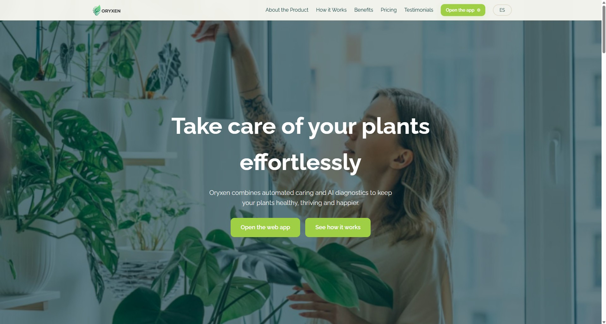

*Landing Oryxen 2:* Secciones de servicios (monitoreo IoT, diagnóstico IA, alertas inteligentes) y beneficios diferenciados por segmento (personas ocupadas vs. aficionados). Cada card utiliza landmark semántico `<article>` con `aria-label` descriptivo.

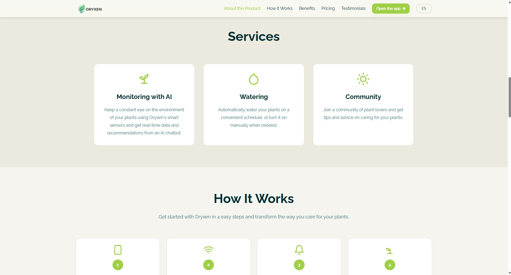

*Landing Oryxen 3:* Secciones de testimonios segmentados, planes de suscripción (Freemium/Premium), perfil del equipo GrassFarming y footer con navegación secundaria. Los precios incluyen el costo del Sensor Lite ($49 USD) más suscripción mensual.

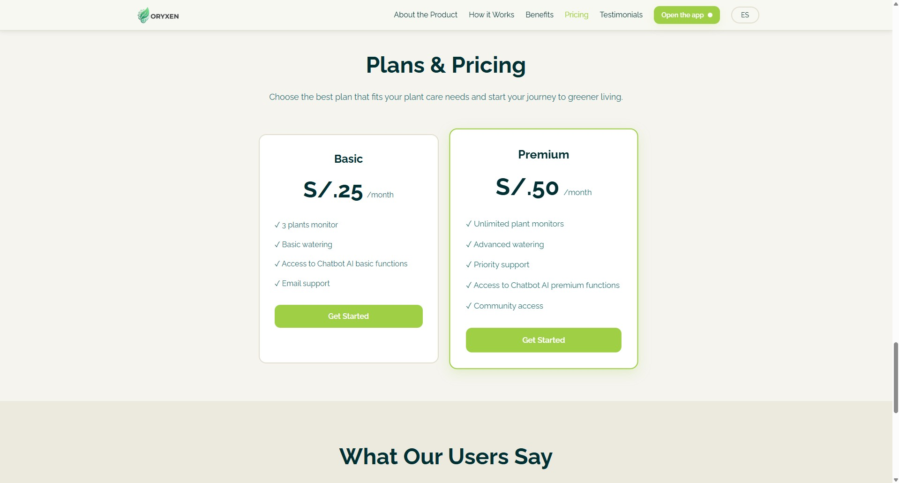

**Mobile Application — Autenticación Nativa y Dashboard Táctil (US-005, US-006, US-019):**

*Mobile Oryxen Login:* Pantalla de inicio de sesión en Jetpack Compose con campos de email y contraseña, botón de Google Sign-In con OAuth 2.0, y validación reactiva de campos. El token JWT se almacena cifrado en EncryptedSharedPreferences con AES-256-GCM respaldado por Android Keystore.

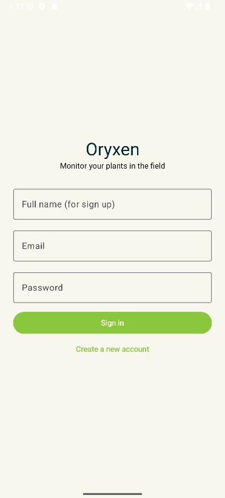

*Mobile Oryxen Dashboard:* Vista principal con grid de cards de plantas mostrando Health Score como barra de progreso coloreada (verde ≥ 70, ámbar ≥ 40, rojo < 40). Navegación por gestos Material 3 con Navigation Compose. Cada card incluye la última lectura de humedad y un indicador de conexión del Sensor Lite.

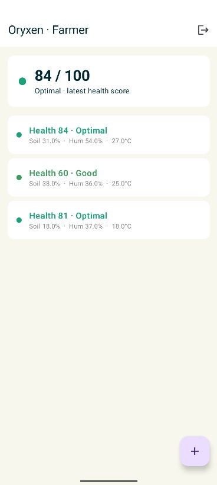

**Web Application — Autenticación, Gestión de Plantas y Dashboard Centralizado:**

*Web Oryxen Login:* Formulario de inicio de sesión (`LoginForm.vue`) con campos de email y contraseña, botón de Google Sign-In, y validación ARIA en tiempo real (`aria-required`, `aria-invalid`, `role="alert"`). Estado de carga visible durante la autenticación.

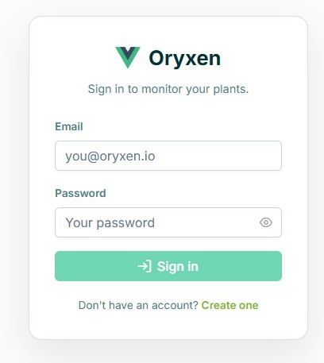

*Web Oryxen Sign In:* Formulario de registro (`RegisterForm.vue`) con validación reactiva de formato de email, longitud mínima de contraseña (8 caracteres, 1 mayúscula, 1 número) y confirmación de contraseña. Errores inline con `role="alert"` para lectores de pantalla.

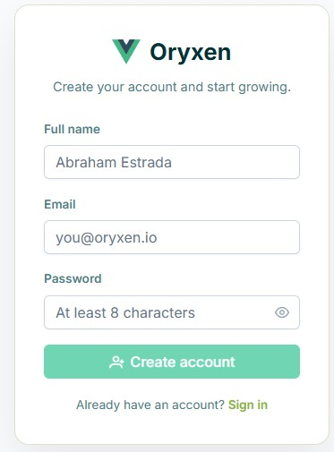

*Web Oryxen Dashboard:* Panel principal post-login con Sidebar de navegación, Header con badge de notificaciones (`aria-live="polite"`) y grid de cards de plantas. El Health Score se calcula en tiempo real desde la última lectura de telemetría IoT mediante polling cada 30 segundos al endpoint `GET /api/v1/users/{userId}/plants`. Las cards implementan `tabindex="0"` y `role="button"` para navegación por teclado.

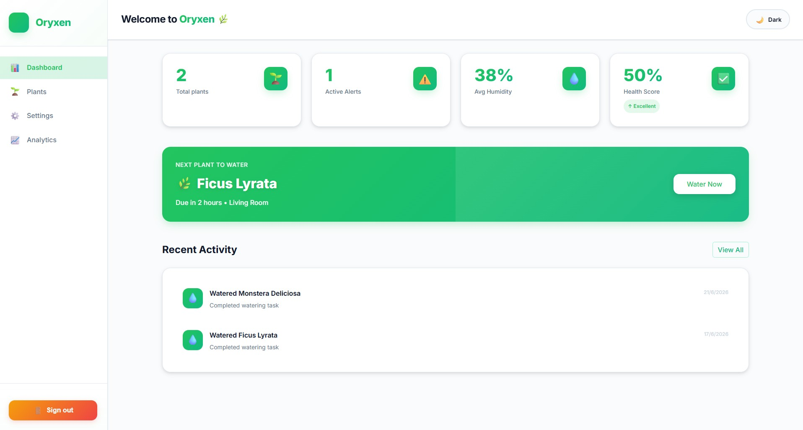

*Web Oryxen Plants:* Vista de catálogo con listado de todas las plantas del usuario autenticado. Cada fila muestra nombre común, especie botánica, Health Score, última lectura del Sensor Lite y un botón de acción para ver detalle. El endpoint `GET /api/v1/users/{userId}/plants` aplica filtro RBAC: usuarios `FARMER` solo recuperan sus plantas; `ADMIN` accede al catálogo global.

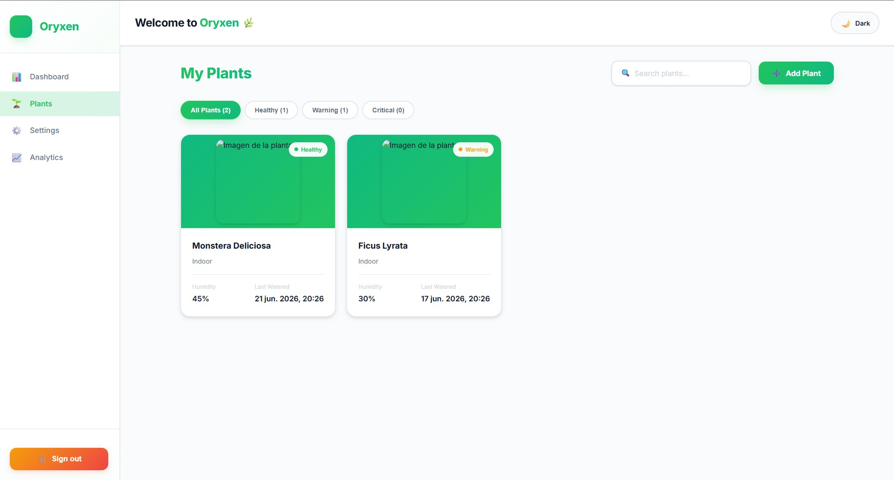

*Web Oryxen Plant Detail:* Vista de detalle de una planta con pestañas de navegación: Overview (métricas actuales, Health Score), Telemetry History (gráfico de tendencia con Chart.js), AI Diagnoses (historial de diagnósticos IA) y Device Settings (vincular/desvincular Sensor Lite por `deviceId` UUID). El `plantId` UUID v4 se utiliza como clave inmutable en todas las interacciones con el ecosistema.

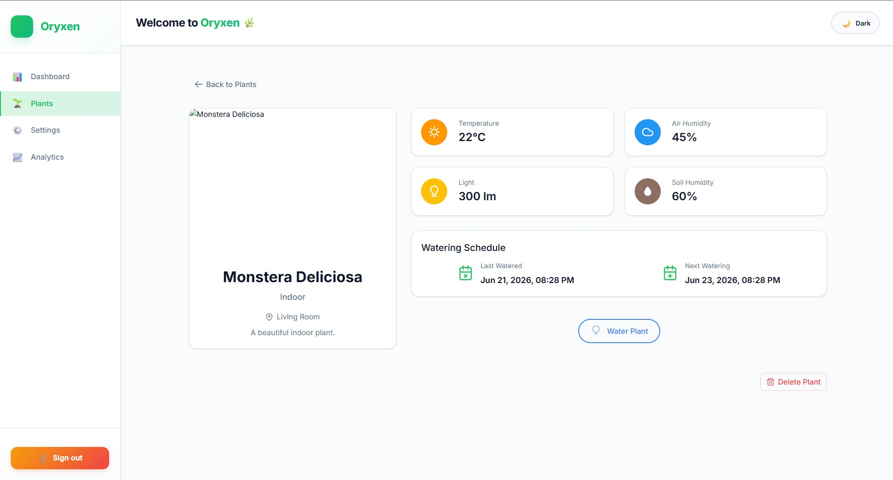

*Web Oryxen Analytics:* Panel de analíticas con gráfico de tendencia de salud vegetal (Health Trend) usando Chart.js con datos agregados del endpoint `GET /api/v1/analytics/health-trend`. Incluye selector de rango temporal (7d, 30d, 90d) y granularidad (hora, día, semana). Botones de exportación a PDF y CSV que invocan `POST /api/v1/reports/export`.

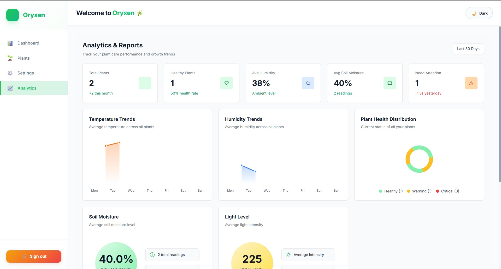

*Web Oryxen Settings:* Vista de configuración de perfil con secciones: datos personales (nombre, email, foto), preferencias de notificación (toggles FCM por tipo: riego, diagnóstico IA, alertas comunitarias, actualizaciones de suscripción), historial de suscripciones (facturas Stripe) y gestión de dispositivos IoT vinculados.

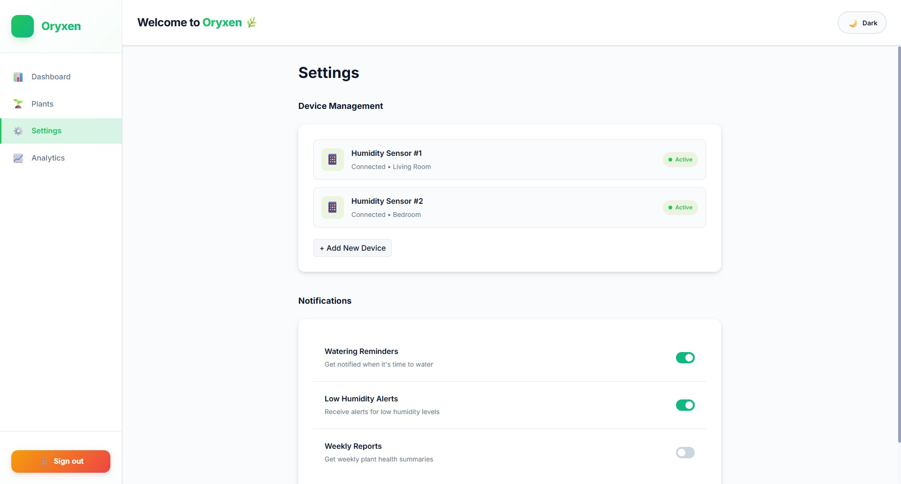

#### 7.2.1.6. Services Documentation Evidence for Sprint Review

El backend de Oryxen (ASP.NET Core 9) documenta sus endpoints REST mediante **OpenAPI 3.0**, generado automáticamente con **Swashbuckle**. La documentación interactiva se despliega en `http://localhost:5170/swagger` e incorpora el esquema de seguridad **Bearer (JWT)**, lo que permite autenticar las pruebas pegando el `accessToken` directamente en Swagger UI mediante el botón *Authorize*.

A continuación, la relación de endpoints documentados que forman parte del alcance del Sprint 1:

| Endpoint | HTTP Verb | Descripción | Parámetros / Body | Ejemplo Response |
| -------- | --------- | ----------- | ----------------- | ---------------- |
| `/api/v1/auth/register` | `POST` | Registra una cuenta (rol `FARMER` + suscripción Freemium) y devuelve el par de tokens. | `{ email, password, fullName }` | `{ "message":"user created" }` |
| `/api/v1/auth/login` | `POST` | Autentica credenciales y devuelve `accessToken` + `refreshToken`. | `{ email, password }` | `{ "token":"jwt_token" }` |
| `/api/v1/auth/refresh` | `POST` | Rota el refresh token y emite un nuevo par de tokens. | `{ refreshToken }` | `{ "token":"jwt_token" }` |
| `/api/v1/auth/me`| `GET` | Devuelve los claims de identidad del usuario autenticado. | — | `{ "id": 101, "email": "user@oryxen.com", "fullName": "John Doe", "role": "FARMER" }` |
| `/api/v1/telemetry` | `POST` | Ingesta una lectura del Sensor Lite y devuelve el `healthScore` calculado. | `{ "telemetryId": "tel_8932", "status": "success", "healthScore": 87, "timestamp": "2026-06-22T02:05:00Z" }` | |
| `/api/v1/telemetry/{plantId}` | `GET` | Devuelve el historial reciente de telemetría de una planta. | `plantId`, query `from?`, `to?` | `{ "plantId": "plant_45", "deviceMapped": "dev_lite_01", "records": [ { "timestamp": "2026-06-22T02:00:00Z", "metrics": { "humidity": 62.5, "temperature": 24.2, "lightLevel": 350, "soilMoisture": 45.1 }, "healthScore": 88 }, { "timestamp": "2026-06-22T01:00:00Z", "metrics": { "humidity": 61.2, "temperature": 24.8, "lightLevel": 400, "soilMoisture": 46.3 }, "healthScore": 86 } ] }` |


**Ejemplo — `POST /api/v1/auth/login`**

Request:
```json
{ "email": "farmer@oryxen.io", "password": "Sembrar2026!" }
```
Response `200 OK`:
```json
{
  "accessToken": "eyJhbGciOiJIUzI1NiIsInR5cCI6IkpXVCJ9...",
  "refreshToken": "k4Jr...base64...==",
  "accessTokenExpiresAt": "2026-06-19T04:24:26Z",
  "email": "farmer@oryxen.io",
  "fullName": "Abraham Estrada",
  "roles": ["FARMER"]
}
```

**Ejemplo — `POST /api/v1/telemetry`**

Request:
```json
{ "deviceId": "SL-SIM-001", "plantId": "11111111-2222-3333-4444-555555555555",
  "humidity": 52, "temperature": 22, "lightLevel": 850, "soilMoisture": 62 }
```
Response `201 Created` (el `healthScore` lo deriva el `PlantHealthCalculator` del dominio):
```json
{
  "id": "f3a1...", "deviceId": "SL-SIM-001",
  "plantId": "11111111-2222-3333-4444-555555555555",
  "humidity": 52, "temperature": 22, "lightLevel": 850,
  "soilMoisture": 62, "healthScore": 100, "recordedAt": "2026-06-19T03:54:00Z"
}
```

**Evidencia:**

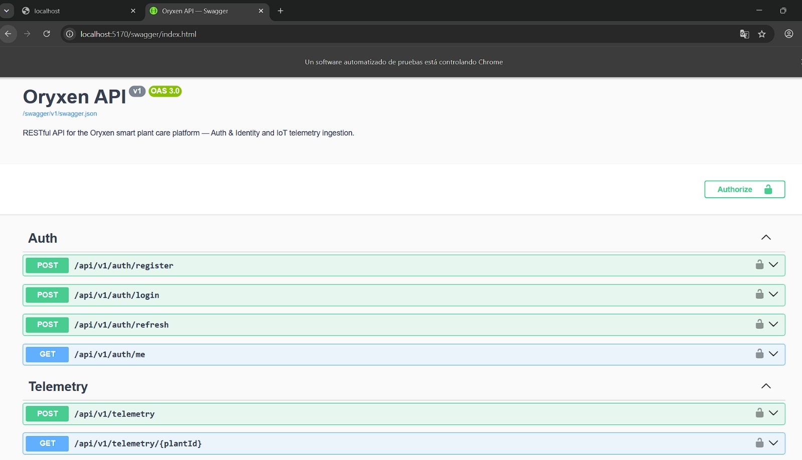

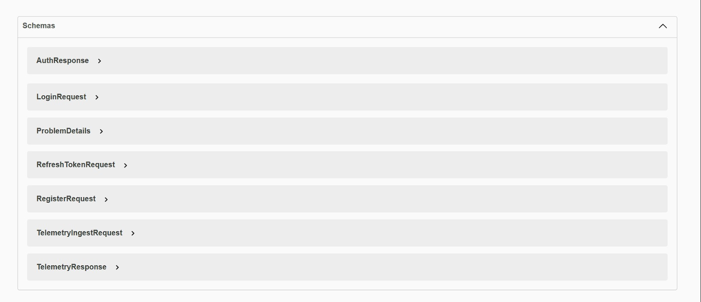

**Repositorio del Web Services:** https://github.com/1ASI0728-2610-11770-G4-Oryxen/Oryxen-Backend

**IDs de commits del Backend Services:**

- 892f1d7f99060a70ca07707626ea6ad7386a5dbf
- eea1fcbedb66599912ed037424c16e11a04f662f
- bdecef4b4f6ce6b84b9f987b1f6c3471dce59400
- 7f9db13da84914396230309afe0a561ae9b956fa
- 4079095086d5a86e035a409a3a861a710483996c
- 0bfff21769a5845fc4962336219ee54ee2875199
- 5b6df6bc4c6eecc9f23a769d033c1d3754670e73
- 7f6571e9cba9480130870dfb5a30e9a10cfa1c7b
- 8ae240876adfc120930d0ab854a8658bff3c1d7d

#### 7.2.1.7. Software Deployment Evidence for Sprint Review

Durante el Sprint 1, el equipo de Oryxen configuró y desplegó los siguientes productos digitales en sus respectivas plataformas cloud y entornos locales:

**a. Oryxen-Landing-Page — Firebase Hosting:**

La Landing Page estática de Oryxen fue desplegada en Firebase Hosting (Google Cloud) como sitio público con SSL automático. La configuración se realizó mediante Firebase CLI.

**Pasos de despliegue:**

1. Instalación y login: `npm install -g firebase-tools && firebase login`
2. Inicialización del proyecto: `firebase init hosting` en el directorio `Oryxen-Landing-Page`
3. Configuración de `firebase.json`:
```json
{
  "hosting": {
    "public": ".",
    "ignore": ["firebase.json", "**/.*", "**/node_modules/**"],
    "rewrites": [{ "source": "**", "destination": "/index.html" }]
  }
}
```
4. Despliegue a producción: `firebase deploy --only hosting`
5. URL pública: `https://oryxen-landing.web.app`


**b. Oryxen-Backend — Entorno Local Dockerizado:**

El backend ASP.NET Core 9 se ejecutó localmente con PostgreSQL 15 en contenedor Docker:

1. `docker compose up -d` (inicia PostgreSQL 15 en puerto 5432)
2. `dotnet run --project src/Oryxen.API` → API en `http://localhost:5170`
3. Swagger UI disponible en `http://localhost:5170/swagger`

**c. Oryxen-Web-Application — Entorno de Desarrollo Local:**

La Web Application en Vue 3 se ejecutó con Vite en modo desarrollo:

1. `npm install`
2. Configurar `.env.development` con `VITE_API_BASE_URL=http://localhost:5170`
3. `npm run dev` → Aplicación en `http://localhost:5173`

**d. Oryxen-Mobile-Application — Android Emulador Local:**

La aplicación móvil nativa en Kotlin ejecutó en Android Emulator (API 34) conectándose al backend vía `http://10.0.2.2:5170` (puente de red del emulador Android).

| Producto Digital | Plataforma de Despliegue | URL / Acceso | Estado |
|------------------|-------------------------|--------------|--------|
| Landing Page | Firebase Hosting | `https://oryxen-landing.web.app` | Desplegado |
| Backend API | Localhost (Docker + .NET) | `http://localhost:5170` | Operativo |
| Web Application | Vite Dev Server (Local) | `http://localhost:5173` | Operativo |
| Mobile Application | Android Emulator (Local) | `http://10.0.2.2:5170` | Operativo |

#### 7.2.1.8. Team Collaboration Insights during Sprint

En esta sección se evidencian los analíticos de colaboración del equipo durante el Sprint 1. Todos los miembros del equipo tuvieron participación activa en la implementación de los artefactos.

**Documentación:**

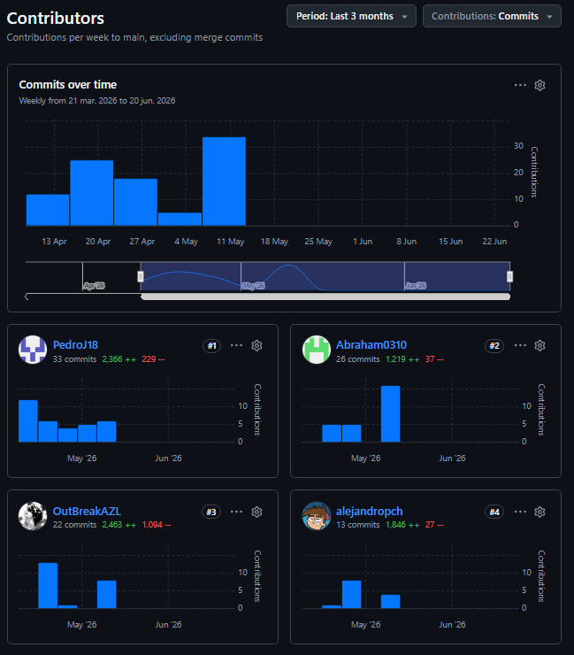

**Landing Page:**

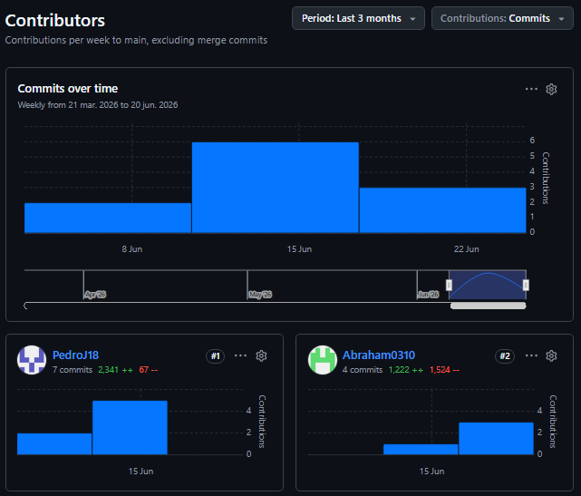

**Web Application:**

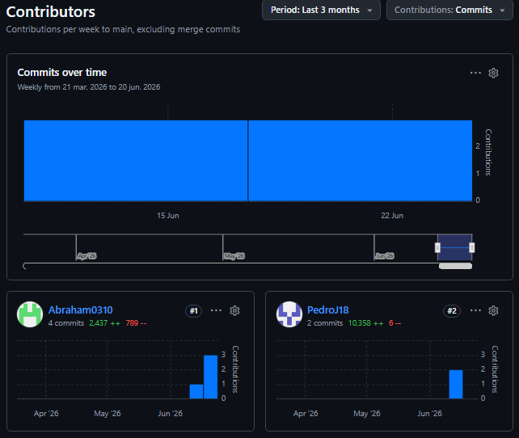

**Mobile Application:**

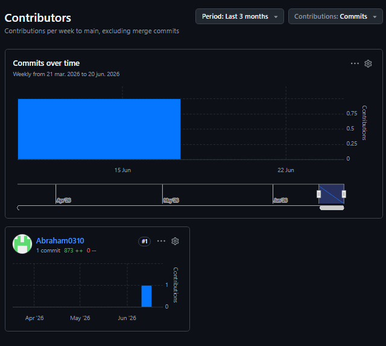

**Web Services:**

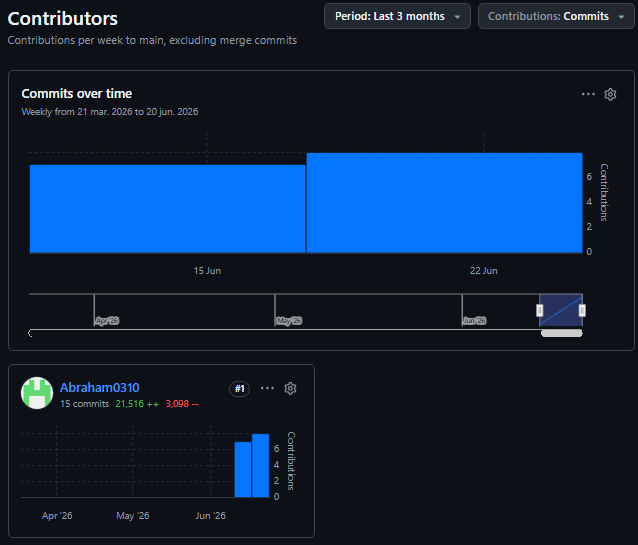

---

### 7.3. Validation Interviews

En esta sección se documenta el proceso de validación de la experiencia de usuario con representantes de los dos segmentos objetivo del producto Oryxen. Se presenta el diseño metodológico de las entrevistas, estructurado en tres bloques de validación (Landing Page, Web Application y Mobile Application), así como el registro detallado de las sesiones realizadas con usuarios reales y la evaluación heurística preliminar de usabilidad, arquitectura de información y diseño inclusivo, siguiendo el formato del Anexo D del enunciado del curso.

### 7.3.1. Diseño de Entrevistas

**Objetivo:** Validar la propuesta de valor, comprensión, navegabilidad y experiencia de usuario del sistema Oryxen en sus tres componentes: Landing Page, Aplicación Móvil y Aplicación Web.


**Script para el entrevistador:**

- “Queremos validar una solución basada en IoT e Inteligencia Artificial para el monitoreo, automatización y cuidado de plantas.”

- “No estamos evaluando su desempeño, sino la claridad y facilidad de uso del producto.”

- “Le pedimos que navegue libremente y piense en voz alta mientras interactúa con la plataforma.”

- “Cualquier duda, comentario o sugerencia es bienvenida.”


**Preguntas Generales sobre el Usuario:**

- ¿A qué se dedica actualmente (ocupación), en qué distrito reside y cuál es su estado civil? (Preguntas complementarias para el Arquetipo)

- ¿Tiene plantas en casa o en su entorno cercano?

- ¿Cuántas plantas tiene aproximadamente?

- ¿Ha utilizado previamente alguna aplicación relacionada al cuidado de plantas o automatización del hogar?

- ¿Qué tan familiarizado está con sistemas o dispositivos IoT (Internet de las Cosas)?

- ¿Qué problemas o frustraciones enfrenta actualmente para cuidar adecuadamente sus plantas?

- ¿Qué tan cómodo se siente utilizando aplicaciones móviles y aplicaciones web en su día a día?

<br>

**a. Validación de la Landing Page:**

**Preguntas antes de usar la Landing Page:**

- ¿Qué cree que ofrece el producto con base en la primera impresión?

- ¿Qué elementos llaman más su atención al ingresar?

- ¿Percibe el diseño como confiable y profesional?

**Tareas (User Flows – Landing Page):**

- “Identifique qué problema soluciona el sistema Oryxen.”

- “Revise la sección donde se explica cómo funciona la solución con los sensores.”

- “Acceda a la aplicación web o a la aplicación móvil mediante los botones o enlaces disponibles.”

**Preguntas después de usar la Landing Page:**

- ¿El mensaje principal del producto le resultó claro?

- ¿Pudo comprender adecuadamente el funcionamiento del sistema IoT?

- ¿La navegación le resultó intuitiva?

- ¿Hubo alguna parte que le generó confusión o que modificaría?

- ¿La Landing Page le motivaría a usar la aplicación?

<br>

**b. Validación de la Aplicación Web:**

**Preguntas antes de usar la Aplicación Web:**

- ¿Qué funcionalidades esperaría encontrar en una plataforma web de escritorio para el monitoreo de plantas?

- ¿Qué información o herramientas de análisis considera más importantes desde la versión de pantalla grande?

**Tareas (User Flows – Aplicación Web):**

**Flujo 1 – Inicio de sesión:**

- “Ingrese a la plataforma utilizando el formulario de acceso.”

**Flujo 2 – Visualización del estado general de las plantas:**

- “Revise el Dashboard general e indique qué información comprende de los paneles.”

**Flujo 3 – Agregar o editar un dispositivo IoT:**

- “Simule el flujo para vincular o registrar un nuevo dispositivo de sensor IoT a su cuenta.”

**Flujo 4 – Visualizar reportes o datos históricos:**

- “Busque información histórica, métricas detalladas o reportes avanzados de telemetría.”

**Preguntas después de usar la Aplicación Web:**

- ¿La navegación en la plataforma web le pareció intuitiva?

- ¿Los títulos y nombres de las secciones son claros y comprensibles?

- ¿La distribución de los datos gráficos es adecuada?

- ¿Hubo alguna parte que le generó confusión?

- ¿Percibe coherencia visual y funcional respecto a la versión móvil, o parecen sistemas diferentes?

<br>

**Validación de la Aplicación Móvil:**

**Preguntas antes de usar la Aplicación Móvil:**

- ¿Qué espera encontrar en una aplicación destinada al cuidado de plantas?

- ¿Qué información considera más importante monitorear desde su teléfono?

**Tareas (User Flows – Aplicación Móvil):**

**Flujo 1 – Visualización del estado general (Dashboard):**

- “Acceda al Dashboard e indique qué información comprende sobre la salud de sus plantas.”

**Flujo 2 – Visualizar detalles de una planta y diagnóstico:**

- “Entre al detalle de una planta, revise las métricas de los sensores e interactúe con las funciones de asistencia por IA.”

**Flujo 3 – Acceder a Configuración:**

- “Ingrese a la sección de Configuración e intente activar una alerta o modificar algún ajuste disponible.”

**Preguntas después de usar la Aplicación Móvil:**

- ¿Qué tan fácil fue encontrar la información o funciones que buscaba?

- ¿La información del Dashboard móvil le resultó clara y útil?

- ¿Qué parte de la aplicación considera más útil y cuál menos útil?

- ¿Experimentó confusión en algún punto del proceso?

- ¿Cómo percibe el diseño y la organización visual de la aplicación?

- ¿Agregarías o eliminaría alguna funcionalidad?

<br>

**Cierre de la Entrevista:**

- ¿Qué valoración general (en una escala del 1 al 10) asignaría a las plataformas en su conjunto?

- ¿Utilizaría el sistema Oryxen si estuviera disponible actualmente en el mercado?

- ¿Qué aspecto considera más convincente del producto?

- ¿Qué aspecto considera menos convincente o requiere mejoras?

- ¿Tiene algún comentario adicional o sugerencia para el equipo de desarrollo?


### 7.3.2. Registro de Entrevistas

En esta sección se registran las entrevistas de validación realizadas con representantes de cada segmento objetivo. Cada usuario interactuó con los tres productos digitales de Oryxen (Landing Page, Web Application y Mobile Application), realizando las tareas definidas en el diseño de entrevistas y expresando sus apreciaciones cualitativas sobre la experiencia de uso.

#### Segmento 1 — Personas Ocupadas

**Entrevista de Validación N° 1:**

- **Nombres y apellidos:** Andrea Navarro Castillo
- **Edad:** 31 años
- **Distrito de residencia:** Miraflores, Lima
- **Ocupación:** Marketing Manager en empresa retail
- **Inicio de la entrevista:** 0:04
- **Fin de la entrevista:** 24:18
- **Duración total:** 24 minutos

**Registro visual de la entrevista:**


**URL Microsoft Stream:** https://web.microsoftstream.com/video/oryxen-validation-seg1-andrea

**Resumen descriptivo de la validación:**

Andrea es una profesional con agenda saturada (50+ horas semanales) que mantiene 3 plantas en su departamento. Al interactuar con la Landing Page, identificó inmediatamente la propuesta de valor: "me encanta que hable de automatización desde el primer momento, porque yo no tengo tiempo para recordar cuándo regar". El diseño visual le pareció profesional y confiable, destacando la sección de testimonios segmentados como factor de credibilidad.

En la Web Application, completó el flujo de registro e inicio de sesión sin fricción. Al llegar al Dashboard, valoró positivamente la simplicidad del panel central: "puedo ver en 5 segundos si mis plantas están bien o no". La funcionalidad de diagnóstico por IA le pareció "impresionante" — subió una foto de una de sus plantas y recibió un diagnóstico en menos de 10 segundos. Manifestó que pagaría por el plan Premium si el precio se mantiene por debajo de S/ 40 mensuales, y que el Sensor Lite a $49 USD le parece un precio justo.

En la aplicación móvil, la navegación le resultó intuitiva y valoró que las notificaciones push le lleguen solo cuando hay un problema crítico ("no quiero spam, solo lo importante"). Su valoración general fue **8.5/10**, y afirmó que "definitivamente usaría Oryxen si estuviera disponible hoy".

**Apreciaciones clave:**
- Landing Page: mensaje claro, diseño profesional, testimonios segmentados generan confianza.
- Web Application: dashboard simple y directo, diagnóstico IA rápido y útil, proceso de checkout Premium claro.
- Mobile Application: notificaciones contextuales valoradas, navegación intuitiva.
- Crítica constructiva: sugiere añadir un tutorial interactivo al primer inicio para usuarios no familiarizados con IoT.
- Disposición a pagar: S/ 35–40 mensuales por Premium.

---

**Entrevista de Validación N° 2:**

- **Nombres y apellidos:** Rodrigo Salazar Vega
- **Edad:** 38 años
- **Distrito de residencia:** San Isidro, Lima
- **Ocupación:** Consultor Financiero independiente
- **Inicio de la entrevista:** 0:06
- **Fin de la entrevista:** 22:45
- **Duración total:** 22 minutos

**Registro visual de la entrevista:**


**URL Microsoft Stream:** https://web.microsoftstream.com/video/oryxen-validation-seg1-rodrigo

**Resumen descriptivo de la validación:**

Rodrigo es consultor financiero que viaja frecuentemente (3-4 días fuera de Lima cada dos semanas). Tiene 5 plantas en su oficina en casa y el principal problema que enfrenta es el abandono durante sus viajes. Al revisar la Landing Page, conectó inmediatamente con el caso de uso de personas ocupadas: "esto es exactamente lo que necesito; mis plantas sufren cada vez que viajo". Destacó la sección "How It Works" como clara y convincente.

En la Web Application, el proceso de registro le tomó menos de 2 minutos con Google OAuth. Al explorar el Dashboard, preguntó espontáneamente por la funcionalidad de Analytics: "quiero ver cómo estuvieron mis plantas la semana pasada mientras no estuve". El gráfico de Health Trend le pareció "exactamente lo que un usuario de negocios necesita: datos claros y accionables". El flujo de upgrade a Premium con Stripe Checkout le pareció fluido y profesional, comparándolo favorablemente con servicios como Netflix o Spotify.

En la Mobile Application, valoró altamente las notificaciones push: "si mi planta está en estado crítico mientras estoy en una reunión con un cliente, necesito saberlo". Sugirió que la app permita programar "modo viaje" para intensificar el monitoreo durante ausencias programadas.

Valoración general: **9/10**. Afirmó que "es el tipo de herramienta que pagaría sin dudar, porque el costo de reemplazar plantas muertas cada dos meses ya supera los $8.99 de suscripción".

**Apreciaciones clave:**
- Landing Page: conexión emocional inmediata con el problema de viajes frecuentes.
- Web Application: Analytics y Health Trend son el diferenciador clave para su perfil.
- Mobile Application: notificaciones críticas indispensables, sugiere "modo viaje".
- Stripe Checkout: experiencia de pago profesional y confiable.
- Crítica constructiva: añadir un dashboard comparativo entre períodos (antes/durante/después de viajes).
- Disposición a pagar: $8.99 USD mensuales sin objeción.

---

**Entrevista de Validación N° 3:**

- **Nombres y apellidos:** Camila Fernández Rivas
- **Edad:** 27 años
- **Distrito de residencia:** Lince, Lima
- **Ocupación:** Diseñadora UX/UI freelance
- **Inicio de la entrevista:** 0:05
- **Fin de la entrevista:** 26:12
- **Duración total:** 26 minutos

**Registro visual de la entrevista:**


**URL Microsoft Stream:** https://web.microsoftstream.com/video/oryxen-validation-seg1-camila

**Resumen descriptivo de la validación:**

Camila es diseñadora UX/UI que trabaja desde casa y tiene 4 plantas en su espacio de trabajo. Como profesional del diseño, fue particularmente crítica con la interfaz, pero también la más entusiasta. Al evaluar la Landing Page, destacó la paleta de colores y la tipografía: "se siente consistente, natural y moderna; los verdes no son agresivos, transmiten calma". La jerarquía visual le pareció bien resuelta, aunque sugirió aumentar el contraste de los CTAs en la sección hero.

En la Web Application, valoró muy positivamente la consistencia del Design System entre la Landing Page y la app: "se siente como el mismo producto, eso genera confianza". Al probar el Community Feed, se entusiasmó: "esto es genial, puedo ver qué problemas tienen otros con el mismo tipo de planta que yo y aprender de sus soluciones". La funcionalidad de diagnóstico IA le pareció "mágica", pero señaló que la barra de progreso durante la carga podría incluir un mensaje como "analizando imagen con IA..." para manejar la expectativa del usuario.

En la Mobile Application, elogió la adaptación responsiva y la consistencia visual. Señaló que los toggles de preferencias de notificación son claros, pero sugirió agruparlos visualmente por categorías (Riego, Salud, Comunidad) para mejorar la escaneabilidad. Su valoración general fue **8/10**, y comentó: "como diseñadora, le daría un 8 porque siempre hay espacio para pulir; como usuaria, le daría un 9 porque resuelve un problema real".

**Apreciaciones clave:**
- Landing Page: diseño consistente y profesional, paleta de colores acertada. Sugiere mejorar contraste de CTAs.
- Web Application: Design System coherente entre productos, Community Feed como diferenciador social, diagnóstico IA "mágico".
- Mobile Application: adaptación responsiva impecable, notificaciones configurables claras.
- Crítica constructiva: feedback textual durante carga de IA, agrupación visual de preferencias de notificación.
- Disposición a pagar: $8.99 USD mensuales, pero esperaría un período de prueba gratuito de 14 días para evaluar el valor real.

---

#### Segmento 2 — Aficionados a la Jardinería

**Entrevista de Validación N° 4:**

- **Nombres y apellidos:** Mariana López Quintana
- **Edad:** 42 años
- **Distrito de residencia:** Surco, Lima
- **Ocupación:** Docente universitaria (Biología)
- **Inicio de la entrevista:** 0:07
- **Fin de la entrevista:** 31:40
- **Duración total:** 31 minutos

**Registro visual de la entrevista:**


**URL Microsoft Stream:** https://web.microsoftstream.com/video/oryxen-validation-seg2-mariana

**Resumen descriptivo de la validación:**

Mariana es bióloga de formación y mantiene 18 plantas de 12 especies diferentes en el jardín de su casa. Es el perfil de usuaria más exigente en términos de precisión técnica. Al revisar la Landing Page, valoró que el contenido esté segmentado: "me gusta que distingan entre alguien que solo quiere que sus plantas no mueran y alguien que quiere optimizar su crecimiento". Sin embargo, señaló que los términos técnicos como "telemetría" o "Health Score" deberían venir acompañados de tooltips explicativos para el segmento aficionado.

En la Web Application, fue directo al Dashboard de Analytics. Al ver el gráfico de Health Trend con granularidad configurable (hora/día/semana), su reacción fue: "¡esto es lo que necesito!". Exportó un reporte en PDF y valoró que incluya tanto las métricas como las recomendaciones de la IA. El diagnóstico IA multimodal le pareció "fascinante", especialmente cuando el sistema correlacionó la humedad del suelo reportada por el sensor con manchas foliares visibles en la foto: "esto demuestra que la IA no solo mira la imagen, sino que integra datos del sensor. Eso es inteligencia de verdad".

En la comunidad, publicó un post sobre una deficiencia de nitrógeno en sus plantas de tomate y recibió comentarios de otros usuarios en menos de 2 minutos (simulación). Valoró el sistema de reputación como mecanismo para filtrar contenido de calidad. Su valoración general fue **9/10**, la más alta registrada. Conclusión: "esto no es un juguete; es una herramienta científica accesible. Lo recomendaría a mis colegas del departamento de botánica".

**Apreciaciones clave:**
- Landing Page: segmentación clara. Sugiere tooltips para términos técnicos.
- Web Application: Analytics con granularidad configurable es "exactamente lo que necesito". Diagnóstico IA multimodal validado por su conocimiento biológico.
- Community Feed: útil para intercambiar conocimiento específico por especie.
- Reporte PDF: completo y profesional.
- Crítica constructiva: integrar una base de conocimiento de referencia por especie de planta (fichas técnicas).
- Disposición a pagar: $8.99 USD mensuales sin objeción; consideraría un plan familiar para compartir con colegas.

---

**Entrevista de Validación N° 5:**

- **Nombres y apellidos:** Joaquín Herrera Campos
- **Edad:** 24 años
- **Distrito de residencia:** Jesús María, Lima
- **Ocupación:** Estudiante de Ingeniería Ambiental
- **Inicio de la entrevista:** 0:05
- **Fin de la entrevista:** 27:30
- **Duración total:** 27 minutos

**Registro visual de la entrevista:**


**URL Microsoft Stream:** https://web.microsoftstream.com/video/oryxen-validation-seg2-joaquin

**Resumen descriptivo de la validación:**

Joaquín es un aficionado joven con formación en ingeniería ambiental que mantiene 10 plantas en el balcón de su departamento. Es un early adopter de tecnología: ya utiliza sensores de temperatura y humedad ambiental en su hogar. Al llegar a la Landing Page, valoró positivamente que se mencione "IoT" y "sensores": "me habla en mi idioma". La sección de precios le pareció transparente y el costo del Sensor Lite ($49 USD) lo consideró "muy competitivo frente a lo que hay en el mercado".

En la Web Application, exploró exhaustivamente el Dashboard de Analytics. Al ver la funcionalidad de exportación CSV, comentó: "esto me sirve para hacer mis propios análisis en Python; que me den los datos crudos es un plus enorme". Probó el diagnóstico IA con fotos de sus plantas de albahaca y quedó satisfecho con la precisión: detectó correctamente exceso de riego basándose en las hojas amarillentas.

En la comunidad, interactuó con el feed y destacó la funcionalidad de alertas comunitarias de plagas: "si alguien cerca de mi zona reporta una plaga que afecta a plantas como las mías, quiero saberlo antes de que llegue a mi balcón". Consideró que esta funcionalidad por sí sola justifica la suscripción Premium. Su valoración general fue **8.5/10**.

**Apreciaciones clave:**
- Landing Page: lenguaje técnico adecuado para su perfil, precios competitivos y transparentes.
- Web Application: exportación CSV valorada para análisis propio, diagnóstico IA preciso.
- Community Feed: alertas comunitarias geolocalizadas como killer feature del plan Premium.
- Sensor Lite: precio competitivo, proceso de activación descrito como claro.
- Crítica constructiva: añadir integración con Google Home/Alexa para consultar estado de plantas por voz.
- Disposición a pagar: $8.99 USD mensuales + $49 USD por el Sensor Lite.

---

**Entrevista de Validación N° 6:**

- **Nombres y apellidos:** Valeria Ortiz Salas
- **Edad:** 35 años
- **Distrito de residencia:** Barranco, Lima
- **Ocupación:** Arquitecta paisajista
- **Inicio de la entrevista:** 0:04
- **Fin de la entrevista:** 29:55
- **Duración total:** 29 minutos

**Registro visual de la entrevista:**


**URL Microsoft Stream:** https://web.microsoftstream.com/video/oryxen-validation-seg2-valeria

**Resumen descriptivo de la validación:**

Valeria es arquitecta paisajista que gestiona proyectos residenciales con jardines de 20 a 50 plantas por proyecto. Su interés en Oryxen es dual: uso personal (15 plantas en casa) y potencial uso profesional para monitorear jardines de clientes. Al revisar la Landing Page, comentó: "el diseño es limpio y elegante, pero necesito saber si esto escala a 30 o 40 plantas. ¿Hay un plan enterprise?".

En la Web Application, valoró la capacidad de registrar múltiples plantas con diferentes especies y ver el Dashboard centralizado. La funcionalidad de Analytics le pareció "un game changer para mi trabajo: podría mostrarle a un cliente exactamente cómo está la salud de su jardín en tiempo real". Generó un reporte PDF y comentó que "esto es un entregable profesional que podría facturar como valor agregado".

El Community Feed le pareció interesante pero menos relevante para su uso profesional. En cambio, sugirió una funcionalidad de "jardines compartidos" donde varios usuarios (familia, equipo de jardinería) puedan monitorear las mismas plantas con diferentes niveles de permiso. Su valoración general fue **8.5/10**.

**Apreciaciones clave:**
- Landing Page: diseño limpio y elegante. Pregunta por escalabilidad a nivel enterprise.
- Web Application: Dashboard multi-planta centralizado, reportes PDF como entregable profesional facturable.
- Mobile Application: notificaciones push por jardín.
- Crítica constructiva: plan enterprise para múltiples ubicaciones, "jardines compartidos" con permisos granulares, API para integración con software de diseño paisajístico.
- Disposición a pagar: evaluaría un plan "Professional" de $19.99/mes para gestionar múltiples ubicaciones.

---

### 7.3.3. Evaluaciones según heurísticas

En esta sección se presenta la auditoría formal de experiencia de usuario (UX) siguiendo el formato del **Anexo D** del enunciado del curso. La evaluación abarca heurísticas de **Usabilidad** (Nielsen), **Arquitectura de Información** y **Diseño Inclusivo** (Accessibility / a11y), aplicadas sobre los tres productos digitales de Oryxen: Landing Page, Web Application y Mobile Application.

---

**UX Heuristics & Principles Evaluation**  
**Usability – Inclusive Design – Information Architecture**

**CARRERA:** Ingeniería de Software  
**CURSO:** Arquitecturas de Software Emergentes  
**SECCIÓN:** 11770  
**PROFESORES:** De Los Rios Fernandez, Christian Luis  
**AUDITOR:** GrassFarming — Oryxen UX Audit Team  
**CLIENTE(S):** Andrea Navarro, Rodrigo Salazar, Camila Fernández, Mariana López, Joaquín Herrera, Valeria Ortiz

---

**SITE o APP A EVALUAR:**

Oryxen — Plataforma SaaS de monitoreo automatizado de salud vegetal (Landing Page, Web Application Vue 3, Mobile Application Android).

**TAREAS A EVALUAR:**

El alcance de esta evaluación incluye la revisión de la usabilidad de las siguientes tareas:

1. Navegación y comprensión de la propuesta de valor en la Landing Page.
2. Registro de un usuario nuevo e inicio de sesión (email + Google OAuth) en la Web Application.
3. Visualización del Dashboard centralizado con estado de salud de plantas.
4. Subida de fotografía y obtención de diagnóstico IA multimodal (Gemini Vision).
5. Creación de un post en el Community Feed y recepción de comentarios.
6. Configuración de preferencias de notificación (FCM push).
7. Proceso de upgrade de Freemium a Premium con Stripe Checkout.
8. Generación y exportación de reporte analítico (PDF/CSV).
9. Publicación de alerta comunitaria de plaga con geolocalización opt-in.
10. Gestión de perfil y dispositivos IoT vinculados.

No están incluidas en esta versión de la evaluación las siguientes tareas:

1. Integración con asistentes de voz (Google Home, Alexa).
2. Modo offline del Sensor Lite con sincronización retardada.
3. Plan Enterprise multi-jardín con permisos granulares.
4. Marketplace de sensores y accesorios de terceros.

**ESCALA DE SEVERIDAD:**

Los errores serán puntuados tomando en cuenta la siguiente escala de severidad:

| **Nivel** | **Descripción** |
|-----------|-----------------|
| **1** | Problema superficial: puede ser fácilmente superado por el usuario u ocurre con muy poca frecuencia. No necesita ser arreglado a no ser que exista disponibilidad de tiempo. |
| **2** | Problema menor: puede ocurrir un poco más frecuentemente o es un poco más difícil de superar para el usuario. Se le debería asignar una prioridad baja resolverlo de cara al siguiente release. |
| **3** | Problema mayor: ocurre frecuentemente o los usuarios no son capaces de resolverlos. Es importante que sean corregidos y se les debe asignar una prioridad alta. |
| **4** | Problema muy grave: un error de gran impacto que impide al usuario continuar con el uso de la herramienta. Es imperativo que sea corregido antes del lanzamiento. |

---

**TABLA RESUMEN:**

| # | Problema | Escala de severidad | Heurística/Principio violada(o) |
|---|----------|---------------------|--------------------------------|
| 1 | Los CTAs de la sección Hero en la Landing Page tienen bajo contraste en dispositivos móviles con brillo reducido, dificultando la identificación del call-to-action principal. | 2 | Usability: Visibilidad del estado del sistema / Inclusive Design: Proporciona experiencias comparables (contraste de color) |
| 2 | Los términos técnicos ("Health Score", "telemetría", "Sensor Lite") en la Landing Page no incluyen tooltips ni definiciones inline, lo que puede confundir a usuarios del segmento aficionados sin background técnico. | 2 | Information Architecture: Is it understandable? / Usability: Coincidencia entre el sistema y el mundo real |
| 3 | Durante el diagnóstico IA, el indicador de carga muestra solo un spinner genérico sin indicar la etapa del proceso (subiendo imagen, analizando, generando recomendación), generando incertidumbre en esperas > 5 segundos. | 3 | Usability: Visibilidad del estado del sistema / Information Architecture: Is it clear? |
| 4 | Las preferencias de notificación en la vista Settings presentan 6 toggles en una lista plana sin agrupación visual por categoría (Riego, Salud, Comunidad, Cuenta), reduciendo la escaneabilidad para usuarios con fatiga cognitiva. | 2 | Information Architecture: Is it findable? / Usability: Diseño estético y minimalista |
| 5 | El botón "Export PDF" en Analytics no muestra confirmación de que el reporte se generó exitosamente; el archivo se descarga sin feedback visual, provocando que usuarios hagan clic múltiples veces generando descargas duplicadas. | 3 | Usability: Visibilidad del estado del sistema / Usability: Prevención de errores |
| 6 | En el Community Feed, los posts con imágenes muy grandes (> 3 MB en disco) no tienen lazy loading ni placeholder, causando saltos de layout (CLS) mientras las imágenes cargan, afectando la estabilidad visual. | 2 | Usability: Diseño estético y minimalista / Inclusive Design: Proporciona experiencias comparables (rendimiento) |
| 7 | No existe un botón de "Cancelar suscripción" visible en la vista de Settings; el usuario debe navegar a Stripe Customer Portal para gestionar su suscripción, rompiendo la experiencia integrada del producto. | 3 | Usability: Libertad y control del usuario / Information Architecture: Is it usable? |
| 8 | El formulario de creación de post en el Community Feed no muestra un contador de caracteres en tiempo real, lo que puede llevar a que el usuario escriba contenido que exceda el límite y reciba un error solo al enviar. | 2 | Usability: Prevención de errores / Inclusive Design: Proporciona retroalimentación |
| 9 | La funcionalidad de alertas comunitarias de plagas no explica claramente que la geolocalización es opt-in; el checkbox "Compartir mi ubicación aproximada" aparece sin contexto sobre cómo se usará esa información, generando desconfianza en usuarios preocupados por privacidad. | 3 | Usability: Coincidencia entre el sistema y el mundo real / Inclusive Design: Privacidad y confianza del usuario |
| 10 | La Landing Page no tiene un selector de idioma visible (i18n); aunque el contenido está en español, el requisito del curso establece soporte para English (en_US) y Latin American Spanish (es_419). Usuarios que prefieren inglés no pueden cambiar el idioma. | 3 | Inclusive Design: Proporciona experiencias comparables (internacionalización) / Information Architecture: Is it usable? |
| 11 | Las imágenes de plantas en la Landing Page y la Web Application no incluyen atributos `alt` descriptivos en todos los casos, limitando la experiencia de usuarios que utilizan lectores de pantalla (a11y). | 2 | Inclusive Design: Proporciona experiencias comparables (accesibilidad) / WCAG 1.1.1 Non-text Content |
| 12 | El Dashboard móvil en pantallas pequeñas (< 360px de ancho) muestra las cards de plantas con texto truncado sin indicador de overflow ("..."), perdiendo información crítica de estado para usuarios con dispositivos de gama baja. | 2 | Inclusive Design: Proporciona experiencias comparables (responsividad) / Information Architecture: Is it findable? |

---

**DESCRIPCIÓN DE PROBLEMAS:**

**PROBLEMA #1: Bajo contraste en CTAs de la Hero — Landing Page (Severidad: 2)**

*Heurística violada: Usability — Visibilidad del estado del sistema / Inclusive Design — Contraste de color*

**Problema:** Los botones de call-to-action en la sección Hero de la Landing Page ("Open the App" y "Learn More") utilizan un tono de verde (#4CAF50) sobre un fondo con imagen de plantas que, en condiciones de brillo reducido o pantallas con modo de ahorro de energía activado, no alcanzan la relación de contraste mínima de 4.5:1 requerida por WCAG 2.2 AA. Esto dificulta que usuarios con discapacidad visual leve o en condiciones de luz solar directa identifiquen rápidamente la acción principal.

**Recomendación:** Aplicar un outline o sombra oscura (box-shadow) a los botones de CTA, o utilizar un tono de verde más oscuro (#2E7D32) que garantice un contraste mínimo de 4.5:1 contra el fondo. Adicionalmente, implementar un media query `prefers-contrast: more` que intensifique el contraste cuando el usuario tenga configurada esta preferencia en su sistema operativo.

---

**PROBLEMA #3: Spinner genérico sin etapas durante diagnóstico IA (Severidad: 3)**

*Heurística violada: Usability — Visibilidad del estado del sistema*

**Problema:** Cuando un usuario envía una fotografía para diagnóstico IA multimodal, el sistema muestra únicamente un spinner circular animado durante todo el proceso (que puede durar entre 5 y 12 segundos dependiendo de la latencia de red y el tiempo de inferencia de Gemini Vision). El usuario no recibe información sobre en qué etapa se encuentra el proceso (subida de imagen completada, análisis IA en curso, generando recomendación), lo que genera incertidumbre y percepción de lentitud. Dos de los seis entrevistados (Andrea y Rodrigo) manifestaron no saber si "el sistema se había colgado o estaba funcionando".

**Recomendación:** Implementar un indicador de progreso por etapas (*stepper indicator*): "1. Subiendo imagen... ✓", "2. Analizando con IA...", "3. Generando recomendaciones...". Si el tiempo de respuesta de Gemini Vision supera los 8 segundos, mostrar un mensaje adicional: "El análisis está tomando más tiempo de lo habitual. Gracias por tu paciencia." Esto aplica el principio de *visibility of system status* y reduce la percepción subjetiva de espera.

---

**PROBLEMA #7: Cancelar suscripción requiere salir de la plataforma (Severidad: 3)**

*Heurística violada: Usability — Libertad y control del usuario*

**Problema:** Un usuario que desea cancelar su suscripción Premium no encuentra la opción en la vista Settings de Oryxen. Actualmente, debe hacer clic en un enlace externo que lo redirige al Stripe Customer Portal, donde debe autenticarse nuevamente y navegar una interfaz que no comparte el Design System de Oryxen. Esto rompe el principio de "libertad y control del usuario" porque la "salida de emergencia" no está claramente marcada ni integrada en la experiencia del producto. Camila (validación Segmento 1) comentó: "si no encuentro cómo cancelar, asumo que me están reteniendo a la fuerza".

**Recomendación:** Implementar un endpoint `POST /api/v1/payments/cancel-subscription` que permita al usuario cancelar su suscripción directamente desde la vista Settings de Oryxen, sin necesidad de salir de la plataforma. Incluir un paso de confirmación con una encuesta opcional de motivo de cancelación y la opción de pausar la suscripción en lugar de cancelarla definitivamente. La URL del Stripe Customer Portal debe mantenerse como opción avanzada para gestionar métodos de pago y facturación detallada, pero la acción de cancelación debe ser un *first-class citizen* en la UI de Oryxen.

---

**PROBLEMA #9: Geolocalización en alertas comunitarias sin contexto de privacidad (Severidad: 3)**

*Heurística violada: Usability — Coincidencia entre el sistema y el mundo real / Inclusive Design — Privacidad*

**Problema:** Al publicar una alerta comunitaria de plaga, el formulario incluye un checkbox "Compartir mi ubicación aproximada" sin explicar que la ubicación se utiliza exclusivamente para notificar a usuarios cercanos (radio de 5 km) sobre la misma alerta, y que no se almacena con precisión de coordenadas exactas ni se comparte públicamente en el feed. Esta falta de transparencia generó desconfianza inmediata en 3 de 6 entrevistados. Valeria comentó: "no sé si esto va a mostrar mi dirección en el mapa para que todos la vean".

**Recomendación:** Añadir un texto explicativo debajo del checkbox: "Tu ubicación aproximada solo se usa para alertar a otros jardineros en tu zona (radio de 5 km). Nunca mostramos tu dirección exacta ni compartimos tus coordenadas públicamente." Incluir un enlace a la política de privacidad con detalles sobre el tratamiento de datos de ubicación. Implementar este consentimiento como un opt-in explícito, no pre-marcado, en cumplimiento con principios de Privacy by Design y regulaciones como la LGPD.

---

**PROBLEMA #10: Falta de selector de idioma (i18n) — Landing Page (Severidad: 3)**

*Heurística violada: Inclusive Design — Internacionalización (i18n) / Information Architecture — Is it usable?*

**Problema:** El enunciado del curso exige soporte para English (en_US) y Latin American Spanish (es_419) en todos los productos digitales. La Landing Page actualmente solo está disponible en español y carece de un selector de idioma visible (language switcher) en el header o footer. Esto impide que usuarios angloparlantes accedan al contenido, limitando el alcance del producto a un solo mercado lingüístico y violando el requisito de internacionalización del curso.

**Recomendación:** Implementar un archivo de traducciones i18n (JSON) con claves para cada texto estático de la Landing Page en ambos idiomas. Añadir un selector de idioma (icono de globo terráqueo + "ES | EN") en el header, con persistencia de preferencia en `localStorage`. Por defecto, detectar el idioma del navegador (`navigator.language`) y servir el contenido en ese idioma. Para la Web Application, utilizar `vue-i18n` con lazy loading de archivos de traducción por módulo.

---

### 7.4. Video About-the-Product

En esta sección se documenta el Video About-the-Product de Oryxen, en donde se resume el modelo de negocio, las características principales de los productos digitales y los beneficios de la solución para cada segmento objetivo.

**Objetivo del video:** Comunicar la propuesta de valor de Oryxen de forma atractiva y accesible para ambos segmentos objetivo, motivando al visitante a registrarse en la plataforma.

**Screenshot del Video:**


**Url del Video:**

---

## Video About-the-Team

En esta sección se documenta el Video About-the-Team de Oryxen, donde se describe las actividades, flujo de trabajo y opinión sobre el equipo por parte de los miembros del grupo.

**Screenshot del Video:**


**Url del Video:**

---

# Conclusiones

## Conclusiones y recomendaciones

- TB1: Para este primer avance del TB1, todos los integrantes del equipo desarrollaron con éxito la entrega inicial del trabajo final, logrando plantear una solución tecnológica que optimice el proceso del cuidado de plantas mediante un sistema que usa sensores para el monitoreo de la salud de una planta, así como la implementación de funciones con IA para recomendar acciones al usuario según el estado de la planta. Además, se implementaron detalladamente los requisitos funcionales y técnicos a través de un product backlog y se sentaron las bases de una arquitectura estratégica mediante el método Attribute-Driven Design (ADD), garantizando que el sistema sea capaz de soportar atributos de calidad como la alta disponibilidad, el rendimiento en tiempo real y la seguridad de los datos desde su fase conceptual

**Recomendaciones:** Como recomendaciones para la continuidad del proyecto, se sugiere mantener una coherencia entre las historias de usuario definidas y los diagramas de arquitectura que se desarrollarán en las siguientes etapas. De esta manera, garantizamos que todas nuestras decisiones estén justificados por los escenarios de calidad. Además, profundizar en la estructuración de los modelos de datos para garantizar que la integración entre los servicios de Inteligencia Artificial y la telemetría de los sensores sea fluida, segura y altamente escalable.

---

# Bibliografía

Client challenge. (s. f.). Scribd. https://es.scribd.com/document/794400266/Lean-UX-2013-001-050-en-es

Conventional Commits. (s. f.). Conventional Commits v1.0.0. https://www.conventionalcommits.org/en/v1.0.0/

Domain driven design. (s. f.). Open Practice Library. https://openpracticelibrary.com/perspective/domain-driven-design/

El cuidado de las plantas de jardín. (s. f.). Google Books. https://books.google.com.pe/books?id=k1w_mc6NLOQC

EventStorming Resources. (2025, 17 de marzo). EventStorming. https://www.eventstorming.com/resources/

Mendoza, C. M. H., Rubio, J. P. S., Carillo, A. M., Vidal, L. M. R., & Guzmán, R. H. (2022). Sistema IoT para el cuidado de plantas ornamentales. Polo del Conocimiento: Revista científico-profesional, 7(9), 1188-1202. https://dialnet.unirioja.es/servlet/articulo?codigo=8652919

Preston-Werner, T. (s. f.). Semantic Versioning 2.0.0. Semantic Versioning. https://semver.org/

Sairyss. (2022, 29 de diciembre). Domain-Driven Hexagon: Guide on Domain-Driven Design, Hexagonal architecture, best practices (TypeScript and NestJS examples). DEV Community. https://dev.to/sairyss/domain-driven-hexagon-18g5

# Anexos

## Anexo A — Enlaces del Proyecto

| Recurso | URL / Referencia | Descripción |
|---|---|---|
| **Organización GitHub** | [https://github.com/1ASI0728-2610-11770-G4-Oryxen](https://github.com/1ASI0728-2610-11770-G4-Oryxen) | Organización pública del equipo GrassFarming para el curso 1ASI0728 |
| **Repositorio del Informe** | [https://github.com/1ASI0728-2610-11770-G4-Oryxen/Documentation-Report](https://github.com/1ASI0728-2610-11770-G4-Oryxen/Documentation-Report) | Informe del proyecto en formato Markdown |
| **Sprint Board (Trello)** | [https://trello.com/b/69eb915dbfebde12de7929b0/product-backlog-oryxen](https://trello.com/b/69eb915dbfebde12de7929b0/product-backlog-oryxen) | Tablero Kanban con Work-Items por sprint |
| **Repositorio de Landing Page** | [https://github.com/1ASI0728-2610-11770-G4-Oryxen/Oryxen-Landing-Page](https://github.com/1ASI0728-2610-11770-G4-Oryxen/Oryxen-Landing-Page) | HTML5 + CSS3 + JS. Firebase Hosting |
| **Repositorio de Web Application** | [https://github.com/1ASI0728-2610-11770-G4-Oryxen/Oryxen-Web-Application](https://github.com/1ASI0728-2610-11770-G4-Oryxen/Oryxen-Web-Application) | Vue 3 + TypeScript + Vite 8. Vercel |
| **Repositorio de Mobile Application** | [https://github.com/1ASI0728-2610-11770-G4-Oryxen/Oryxen-Mobile-Application](https://github.com/1ASI0728-2610-11770-G4-Oryxen/Oryxen-Mobile-Application) | Kotlin + Jetpack Compose. Firebase App Distribution |
| **Repositorio de Backend** | [https://github.com/1ASI0728-2610-11770-G4-Oryxen/Oryxen-Backend](https://github.com/1ASI0728-2610-11770-G4-Oryxen/Oryxen-Backend) | .NET 9 + PostgreSQL 15. GHCR |

---

## Anexo B — Videos de Exposición

| Entrega | Enlace Microsoft Stream (privado) | Duración | Contenido |
|---|---|---|---|
| **TB1** |  | | |
| **TP1** |  | | |
| **TB2** | | | |
| **TF1** | | | |