<div align="center">    
    </img><br><strong>Universidad Peruana de Ciencias Aplicadas</strong><br>
    <br><p>Ingeniería de Software</p>
    <p>8vo Ciclo</p>
    <br><strong>Arquitecturas de Software Emergentes</strong><br>
    <br><p>Sección: 11770</p>
    <p>Profesor: Christian Luis De Los Rios Fernandez</p><br>
</div>

<p align="center">
    <strong>"Informe del Trabajo Final"</strong><br>
    <br><strong>Startup: GrassFarming</strong><br>
    <br><strong>Producto: Oryxen</strong><br><br>
</p>

<div>
    <h3 align="center">Integrantes:</h3>
</div>

<div>
    <table align="center">
        <tr>
            <th style="text-align:center;">Apellidos y Nombres</th>
            <th style="text-align:center;">Código</th>
        </tr>
        <tr>
            <td style="text-align:center;">Estrada Cajamune, Abraham Andrés</td>
            <td style="text-align:center;">U202112164</td>
        </tr>
        <tr>
            <td style="text-align:center;">Nanfuñay Liza, Pedro Jesús</td>
            <td style="text-align:center;">U202215462</td>
        </tr>
        <tr>
            <td style="text-align:center;">Pachas Chavez, Alejandro Alberto</td>
            <td style="text-align:center;">U201917598</td>
        </tr>
        <tr>
            <td style="text-align:center;">Zevallos Linares, Alessandro Netto</td>
            <td style="text-align:center;">U202216035</td>
        </tr>
    </table>
    </div>
</body>

<br>
<br><p align="center">Abril, 2026</p></p>
<br><br>


# Registro de Versiones del Informe

| Versión | Fecha | Autor | Descripción de Modificación |
| ----------- | ----------- | ----------- | ----------- |
| TB1 | 15/04/2026 | - Estrada Cajamune, Abraham Andrés <br> - Nanfuñay Liza, Pedro Jesús <br> - Pachas Chavez, Alejandro Alberto <br> - Zevallos Linares, Alessandro Netto | Se han incluido los siguientes capítulos: <br> - Capítulo I: Introducción <br> - Capítulo II: Requirements Elicitation & Analysis <br> - Capítulo III: Requirements Specification <br> - Capítulo IV: Strategic-Level Software Design |

# Project Report Collaboration Insights

**URL de la organización del proyecto:** https://github.com/1ASI0728-2610-11770-G4-Oryxen<br>
**URL del repositorio del informe:** https://github.com/1ASI0728-2610-11770-G4-Oryxen/Documentation-Report


**TB1** <br>
Las tareas asignadas a la TB1 han sido finalizadas y se encuentran correctamente documentadas en el repositorio correspondiente al informe.

En esta entrega se redactaron los contenidos correspondientes utilizando formato Markdown, y se realizaron "Conventional Commits" para documentar el avance en el repositorio. Así mismo, se generaron los recursos necesarios y se añadieron las imágenes al repositorio en la carpeta "assets" correspondiente a cada rama del informe.

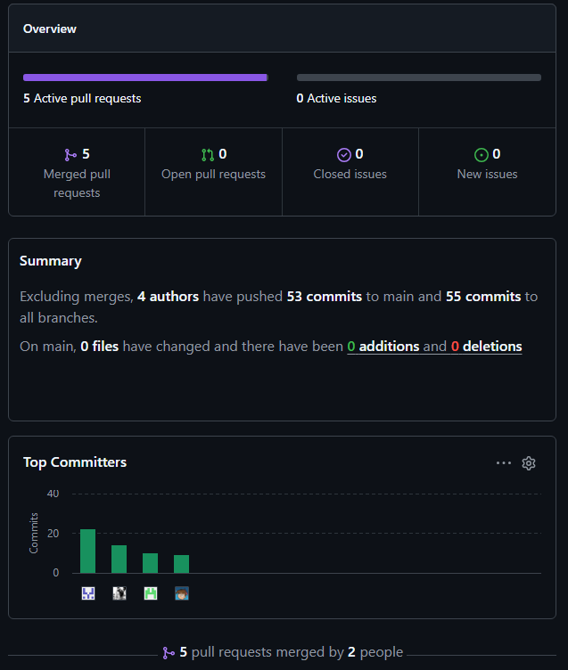
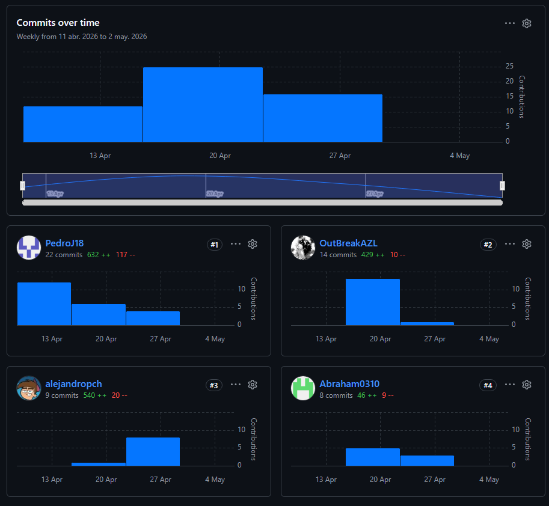
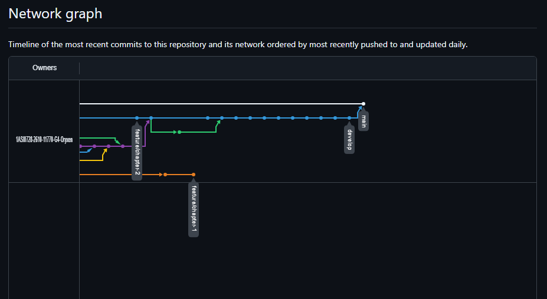
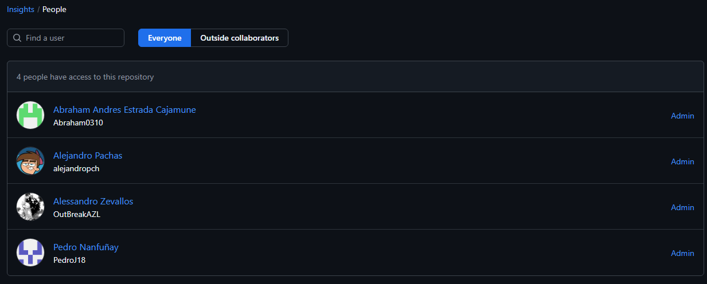

**TB2** <br>
Las tareas asignadas a la TB2 han sido finalizadas y se encuentran correctamente documentadas en el repositorio correspondiente al informe.

En esta entrega se redactaron los contenidos correspondientes a los capítulos 5 y 6, que constan en la documentación de los bounded context identificados que seguirá nuestra arquitectura y el diseño UX que seguirá nuestra solución para desarrollar los canales que podrá hacer uso nuestros usuarios.

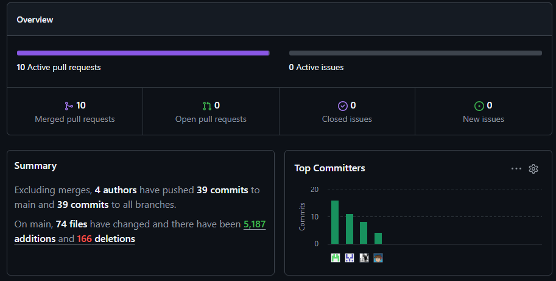
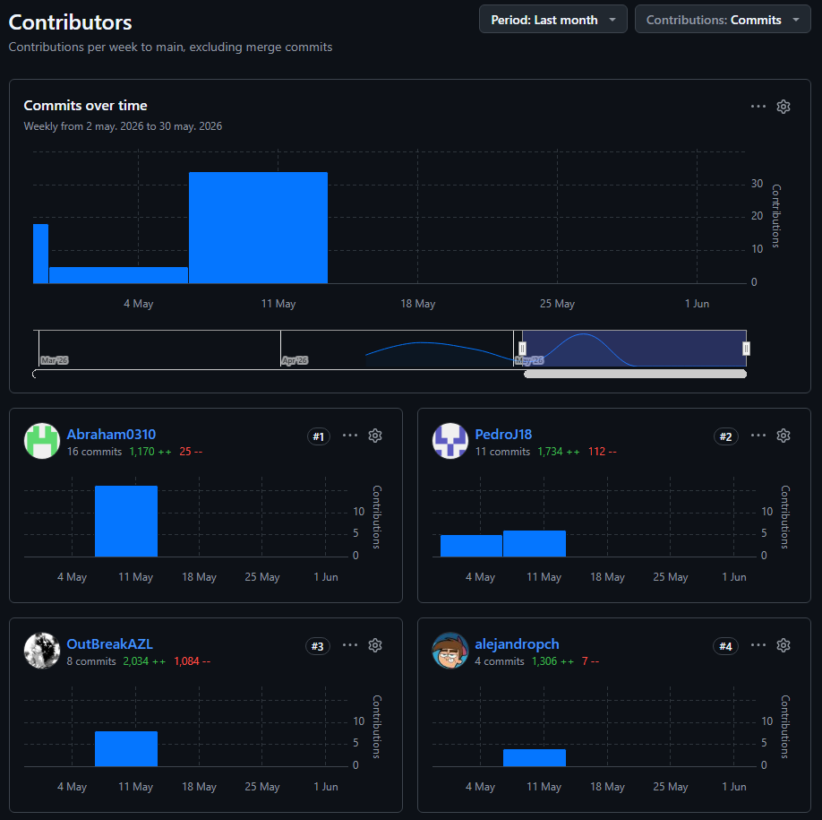
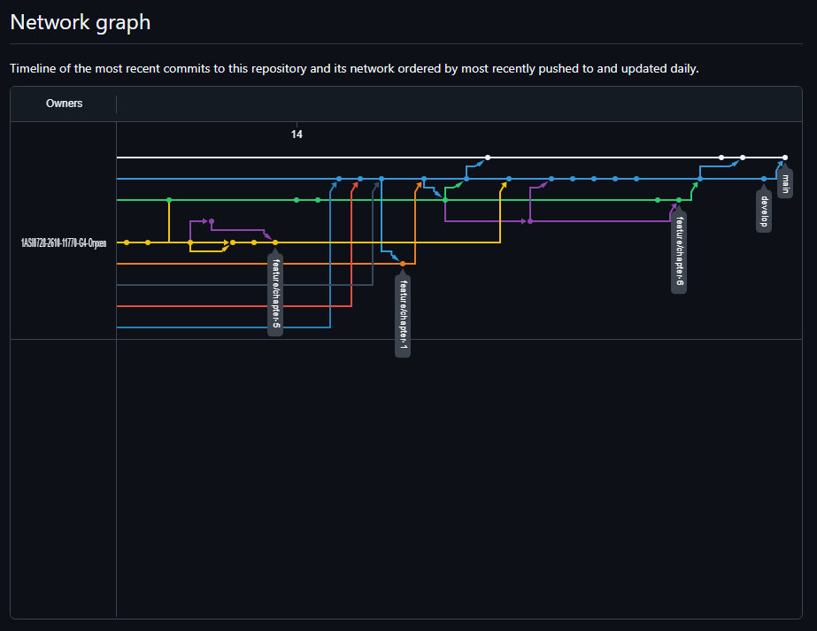
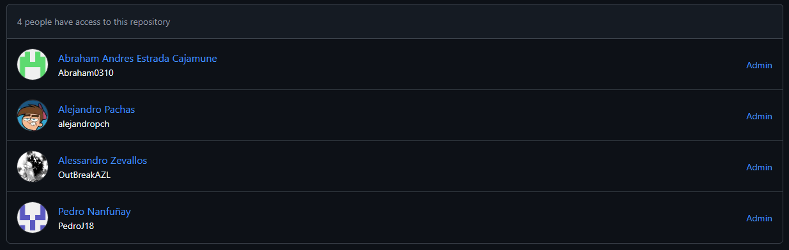


# Contenido

## Tabla de contenidos

[Registro de Versiones del Informe](#registro-de-versiones-del-informe)

[Project Report Collaboration Insights](#project-report-collaboration-insights)

[Student Outcome](#student-outcome)

### [Capítulo I: Introducción](#capítulo-i-introducción)

- [1.1 Startup Profile](#11-startup-profile)  
    - [1.1.1. Descripción de la Startup](#111-descripción-de-la-startup)  
    - [1.1.2. Perfiles de integrantes del equipo](#112-perfiles-de-integrantes-del-equipo)  
- [1.2. Solution Profile](#12-solution-profile)  
    - [1.2.1 Antecedentes y problemática](#121-antecedentes-y-problemática)  
    - [1.2.2 Lean UX Process](#122-lean-ux-process)  
        - [1.2.2.1. Lean UX Problem Statements](#1221-lean-ux-problem-statements)  
        - [1.2.2.2. Lean UX Assumptions](#1222-lean-ux-assumptions)  
        - [1.2.2.3. Lean UX Hypothesis Statements](#1223-lean-ux-hypothesis-statements)  
        - [1.2.2.4. Lean UX Canvas](#1224-lean-ux-canvas)  
- [1.3. Segmentos objetivo](#13-segmentos-objetivo)

### [Capítulo II: Requirements Elicitation & Analysis](#capítulo-ii-requirements-elicitation--analysis)

- [2.1. Competidores](#21-competidores)  
    - [2.1.1. Análisis competitivo](#211-análisis-competitivo)  
    - [2.1.2. Estrategias y tácticas frente a competidores](#212-estrategias-y-tácticas-frente-a-competidores)  
- [2.2. Entrevistas](#22-entrevistas)  
    - [2.2.1. Diseño de entrevistas](#221-diseño-de-entrevistas)  
    - [2.2.2. Registro de entrevistas](#222-registro-de-entrevistas)  
    - [2.2.3. Análisis de entrevistas](#223-análisis-de-entrevistas)  
- [2.3. Needfinding](#23-needfinding)  
    - [2.3.1. User Personas](#231-user-personas)  
    - [2.3.2. User Task Matrix](#232-user-task-matrix)  
    - [2.3.3. User Journey Mapping](#233-user-journey-mapping)  
    - [2.3.4. Empathy Mapping](#234-empathy-mapping)  
- [2.4. Big Picture EventStorming](#24-big-picture-eventstorming)  
- [2.5. Ubiquitous Language](#25-ubiquitous-language)  

### [Capítulo III: Requirements Specification](#capítulo-iii-requirements-specification)  

- [3.1. To-Be Scenario Mapping](#31-to-be-scenario-mapping)  
- [3.2. User Stories](#32-user-stories)  
- [3.3. Impact Mapping](#33-impact-mapping)
- [3.4. Product Backlog](#34-product-backlog)  

### [Capítulo IV: Strategic-Level Software Design](#capítulo-iv-strategic-level-software-design)

- [4.1. Strategic-Level Attribute-Driven Design](#41-strategic-level-attribute-driven-design)  
    - [4.1.1. Design Purpose](#411-design-purpose)  
    - [4.1.2. Attribute-Driven Design Inputs](#412-attribute-driven-design-inputs)  
        - [4.1.2.1. Primary Functionality (Primary User Stories)](#4121-primary-functionality-primary-user-stories)  
        - [4.1.2.2. Quality attribute Scenarios](#4122-quality-attribute-scenarios)  
        - [4.1.2.3. Constraints](#4123-constraints)  
        - [4.1.3. Architectural Drivers Backlog](#413-architectural-drivers-backlog)  
        - [4.1.4. Architectural Design Decisions](#414-architectural-design-decisions)  
        - [4.1.5. Quality Attribute Scenario Refinements](#415-quality-attribute-scenario-refinements)  
- [4.2. Strategic-Level Domain-Driven Design](#42-strategic-level-domain-driven-design)  
    - [4.2.1. EventStorming](#421-eventstorming)  
    - [4.2.2. Candidate Context Discovery](#422-candidate-context-discovery)  
    - [4.2.3. Domain Message Flows Modeling](#423-domain-message-flows-modeling)  
    - [4.2.4. Bounded Context Canvases](#424-bounded-context-canvases)  
    - [4.2.5. Context Mapping](#425-context-mapping)  
- [4.3. Software Architecture](#43-software-architecture)  
    - [4.3.1. Software Architecture System Landscape Diagram](#431-software-architecture-system-landscape-diagram)  
    - [4.3.2. Software Architecture Context Level Diagrams](#432-software-architecture-context-level-diagrams)  
    - [4.3.3. Software Architecture Container Level Diagrams](#433-software-architecture-container-level-diagrams)  
    - [4.3.4. Software Architecture Deployment Diagrams](#434-software-architecture-deployment-diagrams)

### [Capítulo V: Tactical-Level Software Design](#capítulo-v-tactical-level-software-design)

- [5.1. Bounded Context: Auth & Identity Integration](#51-bounded-context-auth--identity-integration)
    - [5.1.1. Domain Layer](#511-domain-layer)
    - [5.1.2. Interface Layer](#512-interface-layer)
    - [5.1.3. Application Layer](#513-application-layer)
    - [5.1.4. Infrastructure Layer](#514-infrastructure-layer)
    - [5.1.5. Bounded Context Software Architecture Component Level Diagrams](#515-bounded-context-software-architecture-component-level-diagrams)
    - [5.1.6. Bounded Context Software Architecture Code Level Diagrams](#516-bounded-context-software-architecture-code-level-diagrams)
        - [5.1.6.1. Bounded Context Domain Layer Class Diagrams](#5161-bounded-context-domain-layer-class-diagrams)
        - [5.1.6.2. Bounded Context Database Design Diagram](#5162-bounded-context-database-design-diagram)
- [5.2. Bounded Context: Plant Management](#52-bounded-context-plant-management)
    - [5.2.1. Domain Layer](#521-domain-layer)
    - [5.2.2. Interface Layer](#522-interface-layer)
    - [5.2.3. Application Layer](#523-application-layer)
    - [5.2.4. Infrastructure Layer](#524-infrastructure-layer)
    - [5.2.5. Bounded Context Software Architecture Component Level Diagrams](#525-bounded-context-software-architecture-component-level-diagrams)
    - [5.2.6. Bounded Context Software Architecture Code Level Diagrams](#526-bounded-context-software-architecture-code-level-diagrams)
        - [5.2.6.1. Bounded Context Domain Layer Class Diagrams](#5261-bounded-context-domain-layer-class-diagrams)
        - [5.2.6.2. Bounded Context Database Design Diagram](#5262-bounded-context-database-design-diagram)
- [5.3. Bounded Context: Device Management IoT](#53-bounded-context-device-management-iot)
    - [5.3.1. Domain Layer](#531-domain-layer)
    - [5.3.2. Interface Layer](#532-interface-layer)
    - [5.3.3. Application Layer](#533-application-layer)
    - [5.3.4. Infrastructure Layer](#534-infrastructure-layer)
    - [5.3.5. Bounded Context Software Architecture Component Level Diagrams](#535-bounded-context-software-architecture-component-level-diagrams)
    - [5.3.6. Bounded Context Software Architecture Code Level Diagrams](#536-bounded-context-software-architecture-code-level-diagrams)
        - [5.3.6.1. Bounded Context Domain Layer Class Diagrams](#5361-bounded-context-domain-layer-class-diagrams)
        - [5.3.6.2. Bounded Context Database Design Diagram](#5362-bounded-context-database-design-diagram)
- [5.4. Bounded Context: Artificial Intelligence (AI)](#54-bounded-context-artificial-intelligence-ai)
    - [5.4.1. Domain Layer](#541-domain-layer)
    - [5.4.2. Interface Layer](#542-interface-layer)
    - [5.4.3. Application Layer](#543-application-layer)
    - [5.4.4. Infrastructure Layer](#544-infrastructure-layer)
    - [5.4.5. Bounded Context Software Architecture Component Level Diagrams](#545-bounded-context-software-architecture-component-level-diagrams)
    - [5.4.6. Bounded Context Software Architecture Code Level Diagrams](#546-bounded-context-software-architecture-code-level-diagrams)
        - [5.4.6.1. Bounded Context Domain Layer Class Diagrams](#5461-bounded-context-domain-layer-class-diagrams)
        - [5.4.6.2. Bounded Context Database Design Diagram](#5462-bounded-context-database-design-diagram)
- [5.5. Bounded Context: Analysis & Reporting](#55-bounded-context-analysis--reporting)
    - [5.5.1. Domain Layer](#551-domain-layer)
    - [5.5.2. Interface Layer](#552-interface-layer)
    - [5.5.3. Application Layer](#553-application-layer)
    - [5.5.4. Infrastructure Layer](#554-infrastructure-layer)
    - [5.5.5. Bounded Context Software Architecture Component Level Diagrams](#555-bounded-context-software-architecture-component-level-diagrams)
    - [5.5.6. Bounded Context Software Architecture Code Level Diagrams](#556-bounded-context-software-architecture-code-level-diagrams)
        - [5.5.6.1. Bounded Context Domain Layer Class Diagrams](#5561-bounded-context-domain-layer-class-diagrams)
        - [5.5.6.2. Bounded Context Database Design Diagram](#5562-bounded-context-database-design-diagram)
- [5.6. Bounded Context: Notification](#56-bounded-context-notification)
    - [5.6.1. Domain Layer](#561-domain-layer)
    - [5.6.2. Interface Layer](#562-interface-layer)
    - [5.6.3. Application Layer](#563-application-layer)
    - [5.6.4. Infrastructure Layer](#564-infrastructure-layer)
    - [5.6.5. Bounded Context Software Architecture Component Level Diagrams](#565-bounded-context-software-architecture-component-level-diagrams)
    - [5.6.6. Bounded Context Software Architecture Code Level Diagrams](#566-bounded-context-software-architecture-code-level-diagrams)
        - [5.6.6.1. Bounded Context Domain Layer Class Diagrams](#5661-bounded-context-domain-layer-class-diagrams)
        - [5.6.6.2. Bounded Context Database Design Diagram](#5662-bounded-context-database-design-diagram)
- [5.7. Bounded Context: Billing and Subscription](#57-bounded-context-billing-and-subscription)
    - [5.7.1. Domain Layer](#571-domain-layer)
    - [5.7.2. Interface Layer](#572-interface-layer)
    - [5.7.3. Application Layer](#573-application-layer)
    - [5.7.4. Infrastructure Layer](#574-infrastructure-layer)
    - [5.7.5. Bounded Context Software Architecture Component Level Diagrams](#575-bounded-context-software-architecture-component-level-diagrams)
    - [5.7.6. Bounded Context Software Architecture Code Level Diagrams](#576-bounded-context-software-architecture-code-level-diagrams)
        - [5.7.6.1. Bounded Context Domain Layer Class Diagrams](#5761-bounded-context-domain-layer-class-diagrams)
        - [5.7.6.2. Bounded Context Database Design Diagram](#5762-bounded-context-database-design-diagram)
- [5.8. Bounded Context: Community](#58-bounded-context-community)
    - [5.8.1. Domain Layer](#581-domain-layer)
    - [5.8.2. Interface Layer](#582-interface-layer)
    - [5.8.3. Application Layer](#583-application-layer)
    - [5.8.4. Infrastructure Layer](#584-infrastructure-layer)
    - [5.8.5. Bounded Context Software Architecture Component Level Diagrams](#585-bounded-context-software-architecture-component-level-diagrams)
    - [5.8.6. Bounded Context Software Architecture Code Level Diagrams](#586-bounded-context-software-architecture-code-level-diagrams)
        - [5.8.6.1. Bounded Context Domain Layer Class Diagrams](#5861-bounded-context-domain-layer-class-diagrams)
        - [5.8.6.2. Bounded Context Database Design Diagram](#5862-bounded-context-database-design-diagram)

## [Capítulo VI: Solution UX Design](#capítulo-vi-solution-ux-design)
  - [6.1. Style Guidelines](#61-style-guidelines)
    - [6.1.1. General Style Guidelines](#611-general-style-guidelines)
    - [6.1.2. Web, Mobile & Devices Style Guidelines](#612-web-mobile--devices-style-guidelines)
  - [6.2. Information Architecture](#62-information-architecture)
    - [6.2.2. Labeling Systems](#622-labeling-systems)
    - [6.2.3. Searching Systems](#623-searching-systems)
    - [6.2.4. SEO Tags and Meta Tags](#624-seo-tags-and-meta-tags)
    - [6.2.5. Navigation Systems](#625-navigation-systems)
  - [6.3. Landing Page UI Design](#63-landing-page-ui-design)
    - [6.3.1. Landing Page Wireframe](#631-landing-page-wireframe)
    - [6.3.2. Landing Page Mock-up](#632-landing-page-mock-up)
  - [6.4. Applications UX/UI Design](#64-applications-uxui-design)
    - [6.4.1. Applications Wireframes](#641-applications-wireframes)
    - [6.4.2. Applications Wireflow Diagrams](#642-applications-wireflow-diagrams)
    - [6.4.3. Applications Mock-ups](#642-applications-mock-ups)
    - [6.4.4. Applications User Flow Diagrams](#643-applications-user-flow-diagrams)
  - [6.5. Applications Prototyping](#65-applications-prototyping)

#### [Conclusiones](#conclusiones)  
- [Conclusiones y recomendaciones.](#conclusiones-y-recomendaciones)  

#### [Bibliografía](#bibliografía)  

#### [Anexos](#anexos)
<br>


# Student Outcome

El curso contribuye al cumplimiento del Student Outcome ABET:
**ABET – EAC - Student Outcome 3**

**Criterio:** Capacidad de comunicarse efectivamente con un rango de audiencias.
En el siguiente cuadro se describe las acciones realizadas y enunciados de conclusiones por parte del grupo, que permiten sustentar el haber alcanzado el logro del ABET – EAC - Student Outcome 3.

| Criterio específico | Acciones Realizadas | Conclusiones |
| ------------------- | ------------------- | ------------ |
| Comunica oralmente sus ideas y/o resultados con objetividad a público de diferentes especialidades y niveles jerarquicos, en el marco del desarrollo de un proyecto en ingeniería. | **Pedro Jesús Nanfuñay Liza** <br> **TB1** <br> Demostré capacidad de comunicar mi comprensión de la problemática que abordamos; así como, el planteamiento de una solución tecnológica que la resuelva. Además, de exponer los fundamentos técnicos y requisitos funcionales para la solución, usando un lenguaje empático para los distintos grupos de usuarios.<br>**TP1:** Expliqué verbalmente ante el equipo las decisiones visuales adoptadas para los Mock-ups de la Landing Page y las aplicaciones, justificando cómo los lineamientos generales de estilo y la arquitectura de información responden directamente a las expectativas de los usuarios aficionados y ocupados.<br><br>**Alejandro Alberto Pachas Chavez**<br> **TB1** <br>Realicé el modelado EventStorming y DDD. Traduccí de los conceptos de negocio en un modelo técnico coherente.<br>**TP1:** Sustenté las decisiones de diseño para los Wireframes y Wireflow Diagrams de las aplicaciones, comunicando al equipo técnico cómo la secuencia de pantallas y el sistema de etiquetado (Labeling Systems) garantizan una navegación fluida.<br><br> **Abraham Andres Estrada Cajamune**<br>**TB1:** Dirigió la comunicación con los usuarios finales durante la etapa de investigación, realizando el registro y moderación de las entrevistas para extraer necesidades críticas de los segmentos objetivo. Asimismo, sustentó oralmente ante el equipo y el docente las decisiones técnicas del Capítulo IV, traduciendo requerimientos de negocio en restricciones arquitectónicas viables.<br>**TP1:** Sustenté las decisiones de diseño táctico para los contextos delimitados (Plant Management y Community), y comuniqué los lineamientos de diseño web/móvil y flujos de usuario (User Flows) al equipo para alinear las capacidades del backend con la experiencia final del usuario en LATAM.<br><br> **Alessandro Netto Zevallos Linares**<br>**TB1:** Durante el desarrollo del TB1, aporté la idea principal del proyecto y participé en su explicación, comunicando la problemática identificada y la solución propuesta de manera clara y estructurada, considerando la comprensión de distintos tipos de audiencia. <br>**TP1:** Expuse los sistemas de búsqueda (Searching Systems) y demostré la interacción real del usuario a través del Prototipado de las aplicaciones (Applications Prototyping), comunicando de forma visual y dinámica cómo el software resuelve los dolores del cliente. | **TB1:** Como equipo, concluimos que la facultad de adaptar el discurso según la audiencia es una competencia crítica para el éxito del proyecto. La interacción directa con usuarios no técnicos en el **Capítulo II** nos permitió validar la problemática de Oryxen desde una perspectiva humana y empática. Por otro lado, la defensa de los perfiles de la startup (**Capítulo I**) y de la arquitectura estratégica (**Capítulo IV**) ante el docente, demostró nuestra capacidad de emplear un lenguaje técnico-formal para sustentar la viabilidad de una solución de ingeniería ante niveles jerárquicos de evaluación. <br> <br>**TP1:** En esta segunda entrega, concluimos que la comunicación oral efectiva requiere integrar perspectivas técnicas y de diseño (UX/UI). Discutir verbalmente los Wireflows, Prototipos y Bounded Contexts nos permitió alinear la viabilidad del software (backend) con la usabilidad de la interfaz (frontend), logrando un consenso rápido en equipo para la toma de decisiones arquitectónicas y de diseño.|
| Comunica en forma escrita ideas y/o resultados con objetividad a público de diferentes especialidades y niveles jerarquicos, en el marco del desarrollo de un proyecto en ingeniería. | **Pedro Jesús Nanfuñay Liza** <br> **TB1** <br> Redacté la documentación con un enfoque en los objetivos de nuestra solución, garantizando que la coherencia y claridad de la información sea recepcionada por los usuarios en relación en lo que consiste nuestra plataforma y sobre los resultados de la arquitectura ADD. <br>**TP1:** Elaboré la documentación formal de la Arquitectura de Información y las Guías de Estilo Generales en el Capítulo VI, utilizando terminología estandarizada de diseño visual para acompañar la entrega de los Mock-ups de alta fidelidad.<br><br> **Alejandro Alberto Pachas Chavez**<br> **TB1** <br>Documentó de manera detallada el registro de las entrevistas en el Capítulo II, sintetizando los hallazgos cualitativos<br> <br>**TP1:** Redacté las estrategias de SEO y Meta Tags para la presencia digital del proyecto, y documenté rigurosamente las descripciones de los Wireframes y Wireflows de la aplicación para asegurar que el equipo de desarrollo comprenda la estructura de navegación.<br> <br> **Abraham Andres Estrada Cajamune**<br>**TB1:** Además, fue responsable de la especificación de 10 Technical Stories para los Constraints en el Capítulo IV, utilizando la sintaxis Gherkin (Given-When-Then) para comunicar de forma objetiva las reglas técnicas a desarrolladores y stakeholders. <br>**TP1:** Redacté formalmente en Markdown la documentación técnica de los Bounded Contexts a nivel táctico (Domain Layer, ERD, C4 Components). Además, documenté los lineamientos de estilo responsivo (Material Design) y los diagramas de flujo de usuario (User Flows), estructurando la información técnica y de UX/UI con claridad.<br> <br> **Alessandro Netto Zevallos Linares**<br>**TB1:** Me encargué de la redacción del documento del proyecto, organizando la información de manera clara y coherente, describiendo la idea principal, los objetivos y la propuesta de solución, utilizando un lenguaje adecuado para facilitar la comprensión por parte de distintos públicos. <br>**TP1:** Elaboré la documentación explicativa de los sistemas de búsqueda (Searching Systems) y los principios rectores de UX/UI aplicados a las plataformas de Oryxen, traduciendo requerimientos de interacción en especificaciones técnicas de diseño listas para su implementación. | **TB1:** El equipo concluye que la documentación formal y estructurada es el pilar de la transparencia en ingeniería de software. A través de la redacción del Lean UX Canvas (**Capítulo I**), los artefactos de Needfinding (**Capítulo II**) y el Software Design de nivel estratégico (**Capítulo IV**), logramos sintetizar información compleja en documentos claros y trazables. El uso de estándares como **Gherkin** y el modelo **C4** en el diseño de software asegura que la comunicación escrita sea objetiva, permitiendo que tanto stakeholders de negocio como desarrolladores técnicos comprendan el ecosistema de Oryxen sin ambigüedades <br>**TP1:** Concluimos que la comunicación escrita en el diseño a nivel táctico y UX es esencial para trazar un puente entre el diseño y el desarrollo. La correcta documentación en Markdown de los diagramas de componentes, ERDs, Guías de Estilo y diagramas de flujo de usuario (User Flows) nos permite entregar especificaciones sin ambigüedades, asegurando que cualquier miembro técnico o evaluador pueda comprender a fondo el funcionamiento y la estructura interactiva de las aplicaciones.| |

<br>


# Capítulo I: Introducción

## 1.1. Startup Profile

### 1.1.1. Descripción de la Startup

Nuestra startup **"GrassFarming"** se enfoca en simplificar el cuidado de plantas mediante una solución inteligente que automatiza tareas esenciales y brinda asistencia continua al usuario. Con nuestra plataforma **"Oryxen"**, nos centramos en ayudar a personas amantes de la jardinería y personas con agendas ocupadas, quienes suelen enfrentar dificultades para mantener sus plantas saludables debido al olvido o la falta de tiempo. La solución integra funciones de riego automático, monitoreo con sensores y un chatbot inteligente que brinda recomendaciones personalizadas. A través de la interfaz, los usuarios podrán visualizar fácilmente el estado de todas sus plantas, recibir alertas y gestionar su cuidado de manera práctica y confiable. Con ello, se busca reducir la pérdida de plantas, mejorar la experiencia del usuario y aumentar su satisfacción.

La propuesta de valor de Oryxen se basa en tres pilares diferenciales:

- **Automatización inteligente:** El sistema automatiza tareas esenciales como el monitoreo constante y el riego de las plantas mediante sensores IoT y módulos de riego automático, reduciendo la dependencia de recordatorios manuales.
- **IA visual y asistencia personalizada:** Oryxen incorpora inteligencia artificial capaz de analizar imágenes y datos de las plantas para detectar posibles problemas, interpretar su estado y brindar recomendaciones personalizadas mediante un chatbot inteligente.
- **Seguimiento centralizado:** Los usuarios pueden visualizar en una sola plataforma el estado de todas sus plantas en tiempo real, recibiendo alertas, recomendaciones y métricas de cuidado desde cualquier dispositivo.

A diferencia de soluciones tradicionales que solo recuerdan tareas o funcionan dentro de ecosistemas cerrados, Oryxen transforma las plantas y macetas que el usuario ya posee en un sistema inteligente, accesible y escalable.

Con ello, se busca reducir la pérdida de plantas, disminuir la carga del cuidado manual, optimizar el tiempo de los usuarios y mejorar la experiencia general del cuidado de plantas.

**Misión:** Facilitar el cuidado de plantas mediante automatización, inteligencia artificial visual y monitoreo inteligente, ofreciendo una experiencia accesible, práctica y confiable.

**Visión:** Convertirnos en la solución líder de cuidado inteligente de plantas en Latinoamérica, integrando automatización e inteligencia artificial para promover hogares más saludables y conectados con la naturaleza.

**Logotipo de la Startup:**

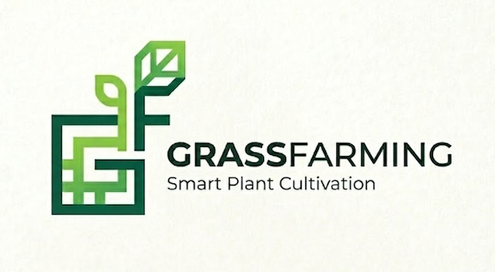

**Logotipo de la Solución:**


### 1.1.2. Perfiles de integrantes del equipo

| Integrante | Descripción | Conocimientos |
| ---------- | ----------- | ------------- |
| **Alejandro Alberto Pachas Chávez - u201917598**  | Mi nombre es Alejandro Alberto Pachas Chávez, tengo 24 años y actualmente curso la carrera de Ingeniería de Software. Me describo como una persona creativa, responsable y constante, con una fuerte disposición para colaborar en equipo. Mi objetivo es contribuir positivamente al grupo y alcanzar las metas propuestas. | Cuento con experiencia en lenguajes de programación como JavaScript, TypeScript y Go; además de desarrollo web utilizando frameworks como React y Next.js, y manejo de bases de datos tanto relacionales como no relacionales, incluyendo PostgreSQL y Firebase. |
| **Pedro Jesús Nanfuñay Liza - u202215462**  | Mi nombre es Pedro Jesús Nanfuñay Liza, tengo 20 años y soy estudiante de la carrera de Ingeniería de Software. Me considero una persona creativa, responsable, perseverante y siempre dispuesto a trabajar en equipo. Espero aportar de manera positiva al equipo y cumplir con los objetivos establecidos. | Tengo conocimientos en lenguajes de programación como C++, Java y Python; en el desarrollo web con frameworks Angular y Primevue, y en base de datos relacionales y no relacionales como SQL y MongoDB. |
| **Zevallos Linares, Alessandro Netto - u202216035**  | Mi nombre es Alessandro Netto Zevallos Linares, tengo 22 años y soy estudiante de Ingeniería de Software con un fuerte interés en el desarrollo de productos digitales y la tecnología. En mi tiempo libre, me gusta jugar videojuegos. También tengo un interés especial en la música, lo que me ayuda a equilibrar mi vida académica y personal. | Tengo conocimientos en JavaScript, React, Next.js, Angular, Vue, Java, Flutter, Kotlin, y en base de datos como SQL y MongoDB. |
| **Abraham Andres Estrada Cajamune - U202112164**  | Mi nombre es Abraham Andres Estrada Cajamune, tengo 22 años y soy estudiante de la carrera de Ingeniería de Software, cursando el 9no ciclo. Me califico como una persona responsable, trabajando a presión y con buena disposición en trabajar en equipo. Mi interés está en el desarrollo web y movil. |  A lo largo de mis estudios universitarios he adquirido las bases sólidas en lenguajes de programación como Java, C++, Python, utilizando Frameworks como Angular y Vue y un fuerte conocimiento en el manejo de bases de datos. |


## 1.2. Solution Profile

### 1.2.1 Antecedentes y problemática

| LAS 5W y 2H | Pregunta | Descripción |
| ----------- | -------- | ----------- |
| What? | ¿Cuál es el problema? | Personas ocupadas y aficionados a la jardinería no logran mantener un nivel de salud óptima en sus plantas (humedad, luz solar, etc.) por falta de tiempo u olvidos, lo que provoca plantas marchitas o muertas, frustración y menor bienestar. |
| When? | ¿Cuándo sucede el problema? | Ocurre de forma recurrente, especialmente durante semanas de alta carga laboral, viajes y en épocas de clima cambiante.                                                       |
| Where?  | ¿Dónde sucede el problema? | Principalmente en hogares, departamentos, oficinas, entre otros espacios, donde hay variedad de plantas y el control manual resulte complicado. |
| Why? | ¿Por qué sucede el problema? | Por la combinación de múltiples factores como la falta de tiempo, ausencia de recordatorios útiles y desconocimiento de necesidades específicas de riego y cuidado de cada especie. |
| Who? | ¿Qué llevara a las personas a usar nuestro producto? | Personas que desean mantener un cuidado óptimo de sus plantas con menos esfuerzo y que les permita cumplir con sus otras responsabilidades, con el objetivo de facilitar el proceso de cuidado y disminuir el tiempo necesario. |
| How? | ¿En qué condiciones los clientes usaran nuestro producto? | Los clientes usarán la aplicación y sensores en entornos con acceso a internet, para monitorear el estado de sus plantas, recibir alertas y automatizar el riego. |
| How Much? | ¿Con qué frecuencia o en qué cantidad se utilizará nuestro producto? | La frecuencia de uso será diario o semanal según la especie de la planta y estación del año. Las notificaciones pueden activarse varias veces al mes por maceta, y el sistema puede comenzar con pocas plantas y escalar según las necesidades del usuario. |

### 1.2.2 Lean UX Process

#### 1.2.2.1. Lean UX Problem Statements

Oryxen fue diseñado para ayudar a los usuarios a mantener sus plantas saludables mediante la integración de automatización inteligente, inteligencia artificial visual y seguimiento centralizado. La solución utiliza sensores IoT, módulos de riego automático y análisis visual asistido por IA para monitorear continuamente el estado de las plantas y reducir la carga del cuidado manual.

Hemos observado que los usuarios, especialmente personas con agendas ocupadas y aficionados a la jardinería, no logran mantener un cuidado constante, lo que provoca la pérdida de plantas, frustración y una menor continuidad en la creación de áreas verdes.

Además, las soluciones existentes suelen enfocarse únicamente en recordatorios manuales o en ecosistemas cerrados de hardware, sin ofrecer una experiencia integral que combine automatización, diagnóstico inteligente y monitoreo unificado.

¿Cómo podríamos mejorar Oryxen para que nuestros clientes tengan más éxito según su disponibilidad de tiempo y conocimientos previos en el cuidado de plantas, utilizando automatización, IA visual y seguimiento centralizado para reducir la carga de cuidado manual y aumentar la supervivencia de las plantas?

#### 1.2.2.2. Lean UX Assumptions

**Business Assumptions:**

1. Creo que mis clientes necesitan mantener sus plantas saludables sin depender constantemente de supervisión manual.
2. Estas necesidades pueden ser solucionadas mediante una plataforma que combine automatización, IA visual y monitoreo centralizado.
3. Mis primeros clientes serán personas con agendas ocupadas y aficionados a la jardinería.
4. El valor número 1 que un cliente quiere obtener de mi servicio es tranquilidad al saber que sus plantas están siendo monitoreadas y cuidadas automáticamente.
5. El cliente también puede obtener beneficios adicionales como ahorro de tiempo, recomendaciones inteligentes y reducción de pérdida de plantas.
6. Obtendré la mayoría de mis clientes a través de redes sociales, recomendaciones y marketplaces de hogar inteligente.
7. Ganaré dinero a través de planes premium, venta de sensores y módulos inteligentes.
8. Mi principal competencia en el mercado serán aplicaciones de cuidado de plantas y sistemas de automatización básica.
9. Los venceremos al integrar automatización, IA visual y seguimiento centralizado en una sola solución accesible y adaptable.
10. Mi mayor riesgo de producto es que los usuarios no perciban suficiente valor diferencial frente a soluciones más simples.
11. Resolveremos esto demostrando resultados reales mediante monitoreo inteligente y automatización efectiva.
12. Otra posible suposición falsa es que algunos usuarios no estén dispuestos a adoptar hardware inteligente en sus hogares.

**User Assumptions:**

1. ¿Quién es el usuario? Personas ocupadas y amantes de la jardinería que desean gestionar la salud de sus plantas de forma eficiente.
2. ¿Dónde encaja nuestro producto en su vida? En el cuidado diario de plantas dentro del hogar, oficinas y espacios personales.
3. ¿Qué problemas tiene nuestro producto y cómo los resolvemos? Problema: cuidado manual complejo y pérdida frecuente de plantas. Solución: automatización inteligente, IA visual y acceso centralizado a la información.
4. ¿Cuándo y cómo es usado nuestro producto? Durante el cuidado cotidiano de plantas, monitoreando su estado desde cualquier dispositivo.
5. ¿Qué características son importantes? Automatización confiable, visualización centralizada, análisis inteligente y facilidad de uso.
6. ¿Cómo debe verse y comportarse nuestro producto? Diseño limpio, intuitivo, rápido y accesible desde múltiples dispositivos.

**Priorización de suposiciones:**

Siguiendo la metodología Lean UX de Jeff Gothelf, priorizamos nuestras suposiciones con base en dos criterios principales: nivel de riesgo y nivel de conocimiento. El objetivo es identificar aquellas suposiciones de alto riesgo y bajo conocimiento para validarlas primero a través de experimentos y pruebas con usuarios.

**Suposiciones de Alta Prioridad (Alto Riesgo + Bajo Conocimiento):**

1. Los usuarios adoptarán una solución de automatización inteligente si perciben una reducción real del trabajo manual.
2. Los usuarios confiarán en recomendaciones generadas mediante IA visual para el cuidado de sus plantas.
3. Los usuarios valorarán una plataforma centralizada que les permita monitorear todas sus plantas desde un solo lugar.
4. La combinación de automatización, IA visual y monitoreo centralizado será percibida como una propuesta diferencial y útil.

**Suposiciones de prioridad media (Riesgo medio + conocimiento medio):**

5. Los usuarios estarán dispuestos a recibir alertas y recomendaciones frecuentes.
6. La solución será útil tanto para usuarios principiantes como avanzados.
7. Los usuarios confiarán en las recomendaciones generadas por el chatbot inteligente.
8. La automatización reducirá significativamente la pérdida de plantas.

**Suposiciones de baja prioridad (Bajo riesgo + alto conocimiento):**

9. Los usuarios prefieren interfaces simples e intuitivas.
10. La centralización de información mejora la experiencia de uso.
11. Los usuarios valoran recomendaciones personalizadas.
12. Los dispositivos móviles y el acceso a internet son accesibles para la mayoría de usuarios.

Estas suposiciones de alta prioridad serán las primeras en validarse mediante entrevistas, pruebas de concepto y prototipos antes de proceder con el desarrollo completo de Oryxen.

#### 1.2.2.3. Lean UX Hypothesis Statements

- **Hypothesis Statement 01:**  
Creemos que los usuarios con agendas ocupadas buscarán automatizar el cuidado de sus plantas para reducir tiempo y esfuerzo manual.  
Sabremos que esto es cierto al medir la frecuencia con la que utilizan las funciones automáticas de monitoreo y riego.  
Cuando al menos el 60% de los usuarios activos mantenga activadas las funciones automáticas durante el primer mes.

- **Hypothesis Statement 02:**  
Creemos que la integración de IA visual permitirá detectar problemas de salud en las plantas de manera más eficiente que el cuidado manual tradicional.  
Sabremos que esto es cierto al analizar la percepción de utilidad y precisión de las recomendaciones generadas por la IA.  
Cuando más del 70% de los usuarios califique las recomendaciones visuales como útiles y precisas.

- **Hypothesis Statement 03:**  
Creemos que los usuarios valorarán una plataforma centralizada donde puedan visualizar el estado de todas sus plantas en tiempo real.  
Sabremos que esto es cierto al analizar el uso de la pantalla principal de monitoreo.  
Cuando al menos el 75% de los usuarios utilice frecuentemente el panel centralizado de seguimiento.

- **Hypothesis Statement 04:**  
Creemos que la combinación de automatización, IA visual y seguimiento centralizado aumentará la confianza y satisfacción del usuario.  
Sabremos que esto es cierto mediante encuestas de satisfacción y retención de usuarios.  
Cuando más del 80% de los usuarios considere que Oryxen facilita significativamente el cuidado de sus plantas.

#### 1.2.2.4. Lean UX Canvas

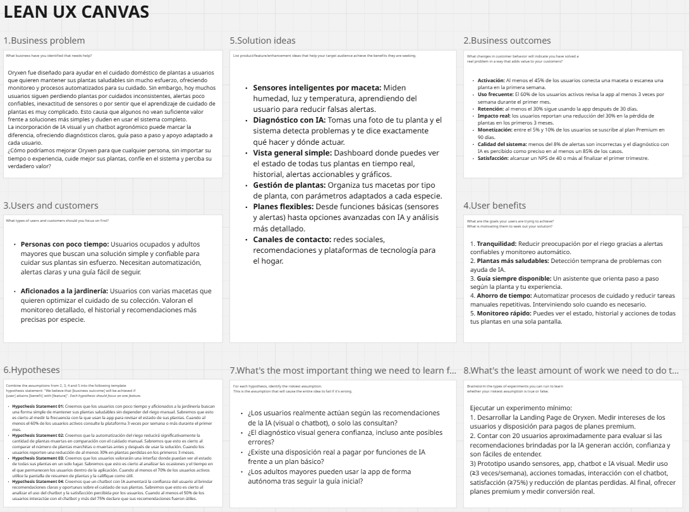

## 1.3. Segmentos Objetivo

Para asegurar el éxito de Oryxen, hemos identificado dos segmentos clave que serán el foco principal de nuestras estrategias de desarrollo y marketing. Estos segmentos representan a nuestros usuarios ideales y nos permitirán adaptar nuestras funcionalidades y servicios a sus necesidades específicas, maximizando así el impacto de la plataforma.

- **Segmento Objetivo 1 – Personas ocupadas:** Edades comprendidas entre 25 y 45 años que viven en zonas urbanas y llevan un ritmo de vida acelerado. Suelen tener entre 1 y 5 plantas en casa o en su lugar de trabajo, que utilizan para embellecer sus entornos, reducir el estrés y fomentar su bienestar. Les gusta tener plantas, pero no siempre tienen el tiempo o la constancia para cuidarlas bien, lo que muchas veces termina en frustración cuando se deterioran o mueren. Buscan una solución práctica que funcione casi sola y les dé tranquilidad.

- **Segmento Objetivo 2 – Aficionados a la jardinería:** Personas de múltiples rangos de edad que disfrutan del cuidado de sus plantas y suelen tener entre 5 y 20 de distintas especies. Les interesa que sus plantas estén en las mejores condiciones posibles, por lo que valoran entender aspectos como el riego, la humedad o el tipo de suelo. Buscan un mayor control y seguimiento para optimizar el cuidado de sus plantas.

# Capítulo II: Requirements Elicitation & Analysis

## 2.1. Competidores

En el mercado de jardinería inteligente, existen soluciones que van desde aplicaciones móviles con funciones básicas de seguimiento hasta ecosistemas avanzados de automatización y monitoreo. Hemos identificado tres frentes competitivos que nos permiten definir nuestra estrategia de diferenciación, lo que permitiría a **Oryxen** destacar en el ámbito tecnológico y económico, especialmente considerando las limitaciones de adopción de hardware en LATAM.


**Planta (Strömming & Löf AB)**
Es una aplicación móvil enfocada en el cuidado de plantas. Permite identificar plantas por foto, crear recordatorios personalizados, usar un medidor de luz y recibir recomendaciones y diagnósticos de problemas comunes. Su fortaleza está en el software y en la facilidad de uso, pero depende por completo de que el usuario ejecute las acciones manualmente. Por eso, compite con Oryxen en la parte de acompañamiento digital, aunque no automatiza el cuidado físico de la planta. <br>
**Diferenciación:** Oryxen elimina el error humano y la disciplina requerida, pasando de un "recordatorio" a una "acción automatizada".

**Xiaomi Mi Flora / Smart Home Ecosystem**  
Xiaomi representa la mayor amenaza debido a su capacidad de escala y precios agresivos. Sus sensores de suelo son económicos y se integran a ecosistemas de hogar inteligente como Xiaomi Home y Google Home. Sus dispositivos permiten monitorear variables como humedad, temperatura y luz, ofreciendo datos básicos sobre el estado de las plantas. <br>
**Diferenciación:** Oryxen no solo recibe datos, los interpreta, ejecuta y explica las acciones que realiza impulsado por IA.

**Gardyn (Home Kit 3.0 con Kelby AI)**  
Es el referente tecnológico con visión artificial. Sin embargo, su costo superior a los $700 USD y su formato cerrado lo hacen inviable para el mercado masivo en LATAM. Utiliza una IA propia llamada **Kelby** que utiliza cámaras integradas para detectar el estado de cada planta y recomendar acciones. Funciona con un modelo de suscripción ("Gardyn Membership") que incluye envío recurrente de yCubes (semillas) y soporte. <br>
**Diferenciación:** Oryxen propone una solución modular y más accesible, enfocada en las macetas y plantas que el usuario ya posee, integrando automatización e IA sin requerir un sistema de cultivo propietario, reduciendo el costo de entrada en un 80%.

### 2.1.1. Análisis competitivo

<table border="1" cellspacing="0" cellpadding="5">
  <tr>
    <th colspan="5">Competitive Analysis Landscape - Oryxen (GrassFarming)</th>
  </tr>
  <tr>
    <td>¿Por qué llevar a cabo este análisis?</td>
    <td colspan="4">Identificar fortalezas, debilidades y oportunidades frente a competidores de software, ecosistemas IoT y soluciones premium de jardinería inteligente, con el fin de posicionar a Oryxen como una alternativa modular y accesible para el mercado latinoamericano, enfocada en automatización, monitoreo y asistencia inteligente sobre las plantas que el usuario ya posee.</td>
  </tr>
  <tr>
    <td colspan="5"></td>
  </tr>
  <tr>
    <th></th>
    <th>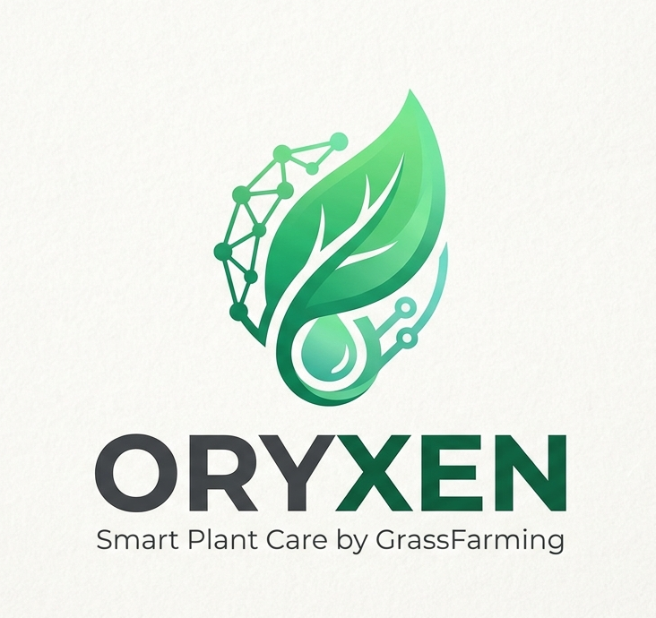</th>
    <th></th>
    <th></th>
    <th></th>
  </tr>

  <tr>
    <th colspan="5" style="text-align: center;"><strong>Perfil</strong></th>
  </tr>
  <tr>
    <td>Overview</td>
    <td>Plataforma modular de jardinería inteligente que combina sensores IoT, automatización de riego, IA visual y chatbot conversacional para ayudar a usuarios urbanos a cuidar las plantas que ya poseen.</td>
    <td>Aplicación móvil enfocada en recordatorios, identificación de plantas y recomendaciones de cuidado mediante IA.</td>
    <td>Ecosistema IoT de hogar inteligente con sensores accesibles para monitorear variables como humedad, temperatura y luz.</td>
    <td>Sistema premium de jardinería indoor que combina automatización, cámaras y visión artificial mediante su IA “Kelby”.</td>
  </tr>
  <tr>
    <td>Ventaja competitiva</td>
    <td>Integra monitoreo, automatización e IA sobre macetas existentes sin obligar al usuario a migrar a un ecosistema cerrado o realizar una inversión inicial elevada.</td>
    <td>Facilidad de uso, gran base de usuarios y experiencia digital enfocada en usuarios principiantes.</td>
    <td>Sensores de bajo costo e integración con ecosistemas de smart home ampliamente utilizados.</td>
    <td>Alto nivel de automatización y monitoreo avanzado mediante visión artificial e IA.</td>
  </tr>
  <tr>
    <td>¿Qué valor ofrece a los clientes?</td>
    <td>Reduce el esfuerzo manual, disminuye pérdidas de plantas y ayuda a usuarios con poco tiempo mediante automatización progresiva y recomendaciones personalizadas./td>
    <td>Ayuda a recordar tareas de cuidado y aprender conceptos básicos de jardinería.</td>
    <td>Permite monitorear variables ambientales de manera económica y sencilla.</td>
    <td>Ofrece una experiencia premium de cultivo indoor con mínima intervención del usuario.</td>
  </tr>

  <tr>
    <th colspan="5" style="text-align: center;"><strong>Perfil de Marketing</strong></th>
  </tr>
  <tr>
    <td>Mercado objetivo</td>
    <td>Personas ocupadas y aficionados a la jardinería en zonas urbanas que buscan reducir el tiempo y esfuerzo del cuidado manual.</td>
    <td>Usuarios casuales o principiantes interesados en aprender sobre cuidado de plantas.</td>
    <td>Usuarios interesados en automatización del hogar y dispositivos inteligentes accesibles.</td>
    <td>Usuarios premium interesados en cultivo indoor automatizado y tecnología avanzada.</td>
  </tr>
  <tr>
    <td>Estrategias de marketing</td>
    <td>Redes sociales, contenido educativo, alianzas con viveros locales y marketplaces de hogar inteligente.</td>
    <td>Freemium, posicionamiento en App Store/Google Play y contenido viral en redes sociales.</td>
    <td>Ecosistema Xiaomi Home, precios competitivos y distribución global masiva.</td>
    <td>Marketing premium, modelo D2C y posicionamiento tecnológico.</td>
  </tr>

  <tr>
    <th colspan="5" style="text-align: center;"><strong>Perfil de Producto</strong></th>
  </tr>
  <tr>
    <td>Productos & Servicios</td>
    <td>App móvil/web + IA visual + chatbot + sensores opcionales + riego automático modular + dashboard centralizado.</td>
    <td>Aplicación móvil con recordatorios y recomendaciones de cuidado.</td>
    <td>Sensores inteligentes y dispositivos integrados a Xiaomi Home.</td>
    <td>Home Kit hidropónico + IA Kelby + cámaras + membresía premium.</td>
  </tr>
  <tr>
    <td>Precios & Costos</td>
    <td>Bajo costo de entrada: acceso inicial sin hardware obligatorio y posibilidad de escalar progresivamente./td>
    <td>Bajo costo anual mediante suscripción móvil.</td>
    <td>Hardware económico orientado al mercado masivo.</td>
    <td>Alto costo inicial y suscripción recurrente.</td>
  </tr>
  <tr>
    <td>Canales de distribución</td>
    <td>Aplicación móvil/web, marketplaces y alianzas con viveros y tiendas tecnológicas locales.</td>
    <td>App Store y Google Play.</td>
    <td>E-commerce y retail tecnológico global.</td>
    <td>Venta directa mediante plataforma propia.</td>
  </tr>

  <tr>
    <th colspan="5" style="text-align: center;"><strong>Análisis SWOT</strong></th>
  </tr>
  <tr>
    <td>Fortalezas</td>
    <td>
      <ul>
        <li>Entrada progresiva sin hardware obligatorio</li>
        <li>Automatización + IA conversacional + monitoreo</li>
        <li>Compatible con macetas existentes</li>
        <li>Enfoque económico y modular para LATAM</li>
      </ul>
    </td>
    <td>
      <ul>
        <li>Gran comunidad de usuarios</li>
        <li>Experiencia intuitiva</li>
        <li>Barrera de entrada mínima</li>
      </ul>
    </td>
    <td>
      <ul>
        <li>Precios accesibles</li>
        <li>Integración smart home consolidada</li>
        <li>Amplia disponibilidad</li>
      </ul>
    </td>
    <td>
      <ul>
        <li>Automatización avanzada</li>
        <li>IA basada en visión artificial</li>
        <li>Experiencia premium consolidada</li>
      </ul>
    </td>
  </tr>
  <tr>
    <td>Debilidades</td>
    <td>
      <ul>
        <li>Startup sin posicionamiento consolidado</li>
        <li>Necesita validar confianza en IA y automatización</li>
        <li>Dependencia inicial de adquisición de usuarios</li>
      </ul>
    </td>
    <td>
      <ul>
        <li>No automatiza acciones físicas</li>
        <li>Depende totalmente del usuario</li>
      </ul>
    </td>
    <td>
      <ul>
        <li>Monitoreo limitado</li>
        <li>No incluye IA especializada en jardinería</li>
      </ul>
    </td>
    <td>
      <ul>
        <li>Precio elevado</li>
        <li>Ecosistema cerrado</li>
        <li>Baja accesibilidad para LATAM</li>
      </ul>
    </td>
  </tr>
  <tr>
    <td>Oportunidades</td>
    <td>
      <ul>
        <li>Crecimiento del smart home en LATAM</li>
        <li>Aumento de jardinería urbana post-pandemia</li>
        <li>Mayor adopción de IA conversacional</li>
      </ul>
    </td>
    <td>
      <ul>
        <li>Expandirse hacia automatización física</li>
        <li>Integración con hardware de terceros</li>
      </ul>
    </td>
    <td>
      <ul>
        <li>Integración con hardware de terceros</li>
        <li>Nuevos sensores domésticos</li>
      </ul>
    </td>
    <td>
      <ul>
        <li>Expansión internacional</li>
        <li>Crecimiento de agricultura indoor</li>
      </ul>
    </td>
  </tr>
  <tr>
    <td>Amenazas</td>
    <td>
      <ul>
        <li>Competencia de ecosistemas IoT consolidados</li>
        <li>Percepción de bajo valor frente a apps gratuitas</li>
        <li>Sensibilidad al precio del hardware en LATAM</li>
      </ul>
    </td>
    <td>
      <ul>
        <li>Ingreso de competidores con automatización</li>
        <li>Fatiga de suscripciones</li>
      </ul>
    </td>
    <td>
      <ul>
        <li>Competidores especializados con IA</li>
        <li>Dependencia del ecosistema Xiaomi</li>
      </ul>
    </td>
    <td>
      <ul>
        <li>Mercado reducido fuera del segmento premium</li>
        <li>Alta barrera económica</li>
      </ul>
    </td>
  </tr>
</table>

### 2.1.2. Estrategias y tácticas frente a competidores

**Estrategias generales de Oryxen**
- Diferenciación por la **integración de automatización + IA conversacional** aplicada sobre las plantas que el usuario ya posee, sin obligarlo a migrar a un ecosistema cerrado.
- Ecosistema **hardware + software modular**: sensores independientes, riego automatizado y panel centralizado accesible desde web y móvil.
- Modelo de negocio Freemium 100% software para eliminar la barrera de entrada al hardware en LATAM, escalable mediante la venta de un 'Sensor Lite' básico de bajo costo, y un Plan Premium que rentabiliza el negocio bloqueando funciones avanzadas de IA e historial completo de datos..
- Posicionamiento como un **aliado cotidiano** para hogares ocupados y aficionados latinoamericanos, con precios adaptados al mercado regional.
Hemos identificado diversas estrategias y tácticas para diferenciarnos y competir de manera efectiva dentro del mercado de jardinería inteligente y automatización del hogar. Oryxen busca posicionarse como una solución accesible y especializada para el cuidado de plantas en entornos urbanos, combinando automatización, monitoreo e inteligencia artificial en una sola plataforma.

**1. Estrategias de Diferenciación:** <br>

**Automatización Integral del Cuidado:**
A diferencia de competidores como Planta, que se limitan a la gestión de software y recordatorios. Oryxen incorpora sensores y módulos de riego que permiten automatizar tareas de cuidado y reducir la dependencia del usuario en actividades repetitivas.

**IA especializada en jardinería:**
Oryxen integra chatbot conversacional y diagnóstico visual por IA para interpretar el estado de las plantas y recomendar acciones específicas según la especie, el entorno y las condiciones detectadas por los sensores. Esto permite ofrecer una experiencia más personalizada que los sistemas IoT tradicionales.

**Dashboard centralizado y monitoreo inteligente:**
La plataforma permite visualizar el estado de todas las plantas desde una sola interfaz, incluyendo historial de riego, humedad, alertas y recomendaciones automáticas. Esto brinda mayor control a usuarios con múltiples plantas o poco tiempo disponible.


**2. Tácticas de Marketing:** <br>

**Contenido educativo y redes sociales:**
Se implementarán campañas digitales orientadas a hogares urbanos y adultos mayores, utilizando contenido educativo sobre cuidado de plantas, automatización e IA aplicada al hogar.

**Alianzas con viveros y tiendas tecnológicas:**
Oryxen buscará colaborar con viveros locales y marketplaces tecnológicos para aumentar visibilidad, facilitar pruebas del producto y fortalecer la confianza del usuario en etapas tempranas.

**Demostraciones y onboarding simplificado:**
Se priorizará una experiencia de configuración sencilla y demostraciones prácticas del monitoreo y diagnóstico por IA, reduciendo la percepción de complejidad tecnológica asociada al hardware IoT.


**3. Estrategias de Precios:** <br>

**Modelo freemium con adopción progresiva:**
Los usuarios podrán iniciar utilizando funciones gratuitas como chatbot básico, monitoreo manual y diagnóstico visual, sin necesidad de adquirir hardware desde el inicio. Posteriormente podrán incorporar sensores o automatización según sus necesidades y presupuesto.

**Planes escalables según cantidad de plantas:**
Se ofrecerán planes premium orientados a usuarios con múltiples macetas o necesidades avanzadas, incluyendo automatización inteligente, historial avanzado y análisis personalizados.

**Hardware modular de bajo costo:**
A diferencia de soluciones premium cerradas, Oryxen priorizará sensores independientes y compatibles con diferentes tipos de macetas, permitiendo reducir costos y facilitar el acceso en el mercado latinoamericano.


**4. Expansión y Adaptabilidad:** <br>

**Enfoque inicial en Lima Metropolitana:**
La startup comenzará enfocándose en usuarios urbanos de Lima Metropolitana, donde existe un crecimiento sostenido en el uso de plantas ornamentales y dispositivos smart home. Posteriormente se evaluará la expansión nacional e internacional.

**Compatibilidad con ecosistemas existentes:**
Oryxen buscará integrarse progresivamente con plataformas de hogar inteligente y asistentes virtuales, permitiendo aumentar compatibilidad y competitividad frente a ecosistemas consolidados como Xiaomi o Google Home.

**Aprendizaje continuo mediante feedback del usuario:**
El sistema utilizará interacciones y retroalimentación de los usuarios para mejorar la precisión de alertas, recomendaciones y diagnósticos visuales, fortaleciendo la confianza en la plataforma con el tiempo.

---

#### 2.1.2.1. Modelo de Monetización y Análisis Financiero

**Conversión Freemium → Premium: Métricas Objetivo SaaS/IoT**

El modelo Freemium de Oryxen posiciona la aplicación gratuita como canal de adquisición principal. La conversión al plan Premium y la compra del Sensor Lite son los eventos de monetización críticos del negocio. Las siguientes métricas guían las decisiones de diseño de producto y estrategia de crecimiento:

| Métrica | Definición | Objetivo Año 1 | Objetivo Año 2 |
|---------|-----------|----------------|----------------|
| **Tasa de Conversión MoM (Freemium→Premium)** | % de usuarios del plan gratuito que activan Premium en el mes | 3.5% | 5.0% |
| **Churn Rate Mensual (Premium)** | % de suscriptores Premium que cancelan en el mes | < 2.5% | < 2.0% |
| **LTV / CAC Ratio** | Valor de vida del cliente vs. costo de adquisición por canal digital | > 2.5:1 | > 3:1 |
| **ARPU Mensual (Premium)** | Ingreso promedio por usuario premium activo | $8.99 USD | $10.99 USD |
| **Net Revenue Retention (NRR)** | Retención de ingresos considerando expansión (upsell hardware) y churn | > 105% | > 110% |
| **Payback Period (CAC)** | Meses para recuperar el costo de adquisición con ingresos recurrentes | ≤ 6 meses | ≤ 4 meses |
| **DAU/MAU (Engagement Index)** | Ratio de usuarios activos diarios sobre mensuales | > 25% | > 35% |

**Supuesto clave de conversión:** La funcionalidad de diagnóstico visual por IA (foto de planta → diagnóstico instantáneo) actúa como *aha moment* que dispara la conversión. El objetivo es que el usuario experimente este evento dentro de las primeras 72 horas de uso gratuito, antes de que ocurra el mayor riesgo de abandono (ventana de drop-off día 1–3).

---

**Modelo Financiero: Break-Even del Sensor Lite**

El Sensor Lite representa el componente de hardware de entrada al ecosistema Oryxen IoT. A continuación se establece el modelo financiero para evaluar la viabilidad y el punto de equilibrio de la línea de hardware.

**Supuestos financieros por unidad (Año 1):**

| Parámetro | Valor | Nota |
|-----------|-------|------|
| COGS — fabricación + componentes electrónicos | $18.00 USD | Producción en lotes mínimos de 500 unidades |
| Costo logístico unitario (almacén + última milla Lima) | $7.00 USD | Operador logístico regional |
| **Costo total unitario (COGS + logística)** | **$25.00 USD** | |
| Precio de venta al público (PVP) | $49.00 USD | Incluye 3 meses de suscripción Premium |
| **Margen bruto unitario de hardware** | **$24.00 USD (49%)** | |
| Valor nominal de la suscripción incluida (3 × $8.99) | $26.97 USD | Reconocido como descuento de adquisición en el modelo |
| Ingreso neto efectivo por hardware en Year 1 (margen − costo promo) | ~$20.00 USD | |

**Cálculo de Break-Even mensual (Año 1):**

| Concepto | Valor |
|----------|-------|
| Costos fijos mensuales estimados (infraestructura cloud, soporte, marketing) | $2,500 USD |
| Unidades necesarias para cubrir costos fijos **solo con margen de hardware** | 2,500 ÷ 24 = **105 unidades/mes** |
| Unidades necesarias **incorporando ingresos recurrentes de suscripción** (retención 80% tras período de regalo) | 2,500 ÷ (24 + 7.19*) ≈ **80 unidades/mes** |

*$7.19 = ARPU $8.99 × 80% de retención × participación de usuarios hardware sobre el total*

**Análisis de Payback por usuario hardware:**

El costo de adquisición total de un usuario hardware es `COGS ($25) + CAC digital estimado ($8) = $33.00`. El retorno se compone de:

- Margen inmediato de hardware: **$24.00**
- Ingresos recurrentes de suscripción post-período regalo (meses 4–12): 9 × $8.99 = **$80.91**
- **Total Year 1 por usuario hardware: $104.91 USD**
- **ROI sobre la inversión de adquisición ($33): 218%**
- El payback de la inversión de adquisición se alcanza dentro del **primer mes** gracias al margen de hardware, haciendo que cada unidad vendida sea profitable desde el día uno de la transacción.

---

**BC Community y su Rol en la Retención Premium**

El Bounded Context **Community** es un diferenciador estratégico que genera efectos de red directamente vinculados al modelo de monetización. Su impacto en las métricas clave de ingresos se manifiesta en tres mecanismos concretos:

**1. Reducción del Churn por Switching Costs Sociales:** Los usuarios Premium que participan activamente en la comunidad (comparten progreso de plantas, responden preguntas, reciben reconocimientos de la comunidad) desarrollan capital social dentro de la plataforma. Cancelar la suscripción implica perder ese capital, incrementando los switching costs no económicos. Benchmark de referencia: plataformas con componente social registran un churn 18–25% menor que sus equivalentes sin él (Duolingo reportó +30% en mantenimiento de streaks para usuarios con componente social).

**2. Alertas Comunitarias de Plagas como Feature Premium Exclusivo:** La posibilidad de compartir y recibir alertas validadas por la comunidad sobre plagas o enfermedades detectadas en zonas geográficas cercanas (geolocalización opt-in) es una funcionalidad exclusiva del plan Premium. Este feature genera valor colectivo creciente con la base de usuarios activos, reforzando el modelo de red: a más usuarios Premium activos, más valiosa es la alerta comunitaria para todos. Esto crea un *positive feedback loop* entre crecimiento de usuarios y valor percibido del plan Premium.

**3. Foros de Soporte Colaborativo como Deflector de Tickets (Nivel 0):** La comunidad actúa como primera línea de soporte entre pares, reduciendo el volumen de tickets que escalan al Nivel 1 del soporte formal. Esto disminuye el costo operativo de soporte en un estimado de 15–20%, mejorando directamente el margen neto del plan Premium y la escalabilidad del equipo de Customer Success.

---

#### 2.1.2.2. Operaciones de Hardware: Sensor Lite

**Cadena de Distribución y Logística**

El proceso logístico del Sensor Lite cubre desde la fabricación hasta la activación en campo del dispositivo:

```
[Proveedor / Fabricante (EMS)] → [Control de Calidad (QA)] → [Almacén Central GrassFarming — Lima]
    → [Operador Logístico (Shalom / Olva Express)] → [Despacho Última Milla] → [Usuario Final]
```

**Etapas del flujo logístico:**

| Etapa | Responsable | Descripción | SLA Interno |
|-------|-------------|-------------|-------------|
| **Fabricación y QA** | Proveedor EMS + GrassFarming QA | Lotes mínimos de 500 unidades. Prueba de firmware, calibración de sensores y verificación de conectividad BLE/WiFi antes del despacho | 15 días hábiles por lote |
| **Recepción en almacén central** | Operaciones GrassFarming | Verificación de inventario, asignación de Serial Number único y código QR de activación por unidad | 2 días hábiles |
| **Procesamiento del pedido** | Sistema automatizado (ERP/WMS) | Picking, packing y generación de guía de despacho al confirmar pago en plataforma | < 24 horas hábiles |
| **Despacho y tránsito** | Operador logístico (Shalom/Olva) | Lima Metropolitana: 1–2 días hábiles. Provincias: 3–5 días hábiles | Según cobertura del operador |
| **Notificación al usuario** | Sistema Oryxen (push + email) | Código de seguimiento y enlace al flujo de activación en la app | Inmediato al registrar despacho |

---

**Proceso de Activación del Sensor Lite (Device Provisioning)**

El proceso de activación sigue un flujo guiado dentro de la aplicación Oryxen, minimizando la fricción técnica para usuarios sin experiencia en IoT:

**Paso 1 — Escaneo del Código QR:** El usuario accede a "Mis Dispositivos" → "Agregar Sensor" y escanea el código QR único impreso en la etiqueta del Sensor Lite. El QR codifica el `deviceSerial`, `deviceModel` y `firmwareVersion`. El backend pre-valida que el serial no esté registrado previamente.

**Paso 2 — Modo Pairing BLE:** El usuario presiona el botón físico de pairing durante 3 segundos hasta que el LED indicador parpadea en azul (1 Hz), señalando modo de descubrimiento BLE.

**Paso 3 — Descubrimiento y Conexión BLE:** La app activa el escáner BLE y detecta el dispositivo por su `advertisedName` (`ORYXEN-{últimos 4 dígitos del serial}`). El usuario confirma la conexión. El canal BLE se establece cifrado (AES-128 CCM).

**Paso 4 — Provisioning de Red WiFi:** La app solicita las credenciales de la red WiFi (SSID + contraseña, solo redes 2.4 GHz). Las credenciales se transmiten al Sensor Lite a través del canal BLE seguro y se almacenan en memoria flash cifrada (EEPROM con AES-128).

**Paso 5 — Conexión a Internet y Registro en Backend:** El Sensor Lite conecta a la red WiFi y realiza una solicitud HTTPS al endpoint de registro del Device Management BC (`/api/v1/devices/provision`), incluyendo `deviceSerial`, `firmwareVersion` y `userId` obtenido del JWT de la app. El backend registra el dispositivo, valida la suscripción y habilita la telemetría.

**Paso 6 — Confirmación y Primera Lectura:** La app recibe confirmación de activación exitosa. El LED pasa a verde fijo. La primera lectura de telemetría (humedad, temperatura, luz) aparece en el dashboard en menos de 60 segundos. El evento `DeviceActivatedEvent` es consumido por el BC Analysis & Reporting para inicializar la línea base de métricas históricas.

---

**Política de Devoluciones y Garantía**

| Política | Condiciones | Plazo | Proceso |
|----------|-------------|-------|---------|
| **Devolución por insatisfacción** | Hardware en estado original, sin uso efectivo, en embalaje original | 30 días calendario desde recepción | Usuario solicita devolución en app → Código de devolución generado → Envío con carrier de GrassFarming → Reembolso en 5–7 días hábiles al medio de pago original |
| **Garantía por defecto de fábrica** | Falla de componentes electrónicos, sensores descalibrados, falla de conectividad BLE/WiFi sin causa externa, daño en PCB por fabricación | 12 meses desde fecha de compra | RMA iniciado en Nivel 2 de soporte → Diagnóstico remoto → Envío de unidad de reemplazo en 5–7 días hábiles → Unidad defectuosa retornada con guía prepagada |
| **Exclusiones de garantía** | Daño físico por caídas, inmersión total en agua, cortocircuito por alimentación externa incorrecta, modificación del firmware por el usuario | — | Se ofrece opción de compra de reemplazo a precio reducido ($35 USD) |

---

**Soporte al Cliente: Canales, SLA y Niveles de Escalamiento**

**Canales de Atención:**

| Canal | Disponibilidad | Uso principal |
|-------|---------------|---------------|
| **In-App Live Chat** | Lun–Vie 8:00–20:00, Sáb 9:00–14:00 (GMT-5) | Consultas generales, guía de activación, billing |
| **WhatsApp Business (Enterprise API)** | Lun–Vie 8:00–20:00; respuesta automatizada 24/7 para FAQs | Seguimiento de pedidos, reporte de falla de hardware |
| **Email (soporte@oryxen.io)** | 24/7 (respuesta en horario laboral) | Solicitudes formales de RMA, garantías, escalamientos documentados |
| **Portal de Auto-Servicio (Help Center)** | 24/7 | Base de conocimiento, FAQs, guías de activación en video, estado del servicio |

**Tabla Formal de SLA por Nivel de Escalamiento:**

| Nivel | Equipo | Tipo de Incidente | Canal de Ingreso | Tiempo de 1ª Respuesta | Objetivo de Resolución | Criterio de Escalamiento |
|-------|--------|-------------------|-----------------|-----------------------|------------------------|--------------------------|
| **Nivel 1** — Atención al Cliente (Customer Success) | Agente de soporte general | Preguntas de uso, configuración inicial de la app, gestión de cuenta y billing, seguimiento del pedido del Sensor Lite, guía de activación paso a paso | In-App Chat, WhatsApp, Email | **< 1 hora** (horario laboral) | **< 4 horas** | No resuelto en < 4 horas de respuesta activa → escalamiento automático a Nivel 2 |
| **Nivel 2** — Especialista Técnico (Hardware & IoT) | Técnico certificado en IoT | Falla de conectividad BLE o WiFi post-activación, sensor con lecturas fuera de rango (descalibrado), falla de actualización de firmware (OTA), pérdida de telemetría, inicio de proceso RMA | Ticket interno generado desde Nivel 1 | **< 4 horas** (horario laboral) | **< 24 horas** | Diagnóstico confirma falla de software o infraestructura → escalamiento a Nivel 3. Falla de hardware confirmada → inicio de RMA |
| **Nivel 3** — Ingeniería de Software / DevOps | Ingeniero de backend / SRE | Bugs reproducibles en plataforma web/móvil, pérdida o corrupción de datos de telemetría, fallas sistemáticas del modelo IA, incidentes de infraestructura (caída de servicio, latencia elevada), vulnerabilidades de seguridad reportadas | Escalamiento interno desde Nivel 2 / reporte directo de QA | **< 4 horas** | **< 72 horas** (bugs complejos); **< 4 horas** (incidentes críticos P0) | Post-mortem obligatorio para P0 y P1. Ticket cerrado solo con evidencia de fix deployado en producción |

**Clasificación de Incidentes por Prioridad:**

| Prioridad | Descripción | SLA de Resolución |
|-----------|-------------|-------------------|
| **P0 — Crítico** | Plataforma inaccesible para todos los usuarios, pérdida masiva de datos, vulnerabilidad de seguridad activa | < 4 horas (Nivel 3 on-call 24/7) |
| **P1 — Alto** | Falla de funcionalidad core para > 20% de usuarios (diagnóstico IA, telemetría, billing) | < 8 horas |
| **P2 — Medio** | Falla de funcionalidad no crítica, bug reproducible, hardware individual con falla | < 24 horas |
| **P3 — Bajo** | Consultas generales, mejoras solicitadas, bugs cosméticos | < 72 horas |


<div style="page-break-after: always;"></div>

## 2.2. Entrevistas

### 2.2.1. Diseño de entrevistas

**Preguntas generales (aplicables a todos los entrevistados):**

- Edad, género, distrito de residencia.
- Ocupación y nivel de estudios.
- ¿Qué dispositivos usas con mayor frecuencia (celular, tablet, laptop)?
- ¿En qué canales digitales pasas más tiempo (redes sociales, apps de productividad, etc.)?
- ¿Qué marcas o productos tecnológicos usas y confías?

---

**Segmento 1 – Personas ocupadas**

Objetivo: entender cómo encaja Oryxen en la vida diaria de personas con poco tiempo disponible y qué tanto valoran la automatización del cuidado de plantas.

- ¿Con qué frecuencia tienes dificultades para mantener el cuidado constante de tus plantas (riego, luz, etc.)?
- ¿Qué sientes o haces cuando notas que una planta se está marchitando?
- ¿Cuántas plantas tienes actualmente y dónde las mantienes (casa, oficina, balcón, etc.)?
- ¿Cuánto tiempo dedicas al cuidado de tus plantas en una semana típica?
- ¿Qué es lo más difícil para ti al cuidar tus plantas? (ej. saber cuándo regar, identificar problemas, falta de tiempo)
- ¿Has perdido plantas anteriormente? ¿Por qué crees que ocurrió?
- ¿Usas actualmente alguna app, recordatorio o método para cuidar tus plantas? Si es sí, ¿te funcionó o no y por qué?
- ¿Qué tan útil te parecería que un sistema riegue automáticamente tus plantas cuando lo necesiten?
- Si pudieras tomar una foto de tu planta y recibir un diagnóstico con recomendaciones claras, ¿lo usarías? ¿Por qué?
- ¿Confiarías en recomendaciones generadas por una IA para cuidar tus plantas? ¿Qué necesitarías para confiar en ellas?
- ¿Estarías dispuesto(a) a instalar sensores en tus macetas? ¿Qué te detendría?
- ¿Pagarías por una solución que mantenga tus plantas saludables automáticamente? ¿Cuánto aproximadamente?

---

**Segmento 2 – Aficionados a la jardinería**

Objetivo: descubrir su nivel de compromiso, el detalle con el que cuidan sus plantas y su apertura a integrar tecnología avanzada en su rutina.

- ¿Cuántas plantas tienes actualmente y qué tipos te interesan más?
- ¿Cómo organizas el cuidado de tus plantas (riego, luz, seguimiento)?
- ¿Cuál es el mayor reto que enfrentas al cuidar varias plantas?
- ¿Has perdido plantas por errores de cuidado? ¿Qué crees que pasó?
- ¿Te gustaría llevar un seguimiento del estado de tus plantas (historial, cambios, evolución)?
- ¿Qué tan útil te parecería ver datos como humedad, temperatura o estado en tiempo real?
- Si pudieras tomar una foto y recibir un diagnóstico con recomendaciones específicas, ¿lo usarías?
- ¿Qué nivel de confianza tendrías en recomendaciones hechas por una IA?
- ¿Estarías dispuesto(a) a usar sensores en tus macetas para mejorar el cuidado? ¿Por qué?
- ¿Pagarías por funciones avanzadas (IA, análisis, recomendaciones)? ¿Qué tipo de pago prefieres?

### 2.2.2. Registro de entrevistas

#### Segmento 1: Personas ocupadas

- Nombres y apellidos: Luis Eduardo Lagos Aguilar
- Edad: 21 años
- Distrito de residencia: San Juan Miraflores, Lima
- Ocupación: Estudiante universitario
- Estado civil: Soltero
- Composición familiar: Vive con sus padres
- Inicio de la entrevista: 0:03
- Fin de la entrevista: 11:37

**Registro visual de la entrevista:**


**Resumen descriptivo de la entrevista:**

El entrevistado, Luis Eduardo Lagos Aguilar, es un joven agricultor de 21 años que nos comparte su experiencia profesional en el cuidado de cultivos tanto en invernaderos como en el hogar. Él nos comenta el proceso de supervisión que realiza en una "chacra", contando actualmente con más de 100 plantas bajo su cargo, y aunque es su ocupación principal, considera que la falta de monitoreo constante durante sus traslados le genera dificultades que resultan en la pérdida de algunos ejemplares.

En relación al cuidado de sus plantas, indica que dedica una jornada laboral de aproximadamente 8 a 10 horas diarias, 5 días a la semana. Así mismo, considera que el mayor reto que enfrenta es el riego preciso, debido a que los cambios climáticos en Perú dificultan determinar la cantidad exacta de agua necesaria para evitar hongos o sequedad. Además, indica que en sus inicios tuvo muchas plantas que se marchitaron debido a la falta de conocimiento técnico sobre la tierra y los ciclos de curación.

Respecto al seguimiento de cuidado de plantas, considera que sería muy útil para él una aplicación que automatice el riego y le permita optimizar su tiempo de trabajo fuera del invernadero. Así mismo, considera que herramientas como los sensores y diagnósticos basados en IA son fundamentales, siempre que sean especializados en agricultura para evitar información ambigua. Por lo que estaría dispuesto a pagar entre 100 y 200 soles mensuales por una solución integral. Estos datos nos indican que tiene un alto interés en este tipo de herramientas y en nuestra solución para escalar su productividad.


#### Segmento 2: Aficionados a la jardinería

**Entrevista 1:**

- Nombres y apellidos: Renzo Fabricio Abad La Torre
- Edad: 21 años
- Distrito de residencia: Comas, Lima
- Ocupación: Estudiante universitario
- Estado civil: Soltero
- Composición familiar: Vive con sus padres
- Inicio de la entrevista: 0:03
- Fin de la entrevista: 4:23

**Registro visual de la entrevista:**


**Resumen descriptivo de la entrevista:**

El entrevistado, Renzo Fabricio Abad La Torre , es un estudiante universitario que nos comparte su afición hacia el cuidado de plantas. Él nos comenta el proceso por el que pasa para cuidar de manera correcta de sus plantas de interiores, contanto actualmente con 10 de este tipo, que aunque sea de su agrado, considera que le toma más tiempo del que le gustaría.

En relación al cuidado de sus plantas, indica que riegua un aprox de 3-4 veces al día. Así mismo, considera que el mayor reto que enfrenta es encontrar un lugar idóneo para el crecimiento de sus plantas y monitorear su salud manualmente. Además, indica que tuvo plantas que se marchitaron debido al descuido por atender sus demás responsabilidades.

Respecto al seguimiento de cuidado de plantas, considera que sería una útil para él una aplicación que lo apoye en este proceso a través de una interfaz general para que sea más sencillo y rápido leer la información. Así mismo, considera que herramientas como los sensores impulsados con IAs son herramientas muy útiles y confía en este tipo de herramientas. Por lo que estaría dispuesto a considerar el punto de vista de la IA. Estos datos nos indican que tiene interés en este tipo de herramientas y en nuestra solución.

**Características identificadas a partir de la entrevista:**

- Practica el cuidado de plantas como hobby.
- Mantiene un cuidado manual para sus plantas de interiores.
- Ha experimentado dificultades para monitorear la salud de sus plantas.
- Busca optimizar el proceso de cuidado para que sea más sencillo y rápido.
- Valora herramientas impulsadas con IA.
- Considera importante la simplicidad y diseño de en una aplicación.

**Entrevista 2:**

- Nombres y apellidos: Miguel Alexander Rojas
- Edad: 23 años
- Distrito de residencia: San Miguel, Lima
- Ocupación: Estudiante universitario
- Estado civil: Soltero
- Composición familiar: Vive con sus padres
- Inicio de la entrevista: 0:06
- Fin de la entrevista: 4:62

**Registro visual de la entrevista:**


**Resumen descriptivo de la entrevista:**

El entrevistado, Miguel Alexander Rojas, es un estudiante universitario que nos comenta que el cuidado de plantas se ha convertido en una actividad recurrente dentro de su rutina diaria. Actualmente cuenta con alrededor de 12 plantas, en su mayoría suculentas y plantas de interior, las cuales mantiene distribuidas entre su habitación y la sala de su casa. Indica que disfruta esta actividad porque le ayuda a desconectarse del estrés académico, aunque reconoce que organizar el cuidado de tantas plantas a la vez le resulta complicado.

En relación al cuidado de sus plantas, menciona que el riego lo realiza de forma manual entre 2 y 3 veces por semana, dependiendo del tipo de planta y de las condiciones climáticas. Comenta que el mayor reto que enfrenta es identificar de manera oportuna cuándo una planta presenta problemas de humedad o exposición a la luz, ya que muchas veces se da cuenta cuando el daño ya está avanzado. Además, indica que en el pasado perdió algunas plantas debido al exceso de riego y a no haber detectado a tiempo señales de enfermedad.

Respecto al seguimiento del cuidado de plantas, considera que una aplicación que le permita registrar el historial de cada planta, visualizar datos en tiempo real (humedad, temperatura) y recibir recomendaciones personalizadas sería de gran utilidad. Asimismo, manifiesta una alta confianza en herramientas basadas en IA, siempre y cuando las recomendaciones se sustenten en datos concretos. Estaría dispuesto a instalar sensores en sus macetas y a pagar por funciones avanzadas mediante una suscripción mensual, siempre que el costo sea razonable. Estos datos confirman su interés en una solución como la que ofrece Oryxen.

**Características identificadas a partir de la entrevista:**

- Cuida sus plantas como hobby y método de relajación.
- Mantiene una colección variada de plantas de interior.
- Presenta dificultades para detectar a tiempo problemas de salud en sus plantas.
- Ha perdido plantas por errores de riego y falta de monitoreo.
- Valora el uso de sensores y herramientas con IA para optimizar el cuidado.
- Está dispuesto a pagar por una suscripción mensual con beneficios claros.

### 2.2.3. Análisis de entrevistas

**Análisis del Segmento 1 – Personas ocupadas:**

Las entrevistas revelan que los usuarios de este segmento valoran tener plantas por el bienestar y la estética que aportan a sus espacios, pero enfrentan dificultades constantes para cuidarlas debido a la falta de tiempo, el olvido y, en algunos casos, el espacio limitado en departamentos y oficinas. Los entrevistados comparten un patrón común: olvidan regar sus plantas varias veces al mes, y aunque algunos utilizan recordatorios genéricos, estos no son suficientes para evitar la pérdida.

Todos los entrevistados usan dispositivos tecnológicos con fluidez (smartphone y laptop) y muestran interés en una solución digital que facilite el cuidado. Coinciden en que Oryxen sería muy útil para automatizar el riego y emitir recordatorios contextuales, reduciendo así el esfuerzo y los olvidos. Varios manifestaron disposición para pagar por una membresía siempre que el costo sea razonable y los beneficios sean claros.

En síntesis, las entrevistas confirman una necesidad clara: las personas quieren cuidar sus plantas, pero requieren una herramienta inteligente que automatice tareas y les ayude a mantenerlas saludables sin demandar tiempo ni atención constante. Oryxen se presenta como una solución práctica, eficiente y emocionalmente valiosa para este segmento.

**Análisis del Segmento 2 – Aficionados a la jardinería:**

Las entrevistas con aficionados reflejan distintos perfiles de usuarios con un interés común: el gusto por las plantas y el deseo de cuidarlas adecuadamente, aunque todos enfrentan dificultades relacionadas con el riego, los olvidos y la falta de información sobre las condiciones ambientales. Se identificaron usuarios metódicos y previsores que cuidan entre 7 y 15 macetas y buscan una herramienta que les permita registrar el progreso de sus plantas, visualizar estadísticas y anticiparse a problemas climáticos.

Los aficionados más jóvenes destacan por su buen manejo tecnológico y su preferencia por apps visuales, sencillas y prácticas, con alertas personalizadas y monitoreo de humedad en tiempo real. Algunos prefieren pagar una sola vez por el hardware, mientras que otros valoran el acceso a funciones avanzadas mediante una suscripción mensual, siempre que la herramienta ofrezca beneficios tangibles y sea fácil de usar.

Los perfiles más tradicionales, aunque menos expertos en tecnología, están abiertos a adoptarla si la solución es clara, intuitiva y les ayuda a mejorar sus hábitos de cuidado. Les atraen especialmente las apps con gráficos, estadísticas y notificaciones visuales.

En conjunto, las entrevistas evidencian que los principales retos en el cuidado de las plantas son la falta de constancia, los errores de riego y la influencia del clima, y que existe una alta disposición a adoptar soluciones tecnológicas siempre que sean simples, visuales y realmente útiles. Oryxen se presenta como una solución ideal al ofrecer un sistema IoT capaz de automatizar recordatorios, monitorear el estado de las plantas y brindar información contextual mediante su chatbot con IA, adaptándose a distintos tipos de usuarios: desde los más experimentados y metódicos hasta los más tradicionales o principiantes.

<div style="page-break-after: always;"></div>

## 2.3. Needfinding

A través de la observación, entrevistas y análisis, se busca profundizar en las problemáticas que enfrentan nuestros segmentos objetivos. Este apartado se enfoca en recopilar información relevante que sirva como base para la creación del User Persona, User Task Matrix, User Journey Maps y Empathy Mapping.

### 2.3.1. User Personas

Se trata de una representación ficticia de un usuario, basada en datos reales de comportamientos observados. Estas representaciones incluyen detalles como edad, ocupación, motivaciones y frustraciones, lo que ayuda a orientar la toma de decisiones y a crear productos más efectivos, enfocados en las necesidades reales del usuario. La herramienta que se utilizó para mostrar la información fue UXPressia.

**Segmento Objetivo 1: Personas ocupadas**

Este perfil refleja a un joven profesional que busca incorporar plantas a su rutina como una forma de mejorar su espacio de trabajo y reducir el estrés, pero que enfrenta obstáculos por su falta de tiempo, experiencia y constancia. Está abierto a usar tecnología que le facilite el cuidado y le brinde recordatorios prácticos, sin complicaciones adicionales en su día a día.

**Persona:** Diego Mendoza

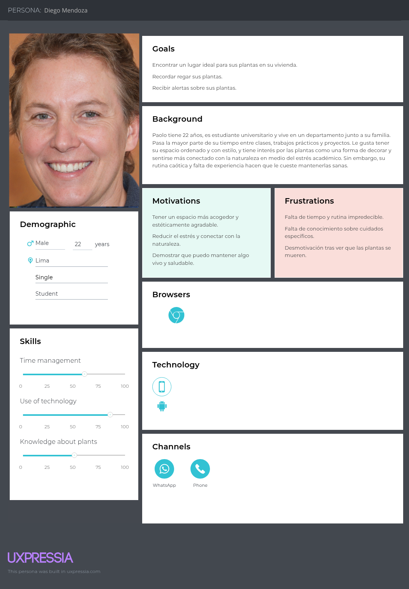


**Segmento Objetivo 2: Aficionados a la jardinería**

Este perfil refleja a una persona apasionada por las plantas, que ha convertido el cuidado de su colección en parte de su rutina y bienestar diario. Tiene conocimientos básicos o intermedios, disfruta investigando sobre especies, y encuentra satisfacción en ver crecer sus plantas. Aunque ya tiene experiencia, busca herramientas que le ayuden a organizar mejor los cuidados, registrar sus avances y seguir aprendiendo.

**Persona:** Carolina Vargas

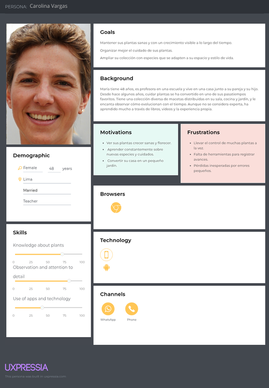


### 2.3.2. User Task Matrix

El User Task Matrix permite identificar y comparar los procesos clave de cada segmento, destacando sus similitudes en cuanto a frecuencia e importancia.

|**Necesidad / Función**|**Importancia (Personas ocupadas)**|**Frecuencia (Personas ocupadas)**|**Importancia (Aficionados)**|**Frecuencia (Aficionados)**|
| :- | :- | :- | :- | :- |
|Revisar manualmente la humedad del suelo |Alta|Media|Alta|Media|
|Interpretar señales visuales de la planta |Alta|Baja|Alta|Media|
|Regar las plantas en horarios fijos |Media|Baja|Media|Media|
|Consultar fuentes variadas para saber cuándo y cuánto regar|Media|Baja|Alta|Alta|
|Revisar el clima manualmente para ajustar el riego |Media|Baja|Media|Media|
|Tomar notas manuales del riego |Baja|Baja|Media|Media|
|Recorrer todas las macetas para revisar planta por planta|Baja|Baja|Alta|Alta|

En la matriz presentada, se pueden observar las siguientes tareas con mayor frecuencia e importancia:

- **Personas ocupadas**:

  - **Revisar manualmente la humedad del suelo**  
    Funcionalidad **más crítica**, con **importancia alta y frecuencia media**.  
    Las personas ocupadas necesitan un sistema confiable para medir la humedad del suelo, facilitando el riego de sus plantas sin depender de su disponibilidad.

  - **Regar las plantas en horarios fijos y revisar el clima manualmente**  
    Tareas de **media importancia** pero **frecuencia baja**. Son actividades que los usuarios intentan cumplir, pero que olvidan fácilmente.

  - **Tomar notas manuales del riego**  
    De **importancia y frecuencia baja**. No forman parte de su rutina diaria, por lo que pueden ofrecerse como funciones secundarias u opcionales dentro de Oryxen.

- **Aficionados a la jardinería**:

  - **Consultar fuentes variadas para saber cuándo y cuánto regar**  
    Funcionalidad **más crítica**, con **alta importancia y frecuencia**.  
    Requieren herramientas externas para garantizar el cuidado óptimo de sus plantas, por lo que valoran que Oryxen centralice esta información.

  - **Interpretar señales visuales de la planta**  
    Tareas de **alta importancia** pero **frecuencia media**.  
    Requieren experiencia y apoyo visual para comprobar el estado real de cada especie.

  - **Recorrer todas las macetas para revisar planta por planta**  
    Actividad de **alta importancia** y de **frecuencia alta**, que puede ser optimizada mediante el panel centralizado de Oryxen.

### 2.3.3. User Journey Mapping

El User Journey Mapping fue creado con el objetivo de entender cómo los usuarios experimentan nuestra plataforma. Este proceso describe paso a paso las acciones que realizan, los posibles obstáculos que enfrentan y las emociones que experimentan durante la interacción. De esta manera, nos permite detectar áreas de mejora para optimizar la usabilidad y aumentar la satisfacción del usuario.

#### Segmento 1: Personas ocupadas

En este User Journey Map se muestra la experiencia actual de Diego Mendoza, una persona ocupada que vive en un departamento y necesita atender sus plantas entre sus responsabilidades diarias.

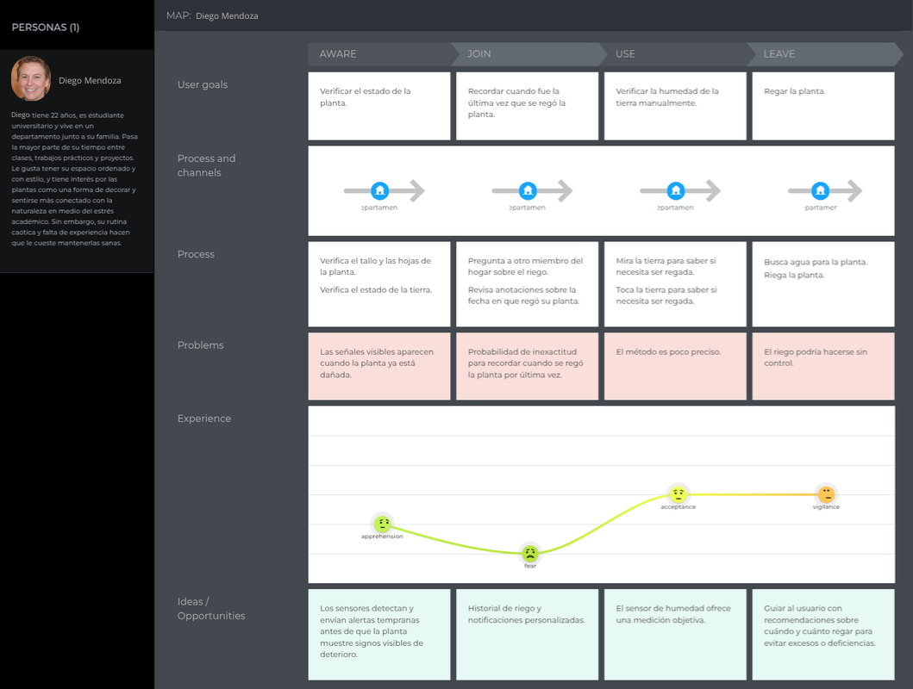

#### Segmento 2: Aficionados a la jardinería

En este User Journey Map se muestra la experiencia actual de Carolina Vargas, una aficionada a las plantas que vive en una casa y dedica parte de su día al cuidado de múltiples macetas de distintas especies.

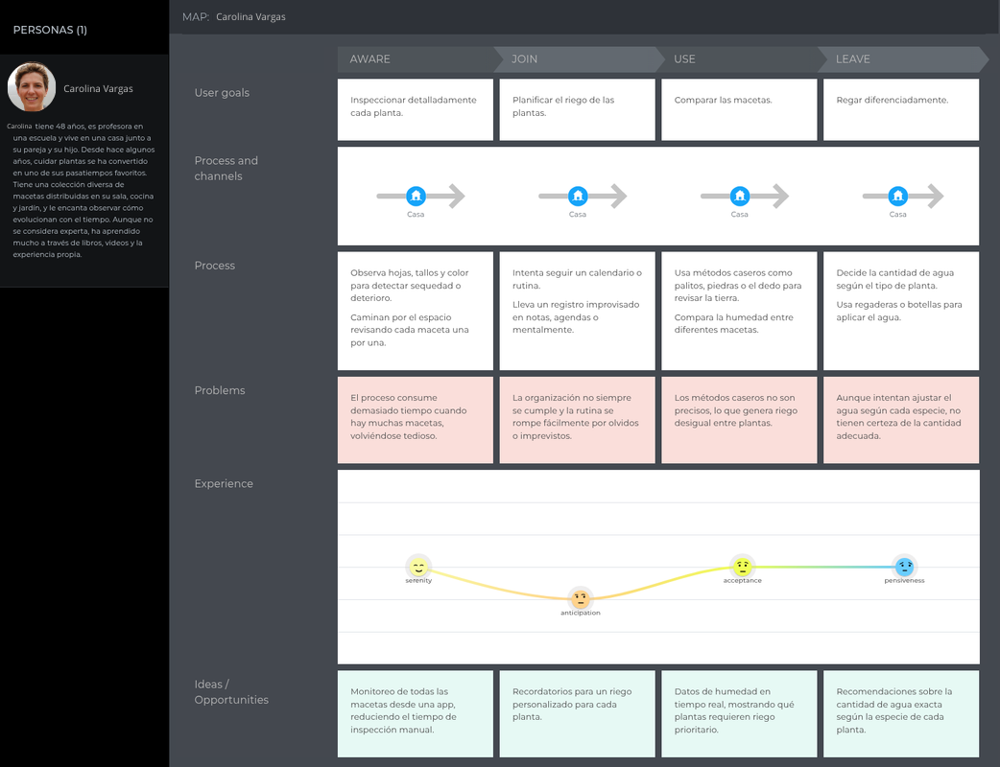

### 2.3.4. Empathy Mapping

Para desarrollar el Empathy Map, nos basamos en la información recopilada de nuestros dos User Personas, quienes representan a nuestros segmentos objetivo. Este recurso nos facilita una comprensión más profunda de las necesidades, pensamientos, emociones y conductas de los usuarios, lo que nos permite crear soluciones mejor adaptadas a sus expectativas y experiencias reales.

#### Segmento 1: Personas ocupadas

En el siguiente Empathy Map tenemos a Diego Mendoza, un joven profesional que vive en un departamento. Él lucha diariamente para conservar sus plantas en buen estado mientras equilibra su carga laboral y personal.

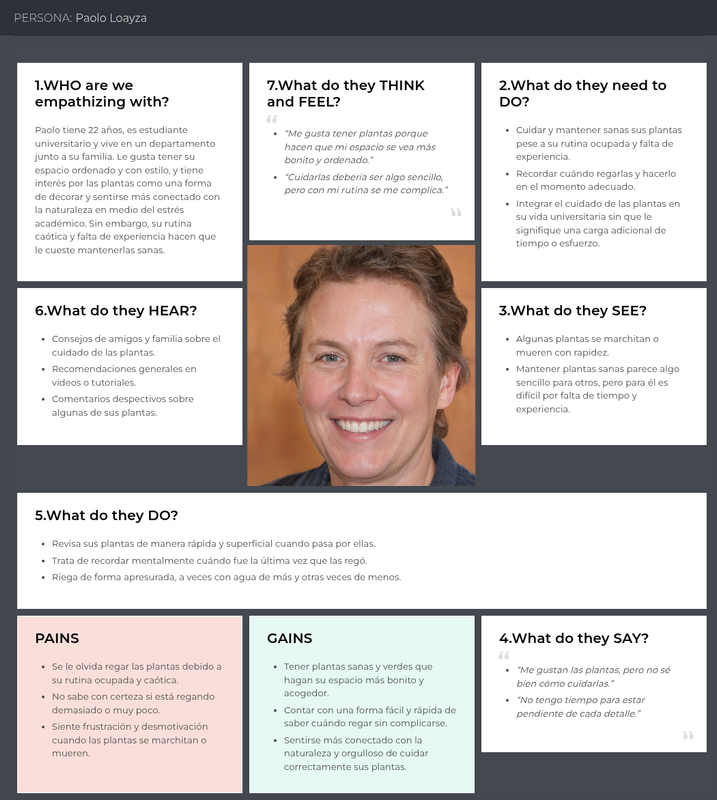

#### Segmento 2: Aficionados a la jardinería

En el siguiente Empathy Map observamos a Carolina Vargas, una mujer que vive en casa con su familia. Ella es una aficionada a las plantas que dedica tiempo recurrente al cuidado detallado de su colección.

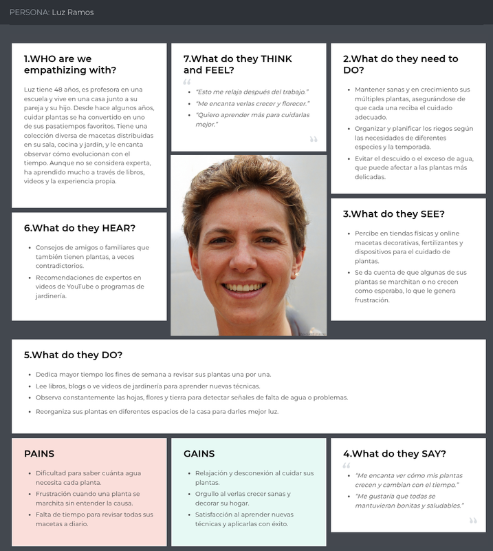

## 2.4. Big Picture EventStorming

Es un taller colaborativo diseñado para que un grupo de personas (desarrolladores, expertos en el negocio, gerentes de producto, etc.) exploren y entiendan un dominio de negocio complejo de manera rápida.

**Sus objetivos principales son:**

- **Alinear a todos:** Asegurarse de que todo el equipo tenga el mismo entendimiento del proceso de negocio.
- **Identificar problemas:** Descubrir cuellos de botella, dudas y complejidades que no son obvias a simple vista.
- **Crear un lenguaje común:** Empezar a construir un "lenguaje ubicuo", es decir, un vocabulario compartido entre los expertos del negocio y el equipo técnico.

***1. Preparing the room***

Para garantizar comodidad, eficiencia y colaboración en tiempo real, elegimos la plataforma Google Meets como entorno virtual para nuestro primer encuentro. Allí, nos reunimos con el objetivo de alinear la comprensión del negocio, identificar dudas clave, mapear problemas recurrentes y fomentar un ambiente de confianza y comunicación abierta basado en el dominio del problema: el cuidado automatizado de plantas en entornos domésticos y de oficina con Oryxen.


***2. Energizing the audience***

Para activar la atención y crear un clima positivo, iniciamos la sesión con una breve rutina de estiramientos físicos realizados desde nuestros espacios personales, seguida de un ejercicio cognitivo ligero (como un juego de memoria o resolución rápida de acertijos). Esta actividad buscó estimular la concentración, reducir la tensión y promover la conexión humana entre los participantes antes de abordar temas complejos.

***3. Briefing and presenting the plan***

A continuación, presentamos los objetivos centrales del proyecto: desarrollar Oryxen, un producto IoT que facilite el cuidado automatizado de plantas en espacios urbanos —ya sean pequeños departamentos, oficinas u hogares más amplios— mediante sensores inteligentes, riego automático, alertas personalizadas y un chatbot conversacional potenciado con IA.

Además, explicamos el modelo de negocio: un servicio de suscripción mensual que ofrece soporte técnico, recomendaciones personalizadas por especie y actualizaciones continuas, generando ingresos sostenibles. También se revisaron las convenciones básicas del negocio, como los roles esperados, los plazos clave y las herramientas de trabajo a utilizar.

***4. Generating Domain Events***

Pedimos a los participantes que escriban en post-its amarillos los "eventos" que ocurren en el proceso. Un evento es algo relevante para el negocio que ya sucedió (se escribe en pasado, ej: "Usuario registró planta", "Sensor reportó humedad baja", "Riego automático se activó").

[](https://postimg.cc/YGy6NcDZ)

***5. Sorting Domain Events***

Pedimos al equipo que ordene cronológicamente los eventos colocados en post-its amarillos sobre una pared, de izquierda a derecha, para construir una línea temporal del proceso de cuidado automatizado de plantas con Oryxen.

Este ejercicio no es solo un mero ordenamiento: es el momento más valioso de la sesión. Al debatir si el orden propuesto es correcto, el equipo comienza a revelar diferencias en sus percepciones, asunciones ocultas y malentendidos sobre cómo funciona realmente el proceso. Estas discusiones, lejos de ser conflictos, son oportunidades clave para alinear la comprensión colectiva, identificar brechas en el flujo del negocio y construir un modelo compartido y preciso del dominio.

[](https://postimg.cc/ZvddrWdY)

***6. Adding Actors and External Systems***

Para profundizar en la modelación del dominio, asignamos colores distintos a los elementos clave que interactúan con los eventos ya ordenados:

- **Actores:** Utilizando post-its de color naranja, identificamos quién (o qué rol) inicia o participa en cada evento. Estos actores representan personas, roles o entidades externas que intervienen en el proceso —por ejemplo: "Usuario final", "Administrador de Oryxen", "Agente del chatbot de IA". Esto permite mapear las responsabilidades humanas y lógicas dentro del flujo.

- **Sistemas Externos:** Con post-its de color azul, señalamos los sistemas, servicios o plataformas externas con los que el producto interactúa como "Pasarela de pagos", "Servicio de envío del kit de sensores", "API de clima local" o "Proveedor de modelos de IA para el chatbot". Esto ayuda a definir los puntos de integración necesarios y a anticipar dependencias técnicas.

- **Problemas o Dudas:** Utilizamos el rojo para identificar dudas o problemas en lugar de detenernos a debatir o discutir durante la sesión.

[](https://postimg.cc/ctwvvPpK)

***7. Storytelling***

Se recorre cronológicamente la línea de eventos, desde el inicio hasta el final, narrando la historia que los post-its construyen colectivamente. Esta narrativa permite validar la coherencia del flujo, identificar saltos lógicos, confirmar la secuencia de acciones y detectar eventuales omisiones o redundancias en el proceso de Oryxen.

[](https://postimg.cc/TyB2nCJ6)

***8. Reverse storytelling***

Como complemento, se puede realizar una narración inversa: partir del último evento y retroceder hasta el inicial. Este enfoque revela dependencias ocultas, puntos de fricción no evidentes en el sentido directo y posibles fallos en la causalidad del proceso. Es especialmente útil para desafiar supuestos y descubrir interacciones críticas que podrían pasar desapercibidas al seguir solo el orden tradicional.

***9. Closing***

Al cierre de la sesión, se evalúan los logros alcanzados:

- La construcción de un entendimiento compartido del dominio del negocio.
- La identificación clara de problemas, dudas y puntos de incertidumbre.
- El surgimiento de un lenguaje común entre los participantes, que facilita la comunicación técnica y operativa en futuras etapas del desarrollo de Oryxen.

## 2.5. Ubiquitous Language

| **Term** | **Definition** |
|----------|----------------|
| **Watering Threshold** | The minimum acceptable humidity level for a specific plant, which triggers a notification or an automatic watering action when reached. |
| **Humidity Sensor** | Component that measures the soil moisture level in the pot. |
| **Humidity Level** | Percentage value indicating the amount of water in the soil. |
| **Control Panel** | Main screen showing the overall status of all registered plants. |
| **Plant Profile** | Information linked to a specific plant (species, location, pot, threshold, photos). |
| **Push Notification** | Mobile message notifying the user about plant status, watering events or AI recommendations. |
| **Automatic Watering** | Action performed by the Oryxen device to water a plant when its humidity falls below the configured threshold. |
| **AI Chatbot** | Conversational assistant that provides personalized care recommendations based on plant data and user questions. |
| **Update Status** | Action of confirming in the app that the plant has been watered or cared for manually. |
| **Receive Notification** | Action of being alerted when a plant requires watering, is in a risk state or needs attention. |
| **Register Plant** | Action of adding a new plant into the system with its data, species and assigned sensor. |
| **Subscription Plan** | Service tier (free or premium) that defines the features and capabilities available to a user. |
| **Web Platform / Mobile App** | Digital interface accessible via computer or smartphone where users view and manage information about their plants. |
| **Device Monitoring** | Functionality that allows users to configure, monitor or troubleshoot installed IoT sensors from Oryxen. |


# Capítulo III: Requirements Specification

## 3.1. To-be Scenario Mapping
To-Be Scenario Map 1- Segmento de : Personas Ocupadas
[](https://postimg.cc/grbs31cL)

To-Be Scenario Map 2- Segmento de : Aficionados
[](https://postimg.cc/sMxx80XW)

## 3.2 User Stories

### Epics
| Epic / Story ID | Título | Descripción | Criterios de Aceptación | Relacionado con (Epic ID) |
|-----------------|--------|-------------|--------------------------|--------------------------|
| EPIC 001 | Landing Page |Como visitante, quiero acceder a una landing page con contenido diferenciado para personas ocupadas y aficionados, para identificar rápidamente cómo el producto se adapta a mi perfil específico.|**Escenario 01: Contenido para personas ocupadas**<br>- Dado que un visitante del segmento "personas ocupadas" accede al sitio<br>- Cuando navega por las secciones<br>- Entonces encuentra casos de uso sobre automatización y ahorro de tiempo<br>- Y ve testimonios de usuarios con perfiles similares al suyo <br> **Escenario 02: Contenido para aficionados**<br>- Dado que un visitante del segmento "aficionados" explora el sitio<br>- Cuando revisa las funcionalidades<br>- Entonces encuentra información sobre herramientas avanzadas y análisis de datos<br>- Y ve ejemplos de diagnósticos detallados y seguimiento histórico <br>	**Reglas de Negocio:**<br>- La landing page debe cargar completamente en menos de 3 segundos en conexión 4G<br>- El contenido debe estar disponible en español e inglés<br>- Los testimonios deben ser de usuarios reales verificados<br>- Los CTAs deben ser visibles sin necesidad de scroll en viewport móvil|N/A|
| EPIC 002 | Autenticación y Seguridad |Como usuario, quiero registrarme e iniciar sesión de forma segura, para proteger mis datos personales y el historial de mis plantas. |**Escenario 01: Registro seguro**<br>- Dado que un visitante se registra en la plataforma<br>- Cuando proporciona email válido y contraseña segura<br>- Entonces recibe confirmación por correo electrónico<br>- Y sus credenciales se almacenan de forma encriptada<br>**Escenario 02: Inicio de sesión confiable**<br>- Dado que un usuario registrado intenta acceder<br>- Cuando ingresa credenciales correctas<br>- Entonces el sistema autentica y redirige a su dashboard<br>- Y la sesión se mantiene segura durante la navegación **Reglas de Seguridad:**<br>- Las contraseñas deben tener mínimo 8 caracteres con al menos 1 mayúscula, 1 número y 1 carácter especial<br>- Los tokens de sesión expiran después de 24 horas de inactividad<br>- Máximo 5 intentos de login fallidos antes de bloqueo temporal por 30 minutos<br>- Todos los datos sensibles deben encriptarse en tránsito y en reposo|N/A|
| EPIC 003 | Gestión Básica de Plantas |Como usuario, quiero registrar y administrar mis plantas de manera sencilla, para tener un control centralizado de todas mis plantas en un solo lugar. |**Escenario 01: Registro simplificado**<br>- Dado que un usuario quiere agregar una nueva planta<br>- Cuando completa información básica (nombre, especie, ubicación)<br>- Entonces la planta queda registrada en su dashboard<br>- Y el proceso se completa en menos de 2 minutos<br>**Escenario 02: Visualización unificada**<br>- Dado que un usuario tiene múltiples plantas registradas<br>- Cuando accede a su dashboard principal<br>- Entonces ve todas sus plantas con estado actual de salud<br>- Y puede identificar rápidamente las que necesitan atención<br>**Reglas de Límites:**<br>- Usuarios gratuitos pueden registrar hasta 5 plantas<br>- Usuarios premium pueden registrar hasta 50 plantas<br>- El nombre de planta no puede exceder 50 caracteres<br>- No se permiten caracteres especiales en nombres de plantas excepto guiones|N/A|
| EPIC 004 | Monitoreo Automatizado para Personas Ocupadas |Como persona ocupada, quiero que el sistema monitoree automáticamente mis plantas y me notifique solo cuando sea estrictamente necesario, para liberarme de la carga mental de recordar constantemente su cuidado.|**Escenario 01: Notificación proactiva**<br>- Dado que una planta alcanza umbral crítico de humedad<br>- Cuando el sistema detecta la necesidad urgente<br>- Entonces envía una notificación push directa y clara<br>- Y el usuario no necesita revisar la app constantemente<br>**Escenario 02: Modo silencioso**<br>- Dado que todas las plantas están en estado óptimo<br>- Cuando el usuario revisa la aplicación<br>- Entonces ve un estado "Todo en orden"<br>- Y no recibe notificaciones innecesarias<br>**Reglas de Notificaciones:**<br>- No se envían notificaciones entre 10 PM y 7 AM hora local del usuario<br>- Máximo 3 notificaciones por día para usuarios del plan básico<br>- Las notificaciones críticas ignoran el modo silencioso del dispositivo<br>- Se requiere confirmación de lectura para notificaciones críticas|N/A|
| EPIC 005 | Herramientas Avanzadas para Aficionados |Como aficionado a las plantas, quiero acceder a diagnósticos detallados, historiales extensos y recomendaciones personalizadas, para profundizar en mi conocimiento y optimizar el cuidado basado en datos.|**Escenario 01: Diagnóstico detallado**<br>- Dado que una planta muestra signos de estrés<br>- Cuando el usuario consulta el diagnóstico avanzado<br>- Entonces recibe información sobre posibles causas (exceso de agua, falta de luz, etc.)<br>- Y ve soluciones específicas recomendadas<br>**Escenario 02: Historial completo**<br>- Dado que un usuario quiere analizar tendencias<br>- Cuando accede al historial de una planta<br>- Entonces visualiza gráficos de evolución de humedad, temperatura y luz<br>- Y puede comparar con períodos anteriores<br>**Reglas de Acceso:**<br>- Los diagnósticos avanzados requieren suscripción premium<br>- El historial se retiene por 24 meses para usuarios premium, 3 meses para básicos<br>- Los reportes PDF no pueden exceder 10MB de tamaño<br>- Los datos de exportación incluyen solo información del usuario, no de la comunidad|N/A|
| EPIC 006 | Comunidad y Colaboración entre Usuarios |Como usuario, quiero participar en una comunidad donde pueda compartir experiencias, recibir consejos de otros cuidadores y colaborar en el cuidado de plantas, para enriquecer mi conocimiento y sentirme parte de una red de apoyo. |**Escenario 01: Experiencia comunitaria integrada**<br>- Dado que un usuario completa el registro básico<br>- Cuando accede por primera vez a la comunidad<br>- Entonces encuentra contenido relevante según sus tipos de plantas<br>- Y puede interactuar inmediatamente con otros usuarios afines**Escenario 02: Valor educativo continuo**<br>- Dado que un usuario participa regularmente en la comunidad<br>- Cuando comparte y recibe feedback<br>- Entonces acumula conocimiento aplicable a sus plantas<br>- Y mejora progresivamente sus técnicas de cuidado<br>**Reglas de Comunidad:**<br>- Usuarios nuevos no pueden publicar enlaces externos hasta tener 10 reputación<br>- Las fotos compartidas no pueden exceder 5MB ni contener metadatos de ubicación<br>- El contenido se modera automáticamente con lista de palabras prohibidas<br>- Usuarios pueden reportar contenido, con 3 reportes se suspende publicación automáticamente    | N/A|
| EPIC 007 | Alertas Inteligentes Contextuales|Como usuario, quiero recibir alertas contextuales que me indiquen no solo el problema sino también causas posibles y soluciones, para tomar acciones informadas rápidamente.|**Escenario 01: Alerta con diagnóstico**<br>- Dado que la humedad del suelo baja críticamente<br>- Cuando se genera la alerta<br>- Entonces incluye posible causa (temperatura alta, suelo muy drenante, maceta pequeña)<br>- Y sugiere acciones específicas (regar inmediatamente, mover a sombra, transplantar)<br>**Escenario 02: Alertas preventivas**<br>- Dado que una planta muestra tendencia descendente en salud<br>- Cuando el sistema detecta patrón de deterioro<br>- Entonces envía alerta preventiva antes de llegar a estado crítico<br>- Y recomienda acciones correctivas tempranas<br>**Reglas de Alertas:**<br>- Las alertas preventivas requieren tendencia consistente de 72 horas<br>- El diagnóstico automático considera máximo 3 causas probables por alerta<br>- Las soluciones sugeridas deben estar validadas por al menos 10 casos exitosos en la comunidad<br>- No se generan alertas por fluctuaciones menores al 5% en rangos normales|N/A|
| EPIC 008 | Configuración Inteligente de Dispositivos|Como usuario, quiero vincular y configurar fácilmente mis sensores IoT con perfiles predefinidos según mi tipo de planta y ubicación, para que el dispositivo comience a monitorear automáticamente sin necesidad de configuración técnica compleja.|**Escenario 01: Vinculación simplificada**<br>- Dado que un usuario adquiere un nuevo sensor<br>- Cuando escanea el código QR del dispositivo<br>- Entonces el sistema lo detecta automáticamente<br>- Y guía al usuario en asignarlo a una planta específica<br>**Escenario 02: Configuración automática por tipo de planta**<br>- Dado que un usuario selecciona "Suculenta" al registrar planta<br>- Cuando vincula el sensor<br>- Entonces el sistema aplica automáticamente umbrales de humedad para suculentas<br>- Y configura frecuencias de monitoreo adecuadas<br>**Reglas de Dispositivos:**<br>- Máximo 3 dispositivos por usuario en plan básico, ilimitado en premium<br>- Los dispositivos deben recertificar conexión cada 24 horas<br>- La batería crítica se define como menor al 15% de capacidad<br>- Los datos de sensores se muestran con precisión de ±2% para humedad, ±0.5°C para temperatura|N/A| 
| EPIC 009 | Gestión de suscripciones|Como usuario, quiero elegir entre diferentes modelos de adopción progresiva (plan básico gratuito, suscripción premium de software o compra de hardware modular) según mis necesidades y presupuesto, para acceder a las funcionalidades que más valoro sin barreras de entrada altas.|**Escenario 01: Plan Básico Gratuito**<br>- Dado que un usuario prefiere probar la plataforma sin costo inicial<br>- Cuando selecciona el plan Básico<br>-Entonces accede a funciones esenciales de monitoreo y registro manual de plantas y no tiene compromisos de pagos recurrentes ni requiere comprar hardware<br> **Escenario 02: Suscripción premium (Solo Software)** <br>- Dado que un usuario quiere funcionalidades avanzadas sin comprar sensores<br>- Cuando elige la suscripción mensual premium<br>- Entonces desbloquea diagnósticos con IA, historial extenso y soporte avanzado.<br>- Y puede cancelar en cualquier momento<br> **Escenario 03: compra de Hardware Modular (Sensor Lite)** <br>- Dado que un usuario desea automatizar su monitoreo<br>- Cuando adquiere el Sensor Lite de entrada<br>- Entonces integra los datos automáticos a su plan y recibe meses de suscripción premium incluidos.<br>**Reglas de Facturación:**<br>- Las suscripciones se renuevan automáticamente 24 horas antes del vencimiento<br>- Período de gracia de 7 días para pagos fallidos antes de suspensión<br>- Reembolsos completos dentro de primeros 14 días de suscripción<br>- Los cambios de plan premium a básico mantienen funciones hasta fin de período pagado|N/A|
| EPIC 010 | Gestión de Riego 100% Autónomo | Como usuario, quiero que el sistema gestione de forma autónoma el riego de mis plantas, para asegurar su hidratación óptima sin necesidad de intervención manual o supervisión constante. | **Escenario 01: Ejecución de riego por demanda**<br> - Dado que el sensor detecta que la humedad del suelo es inferior al umbral de la especie <br> - Cuando el sistema valida que no ha habido riego reciente <br> - Entonces activa automáticamente la bomba de agua hasta alcanzar el nivel ideal <br> - Y registra el volumen de agua consumido. <br> **Escenario 02: Suspensión inteligente de riego**  <br> - Dado que el sistema tiene programado un riego <br> - Cuando la predicción climática local indica lluvia inminente (>80% probabilidad) <br> - Entonces el sistema pospone el riego autónomo para ahorrar agua y evitar sobrehidratación. <br> **Reglas de Negocio:** <br>- El sistema debe enviar un reporte diario de acciones autónomas realizadas. <br> - Existe un ""Failsafe"" que corta el riego si el sensor no detecta cambios en 60 segundos (evitar inundaciones por fuga). <br> - Los registros de riego deben guardarse por 12 meses. | N/A |
| EPIC 011 | Diagnóstico por Visión Artificial | Como usuario, quiero capturar imágenes de mis plantas para que una IA identifique automáticamente plagas, enfermedades o deficiencias nutricionales de forma inmediata. | **Escenario 01: Identificación de anomalías** <br> - Dado que un usuario toma una foto de una hoja con manchas o decoloración- Cuando el motor de IA procesa la imagen- Entonces identifica la posible enfermedad con un porcentaje de certeza- Y sugiere un tratamiento específico (insecticida, fertilizante, etc.). **Escenario 02: Seguimiento de crecimiento** <br> - Dado que el usuario toma fotos periódicas <br> - Cuando accede al módulo de salud <br> - Entonces la IA compara las imágenes para determinar la tasa de crecimiento y vigorosidad. <br> **Reglas de Negocio:** <br> - El procesamiento de imagen (Inferencia) debe completarse en menos de 5 segundos. <br> - Se requiere una certeza mínima del 85% para dar una recomendación de producto químico. <br> - Las imágenes se almacenan en un bucket optimizado para análisis histórico. | N/A |
| EPIC 012 | Asistente Virtual (Chatbot) | Como usuario, quiero interactuar con un asistente inteligente que conozca el estado real de mis plantas, para resolver dudas técnicas y recibir consejos personalizados mediante lenguaje natural. | **Escenario 01: Consulta de estado** <br> - Dado que un usuario pregunta "¿Cómo están mis plantas hoy?" <br> - Cuando el chatbot analiza los datos de los sensores y el historial de riego <br> - Entonces responde con un resumen ejecutivo sobre la salud general de su jardín. <br> **Escenario 02: Resolución de dudas sobre cuidados** <br> - Dado que un usuario tiene una duda sobre una especie nueva <br> - Cuando consulta al chatbot sobre cuidados de luz o sustrato <br> - Entonces el asistente brinda información técnica validada por su base de conocimientos. <br> **Reglas de Negocio:** <br> - El chatbot debe mantener el contexto de la conversación durante al menos 10 minutos. <br> - Las respuestas deben ser personalizadas según el inventario de plantas del usuario. <br> - El tiempo de respuesta inicial del bot debe ser inferior a 2 segundos. | N/A |


### User Stories

| Epic / Story ID | Título | Descripción | Criterios de Aceptación | Relacionado con (Epic ID) |
|-----------------|--------|-------------|--------------------------|--------------------------|
|US-001|Acceso a la Landing Page|Como visitante, quiero acceder a una landing page optimizada desde cualquier dispositivo, para conocer rápidamente los beneficios del producto y cómo se adapta a diferentes tipos de usuarios.  |<br>**Escenario 01: Acceso correcto**<br>- Dado que un visitante accede a la URL de la aplicación<br>- Cuando carga la página desde un navegador compatible<br>- Entonces la landing page se muestra correctamente<br>- Y el contenido principal es visible en menos de 3 segundos<br>**Escenario 02: Responsividad**<br>- Dado que un visitante accede desde un dispositivo móvil<br>- Cuando carga la landing page<br>- Entonces la página se adapta al tamaño de pantalla<br>- Y los elementos principales son accesibles sin perder funcionalidad <br>**Reglas de negocio:**<br>- La página debe ser accesible desde cualquier dispositivo con conexión a internet y navegador compatible con HTML5.<br>- El tiempo de carga del contenido principal no debe superar los 3 segundos en conexiones estándar (4G o fibra).|EPIC 001|
|US-002|Secciones informativas diferenciadas|Como visitante, quiero ver secciones que muestren cómo el producto beneficia tanto a personas ocupadas como a aficionados, para identificar cómo se adapta a mis necesidades específicas.|**Escenario 01: Beneficios para personas ocupadas**<br>- Dado que un visitante explora la landing page<br>- Cuando revisa las secciones informativas<br>- Entonces encuentra contenido sobre automatización y ahorro de tiempo<br>- Y ve cómo el sistema libera la carga mental del cuidado constante<br>Escenario 02: Beneficios para aficionados<br>- Dado que un visitante con interés en datos accede al sitio<br>- Cuando navega por las funcionalidades<br>- Entonces encuentra información sobre herramientas avanzadas y análisis detallados<br>- Y comprende cómo puede optimizar sus cuidados basado en datos|EPIC-001|
|US-003|Call to Action contextual|Como visitante, quiero encontrar botones de acción claros y contextualizados según mis intereses, para iniciar mi relación con el producto de manera sencilla.|**Escenario 01: CTA para registro**<br>- Dado que un visitante decide registrarse<br>- Cuando hace clic en "Comenzar ahora" o "Registrarse"<br>- Entonces es redirigido al formulario de registro<br>- Y la transición ocurre sin errores ni demoras<br>**Escenario 02: CTA para más información**<br>- Dado que un visitante quiere conocer más detalles<br>- Cuando selecciona "Ver planes" o "Conocer funcionalidades"<br>- Entonces accede a secciones específicas con información detallada<br>- Y puede comparar opciones según sus necesidades<br>**Reglas de negocio:**<br>-Todos los botones de acción deben redirigir a rutas válidas dentro del ecosistema del producto (registro, planes, información).<br>- Las llamadas a la acción deben mantenerse visibles en todas las resoluciones (no ocultarse en móviles).|EPIC-001|
|US-004|Testimonios segmentados|Como visitante, quiero ver testimonios de usuarios reales que representen diferentes perfiles (ocupados y aficionados), para confiar en que el producto funciona para casos similares al mío.|**Escenario 01: Testimonios diversos**<br>- Dado que un visitante revisa la sección de testimonios<br>- Cuando explora las experiencias compartidas<br>- Entonces encuentra casos de personas ocupadas que resolvieron problemas de olvido<br>- Y también casos de aficionados que mejoraron sus técnicas de cuidado<br>**Escenario 02: Credibilidad de testimonios**<br>- Dado que un visitante evalúa la confiabilidad del producto<br>- Cuando revisa los testimonios<br>- Entonces cada testimonio incluye nombre y contexto de uso real<br>- Y las imágenes refuerzan la autenticidad de las experiencias<br>**Reglas de negocio:**<br>-Los testimonios deben corresponder a usuarios reales y verificados del producto.<br>- Cada testimonio debe incluir al menos el nombre y contexto del usuario.<br>- Las imágenes asociadas no pueden vulnerar la privacidad ni contener información sensible.|EPIC-001|
|US-005|Registro de usuario|Como visitante, quiero registrarme con datos básicos protegidos, para crear una cuenta segura que salvaguarde mi información personal y el historial de mis plantas.|**Escenario 01: Registro exitoso con validación**<br>- Dado que un visitante accede al formulario de registro<br>- Cuando completa nombre, email válido y contraseña segura<br>- Entonces el sistema crea la cuenta y envía confirmación por email<br>- Y las credenciales se almacenan de forma encriptada<br>**Escenario 02: Protección contra datos inválidos**<br>- Dado que un visitante ingresa email inválido o contraseña débil<br>- Cuando intenta registrarse<br>- Entonces el sistema muestra mensajes de error específicos<br>- Y no permite el registro hasta corregir los problemas de seguridad<br>**Reglas de negocio:**<br>-Cada usuario debe registrarse con un correo electrónico único y verificado.<br>- Las contraseñas deben cumplir políticas mínimas de seguridad (mínimo 8 caracteres, mayúsculas, minúsculas, número y símbolo).<br>- El sistema debe encriptar las contraseñas antes de almacenarlas.|EPIC-002|
|US-006|Inicio de sesión|Como usuario registrado, quiero autenticarme de forma segura con mis credenciales, para acceder de manera protegida a mis plantas y dispositivos.|**Escenario 01: Autenticación exitosa**<br>- Dado que un usuario registrado ingresa credenciales válidas<br>- Cuando el sistema verifica la identidad<br>- Entonces se concede acceso al dashboard principal<br>- Y se establece una sesión segura con token de autenticación<br>**Escenario 02: Protección contra acceso no autorizado**<br>- Dado que un usuario ingresa credenciales incorrectas<br>- Cuando el sistema detecta el error<br>- Entonces muestra mensaje genérico "Credenciales inválidas"<br>- Y registra el intento fallido para monitoreo de seguridad<br>**Reglas de negocio:**<br>-Cada sesión debe generar un token JWT válido por tiempo limitado (24 h).|EPIC-002|
|US-007|Recuperación de contraseña|	Como usuario, quiero recuperar mi cuenta de forma segura si olvido mis credenciales, para mantener el acceso protegido a mi información.|**Escenario 01: Solicitud de recuperación segura**<br>- Dado que un usuario solicita recuperar contraseña<br>- Cuando ingresa su email registrado<br>- Entonces el sistema envía enlace temporal con token de seguridad<br>- Y el enlace expira después de un tiempo limitado<br>**Escenario 02: Restablecimiento confirmado**<br>- Dado que un usuario accede al enlace de recuperación<br>- Cuando define una nueva contraseña segura<br>- Entonces el sistema actualiza las credenciales y notifica el cambio<br>- Y todas las sesiones activas se cierran automáticamente<br>**Reglas de negocio:**<br>- Los tokens de recuperación solo pueden usarse una vez.|EPIC-002|
|US-008|Gestión de sesión|Como usuario, quiero que mi sesión se maneje de forma segura, protegiendo mis datos contra accesos no autorizados por inactividad.|**Escenario 01: Cierre manual seguro**<br>- Dado que un usuario autenticado cierra sesión<br>- Cuando selecciona la opción de logout<br>- Entonces todas las tokens de acceso se invalidan<br>- Y se redirige a la página de login con confirmación<br>**Escenario 02: Protección por inactividad**<br>- Dado que un usuario permanece inactivo por 30 minutos<br>- Cuando el sistema detecta la inactividad<br>- Entonces cierra automáticamente la sesión por seguridad<br>- Y muestra mensaje informando la expiración por seguridad<br>**Reglas de negocio:**<br>- Cada usuario puede mantener máximo una sesión activa por dispositivo.<br>- Los tokens de sesión deben invalidarse al cerrar sesión o cambiar credenciales.|EPIC-002|
|US-009|Autenticación externa segura|Como usuario, quiero autenticarme mediante proveedores confiables como Google, para acceder rápidamente manteniendo estándares de seguridad.|**Escenario 01: Autenticación OAuth2 exitosa**<br>- Dado que un usuario selecciona "Iniciar con Google"<br>- Cuando completa el flujo de autorización OAuth2<br>- Entonces el sistema crea o recupera la cuenta asociada<br>- Y establece una sesión segura con los mismos privilegios<br>**Escenario 02: Manejo seguro de fallos**<br>- Dado que la autenticación externa falla<br>- Cuando el sistema recibe error del proveedor<br>- Entonces muestra mensaje genérico sin detalles técnicos<br>- Y permite intentar nuevamente o usar método alternativo<br>**Reglas de negocio:**<br>- El sistema solo debe permitir autenticación mediante proveedores externos aprobados.<br>- n caso de error en el flujo OAuth2, el sistema no debe revelar información técnica ni del proveedor. |EPIC-002|
|US-010|Cerrar sesión|Como usuario, quiero cerrar sesión de manera definitiva en todos los dispositivos, para garantizar la privacidad de mis datos al usar equipos compartidos.|**Escenario 01: Cierre de sesión global**<br>- Dado que un usuario cierra sesión manualmente<br>- Cuando confirma la acción<br>- Entonces se invalidan todos los tokens de acceso activos<br>- Y se eliminan los datos temporales del dispositivo local<br>**Escenario 02: Confirmación de cierre seguro**<br>- Dado que un usuario cierra sesión exitosamente<br>- Cuando intenta acceder a páginas protegidas<br>- Entonces el sistema redirige al login solicitando reautenticación<br>- Y no muestra información sensible en URLs o caché<br>**Reglas de negocio:**<br>- El cierre de sesión debe invalidar todos los tokens activos asociados al usuario.|EPIC-002|
|US-011|Registro simplificado de planta|Como usuario, quiero registrar una nueva planta completando información básica esencial, para tener un control centralizado de mis plantas sin complicaciones.|**Escenario 01: Registro exitoso**<br>- Dado que un usuario está en el formulario de registro de planta<br>- Cuando completa nombre, especie y ubicación (campos obligatorios)<br>- Entonces la planta se guarda automáticamente en su dashboard<br>- Y el proceso se completa en menos de 2 minutos<br>**Escenario 02: Validación de campos esenciales**<br>- Dado que un usuario deja campos obligatorios en blanco<br>- Cuando intenta guardar la planta<br>- Entonces el sistema muestra mensajes claros indicando los campos requeridos<br>- Y no permite el registro hasta completar la información mínima <br>**Reglas de negocio:**<br>-Cada planta debe estar asociada a un usuario autenticado.<br>- Los campos nombre, especie y ubicación son obligatorios para crear una planta.<br>- No se permite registrar dos plantas con el mismo nombre dentro de la misma cuenta de usuario.<br>- El sistema debe registrar automáticamente fecha de creación y última modificación.|EPIC-003|
|US-012|Edición rápida de información de planta|Como usuario, quiero editar la información básica de una planta registrada, para mantener mis datos actualizados de manera ágil.|**Escenario 01: Edición exitosa**<br>- Dado que un usuario selecciona una planta de su lista<br>- Cuando modifica información básica (nombre, especie, ubicación) y guarda<br>- Entonces los cambios se actualizan inmediatamente en el sistema<br>- Y la información modificada se refleja al instante en todas las vistas<br>**Escenario 02: Cancelación de edición**<br>- Dado que un usuario está editando una planta<br>- Cuando decide cancelar los cambios<br>- Entonces regresa a la vista anterior sin modificar la información<br>- Y los datos originales se mantienen intactos<br>**Reglas de negocio:**<br>-Solo el usuario propietario puede editar la información de una planta.<br>- Los cambios deben reflejarse de forma inmediata y persistirse en la base de datos.<br>-  No se permite guardar una edición si los campos obligatorios quedan vacíos.|EPIC-003|
|US-013|Eliminación confirmada de planta|Como usuario, quiero eliminar plantas que ya no cuido, para mantener mi lista actualizada y ordenada.|**Escenario 01: Eliminación con confirmación**<br>- Dado que un usuario selecciona eliminar una planta<br>- Cuando confirma la acción en el diálogo de verificación<br>- Entonces la planta desaparece de su lista principal<br>- Y el sistema muestra mensaje de confirmación de eliminación<br>**Escenario 02: Cancelación de eliminación**<br>- Dado que un usuario inicia el proceso de eliminación<br>- Cuando decide cancelar en el diálogo de confirmación<br>- Entonces la planta permanece en su lista sin cambios<br>- Y regresa a la vista normal de gestión de plantas <br>**Reglas de negocio:**<br>-Toda eliminación debe requerir confirmación explícita del usuario.<br>- Las alertas y registros asociados a la planta deben quedar desactivados automáticamente.<br> -No se permite eliminar una planta vinculada a sensores activos sin aviso previo.|EPIC-003|
|US-014|Configuración de parámetros básicos|Como usuario, quiero definir parámetros esenciales para cada planta, para personalizar el monitoreo según sus necesidades específicas.|**Escenario 01: Configuración de umbrales básicos**<br>- Dado que un usuario accede a la configuración de una planta<br>- Cuando define niveles de humedad mínimos y máximos recomendados<br>- Entonces los parámetros se guardan asociados al perfil de la planta<br>- Y el sistema los utiliza para generar alertas personalizadas<br>**Escenario 02: Aplicación de perfiles predefinidos**<br>- Dado que un usuario selecciona "Suculenta" como especie<br>- Cuando el sistema sugiere parámetros automáticos para esa especie<br>- Entonces el usuario puede aceptar la configuración recomendada<br>- Y los umbrales se aplican automáticamente sin configuración manual<br>**Reglas de negocio:**<br>- Cada planta debe tener configurados al menos los umbrales mínimos y máximos de humedad.<br>- Los valores de umbrales deben estar dentro de rangos válidos definidos por el sistema|EPIC-003|
|US-015|Visualización unificada de plantas|Como usuario, quiero ver todas mis plantas en una vista consolidada con estado de salud, para tener una visión rápida del estado general de mi colección.|**Escenario 01: Lista principal organizada**<br>- Dado que un usuario tiene múltiples plantas registradas<br>- Cuando accede a la sección "Mis plantas"<br>- Entonces visualiza una lista con nombre, especie, ubicación y estado de salud<br>- Y puede identificar rápidamente las plantas que necesitan atención prioritaria<br>**Escenario 02: Visualización responsive**<br>- Dado que un usuario accede desde dispositivo móvil<br>- Cuando navega por su lista de plantas<br>- Entonces la interfaz se adapta al tamaño de pantalla manteniendo legibilidad<br>- Y todas las funcionalidades principales permanecen accesibles<br>**Reglas de negocio:**<br>-Solo deben mostrarse las plantas activas del usuario autenticado.<br>- Cada planta debe mostrar su último estado de salud calculado con base en sus umbrales y mediciones recientes.<br>- El listado debe ordenarse por prioridad de atención|EPIC-003|
|US-016|Alertas esenciales de riego|Como persona ocupada, quiero recibir solo notificaciones críticas cuando mis plantas necesiten riego urgente, para actuar rápidamente sin saturación de alertas.|**Escenario 01: Alerta solo en umbral crítico**<br>- Dado que la humedad del suelo baja por debajo del nivel de emergencia<br>- Cuando el sistema detecta riesgo inminente para la planta<br>- Entonces envía una notificación push clara y urgente<br>- Y no notifica por fluctuaciones menores dentro de rangos seguros <br>**Reglas de negocio:**<br>-El sistema solo debe generar una alerta de riego cuando la humedad del suelo esté por debajo del umbral crítico configurado para la planta.<br>- No se deben enviar notificaciones por pequeñas fluctuaciones dentro del rango seguro.<br>- Si existen múltiples plantas en estado crítico, las alertas deben agruparse en una sola notificación resumen.|EPIC-004|
|US-017|Notificaciones de temperatura extrema|Como persona ocupada, quiero ser alertado solo cuando la temperatura represente peligro real para mis plantas, para evitar distracciones por variaciones normales.|**Escenario 01: Alerta por temperatura peligrosa**<br>- Dado que la temperatura supera umbrales de supervivencia de la planta<br>- Cuando la condición extrema persiste más de 15 minutos<br>- Entonces se envía alerta con acción inmediata requerida<br>- Y se suprime notificación por variaciones estacionales normales <br>**Reglas de negocio:**<br>- El sistema debe emitir alertas solo cuando la temperatura esté fuera de los umbrales de supervivencia definidos para la especie.|EPIC-004|
|US-018|Recordatorios programados simplificados|Como persona ocupada, quiero recordatorios básicos en horarios convenientes, para integrar el cuidado de plantas en mi rutina sin complicaciones.|**Escenario 01: Recordatorio en horario accesible**<br>- Dado que un usuario configura horario de recordatorio<br>- Cuando llega el momento programado en horario no laboral<br>- Entonces recibe notificación simple con lista de plantas a revisar<br>- Y la alerta no interrumpe durante horas ocupadas <br>**Reglas de negocio:**<br>- Los recordatorios deben configurarse solo en horarios definidos como “no laborales” o convenientes por el usuario.<br>- El sistema debe permitir un máximo de un recordatorio activo por planta al mismo tiempo.|EPIC-004|
|US-019|Monitoreo detallado de humedad ambiental|Como aficionado, quiero monitorear precisamente la humedad del aire, para optimizar el microclima de mis plantas especializadas.|**Escenario 01: Análisis de humedad ambiental**<br>- Dado que un sensor mide humedad ambiental fuera de rango ideal<br>- Cuando el aficionado consulta los datos detallados<br>- Entonces ve gráficos de tendencia y correlación con temperatura<br>- Y recibe recomendaciones técnicas específicas para ajustar <br>**Reglas de negocio:**<br>- Los datos anómalos o incompletos deben marcarse y excluirse del análisis gráfico|EPIC-005|
|US-020|Visualización avanzada en tiempo real|Como aficionado, quiero ver datos de sensores en tiempo real con múltiples parámetros, para realizar análisis instantáneos del estado de mis plantas.|**Escenario 01: Dashboard avanzado en tiempo real**<br>- Dado que un aficionado accede al dashboard<br>- Cuando los sensores envían datos continuamente<br>- Entonces visualiza múltiples métricas simultáneamente con actualización en segundos<br>- Y puede correlacionar humedad, temperatura y luz en una vista <br>**Reglas de negocio:**<br>-Los valores mostrados deben estar sincronizados con el timestamp más reciente disponible|EPIC-005|
|US-021|Análisis histórico con gráficos avanzados|Como aficionado, quiero analizar tendencias históricas con gráficos interactivos, para identificar patrones y mejorar mis técnicas de cuidado.|**Escenario 01: Análisis de tendencias multivariable**<br>- Dado que un aficionado selecciona rango de fechas<br>- Cuando explora los datos históricos<br>- Entonces puede superponer múltiples variables en gráficos comparativos<br>- Y identificar correlaciones entre condiciones ambientales y salud de plantas <br>**Reglas de negocio:**<br>- Los usuarios pueden consultar datos históricos dentro de un rango máximo <br> - Las consultas históricas deben optimizarse para no sobrecargar el servidor|EPIC-005|
|US-022|Reportes semanales detallados|Como aficionado, quiero recibir reportes semanales exhaustivos, para realizar seguimiento meticuloso del progreso de mis plantas.|**Escenario 01: Reporte técnico semanal**<br>- Dado que finaliza la semana<br>- Cuando el sistema genera el reporte automático<br>- Entonces incluye análisis de varianza, tendencias y comparativas<br>- Y destaca anomalías con explicaciones técnicas detalladas<br>**Reglas de negocio:**<br>- El sistema debe generar automáticamente un reporte semanal para cada usuario activo con plantas monitoreadas|EPIC-005|
|US-023|Reportes de largo plazo|Como aficionado, quiero acceder a reportes mensuales y anuales consolidados, para entender la evolución estacional de mi colección.|**Escenario 01: Análisis estacional**<br>- Dado que un aficionado solicita reporte mensual/anual<br>- Cuando el sistema procesa los datos acumulados<br>- Entonces genera análisis comparativo entre períodos<br>- Y identifica patrones estacionales y efectividad de cuidados <br>**Reglas de negocio:**<br>-Los reportes mensuales y anuales deben generarse a partir de los datos validados acumulados.<br>- El sistema debe comparar períodos consecutivos para detectar mejoras o deterioros en las condiciones.|EPIC-005|
|US-024|Exportación para análisis externo|Como aficionado, quiero exportar datos crudos en formatos analíticos, para realizar estudios avanzados con herramientas especializadas.|**Escenario 01: Exportación de datos completos**<br>- Dado que un aficionado necesita analizar datos externamente<br>- Cuando selecciona exportar dataset completo<br>- Entonces recibe archivo con todos los datos crudos y metadatos<br>- Y puede importarlo en software de análisis especializado<br>**Reglas de negocio:**<br>- Los formatos permitidos son .csv, .xlsx y .json para compatibilidad con software analítico externo|EPIC-005|
|US-025|Diagnóstico automático en alertas|Como usuario, quiero que las alertas incluyan diagnóstico automático de causas, para entender el problema raíz y aplicar la solución correcta.|**Escenario 01: Alerta con diagnóstico contextual**<br>- Dado que se detecta un problema en una planta<br>- Cuando el sistema analiza múltiples variables<br>- Entonces la alerta incluye probable causa (ej: "Posible exceso de riego por drenaje insuficiente")<br>- Y sugiere solución específica ("Reducir frecuencia de riego en 50%")<br>**Reglas de negocio:**<br>-Las recomendaciones deben estar basadas en guías validadas del sistema y no generarse sin evidencia contextual.|EPIC-011|
|US-026|	Historial de diagnósticos|Como usuario, quiero revisar el historial de alertas y diagnósticos anteriores, para aprender de patrones recurrentes y mejorar mis cuidados.|**Escenario 01: Consulta de historial diagnóstico**<br>- Dado que un usuario quiere aprender de experiencias pasadas<br>- Cuando accede al historial de alertas<br>- Entonces ve cada alerta con diagnóstico aplicado y resultado<br>- Y puede filtrar por tipo de problema o planta específica<br>**Reglas de negocio:**<br>-Cada usuario debe poder acceder solo a su propio historial de alertas y diagnósticos. <br>- El historial debe registrar fecha, diagnóstico, acción recomendada y resultado final. |EPIC-005|
|US-027|Integración automática a la comunidad|Como usuario registrado, quiero ser parte automáticamente de la comunidad según mis intereses de plantas, para comenzar a colaborar inmediatamente sin trámites adicionales.|**Escenario 01: Acceso inmediato**<br>- Dado que un usuario completa su registro en la plataforma<br>- Cuando accede por primera vez a la aplicación<br>- Entonces ya es miembro activo de la comunidad<br>- Y ve contenido personalizado según sus plantas registradas<br>**Escenario 02: Personalización por intereses**<br>- Dado que un usuario tiene plantas de especies específicas<br>- Cuando explora la comunidad<br>- Entonces encuentra grupos y discusiones relevantes a sus especies<br>- Y recibe recomendaciones de usuarios con plantas similares<br>**Reglas de negocio:**<br>-Todo usuario registrado debe ser asignado automáticamente a la comunidad al completar su perfil inicial.<br>- La categorización dentro de la comunidad debe basarse en especies de plantas registradas e intereses declarados.|EPIC 006|
|US-028|Feed comunitario|Como usuario, quiero ver un feed personalizado con publicaciones relevantes a mis plantas y nivel de experiencia, para encontrar contenido útil rápidamente.|**Escenario 01: Contenido contextual**<br>- Dado que un usuario accede al feed comunitario<br>- Cuando el sistema analiza sus plantas e historial<br>- Entonces muestra publicaciones prioritarias según sus necesidades actuales<br>- Y sugiere contenido educativo basado en sus especies<br>Escenario 02: Actualización en tiempo real<br>- Dado que un usuario está navegando el feed<br>- Cuando otros usuarios publican nuevo contenido relevante<br>- Entonces el feed se actualiza dinámicamente<br>- Y destaca publicaciones con alta interacción de la comunidad<br>**Reglas de negocio:**<br>-El contenido mostrado debe priorizar publicaciones relacionadas con especies, ubicación o temas de interés del usuario. |EPIC 006|
|US-029|	Compartir experiencias de cuidado|Como usuario, quiero compartir mis aprendizajes y técnicas exitosas de cuidado, para contribuir al conocimiento colectivo y ayudar a otros cuidadores.|**Escenario 01: Publicación de consejos estructurados**<br>- Dado que un usuario quiere compartir un consejo<br>- Cuando utiliza el formulario de publicación guiada<br>- Entonces puede categorizar por tipo de planta, problema y solución<br>- Y otros usuarios pueden aplicar fácilmente sus recomendaciones**Escenario 02: Validación comunitaria**<br>- Dado que un usuario publica un consejo<br>- Cuando otros usuarios lo aplican exitosamente<br>- Entonces recibe retroalimentación positiva y reputación<br>- Y el consejo gana visibilidad en la comunidad<br>**Reglas de negocio:**<br>-Toda publicación debe incluir al menos una categoría (tipo de planta, problema o técnica).<br>- Los usuarios pueden recibir “reconocimiento comunitario” basado en validaciones positivas.|EPIC 006|
|US-030|Compartir progreso con fotos seguras|Como usuario, quiero compartir el progreso de mis plantas mediante fotos procesadas para privacidad, para documentar evolución sin comprometer mi seguridad.|**Escenario 01: Subida segura de imágenes**<br>- Dado que un usuario selecciona una foto para compartir<br>- Cuando el sistema procesa la imagen<br>- Entonces elimina automáticamente metadatos de ubicación y dispositivo<br>- Y aplica compresión que mantiene calidad pero protege privacidad**Escenario 02: Galería de progreso**<br>- Dado que un usuario comparte múltiples fotos de una planta<br>- Cuando otros usuarios visitan su perfil<br>- Entonces pueden ver la evolución temporal organizada<br>- Y aprender del progreso documentado<br>**Reglas de negocio:**<br>- El sistema debe comprimir las imágenes garantizando equilibrio entre calidad y seguridad|EPIC 006|
|US-031|Sistema de feedback para mejorar alertas|Como usuario, quiero evaluar la utilidad de las alertas recibidas, para contribuir a que el sistema aprenda y mejore su precisión para todos.|**Escenario 01: Evaluación simple de alertas**<br>- Dado que un usuario recibe una notificación del sistema<br>- Cuando marca si fue útil o no<br>- Entonces el sistema registra el feedback anónimamente<br>- Y ajusta algoritmos para futuras alertas similares<br>**Escenario 02: Aprendizaje colectivo**<br>- Dado que múltiples usuarios evalúan alertas similares<br>- Cuando el sistema detecta patrones de feedback<br>- Entonces mejora la precisión de umbrales y timing<br>- Y reduce falsos positivos para toda la comunidad<br>**Reglas de negocio:**<br>- El feedback de los usuarios sobre alertas debe almacenarse de forma anónima y agregada. <br>- No se puede modificar ni eliminar retroalimentación una vez registrada.|EPIC 006|
|US-032|	Interacción y aprendizaje comunitario|Como usuario, quiero recibir comentarios y reacciones en mis publicaciones, para aprender de perspectivas diversas y mejorar mis técnicas.|Escenario 01: Notificaciones de interacción<br>- Dado que un usuario publica contenido en la comunidad<br>- Cuando otros usuarios comentan o reaccionan<br>- Entonces recibe notificaciones organizadas por relevancia<br>- Y puede responder fácilmente desde cualquier dispositivo**Escenario 02: Construcción de conocimiento**<br>- Dado que se genera una discusión técnica en una publicación<br>- Cuando múltiples usuarios comparten experiencias<br>- Entonces se forma un hilo de conocimiento valioso<br>- Y todos los participantes aprenden de las soluciones compartidas<br>**Reglas de negocio:**<br>- Los usuarios deben poder comentar o reaccionar únicamente en publicaciones públicas.|EPIC 006|
|US-033|Compartir en redes sociales externas|Como usuario, quiero compartir logros significativos en mis redes sociales, para inspirar a otros y documentar mis éxitos en el cuidado de plantas.|**Escenario 01: Compartir logros**<br>- Dado que un usuario tiene un logro significativo (primera flor, recuperación exitosa)<br>- Cuando selecciona compartir en redes sociales<br>- Entonces genera un post optimizado con imagen y descripción<br>- Y incluye enlace de regreso para atraer nuevos usuarios**Escenario 02: Personalización de compartido**<br>- Dado que un usuario quiere compartir contenido<br>- Cuando selecciona la plataforma destino<br>- Entonces adapta automáticamente formato y extensión<br>- Y mantiene atribución a la comunidad. <br>**Reglas de negocio:**<br>- Solo se pueden compartir publicaciones o logros propios del usuario.|EPIC 006|
|US-034|	Moderación proactiva de contenido|Como administrador, quiero mantener un ambiente seguro y constructivo en la comunidad, para garantizar que todos los usuarios tengan una experiencia positiva.|**Escenario 01: Revisión escalable de contenido**<br>- Dado que se publica nuevo contenido en la comunidad<br>- Cuando el sistema detecta posibles violaciones de normas<br>- Entonces prioriza esas publicaciones para revisión humana<br>- Y sugiere acciones basadas en historial de moderación<br>**Escenario 02: Transparencia en moderación**<br>- Dado que un administrador modera una publicación<br>- Cuando toma una acción (aprobar, editar, eliminar)<br>- Entonces registra la razón específica en logs auditables<br>- Y notifica al usuario con explicación clara cuando aplica<br>**Reglas de negocio:**<br>- Los administradores deben ser notificados de contenido reportado para validación manual.|EPIC 006|
|US-035|Protección automática de privacidad en fotos|Como usuario, quiero que todas mis fotos sean procesadas automáticamente para eliminar información sensible, para compartir libremente sin preocupaciones de seguridad.|**Escenario 01: Sanitización automática**<br>- Dado que un usuario sube cualquier foto a la plataforma<br>- Cuando el sistema procesa la imagen<br>- Entonces elimina EXIF data, ubicación GPS y metadatos del dispositivo<br>- Y aplica marca de agua discreta para protección de derechos<br>**Escenario 02: Verificación de privacidad**<br>- Dado que una foto ha sido procesada<br>- Cuando el usuario revisa la publicación<br>- Entonces puede confirmar que no contiene información sensible<br>- Y recibe explicación de las protecciones aplicadas<br>**Reglas de negocio:**<br>- El usuario debe poder verificar visualmente que su foto fue procesada antes de hacerse pública.|EPIC 006|
| US-036          | Alertas con diagnóstico integrado            | Como usuario, quiero recibir notificaciones que incluyan diagnóstico automático del problema, para entender la causa raíz y aplicar la solución correcta inmediatamente.                                                       | **Escenario 01: Diagnóstico contextual automático**<br>- Dado que se detecta humedad críticamente baja en una planta<br>- Cuando el sistema analiza variables ambientales simultáneas<br>- Entonces la alerta identifica causa probable (ej: "Temperatura alta aumentó evaporación")<br>- Y recomienda solución específica ("Regar ahora y considerar mover a sombra parcial")<br><br>**Escenario 02: Múltiples causas posibles**<br>- Dado que una planta muestra estrés por múltiples factores<br>- Cuando el sistema evalúa correlaciones<br>- Entonces prioriza las 2-3 causas más probables<br>- Y sugiere acciones para cada escenario posible <br>**Reglas de negocio:**<br>-Cada alerta debe generarse solo después de analizar al menos dos variables ambientales correlacionadas | EPIC 007                   |
| US-037          | Alertas preventivas basadas en tendencias    | Como usuario, quiero recibir advertencias tempranas cuando mis plantas muestren patrones de deterioro, para intervenir antes de que los problemas se vuelvan críticos.                                                         | **Escenario 01: Detección de tendencia negativa**<br>- Dado que una planta muestra disminución gradual en salud<br>- Cuando el sistema identifica patrón consistente por 3+ días<br>- Entonces envía alerta preventiva con análisis de tendencia<br>- Y sugiere ajustes proactivos en cuidado<br><br>**Escenario 02: Alerta de riesgo estacional**<br>- Dado que cambia la estación y las condiciones ambientales<br>- Cuando el sistema proyecta impacto en plantas específicas<br>- Entonces envía recomendaciones preventivas estacionales<br>- Y ajusta umbrales de alerta automáticamente <br>**Reglas de negocio:**<br>-El sistema debe evitar generar alertas preventivas si los datos presentan vacíos o inconsistencias. <br>- Los umbrales de alerta deben reajustarse automáticamente tras cada intervención o cambio de estación.| EPIC 007                   |
| US-038          | Alertas con soluciones escalonadas           | Como usuario, quiero que las alertas sugieran acciones inmediatas y planes a largo plazo, para resolver problemas tanto urgentes como estructurales.                                                                           | **Escenario 01: Solución inmediata + preventiva**<br>- Dado que se detecta problema de humedad recurrente<br>- Cuando se genera la alerta<br>- Entonces sugiere acción inmediata ("Regar ahora")<br>- Y recomienda solución permanente ("Considerar maceta con mejor drenaje")<br><br>**Escenario 02: Plan de acción progresivo**<br>- Dado que una planta tiene problema complejo<br>- Cuando el usuario consulta la alerta extendida<br>- Entonces muestra plan de 3 pasos con timeline<br>- Y incluye indicadores de éxito para cada etapa <br>**Reglas de negocio:**<br>- Cada alerta debe ofrecer una acción inmediata y una acción a largo plazo, claramente diferenciadas.| EPIC 007                   |
| US-039          | Alertas personalizadas por tipo de usuario   | Como usuario, quiero recibir alertas adaptadas a mi nivel de experiencia y disponibilidad, para obtener recomendaciones que pueda implementar fácilmente.                                                                      | **Escenario 01: Alertas para principiantes**<br>- Dado que un usuario tiene perfil de "principiante"<br>- Cuando se genera una alerta<br>- Entonces usa lenguaje simple y acciones básicas<br>- Y evita terminología técnica compleja<br><br>**Escenario 02: Alertas para expertos**<br>- Dado que un usuario tiene perfil de "experimentado"<br>- Cuando se genera una alerta<br>- Entonces incluye datos técnicos y opciones avanzadas<br>- Y sugiere experimentos o ajustes finos<br>**Reglas de negocio:**<br>- Las terminologías técnicas deben evitarse por completo en perfiles de principiantes.| EPIC 007                   |
| US-040          | Sistema de confirmación y seguimiento        | Como usuario, quiero confirmar cuando he aplicado las soluciones sugeridas y recibir seguimiento, para cerrar el ciclo de cuidado y mejorar el aprendizaje.                                                                    | **Escenario 01: Confirmación de acción tomada**<br>- Dado que un usuario recibe una alerta con solución<br>- Cuando marca "Acción completada"<br>- Entonces el sistema registra la intervención<br>- Y programa seguimiento automático en 24-48 horas<br><br>**Escenario 02: Seguimiento de efectividad**<br>- Dado que un usuario aplicó una solución recomendada<br>- Cuando pasa el período de seguimiento<br>- Entonces el sistema verifica si el problema se resolvió<br>- Y solicita feedback sobre la efectividad de la recomendación<br>**Reglas de negocio:**<br>-Cada alerta con acción recomendada debe permitir al usuario marcarla como “acción completada”. | EPIC 007                   |
| US-041          | Alertas con integración de conocimiento comunitario | Como usuario, quiero que las alertas incluyan soluciones validadas por la comunidad, para beneficiarme de la experiencia colectiva de otros cuidadores.                                                                       | **Escenario 01: Soluciones comunitarias validadas**<br>- Dado que se detecta un problema común<br>- Cuando se genera la alerta<br>- Entonces incluye soluciones con alta tasa de éxito reportada por la comunidad<br>- Y muestra testimonios de usuarios que resolvieron problema similar<br><br>**Escenario 02: Enlace a discusiones relevantes**<br>- Dado que un usuario quiere profundizar en un problema<br>- Cuando consulta una alerta extendida<br>- Entonces muestra enlaces a discusiones comunitarias sobre el mismo tema<br>- Y sugiere expertos en la comunidad que pueden ayudar <br>**Reglas de negocio:**<br>- Las alertas deben incluir recomendaciones con base en soluciones validadas por usuarios con alta reputación dentro de la comunidad.| EPIC 007                   |
| US-042          | Vinculación simplificada de dispositivo   | Como usuario, quiero vincular nuevos sensores IoT mediante escaneo de código QR, para comenzar a monitorear mis plantas inmediatamente sin configuración técnica compleja.                          | **Escenario 01: Registro por QR**<br>- Dado que un usuario adquiere un nuevo sensor compatible<br>- Cuando escanea el código QR del dispositivo con la app<br>- Entonces el sistema detecta automáticamente el modelo y características<br>- Y guía al usuario para asignarlo a una planta específica<br><br>**Escenario 02: Configuración automática**<br>- Dado que un usuario vincula un sensor a una planta registrada<br>- Cuando la planta tiene especie definida (ej: "Suculenta")<br>- Entonces el sistema aplica umbrales predefinidos para esa especie<br>- Y configura frecuencias de monitoreo óptimas automáticamente <br>**Reglas de negocio:**<br>- Cada dispositivo debe tener un código QR único que contenga su ID, modelo y clave de autenticación.| EPIC 008                   |
| US-043          | Configuración inteligente por perfil de planta | Como usuario, quiero que el sistema configure automáticamente los parámetros del dispositivo según el tipo de planta, para optimizar el monitoreo sin requerir conocimiento técnico.                  | **Escenario 01: Aplicación de perfiles predefinidos**<br>- Dado que un usuario selecciona "Orquídea" al registrar una planta<br>- Cuando vincula un sensor a esa planta<br>- Entonces el sistema aplica parámetros específicos para orquídeas (humedad alta, luz indirecta)<br>- Y ajusta sensibilidad de alertas según necesidades de la especie<br><br>**Escenario 02: Personalización de parámetros automáticos**<br>- Dado que un usuario tiene configuración automática activa<br>- Cuando el sistema detecta condiciones ambientales locales<br>- Entonces ajusta umbrales considerando clima y estación<br>- Y notifica al usuario sobre los ajustes aplicados <br>**Reglas de negocio:**<br>- Los perfiles predefinidos de planta deben estar almacenados en una base de conocimiento estandarizada (catálogo de especies)<br> -El sistema debe aplicar automáticamente umbrales y sensibilidades según la especie seleccionada.| EPIC 008                   |
| US-044          | Recepción de datos en tiempo real         | Como usuario, quiero ver las lecturas de mis sensores actualizarse en tiempo real, para monitorear el estado actual de mis plantas instantáneamente.                                                | **Escenario 01: Actualización continua**<br>- Dado que un dispositivo está transmitiendo datos<br>- Cuando el usuario visualiza el dashboard de una planta<br>- Entonces los valores de humedad, temperatura y luz se actualizan cada 30 segundos<br>- Y los cambios se reflejan sin necesidad de recargar manualmente<br><br>**Escenario 02: Indicadores de estado de conexión**<br>- Dado que un dispositivo está operativo<br>- Cuando el usuario revisa el estado del sensor<br>- Entonces ve indicador visual de "Conectado" y última actualización<br>- Y puede ver historial de estabilidad de conexión <br>**Reglas de negocio:**<br>-Los dispositivos deben enviar lecturas en intervalos de 30 segundos por defecto, ajustables por configuración.<br>- Si un dispositivo no envía datos durante más de 2 minutos, debe marcarse como “en riesgo de desconexión”.| EPIC 008                   |
| US-045          | Gestión proactiva de conectividad         | Como usuario, quiero ser notificado proactivamente sobre problemas de conexión del dispositivo, para mantener el monitoreo continuo de mis plantas.                                                 |**Escenario 01: Alerta de desconexión**<br>- Dado que un dispositivo vinculado pierde conexión<br>- Cuando el sistema detecta falta de comunicación por 5 minutos<br>- Entonces envía notificación push informando la desconexión<br>- Y sugiere verificar batería, WiFi o posición del dispositivo<br>**Escenario 02: Reconexión automática**<br>- Dado que un dispositivo se reconecta después de falla<br>- Cuando restablece comunicación con el servidor<br>- Entonces el sistema notifica la reconexión exitosa<br>- Y sincroniza datos acumulados durante el período offline<br>**Reglas de negocio:**<br>- Una alerta de desconexión se genera tras 5 minutos consecutivos sin comunicación con el servidor.<br> - El sistema debe intentar reconexión automática antes de emitir alerta al usuario.| EPIC 008                   |
| US-046          | Selección flexible de planes              | Como usuario, quiero elegir entre diferentes modelos de pago según mis necesidades, para acceder a las funcionalidades que mejor se adapten a mi presupuesto y nivel de uso.                        | **Escenario 01: Selección del Plan Básico Gratuito**<br>- Dado que un usuario no deseaa invertir dinero incialmente<br>- Cuando selecciona el plan "Básico" en la pantalla de suscripciones<br>- Entonces  el sistema le otorga acceso a la gestión manual de plantas y no le solicita información de tarjetas de crédito <br><br>**Escenario 02: Selección de Suscripción premium**<br>- Dado que un usuario necesita diágnosticos automatizados por IA <br>- Cuando selecciona el plan "Premium" y completa el pago<br>- Entonces el sistema desbloquea el chatbot experto y la visión artificial en su cuenta.<br> **Escenario 03: Expansión con Kit de Hardware**<br>- Dado que un usuario quiere dejar de medir la humedad manualmente <br>- Cuando compra el 'Sensor Lite' desde la plataforma <br>- Entonces el sistema vincula el sensor a su cuenta y se activa la recolección de datos en tiempo real. <br>**Reglas de negocio:**<br>- Los planes disponibles deben estar definidos en un catálogo dinámico administrable desde backend. <br>- Los beneficios de cada plan deben actualizarse inmediatamente tras el pago o cambio.| EPIC 009                   |
| US-047          | Gestión segura de métodos de pago         | Como usuario, quiero administrar mi información de pago de forma segura, para mantener mis suscripciones activas y actualizadas.                                                                    | **Escenario 01: Actualización de tarjeta**<br>- Dado que un usuario necesita actualizar su método de pago<br>- Cuando agrega nueva tarjeta en la sección de facturación<br>- Entonces el sistema valida y tokeniza la información de forma segura<br>- Y confirma que el nuevo método está disponible para futuros cobros<br><br>**Escenario 02: Rotación segura de credenciales**<br>- Dado que un usuario reemplaza su método de pago principal<br>- Cuando el sistema procesa el cambio<br>- Entonces invalida los tokens anteriores inmediatamente<br>- Y notifica sobre la actualización exitosa <br>**Reglas de negocio:**<br>- Los datos de tarjetas deben ser tokenizados y nunca almacenados directamente por el sistema.| EPIC 009                   |
| US-048          | Cancelación flexible de suscripciones     | Como usuario, quiero poder cancelar mi suscripción en cualquier momento, para tener control total sobre mis gastos recurrentes.                                                                    | **Escenario 01: Cancelación inmediata con acceso hasta fin de período**<br>- Dado que un usuario decide cancelar su suscripción<br>- Cuando confirma la cancelación en la app<br>- Entonces el acceso premium se mantiene hasta el final del período pagado<br>- Y no se realizan cobros recurrentes adicionales<br><br>**Escenario 02: Confirmación de cancelación**<br>- Dado que un usuario completa el proceso de cancelación<br>- Cuando el sistema procesa la solicitud<br>- Entonces envía comprobante de cancelación por email<br>- Y muestra confirmación en la app con fecha de finalización <br>**Reglas de negocio:**<br>- La cancelación debe poder realizarse sin intervención del soporte técnico.<br>- Tras cancelar, el acceso premium se mantiene hasta el final del período ya pagado.| EPIC 009                   |
| US-049          | Transparencia en historial de pagos       | Como usuario, quiero consultar mi historial completo de transacciones, para tener control y registro de todos mis pagos y suscripciones.                                                            | **Escenario 01: Consulta de historial financiero**<br>- Dado que un usuario accede a su historial de pagos<br>- Cuando navega por las transacciones<br>- Entonces ve fecha, monto, método de pago y concepto de cada cargo<br>- Y puede filtrar por tipo de transacción (suscripción, compra única, etc.)<br><br>**Escenario 02: Descarga de comprobantes**<br>- Dado que un usuario necesita un comprobante específico<br>- Cuando selecciona descargar recibo de pago<br>- Entonces genera PDF con detalles completos de la transacción<br>- Y el documento incluye información fiscal requerida <br>**Reglas de negocio:**<br>-Todas las transacciones deben registrarse con número único, monto, fecha y método de pago.<br>- El historial debe conservar al menos 12 meses de registros accesibles para el usuario.| EPIC 009                   |
| US-050          | Recordatorios de renovación               | Como usuario, quiero recibir notificaciones anticipadas sobre renovaciones de suscripción, para gestionar mis finanzas proactivamente.                                                              | **Escenario 01: Alerta de renovación próxima**<br>- Dado que un usuario tiene suscripción activa<br>- Cuando faltan 3 días para la renovación automática<br>- Entonces recibe notificación push y email recordatorio<br>- Y el mensaje incluye monto a cobrar y fecha exacta<br><br>**Escenario 02: Confirmación post-renovación**<br>- Dado que se procesa una renovación de suscripción<br>- Cuando el cobro es exitoso<br>- Entonces el sistema notifica la renovación completada<br>- Y envía comprobante del nuevo período de servicio <br>**Reglas de negocio:**<br>- El sistema debe enviar notificación 3 días antes de la renovación automática.<br>- El recordatorio debe incluir monto, fecha exacta y método de pago configurado.<br>- Tras renovación exitosa, debe emitirse comprobante digital inmediato.| EPIC 009                   |
| US-051 | Activación de Riego Autónomo | Como usuario, quiero que el sistema active la bomba de riego automáticamente cuando la humedad baje del umbral crítico, para no tener que intervenir manualmente. | **Escenario 01: Riego por umbral alcanzado** <br> - Dado que el sensor envía una lectura menor al 20% de humedad. <br> - Cuando el sistema valida el perfil de la planta. <br> - Entonces envía una señal de encendido al actuador por un tiempo definido. <br> **Regla:** El sistema no debe regar más de una vez cada 4 horas para evitar encharcamiento. | EPIC 010 |
| US-052 | Interrupción por Clima (IA) | Como usuario, quiero que el sistema suspenda el riego autónomo si hay pronóstico de lluvia, para ahorrar agua y proteger la planta. | **Escenario 01: Suspensión por lluvia** <br> - Dado que el sensor detecta necesidad de riego. <br> - Cuando la API de clima detecta un 80% o más de probabilidad de lluvia en las próximas 2 horas. <br> - Entonces el sistema cancela el riego y notifica al usuario. | EPIC 010 |
| US-053 | Diagnóstico por Fotografía (IA) | Como usuario, quiero tomar una foto de una hoja dañada para recibir un diagnóstico inmediato de plagas o enfermedades. | **Escenario 01: Identificación de plaga** <br> - Dado que el usuario sube una foto al módulo de IA. <br> - Cuando el modelo de Visión Artificial analiza la imagen. <br> - Entonces muestra el nombre de la plaga (ej. "Araña roja") y el tratamiento sugerido. | EPIC 011 |
| US-054 | Análisis de Crecimiento Visual | Como usuario, quiero que la IA compare fotos históricas de mi planta para medir su crecimiento real. | **Escenario 01: Reporte de crecimiento** <br> - Dado que existen fotos de hace 30 días y actuales. <br> - Cuando el usuario solicita "Analizar crecimiento" a través del botón correspondiente. <br> - Entonces la IA calcula el aumento porcentual de masa foliar o altura. | EPIC 011 |
| US-055 | Consulta al Chatbot | Como usuario, quiero preguntarle al chatbot dudas sobre mi planta para obtener respuestas rápidas sin buscar en manuales. | **Escenario 01: Pregunta técnica** <br> - Dado que el usuario escribe "¿Por qué las puntas de mi planta están cafés?". <br> - Cuando el Chatbot analiza el mensaje y los datos de humedad recientes. <br> - Entonces responde identificando si es falta de riego o exceso de sales. | EPIC 012 |


<div style="page-break-after: always;"></div>

### Technical Stories
| Epic / Story ID | Título | Descripción | Criterios de Aceptación | Relacionado con (Epic ID) |
|-----------------|---------|-------------|--------------------------|----------------------------|
| TS-001 | Autenticación con JWT | Como desarrollador frontend, quiero autenticar usuarios mediante email y contraseña para obtener un token JWT que permita acceder a recursos protegidos. | **Escenario: Inicio de sesión exitoso**<br>Dado un usuario con credenciales válidas<br>Cuando se envía una solicitud POST /auth/login<br>Entonces el sistema responde con 200 OK y un token JWT válido.<br><br>**Escenario: Credenciales inválidas**<br>Dado un usuario con credenciales incorrectas<br>Cuando intenta iniciar sesión<br>Entonces el sistema responde con 401 Unauthorized y mensaje de error.<br><br>**Reglas:**<br>- El token expira a las 24 horas.<br>- Después de 3 intentos fallidos consecutivos, se bloquea el acceso por 15 minutos. | EPIC-002 |
| TS-002 | Registro de usuarios con validación segura | Como desarrollador frontend, quiero permitir que los usuarios se registren con validación segura, para garantizar la integridad y confidencialidad de los datos. | **Escenario: Registro exitoso**<br>Dado un usuario nuevo con datos válidos<br>Cuando envía la solicitud POST /auth/register<br>Entonces el sistema crea el usuario y responde con 201 Created.<br><br>**Escenario: Datos inválidos o incompletos**<br>Dado que el usuario omite campos requeridos<br>Cuando intenta registrarse<br>Entonces el sistema responde con 400 Bad Request y errores de validación.<br><br>**Reglas:**<br>- Contraseñas deben tener al menos 8 caracteres, una mayúscula, un número y un símbolo.<br>- El correo electrónico debe ser único y verificado. | EPIC-002 |
| TS-003 | Control de acceso basado en roles | Como desarrollador backend, quiero implementar un control de acceso por roles (usuario, administrador) para restringir el uso de endpoints sensibles. | **Escenario: Usuario autorizado**<br>Dado que un usuario tiene rol “administrador”<br>Cuando accede a un endpoint protegido<br>Entonces el sistema responde con 200 OK.<br><br>**Escenario: Usuario sin permisos**<br>Dado un usuario con rol “usuario”<br>Cuando intenta acceder a un endpoint restringido<br>Entonces el sistema responde con 403 Forbidden.<br><br>**Reglas:**<br>- Los roles deben definirse desde base de datos.<br>- El middleware valida los permisos antes de procesar la solicitud. | EPIC-002 |
| TS-004 | Interfaz de gestión de dispositivos | Como desarrollador backend, quiero implementar las operaciones CRUD para los dispositivos IoT vinculados a usuarios, para administrar su registro, edición y eliminación. | **Escenario: Registro de dispositivo**<br>Dado un usuario con cuenta activa<br>Cuando envía una solicitud con los datos del dispositivo<br>Entonces el sistema registra el dispositivo y responde con 201 Created.<br><br>**Escenario: Eliminación de dispositivo inexistente**<br>Dado un ID no registrado<br>Cuando se intenta eliminar<br>Entonces el sistema responde con 404 Not Found.<br><br>**Reglas:**<br>- Cada usuario puede registrar hasta 3 dispositivos en plan básico.<br>- El sistema valida duplicados por número de serie. | EPIC-008 |
| TS-005 | Visualización en tiempo real de sensores | Como desarrollador frontend, quiero mostrar datos de los sensores en tiempo real, para que el usuario observe el estado actual de sus plantas. | **Escenario: Datos en tiempo real disponibles**<br>Dado un dispositivo IoT activo<br>Cuando el sistema recibe lecturas de sensores<br>Entonces los valores se actualizan automáticamente en la interfaz.<br><br>**Escenario: Dispositivo desconectado**<br>Dado un sensor sin conexión<br>Cuando el usuario abre el panel<br>Entonces se muestra estado “sin conexión” y último valor registrado.<br><br>**Reglas:**<br>- Las actualizaciones deben recibirse cada 30 segundos máximo.<br>- Si no hay datos por más de 1 minuto, mostrar alerta de desconexión. | EPIC-004 |
| TS-006 | Visualización histórica de métricas | Como desarrollador frontend, quiero mostrar el historial de métricas ambientales (humedad, temperatura, luz) para cada planta. | **Escenario: Historial existente**<br>Dado que una planta tiene registros previos<br>Cuando el usuario accede al historial<br>Entonces el sistema muestra un gráfico con datos ordenados cronológicamente.<br><br>**Escenario: Sin datos históricos**<br>Dado que la planta no tiene lecturas registradas<br>Cuando el usuario accede al historial<br>Entonces se muestra mensaje “Aún no hay datos disponibles”. | EPIC-005 |
| TS-007 | Sistema de notificaciones y alertas | Como desarrollador backend, quiero generar notificaciones automáticas basadas en umbrales de humedad, temperatura o luz. | **Escenario: Alerta crítica**<br>Dado que la humedad baja por debajo del umbral definido<br>Cuando el sistema detecta la condición<br>Entonces se genera una alerta tipo “crítica” y se envía al usuario.<br><br>**Reglas:**<br>- No se envían notificaciones entre 22:00 y 07:00.<br>- Notificaciones críticas se almacenan hasta ser marcadas como leídas. | EPIC-007 |
| TS-008 | Sistema de manejo de plantas | Como desarrollador backend, quiero permitir registrar, editar, listar y eliminar plantas asociadas a cada usuario. | **Escenario: Creación exitosa**<br>Dado que un usuario envía datos válidos de una planta<br>Cuando realiza la solicitud POST /plants<br>Entonces el sistema responde con 201 Created.<br><br>**Escenario: Eliminación exitosa**<br>Dado un ID válido<br>Cuando el usuario solicita eliminar una planta<br>Entonces el sistema responde con 200 OK y mensaje de confirmación.<br><br>**Reglas:**<br>- Usuarios básicos: máximo 5 plantas.<br>- Usuarios premium: hasta 50 plantas. | EPIC-003 |
| TS-009 | Dashboard de estado de plantas | Como desarrollador frontend, quiero mostrar en un panel el estado general de las plantas, incluyendo humedad, temperatura y alertas recientes. | **Escenario: Datos disponibles**<br>Dado un usuario con plantas registradas<br>Cuando accede a su dashboard<br>Entonces visualiza todas sus plantas con su estado de salud actual.<br><br>**Escenario: Sin plantas registradas**<br>Dado un usuario nuevo<br>Cuando abre el panel<br>Entonces el sistema muestra el mensaje “No tienes plantas registradas aún”. | EPIC-003 |
| TS-010 | Comentarios en comunidad | Como desarrollador backend, quiero permitir que los usuarios publiquen, editen y eliminen comentarios en las publicaciones de la comunidad. | **Escenario: Publicación exitosa**<br>Dado que un usuario autenticado comenta en una publicación<br>Cuando envía su texto<br>Entonces el sistema guarda el comentario y responde con 201 Created.<br><br>**Reglas:**<br>- Los comentarios no pueden exceder 300 caracteres.<br>- No se permiten enlaces ni contenido ofensivo. | EPIC-006 |
| TS-011 | Reacciones y métricas comunitarias | Como desarrollador backend, quiero permitir que los usuarios reaccionen a publicaciones y que el sistema contabilice las interacciones. | **Escenario: Reacción válida**<br>Dado un usuario autenticado<br>Cuando selecciona una reacción<br>Entonces se guarda y actualiza el contador total.<br><br>**Escenario: Reacción repetida**<br>Dado un usuario que ya reaccionó<br>Cuando intenta repetir la misma acción<br>Entonces el sistema la ignora o la elimina según el diseño funcional. | EPIC-006 |
| TS-012 | Integración con API meteorológica | Como desarrollador backend, quiero integrar datos climáticos externos para mejorar las recomendaciones de cuidado de las plantas. | **Escenario: Respuesta exitosa**<br>Dado que el sistema consulta la API externa<br>Cuando recibe datos válidos<br>Entonces almacena la información y la asocia a cada planta.<br><br>**Reglas:**<br>- Consultas limitadas a 1 por hora por ubicación.<br>- Datos de clima se cachean 30 minutos. | EPIC-008 |
| TS-013 | Generación de reportes descargables | Como desarrollador frontend, quiero permitir que los usuarios descarguen reportes PDF con métricas y diagnósticos de sus plantas. | **Escenario: Reporte disponible**<br>Dado un usuario premium<br>Cuando solicita un reporte<br>Entonces el sistema genera el PDF y responde con un enlace de descarga.<br><br>**Escenario: Usuario básico**<br>Dado un usuario del plan gratuito<br>Cuando intenta generar un reporte<br>Entonces el sistema muestra mensaje de restricción. | EPIC-005 |
| TS-014 | Gestión de planes de suscripción | Como desarrollador backend, quiero implementar la lógica para registrar, actualizar o cancelar suscripciones de los usuarios. | **Escenario: Alta de suscripción**<br>Dado un usuario nuevo<br>Cuando selecciona un plan premium<br>Entonces el sistema registra la suscripción y habilita funciones avanzadas.<br><br>**Escenario: Cancelación de suscripción**<br>Dado un usuario premium<br>Cuando cancela su plan<br>Entonces el sistema mantiene los beneficios hasta el fin del período pagado. | EPIC-009 |
| TS-015 | Integración con pasarela de pago | Como desarrollador backend, quiero integrar la API de pagos para procesar cobros automáticos de suscripciones y compras únicas. | **Escenario: Pago exitoso**<br>Dado que el usuario envía datos de pago válidos<br>Cuando la pasarela confirma la transacción<br>Entonces el sistema marca la suscripción como activa y registra el comprobante.<br><br>**Escenario: Error en transacción**<br>Dado un fallo en el procesamiento del pago<br>Cuando la pasarela devuelve error<br>Entonces el sistema registra el intento fallido y notifica al usuario. | EPIC-009 |
| TS-016 | Control de Actuadores (Riego) | Como desarrollador backend, quiero implementar un endpoint para enviar señales de encendido/apagado a las bombas de agua. | **Escenario: Activación remota** <br> Dado un comando de riego generado por el motor de reglas <br> Cuando se envía el payload vía MQTT o WebSocket al dispositivo <br> Entonces el actuador se activa por el tiempo estipulado. <br> **Regla:** <br> Debe existir un "Heartbeat" para asegurar que el comando se recibió. | EPIC-010 |
| TS-017 | Procesamiento de Imágenes con IA | Como desarrollador backend, quiero integrar un servicio de Inferencia (Computer Vision) para analizar las fotos de las hojas subidas por los usuarios. | **Escenario: Diagnóstico de salud** <br> Dado una imagen enviada al endpoint /ai/analyze <br> Cuando el modelo procesa la imagen <br> Entonces retorna un JSON con el nombre de la patología y el porcentaje de confianza. <br> **Regla:** Las imágenes deben ser redimensionadas a 640x640 antes de la inferencia. | EPIC-011 |
TS-018 | Integración de LLM (Chatbot) | Como desarrollador backend, quiero conectar la aplicación con un modelo de lenguaje (tipo GPT o Gemini) para responder consultas botánicas. | **Escenario: Respuesta contextual** <br> Dado un mensaje del usuario y el historial de humedad de su planta <br> Cuando el prompt se envía al modelo <br> Entonces el sistema devuelve una respuesta según el caso determinado. | EPIC-012 |
TS-019 | Privacidad de Imágenes | Como desarrollador backend, quiero implementar una función que "limpie" las fotos antes de subirlas a la comunidad. | **Escenario: Limpieza de privacidad** <br> Dado que un usuario sube una foto con GPS activo <br> Cuando el servicio procese la imagen <br> Entonces se genera una versión de la imagen sin coordenadas ni ID de dispositivo <br> **Regla:** <br> El proceso no debe degradar la calidad visual más de un 10%. | EPIC-006 |
| TS-020 | Lógica de Autonomía | Como desarrollador backend, quiero crear un servicio que evalúe constantemente los datos de sensores implementados en la planta para disparar el riego cuando es necesario. | **Escenario: Disparo automático** <br> Dado que el sensor reporta una humedad más baja a lo esperado <br> Cuando el servicio de clima confirma que no lloverá <br> Entonces realiza el trabajo de riego autónomo <br> **Regla:** <br> El servicio debe correr cada 5 minutos. | EPIC-010 |


<div style="page-break-after: always;"></div>

## 3.3 Impact Mapping

### Segmento 1: Personas ocupadas

Para el segmento de este usuario se elaboró un Impact Mapping con el objetivo de aumentar la participación activa en la plataforma y reducir la incertidumbre sobre el cuidado de las plantas. Esta herramienta nos permitió identificar los comportamientos clave que se desean promover en los usuarios, como consultar el estado de la humedad y configurar recordatorios automáticos de riego. A partir de ello, se definieron deliverables y user stories que guían el desarrollo de funcionalidades útiles y alineadas con las necesidades reales de los jóvenes universitarios que buscan mantener sus plantas sanas pese a su rutina ocupada.

**Enlace para visualizar el Impact Map en UXPressia:**
[https://uxpressia.com/w/KPfTT/i/OYO5E](https://uxpressia.com/w/KPfTT/i/OYO5E)

[](https://postimg.cc/qzpHqs7w)

### Segmento 2: Aficionados 

Para el segmento del usuario aficionado se elaboró un Impact Mapping con el objetivo de incrementar el control sobre el cuidado de múltiples plantas y reducir la pérdida de macetas por riego inadecuado. Esta herramienta permitió identificar los comportamientos clave que se desean promover en los usuarios, como registrar cada planta en la plataforma y consultar el historial de riego y humedad. A partir de ello, se definieron deliverables y user stories que guían el desarrollo de funcionalidades prácticas y alineadas con las necesidades reales de personas que ven en el cuidado de plantas un pasatiempo y una fuente de satisfacción personal.

**Enlace para visualizar el Impact Map en UXPressia:**
[https://uxpressia.com/w/KPfTT/i/ZTr9f](https://uxpressia.com/w/KPfTT/i/ZTr9f)

[](https://postimg.cc/WdXkCwdH)

<div style="page-break-after: always;"></div>

## 3.4. Product Backlog


|Orden|User Story Id|Título|Descripción|Story Points (1/2/3/5/8)|
|-----|-------------|------|-----------|------------------------|
| 1 | US-042 | Vinculación simplificada de dispositivo | Como usuario, quiero vincular nuevos sensores IoT mediante escaneo de código QR | 8 |
| 2 | US-044 | Recepción de datos en tiempo real | Como usuario, quiero ver las lecturas de mis sensores actualizarse en tiempo real | 5 |
| 3 | US-016 | Alertas esenciales de riego | Como persona ocupada, quiero recibir solo notificaciones críticas cuando mis plantas necesiten riego urgente | 5 |
| 4 | US-017 | Notificaciones de temperatura extrema | Como persona ocupada, quiero ser alertado solo cuando la temperatura represente peligro real | 3 |
| 5 | US-018 | Recordatorios programados simplificados | Como persona ocupada, quiero recordatorios básicos en horarios convenientes | 3 |
| 6 | US-036 | Alertas con diagnóstico integrado | Como usuario, quiero recibir notificaciones que incluyan diagnóstico automático del problema | 8 |
| 7 | US-037 | Alertas preventivas basadas en tendencias | Como usuario, quiero recibir advertencias tempranas cuando mis plantas muestren patrones de deterioro | 8 |
| 8 | US-038 | Alertas con soluciones escalonadas | Como usuario, quiero que las alertas sugieran acciones inmediatas y planes a largo plazo | 5 |
| 9 | US-039 | Alertas personalizadas por tipo de usuario | Como usuario, quiero recibir alertas adaptadas a mi nivel de experiencia y disponibilidad | 5 |
| 10 | US-040 | Sistema de confirmación y seguimiento | Como usuario, quiero confirmar cuando he aplicado las soluciones sugeridas y recibir seguimiento | 5 |
| 11 | US-041 | Alertas con conocimiento comunitario | Como usuario, quiero que las alertas incluyan soluciones validadas por la comunidad | 5 |
| 12 | US-043 | Configuración inteligente por perfil | Como usuario, quiero que el sistema configure automáticamente los parámetros del dispositivo según el tipo de planta | 5 |
| 13 | US-045 | Gestión proactiva de conectividad | Como usuario, quiero ser notificado proactivamente sobre problemas de conexión del dispositivo | 5 |
| 14 | US-011 | Registro simplificado de planta | Como usuario, quiero registrar una nueva planta completando información básica esencial | 3 |
| 15 | US-012 | Edición rápida de información de planta | Como usuario, quiero editar la información básica de una planta registrada | 2 |
| 16 | US-013 | Eliminación confirmada de planta | Como usuario, quiero eliminar plantas que ya no cuido | 2 |
| 17 | US-014 | Configuración de parámetros básicos | Como usuario, quiero definir parámetros esenciales para cada planta | 3 |
| 18 | US-015 | Visualización unificada de plantas | Como usuario, quiero ver todas mis plantas en una vista consolidada con estado de salud | 5 |
| 19 | US-005 | Registro de usuario | Como visitante, quiero registrarme con datos básicos protegidos, para crear una cuenta segura | 5 |
| 20 | US-006 | Inicio de sesión | Como usuario registrado, quiero autenticarme de forma segura con mis credenciales | 3 |
| 21 | US-007 | Recuperación de contraseña | Como usuario, quiero recuperar mi cuenta de forma segura si olvido mis credenciales | 3 |
| 22 | US-008 | Gestión de sesión | Como usuario, quiero que mi sesión se maneje de forma segura | 2 |
| 23 | US-009 | Autenticación externa segura | Como usuario, quiero autenticarme mediante proveedores confiables como Google | 5 |
| 24 | US-010 | Cerrar sesión | Como usuario, quiero cerrar sesión de manera definitiva en todos los dispositivos | 2 |
| 25 | US-019 | Monitoreo detallado de humedad | Como aficionado, quiero monitorear precisamente la humedad del aire | 5 |
| 26 | US-020 | Visualización avanzada en tiempo real | Como aficionado, quiero ver datos de sensores en tiempo real con múltiples parámetros | 8 |
| 27 | US-021 | Análisis histórico con gráficos avanzados | Como aficionado, quiero analizar tendencias históricas con gráficos interactivos | 8 |
| 28 | US-022 | Reportes semanales detallados | Como aficionado, quiero recibir reportes semanales exhaustivos | 5 |
| 29 | US-023 | Reportes de largo plazo | Como aficionado, quiero acceder a reportes mensuales y anuales consolidados | 8 |
| 30 | US-024 | Exportación para análisis externo | Como aficionado, quiero exportar datos crudos en formatos analíticos | 5 |
| 31 | US-026 | Historial de diagnósticos | Como usuario, quiero revisar el historial de alertas y diagnósticos anteriores | 5 |
| 32 | US-001 | Acceso a la Landing Page | Como visitante, quiero acceder a una landing page optimizada desde cualquier dispositivo | 3 |
| 33 | US-002 | Secciones informativas diferenciadas | Como visitante, quiero ver secciones que muestren cómo el producto beneficia tanto a personas ocupadas como a aficionados | 3 |
| 34 | US-003 | Call to Action contextual | Como visitante, quiero encontrar botones de acción claros y contextualizados según mis intereses | 2 |
| 35 | US-004 | Testimonios segmentados | Como visitante, quiero ver testimonios de usuarios reales que representen diferentes perfiles | 3 |
| 36 | US-046 | Selección flexible de planes | Como usuario, quiero elegir entre diferentes modelos de suscripción y hardwaresegún mis necesidades | 3 |
| 37 | US-047 | Gestión segura de métodos de pago | Como usuario, quiero administrar mi información de pago de forma segura | 3 |
| 38 | US-048 | Cancelación flexible de suscripciones | Como usuario, quiero poder cancelar mi suscripción en cualquier momento | 2 |
| 39 | US-049 | Transparencia en historial de pagos | Como usuario, quiero consultar mi historial completo de transacciones | 3 |
| 40 | US-050 | Recordatorios de renovación | Como usuario, quiero recibir notificaciones anticipadas sobre renovaciones de suscripción | 2 |
| 41 | US-027 | Integración automática a la comunidad | Como usuario registrado, quiero ser parte automáticamente de la comunidad según mis intereses | 3 |
| 42 | US-028 | Feed comunitario | Como usuario, quiero ver un feed personalizado con publicaciones relevantes | 5 |
| 43 | US-029 | Compartir experiencias de cuidado | Como usuario, quiero compartir mis aprendizajes y técnicas exitosas de cuidado | 3 |
| 44 | US-030 | Compartir progreso con fotos seguras | Como usuario, quiero compartir el progreso de mis plantas mediante fotos procesadas para privacidad | 5 |
| 45 | US-031 | Sistema de feedback para alertas | Como usuario, quiero evaluar la utilidad de las alertas recibidas | 3 |
| 46 | US-032 | Interacción y aprendizaje comunitario | Como usuario, quiero recibir comentarios y reacciones en mis publicaciones | 3 |
| 47 | US-033 | Compartir en redes sociales externas | Como usuario, quiero compartir logros significativos en mis redes sociales | 3 |
| 48 | US-034 | Moderación proactiva de contenido | Como administrador, quiero mantener un ambiente seguro y constructivo en la comunidad | 8 |
| 49 | US-035 | Protección automática de privacidad | Como usuario, quiero que todas mis fotos sean procesadas automáticamente para eliminar información sensible | 5 |
| 50 | US-051 | Activación de Riego Autónomo | Como usuario, quiero que el sistema active la bomba de riego automáticamente cuando la humedad baje del umbral crítico, para no tener que intervenir manualmente. | 8 |
| 51 | US-052 | Interrupción por Clima (IA) | Como usuario, quiero que el sistema suspenda el riego autónomo si hay pronóstico de lluvia, para ahorrar agua y proteger la planta. | 5 |

**Enlace del Trello:** https://trello.com/invite/b/69eb915dbfebde12de7929b0/ATTI72c244ba9b9b2af37b84a4adac09acbd15A9C4C2/product-backlog-oryxen

# Capítulo IV: Strategic-Level Software Design

## 4.1.	Strategic-Level Attribute-Driven Design

En esta sección, se evidencia la aplicación del método Attribute-Driven Design (ADD) para la arquitectura de la solución. Este proceso sistemático permite diseñar una arquitectura de software centrada en la satisfacción de los requisitos de calidad y los objetivos comerciales.

### 4.1.1. Design Purpose

El propósito de diseño de esta arquitectura es transformar la interacción tradicional entre las personas y el cuidado de la naturaleza a través de la tecnología. Buscando resolver la problemática de la alta tasa de mortalidad de plantas domésticas en entornos urbanos, donde la falta de tiempo y de conocimiento técnico son los principales causantes.

A continuación, se detallan los ejes centrales que orientan este proceso de diseño:

**Facilitar una Experiencia de Usuario Intuitiva y Natural** <br>
El diseño busca ofrecer una plataforma tecnológica que sea tan simple de usar como regar una maceta. Nos enfocamos en eliminar barreras técnicas como la vinculación de sensores mediante códigos QR y la interpretación de datos de telemetría sin usar tecnicismos complejos. El objetivo central es permitir que cualquier persona comprenda y sienta que tiene el control total del estado de sus plantas desde cualquier dispositivo.

**Automatización Inteligente para Aumentar la Productividad** <br>
El diseño arquitectónico busca que el sistema sea lo suficientemente inteligente para actuar por su cuenta y mandar avisos al usuario cuando sea necesario. Al automatizar tareas críticas como el riego basado en umbrales de humedad y la predicción climática, el sistema garantiza una mayor eficiencia, asegurando que los recursos (como el agua y fertilizantes) se utilicen de manera óptima, reduciendo el esfuerzo manual y minimizando el error humano.

**Soluciones pensadas para el usuario y para el negocio** <br>
La arquitectura está diseñada para ser flexible y escalar junto con las necesidades de nuestros usuarios, tomando en cuenta nuestros dos segmentos objetivos identificados:

- **Segmento Objetivo 1 - Personas Ocupadas:** Enfocado en soluciones eficientes y la autonomía (riego automático y alertas críticas).
- **Segmento Objetivo 2 - Aficionados a la jardinería:** Enfocado en analizar datos y gráficos, y ofrecer un aprendizaje contínuo a través de un asistente que permita aplicar los conocimientos y acciones recomendadas en sus plantas.

Desde la perspectiva del negocio, el diseño permite un modelo de crecimiento modular, facilitando la integración de nuevas especies en el catálogo botánico y la monetización a través de servicios premium (analítica avanzada y reportes), garantizando así la viabilidad técnica y comercial de la solución.

### 4.1.2. Attribute-Driven Design Inputs

En esta sección, identificamos los puntos críticos que tienen mayor relevancia y que guiarán el proceso de diseño. Estos se dividen en la funcionalidad primaria (lo que el sistema debe hacer), los atributos de calidad (cómo de bien debe hacerlo) y las restricciones técnicas (los límites dentro de los cuales debemos operar).

#### 4.1.2.1. Primary Functionality (Primary User Stories)

- Vinculación simplificada de dispositivo (US-042): Esta funcionalidad es el punto de entrada al ecosistema IoT. Técnicamente, nos obliga a diseñar un servicio de aprovisionamiento capaz de validar identidades únicas (IDs de sensores) y mapearlas de forma segura a perfiles de plantas específicos. La arquitectura debe garantizar que esta "llave de entrada" sea infalible y que la relación entre el hardware físico y el gemelo digital en la nube sea consistente desde el primer segundo.

- Recepción de datos en tiempo real (US-044): Monitorear una planta cada 30 segundos parece sencillo, pero cuando multiplicamos esto por miles de usuarios, nos enfrentamos a un reto de ingesta masiva de datos. Esta historia impacta la arquitectura al exigir un protocolo de comunicación ligero (como MQTT) y un backend capaz de procesar flujos de telemetría constantes sin latencia, asegurando que lo que el usuario ve en su pantalla sea el estado actual de su planta y no una foto del pasado.

- Alertas con diagnóstico integrado e IA (US-036): Aquí es donde el sistema deja de ser un termómetro y se convierte en un experto. Esta historia obliga a la arquitectura a integrar un "motor de reglas" y servicios de inferencia de Inteligencia Artificial. El sistema no solo debe enviar una notificación, sino que debe consultar simultáneamente variables históricas, condiciones climáticas actuales y modelos de visión artificial para ofrecer un diagnóstico. Esto impacta directamente en cómo se interconectan los microservicios de notificación con los de analítica.

- Gestión de Riego Autónomo (US-051): Al ser una solución que busca la autonomía total, esta historia define la comunicación bidireccional. La arquitectura no solo debe recibir datos, sino también "hablar" de vuelta al hardware para accionar bombas de agua. Esto introduce la necesidad de un sistema de alta disponibilidad: si el servicio de riego falla o pierde conexión, la lógica de seguridad debe estar integrada tanto en la nube como en el dispositivo físico (Edge Computing).

#### 4.1.2.2. Quality attribute Scenarios

| ID | Atributo | Fuente | Estímulo | Artefacto | Entorno | Respuesta | Medida |
| -- | -------- | ------ | -------- | --------- | ------- | --------- | ------ |
| QA-01 | Disponibilidad | Sensor IoT | Pérdida de conexión Wi-Fi o fallo de energía | Backend | Operación normal del sistema | El sistema detecta la pérdida de conexión y notifica al usuario del estado offline. | Notificación enviada en menos de 60 segundos tras la pérdida de señal. |
| QA-02 | Rendimiento | Sensores del sistema | Servicio de captura y transmisión de datos de múltiples usuarios | Message Broker (MQTT) | Carga pico de usuarios activos | El sistema procesa las lecturas y actualiza los dashboards en tiempo real sin bloquear el hilo principal. | Latencia menor a 2 segundos desde el sensor físico hasta la aplicación. |
| QA-03 | Seguridad | Usuario final | Carga de fotografía a la comunidad | Microservicio de procesamiento de imágenes | Sesión activa de usuario | El sistema analiza la imagen y elimina metadatos EXIF y coordenadas GPS automáticamente. | 100% de las fotos publicadas deben haber eliminado datos sensibles antes de que la imagen sea pública. |
| QA-04 | Usabilidad | Usuario nuevo | Vinculación de un nuevo sensor mediante código QR | Interfaz de usuario (App Móvil) o Servicio de Registro | Proceso de configuración inicial | El sistema reconoce el hardware, valida su identidad y completa el registro de la planta. | El proceso completo de vinculación debe completarse en menos de 30 segundos por el 95% de los usuarios. |
| QA-05 | Confiabilidad | Motor de Reglas IA | Decisión de riego automático basada en sensores | Actuador (Bomba de agua) | Operación autónoma | El sistema ejecuta el riego solo si los datos son consistentes y el clima lo permite. | 0 incidencias de riego accidental por fallos de lógica o lecturas erróneas de sensores. |


- **QA-01:**
En un sistema de cuidado de plantas, este debe ser capaz de detectar cuando un dispositivo pierde conexión. Esto garantiza que el usuario reciba una alerta en menos de 60 segundos que indica que debe intervenir manualmente en dicha maceta.

- **QA-02:**
La experiencia de flujo de datos de los sensores hasta la pltaforma debe ser constante. Por lo que, nuestra arquitectura debe soportar gran cantidades de datos de múltiples sensores simultáneamente, manteniendo una respuesta visual en la aplicación menor a 2 segundos.

- **QA-03:**
Al permitir que los usuarios compartan fotos de sus plantas, el sistema debe garantizar que ninguna imagen contenga información confidencial como coordenadas GPS o información del dispostivio que pueda vulnerar la seguridad del usuario.

- **QA-04:**
Al utilizar tecnologías IoT, debemos simplificar el proceso de su uso para que cualquier usuario pueda entender como funciona y darle el uso que necesite, como el monitoreo de sus plantas.

- **QA-05:**
Al automatizar procesos de cuidado como el riego impulsado por una IA, la precisión de estas acciones deben ser altas. Por lo que, el sistema debe
Cuando le delegamos a una IA la decisión de regar, la precisión es cruzar las lecturas del sensor de humedad con el pronóstico del clima (API meteorológica) para evitar excesos de agua. Evitando errores de ejecución y asegurando la autonomía del servicio.

#### 4.1.2.3. Constraints

En esta sección se detallan las restricciones técnicas y de negocio que actúan como directrices innegociables para el desarrollo de la solución Oryxen. Estos límites han sido establecidos para asegurar la estandarización tecnológica, la eficiencia en el procesamiento de telemetría IoT y el cumplimiento de los estándares de calidad exigidos para el proyecto.

A continuación, se presentan los constraints representados mediante Technical Stories:

| Technical Story ID | Título | Descripción | Criterios de Aceptación | Relacionado con (Epic ID) |
| :--- | :--- | :--- | :--- | :--- |
| **CON-01** | Backend Framework | Como Arquitecto de Software, requiero que el desarrollo del backend se realice utilizando el framework .NET con C#, para garantizar un alto rendimiento en el procesamiento de datos concurrentes y estandarizar el código. | **Escenario 01: Verificación de tecnología backend**<br>Dado que un desarrollador debe crear un nuevo microservicio para Oryxen,<br>Cuando se selecciona el stack tecnológico,<br>Entonces se debe utilizar C# sobre el framework .NET 8 o superior.<br><br>**Escenario 02: Implementación de la persistencia**<br>Dado que el sistema requiere almacenar datos de telemetría,<br>Cuando se define la capa de acceso a datos,<br>Entonces se debe implementar Entity Framework Core como ORM oficial. | |
| **CON-02** | Frontend Framework | Como Líder Técnico, requiero que las aplicaciones web se desarrollen utilizando el framework Vue.js, para asegurar una experiencia de usuario reactiva y cumplir con los lineamientos tecnológicos del proyecto. | **Escenario 01: Implementación del Dashboard Web**<br>Dado que un desarrollador frontend inicia la construcción del panel de control,<br>Cuando se define la estructura del proyecto web,<br>Entonces se debe utilizar Vue 3 para gestionar los componentes de la interfaz.<br><br>**Escenario 02: Integración de componentes UI**<br>Dado que el equipo de diseño requiere una interfaz responsiva,<br>Cuando se integran bibliotecas de componentes,<br>Entonces se deben utilizar PrimeVue o Vuetify compatibles con Vue.js. | |
| **CON-03** | Mobile Native Strategy | Como Desarrollador Móvil, requiero que las aplicaciones móviles se construyan con tecnologías nativas (Kotlin para Android, Swift para iOS), para evitar cuellos de botella en rendimiento y aprovechar al máximo el hardware del dispositivo. | **Escenario 01: Desarrollo del módulo Android**<br>Dado que se inicia el desarrollo de la aplicación para smartphones Android,<br>Cuando se selecciona el lenguaje de programación en el IDE,<br>Entonces se debe utilizar estrictamente Kotlin.<br><br>**Escenario 02: Desarrollo del módulo iOS**<br>Dado que se inicia el desarrollo de la aplicación para dispositivos Apple,<br>Cuando se compila el código fuente móvil,<br>Entonces se debe utilizar Swift, descartando cualquier framework de desarrollo híbrido. | |
| **CON-04** | Cloud Deployment | Como Ingeniero DevOps, requiero que la infraestructura se despliegue en contenedores dentro de una plataforma de nube pública, para garantizar la disponibilidad, el auto-escalado y la fácil gestión de los picos de tráfico. | **Escenario 01: Contenerización de microservicios**<br>Dado que el código de un servicio ha pasado las pruebas de integración,<br>Cuando se inicia el flujo de despliegue continuo,<br>Entonces el sistema debe empaquetar el servicio en una imagen Docker.<br><br>**Escenario 02: Orquestación en Nube Pública**<br>Dado que las imágenes de los contenedores están listas en el registro,<br>Cuando se realiza el despliegue a producción,<br>Entonces se deben alojar exclusivamente en servicios administrados de Amazon Web Services (AWS)||
| **CON-05** | IoT Communication Protocol | Como Ingeniero IoT, requiero que la comunicación entre los sensores físicos y la nube utilice el protocolo MQTT, para asegurar una transmisión de telemetría ligera y estable. | **Escenario 01: Envío de telemetría desde sensores**<br>Dado que un sensor IoT detecta un cambio en la humedad del suelo,<br>Cuando el dispositivo intenta enviar la información a la nube,<br>Entonces el mensaje debe publicarse a través de un tópico MQTT hacia el Broker central.<br><br>**Escenario 02: Recepción de comandos de riego**<br>Dado que el sistema decide activar una bomba de agua autónoma,<br>Cuando se envía la orden desde el backend,<br>Entonces el dispositivo debe recibir el comando mediante una suscripción activa al protocolo MQTT. ||
| **CON-06** | Authentication Standard | Como Arquitecto de Seguridad, requiero que la autenticación y autorización de usuarios se gestione mediante el estándar OAuth 2.0 y tokens JWT, para asegurar un acceso sin estado (stateless) seguro entre microservicios. | **Escenario 01: Generación de token seguro**<br>Dado que un usuario ingresa credenciales válidas en el login,<br>Cuando el servidor de identidad procesa la solicitud,<br>Entonces el sistema debe emitir un token JWT firmado criptográficamente con una expiración definida.<br><br>**Escenario 02: Acceso a rutas protegidas**<br>Dado que un cliente (Web o Móvil) intenta consumir un endpoint protegido,<br>Cuando envía la solicitud HTTP,<br>Entonces debe incluir el token JWT en el header de Autorización (Bearer) para que el API Gateway permita el paso. | |
| **CON-07** | API Documentation | Como Desarrollador Frontend/Móvil, requiero que todas las APIs RESTful expuestas por el backend estén documentadas bajo la especificación OpenAPI (Swagger), para garantizar un contrato claro y facilitar la integración entre equipos. | **Escenario 01: Exposición del contrato API**<br>Dado que el equipo backend despliega un nuevo microservicio,<br>Cuando el servicio se inicia en el entorno de desarrollo,<br>Entonces debe autogenerar y exponer una interfaz Swagger accesible vía navegador.<br><br>**Escenario 02: Consumo por parte del cliente**<br>Dado que un desarrollador frontend necesita integrar la vista de "Mis Plantas",<br>Cuando consulta la documentación de la API,<br>Entonces debe visualizar claramente los schemas exactos de los request y responses esperados. | |
| **CON-08** | Data Privacy & Sanitization | Como Oficial de Privacidad (DPO), requiero que todas las imágenes compartidas en la comunidad pasen por un proceso automatizado de sanitización para eliminar metadatos, garantizando la privacidad y ubicación de los usuarios. | **Escenario 01: Sanitización de imágenes**<br>Dado que un usuario sube la foto de su planta para pedir consejos,<br>Cuando el backend recibe el archivo binario,<br>Entonces debe eliminar automáticamente todos los datos EXIF (incluyendo coordenadas GPS) antes de guardarlo en el Storage.<br><br>**Escenario 02: Protección de datos sensibles**<br>Dado que el sistema requiere registrar nuevos usuarios,<br>Cuando se guarda el registro en la base de datos,<br>Entonces la contraseña debe almacenarse utilizando un algoritmo de hashing robusto (como BCrypt) con un factor de trabajo adecuado. | |
| **CON-09** | Code Versioning Strategy | Como Líder Técnico / Scrum Master, requiero que el control de código fuente siga estrictamente el modelo GitFlow y el estándar de Conventional Commits, para mantener un historial trazable y facilitar integraciones continuas (CI/CD). | **Escenario 01: Creación de ramas de trabajo**<br>Dado que un desarrollador comienza a trabajar en una nueva historia de usuario,<br>Cuando crea su rama local desde el repositorio base,<br>Entonces debe utilizar la nomenclatura estándar (ej. `feature/US-042-vincular-sensor`).<br><br>**Escenario 02: Registro de cambios (Commits)**<br>Dado que un desarrollador finaliza un bloque de código,<br>Cuando realiza el commit en la terminal,<br>Entonces debe usar la sintaxis de Conventional Commits (ej. `feat(iot): add QR scanning capability`). | |
| **CON-10** | External AI Integration | Como Ingeniero de Software, requiero que el motor de diagnóstico inteligente se implemente consumiendo APIs de modelos de IA de terceros (ej. OpenAI, Gemini) en lugar de entrenar modelos locales, para optimizar costos de infraestructura en la etapa de startup. | **Escenario 01: Delegación de inferencia**<br>Dado que el sistema detecta una anomalía compleja en las métricas de una planta,<br>Cuando se requiere generar un diagnóstico en texto natural,<br>Entonces el backend debe enviar el contexto mediante un prompt seguro a la API de IA externa para procesar la respuesta.<br><br>**Escenario 02: Protección de credenciales (API Keys)**<br>Dado que el sistema se conecta a un proveedor de IA,<br>Cuando se realiza la petición HTTP al modelo,<br>Entonces la llave de acceso (API Key) debe ser inyectada exclusivamente desde las variables de entorno del servidor, nunca expuesta en el código cliente. | |
## 4.2.	Strategic-Level Domain-Driven Design

### 4.2.1. EventStorming

Para la elaboración del EventStorming, el equipo se organizó para encontrar una primera aproximación al
 modelado del dominio de nuestro proyecto. Durante este proceso seguimos una serie de 9 pasos


 **Paso 1: Collect Domain Events** En este primer paso, identificamos todos los eventos relevantes del dominio
 que ocurren en nuestro sistema. Estos eventos representan hechos importantes que suceden durante el
 proceso de negocio y los capturamos con post-its de color naranja

 [](https://postimg.cc/CBK1F310)

 **Paso 2: Timeline** Organizamos todos los eventos identificados en una línea temporal, colocándolos en orden
 cronológico para visualizar mejor el flujo del proceso y entender la secuencia natural de acciones en el
 sistema.

[](https://postimg.cc/dLcYnMKN)

**Paso 3: Pain and Pivotal points** Identificamos los puntos problemáticos (pain points) y los momentos clave
 (pivotal points) en nuestro proceso. Estos representan áreas que requieren atención especial o que son críticas
 para el funcionamiento del sistema.


[](https://postimg.cc/hQb3p5Lj)

 **Paso 4: Commands** Agregamos los comandos (representados con post-its azules) que desencadenan los
 eventos. Estos comandos son las acciones que los usuarios o sistemas externos realizan para provocar
 cambios en el sistema

[](https://postimg.cc/VdZ2T3yL)

**Paso 5: Policies** Definimos las políticas o reglas de negocio (con post-its morados) que reaccionan a ciertos
 eventos y generan nuevos eventos como resultado. Estas políticas automatizan decisiones basadas en eventos
 previos.

[](https://postimg.cc/0MNpLH1g)

**Paso 6: Read models**  Identificamos los modelos de lectura o vistas que los usuarios necesitan para tomar
 decisiones. Estos representan la información que debe estar disponible en determinados puntos del proceso.

 [](https://postimg.cc/Fd27DPrv)

  **Paso 7: External System** Marcamos los sistemas externos (con post-its rosados) que interactúan con nuestra
 solución. Estos son componentes fuera de nuestro control directo pero que tienen influencia en el proceso

[](https://postimg.cc/1n695yQk)


**Paso 8: Aggregates** Agrupamos los comandos y eventos relacionados en unidades lógicas llamadas
 agregados (representados con post-its amarillos). Cada agregado encapsula un conjunto coherente de
 funcionalidades. 

 [](https://postimg.cc/grmJk6xx)

  **Paso 9: Bounded Context** Finalmente, identificamos los contextos delimitados o bounded contexts, que son
 áreas de responsabilidad distintas dentro del sistema.

 [](https://postimg.cc/5YjrsrTr)

### 4.2.2. Candidate Context Discovery

 A partir del EventStorming realizado en Miro, nuestro equipo llevó a cabo una sesión de Candidate Context
 Discovery para identificar los bounded contexts de nuestra solución. Utilizamos principalmente la técnica
 look-for-pivotal-events durante la sesión.
 
 
 **Proceso de identificación**
 Comenzamos revisando el modelo completo que habíamos construido, prestando especial atención a los
 eventos pivote y agregados identificados

[](https://postimg.cc/Q99QfLRL)


Detección de agrupaciones naturales: Identificamos patrones y agrupaciones naturales de comandos, eventos
 y políticas que trabajaban sobre las mismas entidades o procesos. 

 [](https://postimg.cc/G9Rx1pTt)

 Una vez relacionado todo el event storming hacemos la agrupacion para infetificar y aplicar el contexto de los bouded context 

 **1. Start-with-Value**

Comenzamos identificando las áreas core del dominio, es decir, aquellas con mayor impacto en la propuesta de valor del sistema.

- Core: Plant Management, Device Management (IoT), Data Telemetry, Analysis & Reporting.

- Supporting: Auth & Identity Integration, Subscription, Notification.

- generic: , Community.

**2.- Start-with-Simple**

Para no perdernos en la complejidad, descompusimos el flujo en pasos secuenciales simples, lo que permitió distinguir qué parte del sistema debía encargarse de cada responsabilidad.

**3.- Look-for-Pivotal-Events**
Identificamos eventos clave que marcaban transiciones entre subsistemas. Ejemplos:

- “Sensor data received” → frontera entre Device Management y Data Telemetry.

- “Subscription activated” → frontera entre Billing y Platform.

- “Rule triggered” → frontera entre Notification Engine y Plant Management.

[](https://postimg.cc/5YjrsrTr)


__Primer agrupamiento__ 
Se delimitaron los contextos básicos de Auth & Identity Integration y Device Management (IoT). Estos responden a responsabilidades claras: integración con el proveedor externo de IAM para autenticación y autorización de usuarios, junto con la administración de hardware. 

[](https://postimg.cc/qz3KhV3S)

__Segundo agrupamiento__

Se aislaron los contextos centrales de negocio: Plant Management y Data Telemetry. Aquí ubicamos la lógica principal sobre cuidado y monitoreo de plantas.


[](https://postimg.cc/Mv7TJWR6)


__Tercer agrupamiento__ 

Se añadieron los contextos complementarios: Notification y Community, encargados de interacción y comunicación entre usuarios y el sistema.

[](https://postimg.cc/bZz36M20)

Consolidación final
El resultado fue un mapa de 8 bounded contexts:

- Auth & Identity Integration

- Device Management (IoT)

- Subscription

- Plant Management

- Data Telemetry

- Analysis & Reporting

- Notification 

- Community 

Cada uno de ellos tiene responsabilidades y fronteras bien definidas, reduciendo la complejidad y facilitando la futura arquitectura basada en microservicios o módulos independientes.

### 4.2.3.	Domain Message Flows Modeling

 Los Domain Message Flows modelan las interacciones entre los diferentes bounded contexts, mostrando
 cómo se comunican entre sí mediante comandos, eventos y consultas. A continuación, presentamos los flujos
 de mensaje para cuatro escenarios clave de nuestra aplicación:

[](https://postimg.cc/yDbcFrhn)


 [](https://postimg.cc/YGbqnNj5)

 [](https://postimg.cc/WhDb8kVy)

 [](https://postimg.cc/HJtpn00r)

 Estos flujos de mensaje son pilares fundamentales de la arquitectura del sistema, ya que revelan cómo los distintos Bounded Contexts se coordinan de forma coherente, asíncrona y bien definida. Al mapear cada comando, evento y consulta, no solo visualizamos el flujo de información entre componentes, sino que también identificamos puntos críticos de acoplamiento, posibles cuellos de botella en la comunicación y oportunidades para optimizar la escalabilidad y la resiliencia. Además, garantizan que la arquitectura esté alineada con los casos de uso del negocio, asegurando que cada interacción tenga propósito, trazabilidad y cumplimiento de contratos de dominio fundamentales para construir un sistema robusto, mantenible y adaptativo a largo plazo.

### 4.2.4.	Bounded Context Canvases

 Los Bounded Context Canvases son herramientas visuales que nos permiten documentar las características
 fundamentales de cada contexto delimitado, capturando su propósito estratégico, modelo de dominio,
 lenguaje ubicuo, políticas y relaciones con otros contextos. A continuación, presentamos los canvases para
 nuestros cuatro bounded contexts identificados, que nos ayudaron a definir claramente las responsabilidades
 y límites de cada uno.

[](https://postimg.cc/1fx7bTSh)

 [](https://postimg.cc/SJW14rQX)

 

### 4.2.5.	Context Mapping

En esta sección se explica y evidencia el proceso de elaboración de un conjunto de *context maps*, es decir, visualizaciones de las relaciones estructurales entre los **bounded contexts** identificados en el dominio. El equipo realizó una revisión de la información recolectada durante la fase de *EventStorming* y la utilizó para producir los diseños candidatos.  

El objetivo de este proceso es explorar y evaluar distintas configuraciones posibles de los bounded contexts y sus relaciones, considerando las buenas prácticas de **Domain-Driven Design (DDD)**.


#### 1. Revisión de la información recolectada
El equipo inició el trabajo revisando los resultados de la sesión de *EventStorming*. De ahí se obtuvieron los eventos de dominio, comandos y agregados que permitieron identificar las áreas del dominio más relevantes y con mayor valor para el negocio.  

Se discutió cómo estos elementos podrían agruparse en bounded contexts iniciales, considerando sus responsabilidades y las dependencias entre ellos.

#### 2. Preguntas exploratorias
Para evaluar diferentes alternativas de diseño, el equipo aplicó una serie de preguntas clave sugeridas en la literatura de DDD:

- **¿Qué pasaría si movemos este capability a otro bounded context?**  
  Esta pregunta permitió analizar la coherencia y consistencia de cada bounded context, evaluando si su alcance estaba correctamente delimitado.

- **¿Qué pasaría si descomponemos este capability y movemos uno de los sub-capabilities a otro bounded context?**  
  Con esto se exploró la posibilidad de dividir funcionalidades demasiado amplias y redistribuirlas de manera más balanceada.

- **¿Qué pasaría si partimos el bounded context en múltiples bounded contexts?**  
  En este caso se consideró si un contexto estaba asumiendo demasiadas responsabilidades y podía beneficiarse de ser subdividido.

- **¿Qué pasaría si tomamos este capability de estos 3 contexts y lo usamos para formar un nuevo context?**  
  Este análisis ayudó a detectar funcionalidades comunes y repetidas, abriendo la posibilidad de consolidarlas en un nuevo contexto especializado.

- **¿Qué pasaría si duplicamos una funcionalidad para romper la dependencia?**  
  Se evaluó la conveniencia de la duplicación estratégica para reducir el acoplamiento y mejorar la autonomía de ciertos equipos.

- **¿Qué pasaría si creamos un shared service para reducir la duplicación entre múltiples bounded contexts?**  
  Aquí se discutió el uso de un servicio compartido como estrategia para optimizar recursos sin comprometer demasiado la independencia de cada contexto.

- **¿Qué pasaría si aislamos los core capabilities y movemos los otros a un context aparte?**  
  Esta pregunta permitió identificar cuáles eran las capacidades centrales (*core domain*) y cuáles podían derivarse hacia contextos de soporte o genéricos.

#### 3. Diseño de mapas candidatos
Con base en las preguntas anteriores, se elaboraron diferentes *context maps* candidatos, cada uno reflejando una alternativa distinta de organización. Estos mapas mostraron cómo se podían distribuir las responsabilidades y qué relaciones se establecían entre los equipos o bounded contexts.

Se aplicaron **patrones de relaciones de contextos** descritos en DDD, entre ellos:

- **Open-Host Service:** aplicado en los contextos *Auth*, *Telemetry* y *Rules*, donde se expone un modelo o API pública para que otros contextos puedan integrarse.  
- **Conformist:** presente en la relación de *Auth* hacia *Platform*, donde este último debe alinearse sin posibilidad de imponer cambios.  
- **Anti-Corruption Layer (ACL):** usado entre *Platform* y *Billing*, permitiendo que el modelo de facturación no contamine al resto del sistema.  
- **Customer/Supplier:** visible en las relaciones de *Platform ↔ Billing*, *Telemetry → Analysis*, y *Plant → Analysis*, reflejando dependencias claras de consumidor/proveedor.  
- **Published Language:** aplicado en *Device ↔ Telemetry* y *Telemetry → Rules*, estandarizando los contratos de comunicación.  
- **Partnership:** en *Device ↔ Telemetry* y *Rules ↔ Device*, donde ambos contextos necesitan colaborar de manera cercana.  
- **Shared Kernel:** presente en *Community ↔ Platform*, donde ambos contextos comparten un subconjunto del modelo y deben coordinarse.  
- **Separate Ways:** también en *Community ↔ Platform*, indicando que ciertos aspectos se manejan de forma independiente para reducir el acoplamiento.  


#### 4. Aplicación de buenas prácticas en los context maps
Durante el proceso, el equipo consideró las siguientes buenas prácticas:  

- **Trabajar con context maps pequeños para preguntas explícitas:** cada mapa se diseñó con un propósito específico, evitando diagramas sobrecargados que generen confusión.  
- **Documentar y explicar los patrones usados:** se acompañaron los mapas con explicaciones claras de los patrones aplicados, de modo que los stakeholders pudieran entender su propósito.  
- **Usar múltiples perspectivas:** se generaron mapas diferentes para responder a distintas preguntas (ejemplo: dependencias técnicas, relaciones organizacionales, influencia entre equipos).  


#### Evidencia gráfica
Al finalizar, los mapas de contexto resultantes se documentaron en forma de diagramas visuales. Estos diagramas muestran tanto los **bounded contexts** como las relaciones entre ellos, junto con los patrones aplicados.  

Aquí se insertará la imagen del diagrama  exportado a formato gráfico:

[](https://postimg.cc/grjKSwDQ)


## 4.3.	Software Architecture
Los diagramas de arquitectura de software nos ayudan a plantear el sistema de nuestro software, basándonos en el enfoque de desarrollo de Domain Driven Design.

### 4.3.1.	Software Architecture System Landscape Diagram

El System Landscape Diagram presenta una vista general del ecosistema de Oryxen dentro de su entorno tecnológico y de negocio. Se identifican los principales actores que interactúan con la plataforma, así como los sistemas externos integrados, incluyendo servicios de autenticación, pagos, inteligencia artificial y dispositivos IoT. Este diagrama permite comprender cómo Oryxen se posiciona dentro de un ecosistema de jardinería inteligente conectado y orientado a la automatización.

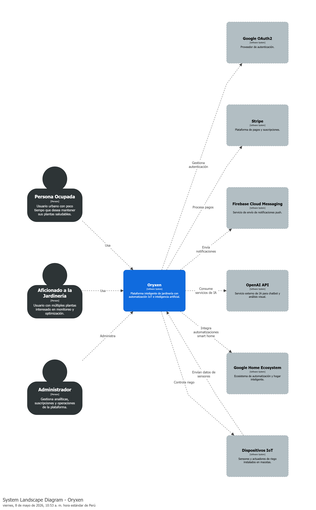

### 4.3.2.	Software Architecture Context Level Diagrams

El Context Level Diagram muestra a Oryxen como un sistema central y explica cómo se relaciona con los usuarios y servicios externos. El objetivo de este diagrama es representar claramente el alcance funcional del sistema y visualizar las dependencias externas necesarias para su operación.

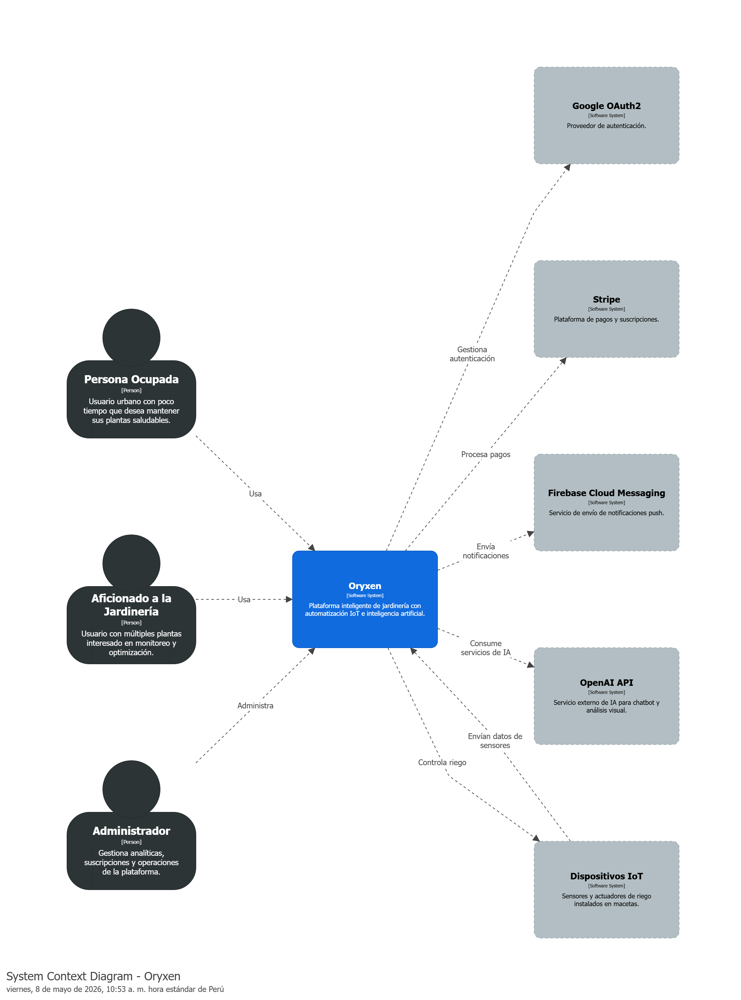

### 4.3.3.	Software Architecture Container Level Diagrams

El Container Level Diagram presenta la arquitectura interna de Oryxen, mostrando cómo se distribuyen las responsabilidades entre aplicaciones cliente, servicios backend, componentes IoT y la capa de datos. La solución incorpora un API Gateway como punto centralizado de acceso y múltiples servicios especializados alineados a los distintos dominios del negocio, como identidad, gestión de plantas, analíticas, comunidad, notificaciones y suscripciones. Asimismo, se diferencian bases de datos operacionales, analíticas y de telemetría IoT para garantizar escalabilidad y modularidad orientada a la automatización inteligente del cuidado de plantas.

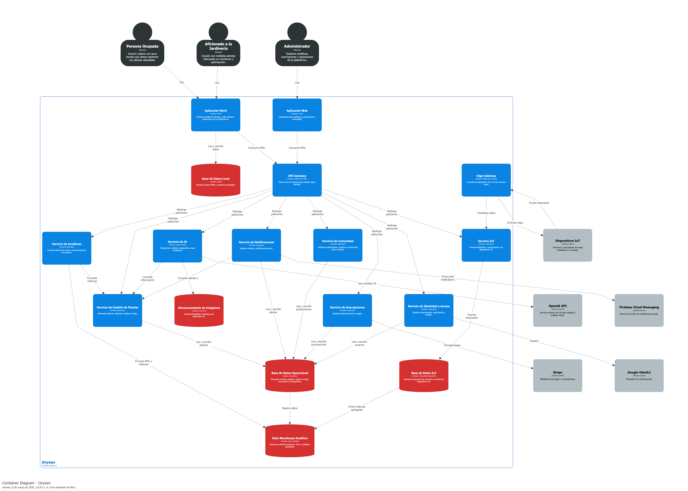

### 4.3.4.	Software Architecture Deployment Diagrams

Describe cómo Oryxen se despliega en producción: servidores en la nube (Web Server, App Server, Database Server), dispositivos móviles de los usuarios y el dispositivo IoT físico. Cada contenedor está ubicado en el nodo correspondiente.

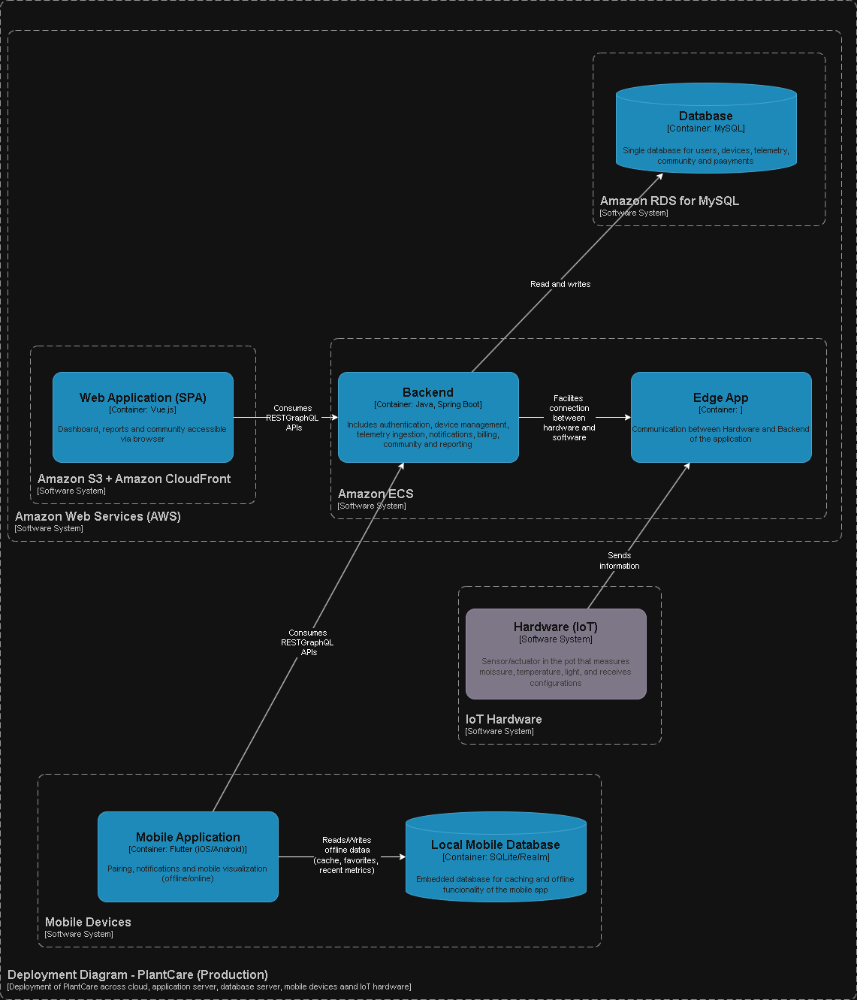

---


# Capítulo V: Tactical-Level Software Design

## 5.1. Bounded Context: Auth & Identity Integration

El bounded context de **Auth & Identity Integration** representa la capa de seguridad transversal de la plataforma Oryxen, responsable de la autenticación de usuarios, la gestión de sesiones y el control de acceso basado en roles (RBAC). Este contexto actúa como guardián del ecosistema: todo intento de acceso a recursos protegidos es validado por este contexto antes de ser procesado por cualquier otro bounded context. Integra el estándar OAuth 2.0 / OpenID Connect (OIDC) para autenticación federada con proveedores externos (Google/Firebase), y emite tokens JWT firmados con RS256 para autorizar peticiones internas. Define tres roles fundamentales del sistema: **FARMER** (Agricultor/Cliente), **ADMIN** (Administrador) y **SUPPORT_TECHNICIAN** (Técnico de Soporte).

### 5.1.1. Domain Layer

La capa de dominio del bounded context **Auth & Identity Integration** modela las identidades de usuario, los mecanismos de autenticación, el ciclo de vida de los tokens y las políticas de control de acceso.

**a. Entity / Aggregate Root:**

**Nombre de la clase:** `UserAccount`

**Paquete:** `com.upc.auth.domain.model.aggregates`

**Propósito:** Representa la cuenta de identidad de un usuario registrado en la plataforma. Constituye el Aggregate Root del bounded context Auth & Identity Integration. Encapsula las credenciales, el estado de la cuenta, el proveedor de autenticación utilizado y los roles asignados.

**Atributos:**

- `id: UUID` → Identificador único de la cuenta de usuario.
- `email: Email` → Dirección de correo electrónico (Value Object, inmutable tras verificación).
- `passwordHash: PasswordHash` → Hash BCrypt de la contraseña (nulo si el proveedor es OAuth2 externo).
- `authProvider: AuthProvider` → Proveedor de autenticación utilizado (`LOCAL`, `GOOGLE`, `FIREBASE`).
- `authProviderId: String` → ID externo del proveedor OAuth2 (nulo si `authProvider = LOCAL`).
- `status: AccountStatus` → Estado de la cuenta (`PENDING_VERIFICATION`, `ACTIVE`, `SUSPENDED`, `DELETED`).
- `roles: List<UserRole>` → Lista de roles asignados al usuario.
- `createdAt: DateTime` → Fecha y hora de creación de la cuenta.
- `updatedAt: DateTime` → Fecha y hora de la última modificación.

**Métodos:**

- `activate()` → Activa la cuenta tras la verificación de correo electrónico.
- `suspend(reason: String)` → Suspende la cuenta indicando el motivo.
- `delete()` → Marca la cuenta como eliminada (soft-delete, no se borra físicamente).
- `assignRole(role: UserRole)` → Asigna un nuevo rol al usuario, validando que no esté duplicado.
- `revokeRole(role: UserRole)` → Revoca un rol del usuario.
- `isActive()` → Verifica si la cuenta se encuentra en estado `ACTIVE`.
- `hasRole(roleName: String)` → Verifica si el usuario posee un rol determinado.
- `updatePassword(newPasswordHash: PasswordHash)` → Actualiza el hash de contraseña y revoca sesiones activas.

**Relaciones:**

- Un `UserAccount` puede poseer múltiples roles (`UserRole`).
- Un `UserAccount` puede tener múltiples `RefreshToken` activos (soporte multi-dispositivo).
- Un `UserAccount` puede mantener múltiples `Session` concurrentes.


**b. Entities del dominio:**

`Role`

**Propósito:** Representa un rol de autorización dentro del sistema. Define el conjunto de permisos que se aplican a los usuarios asignados. Oryxen define tres roles fundamentales:

- **`FARMER`** (Agricultor/Cliente): acceso a funciones de monitoreo, diagnóstico IA, gestión de plantas y comunidad.
- **`ADMIN`** (Administrador): acceso total a la plataforma, gestión de usuarios, planes y configuración del sistema.
- **`SUPPORT_TECHNICIAN`** (Técnico de Soporte): acceso a tickets de soporte, estado de dispositivos IoT y logs del sistema para diagnóstico técnico.

**Atributos:**

- `id: UUID`
- `name: String`
- `description: String`
- `permissions: List<String>`

**Métodos:**

- `addPermission(permission: String)` → Añade un permiso al rol.
- `removePermission(permission: String)` → Elimina un permiso del rol.


`RefreshToken`

**Propósito:** Representa un token de actualización de larga duración asociado a una sesión de usuario. Permite emitir nuevos JWT de acceso (duración: 15 minutos) sin requerir credenciales completas, implementando un esquema de *sliding window* de 30 días.

**Atributos:**

- `id: UUID`
- `userId: UUID`
- `tokenHash: String` → Hash SHA-256 del token (nunca se almacena en texto plano).
- `deviceInfo: String` → Información del dispositivo emisor (user-agent, OS).
- `expiresAt: DateTime`
- `isRevoked: boolean`
- `createdAt: DateTime`

**Métodos:**

- `revoke()` → Invalida el token de forma permanente.
- `isExpired()` → Verifica si el token ha superado su fecha de expiración.
- `isValid()` → Retorna `true` si el token no está revocado ni expirado.


`Session`

**Propósito:** Representa una sesión activa de usuario asociada a un JWT emitido, almacenada en caché Redis para revocación inmediata.

**Atributos:**

- `id: UUID`
- `userId: UUID`
- `jwtTokenHash: String`
- `issuedAt: DateTime`
- `expiresAt: DateTime`
- `isActive: boolean`
- `ipAddress: String`

**Métodos:**

- `invalidate()` → Cierra la sesión activa.
- `isExpired()` → Verifica si la sesión ha expirado.


**c. Value Objects:**

`Email`

Representa una dirección de correo electrónico validada mediante expresión regular RFC-5322.

**Atributos:**

- `value: String`

**Métodos:**

- `validate()` → Lanza `InvalidEmailException` si el formato es inválido.
- `equals(other: Email)` → Comparación estricta por valor (case-insensitive).


`PasswordHash`

Representa el hash BCrypt de una contraseña con factor de coste 12. Nunca expone el valor original.

**Atributos:**

- `value: String` → Hash BCrypt completo incluyendo sal y factor de coste.

**Métodos:**

- `matches(rawPassword: String)` → Verifica si la contraseña en texto plano corresponde al hash almacenado.


`AuthProvider`

Enumera los proveedores de identidad soportados por la plataforma.

**Valores posibles:**

- `LOCAL`
- `GOOGLE`
- `FIREBASE`


`AccountStatus`

Representa el estado del ciclo de vida de una cuenta de usuario.

**Valores posibles:**

- `PENDING_VERIFICATION`
- `ACTIVE`
- `SUSPENDED`
- `DELETED`


`UserRole`

Enumera los roles de autorización del sistema Oryxen.

**Valores posibles:**

- `FARMER`
- `ADMIN`
- `SUPPORT_TECHNICIAN`


`JwtToken`

Representa un JSON Web Token firmado emitido por el sistema.

**Atributos:**

- `value: String` → Token JWT compacto (header.payload.signature en Base64URL).
- `expiresAt: DateTime`

**Métodos:**

- `isExpired()` → Verifica si el token ha superado su fecha de expiración.
- `getClaims()` → Extrae y retorna los claims del payload (`sub`, `roles`, `iat`, `exp`, `iss`).


**d. Commands del dominio:**

`RegisterUserCommand`

**Paquete:** `com.upc.auth.domain.model.commands`

**Propósito:** Registrar un nuevo usuario con credenciales locales (email + contraseña).

**Atributos:**

- `email: String`
- `rawPassword: String`
- `firstName: String`
- `lastName: String`


`LoginCommand`

**Propósito:** Autenticar un usuario con credenciales locales y emitir un par de tokens (JWT de acceso + refresh token).

**Atributos:**

- `email: String`
- `rawPassword: String`
- `deviceInfo: String`


`OAuthLoginCommand`

**Propósito:** Autenticar o registrar un usuario mediante proveedor OAuth2 externo (Google/Firebase OIDC).

**Atributos:**

- `idToken: String` → Token de identidad emitido por el proveedor externo.
- `provider: AuthProvider`
- `deviceInfo: String`


`LogoutCommand`

**Propósito:** Cerrar sesión de un usuario revocando el refresh token activo y la sesión en caché.

**Atributos:**

- `userId: UUID`
- `refreshTokenValue: String`


`RefreshTokenCommand`

**Propósito:** Renovar el JWT de acceso usando un refresh token válido, sin rotar el refresh token (política *sliding window*).

**Atributos:**

- `refreshTokenValue: String`


`ChangePasswordCommand`

**Propósito:** Actualizar la contraseña de un usuario autenticado, revocando todas las sesiones activas por seguridad.

**Atributos:**

- `userId: UUID`
- `currentRawPassword: String`
- `newRawPassword: String`


`AssignRoleCommand`

**Propósito:** Asignar un rol a un usuario (operación restringida al rol ADMIN).

**Atributos:**

- `targetUserId: UUID`
- `role: UserRole`
- `requestedByUserId: UUID`


`RevokeAllTokensCommand`

**Propósito:** Revocar todos los refresh tokens de un usuario (cierre de sesión global en todos los dispositivos).

**Atributos:**

- `userId: UUID`


**e. Queries del dominio:**

`GetUserByIdQuery`

**Propósito:** Obtener la información de un usuario por su identificador único.

**Atributos:**

- `userId: UUID`


`GetUserByEmailQuery`

**Propósito:** Obtener la información de un usuario por su dirección de correo electrónico.

**Atributos:**

- `email: String`


`ValidateTokenQuery`

**Propósito:** Validar la firma y vigencia de un JWT de acceso, retornando los claims extraídos.

**Atributos:**

- `jwtToken: String`


`GetUserRolesQuery`

**Propósito:** Obtener los roles asignados a un usuario específico.

**Atributos:**

- `userId: UUID`


`ListUsersQuery`

**Propósito:** Obtener la lista paginada de usuarios registrados (requiere rol ADMIN).

**Atributos:**

- `page: int`
- `size: int`
- `statusFilter: AccountStatus`


**f. Domain Services:**

`AuthenticationDomainService`

**Paquete:** `com.upc.auth.domain.services`

**Propósito:** Coordinar el flujo de autenticación validando credenciales, delegando al proveedor de identidad correspondiente y orquestando la emisión del par de tokens.

**Operaciones:**

- `handle(LoginCommand)` → Retorna `AuthTokenPair` (accessToken + refreshToken).
- `handle(OAuthLoginCommand)` → Valida el idToken externo, crea o recupera el `UserAccount`, retorna `AuthTokenPair`.
- `handle(LogoutCommand)` → Revoca el refresh token y la sesión activa en Redis.
- `handle(RefreshTokenCommand)` → Valida el refresh token y emite un nuevo JWT de acceso.


`AuthorizationDomainService`

**Propósito:** Evaluar si un usuario posee los permisos necesarios para ejecutar una operación específica, aplicando las reglas RBAC definidas para los tres roles del sistema.

**Operaciones:**

- `handle(AssignRoleCommand)` → Verifica que el solicitante es ADMIN, asigna el rol al usuario destino.
- `handle(GetUserRolesQuery)` → Retorna la lista de roles de un usuario.
- `canAccess(userId: UUID, requiredRole: UserRole)` → Evaluación booleana de permisos en tiempo real.


`TokenDomainService`

**Propósito:** Gestionar el ciclo de vida completo de tokens JWT y refresh tokens, incluyendo generación, validación y revocación.

**Operaciones:**

- `generateAccessToken(userAccount: UserAccount)` → Firma un JWT RS256 con claims de userId, roles y expiración de 15 minutos.
- `generateRefreshToken(userId: UUID, deviceInfo: String)` → Genera un refresh token opaco de 30 días, almacena su hash SHA-256.
- `handle(ValidateTokenQuery)` → Verifica firma RS256 y vigencia del JWT.
- `handle(RevokeAllTokensCommand)` → Invalida todos los refresh tokens activos de un usuario.

---

### 5.1.2. Interface Layer

La Interface Layer del bounded context **Auth & Identity Integration** expone los endpoints REST responsables de gestionar la autenticación y autorización de usuarios en la plataforma Oryxen.

**`AuthController`**

**Paquete:** `com.upc.auth.interfaces.rest`

**Base URL:** `/api/v1/auth`

**Endpoints:**

| Método | Ruta | Descripción | Autenticación requerida |
|--------|------|-------------|------------------------|
| `POST` | `/register` | Registrar nuevo usuario con credenciales locales | No |
| `POST` | `/login` | Autenticación local; retorna JWT de acceso + refresh token | No |
| `POST` | `/oauth/google` | Autenticación via Google OIDC; retorna JWT + refresh token | No |
| `POST` | `/logout` | Revocar refresh token activo y cerrar sesión | Sí (Bearer JWT) |
| `POST` | `/refresh-token` | Renovar JWT de acceso usando refresh token válido | No (refresh token en body) |
| `POST` | `/change-password` | Cambiar contraseña del usuario autenticado | Sí (Bearer JWT) |
| `POST` | `/revoke-all-tokens` | Cerrar sesión en todos los dispositivos activos | Sí (Bearer JWT) |


**`UserController`**

**Paquete:** `com.upc.auth.interfaces.rest`

**Base URL:** `/api/v1/users`

**Endpoints:**

| Método | Ruta | Descripción | Rol requerido |
|--------|------|-------------|--------------|
| `GET` | `/{userId}` | Obtener perfil de usuario por ID | FARMER, ADMIN |
| `GET` | `/` | Listar usuarios paginados | ADMIN |
| `POST` | `/{userId}/roles` | Asignar rol a usuario | ADMIN |
| `DELETE` | `/{userId}/roles/{role}` | Revocar rol de usuario | ADMIN |
| `PUT` | `/{userId}/suspend` | Suspender cuenta de usuario | ADMIN |
| `PUT` | `/{userId}/activate` | Reactivar cuenta de usuario | ADMIN |

---

### 5.1.3. Application Layer

La Application Layer del bounded context **Auth & Identity Integration** coordina los flujos de autenticación y autorización, actuando como intermediario entre la Interface Layer y el Domain Layer.

**Command Handlers:**

`RegisterUserCommandHandler`

**Propósito:** Validar unicidad del email, hashear la contraseña con BCrypt(12), crear y persistir el `UserAccount`, asignar rol `FARMER` por defecto y publicar el evento `UserRegisteredEvent` para que el BC Notification envíe el email de bienvenida.

`LoginCommandHandler`

**Propósito:** Recuperar el `UserAccount` por email, verificar el hash de contraseña con BCrypt, validar que la cuenta esté `ACTIVE`, delegar en `TokenDomainService` para generar el par de tokens y persistir el `RefreshToken` y la `Session`.

`OAuthLoginCommandHandler`

**Propósito:** Verificar el `idToken` contra el proveedor externo via Firebase Admin SDK / Google OAuth2, recuperar o crear el `UserAccount` con `authProvider = GOOGLE`, generar el par de tokens y persistir la sesión.

`LogoutCommandHandler`

**Propósito:** Localizar el `RefreshToken` por hash SHA-256, marcarlo como revocado, invalidar la `Session` activa en Redis.

`RefreshTokenCommandHandler`

**Propósito:** Localizar el `RefreshToken` por hash, verificar validez mediante `isValid()`, emitir nuevo JWT de acceso con expiración renovada (sin rotar el refresh token).

`ChangePasswordCommandHandler`

**Propósito:** Verificar la contraseña actual, aplicar nueva contraseña hasheada, revocar todos los refresh tokens activos del usuario por seguridad y publicar el evento `PasswordChangedEvent`.

`AssignRoleCommandHandler`

**Propósito:** Verificar que el solicitante posee rol ADMIN, localizar el usuario destino, asignar el rol y publicar el evento `RoleAssignedEvent`.


**Application Services:**

`AuthApplicationService`

**Paquete:** `com.upc.auth.application.internal.commandservices`

**Operaciones:**

- `handle(RegisterUserCommand)`
- `handle(LoginCommand)`
- `handle(OAuthLoginCommand)`
- `handle(LogoutCommand)`
- `handle(RefreshTokenCommand)`
- `handle(ChangePasswordCommand)`
- `handle(ValidateTokenQuery)`


`UserApplicationService`

**Operaciones:**

- `handle(AssignRoleCommand)`
- `handle(RevokeAllTokensCommand)`
- `handle(GetUserByIdQuery)`
- `handle(GetUserByEmailQuery)`
- `handle(GetUserRolesQuery)`
- `handle(ListUsersQuery)`

---

### 5.1.4. Infrastructure Layer

La Infrastructure Layer del bounded context **Auth & Identity Integration** implementa los mecanismos de persistencia, generación de tokens, integración con proveedores externos y caché de sesiones activas.

**Adaptadores y Repositorios:**

`JwtTokenAdapter`

**Propósito:** Implementar la generación y validación de tokens JWT firmados con el algoritmo RS256 (clave privada/pública RSA-2048). Emite tokens de acceso con expiración de 15 minutos. Los claims incluyen: `sub` (userId), `roles`, `iat`, `exp`, `iss` (oryxen.io).

**Dependencia:** `io.jsonwebtoken:jjwt-api:0.11.5`


`OAuth2ProviderAdapter`

**Propósito:** Verificar los `idToken` emitidos por Google/Firebase mediante el Firebase Admin SDK y extraer los claims de identidad del usuario (email, nombre, foto de perfil).

**Dependencia:** `com.google.firebase:firebase-admin:9.2.0`


`PasswordEncoderAdapter`

**Propósito:** Encapsular el algoritmo BCrypt con factor de coste 12 para el hasheo y la verificación de contraseñas locales.

**Dependencia:** `org.springframework.security:spring-security-crypto`


`UserJpaRepository`

**Propósito:** Repositorio JPA para la persistencia de entidades `UserAccount` en la tabla `user_accounts` de PostgreSQL.

**Dependencia:** Spring Data JPA + PostgreSQL 15


`RoleJpaRepository`

**Propósito:** Repositorio JPA para la gestión de roles en la tabla `roles`.


`RefreshTokenJpaRepository`

**Propósito:** Repositorio JPA para la persistencia y consulta de refresh tokens en la tabla `refresh_tokens`.


`SessionCacheAdapter`

**Propósito:** Almacenar las sesiones activas y la lista negra de JWT revocados en Redis para validación sub-milisegundo y revocación inmediata de sesiones comprometidas.

**Dependencia:** `spring-boot-starter-data-redis` + Redis 7


**Dependencias de infraestructura del contexto Auth & Identity:**

- PostgreSQL 15 → persistencia de usuarios, roles, user_roles y refresh tokens.
- Redis 7 → caché de sesiones activas y lista negra de JWT revocados.
- Firebase Admin SDK → validación de tokens OAuth2/OIDC externos (Google).
- Spring Security 6 → filtros de autenticación y autorización HTTP.
- jjwt (0.11.5) → generación y validación de JWT RS256.

---

### 5.1.5. Bounded Context Software Architecture Component Level Diagrams

El Component Diagram del bounded context `Auth & Identity Integration` representa la arquitectura interna del módulo de seguridad, mostrando la interacción entre los controladores REST, los servicios de aplicación, el dominio y los adaptadores de infraestructura.

**Descripción de componentes principales:**

- **Auth REST API Component:** Expone los endpoints de autenticación (`/api/v1/auth`). Delega en el `AuthApplicationService`.
- **User REST API Component:** Expone los endpoints de gestión de usuarios (`/api/v1/users`). Delega en el `UserApplicationService`.
- **Auth Command Processing Component:** Orquesta los command handlers de registro, login, logout y refresh.
- **Auth Query Processing Component:** Ejecuta las queries de validación de token y perfil de usuario.
- **Auth Domain Component:** Contiene los agregados, servicios de dominio y value objects.
- **JWT Token Component:** Gestiona la firma RS256 y validación de tokens JWT.
- **OAuth2 Integration Component:** Valida tokens de identidad externos contra Firebase/Google.
- **Auth Persistence Component:** Implementa los repositorios JPA para usuarios, roles y refresh tokens.
- **Session Cache Component:** Gestiona el ciclo de vida de sesiones activas en Redis.

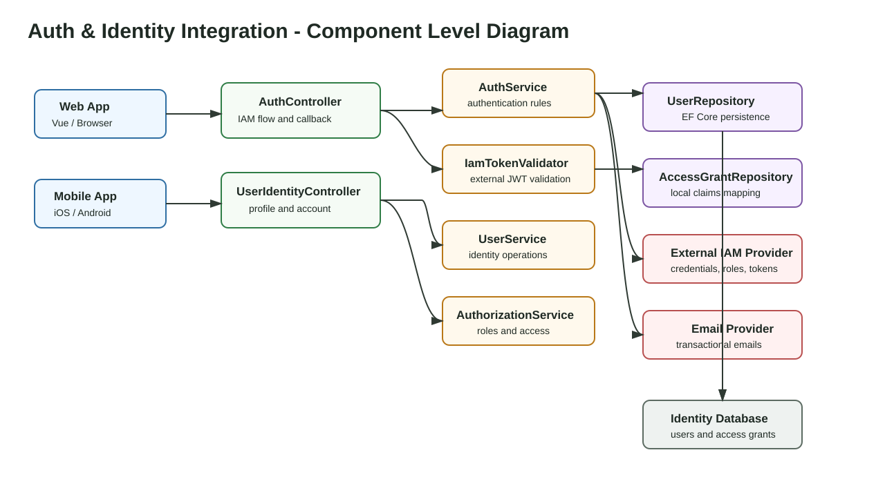

---

### 5.1.6. Bounded Context Software Architecture Code Level Diagrams

En esta sección se presentan los diagramas a nivel de código del bounded context `Auth & Identity Integration`, visualizando la estructura del dominio y el diseño de la base de datos de identidades.

#### 5.1.6.1. Bounded Context Domain Layer Class Diagrams

El diagrama UML del Domain Layer muestra el agregado principal `UserAccount`, las entidades `Role`, `RefreshToken` y `Session`, junto a los Value Objects `Email`, `PasswordHash`, `AuthProvider`, `AccountStatus`, `UserRole` y `JwtToken`. Las relaciones clave son: `UserAccount` agrega `UserRole` (lista), `UserAccount` tiene múltiples `RefreshToken` (ciclo de vida separado) y múltiples `Session` activas.

**Relaciones entre clases:**

- `UserAccount (1) ──── (*) UserRole`
- `UserAccount (1) ──── (*) RefreshToken`
- `UserAccount (1) ──── (*) Session`
- `AuthenticationDomainService → UserAccount`
- `AuthenticationDomainService → TokenDomainService`
- `TokenDomainService → JwtToken`
- `TokenDomainService → RefreshToken`

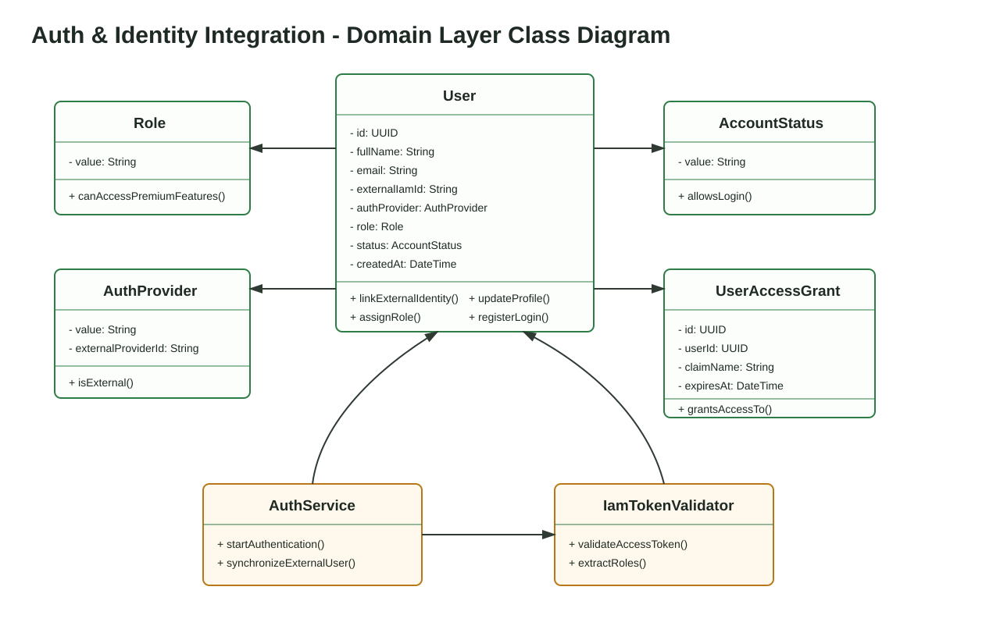

#### 5.1.6.2. Bounded Context Database Design Diagram

El diagrama de base de datos del bounded context `Auth & Identity Integration` representa la estructura relacional para almacenar identidades de usuario, roles, tokens y sesiones activas.

**Tabla principal:** `user_accounts`

**Atributos:**

- `user_id` → UUID, PRIMARY KEY
- `email` → VARCHAR(255), UNIQUE, NOT NULL
- `password_hash` → VARCHAR(72), NULLABLE (nulo para cuentas OAuth2 externas)
- `auth_provider` → ENUM('LOCAL','GOOGLE','FIREBASE'), NOT NULL
- `auth_provider_id` → VARCHAR(255), NULLABLE
- `status` → ENUM('PENDING_VERIFICATION','ACTIVE','SUSPENDED','DELETED'), NOT NULL
- `created_at` → TIMESTAMP, NOT NULL
- `updated_at` → TIMESTAMP, NOT NULL


**Tabla:** `roles`

**Atributos:**

- `role_id` → UUID, PRIMARY KEY
- `name` → VARCHAR(50), UNIQUE, NOT NULL
- `description` → VARCHAR(255)


**Tabla de relación:** `user_roles`

**Atributos:**

- `user_id` → UUID, FOREIGN KEY → `user_accounts(user_id)`
- `role_id` → UUID, FOREIGN KEY → `roles(role_id)`
- `assigned_at` → TIMESTAMP, NOT NULL
- PRIMARY KEY (`user_id`, `role_id`)


**Tabla:** `refresh_tokens`

**Atributos:**

- `token_id` → UUID, PRIMARY KEY
- `user_id` → UUID, FOREIGN KEY → `user_accounts(user_id)`
- `token_hash` → VARCHAR(64), NOT NULL (SHA-256 del token original)
- `device_info` → VARCHAR(255)
- `expires_at` → TIMESTAMP, NOT NULL
- `is_revoked` → BOOLEAN, DEFAULT FALSE
- `created_at` → TIMESTAMP, NOT NULL

**Constraints:**

- INDEX en `token_hash` para búsquedas de validación eficientes O(log n).
- INDEX en `user_id` para la revocación global de todos los tokens de un usuario.


**Relaciones entre tablas:**

- `user_accounts (1) ──── (*) user_roles`
- `user_accounts (1) ──── (*) refresh_tokens`
- `user_roles (*) ──── (1) roles`

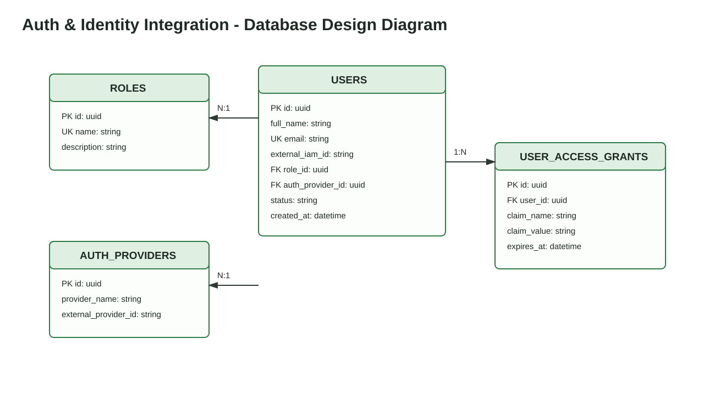

---

## 5.2. Bounded Context: Plant Management

El bounded context de **Plant Management** representa el núcleo encargado de la gestión del catálogo de plantas de los usuarios dentro de la plataforma Oryxen. Este contexto permite registrar nuevas plantas, editar perfiles, definir configuraciones y parámetros esenciales (como umbrales de humedad), y ofrecer una visualización unificada del estado de salud de toda la colección botánica del usuario.

### 5.2.1. Domain Layer

La capa de dominio del bounded context **Plant Management** contiene las clases que modelan el comportamiento principal relacionado con la creación y administración de los perfiles de plantas, garantizando las reglas de negocio del inventario botánico.

**a. Entity / Aggregate Root:**

**Nombre de la clase:** `PlantProfile`
**Paquete:** `com.upc.oryxen.plantmanagement.domain.model.aggregates`

**Propósito:** Representa el perfil de una planta registrada por un usuario, agrupando su información taxonómica, ubicación y estado. Constituye el Aggregate Root del bounded context.

**Atributos:**
*   `plantId: Long` → Identificador único de la planta.
*   `userId: Long` → Identificador del usuario propietario.
*   `name: String` → Nombre asignado a la planta.
*   `species: String` → Especie botánica de la planta.
*   `location: String` → Ubicación física (ej. sala, balcón).
*   `status: PlantStatus` → Estado del perfil (Activo, Archivado).
*   `createdAt: DateTime` → Fecha de registro.
*   `updatedAt: DateTime` → Última modificación.

**Métodos:**
*   `updateProfile(name, species, location)` → Actualiza la información básica de la planta.
*   `archive()` → Marca la planta como eliminada lógicamente.

**Relaciones:**
*   Un `PlantProfile` pertenece a un solo `UserAccount`.
*   Un `PlantProfile` tiene una única `PlantConfiguration`.

**b. Entities del dominio:**

**Nombre de la clase:** `PlantConfiguration`
**Propósito:** Representa los parámetros y umbrales de cuidado específicos para el perfil de una planta.

**c. Value Objects:**

**Nombre de la clase:** `PlantStatus`
**Propósito:** Representa el estado en el que se encuentra el registro de la planta en el sistema.
**Valores posibles:**
*   `ACTIVE`
*   `ARCHIVED`

**d. Referencias externas del dominio:**

Dentro del contexto Plant Management se utilizan entidades provenientes de otros bounded contexts.

*   **UserAccount** (Origen: Auth & Identity): Representa al propietario de las plantas.
*   **Device** (Origen: Device Management IoT): Representa el sensor físico vinculado para su monitoreo.

**e. Commands del dominio:**

**Paquete:** `com.upc.oryxen.plantmanagement.domain.model.commands`
*   `CreatePlantProfileCommand`: Representa la intención de registrar una nueva planta.
*   `UpdatePlantProfileCommand`: Representa la intención de editar información básica.
*   `DeletePlantProfileCommand`: Representa la intención de archivar una planta.
*   `ConfigurePlantParametersCommand`: Representa la intención de definir umbrales de humedad.

**f. Queries del dominio:**

*   `GetPlantProfileByIdQuery`: Obtener una planta específica.
*   `GetAllPlantsByUserIdQuery`: Obtener el catálogo completo de plantas de un usuario.

**g. Domain Services:**

*   `PlantCommandService`: Define las operaciones de escritura relacionadas a la gestión de plantas.
*   `PlantQueryService`: Define las operaciones de lectura del catálogo de plantas.

**h. Repository:**

*   `IPlantProfileRepository`: Interfaz para gestionar la persistencia y ciclo de vida de los perfiles.

### 5.2.2. Interface Layer

La Interface Layer contiene los controladores REST responsables de exponer las funcionalidades de gestión de plantas consumidas por las aplicaciones móviles y web.

**a. PlantController**

**Paquete:** `com.upc.oryxen.plantmanagement.interfaces.rest`
**Propósito:** Exponer endpoints relacionados con el catálogo de plantas.

**Dependencias:**
*   `PlantCommandService`
*   `PlantQueryService`

**Endpoints expuestos:**
*   `POST /api/v1/plants` → Registrar nueva planta.
*   `PUT /api/v1/plants/{plantId}` → Actualizar información de la planta.
*   `DELETE /api/v1/plants/{plantId}` → Eliminar (archivar) planta.
*   `PUT /api/v1/plants/{plantId}/configuration` → Configurar parámetros básicos.
*   `GET /api/v1/users/{userId}/plants` → Obtener dashboard unificado de plantas.

**b. Resources / DTOs:**

*   `PlantProfileResource`: Representa la información de la planta enviada al frontend.
*   `CreatePlantProfileResource`: Representa los datos requeridos para registrar una planta.
*   `PlantConfigurationResource`: Representa la estructura de los umbrales paramétricos.

**c. Assemblers:**

*   `PlantProfileResourceFromEntityAssembler`: Transforma la entidad `PlantProfile` en un recurso REST.
*   `CreatePlantProfileCommandFromResourceAssembler`: Transforma el request REST en comando de dominio.

### 5.2.3. Application Layer

Coordina los casos de uso para administrar la colección de plantas del usuario.

**Capacidades principales del contexto:**
*   Registrar perfiles de plantas.
*   Editar y archivar plantas existentes.
*   Configurar umbrales vitales (ej. humedad).
*   Listar las plantas en una vista consolidada.

**a. Command Handlers / Command Services:**

`PlantCommandServiceImpl` maneja:
*   `handle(CreatePlantProfileCommand)`: Valida campos, crea la entidad `PlantProfile` y persiste.
*   `handle(UpdatePlantProfileCommand)`: Busca la planta, aplica cambios, modifica `updatedAt` y guarda.
*   `handle(DeletePlantProfileCommand)`: Ejecuta un borrado lógico cambiando el `PlantStatus` a `ARCHIVED`.

**b. Query Handlers / Query Services:**

`PlantQueryServiceImpl` maneja:
*   `handle(GetAllPlantsByUserIdQuery)`: Retorna la lista organizada de plantas para el usuario autenticado.

**c. Flujos principales del negocio:**

**Flujo de creación de perfil de planta:**
*   El frontend envía los datos básicos de la nueva planta.
*   Se construye `CreatePlantProfileCommand`.
*   `PlantCommandServiceImpl` valida que el usuario no exceda su límite de plantas (según plan).
*   Se crea la entidad `PlantProfile`.
*   Se persiste mediante `IPlantProfileRepository`.
*   Se retorna el recurso creado al cliente.

### 5.2.4. Infrastructure Layer

Contiene los componentes responsables de la persistencia de datos del catálogo botánico y la integración con otras áreas de la arquitectura.

**a. Repositorios de persistencia:**
*   `PlantProfileRepositoryImpl`: Implementa la persistencia de los perfiles.
*   `PlantConfigurationRepositoryImpl`: Implementa la persistencia de las configuraciones paramétricas.

**b. ORM Context:**
*   `PlantDbContext`: Punto central de acceso a base de datos (mediante Entity Framework Core) para plantas y configuraciones.

**c. Persistencia de entidades:**
Las entidades del contexto se encuentran mapeadas utilizando tecnologías ORM.
**Entidades persistidas:**
*   `PlantProfile`
*   `PlantConfiguration`

**d. Diseño de persistencia:**

**Tabla principal:** `plant_profiles`
**Columnas:**
*   `plant_id` (PK)
*   `user_id` (FK)
*   `name`
*   `species`
*   `location`
*   `status`
*   `created_at`
*   `updated_at`

**Tabla relacionada:** `plant_configurations`
**Columnas:**
*   `config_id` (PK)
*   `plant_id` (FK hacia `plant_profiles`)
*   `min_humidity`
*   `max_humidity`

**e. Integración con otros bounded contexts:**
*   **Identity and Access Management:** Para validación de usuarios propietarios mediante tokens.
*   **Device Management IoT:** Para asociar el perfil de planta creado con su hardware respectivo.
*   **Analysis & Reporting:** Exportación de inventario para reportes de largo plazo.

### 5.2.5. Bounded Context Software Architecture Component Level Diagrams

El Component Diagram del bounded context Plant Management representa la descomposición del contenedor backend encargado del registro y administración del catálogo botánico.

**Componentes principales:**

*   **Plant REST API Component**: Expone endpoints REST relacionados a plantas mediante `PlantController`.
*   **Plant Transformation Component**: Encargado de transformar datos entre DTOs (`PlantProfileResource`), comandos y entidades mediante *Assemblers*.
*   **Plant Command Processing Component**: Implementado por `PlantCommandServiceImpl`. Orquesta la creación y edición.
*   **Plant Query Processing Component**: Implementado por `PlantQueryServiceImpl`. Gestiona las consultas al dashboard.
*   **Plant Domain Component**: Representa el núcleo del dominio, albergando el agregado `PlantProfile`.
*   **Plant Persistence Component**: Gestiona la persistencia en base de datos mediante repositorios ORM.

**Relaciones entre componentes:**
*   `Plant REST API Component` → `Plant Transformation Component`
*   `Plant REST API Component` → `Plant Command Processing Component`
*   `Plant REST API Component` → `Plant Query Processing Component`
*   `Plant Command Processing Component` → `Plant Domain Component`
*   `Plant Command Processing Component` → `Plant Persistence Component`

**Diagrama de Componentes:**
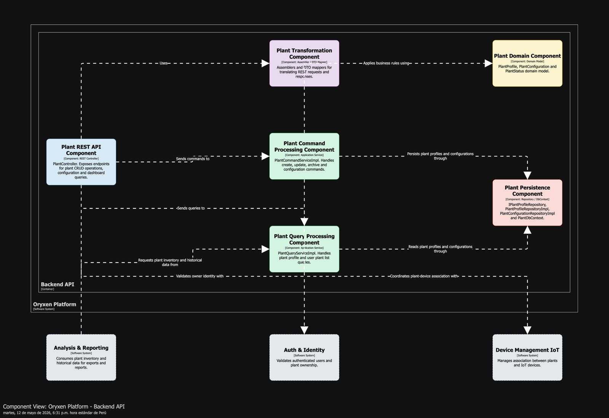

### 5.2.6. Bounded Context Software Architecture Code Level Diagrams

En esta sección se presentan los diagramas a nivel de código del bounded context Plant Management, visualizando el detalle del dominio y la persistencia de las plantas.

**5.2.6.1. Bounded Context Domain Layer Class Diagrams**

El diagrama UML del Domain Layer muestra al agregado principal `PlantProfile`, vinculando sus configuraciones, validaciones de interfaz y servicios de dominio.

**Relaciones:**
*   `PlantProfile` es el Aggregate Root del contexto.
*   `PlantProfile` contiene una única `PlantConfiguration`.
*   `PlantCommandService` utiliza `IPlantProfileRepository`.
*   `PlantStatus` representa el estado de vida del registro.

**Diagrama UML de Clases (Domain Layer):**
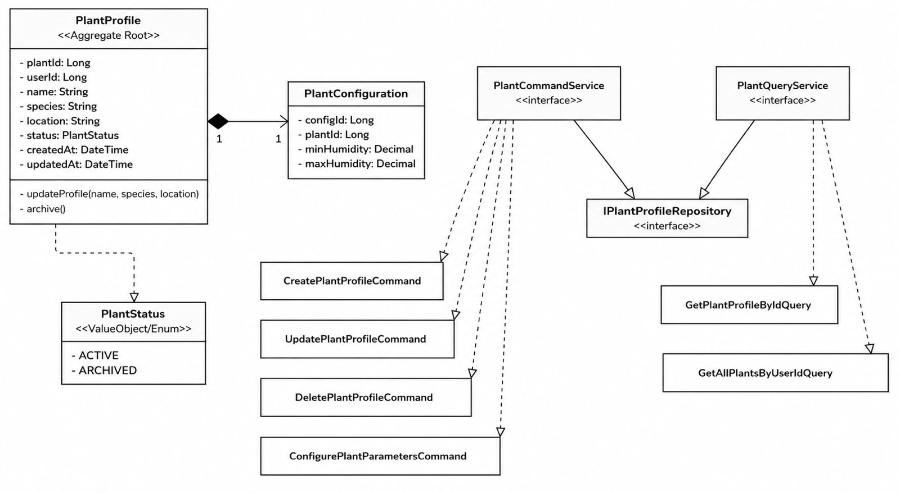

**5.2.6.2. Bounded Context Database Design Diagram**

El diagrama de base de datos representa la estructura relacional (ERD) utilizada para almacenar los perfiles y umbrales de humedad.

**Relaciones entre tablas:**
*   `user_profiles (1)` ──── `(*) plant_profiles`
*   `plant_profiles (1)` ──── `(1) plant_configurations`

**Diagrama de base de datos (ERD):**
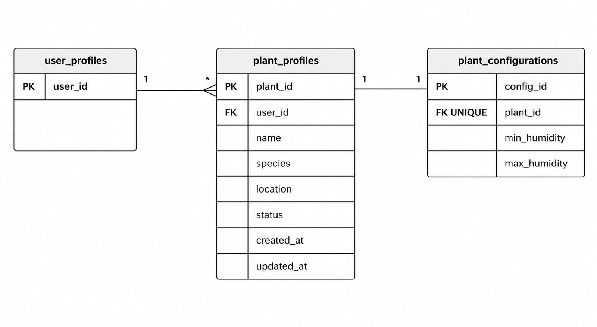

## 5.3. Bounded Context: Device Management IoT

El bounded context de **Device Management IoT** representa el núcleo encargado de la administración de dispositivos IoT, sensores y telemetría dentro de la plataforma. Este contexto permite registrar dispositivos, emparejarlos con cuentas de usuario, gestionar sensores asociados, recolectar lecturas en tiempo real y ejecutar procesos de monitoreo y diagnóstico.

Asimismo, este bounded context garantiza la operación segura, confiable y consistente de los dispositivos IoT mediante servicios de sincronización, control de conectividad, sesiones de diagnóstico y persistencia de datos de sensores.

### 5.3.1. Domain Layer

La capa de dominio del bounded context **Device Management IoT** contiene las clases que modelan el comportamiento principal de dispositivos IoT, sensores, lecturas y sesiones de diagnóstico.

Aquí residen las reglas de negocio relacionadas con el ciclo de vida de los dispositivos, la administración de sensores y la validación de lecturas recolectadas en tiempo real.

**a. Entity / Aggregate Root:**

**Nombre de la clase:** `Device`

**Paquete:** `com.upc.iot.device.domain.model.aggregates`

**Propósito:** Representa un dispositivo IoT registrado, emparejado con una cuenta y encargado de administrar sensores asociados.

**Atributos:**

- `deviceId: DeviceId` → Identificador único del dispositivo.
- `ownerId: Guid` → Identificador del usuario propietario.
- `name: String` → Nombre asignado al dispositivo.
- `status: DeviceStatus` → Estado del dispositivo.
- `pairedAt: DateTime` → Fecha de emparejamiento.
- `lastSyncAt: DateTime` → Última sincronización de datos.

**Métodos:**

- `pairWithAccount()` → Empareja el dispositivo con una cuenta.
- `unpair()` → Desempareja el dispositivo.
- `activate()` → Activa el dispositivo.
- `deactivate()` → Desactiva el dispositivo.
- `updateFirmware()` → Aplica una actualización de firmware.
- `restoreConnection()` → Restaura la conexión perdida.
- `openDiagnosticSession()` → Inicia una sesión de monitoreo o diagnóstico.

**Relaciones:**

- Un `Device` puede contener múltiples sensores.
- Un `Device` puede generar múltiples lecturas de sensores.
- Un `Device` puede tener múltiples sesiones de diagnóstico.


**b. Referencias externas del dominio:**

Dentro del contexto Device Management IoT se utilizan referencias provenientes de otros bounded contexts.

**User Account**

- Origen: `Identity and Access Management`
- Propósito: Representa al propietario del dispositivo.
- Atributos relevantes:
  - `ownerId`
  - `email`
  - `fullName`

**Cloud Monitoring Service**

- Origen: `Infrastructure Services`
- Propósito: Sincronizar telemetría y lecturas con la nube.
- Atributos relevantes:
  - `connectionStatus`
  - `syncTimestamp`


**c. Value Objects:**

`DeviceId`

Representa el identificador único de un dispositivo IoT.

**Atributos:**

- `value: Guid/Long`


`SensorId`

Representa el identificador único de un sensor dentro de un dispositivo.

**Atributos:**

- `value: Guid/Long`


`DeviceStatus`

Representa el estado operativo del dispositivo.

- `ACTIVE`
- `DISCONNECTED`
- `SUSPENDED`


`SensorStatus`

Representa el estado operativo de un sensor.

- `ACTIVE`
- `CALIBRATED`
- `ERROR`


**d. Entities:**

`Sensor`

**Propósito:** Representa un sensor IoT instalado en un dispositivo.

**Atributos:**

- `sensorId: SensorId`
- `type: SensorType`
- `status: SensorStatus`
- `lastCalibrationAt: DateTime`
- `lastReadingAt: DateTime`


`SensorReading`

**Propósito:** Representa una lectura tomada por un sensor en tiempo real.

**Atributos:**

- `readingId: Guid`
- `sensorId: SensorId`
- `value: Decimal`
- `unit: String`
- `timestamp: DateTime`
- `errorFlag: Boolean`


`DiagnosticSession`

**Propósito:** Representa una sesión de monitoreo o diagnóstico en tiempo real.

**Atributos:**

- `sessionId: Guid`
- `deviceId: DeviceId`
- `startedAt: DateTime`
- `endedAt: DateTime`
- `isActive: Boolean`


**e. Commands del dominio:**

`RegisterDeviceCommand`

**Paquete:** `com.upc.iot.device.domain.model.commands`

**Propósito:** Representa la intención de registrar un nuevo dispositivo.

**Atributos:**

- `deviceId`
- `ownerId`
- `name`


`PairDeviceCommand`

**Propósito:** Emparejar un dispositivo con una cuenta.

**Atributos:**

- `deviceId`
- `ownerId`


`ActivateDeviceCommand`

**Propósito:** Activar un dispositivo IoT.

**Atributos:**

- `deviceId`


`UpdateFirmwareCommand`

**Propósito:** Aplicar una actualización de firmware.

**Atributos:**

- `deviceId`
- `firmwareVersion`


`AddSensorCommand`

**Propósito:** Agregar un sensor a un dispositivo.

**Atributos:**

- `deviceId`
- `sensorType`


`SubmitSensorReadingCommand`

**Propósito:** Registrar una lectura enviada por un sensor.

**Atributos:**

- `sensorId`
- `value`
- `unit`
- `timestamp`


`OpenDiagnosticSessionCommand`

**Propósito:** Abrir una sesión de diagnóstico.

**Atributos:**

- `deviceId`


**f. Queries del dominio:**

`GetDeviceByIdQuery`

**Propósito:** Obtener un dispositivo por identificador.

**Atributos:**

- `deviceId`


`GetSensorsByDeviceQuery`

**Propósito:** Obtener sensores asociados a un dispositivo.

**Atributos:**

- `deviceId`


`GetLatestReadingQuery`

**Propósito:** Obtener la última lectura de un sensor.

**Atributos:**

- `sensorId`


`GetSensorReadingsQuery`

**Propósito:** Consultar el historial de lecturas de un sensor.

**Atributos:**

- `sensorId`


`GetDeviceStatusQuery`

**Propósito:** Obtener el estado y diagnóstico de un dispositivo.

**Atributos:**

- `deviceId`


**g. Domain Services:**

`SensorMonitor`

**Paquete:** `com.upc.iot.device.domain.services`

**Propósito:** Gestionar la recolección y validación de datos de sensores en tiempo real.

**Operaciones:**

- `collectReading()`
- `validateReading()`
- `syncData()`


**h. Repository:**

`IDeviceRepository`

**Paquete:** `com.upc.iot.device.infrastructure.persistence.repositories`

**Propósito:** Gestionar persistencia y ciclo de vida de dispositivos IoT.

**Operaciones:**

- `getByIdAsync()`
- `saveAsync()`
- `deleteAsync()`


`ISensorRepository`

**Propósito:** Gestionar persistencia de sensores asociados.

**Operaciones:**

- `getByIdAsync()`
- `saveAsync()`
- `deleteAsync()`


`ISensorReadingRepository`

**Propósito:** Almacenar y recuperar lecturas de sensores.

**Operaciones:**

- `getBySensorId()`
- `saveAsync()`
- `deleteOldReadings()`


### 5.3.2. Interface Layer

La Interface Layer del bounded context **Device Management IoT** contiene las clases responsables de exponer funcionalidades relacionadas con dispositivos IoT, sensores, lecturas y diagnósticos mediante endpoints REST consumidos por aplicaciones web y móviles.

**a. DeviceController**

**Paquete:** `com.upc.iot.device.interfaces.rest`

**Propósito:** Exponer endpoints relacionados con la gestión de dispositivos IoT.

**Dependencias:**

- `DeviceCommandService`
- `DeviceQueryService`

**Endpoints expuestos:**

- `GET /api/devices/{deviceId}`
- `POST /api/devices/register`
- `POST /api/devices/{deviceId}/pair`
- `POST /api/devices/{deviceId}/unpair`
- `POST /api/devices/{deviceId}/activate`
- `POST /api/devices/{deviceId}/deactivate`
- `POST /api/devices/{deviceId}/firmware`


**b. SensorController**

**Propósito:** Gestionar sensores asociados a dispositivos.

**Endpoints expuestos:**

- `GET /api/sensors/{sensorId}`
- `POST /api/sensors/device/{deviceId}/add`
- `DELETE /api/sensors/{sensorId}/remove`
- `POST /api/sensors/{sensorId}/calibrate`
- `GET /api/sensors/device/{deviceId}`


**c. SensorReadingController**

**Propósito:** Gestionar lecturas de sensores IoT en tiempo real.

**Endpoints expuestos:**

- `GET /api/readings/sensor/{sensorId}/latest`
- `GET /api/readings/sensor/{sensorId}/history`
- `POST /api/readings/sensor/{sensorId}/submit`
- `DELETE /api/readings/sensor/{sensorId}/cleanup`


**d. DiagnosticController**

**Propósito:** Gestionar sesiones de diagnóstico y monitoreo.

**Endpoints expuestos:**

- `POST /api/diagnostics/device/{deviceId}/open`
- `POST /api/diagnostics/session/{sessionId}/close`
- `GET /api/diagnostics/device/{deviceId}/status`
- `POST /api/diagnostics/device/{deviceId}/test`


**e. Resources / DTOs:**

`DeviceResource`

**Propósito:** Representar información de dispositivos IoT enviada al frontend.

**Atributos:**

- `deviceId`
- `ownerId`
- `name`
- `status`
- `pairedAt`
- `lastSyncAt`


`SensorResource`

**Propósito:** Representar información de sensores asociados.

**Atributos:**

- `sensorId`
- `deviceId`
- `type`
- `status`


`SensorReadingResource`

**Propósito:** Representar lecturas de sensores enviadas al frontend.

**Atributos:**

- `readingId`
- `sensorId`
- `value`
- `unit`
- `timestamp`
- `errorFlag`


**f. Assemblers:**

`DeviceResourceFromEntityAssembler`

**Propósito:** Transformar entidades `Device` en recursos REST consumibles por frontend.


`RegisterDeviceCommandFromResourceAssembler`

**Propósito:** Transformar recursos REST en `RegisterDeviceCommand`.


### 5.3.3. Application Layer

La Application Layer del bounded context **Device Management IoT** coordina los procesos relacionados con dispositivos IoT, sensores, firmware, lecturas y diagnósticos.

**Capacidades principales del contexto:**

- Registrar dispositivos IoT.
- Emparejar dispositivos con cuentas.
- Gestionar sensores.
- Registrar lecturas en tiempo real.
- Ejecutar diagnósticos y monitoreo.
- Gestionar sincronización y firmware.

**a. Command Handlers / Command Services:**

`DeviceRegisterCommandHandler`

**Paquete:** `com.upc.iot.device.application.internal.commandservices`

**Propósito:** Registrar un nuevo dispositivo IoT.

**Comando que maneja:**

- `RegisterDeviceCommand`


`DevicePairCommandHandler`

**Propósito:** Emparejar un dispositivo con una cuenta.

**Comando que maneja:**

- `PairDeviceCommand`


`DeviceUnpairCommandHandler`

**Propósito:** Desemparejar un dispositivo.

**Comando que maneja:**

- `UnpairDeviceCommand`


`DeviceActivateCommandHandler`

**Propósito:** Activar un dispositivo IoT.

**Comando que maneja:**

- `ActivateDeviceCommand`


`DeviceDeactivateCommandHandler`

**Propósito:** Desactivar un dispositivo IoT.

**Comando que maneja:**

- `DeactivateDeviceCommand`


`UpdateFirmwareCommandHandler`

**Propósito:** Aplicar actualización de firmware.

**Comando que maneja:**

- `UpdateFirmwareCommand`


`AddSensorCommandHandler`

**Propósito:** Agregar sensores a un dispositivo.

**Comando que maneja:**

- `AddSensorCommand`


`RemoveSensorCommandHandler`

**Propósito:** Eliminar sensores asociados.

**Comando que maneja:**

- `RemoveSensorCommand`


`CalibrateSensorCommandHandler`

**Propósito:** Calibrar sensores IoT.

**Comando que maneja:**

- `CalibrateSensorCommand`


`SubmitSensorReadingCommandHandler`

**Propósito:** Registrar nuevas lecturas de sensores.

**Comando que maneja:**

- `SubmitSensorReadingCommand`


`OpenDiagnosticSessionCommandHandler`

**Propósito:** Abrir sesiones de diagnóstico.

**Comando que maneja:**

- `OpenDiagnosticSessionCommand`


`CloseDiagnosticSessionCommandHandler`

**Propósito:** Cerrar sesiones de diagnóstico.

**Comando que maneja:**

- `CloseDiagnosticSessionCommand`


**b. Query Handlers / Query Services:**

`GetDeviceByIdQueryHandler`

**Propósito:** Obtener dispositivos por identificador.

**Query que maneja:**

- `GetDeviceByIdQuery`


`GetSensorsByDeviceQueryHandler`

**Propósito:** Obtener sensores asociados a dispositivos.

**Query que maneja:**

- `GetSensorsByDeviceQuery`


`GetLatestReadingQueryHandler`

**Propósito:** Obtener la última lectura registrada de un sensor.

**Query que maneja:**

- `GetLatestReadingQuery`


`GetSensorReadingsQueryHandler`

**Propósito:** Consultar historial de lecturas.

**Query que maneja:**

- `GetSensorReadingsQuery`


`GetDeviceStatusQueryHandler`

**Propósito:** Obtener estado y diagnóstico de dispositivos.

**Query que maneja:**

- `GetDeviceStatusQuery`


**c. Event Handlers:**

`DeviceRegisteredEventHandler`

**Propósito:** Gestionar acciones posteriores al registro de dispositivos.

**Evento:**

- `DeviceRegisteredEvent`


`DevicePairedEventHandler`

**Propósito:** Ejecutar acciones posteriores al emparejamiento.

**Evento:**

- `DevicePairedEvent`


`DeviceUnpairedEventHandler`

**Propósito:** Ejecutar acciones posteriores al desemparejamiento.

**Evento:**

- `DeviceUnpairedEvent`


`FirmwareUpdatedEventHandler`

**Propósito:** Gestionar acciones posteriores a actualización de firmware.

**Evento:**

- `FirmwareUpdatedEvent`


`SensorCalibratedEventHandler`

**Propósito:** Gestionar acciones posteriores a calibración de sensores.

**Evento:**

- `SensorCalibratedEvent`


`SensorReadingSubmittedEventHandler`

**Propósito:** Gestionar sincronización posterior al envío de lecturas.

**Evento:**

- `SensorReadingSubmittedEvent`


`DiagnosticSessionOpenedEventHandler`

**Propósito:** Gestionar acciones posteriores a apertura de sesión.

**Evento:**

- `DiagnosticSessionOpenedEvent`


`DiagnosticSessionClosedEventHandler`

**Propósito:** Gestionar acciones posteriores al cierre de sesión.

**Evento:**

- `DiagnosticSessionClosedEvent`


**d. Flujos principales del negocio:**

**Flujo de registro y emparejamiento:**

- El frontend registra un nuevo dispositivo.
- Se construye `RegisterDeviceCommand`.
- `DeviceRegisterCommandHandler` valida los datos.
- Se persiste el dispositivo.
- Se ejecuta `DeviceRegisteredEvent`.
- El dispositivo puede ser emparejado mediante `PairDeviceCommand`.
- Se activa monitoreo y sincronización.


**Flujo de recolección de lecturas:**

- El sensor envía una nueva lectura.
- Se ejecuta `SubmitSensorReadingCommand`.
- `SensorMonitor` valida la lectura.
- Se persiste `SensorReading`.
- Se sincroniza telemetría con la nube.
- Se notifica al sistema de monitoreo.


**Flujo de diagnóstico:**

- El usuario inicia una sesión de diagnóstico.
- Se ejecuta `OpenDiagnosticSessionCommand`.
- Se crea `DiagnosticSession`.
- El sistema monitorea sensores en tiempo real.
- Se generan resultados y estado del dispositivo.
- La sesión puede cerrarse mediante `CloseDiagnosticSessionCommand`.


### 5.3.4. Infrastructure Layer

La Infrastructure Layer del bounded context `Device Management IoT` contiene los componentes responsables de persistencia, conectividad IoT y sincronización de telemetría.

Esta capa implementa repositorios, contextos ORM y mecanismos de integración con protocolos y servicios externos.

**a. Repositorios de persistencia:**

`DeviceRepository`

**Paquete:** `com.upc.iot.device.infrastructure.persistence.repositories`

**Propósito:** Persistir y consultar entidades `Device`.

**Interfaz implementada:**

- `IDeviceRepository`


`TelemetryRepository`

**Propósito:** Persistir y consultar datos de telemetría.

**Interfaz implementada:**

- `ITelemetryRepository`


`ConnectivityRepository`

**Propósito:** Gestionar estados de conectividad de dispositivos.

**Interfaz implementada:**

- `IConnectivityRepository`


**b. ORM Context:**

`DeviceDbContext`

**Propósito:** Punto central de acceso a base de datos para dispositivos, sensores y telemetría.


**c. Persistencia de entidades:**

Las entidades del contexto se encuentran mapeadas utilizando tecnologías ORM.

**Entidades persistidas:**

- `Device`
- `Sensor`
- `SensorReading`
- `DiagnosticSession`


**d. Diseño de persistencia:**

**Tabla principal:** `devices`

**Columnas:**

- `device_id`
- `owner_id`
- `name`
- `status`
- `paired_at`
- `last_sync_at`

**Restricciones:**

- `device_id` → Primary Key
- `owner_id` → Foreign Key

**Campos obligatorios:**

- `owner_id`
- `name`
- `status`


**Tabla relacionada:** `sensors`

**Columnas:**

- `sensor_id`
- `device_id`
- `type`
- `status`
- `last_calibration_at`
- `last_reading_at`


**Tabla relacionada:** `sensor_readings`

**Columnas:**

- `reading_id`
- `sensor_id`
- `value`
- `unit`
- `timestamp`
- `error_flag`


**Tabla relacionada:** `diagnostic_sessions`

**Columnas:**

- `session_id`
- `device_id`
- `started_at`
- `ended_at`
- `is_active`


**e. Integración con otros bounded contexts:**

La infraestructura del contexto Device Management IoT depende de:

- `Cloud Monitoring Service`
- `MQTT Broker`
- `IoT Gateway`
- `Identity and Access Management`
- Servicios de sincronización en tiempo real


### 5.3.5. Bounded Context Software Architecture Component Level Diagrams

El Component Diagram del bounded context `Device Management IoT` representa la descomposición del contenedor backend encargado de la administración de dispositivos, sensores y telemetría IoT.

**Componentes principales:**

**IoT REST API Component:**

Expone endpoints REST relacionados con dispositivos, sensores y diagnósticos.

**Responsabilidades:**

- Recibir solicitudes del frontend.
- Gestionar dispositivos IoT.
- Gestionar sensores y lecturas.
- Retornar información de monitoreo.


**IoT Transformation Component:**

Encargado de transformar DTOs, commands y entidades.

**Incluye:**

- `DeviceResource`
- `SensorResource`
- `SensorReadingResource`
- Assemblers


**IoT Command Processing Component:**

Implementado por los distintos `CommandHandlers`.

**Responsabilidades:**

- Procesar comandos de dispositivos.
- Gestionar firmware.
- Ejecutar diagnósticos.
- Registrar lecturas.


**IoT Query Processing Component:**

Implementado por los `QueryHandlers`.

**Responsabilidades:**

- Consultar dispositivos.
- Recuperar sensores.
- Obtener telemetría y lecturas.


**IoT Domain Component:**

Representa el núcleo del dominio.

### Incluye:

- `Device`
- `Sensor`
- `SensorReading`
- `DiagnosticSession`
- `DeviceStatus`
- `SensorStatus`


**IoT Persistence Component:**

Gestiona persistencia mediante repositorios y ORM.


**IoT Connectivity Component:**

Representa integración con infraestructura y conectividad IoT.

**Incluye:**

- `MQTT Broker`
- `IoT Gateway`
- `Cloud Monitoring Service`


**Diagrama de Componentes:**


**Relaciones entre componentes:**

- `IoT REST API Component → IoT Transformation Component`
- `IoT REST API Component → IoT Command Processing Component`
- `IoT REST API Component → IoT Query Processing Component`
- `IoT Command Processing Component → IoT Domain Component`
- `IoT Command Processing Component → IoT Persistence Component`
- `IoT Command Processing Component → IoT Connectivity Component`
- `IoT Query Processing Component → IoT Persistence Component`


### 5.3.6. Bounded Context Software Architecture Code Level Diagrams

En esta sección se presentan los diagramas a nivel de código del bounded context `Device Management IoT`, permitiendo visualizar el detalle del dominio, persistencia y relaciones entre dispositivos, sensores y telemetría.


#### 5.3.6.1. Bounded Context Domain Layer Class Diagrams

El diagrama UML del Domain Layer del bounded context `Device Management IoT` muestra al agregado principal `Device`, encargado de representar dispositivos IoT y su relación con sensores, lecturas y sesiones de diagnóstico.

Además, se incluyen:

- `Sensor`
- `SensorReading`
- `DiagnosticSession`
- Value Objects.
- Commands y Queries.
- Servicios del dominio.


**Diagrama UML de Clases (Domain Layer):**


**Relaciones:**

- `Device` es el Aggregate Root del contexto.
- `Device` contiene múltiples sensores.
- `Sensor` genera múltiples `SensorReading`.
- `Device` puede abrir múltiples `DiagnosticSession`.
- `SensorMonitor` utiliza `ISensorReadingRepository`.
- Los CommandHandlers interactúan con repositorios del dominio.


#### 5.3.6.2. Bounded Context Database Design Diagram

El diagrama de base de datos del bounded context `Device Management IoT` representa la estructura relacional utilizada para almacenar dispositivos, sensores, lecturas y sesiones de diagnóstico.

**Diagrama de base de datos (ERD):**


**Tabla principal:** `devices`

**Atributos:**

- `device_id`
- `owner_id`
- `name`
- `status`
- `paired_at`
- `last_sync_at`

**Constraints:**

- PRIMARY KEY (`device_id`)
- FOREIGN KEY (`owner_id`)
- NOT NULL en:
  - `owner_id`
  - `name`
  - `status`


**Tabla relacionada:** `sensors`

**Atributos:**

- `sensor_id`
- `device_id`
- `type`
- `status`
- `last_calibration_at`
- `last_reading_at`

**Constraints:**

- PRIMARY KEY (`sensor_id`)
- FOREIGN KEY (`device_id`) → `devices(device_id)`


**Tabla relacionada:** `sensor_readings`

**Atributos:**

- `reading_id`
- `sensor_id`
- `value`
- `unit`
- `timestamp`
- `error_flag`

**Constraints:**

- PRIMARY KEY (`reading_id`)
- FOREIGN KEY (`sensor_id`) → `sensors(sensor_id)`


**Tabla relacionada:** `diagnostic_sessions`

**Atributos:**

- `session_id`
- `device_id`
- `started_at`
- `ended_at`
- `is_active`

**Constraints:**

- PRIMARY KEY (`session_id`)
- FOREIGN KEY (`device_id`) → `devices(device_id)`


**Relaciones entre tablas:**

- `devices (1) ──── (*) sensors`
- `sensors (1) ──── (*) sensor_readings`
- `devices (1) ──── (*) diagnostic_sessions`


---

## 5.4. Bounded Context: Artificial Intelligence (AI)

El bounded context de **Artificial Intelligence (AI)** representa el núcleo inteligente de la plataforma Oryxen. Este permite al sistema ser capaz de dar diagnóstico visual, recomendaciones automatizadas y asistencia conversacional mediante modelos de inteligencia artificial aplicados al cuidado de plantas. Este contexto permite analizar imágenes, interpretar métricas provenientes de sensores IoT y ofrecer recomendaciones personalizadas a los usuarios.

### 5.4.1. Domain Layer

La capa de dominio del bounded context **Artificial Intelligence** contiene las clases que modelan el comportamiento inteligente del sistema, incluyendo diagnósticos visuales, recomendaciones automáticas y conversaciones generadas mediante IA.

**a. Entity / Aggregate Root:**

**Nombre de la clase:** `PlantDiagnosis`

**Paquete: `com.upc.oryxen.ai.domain.model.aggregates`

**Propósito:** Representa el resultado de un diagnóstico inteligente realizado sobre una planta utilizando imágenes y datos de sensores. Constituye el agregado raíz del bounded context AI.

**Atributos:**

- `diagnosisId: Long` → Identificador único del diagnóstico.
- `plantId: Long` → Identificador de la planta analizada.
- `imageUrl: String` → URL de la imagen procesada.
- `healthStatus: HealthStatus` → Estado de salud detectado.
- `detectedDisease: String` → Enfermedad o problema identificado.
- `recommendation: String` → Recomendación generada por IA.
- `createdAt: DateTime` → Fecha de creación del diagnóstico.

**Métodos:**

- `generateDiagnosis()` → Genera un nuevo diagnóstico inteligente.
- `updateRecommendation()` → Actualiza recomendaciones generadas.
- `markAsReviewed()` → Marca el diagnóstico como revisado.

**Relaciones:**

- Un `PlantDiagnosis` pertenece a una sola planta.
- Una planta puede tener múltiples diagnósticos históricos.


**b. Referencias externas del dominio:**

Dentro del contexto AI se utilizan entidades provenientes de otros bounded contexts.

**Plant**

- Origen: `Plant Management`
- Propósito: Representa la planta analizada por la IA.
- Atributos relevantes:
  - `plantId`
  - `species`
  - `nickname`

**SensorMetrics**

- Origen: `IoT`
- Propósito: Representa métricas provenientes de sensores IoT.
- Atributos relevantes:
  - `humidity`
  - `temperature`
  - `lightLevel`


**c. Value Objects:**

`HealthStatus`

Representa el estado de salud detectado en la planta.

- `HEALTHY`
- `LOW_WATER`
- `DISEASE_DETECTED`
- `CRITICAL`


**d. Commands del dominio:**

`GenerateDiagnosisCommand`

**Paquete:** `com.upc.oryxen.ai.domain.model.commands`

**Propósito:** Representa la intención de generar un diagnóstico inteligente.

**Atributos:**

- `plantId: Long`
- `imageUrl: String`


`GenerateRecommendationCommand`

**Propósito:** Generar recomendaciones automáticas basadas en métricas y diagnósticos.

**Atributos:**

- `plantId: Long`
- `diagnosisId: Long`


**e. Queries del dominio:**

`GetDiagnosisByIdQuery`

**Propósito:** Obtener un diagnóstico específico.

**Atributos:**

- `diagnosisId: Long`


`GetPlantDiagnosisHistoryQuery`

**Propósito:** Obtener el historial de diagnósticos de una planta.

**Atributos:**

- `plantId: Long`


**f. Domain Services:**

`DiagnosisCommandService`

**Paquete:** `com.upc.oryxen.ai.domain.services`

**Propósito:** Define las operaciones de escritura relacionadas al diagnóstico inteligente.

**Operaciones:**

- `handle(GenerateDiagnosisCommand)`
- `handle(GenerateRecommendationCommand)`


`DiagnosisQueryService`

**Propósito:** Define las operaciones de lectura del contexto AI.

**Operaciones:**

- `handle(GetDiagnosisByIdQuery)`
- `handle(GetPlantDiagnosisHistoryQuery)`


**g. Repository:**

`PlantDiagnosisRepository`

**Paquete:** `com.upc.oryxen.ai.infrastructure.persistence.jpa.repositories`

**Propósito:** Permite acceder a la persistencia de diagnósticos inteligentes.

**Operaciones:**

- `save(PlantDiagnosis)`
- `findById(Long)`
- `findByPlantId(Long)`
- `findAll()`


### 5.4.2. Interface Layer

La Interface Layer del bounded context **Artificial Intelligence** contiene las clases responsables de exponer las funcionalidades relacionadas al diagnóstico inteligente y chatbot IA mediante endpoints REST consumidos por las aplicaciones móviles y web.

**a. AIController**

**Paquete:** `com.upc.oryxen.ai.interfaces.rest`

**Propósito:** Exponer los endpoints relacionados con diagnósticos IA y recomendaciones inteligentes.

**Dependencias:**

- `DiagnosisCommandService`
- `DiagnosisQueryService`

**Endpoints expuestos:**

- `POST /api/v1/ai/diagnosis`
- `GET /api/v1/ai/diagnosis/{id}`
- `GET /api/v1/ai/plants/{id}/history`
- `POST /api/v1/ai/recommendations`


**b. Resources / DTOs:**

`PlantDiagnosisResource`

**Propósito:** Representar la información del diagnóstico enviada al frontend.

**Atributos:**

- `diagnosisId`
- `plantId`
- `healthStatus`
- `detectedDisease`
- `recommendation`
- `createdAt`


`GenerateDiagnosisResource`

**Propósito:** Representar los datos necesarios para generar un diagnóstico.

**Atributos:**

- `plantId`
- `imageUrl`


**c. Assemblers:**

`DiagnosisResourceFromEntityAssembler`

**Propósito:** Transformar entidades `PlantDiagnosis` en recursos consumibles por frontend.


`GenerateDiagnosisCommandFromResourceAssembler`

**Propósito:** Transformar un `GenerateDiagnosisResource` en `GenerateDiagnosisCommand`.


### 5.4.3. Application Layer

La Application Layer del bounded context **Artificial Intelligence** coordina los procesos relacionados con análisis inteligente, recomendaciones automáticas y consultas de diagnósticos.

**Capacidades principales del contexto:**

- Generar diagnósticos inteligentes.
- Generar recomendaciones automáticas.
- Consultar historial de diagnósticos.
- Integrar modelos IA externos.


**a. Command Handlers / Command Services:**

`DiagnosisCommandServiceImpl`

**Paquete:** `com.upc.oryxen.ai.application.internal.commandservices`

**Dependencias:**

- `PlantDiagnosisRepository`
- `PlantRepository`
- `OpenAIClient`

**Operaciones que maneja:**

`handle(GenerateDiagnosisCommand command)`

- Valida que la planta exista.
- Envía la imagen al modelo IA.
- Procesa la respuesta del modelo.
- Genera un nuevo `PlantDiagnosis`.
- Persiste el resultado.

`handle(GenerateRecommendationCommand command)`

- Analiza métricas históricas.
- Genera recomendaciones personalizadas.
- Actualiza el diagnóstico asociado.


**b. Query Handlers / Query Services:**

`DiagnosisQueryServiceImpl`

**Propósito:** Gestionar operaciones de lectura relacionadas a diagnósticos.

**Dependencias:**

- `PlantDiagnosisRepository`

**Operaciones:**

- `handle(GetDiagnosisByIdQuery)`
- `handle(GetPlantDiagnosisHistoryQuery)`


**c. Flujos principales del negocio:**

**Flujo de diagnóstico inteligente:**

- El frontend envía una imagen.
- Se construye `GenerateDiagnosisCommand`.
- `DiagnosisCommandServiceImpl` valida la planta.
- La imagen es enviada al modelo IA externo.
- Se genera el diagnóstico.
- Se persiste mediante `PlantDiagnosisRepository`.
- Se retorna el resultado al cliente.


**Flujo de consulta de historial:**

- El frontend solicita historial de diagnósticos.
- Se ejecuta `GetPlantDiagnosisHistoryQuery`.
- El repositorio recupera diagnósticos históricos.
- Se transforman a recursos REST.
- Se retorna la respuesta.


### 5.4.4. Infrastructure Layer

La Infrastructure Layer del bounded context `Artificial Intelligence` contiene los componentes encargados de persistencia e integración con servicios externos de IA.


**a. Repositorio de persistencia:**

`PlantDiagnosisRepository`

**Paquete:** `com.upc.oryxen.ai.infrastructure.persistence.jpa.repositories`

**Propósito:** Gestionar persistencia mediante Spring Data JPA.

**Operaciones disponibles:**

- `save`
- `findById`
- `findByPlantId`
- `findAll`


**b. Persistencia de la entidad PlantDiagnosis:**

La entidad `PlantDiagnosis` está mapeada como entidad JPA utilizando:

- `@Entity`
- `@Table(name = "plant_diagnosis")`
- `@Id`
- `@GeneratedValue(strategy = GenerationType.IDENTITY)`


**c. Diseño de persistencia:**

**Tabla principal:** `plant_diagnosis`

**Columnas:**

- `diagnosis_id`
- `plant_id`
- `image_url`
- `health_status`
- `detected_disease`
- `recommendation`
- `created_at`

**Restricciones:**

- `diagnosis_id` → Primary Key
- `plant_id` → Foreign Key hacia `plants.plant_id`

**Campos obligatorios:**

- `plant_id`
- `health_status`
- `created_at`


**d. Integración con otros bounded contexts:**

La infraestructura del contexto AI depende de:

- `PlantRepository` del bounded context `Plant Management`
- `IoT Metrics Service` del bounded context `IoT`
- `OpenAI API` como servicio externo de IA


### 5.4.5. Bounded Context Software Architecture Component Level Diagrams

El Component Diagram del bounded context `Artificial Intelligence` representa la descomposición del contenedor backend encargado de diagnósticos inteligentes y recomendaciones automatizadas.

**Componentes principales:**

**AI REST API Component:**

Expone endpoints REST relacionados a IA mediante `AIController`.

**Responsabilidades:**

- Recibir solicitudes del frontend.
- Gestionar diagnósticos.
- Retornar recomendaciones.


**AI Transformation Component:**

Encargado de transformar datos entre DTOs, commands y entidades.

**Incluye:**

- `PlantDiagnosisResource`
- `GenerateDiagnosisResource`
- Assemblers


**AI Command Processing Component**

Implementado por `DiagnosisCommandServiceImpl`.

**Responsabilidades:**

- Ejecutar diagnósticos IA.
- Procesar recomendaciones.
- Coordinar integración con OpenAI.


**AI Query Processing Component:**

Implementado por `DiagnosisQueryServiceImpl`.

**Responsabilidades:**

- Consultar diagnósticos.
- Recuperar historial.


**AI Domain Component**

Representa el núcleo del dominio.

### Incluye:

- `PlantDiagnosis`
- `HealthStatus`


**AI Persistence Component:**

Gestiona persistencia mediante `PlantDiagnosisRepository`.


**External AI Integration Component:**

Representa integración con servicios externos IA.

**Incluye:**

- `OpenAIClient`
- APIs de análisis visual


**Diagrama de Componentes:**

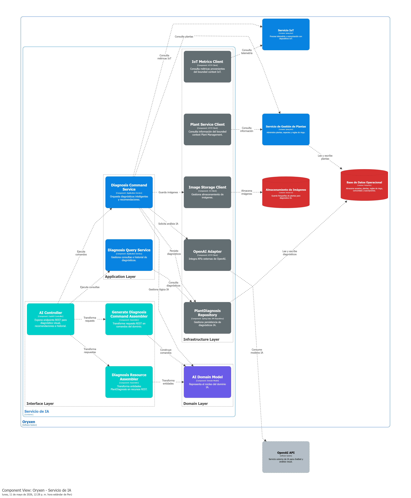


**Relaciones entre componentes:**

- `AI REST API Component → AI Transformation Component`
- `AI REST API Component → AI Command Processing Component`
- `AI REST API Component → AI Query Processing Component`
- `AI Command Processing Component → External AI Integration Component`
- `AI Command Processing Component → AI Domain Component`
- `AI Command Processing Component → AI Persistence Component`
- `AI Query Processing Component → AI Persistence Component`


### 5.4.6. Bounded Context Software Architecture Code Level Diagrams

En esta sección se presentan los diagramas a nivel de código del bounded context `Artificial Intelligence`, permitiendo visualizar el detalle del dominio y persistencia del contexto.


#### 5.4.6.1. Bounded Context Domain Layer Class Diagrams

El diagrama UML del Domain Layer del bounded context `Artificial Intelligence` muestra al agregado principal `PlantDiagnosis`, encargado de representar diagnósticos inteligentes asociados a plantas.

Además, se incluyen:

- `HealthStatus` como Value Object.
- Commands y Queries.
- Servicios del dominio.


**Diagrama UML de Clases (Domain Layer):**

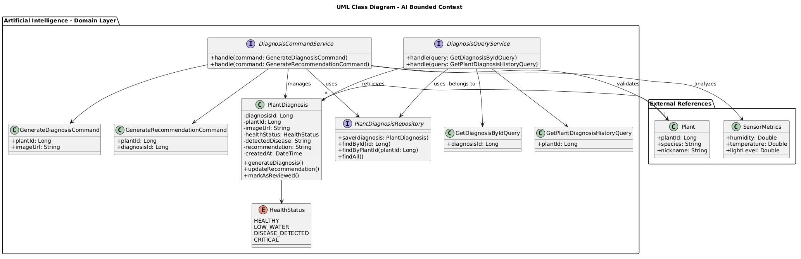


**Relaciones:**

- `PlantDiagnosis` es el Aggregate Root del contexto.
- `PlantDiagnosis` pertenece a una sola planta.
- `HealthStatus` representa el estado de salud de la planta.
- `DiagnosisCommandService` utiliza `PlantDiagnosisRepository`.
- `DiagnosisQueryService` utiliza `PlantDiagnosisRepository`.


#### 5.4.6.2. Bounded Context Database Design Diagram

El diagrama de base de datos del bounded context `Artificial Intelligence` representa la estructura relacional utilizada para almacenar diagnósticos y recomendaciones inteligentes.

**Diagrama de base de datos (ERD):**

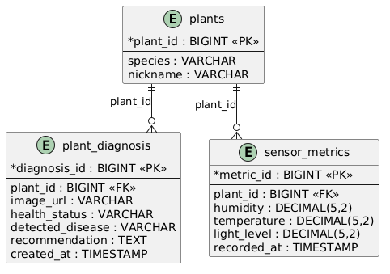


**Tabla principal:** `plant_diagnosis`

**Atributos:**

- `diagnosis_id`
- `plant_id`
- `image_url`
- `health_status`
- `detected_disease`
- `recommendation`
- `created_at`

**Constraints:**

- PRIMARY KEY (`diagnosis_id`)
- FOREIGN KEY (`plant_id`) → `plants(plant_id)`
- NOT NULL en:
  - `plant_id`
  - `health_status`
  - `created_at`


**Tabla relacionada:** `plants`

Representa las plantas registradas dentro del bounded context Plant Management.

**Atributos relevantes:**

- `plant_id`
- `species`
- `nickname`

**Constraints:**

- PRIMARY KEY (`plant_id`)


**Tabla relacionada:** `sensor_metrics`

Representa métricas ambientales obtenidas desde sensores IoT utilizados para complementar los diagnósticos inteligentes.

**Atributos:**

- `metric_id`
- `plant_id`
- `humidity`
- `temperature`
- `light_level`
- `recorded_at`

**Constraints:**

- PRIMARY KEY (`metric_id`)
- FOREIGN KEY (`plant_id`) → plants(`plant_id`)


**Relaciones entre tablas:**

- `plants (1) ──── (*) plant_diagnosis`
- `plants (1) ──── (*) sensor_metrics`


---

## 5.5. Bounded Context: Analysis & Reporting

El bounded context de **Analysis & Reporting** representa la inteligencia analítica de la plataforma Oryxen. Este contexto agrega la telemetría de sensores IoT proveniente del BC Device Management, integra los resultados diagnósticos del BC AI y los transforma en reportes accionables, dashboards históricos y alertas predictivas de salud del cultivo. Permite al usuario exportar sus datos en formatos PDF y CSV, programar la generación automática de reportes periódicos y acceder a tendencias de salud de sus plantas en el tiempo. Su diseño aplica el patrón CQRS para separar los flujos de escritura (generación e ingestión de telemetría) de los flujos de lectura (dashboards y exportaciones), y utiliza TimescaleDB como motor de series de tiempo para el almacenamiento eficiente de métricas históricas de alta frecuencia.

### 5.5.1. Domain Layer

La capa de dominio del bounded context **Analysis & Reporting** modela los reportes analíticos, las métricas de salud agregadas y los registros de telemetría histórica.

**a. Entity / Aggregate Root:**

**Nombre de la clase:** `Report`

**Paquete:** `com.upc.analytics.domain.model.aggregates`

**Propósito:** Representa un reporte de análisis generado para una planta específica en un rango de tiempo determinado. Constituye el Aggregate Root del bounded context Analysis & Reporting. Encapsula el estado del reporte, las métricas resumidas, el tipo de exportación y la referencia al archivo generado en cloud storage.

**Atributos:**

- `id: UUID` → Identificador único del reporte.
- `userId: UUID` → Usuario propietario del reporte.
- `plantId: UUID` → Planta analizada (referencia cruzada al BC Plant Management).
- `reportType: ReportType` → Tipo de reporte generado.
- `status: ReportStatus` → Estado del proceso de generación.
- `dateRange: DateRange` → Rango de fechas cubierto por el análisis.
- `exportFormat: ExportFormat` → Formato de exportación seleccionado.
- `fileUrl: String` → URL pre-firmada del archivo generado en S3/GCS (expira en 24 horas).
- `generatedAt: DateTime` → Marca temporal de finalización del proceso.
- `createdAt: DateTime` → Marca temporal de creación de la solicitud.

**Métodos:**

- `startGeneration()` → Transiciona el estado a `PROCESSING`.
- `completeGeneration(fileUrl: String)` → Registra la URL del archivo y transiciona a `COMPLETED`.
- `failGeneration(reason: String)` → Registra el error y transiciona a `FAILED`.
- `isCompleted()` → Verifica si el reporte fue generado exitosamente.
- `getDateRangeDays()` → Retorna la cantidad de días cubiertos por el análisis.

**Relaciones:**

- Un `Report` pertenece a un único usuario y una única planta.
- Un `Report` puede contener múltiples `MetricSummary` (uno por período de agregación).
- Un `ReportSchedule` genera múltiples `Report` a lo largo del tiempo.


**b. Entities del dominio:**

`MetricSummary`

**Propósito:** Representa las métricas ambientales y de salud agregadas para una planta en un período específico. Constituye la unidad fundamental de análisis dentro de un reporte.

**Atributos:**

- `id: UUID`
- `reportId: UUID`
- `plantId: UUID`
- `periodStart: DateTime`
- `periodEnd: DateTime`
- `avgHumidity: float`
- `avgTemperature: float`
- `avgLightLevel: float`
- `avgHealthScore: HealthScore`
- `minHealthScore: HealthScore`
- `maxHealthScore: HealthScore`
- `diagnosisCount: int` → Número de diagnósticos IA registrados en el período.
- `alertCount: int` → Número de alertas disparadas en el período.

**Métodos:**

- `getHealthTrend()` → Calcula la tendencia de salud comparando inicio y fin del período (`IMPROVING`, `STABLE`, `DECLINING`).
- `hasAnomalies()` → Retorna `true` si el `avgHealthScore` cayó por debajo del umbral crítico (< 30.0).


`TelemetryRecord`

**Propósito:** Representa una lectura individual de sensores IoT capturada en tiempo real. Origen: BC Device Management via evento de dominio `SensorDataReceivedEvent`.

**Atributos:**

- `id: UUID`
- `plantId: UUID`
- `deviceId: UUID`
- `humidity: float`
- `temperature: float`
- `lightLevel: float`
- `soilMoisture: float`
- `healthScore: HealthScore`
- `recordedAt: DateTime`

**Métodos:**

- `isWithinRange(start: DateTime, end: DateTime)` → Verifica si la lectura pertenece al rango temporal consultado.
- `isCritical()` → Retorna `true` si alguna métrica supera los umbrales de alerta definidos por el perfil de la especie.


`ReportSchedule`

**Propósito:** Representa una configuración de generación automática y periódica de reportes para una planta de un usuario.

**Atributos:**

- `id: UUID`
- `userId: UUID`
- `plantId: UUID`
- `frequency: ScheduleFrequency` → `DAILY`, `WEEKLY`, `MONTHLY`.
- `exportFormat: ExportFormat`
- `nextRunAt: DateTime`
- `isActive: boolean`
- `createdAt: DateTime`

**Métodos:**

- `activate()` → Activa la programación periódica.
- `deactivate()` → Suspende la programación sin eliminarla.
- `calculateNextRun()` → Calcula la próxima fecha de ejecución en función de la frecuencia configurada.


**c. Value Objects:**

`DateRange`

Representa un intervalo temporal inmutable para la consulta de métricas y generación de reportes.

**Atributos:**

- `start: DateTime`
- `end: DateTime`

**Métodos:**

- `contains(date: DateTime)` → Verifica si una fecha pertenece al rango.
- `overlapsWith(other: DateRange)` → Detecta solapamiento entre rangos.
- `days()` → Retorna la duración en días del rango.
- `validate()` → Lanza `InvalidDateRangeException` si `start >= end` o si el rango supera 365 días.


`ReportType`

Enumera los tipos de reportes disponibles en la plataforma.

**Valores posibles:**

- `HEALTH_SUMMARY` → Resumen de salud de la planta en el período, con métricas clave y recomendaciones.
- `TELEMETRY_DETAIL` → Detalle completo de lecturas de sensores con exportación de serie de tiempo raw.
- `PREDICTIVE_ALERT` → Reporte con predicciones de riesgo sanitario generadas por el modelo IA del BC AI.
- `COMPARATIVE_ANALYSIS` → Comparación de métricas entre múltiples plantas del mismo usuario en un período.


`ExportFormat`

Enumera los formatos de exportación disponibles para descarga.

**Valores posibles:**

- `PDF`
- `CSV`
- `JSON`


`ReportStatus`

Representa el estado del ciclo de vida de un reporte.

**Valores posibles:**

- `PENDING`
- `PROCESSING`
- `COMPLETED`
- `FAILED`


`HealthScore`

Representa la puntuación de salud de una planta, calculada por el modelo de IA del BC AI a partir de lecturas de sensores e imágenes diagnósticas.

**Atributos:**

- `value: float` → Valor entre 0.0 (crítico) y 100.0 (óptimo).

**Métodos:**

- `isCritical()` → Retorna `true` si `value < 30.0`.
- `isWarning()` → Retorna `true` si `value` está entre 30.0 y 60.0.
- `isGood()` → Retorna `true` si `value` está entre 60.0 y 80.0.
- `isOptimal()` → Retorna `true` si `value >= 80.0`.
- `label()` → Retorna la etiqueta textual: `CRITICAL`, `WARNING`, `GOOD`, `OPTIMAL`.


`ScheduleFrequency`

Enumera las frecuencias de generación automática de reportes.

**Valores posibles:**

- `DAILY`
- `WEEKLY`
- `MONTHLY`


**d. Commands del dominio:**

`GenerateReportCommand`

**Paquete:** `com.upc.analytics.domain.model.commands`

**Propósito:** Solicitar la generación bajo demanda de un reporte analítico para una planta en un rango de fechas.

**Atributos:**

- `userId: UUID`
- `plantId: UUID`
- `reportType: ReportType`
- `dateRange: DateRange`
- `exportFormat: ExportFormat`


`ScheduleReportCommand`

**Propósito:** Configurar la generación automática y periódica de reportes para una planta.

**Atributos:**

- `userId: UUID`
- `plantId: UUID`
- `frequency: ScheduleFrequency`
- `exportFormat: ExportFormat`


`ExportReportCommand`

**Propósito:** Solicitar la exportación de un reporte ya generado en un formato alternativo.

**Atributos:**

- `reportId: UUID`
- `userId: UUID`
- `targetFormat: ExportFormat`


`CancelReportScheduleCommand`

**Propósito:** Desactivar una configuración de generación periódica de reportes.

**Atributos:**

- `scheduleId: UUID`
- `userId: UUID`


**e. Queries del dominio:**

`GetReportQuery`

**Propósito:** Obtener los detalles completos de un reporte específico incluyendo sus `MetricSummary`.

**Atributos:**

- `reportId: UUID`
- `userId: UUID`


`ListReportsQuery`

**Propósito:** Obtener la lista paginada de reportes generados por un usuario, con filtros opcionales.

**Atributos:**

- `userId: UUID`
- `plantId: UUID` (opcional)
- `page: int`
- `size: int`


`GetTelemetrySummaryQuery`

**Propósito:** Obtener las métricas de telemetría agregadas para una planta en un rango de tiempo, con granularidad configurable.

**Atributos:**

- `plantId: UUID`
- `dateRange: DateRange`
- `aggregationInterval: String` → `HOUR`, `DAY`, `WEEK`.


`GetHealthTrendQuery`

**Propósito:** Obtener la serie temporal de `HealthScore` para una planta, incluyendo la proyección predictiva del modelo IA para los próximos N días.

**Atributos:**

- `plantId: UUID`
- `dateRange: DateRange`
- `predictionHorizonDays: int`


`GetDashboardDataQuery`

**Propósito:** Obtener los datos consolidados para el dashboard analítico del usuario, incluyendo resúmenes de salud de todas sus plantas activas y alertas recientes.

**Atributos:**

- `userId: UUID`
- `summaryPeriod: String` → `LAST_7_DAYS`, `LAST_30_DAYS`, `LAST_90_DAYS`.


`ListScheduledReportsQuery`

**Propósito:** Listar las configuraciones de reportes periódicos activos de un usuario.

**Atributos:**

- `userId: UUID`


**f. Domain Services:**

`ReportGenerationDomainService`

**Paquete:** `com.upc.analytics.domain.services`

**Propósito:** Orquestar el proceso completo de generación de un reporte: recuperación de telemetría, agregación estadística de métricas, enriquecimiento con predicciones IA, renderizado del documento exportable y publicación del evento de finalización.

**Operaciones:**

- `handle(GenerateReportCommand)` → Crea el `Report` en estado `PENDING`, procesa la telemetría, genera el documento y lo persiste.
- `handle(ExportReportCommand)` → Exporta un reporte existente (`COMPLETED`) en un formato alternativo.
- `handle(CancelReportScheduleCommand)` → Desactiva un `ReportSchedule` y cancela el job del scheduler.


`TelemetryAggregationDomainService`

**Propósito:** Agregar las lecturas de telemetría (`TelemetryRecord`) en `MetricSummary` por períodos configurables, aplicando funciones estadísticas (promedio, mínimo, máximo, conteos de alertas y diagnósticos).

**Operaciones:**

- `aggregate(plantId: UUID, dateRange: DateRange, interval: String)` → Retorna lista de `MetricSummary` para el período.
- `handle(GetTelemetrySummaryQuery)` → Retorna los agregados para la vista de dashboard.
- `handle(GetHealthTrendQuery)` → Retorna la serie temporal de `HealthScore` con proyección predictiva integrada.


`PredictiveHealthDomainService`

**Propósito:** Integrar las predicciones del BC AI para enriquecer los reportes con alertas proactivas de riesgo sanitario, anticipando deterioro antes de que sea visible en los sensores o a simple vista.

**Operaciones:**

- `getPredictedHealthScore(plantId: UUID, horizonDays: int)` → Solicita predicción al BC AI para `horizonDays` días futuros vía Anti-Corruption Layer.
- `handle(GetDashboardDataQuery)` → Compone el payload del dashboard integrando métricas históricas y predicciones IA.

---

### 5.5.2. Interface Layer

La Interface Layer del bounded context **Analysis & Reporting** expone los endpoints REST para la consulta, generación y exportación de reportes analíticos.

**`ReportController`**

**Paquete:** `com.upc.analytics.interfaces.rest`

**Base URL:** `/api/v1/reports`

**Endpoints:**

| Método | Ruta | Descripción | Rol requerido |
|--------|------|-------------|--------------|
| `POST` | `/` | Solicitar generación de reporte bajo demanda | FARMER, ADMIN |
| `GET` | `/{reportId}` | Obtener detalles de un reporte | FARMER, ADMIN |
| `GET` | `/` | Listar reportes del usuario paginados | FARMER, ADMIN |
| `GET` | `/{reportId}/download` | Descargar archivo del reporte (PDF/CSV/JSON) | FARMER, ADMIN |
| `DELETE` | `/{reportId}` | Eliminar un reporte generado | FARMER, ADMIN |


**`DashboardController`**

**Base URL:** `/api/v1/dashboard`

**Endpoints:**

| Método | Ruta | Descripción | Rol requerido |
|--------|------|-------------|--------------|
| `GET` | `/` | Obtener datos consolidados del dashboard analítico | FARMER, ADMIN |
| `GET` | `/telemetry` | Obtener serie temporal de telemetría por planta y período | FARMER, ADMIN |
| `GET` | `/health-trend` | Obtener tendencia de salud con proyección predictiva IA | FARMER, ADMIN |
| `GET` | `/summary` | Obtener resumen de salud de todas las plantas activas del usuario | FARMER, ADMIN |


**`ReportScheduleController`**

**Base URL:** `/api/v1/reports/schedules`

**Endpoints:**

| Método | Ruta | Descripción | Rol requerido |
|--------|------|-------------|--------------|
| `POST` | `/` | Configurar reporte periódico automático | FARMER, ADMIN |
| `GET` | `/` | Listar configuraciones de reportes activos | FARMER, ADMIN |
| `DELETE` | `/{scheduleId}` | Cancelar generación periódica | FARMER, ADMIN |

---

### 5.5.3. Application Layer

La Application Layer del bounded context **Analysis & Reporting** coordina los flujos de generación de reportes, consulta de dashboards y exportación de datos analíticos.

**Command Handlers:**

`GenerateReportCommandHandler`

**Propósito:** Crear el registro `Report` en estado `PENDING`, publicar el job de generación al sistema de colas (Spring Batch), retornar el `reportId` para seguimiento asíncrono del proceso.

`ScheduleReportCommandHandler`

**Propósito:** Crear y persistir el `ReportSchedule`, calcular el `nextRunAt` según la frecuencia seleccionada y registrar el job en el scheduler distribuido (Spring Batch + Quartz Scheduler).

`ExportReportCommandHandler`

**Propósito:** Recuperar el `Report` en estado `COMPLETED`, generar el documento en el formato destino usando el adaptador correspondiente (`PdfExportAdapter` o `CsvExportAdapter`) y actualizar la URL de descarga.

`CancelReportScheduleCommandHandler`

**Propósito:** Localizar el `ReportSchedule` por ID y usuario, desactivarlo via `deactivate()` y remover el job del scheduler distribuido.


**Query Handlers:**

`GetReportQueryHandler`

**Propósito:** Recuperar el `Report` y sus `MetricSummary` asociados, proyectarlos al DTO de respuesta con URL de descarga válida.

`GetDashboardDataQueryHandler`

**Propósito:** Orquestar las consultas de métricas de todas las plantas activas del usuario, enriquecer el resultado con predicciones del BC AI y componer el payload completo del dashboard.

`GetTelemetrySummaryQueryHandler`

**Propósito:** Delegar en `TelemetryAggregationDomainService` para calcular los agregados estadísticos del rango solicitado con la granularidad especificada.


**Application Services:**

`ReportApplicationService`

**Paquete:** `com.upc.analytics.application.internal.commandservices`

**Operaciones:**

- `handle(GenerateReportCommand)`
- `handle(ExportReportCommand)`
- `handle(CancelReportScheduleCommand)`
- `handle(ScheduleReportCommand)`
- `handle(GetReportQuery)`
- `handle(ListReportsQuery)`


`DashboardApplicationService`

**Operaciones:**

- `handle(GetDashboardDataQuery)`
- `handle(GetTelemetrySummaryQuery)`
- `handle(GetHealthTrendQuery)`
- `handle(ListScheduledReportsQuery)`

---

### 5.5.4. Infrastructure Layer

La Infrastructure Layer del bounded context **Analysis & Reporting** implementa la persistencia de telemetría de alta frecuencia, la generación de documentos exportables y la integración con los contextos AI y Notification.

**Adaptadores y Repositorios:**

`TelemetryTimeSeriesRepository`

**Propósito:** Almacenar y consultar `TelemetryRecord` en PostgreSQL con la extensión TimescaleDB, que habilita hypertables particionadas automáticamente por tiempo. Optimiza consultas de rango temporal (semanas o meses de lecturas) mediante índices BRIN comprimidos.

**Dependencia:** TimescaleDB 2.x + Spring Data JPA con `@Query` nativa.


`ReportJpaRepository`

**Propósito:** Repositorio JPA para la persistencia de entidades `Report` en PostgreSQL.

**Dependencia:** Spring Data JPA.


`MetricSummaryJpaRepository`

**Propósito:** Repositorio JPA para la persistencia de `MetricSummary` asociados a cada `Report`.


`ReportScheduleJpaRepository`

**Propósito:** Repositorio JPA para la persistencia y consulta de configuraciones de reportes periódicos.


`PdfExportAdapter`

**Propósito:** Generar documentos PDF a partir de los datos de `Report` y sus `MetricSummary`. Implementa plantillas con gráficos de series temporales, tabla de métricas clave (humedad, temperatura, HealthScore), sección de alertas y recomendaciones predictivas IA.

**Dependencia:** `net.sf.jasperreports:jasperreports:6.20.0`


`CsvExportAdapter`

**Propósito:** Serializar los `TelemetryRecord` y `MetricSummary` en formato CSV estructurado para exportación y análisis externo en herramientas como Excel o Python/pandas.

**Dependencia:** `org.apache.commons:commons-csv:1.10.0`


`AIAnalyticsAdapter`

**Propósito:** Cliente interno para solicitar predicciones de salud al BC AI. Implementa el patrón Anti-Corruption Layer (ACL) para aislar el modelo de dominio de Analytics del modelo de dominio del BC AI, traduciendo entre sus lenguajes de dominio respectivos.

**Patrón de integración:** ACL sincrónico hacia el `DiagnosisQueryService` del BC AI.


`NotificationEventPublisher`

**Propósito:** Publicar el evento de dominio `ReportGeneratedEvent` al BC Notification cuando un reporte es completado exitosamente, para que el usuario reciba una notificación push y/o email con el enlace de descarga.

**Patrón de integración:** Domain Event → Apache Kafka (topic: `analytics.report.generated`).


`FileStorageAdapter`

**Propósito:** Subir los documentos generados (PDF/CSV) a almacenamiento de objetos en la nube y retornar una URL de descarga pre-firmada con expiración de 24 horas.

**Dependencia:** AWS S3 SDK / Google Cloud Storage client library.


**Dependencias de infraestructura del contexto Analysis & Reporting:**

- PostgreSQL 15 + TimescaleDB 2.x → series de tiempo de telemetría y persistencia de reportes, métricas y schedules.
- Apache Kafka → publicación del evento `ReportGeneratedEvent` al BC Notification.
- JasperReports (6.20.0) → generación de documentos PDF con gráficos y tablas.
- Apache Commons CSV (1.10.0) → exportación de datos tabulares en formato CSV.
- AWS S3 / Google Cloud Storage → almacenamiento persistente de archivos generados.
- Spring Batch → orquestación de reportes periódicos programados (jobs distribuidos).
- Redis → caché de resultados de dashboard para consultas de alta frecuencia (TTL: 5 minutos).

---

### 5.5.5. Bounded Context Software Architecture Component Level Diagrams

El Component Diagram del bounded context `Analysis & Reporting` representa la arquitectura interna del módulo analítico, mostrando el flujo completo desde la ingestión de telemetría IoT hasta la generación y entrega de reportes al usuario.

**Descripción de componentes principales:**

- **Report REST API Component:** Expone los endpoints de generación, consulta y descarga de reportes (`/api/v1/reports`). Delega en `ReportApplicationService`.
- **Dashboard REST API Component:** Expone los endpoints del dashboard analítico (`/api/v1/dashboard`). Delega en `DashboardApplicationService`.
- **Report Schedule REST API Component:** Expone los endpoints de reportes periódicos (`/api/v1/reports/schedules`).
- **Report Command Processing Component:** Orquesta los command handlers de generación, exportación y programación de reportes.
- **Dashboard Query Processing Component:** Resuelve las queries de dashboard, telemetría y tendencias de salud.
- **Analytics Domain Component:** Contiene los agregados `Report`, `MetricSummary`, `TelemetryRecord` y `ReportSchedule`, junto a los domain services de agregación, generación y predicción.
- **Telemetry Time-Series Component:** Gestiona la escritura y consulta eficiente de series de tiempo de sensores (TimescaleDB hypertable).
- **Analytics Persistence Component:** Implementa los repositorios JPA para reportes, métricas y schedules.
- **PDF/CSV Export Component:** Genera documentos exportables con gráficos de series temporales y tablas de métricas.
- **AI Integration Component (ACL):** Anti-Corruption Layer hacia el BC AI para obtener predicciones de `HealthScore`.
- **File Storage Component:** Gestiona el ciclo de vida de archivos generados en cloud storage (S3/GCS) con pre-signed URLs.
- **Notification Event Component:** Publica `ReportGeneratedEvent` al BC Notification via Kafka.

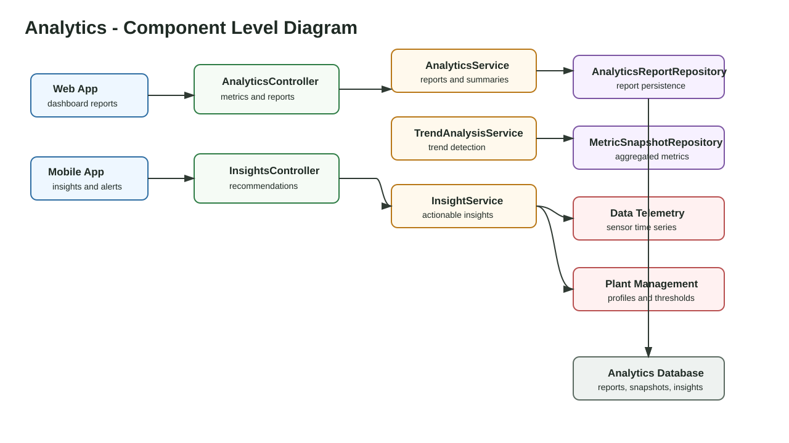

---

### 5.5.6. Bounded Context Software Architecture Code Level Diagrams

En esta sección se presentan los diagramas a nivel de código del bounded context `Analysis & Reporting`, visualizando la estructura del dominio y el diseño de la base de datos analítica.

#### 5.5.6.1. Bounded Context Domain Layer Class Diagrams

El diagrama UML del Domain Layer muestra el agregado principal `Report`, la entidad `MetricSummary` contenida en cada reporte, la entidad `TelemetryRecord` como fuente de datos histórica (consumida desde el BC Device Management) y `ReportSchedule` como entidad de configuración de generación periódica. Los Value Objects `DateRange`, `ReportType`, `ExportFormat`, `ReportStatus`, `HealthScore` y `ScheduleFrequency` garantizan inmutabilidad en las reglas de negocio críticas del dominio analítico.

**Relaciones entre clases:**

- `Report (1) ──── (*) MetricSummary`
- `ReportSchedule (1) ──── (*) Report` (vía generación periódica)
- `TelemetryRecord (*) ──── (1) plantId` (referencia cruzada lógica al BC Plant Management)
- `ReportGenerationDomainService → Report`
- `TelemetryAggregationDomainService → TelemetryRecord`
- `TelemetryAggregationDomainService → MetricSummary`
- `PredictiveHealthDomainService → HealthScore`

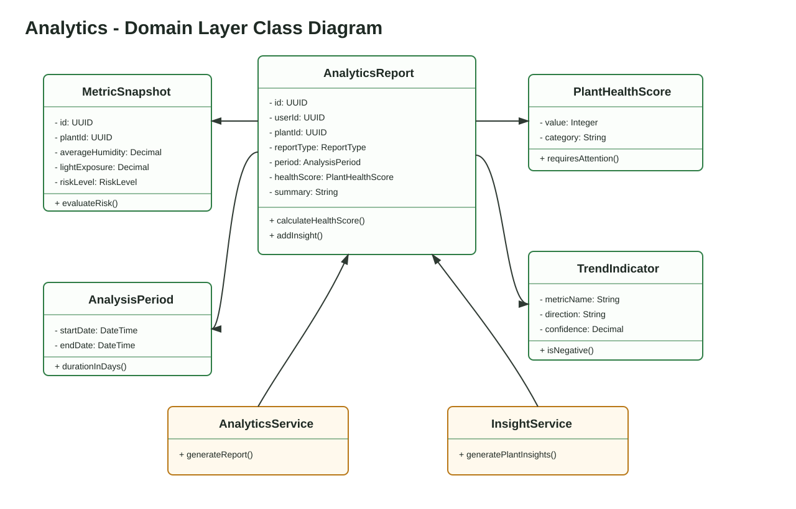

#### 5.5.6.2. Bounded Context Database Design Diagram

El diagrama de base de datos del bounded context `Analysis & Reporting` representa el esquema relacional para reportes y la hypertable TimescaleDB para telemetría de alta frecuencia.

**Tabla principal:** `reports`

**Atributos:**

- `report_id` → UUID, PRIMARY KEY
- `user_id` → UUID, NOT NULL
- `plant_id` → UUID, NOT NULL
- `report_type` → ENUM('HEALTH_SUMMARY','TELEMETRY_DETAIL','PREDICTIVE_ALERT','COMPARATIVE_ANALYSIS'), NOT NULL
- `status` → ENUM('PENDING','PROCESSING','COMPLETED','FAILED'), NOT NULL
- `date_range_start` → TIMESTAMP, NOT NULL
- `date_range_end` → TIMESTAMP, NOT NULL
- `export_format` → ENUM('PDF','CSV','JSON'), NOT NULL
- `file_url` → VARCHAR(500), NULLABLE
- `generated_at` → TIMESTAMP, NULLABLE
- `created_at` → TIMESTAMP, NOT NULL


**Tabla:** `metric_summaries`

**Atributos:**

- `summary_id` → UUID, PRIMARY KEY
- `report_id` → UUID, FOREIGN KEY → `reports(report_id)`
- `plant_id` → UUID, NOT NULL
- `period_start` → TIMESTAMP, NOT NULL
- `period_end` → TIMESTAMP, NOT NULL
- `avg_humidity` → FLOAT, NOT NULL
- `avg_temperature` → FLOAT, NOT NULL
- `avg_light_level` → FLOAT, NOT NULL
- `avg_health_score` → FLOAT, NOT NULL
- `min_health_score` → FLOAT, NOT NULL
- `max_health_score` → FLOAT, NOT NULL
- `diagnosis_count` → INT, DEFAULT 0
- `alert_count` → INT, DEFAULT 0


**Hypertable TimescaleDB:** `telemetry_records`

**Atributos:**

- `record_id` → UUID
- `plant_id` → UUID, NOT NULL
- `device_id` → UUID, NOT NULL
- `humidity` → FLOAT, NOT NULL
- `temperature` → FLOAT, NOT NULL
- `light_level` → FLOAT, NOT NULL
- `soil_moisture` → FLOAT
- `health_score` → FLOAT
- `recorded_at` → TIMESTAMP WITH TIME ZONE, NOT NULL (dimensión de partición temporal de TimescaleDB)

**Constraints:**

- PRIMARY KEY (`record_id`, `recorded_at`) — requerido por TimescaleDB para hypertables.
- INDEX BRIN en `recorded_at` para consultas de rango eficientes sobre meses de datos.
- INDEX COMPUESTO en (`plant_id`, `recorded_at`) para queries por planta + ventana temporal.


**Tabla:** `report_schedules`

**Atributos:**

- `schedule_id` → UUID, PRIMARY KEY
- `user_id` → UUID, NOT NULL
- `plant_id` → UUID, NOT NULL
- `frequency` → ENUM('DAILY','WEEKLY','MONTHLY'), NOT NULL
- `export_format` → ENUM('PDF','CSV','JSON'), NOT NULL
- `next_run_at` → TIMESTAMP, NOT NULL
- `is_active` → BOOLEAN, DEFAULT TRUE
- `created_at` → TIMESTAMP, NOT NULL

**Constraints:**

- INDEX en `next_run_at` para la consulta eficiente de jobs pendientes de ejecución por el scheduler.
- INDEX en `user_id` para listar todos los schedules de un usuario.


**Relaciones entre tablas:**

- `reports (1) ──── (*) metric_summaries`
- `report_schedules (1) ──── (*) reports`
- `telemetry_records (*) ──── (1) plant_id` (referencia lógica al BC Plant Management)

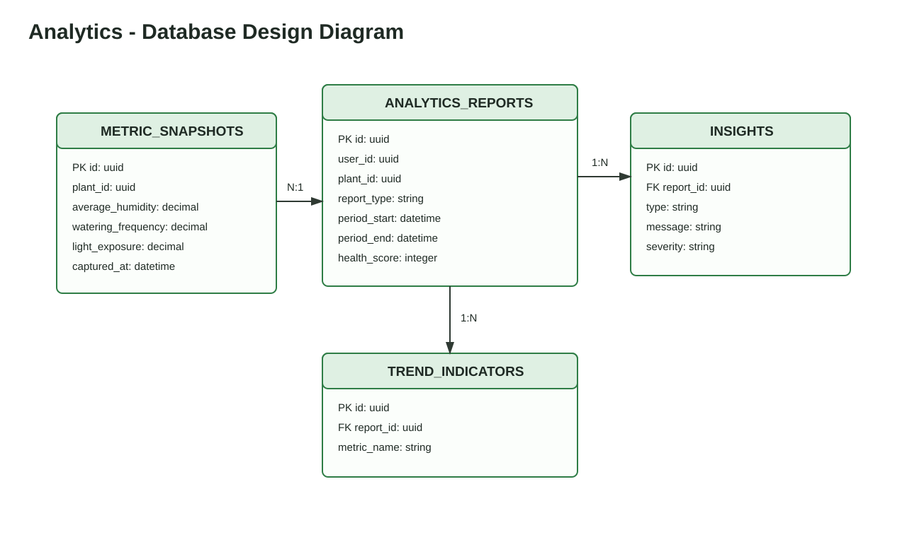

---

## 5.6. Bounded Context: Notification

El bounded context **Notification** representa la capacidad de Oryxen para enviar alertas, recordatorios y notificaciones personalizadas a los usuarios, con el objetivo de mantener informados a los usuarios sobre eventos relevantes del sistema, como necesidades de riego, diagnósticos generados por IA, cambios en el estado de una planta o actualizaciones importantes de la plataforma.


### 5.6.1. Domain Layer

La capa de dominio del bounded context **Notification** contiene las clases que modelan el comportamiento principal relacionado con el envío y gestión de notificaciones dentro de la plataforma. En esta capa se definen las reglas de negocio asociadas a la generación, programación, lectura y configuración de notificaciones.

**a. Entity / Aggregate Root:**

**Nombre de la clase:** `Notification`  
**Paquete:** `com.upc.oryxen.notification.domain.model.aggregates`

**Propósito:**  
Representa una notificación generada por el sistema para informar a un usuario sobre un evento relevante. Constituye el agregado raíz del bounded context Notification.

**Atributos:**

- `notificationId: Long` → Identificador único de la notificación.
- `userId: Long` → Identificador del usuario destinatario.
- `plantId: Long?` → Identificador de la planta asociada, si aplica.
- `type: NotificationType` → Tipo de notificación.
- `channel: NotificationChannel` → Canal por el cual se enviará la notificación.
- `title: String` → Título corto de la notificación.
- `message: String` → Mensaje descriptivo.
- `status: NotificationStatus` → Estado actual de la notificación.
- `scheduledAt: DateTime?` → Fecha programada de envío.
- `sentAt: DateTime?` → Fecha en que fue enviada.
- `readAt: DateTime?` → Fecha en que fue leída.
- `createdAt: DateTime` → Fecha de creación.

**Métodos:**

- `createNotification()` → Crea una nueva notificación en estado inicial.
- `scheduleNotification()` → Programa el envío de una notificación.
- `markAsSent()` → Marca la notificación como enviada.
- `markAsRead()` → Marca la notificación como leída.
- `cancelNotification()` → Cancela una notificación programada.

**Relaciones:**

- Una `Notification` pertenece a un solo usuario.
- Una notificación puede estar asociada a una planta.
- Un usuario puede tener múltiples notificaciones.


**b. Entity:**

**Nombre de la clase:** `NotificationPreference`  
**Paquete:** `com.upc.oryxen.notification.domain.model.entities`  

**Propósito:**  
Representa las preferencias de notificación configuradas por el usuario, como canales habilitados, tipos de alertas recibidas y horarios silenciosos.

**Atributos:**

- `preferenceId: Long` → Identificador único.
- `userId: Long` → Identificador del usuario.
- `pushEnabled: Boolean` → Indica si las notificaciones push están habilitadas.
- `diagnosisAlertsEnabled: Boolean` → Habilita alertas por diagnósticos IA.
- `wateringAlertsEnabled: Boolean` → Habilita alertas por riego.
- `communityAlertsEnabled: Boolean` → Habilita alertas de comunidad.
- `quietHoursStart: LocalTime?` → Hora de inicio del modo silencioso.
- `quietHoursEnd: LocalTime?` → Hora de fin del modo silencioso.
- `createdAt: DateTime` → Fecha de creación.
- `updatedAt: DateTime` → Fecha de actualización.

**Métodos:**

- `updatePreferences()` → Actualiza la configuración del usuario.
- `enablePushNotifications()` → Activa el canal push.
- `disablePushNotifications()` → Desactiva el canal push.


**c. Entity:**

**Nombre de la clase:** `DeviceToken`  
**Paquete:** `com.upc.oryxen.notification.domain.model.entities`  

**Propósito:**  
Representa el token de un dispositivo móvil registrado para recibir notificaciones push.

**Atributos:**

- `tokenId: Long` → Identificador único.
- `userId: Long` → Usuario propietario del token.
- `deviceToken: String` → Token generado por FCM.
- `platform: String` → Plataforma del dispositivo (Android/iOS).
- `active: Boolean` → Indica si el token sigue activo.
- `createdAt: DateTime` → Fecha de registro.
- `lastUsedAt: DateTime?` → Última vez que el token fue usado.

**Métodos:**

- `registerToken()` → Registra un nuevo token.
- `deactivateToken()` → Desactiva un token inválido.
- `updateLastUsed()` → Actualiza el último uso.


**d. Referencias externas del dominio:**

Dentro del contexto Notification se utilizan entidades provenientes de otros bounded contexts:

**UserProfile**
- Origen: `Identity & Access`
- Propósito: Representa al usuario receptor de la notificación.
- Atributos relevantes:
  - `userId`
  - `name`
  - `email`

**Plant**
- Origen: `Plant Management`
- Propósito: Representa la planta asociada a la notificación.
- Atributos relevantes:
  - `plantId`
  - `species`
  - `nickname`


**e. Value Objects:**

**`NotificationType`**

Representa el tipo de notificación generada por el sistema.

- `WATERING_REMINDER`
- `DIAGNOSIS_ALERT`
- `SYSTEM_ALERT`
- `COMMUNITY_UPDATE`

**`NotificationChannel`**

Representa el canal de entrega de la notificación.

- `PUSH`
- `EMAIL`
- `IN_APP`

**`NotificationStatus`**

Representa el estado de la notificación.

- `PENDING`
- `SENT`
- `READ`
- `CANCELLED`
- `FAILED`


**f. Commands del dominio:**

**`SendNotificationCommand`**  
**Paquete:** `com.upc.oryxen.notification.domain.model.commands`

**Propósito:**  
Representa la intención de enviar una notificación inmediata.

**Atributos:**

- `userId: Long`
- `plantId: Long?`
- `type: NotificationType`
- `channel: NotificationChannel`
- `title: String`
- `message: String`


**`ScheduleNotificationCommand`**  

**Propósito:**  
Representa la intención de programar una notificación para una fecha futura.

**Atributos:**

- `userId: Long`
- `plantId: Long?`
- `type: NotificationType`
- `channel: NotificationChannel`
- `title: String`
- `message: String`
- `scheduledAt: DateTime`


**`MarkNotificationAsReadCommand`**

**Propósito:**  
Marca una notificación como leída por el usuario.

**Atributos:**

- `notificationId: Long`


**`UpdateNotificationPreferencesCommand`**

**Propósito:**  
Actualiza la configuración de preferencias de notificación del usuario.

**Atributos:**

- `userId: Long`
- `pushEnabled: Boolean`
- `diagnosisAlertsEnabled: Boolean`
- `wateringAlertsEnabled: Boolean`
- `communityAlertsEnabled: Boolean`
- `quietHoursStart: LocalTime?`
- `quietHoursEnd: LocalTime?`


**g. Queries del dominio:**

**`GetNotificationsByUserQuery`**

**Propósito:**  
Obtener todas las notificaciones de un usuario.

**Atributos:**

- `userId: Long`


**`GetUnreadNotificationsQuery`**

**Propósito:**  
Obtener las notificaciones no leídas de un usuario.

**Atributos:**

- `userId: Long`


**`GetNotificationPreferencesQuery`**

**Propósito:**  
Obtener las preferencias de notificación de un usuario.

**Atributos:**

- `userId: Long`


**h. Domain Services:**

**`NotificationCommandService`**  
**Paquete:** `com.upc.oryxen.notification.domain.services`

**Propósito:**  
Define las operaciones de escritura relacionadas con el envío y configuración de notificaciones.

**Operaciones:**

- `handle(SendNotificationCommand)`
- `handle(ScheduleNotificationCommand)`
- `handle(MarkNotificationAsReadCommand)`
- `handle(UpdateNotificationPreferencesCommand)`


**`NotificationQueryService`**

**Propósito:**  
Define las operaciones de lectura del contexto Notification.

**Operaciones:**

- `handle(GetNotificationsByUserQuery)`
- `handle(GetUnreadNotificationsQuery)`
- `handle(GetNotificationPreferencesQuery)`


**i. Repository:**

**`NotificationRepository`**  
**Paquete:** `com.upc.oryxen.notification.infrastructure.persistence.jpa.repositories`

**Propósito:**  
Permite acceder a la persistencia de notificaciones.

**Operaciones:**

- `save(Notification)`
- `findById(Long)`
- `findByUserId(Long)`
- `findByStatus(NotificationStatus)`
- `findAll()`


**`NotificationPreferenceRepository`**  

**Propósito:**  
Permite acceder a la persistencia de preferencias de notificación.

**Operaciones:**

- `save(NotificationPreference)`
- `findByUserId(Long)`


**`DeviceTokenRepository`**  

**Propósito:**  
Permite persistir y recuperar tokens de dispositivos móviles.

**Operaciones:**

- `save(DeviceToken)`
- `findByUserId(Long)`
- `findByDeviceToken(String)


### 5.6.2. Interface Layer

La Interface Layer del bounded context **Notification** contiene las clases responsables de exponer las funcionalidades relacionadas con alertas, recordatorios y preferencias de notificación a través de endpoints REST consumidos por las aplicaciones móviles y web.

**a. `NotificationController`**

**Paquete:** `com.upc.oryxen.notification.interfaces.rest`

**Propósito:**  
Exponer los endpoints HTTP para crear, consultar y actualizar notificaciones y preferencias.

**Dependencias:**

- `NotificationCommandService`
- `NotificationQueryService`

**Endpoints expuestos:**

- `POST /api/v1/notifications` → enviar notificación
- `POST /api/v1/notifications/schedule` → programar notificación
- `GET /api/v1/notifications/users/{userId}` → listar notificaciones de un usuario
- `GET /api/v1/notifications/users/{userId}/unread` → listar notificaciones no leídas
- `PUT /api/v1/notifications/{id}/read` → marcar como leída
- `GET /api/v1/notifications/preferences/{userId}` → obtener preferencias
- `PUT /api/v1/notifications/preferences/{userId}` → actualizar preferencias


**b. Resources / DTOs:**

**`NotificationResource`**

**Propósito:**  
Representar la información de una notificación enviada al frontend.

**Atributos:**

- `notificationId`
- `userId`
- `plantId`
- `type`
- `channel`
- `title`
- `message`
- `status`
- `scheduledAt`
- `sentAt`
- `readAt`
- `createdAt`


**`SendNotificationResource`**

**Propósito:**  
Representar los datos necesarios para crear una notificación.

**Atributos:**

- `userId`
- `plantId`
- `type`
- `channel`
- `title`
- `message`


**`NotificationPreferenceResource`**

**Propósito:**  
Representar la configuración de preferencias del usuario.

**Atributos:**

- `userId`
- `pushEnabled`
- `diagnosisAlertsEnabled`
- `wateringAlertsEnabled`
- `communityAlertsEnabled`
- `quietHoursStart`
- `quietHoursEnd`


**c. Assemblers:**

**`NotificationResourceFromEntityAssembler`**  
**Propósito:**  
Transformar una entidad `Notification` en un `NotificationResource`.


**`SendNotificationCommandFromResourceAssembler`**  
**Propósito:**  
Transformar un `SendNotificationResource` en un `SendNotificationCommand`.


**`NotificationPreferenceResourceFromEntityAssembler`**  
**Propósito:**  
Transformar una entidad `NotificationPreference` en un `NotificationPreferenceResource`.


**`UpdateNotificationPreferencesCommandFromResourceAssembler`**  
**Propósito:**  
Transformar un `NotificationPreferenceResource` en un `UpdateNotificationPreferencesCommand`.


### 5.6.3. Application Layer

La Application Layer del bounded context **Notification** coordina los procesos de negocio relacionados con el envío de alertas, la programación de recordatorios y la administración de preferencias del usuario.

**Capacidades principales:**

- Enviar notificaciones inmediatas.
- Programar recordatorios.
- Marcar notificaciones como leídas.
- Consultar historial de notificaciones.
- Configurar preferencias de entrega.


**a. Command Handlers / Command Services:**

**`NotificationCommandServiceImpl`**  
**Paquete:** `com.upc.oryxen.notification.application.internal.commandservices`

**Dependencias:**

- `NotificationRepository`
- `NotificationPreferenceRepository`
- `DeviceTokenRepository`
- `PlantRepository`
- `FirebaseNotificationAdapter`

**Operaciones que maneja:**

**`handle(SendNotificationCommand command)`**
- Valida que el usuario exista.
- Valida preferencias del usuario.
- Genera la notificación.
- La envía por el canal correspondiente.
- Persiste el registro en base de datos.

**`handle(ScheduleNotificationCommand command)`**
- Programa la notificación para una fecha futura.
- Registra el evento en estado `PENDING`.
- Deja la ejecución a un scheduler.

**`handle(MarkNotificationAsReadCommand command)`**
- Busca la notificación.
- Cambia su estado a `READ`.
- Guarda la actualización.

**`handle(UpdateNotificationPreferencesCommand command)`**
- Recupera las preferencias del usuario.
- Actualiza canales y horarios.
- Persiste la nueva configuración.

---

**b. Query Handlers / Query Services:**

**`NotificationQueryServiceImpl`**  
**Propósito:**  
Gestionar operaciones de lectura relacionadas con notificaciones y preferencias.

**Dependencias:**

- `NotificationRepository`
- `NotificationPreferenceRepository`

**Operaciones:**

- `handle(GetNotificationsByUserQuery)`
- `handle(GetUnreadNotificationsQuery)`
- `handle(GetNotificationPreferencesQuery)`


**c. Flujos principales del negocio:**

**Flujo de notificación por riego o alerta:**
- El backend detecta un evento desde IoT o IA.
- Se construye un `SendNotificationCommand`.
- `NotificationCommandServiceImpl` valida preferencias.
- La notificación se envía al usuario por FCM.
- La notificación queda persistida con estado `SENT`.

**Flujo de recordatorio programado:**
- El frontend o un servicio interno solicita programar una alerta.
- Se crea `ScheduleNotificationCommand`.
- El scheduler ejecuta el envío en el momento indicado.
- La notificación se marca como `SENT`.

**Flujo de lectura de notificaciones:**
- El usuario consulta su bandeja de alertas.
- Se ejecuta `GetNotificationsByUserQuery`.
- Se devuelven los recursos al frontend.
- Si el usuario abre una notificación, se ejecuta `MarkNotificationAsReadCommand`.


### 5.6.4. Infrastructure Layer

La Infrastructure Layer del bounded context **Notification** contiene los componentes encargados del acceso a base de datos, la integración con Firebase Cloud Messaging y la ejecución de tareas programadas.

**a. Repositorios de persistencia:**

**`NotificationRepository`**  
**Paquete:** `com.oryxen.notification.infrastructure.persistence.jpa.repositories`

**Propósito:**  
Gestionar la persistencia y recuperación de notificaciones mediante Spring Data JPA.

**Operaciones disponibles:**

- `save`
- `findById`
- `findByUserId`
- `findByStatus`
- `findAll()`


**`NotificationPreferenceRepository`**

**Propósito:**  
Gestionar la persistencia de preferencias del usuario.

**Operaciones:**

- `save`
- `findByUserId`


**`DeviceTokenRepository`**

**Propósito:**  
Gestionar tokens de dispositivos registrados para push notifications.

**Operaciones:**

- `save`
- `findByUserId`
- `findByDeviceToken`


**b. Persistencia de la entidad Notification:**

La entidad `Notification` está mapeada como entidad JPA con las siguientes características:

- `@Entity`
- `@Table(name = "notifications")`
- `@Id`
- `@GeneratedValue(strategy = GenerationType.IDENTITY)`


**c. Diseño de persistencia:**

**Tabla principal: `notifications`**

**Columnas:**

- `notification_id`
- `user_id`
- `plant_id`
- `type`
- `channel`
- `title`
- `message`
- `status`
- `scheduled_at`
- `sent_at`
- `read_at`
- `created_at`

**Restricciones:**

- `notification_id` → Primary Key
- `user_id` → Foreign Key hacia `user_profiles.id`
- `plant_id` → Foreign Key hacia `plants.plant_id` (nullable)

**Campos obligatorios:**

- `user_id`
- `type`
- `channel`
- `title`
- `message`
- `status`
- `created_at`


**Tabla relacionada: `notification_preferences`**

**Columnas:**

- `preference_id`
- `user_id`
- `push_enabled`
- `diagnosis_alerts_enabled`
- `watering_alerts_enabled`
- `community_alerts_enabled`
- `quiet_hours_start`
- `quiet_hours_end`
- `created_at`
- `updated_at`

**Constraints:**

- `preference_id` → Primary Key
- `user_id` → Foreign Key hacia `user_profiles.id`
- `user_id` → Unique


**Tabla relacionada: `device_tokens`**

**Columnas:**

- `token_id`
- `user_id`
- `device_token`
- `platform`
- `active`
- `created_at`
- `last_used_at`

**Constraints:**

- `token_id` → Primary Key
- `user_id` → Foreign Key hacia `user_profiles.id`
- `device_token` → Unique


**d. Integración con otros bounded contexts:**

La infraestructura del contexto Notification depende de:

- `UserProfileRepository` del bounded context `Identity & Access`
- `PlantRepository` del bounded context `Plant Management`
- `Firebase Cloud Messaging` como servicio externo para push notifications
- `Scheduler` interno para notificaciones programadas


### 5.6.5. Bounded Context Software Architecture Component Level Diagrams

El Component Diagram del bounded context **Notification** representa la descomposición de los procesos para el envío de alertas y gestión de preferencias.

**Componentes principales:**

**Notification REST API Component**  
Expone endpoints REST relacionados con notificaciones mediante `NotificationController`.

**Responsabilidades:**

- Recibir solicitudes del frontend.
- Gestionar envío y consulta de notificaciones.
- Retornar respuestas estructuradas.


**Notification Transformation Component**  
Encargado de transformar datos entre DTOs, commands y entidades.

**Incluye:**

- `NotificationResource`
- `SendNotificationResource`
- `NotificationPreferenceResource`
- Assemblers


**Notification Command Processing Component**  
Implementado por `NotificationCommandServiceImpl`.

**Responsabilidades:**

- Enviar notificaciones.
- Programar alertas.
- Marcar como leídas.
- Actualizar preferencias.


**Notification Query Processing Component**  
Implementado por `NotificationQueryServiceImpl`.

**Responsabilidades:**

- Consultar notificaciones.
- Obtener preferencias.
- Recuperar historial.


**Notification Domain Component**  
Representa el núcleo del dominio.

**Incluye:**

- `Notification`
- `NotificationPreference`
- `DeviceToken`
- `NotificationType`
- `NotificationChannel`
- `NotificationStatus`


**Notification Persistence Component**  
Gestiona persistencia mediante repositorios JPA.

**Incluye:**

- `NotificationRepository`
- `NotificationPreferenceRepository`
- `DeviceTokenRepository`


**External Notification Integration Component**  
Representa integración con servicios externos de mensajería.

**Incluye:**

- `FirebaseNotificationAdapter`
- `Scheduler`


**Diagrama de Componentes:**

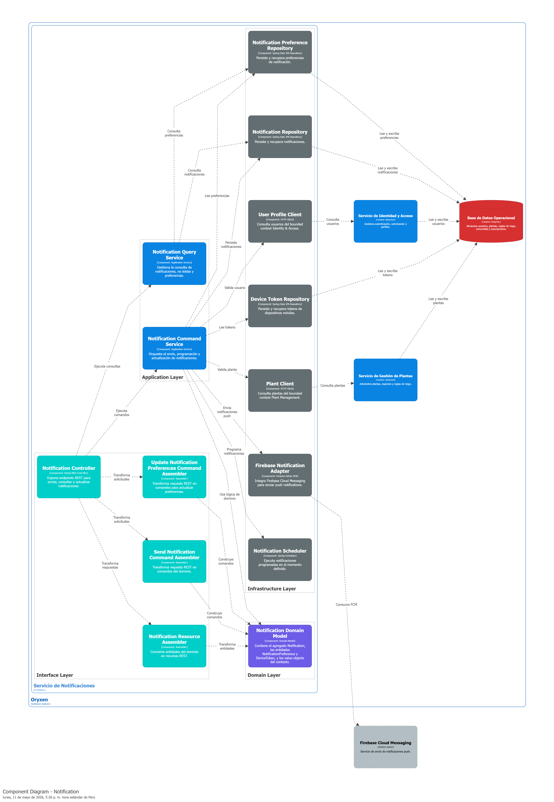


**Relaciones entre componentes:**

- `Notification REST API Component → Notification Transformation Component`
- `Notification REST API Component → Notification Command Processing Component`
- `Notification REST API Component → Notification Query Processing Component`
- `Notification Command Processing Component → External Notification Integration Component`
- `Notification Command Processing Component → Notification Domain Component`
- `Notification Command Processing Component → Notification Persistence Component`
- `Notification Query Processing Component → Notification Persistence Component`


### 5.6.6. Bounded Context Software Architecture Code Level Diagrams

En esta sección se presentan los diagramas a nivel de código del bounded context `Notification`, permitiendo visualizar el detalle del dominio y la persistencia del contexto.

### 5.6.6.1. Bounded Context Domain Layer Class Diagrams

El diagrama UML del Domain Layer del bounded context `Notification` muestra el aggregate principal `Notification`, encargado de representar alertas y recordatorios generados por el sistema.

Además, se incluyen:

- `NotificationPreference`
- `DeviceToken`
- `NotificationType`
- `NotificationChannel`
- `NotificationStatus`
- Commands y Queries
- Servicios del dominio


**Diagrama UML de Clases (Domain Layer):**

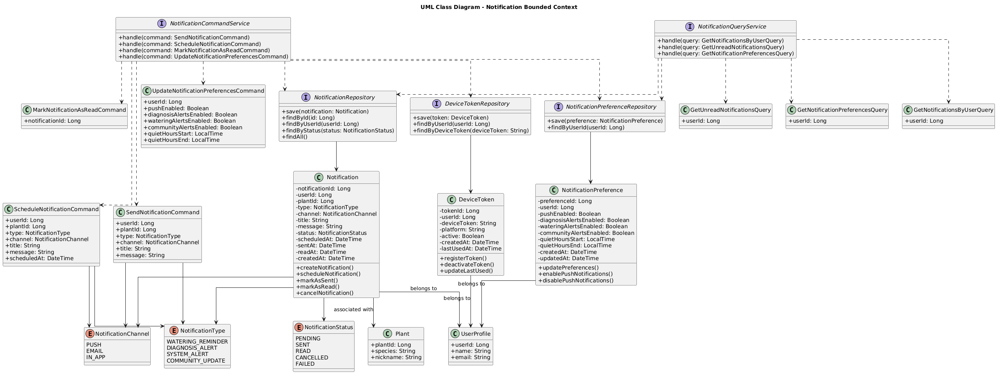


**Relaciones:**

- `Notification` es el Aggregate Root del contexto.
- `Notification` pertenece a un solo usuario.
- `Notification` puede estar asociada a una planta.
- `NotificationPreference` pertenece a un solo usuario.
- `DeviceToken` pertenece a un solo usuario.
- `NotificationCommandService` utiliza `NotificationRepository`, `NotificationPreferenceRepository` y `DeviceTokenRepository`.
- `NotificationQueryService` utiliza `NotificationRepository` y `NotificationPreferenceRepository`.


### 5.6.6.2. Bounded Context Database Design Diagram

El diagrama de base de datos del bounded context `Notification` representa la estructura relacional utilizada para almacenar notificaciones, preferencias y tokens de dispositivos.

**Diagrama de base de datos (ERD):**

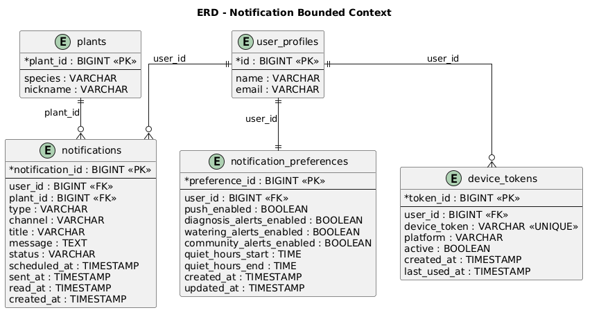


**Tabla principal: `notifications`**

**Atributos:**

- `notification_id`
- `user_id`
- `plant_id`
- `type`
- `channel`
- `title`
- `message`
- `status`
- `scheduled_at`
- `sent_at`
- `read_at`
- `created_at`

**Constraints:**

- PRIMARY KEY (`notification_id`)
- FOREIGN KEY (`user_id`) → `user_profiles(id)`
- FOREIGN KEY (`plant_id`) → `plants(plant_id)`
<br>


**Tabla relacionada: `notification_preferences`**

**Atributos:**

- `preference_id`
- `user_id`
- `push_enabled`
- `diagnosis_alerts_enabled`
- `watering_alerts_enabled`
- `community_alerts_enabled`
- `quiet_hours_start`
- `quiet_hours_end`
- `created_at`
- `updated_at`

**Constraints:**

- PRIMARY KEY (`preference_id`)
- FOREIGN KEY (`user_id`) → `user_profiles(id)`
- UNIQUE (`user_id`)


**Tabla relacionada: `device_tokens`**

**Atributos:**

- `token_id`
- `user_id`
- `device_token`
- `platform`
- `active`
- `created_at`
- `last_used_at`


**Constraints:**

- PRIMARY KEY (`token_id`)
- FOREIGN KEY (`user_id`) → `user_profiles(id)`
- UNIQUE (`device_token`)


**Relaciones entre tablas:**

- `user_profiles (1) ──── (*) notifications`
- `plants (1) ──── (*) notifications`
- `user_profiles (1) ──── (1) notification_preferences`
- `user_profiles (1) ──── (*) device_tokens`

---
## 5.7. Bounded Context: Billing and Subscription

El bounded context de **Billing and Subscription** representa el núcleo encargado de la gestión de suscripciones, planes y procesos de facturación dentro de la plataforma. Este contexto permite administrar el ciclo de vida de las suscripciones de los clientes, el control de planes disponibles y la gestión de cuentas de facturación, garantizando consistencia financiera y automatización de procesos de cobro.

### 5.7.1. Domain Layer

La capa de dominio del bounded context **Billing and Subscription** contiene las clases responsables de modelar el comportamiento relacionado con suscripciones, cuentas de facturación y planes comerciales.

**a. Entity / Aggregate Root:**

**Nombre de la clase:** `Subscription`

**Paquete:** `com.upc.billing.domain.model.aggregates`

**Propósito:** Representa la suscripción activa de un cliente a un plan específico. Constituye el Aggregate Root del bounded context Billing and Subscription.

**Atributos:**

- `id: UUID` → Identificador único de la suscripción.
- `customerId: UUID` → Identificador del cliente propietario de la suscripción.
- `planId: UUID` → Identificador del plan contratado.
- `status: SubscriptionStatus` → Estado actual de la suscripción.
- `startDate: DateTime` → Fecha de inicio de la suscripción.
- `endDate: DateTime` → Fecha de finalización de la suscripción.
- `nextBillingDate: DateTime` → Próxima fecha de facturación.
- `trialEndDate: DateTime` → Fecha de finalización del periodo de prueba.

**Métodos:**

- `activate()` → Activa la suscripción.
- `cancel(effectiveDate)` → Cancela la suscripción.
- `changePlan(newPlanId, changeDate)` → Cambia el plan contratado.
- `isActive()` → Verifica si la suscripción se encuentra activa.
- `suspend(reason)` → Suspende temporalmente la suscripción.

**Relaciones:**

- Una `Subscription` pertenece a un único cliente.
- Un cliente puede poseer múltiples suscripciones históricas.
- Una `Subscription` se encuentra asociada a un único `Plan`.


**b. Entities del dominio:**

`CustomerBillingAccount`

**Propósito:** Representa la cuenta de facturación asociada a un cliente.

**Atributos:**

- `id: UUID`
- `customerId: UUID`
- `balance: float`
- `createdAt: DateTime`
- `updatedAt: DateTime`

**Métodos:**

- `getBalance()` → Retorna el balance actual.


`Plan`

**Propósito:** Representa un plan comercial disponible para contratación.

**Atributos:**

- `id: UUID`
- `name: String`
- `description: String`
- `price: float`
- `features: List<String>`
- `isActive: boolean`

**Métodos:**

- `activate()` → Activa el plan.
- `deactivate()` → Desactiva el plan.


**c. Value Objects:**

`BillingPeriod`

Representa un intervalo de facturación asociado a una suscripción.

**Atributos:**

- `start: DateTime`
- `end: DateTime`

**Métodos:**

- `contains(date)` → Verifica si una fecha pertenece al periodo.
- `overlapsWith(other)` → Verifica superposición de periodos.
- `days()` → Retorna la cantidad de días del periodo.


`SubscriptionStatus`

Representa el estado de una suscripción.

**Valores posibles:**

- `PENDING`
- `ACTIVE`
- `SUSPENDED`
- `CANCELLED`
- `EXPIRED`


**d. Commands del dominio:**

`CreateSubscriptionCommand`

**Paquete:** `com.upc.billing.domain.model.commands`

**Propósito:** Representa la intención de crear una nueva suscripción.

**Atributos:**

- `customerId: UUID`
- `planId: UUID`


`ChangePlanCommand`

**Propósito:** Cambiar el plan asociado a una suscripción.

**Atributos:**

- `subscriptionId: UUID`
- `newPlanId: UUID`


`CancelSubscriptionCommand`

**Propósito:** Cancelar una suscripción activa.

**Atributos:**

- `subscriptionId: UUID`
- `effectiveDate: DateTime`


`ActivateSubscriptionCommand`

**Propósito:** Activar una suscripción.

**Atributos:**

- `subscriptionId: UUID`


`SuspendSubscriptionCommand`

**Propósito:** Suspender temporalmente una suscripción.

**Atributos:**

- `subscriptionId: UUID`
- `reason: String`


`CreatePlanCommand`

**Propósito:** Registrar un nuevo plan.

**Atributos:**

- `name: String`
- `description: String`
- `price: float`


**e. Queries del dominio:**

`GetSubscriptionQuery`

**Propósito:** Obtener información de una suscripción.

**Atributos:**

- `subscriptionId: UUID`


`ListSubscriptionsQuery`

**Propósito:** Obtener suscripciones asociadas a un cliente.

**Atributos:**

- `customerId: UUID`


`GetCustomerBillingAccountQuery`

**Propósito:** Obtener la cuenta de facturación de un cliente.

**Atributos:**

- `customerId: UUID`


`GetCustomerBalanceQuery`

**Propósito:** Obtener balance actual del cliente.

**Atributos:**

- `customerId: UUID`


`GetPlanQuery`

**Propósito:** Obtener información de un plan.

**Atributos:**

- `planId: UUID`


`ListPlansQuery`

**Propósito:** Obtener lista de planes disponibles.


**f. Domain Services:**

`SubscriptionApplicationService`

**Paquete:** `com.upc.billing.domain.services`

**Propósito:** Coordinar operaciones relacionadas con suscripciones.

**Operaciones:**

- `handle(CreateSubscriptionCommand)`
- `handle(ChangePlanCommand)`
- `handle(CancelSubscriptionCommand)`
- `handle(ActivateSubscriptionCommand)`
- `handle(SuspendSubscriptionCommand)`
- `handle(GetSubscriptionQuery)`
- `handle(ListSubscriptionsQuery)`


`PlanApplicationService`

**Propósito:** Gestionar operaciones relacionadas con planes.

**Operaciones:**

- `handle(CreatePlanCommand)`
- `handle(UpdatePlanCommand)`
- `handle(ActivatePlanCommand)`
- `handle(DeactivatePlanCommand)`
- `handle(ListPlansQuery)`
- `handle(GetPlanQuery)`


`CustomerBillingAccountApplicationService`

**Propósito:** Gestionar consultas relacionadas con cuentas de facturación.

**Operaciones:**

- `handle(GetCustomerBillingAccountQuery)`
- `handle(GetCustomerBalanceQuery)`


**g. Repositories:**

`SubscriptionRepository`

**Paquete:** `com.upc.billing.infrastructure.persistence.repositories`

**Propósito:** Gestionar persistencia de suscripciones.

**Operaciones:**

- `save(Subscription)`
- `findById(UUID)`
- `findActiveByCustomer(UUID)`


`CustomerBillingAccountRepository`

**Propósito:** Gestionar persistencia de cuentas de facturación.

**Operaciones:**

- `findByCustomerId(UUID)`
- `updateBalance()`


`PlanRepository`

**Propósito:** Gestionar persistencia de planes.

**Operaciones:**

- `save(Plan)`
- `findById(UUID)`
- `findActive()`
- `list()`


### 5.7.2. Interface Layer

La Interface Layer del bounded context **Billing and Subscription** contiene los controladores REST responsables de exponer funcionalidades relacionadas con suscripciones, cuentas de facturación y planes comerciales.

**a. SubscriptionController**

**Paquete:** `com.upc.billing.interfaces.rest`

**Propósito:** Exponer endpoints relacionados con la gestión de suscripciones.

**Dependencias:**

- `SubscriptionApplicationService`

**Endpoints expuestos:**

- `POST /api/v1/subscriptions`
- `GET /api/v1/subscriptions/{subscriptionId}`
- `GET /api/v1/customers/{customerId}/subscriptions`
- `PUT /api/v1/subscriptions/{subscriptionId}/change-plan`
- `PUT /api/v1/subscriptions/{subscriptionId}/cancel`
- `POST /api/v1/subscriptions/{subscriptionId}/activate`
- `POST /api/v1/subscriptions/{subscriptionId}/suspend`
- `GET /api/v1/subscriptions/{subscriptionId}/status`


**b. CustomerBillingAccountController**

**Propósito:** Exponer operaciones relacionadas con facturación del cliente.

**Endpoints expuestos:**

- `GET /api/v1/customers/{customerId}/billing-account`
- `GET /api/v1/customers/{customerId}/billing-account/balance`


**c. PlanController**

**Propósito:** Gestionar endpoints relacionados con planes.

**Endpoints expuestos:**

- `GET /api/v1/plans`
- `GET /api/v1/plans/{planId}`
- `POST /api/v1/plans`
- `PUT /api/v1/plans/{planId}`
- `POST /api/v1/plans/{planId}/activate`
- `POST /api/v1/plans/{planId}/deactivate`


**d. Resources / DTOs:**

`SubscriptionResource`

**Propósito:** Representar información de suscripciones enviada al frontend.

**Atributos:**

- `id`
- `customerId`
- `planId`
- `status`
- `startDate`
- `nextBillingDate`


`PlanResource`

**Propósito:** Representar información de planes comerciales.

**Atributos:**

- `id`
- `name`
- `description`
- `price`
- `features`
- `isActive`


`CustomerBillingAccountResource`

**Propósito:** Representar información financiera del cliente.

**Atributos:**

- `id`
- `customerId`
- `balance`


**e. Assemblers:**

`SubscriptionResourceFromEntityAssembler`

**Propósito:** Transformar entidades `Subscription` en recursos REST.


`SubscriptionCommandFromResourceAssembler`

**Propósito:** Transformar requests REST en commands del dominio.


`PlanResourceFromEntityAssembler`

**Propósito:** Transformar entidades `Plan` en recursos consumibles.


### 5.7.3. Application Layer

La Application Layer del bounded context **Billing and Subscription** coordina procesos relacionados con suscripciones, planes y facturación.

**Capacidades principales del contexto:**

- Crear suscripciones.
- Cancelar y suspender suscripciones.
- Gestionar cambios de plan.
- Consultar balances y cuentas de facturación.
- Administrar planes comerciales.


**a. Command Handlers / Command Services:**

`SubscriptionApplicationService`

**Paquete:** `com.upc.billing.application.internal.commandservices`

**Dependencias:**

- `SubscriptionRepository`
- `PlanRepository`
- `CustomerBillingAccountRepository`

**Operaciones que maneja:**

`handle(CreateSubscriptionCommand command)`

- Valida existencia del cliente.
- Verifica disponibilidad del plan.
- Genera nueva suscripción.
- Persiste la suscripción.

`handle(ChangePlanCommand command)`

- Obtiene suscripción activa.
- Valida nuevo plan.
- Calcula ajustes de facturación.
- Actualiza suscripción.

`handle(CancelSubscriptionCommand command)`

- Cancela suscripción.
- Actualiza estado.
- Registra fecha efectiva.


`PlanApplicationService`

**Dependencias:**

- `PlanRepository`

**Operaciones que maneja:**

- `handle(CreatePlanCommand)`
- `handle(UpdatePlanCommand)`
- `handle(ActivatePlanCommand)`
- `handle(DeactivatePlanCommand)`


**b. Query Handlers / Query Services:**

`CustomerBillingAccountApplicationService`

**Propósito:** Gestionar consultas relacionadas con facturación.

**Dependencias:**

- `CustomerBillingAccountRepository`

**Operaciones:**

- `handle(GetCustomerBillingAccountQuery)`
- `handle(GetCustomerBalanceQuery)`


`SubscriptionQueryService`

**Propósito:** Gestionar consultas relacionadas con suscripciones.

**Dependencias:**

- `SubscriptionRepository`

**Operaciones:**

- `handle(GetSubscriptionQuery)`
- `handle(ListSubscriptionsQuery)`


**c. Event Handlers:**

`SubscriptionEventHandlers`

**Propósito:** Gestionar eventos relacionados con suscripciones.

**Eventos manejados:**

- `SubscriptionCancelledEvent`
- `SubscriptionActivatedEvent`


**d. Flujos principales del negocio:**

**Flujo de creación de suscripción:**

- El frontend solicita una nueva suscripción.
- Se construye `CreateSubscriptionCommand`.
- Se valida el cliente y el plan.
- Se crea la entidad `Subscription`.
- Se persiste la información.
- Se retorna el resultado al cliente.


**Flujo de cambio de plan:**

- El usuario solicita cambiar de plan.
- Se ejecuta `ChangePlanCommand`.
- Se validan reglas de facturación.
- Se actualiza la suscripción.
- Se recalculan fechas de cobro.


**Flujo de consulta de balance:**

- El frontend solicita balance del cliente.
- Se ejecuta `GetCustomerBalanceQuery`.
- Se obtiene información desde `CustomerBillingAccountRepository`.
- Se transforma la respuesta a recurso REST.
- Se retorna el balance al cliente.


### 5.7.4. Infrastructure Layer

La Infrastructure Layer del bounded context `Billing and Subscription` contiene los componentes responsables de persistencia y gestión de datos relacionados con suscripciones y facturación.

**a. Repositorios de persistencia:**

`SubscriptionRepositoryImpl`

**Paquete:** `com.upc.billing.infrastructure.persistence.jpa.repositories`

**Propósito:** Implementar persistencia de `Subscription`.

**Interfaz implementada:**

- `SubscriptionRepository`


`CustomerBillingAccountRepositoryImpl`

**Propósito:** Persistir y consultar cuentas de facturación.

**Interfaz implementada:**

- `CustomerBillingAccountRepository`


`PlanRepositoryImpl`

**Propósito:** Persistir y consultar planes comerciales.

**Interfaz implementada:**

- `PlanRepository`


**b. Persistencia de entidades:**

Las entidades del contexto están mapeadas mediante tecnologías ORM.

**Entidades persistidas:**

- `Subscription`
- `CustomerBillingAccount`
- `Plan`


**c. Diseño de persistencia:**

**Tabla principal:** `subscriptions`

**Columnas:**

- `id`
- `customer_id`
- `plan_id`
- `status`
- `start_date`
- `end_date`
- `next_billing_date`
- `trial_end_date`

**Restricciones:**

- `id` → Primary Key
- `customer_id` → Foreign Key
- `plan_id` → Foreign Key

**Campos obligatorios:**

- `customer_id`
- `plan_id`
- `status`
- `start_date`


**Tabla relacionada:** `customer_billing_accounts`

**Columnas:**

- `id`
- `customer_id`
- `balance`
- `created_at`
- `updated_at`


**Tabla relacionada:** `plans`

**Columnas:**

- `id`
- `name`
- `description`
- `price`
- `is_active`


**d. Integración con otros bounded contexts:**

La infraestructura del contexto Billing and Subscription depende de:

- `Identity and Access Management`
- `Payment Gateway`
- `Notification Service`
- Servicios de facturación externa


### 5.7.5. Bounded Context Software Architecture Component Level Diagrams

El Component Diagram del bounded context `Billing and Subscription` representa la descomposición del backend encargado de suscripciones y facturación.

**Componentes principales:**

**Billing REST API Component:**

Expone endpoints REST relacionados con suscripciones y planes.

**Responsabilidades:**

- Gestionar suscripciones.
- Gestionar cuentas de facturación.
- Gestionar planes.


**Billing Transformation Component:**

Encargado de transformar DTOs, commands y entidades.

**Incluye:**

- `SubscriptionResource`
- `PlanResource`
- Assemblers


**Billing Command Processing Component:**

Implementado por `SubscriptionApplicationService` y `PlanApplicationService`.

**Responsabilidades:**

- Procesar suscripciones.
- Gestionar cambios de plan.
- Procesar cancelaciones.
- Administrar planes.


**Billing Query Processing Component:**

Implementado por Query Services.

**Responsabilidades:**

- Consultar balances.
- Consultar suscripciones.
- Consultar planes.


**Billing Domain Component:**

Representa el núcleo del dominio.

### Incluye:

- `Subscription`
- `CustomerBillingAccount`
- `Plan`
- `BillingPeriod`
- `SubscriptionStatus`


**Billing Persistence Component:**

Gestiona persistencia mediante repositorios ORM.


**External Billing Integration Component:**

Representa integración con servicios externos.

**Incluye:**

- `Payment Gateway`
- `Notification Service`
- Facturación externa


**Diagrama de Componentes:**


**Relaciones entre componentes:**

- `Billing REST API Component → Billing Transformation Component`
- `Billing REST API Component → Billing Command Processing Component`
- `Billing REST API Component → Billing Query Processing Component`
- `Billing Command Processing Component → Billing Domain Component`
- `Billing Command Processing Component → Billing Persistence Component`
- `Billing Command Processing Component → External Billing Integration Component`
- `Billing Query Processing Component → Billing Persistence Component`


### 5.7.6. Bounded Context Software Architecture Code Level Diagrams

En esta sección se presentan los diagramas a nivel de código del bounded context `Billing and Subscription`, permitiendo visualizar la estructura del dominio, persistencia y relaciones entre suscripciones, cuentas y planes.


#### 5.7.6.1. Bounded Context Domain Layer Class Diagrams

El diagrama UML del Domain Layer del bounded context `Billing and Subscription` muestra al agregado principal `Subscription`, encargado de representar la gestión de suscripciones dentro del sistema.

Además, se incluyen:

- `CustomerBillingAccount`
- `Plan`
- `BillingPeriod`
- Commands y Queries.
- Servicios del dominio.


**Diagrama UML de Clases (Domain Layer):**


**Relaciones:**

- `Subscription` es el Aggregate Root del contexto.
- `Subscription` pertenece a un cliente.
- `Subscription` referencia un `Plan`.
- `CustomerBillingAccount` administra balances del cliente.
- `PlanApplicationService` utiliza `PlanRepository`.
- `SubscriptionApplicationService` utiliza `SubscriptionRepository`.


#### 5.7.6.2. Bounded Context Database Design Diagram

El diagrama de base de datos del bounded context `Billing and Subscription` representa la estructura relacional utilizada para almacenar suscripciones, cuentas de facturación y planes comerciales.

**Diagrama de base de datos (ERD):**


**Tabla principal:** `subscriptions`

**Atributos:**

- `id`
- `customer_id`
- `plan_id`
- `status`
- `start_date`
- `end_date`
- `next_billing_date`
- `trial_end_date`

**Constraints:**

- PRIMARY KEY (`id`)
- FOREIGN KEY (`customer_id`)
- FOREIGN KEY (`plan_id`)

**Tabla relacionada:** `customer_billing_accounts`

**Atributos:**

- `id`
- `customer_id`
- `balance`
- `created_at`
- `updated_at`

**Constraints:**

- PRIMARY KEY (`id`)
- FOREIGN KEY (`customer_id`)


**Tabla relacionada:** `plans`

**Atributos:**

- `id`
- `name`
- `description`
- `price`
- `is_active`

**Constraints:**

- PRIMARY KEY (`id`)


**Relaciones entre tablas:**

- `customers (1) ──── (*) subscriptions`
- `plans (1) ──── (*) subscriptions`
- `customers (1) ──── (1) customer_billing_accounts`


## 5.8. Bounded Context: Community

El bounded context de **Community** representa el espacio social y colaborativo de la plataforma Oryxen. Este contexto permite a los usuarios compartir el progreso de sus plantas, intercambiar consejos, interactuar mediante comentarios y acceder a un *feed* personalizado. Además, incorpora reglas críticas de negocio y privacidad, como la moderación de contenido y la sanitización automática de metadatos (EXIF/GPS) en las fotografías para proteger la seguridad de los usuarios.

### 5.8.1. Domain Layer

La capa de dominio del bounded context **Community** contiene las clases que modelan el comportamiento central de la interacción social, garantizando las reglas de publicación, límites de interacción y estados de moderación.

**a. Entity / Aggregate Root:**

**Nombre de la clase:** `CommunityPost`
**Paquete:** `com.upc.oryxen.community.domain.model.aggregates`

**Propósito:** Representa una publicación realizada por un usuario en el foro o *feed* comunitario. Constituye el Aggregate Root del bounded context, encapsulando el contenido, las imágenes y su estado de moderación.

**Atributos:**
*   `postId: Long` → Identificador único de la publicación.
*   `authorId: Long` → Identificador del usuario creador.
*   `plantId: Long?` → (Opcional) Identificador de la planta etiquetada.
*   `content: String` → Texto del consejo o actualización.
*   `imageUrl: String?` → URL de la fotografía compartida (previamente sanitizada).
*   `status: PostStatus` → Estado de la publicación (Activa, Moderada).
*   `createdAt: DateTime` → Fecha de la publicación.
*   `updatedAt: DateTime` → Última modificación.

**Métodos:**
*   `updateContent(newContent)` → Modifica el texto de la publicación validando políticas.
*   `markAsModerated()` → Cambia el estado de la publicación si infringe las normas.
*   `archive()` → Oculta la publicación lógicamente.

**Relaciones:**
*   Un `CommunityPost` tiene múltiples `Comment`.
*   Un `CommunityPost` puede tener múltiples `Reaction`.

**b. Entities del dominio:**

**Nombre de la clase:** `Comment`
**Propósito:** Representa las respuestas que los usuarios dejan en una publicación principal. Según las reglas de negocio, su contenido no puede exceder los 300 caracteres ni contener enlaces externos no permitidos.

**c. Value Objects:**

**Nombre de la clase:** `PostStatus`
**Propósito:** Representa el estado de moderación y visibilidad de una publicación en la comunidad.
**Valores posibles:**
*   `ACTIVE`
*   `REPORTED`
*   `MODERATED`
*   `ARCHIVED`

**Nombre de la clase:** `ReactionType`
**Propósito:** Define el tipo de interacción de un usuario frente a un post.
**Valores posibles:**
*   `LIKE`
*   `HELPFUL`

**d. Referencias externas del dominio:**

*   **UserAccount** (Origen: Auth & Identity): Representa al autor de la publicación o comentario.
*   **PlantProfile** (Origen: Plant Management): Representa la especie etiquetada en la publicación para nutrir el algoritmo del feed personalizado.

**e. Commands del dominio:**

**Paquete:** `com.upc.oryxen.community.domain.model.commands`
*   `CreatePostCommand`: Representa la intención de crear una nueva publicación (gatilla la sanitización de imagen).
*   `AddCommentCommand`: Representa la intención de comentar en una publicación.
*   `AddReactionCommand`: Representa la intención de reaccionar a un post.
*   `ModeratePostCommand`: Representa la intención de un administrador de restringir contenido reportado.

**f. Queries del dominio:**

*   `GetPersonalizedFeedQuery`: Obtener publicaciones relevantes basadas en el inventario de plantas del usuario activo.
*   `GetPostByIdQuery`: Obtener el detalle de un post y sus comentarios anidados.

**g. Domain Services:**

*   `CommunityInteractionService`: Valida las operaciones de interacción social (ej. validación de límites de caracteres, filtro de palabras prohibidas).

**h. Repository:**

*   `IPostRepository`: Interfaz para gestionar la persistencia y ciclo de vida de las publicaciones.
*   `ICommentRepository`: Interfaz para persistir los comentarios asociados.

### 5.8.2. Interface Layer

La Interface Layer expone las capacidades sociales a través de endpoints REST que el frontend (Web y Móvil) utilizará para construir el *feed* y gestionar las interacciones.

**a. CommunityController**

**Paquete:** `com.upc.oryxen.community.interfaces.rest`
**Propósito:** Exponer los endpoints para gestionar el flujo de la comunidad y moderación.

**Dependencias:**
*   `CommunityCommandService`
*   `CommunityQueryService`

**Endpoints expuestos:**
*   `GET /api/v1/community/feed` → Obtiene el *feed* personalizado.
*   `POST /api/v1/community/posts` → Crear una nueva publicación (recibe payload e imagen).
*   `GET /api/v1/community/posts/{postId}` → Ver detalles de un post.
*   `POST /api/v1/community/posts/{postId}/comments` → Agregar un comentario.
*   `PUT /api/v1/community/moderation/{postId}` → Endpoint de moderación para administradores.

**b. Resources / DTOs:**

*   `PostResource`: Representa la estructura de la publicación enviada al cliente.
*   `CreatePostResource`: Payload requerido para compartir una experiencia.
*   `CommentResource`: Datos estructurados de los comentarios.

**c. Assemblers:**

*   `PostResourceFromEntityAssembler`: Transforma la entidad `CommunityPost` en un recurso REST.
*   `CreatePostCommandFromResourceAssembler`: Mapea el request del cliente al comando de dominio.

### 5.8.3. Application Layer

Esta capa orquesta los casos de uso para la interacción social, garantizando las validaciones de privacidad correspondientes antes de interactuar con el dominio.

**a. Command Handlers / Command Services:**

`CommunityCommandServiceImpl` maneja:
*   `handle(CreatePostCommand)`: Coordina la llamada al servicio de infraestructura para limpiar los metadatos de la imagen (EXIF/GPS), crea la entidad `CommunityPost` y la persiste.
*   `handle(AddCommentCommand)`: Utiliza `CommunityInteractionService` para validar que el texto sea menor a 300 caracteres y sin enlaces, luego guarda el `Comment`.
*   `handle(ModeratePostCommand)`: Evalúa un reporte y cambia el `PostStatus` a `MODERATED`.

**b. Query Handlers / Query Services:**

`CommunityQueryServiceImpl` maneja:
*   `handle(GetPersonalizedFeedQuery)`: Cruza la información del usuario autenticado con las etiquetas de plantas para devolver publicaciones priorizadas.

**c. Flujos principales del negocio:**

**Flujo de publicación segura (con sanitización):**
*   El usuario envía texto y una fotografía desde el frontend.
*   Se construye `CreatePostCommand`.
*   `CommunityCommandServiceImpl` intercepta la imagen y llama al servicio externo de sanitización para eliminar coordenadas GPS (garantizando la privacidad).
*   Una vez limpia, la imagen se sube al Cloud Storage y se genera una URL segura.
*   Se crea la entidad `CommunityPost` con la URL segura.
*   Se persiste mediante `IPostRepository` y se retorna el recurso publicado al feed.

### 5.8.4. Infrastructure Layer

Maneja la persistencia en la base de datos relacional y las integraciones críticas con servicios de procesamiento de archivos para garantizar la privacidad.

**a. Repositorios de persistencia:**
*   `PostRepositoryImpl`: Implementa la persistencia de las publicaciones.
*   `CommentRepositoryImpl`: Implementa la persistencia de los comentarios.

**b. ORM Context:**
*   `CommunityDbContext`: Punto central de acceso a la base de datos de la comunidad mediante Entity Framework Core / Spring Data JPA.

**c. Persistencia de entidades:**
**Entidades persistidas:**
*   `CommunityPost`
*   `Comment`

**d. Diseño de persistencia:**

**Tabla principal:** `community_posts`
**Columnas:**
*   `post_id` (PK)
*   `author_id` (FK hacia Auth & Identity)
*   `plant_id` (FK hacia Plant Management, Nullable)
*   `content` (TEXT)
*   `image_url` (VARCHAR)
*   `status` (VARCHAR)
*   `created_at` (TIMESTAMP)

**Tabla relacionada:** `comments`
**Columnas:**
*   `comment_id` (PK)
*   `post_id` (FK hacia `community_posts`)
*   `author_id` (FK)
*   `content` (VARCHAR 300)
*   `created_at` (TIMESTAMP)

**e. Integración con otros bounded contexts y servicios:**
*   **Privacy & Sanitization Service:** Servicio de infraestructura que procesa el archivo binario de la foto para eliminar datos EXIF antes de subirlo al Cloud Storage.
*   **Auth & Identity:** Para validar el perfil del autor y su reputación.
*   **Plant Management:** Para cruzar los intereses del usuario y alimentar el algoritmo del *feed*.

### 5.8.5. Bounded Context Software Architecture Component Level Diagrams

El Component Diagram del bounded context Community representa la descomposición del contenedor backend encargado de gestionar la red social interna de Oryxen y el procesamiento seguro de sus recursos visuales.

**Componentes principales:**

*   **Community REST API Component**: Expone endpoints REST para feed, posts y comentarios mediante `CommunityController`.
*   **Community Transformation Component**: Encargado de transformar datos entre DTOs y comandos mediante *Assemblers*.
*   **Community Command Processing Component**: Implementado por `CommunityCommandServiceImpl`. Orquesta la creación de posts y delega el filtrado de imágenes.
*   **Community Query Processing Component**: Implementado por `CommunityQueryServiceImpl`. Genera el feed.
*   **Sanitization Service Component (Infrastructure):** Encargado de procesar y limpiar metadatos de imágenes.
*   **Community Domain Component**: Representa el núcleo del dominio, albergando el agregado `CommunityPost` y la entidad `Comment`.
*   **Community Persistence Component**: Gestiona la persistencia en base de datos mediante repositorios ORM.

**Relaciones entre componentes:**
*   `Community REST API` → `Community Transformation Component`
*   `Community REST API` → `Community Command Processing Component`
*   `Community Command Processing Component` → `Sanitization Service Component`
*   `Community Command Processing Component` → `Community Domain Component`
*   `Community Command Processing Component` → `Community Persistence Component`

**Diagrama de Componentes:**

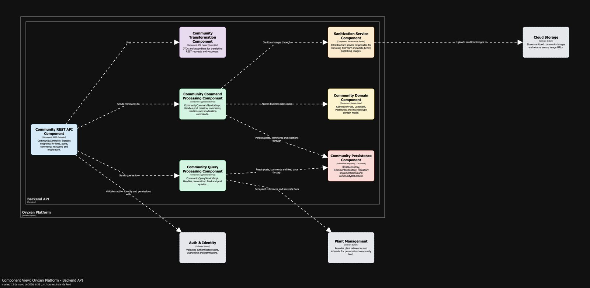

### 5.8.6. Bounded Context Software Architecture Code Level Diagrams

En esta sección se presentan los diagramas a nivel de código del bounded context Community, visualizando el detalle del dominio social y la persistencia de las interacciones.

**5.8.6.1. Bounded Context Domain Layer Class Diagrams**

El diagrama UML del Domain Layer muestra al agregado principal `CommunityPost`, vinculando sus comentarios, tipos de reacciones, estados de moderación y servicios de interacción.

**Relaciones:**
*   `CommunityPost` es el Aggregate Root del contexto.
*   `CommunityPost` tiene una relación de uno a muchos (*1..**) hacia la entidad `Comment`.
*   `PostStatus` (Value Object) representa la viabilidad del post (Activo, Moderado).
*   `CommunityCommandService` interactúa con `IPostRepository` e `ICommentRepository`.

**Diagrama UML de Clases (Domain Layer):**

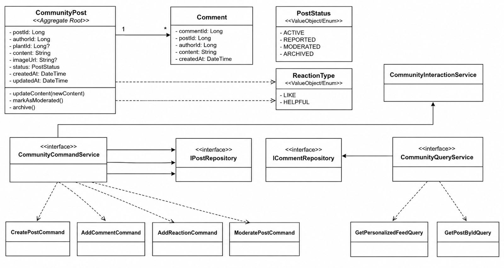

**5.8.6.2. Bounded Context Database Design Diagram**

El diagrama de base de datos representa la estructura relacional (ERD) utilizada para almacenar el historial de publicaciones y las interacciones de los usuarios.

**Relaciones entre tablas:**
*   `user_profiles (1)` ──── `(*) community_posts`
*   `community_posts (1)` ──── `(*) comments`
*   `plants (1)` ──── `(*) community_posts` (Relación opcional si la publicación etiqueta una especie).

**Diagrama de base de datos (ERD):**
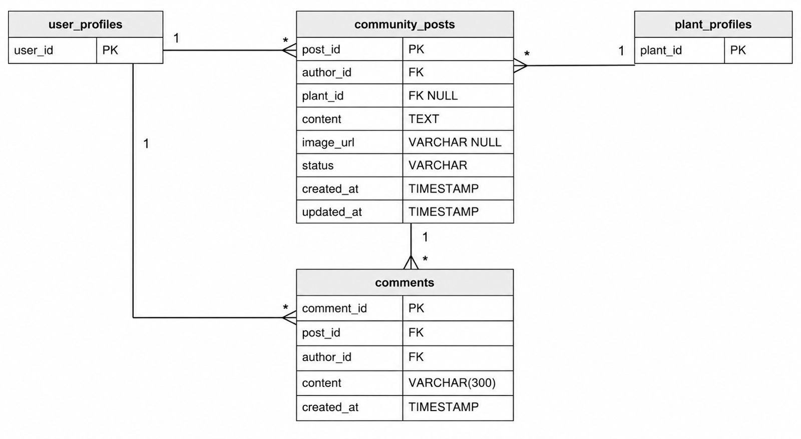
---

# Capítulo VI: Solution UX Design

## 6.1. Style Guidelines

En esta sección se presentan los estilos establecidos, con el fin de garantizar consistencia, claridad y una experiencia de usuario coherente en todas las plataformas y componentes desarrollados.

### 6.1.1. General Style Guidelines

**Branding:** <br> El branding de Oryxen está diseñado para transmitir bienestar, conexión con la naturaleza y compromiso con el cuidado responsable de las plantas. La identidad visual busca reflejar un enfoque accesible, amigable y moderno, orientado a personas que desean mejorar el mantenimiento de sus plantas. Se utilizan elementos gráficos que evocan crecimiento, frescura y equilibrio, creando una imagen visual clara, cercana y fácil de reconocer para usuarios interesados en el autocuidado verde y la sostenibilidad.

**Typography:** <br> La tipografía seleccionada es Raleway, una fuente moderna, estilizada y de alta legibilidad, que aporta un aspecto limpio y profesional a la interfaz. Se utilizará Raleway tanto para encabezados como para el cuerpo de texto, aprovechando su versatilidad en diferentes pesos tipográficos para marcar jerarquías visuales claras. Esta elección equilibra seriedad y cercanía, manteniendo una apariencia accesible y coherente con el enfoque natural y amigable de la aplicación Oryxen.


**Colors:** <br> La paleta de colores de Oryxen está compuesta por tonos verdes y cremas, cuidadosamente seleccionados para reflejar la esencia de la naturaleza y promover una experiencia visual tranquila y confiable. Los tonos verdes comunican frescura, crecimiento y sostenibilidad, valores clave en el cuidado de plantas. Por su parte, los tonos crema aportan calidez y naturalidad, generando una conexión visual con la tierra y el entorno orgánico. Estos colores se aplicarán estratégicamente en la interfaz para garantizar una experiencia armoniosa, accesible y agradable en todo tipo de dispositivos, especialmente móviles.

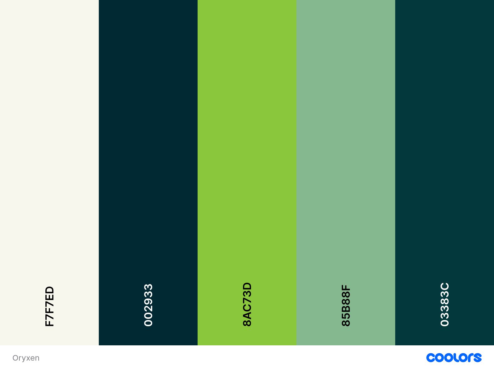

**Spacing:** <br> Se utilizó un espaciado apropiado en toda la interfaz para evitar la saturación de elementos, facilitando así una navegación clara y confortable. Los márgenes y las separaciones entre los distintos componentes se planificaron con detalle para lograr un diseño armónico y bien estructurado.

**Tono de Comunicación y Lenguaje Aplicado:** <br> El tono de comunicación de Oryxen será cercano, motivador y accesible, con el objetivo de acompañar al usuario en el cuidado de sus plantas de forma clara y positiva. El lenguaje aplicado se define como divertido, casual, respetuoso y entusiasta. Este enfoque busca generar una experiencia amigable, que inspire confianza y fomente una conexión genuina con la naturaleza a través del uso cotidiano de la aplicación.


### 6.1.2. Web, Mobile & Devices Style Guidelines

Para garantizar una experiencia de usuario (UX) consistente, intuitiva y fluida a través de todo el ecosistema de **Oryxen**, se han establecido lineamientos de estilo y comportamiento específicos para cada plataforma. Estas directrices aseguran que la transición desde la *Landing Page* hasta la aplicación móvil y la interacción física con el hardware (Sensor Lite) se perciba como un solo producto unificado, respetando las convenciones nativas de cada sistema operativo.

Además, alineados con los objetivos de internacionalización (i18n) y accesibilidad (a11y), todas las interfaces web y móviles tienen como idioma por defecto el inglés (`en_US`), con soporte completo para español latinoamericano (`es_419`), e integran atributos ARIA para garantizar que la plataforma sea inclusiva para todos los usuarios.

#### A. Web Style Guidelines (Landing Page & Web App)

Las interfaces web de Oryxen (tanto la página de aterrizaje comercial como el *Dashboard* de la aplicación web) están diseñadas bajo el paradigma **Mobile-First** y construidas utilizando **Vue 3** con la biblioteca de componentes **PrimeVue / Vuetify**, basándose estrictamente en las directrices de **Material Design**.

**1. Responsive Grid System:**
Se utiliza un sistema de cuadrícula fluida de 12 columnas que se adapta dinámicamente al *viewport* del usuario para garantizar la legibilidad de la información (como los gráficos del historial de telemetría y diagnósticos de IA):
*   **Desktop (≥ 1024px):** Layout expandido que aprovecha el espacio horizontal, mostrando el menú de navegación lateral fijo y paneles de métricas detallados.
*   **Tablet (768px - 1023px):** Los paneles de información se reorganizan en 2 columnas. El menú lateral se vuelve colapsable.
*   **Mobile (≤ 767px):** Las tarjetas de las plantas ocupan el 100% del ancho (1 columna). La navegación principal pasa a un *Bottom Navigation Bar* o un menú hamburguesa para no restar espacio al contenido.

**2. Interacción y Comportamiento Web:**
*   **Micro-interacciones:** Los botones *Call-to-Action* (CTAs), como la actualización a planes Premium o la vinculación de un nuevo sensor, cuentan con un estado *hover* (elevación de sombra y cambio de opacidad) que indica claramente su interactividad.
*   **Accesibilidad (a11y):** Los contrastes de color cumplen con la normativa WCAG 2.1 nivel AA. Todos los formularios web y botones iconográficos (ej. botón de "Regar ahora") cuentan con etiquetas `aria-label` y soporte para navegación exclusiva por teclado.

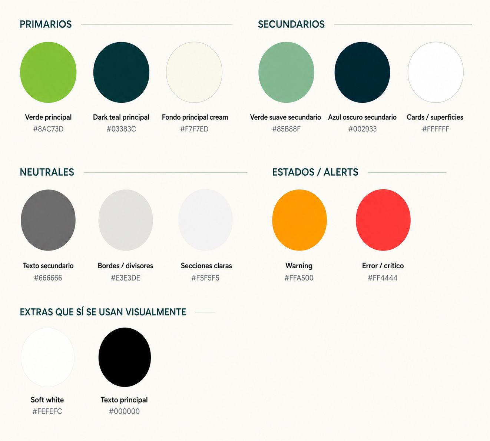

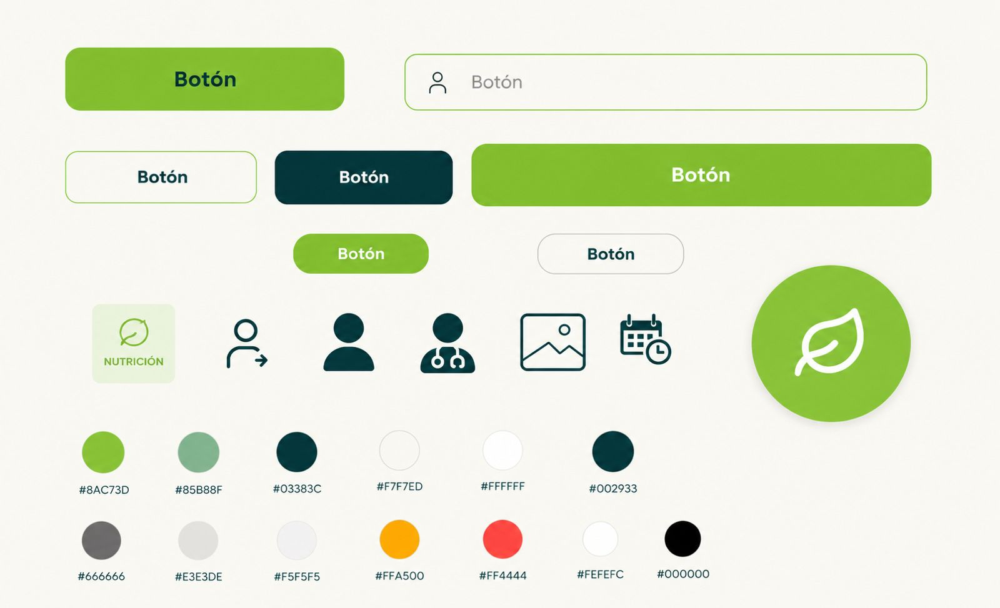
#### B. Mobile Style Guidelines (Native iOS & Android)

Dado que la aplicación móvil es el punto de contacto principal para los usuarios del plan básico gratuito y los aficionados, el rendimiento y la naturalidad son críticos. Siguiendo nuestras restricciones arquitectónicas, el desarrollo se realiza de forma **nativa** (Swift para iOS y Kotlin para Android), por lo que las interfaces respetan las guías oficiales de cada plataforma, unificadas por el *branding* de Oryxen.

**1. Android (Kotlin) - Material 3 Design:**
*   **Navegación:** Uso de un *Bottom Navigation Bar* para el acceso rápido a: *Dashboard* (Mis Plantas), Comunidad, Alertas IA y Ajustes. 
*   **Acciones Principales:** Se emplea un *Floating Action Button* (FAB) anclado en la esquina inferior derecha para la acción más importante: "Agregar Planta" (escaneo de código QR).
*   **Feedback Visual:** Implementación del efecto *Ripple* de Material Design al tocar elementos interactivos.

**2. iOS (Swift) - Human Interface Guidelines (HIG):**
*   **Navegación:** Uso del *Tab Bar* estándar de iOS con iconografía lineal o sólida (SF Symbols) según el estado activo. La navegación jerárquica utiliza el *Navigation Bar* nativo con el botón "Atrás" en la esquina superior izquierda.
*   **Gestos:** Soporte nativo para deslizar (*Swipe-to-go-back*) y menús contextuales en las tarjetas de las plantas (ej. deslizar a la izquierda sobre una planta en la lista para "Archivar" o "Editar").

**3. Ergonomía y Touch Targets (Común para móviles):**
Para garantizar que personas de la tercera edad u ocupadas interactúen sin frustración, el tamaño mínimo de cualquier botón o elemento interactivo es de **48x48 dp/pt**, con un margen de separación adecuado para evitar toques accidentales.


#### C. Devices (IoT Hardware) Style & Feedback Guidelines

Aunque el hardware físico (*Sensor Lite* y el módulo de riego) carece de pantallas digitales complejas, su experiencia de usuario debe estar perfectamente orquestada con la aplicación móvil. El diseño del hardware sigue un principio de "tecnología silenciosa", siendo minimalista para integrarse estéticamente en macetas de hogares y oficinas.

**1. Retroalimentación Visual (Indicadores LED):**
El hardware utiliza un patrón de comunicación semántico basado en un único indicador LED multicolor para informar su estado operativo sin depender del móvil:
*   **Azul (parpadeo lento):** Modo de emparejamiento (Bluetooth/WiFi activo), esperando escaneo de código QR desde la App.
*   **Verde (fijo por 3 seg):** Conexión exitosa al entorno de nube de Oryxen.
*   **Rojo (parpadeo rápido):** Error crítico (batería extremadamente baja o desconexión de red superior a 5 minutos).
*   **Apagado (por defecto):** Para ahorrar energía, el dispositivo no emite luz durante la operación normal de recolección de datos, dejando las alertas detalladas y predictivas al sistema de notificaciones *push* de la app.

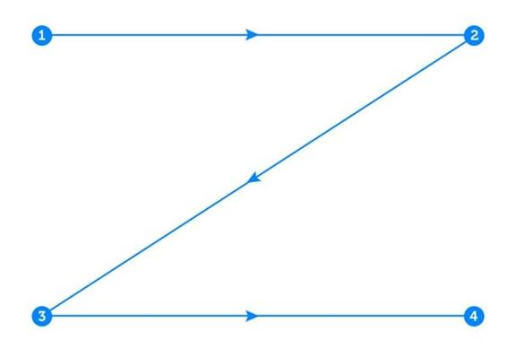


## 6.2. Information Architecture

En esta sección se presenta la arquitectura de la información de Oryxen, el cual es un elemento clave en el diseño y la facilidad de uso de un sistema digital, que garantize que el usuario, independientemente de su nivel de conocimiento técnico, comprenda y utilice el contenido de forma clara y eficaz.

### 6.2.1. Organization Systems

Los sistemas de organización en Oryxen estructuran la información y funcionalidades para que la navegación sea intuitiva, eficiente y centrada en el usuario. Se aplican los siguientes enfoques:

**Visual Organization Systems (Esquemas Visuales):**

- **Jerárquica (Visual Hierarchy):** Se aplica principalmente en el Dashboard central de la aplicación móvil. Donde se priorizan que los indicadores sean completamente visibles e identificables rápidamente por el usuario, a través de el uso de colores y tamaños de fuente destacados.

- **Secuencial (Step-by-step):** Se utiliza en la vinculación de dispositivos IoT, donde el usuario es guiado paso a paso para vincular estas herramientas a la red Wi-Fi y asignar una especie botánica específica, asegurando que la configuración técnica sea exitosa antes de permitir el acceso al monitoreo.

- **Matricial:** Se aplica en el panel de analíticas avanzadas de la plataforma Web, donde el usuario puede comparar variables (ej. Humedad, Crecimiento, Clima externo) para obtener una visión acerca del rendimiento de su jardín inteligente.

<br>

**Categorization Schemes (Esquemas de Categorización):**

- **Por Tópicos:** El contenido se agrupa en áreas funcionales claras como: Asistente IA, Comunidad, Configuración y Dispositivos, etc.

- **Cronológico:** Se presenta en la sección de Historial de Cuidado, donde se registran de forma temporal los riegos automáticos realizados, las alertas detectadas y las intervenciones del usuario, permitiendo auditar la evolución de la planta a lo largo del tiempo.

- **Según Audiencia:** La plataforma adapta funciones según el perfil del usuario como una visualización simplificada con consejos básicos de la IA para planes gratuitos; y acceso a dashboards técnicos detallados y configuraciones avanzadas de automatización para múltiples zonas de cultivo para planes con suscripción premium.

### 6.2.2. Labeling Systems

Los sistemas de etiquetado en **Oryxen** definen la forma en que se nombran las secciones, acciones, estados y mensajes dentro de la Landing Page, la Aplicación Web y la Aplicación Móvil. Su objetivo es utilizar términos claros, consistentes y comprensibles para que el usuario pueda reconocer rápidamente qué información está viendo y qué acciones puede realizar, incluso si no posee conocimientos técnicos sobre jardinería, IA o dispositivos IoT.

#### A. Navigation Labels

Las etiquetas de navegación agrupan las principales áreas funcionales del ecosistema Oryxen, facilitando el desplazamiento del usuario entre módulos.

- **Inicio:** Vista general del estado de las plantas registradas y accesos rápidos.
- **Mis Plantas:** Inventario personal de plantas vinculadas al usuario.
- **Asistente IA:** Espacio para consultas, diagnósticos y recomendaciones personalizadas.
- **Comunidad:** Sección de interacción entre usuarios, consejos y experiencias compartidas.
- **Dispositivos:** Gestión de sensores IoT, vinculación de hardware y estado de conexión.
- **Analíticas:** Visualización de métricas históricas, tendencias y reportes avanzados.
- **Perfil:** Configuración de cuenta, preferencias, notificaciones y suscripción.

#### B. Action Labels

Las etiquetas de acción se redactan con verbos directos para indicar de forma inmediata la tarea que ejecutará el sistema.

- **Agregar planta:** Permite registrar una nueva planta en el inventario.
- **Vincular sensor:** Inicia el flujo de conexión de un dispositivo IoT mediante QR o configuración manual.
- **Regar ahora:** Activa una acción de riego inmediata cuando el hardware lo permite.
- **Consultar IA:** Abre el asistente para recibir recomendaciones o diagnósticos.
- **Guardar cambios:** Confirma la actualización de datos o configuraciones.
- **Ver historial:** Muestra registros anteriores de riego, alertas, diagnósticos e intervenciones.

#### C. Status and Alert Labels

Las etiquetas de estado permiten comunicar de forma rápida la condición de una planta, un sensor o una acción del sistema.

- **Saludable:** La planta se encuentra dentro de los rangos recomendados.
- **Requiere atención:** Se detectó una condición que necesita revisión del usuario.
- **Humedad baja:** El nivel de humedad está por debajo del umbral definido.
- **Sensor desconectado:** El dispositivo no está enviando información al sistema.
- **Riego programado:** Existe una acción automática planificada.
- **Diagnóstico disponible:** La IA generó una recomendación o análisis reciente.

#### D. Form and Data Labels

Los formularios utilizan etiquetas descriptivas para evitar ambigüedad durante el registro de plantas, configuración de sensores y personalización de preferencias.

- **Nombre de la planta:** Identificador personalizado asignado por el usuario.
- **Tipo de planta:** Categoría o especie seleccionada para aplicar recomendaciones adecuadas.
- **Ubicación:** Espacio físico donde se encuentra la planta, como sala, balcón o jardín.
- **Frecuencia de riego:** Intervalo recomendado o personalizado para el cuidado.
- **Nivel de humedad:** Valor medido por el sensor o ingresado manualmente.
- **Preferencias de notificación:** Canales y frecuencia de alertas que desea recibir el usuario.

#### E. Search and Filter Labels

Las etiquetas de búsqueda y filtrado ayudan a localizar información específica dentro de inventarios, historiales y analíticas.

- **Buscar planta:** Campo para ubicar una planta por nombre o tipo.
- **Filtrar por estado:** Permite mostrar plantas saludables, en riesgo o con alertas activas.
- **Filtrar por dispositivo:** Muestra plantas vinculadas a sensores específicos.
- **Ordenar por última actividad:** Organiza registros según la actualización más reciente.
- **Rango de fechas:** Delimita la consulta de historiales y reportes.

#### F. Feedback Labels

Las etiquetas de retroalimentación confirman el resultado de una acción o informan errores de manera clara y accionable.

- **Planta agregada correctamente:** Confirma el registro exitoso.
- **Sensor vinculado con éxito:** Indica que el dispositivo quedó asociado a la cuenta.
- **No se pudo conectar el sensor:** Informa una falla de conexión y orienta a revisar la red o el código QR.
- **Cambios guardados:** Confirma que la configuración fue actualizada.
- **No hay resultados disponibles:** Comunica que la búsqueda o filtro aplicado no encontró coincidencias.
- **Recomendación actualizada:** Indica que el asistente IA generó una nueva sugerencia.

### 6.2.3. Searching Systems.

Los sistemas de búsqueda permiten a los usuarios localizar información específica de manera rápida y eficiente dentro de la aplicación, optimizando el acceso al contenido y mejorando la experiencia de uso.

- **Filtros personalizados** para el historial y planta.
- **Resultados presentados con etiquetas visuales**, íconos e información clave como el nombre de la planta, humedad actual, último riego y estado general.

Estos sistemas hacen que la gestión y monitoreo de las plantas sea más ágil, especialmente útil para usuarios con múltiples registros o sensores activos.

### 6.2.4. SEO Tags and Meta Tags

Las etiquetas SEO y meta tags de **Oryxen** permiten mejorar la visibilidad de la solución en motores de búsqueda, redes sociales y tiendas de aplicaciones. Su uso busca comunicar de manera clara la propuesta de valor del producto: cuidado inteligente de plantas mediante IA, sensores IoT, automatización y recomendaciones personalizadas para usuarios ocupados y aficionados a la jardinería.

#### A. Landing Page

La *Landing Page* está orientada a atraer visitantes, explicar el valor del ecosistema Oryxen y convertirlos en usuarios registrados.

- **Title:** Oryxen | Cuidado inteligente de plantas con IA e IoT
- **Description:** Oryxen ayuda a cuidar plantas desde una plataforma inteligente que combina monitoreo con sensores, riego automatizado, alertas y recomendaciones personalizadas mediante IA.
- **Keywords:** Oryxen, GrassFarming, cuidado de plantas, jardinería inteligente, sensores IoT, riego automático, monitoreo de plantas, asistente IA para plantas
- **Author:** GrassFarming
- **Robots:** index, follow
- **Viewport:** width=device-width, initial-scale=1.0
- **Open Graph Title:** Oryxen - Cuidado inteligente para tus plantas
- **Open Graph Description:** Automatiza y mejora el cuidado de tus plantas con sensores IoT, alertas y recomendaciones inteligentes.
- **Open Graph Type:** website
- **Open Graph Image:** Imagen principal de Oryxen mostrando la aplicación, el Sensor Lite y plantas saludables.

#### B. Web Application

La aplicación web está enfocada en usuarios que desean gestionar sus plantas, revisar analíticas, consultar historiales y administrar su suscripción o hardware asociado.

- **Title:** Oryxen Dashboard | Monitoreo y analíticas de plantas
- **Description:** Panel web de Oryxen para visualizar el estado de las plantas, revisar diagnósticos de IA, analizar historiales de cuidado y gestionar sensores inteligentes.
- **Keywords:** dashboard Oryxen, monitoreo de plantas, analíticas de jardinería, historial de riego, diagnóstico IA, sensores inteligentes, cuidado automatizado
- **Author:** GrassFarming
- **Robots:** noindex, nofollow
- **Viewport:** width=device-width, initial-scale=1.0

#### C. Mobile Application

La aplicación móvil está orientada al uso diario, permitiendo que el usuario reciba alertas, consulte el estado de sus plantas, interactúe con el asistente IA y vincule dispositivos IoT de forma rápida.

- **Title:** Oryxen App | Cuida tus plantas desde tu celular
- **Description:** Aplicación móvil de Oryxen para recibir alertas, registrar plantas, consultar recomendaciones de IA y controlar sensores IoT desde cualquier lugar.
- **Keywords:** app Oryxen, cuidado de plantas móvil, alertas de riego, asistente IA, sensor para plantas, jardinería en casa, monitoreo móvil
- **Author:** GrassFarming
- **Robots:** index, follow
- **Viewport:** width=device-width, initial-scale=1.0
- **App Name:** Oryxen
- **Theme Color:** Verde natural asociado a la identidad visual de Oryxen.

### 6.2.5. Navigation Systems

El sistema de navegación de **Oryxen** está diseñado para guiar a los usuarios de manera intuitiva y sin fricciones a través de todo el ecosistema (Landing Page, Aplicación Web y Aplicación Móvil). La estructura de navegación se centra en facilitar la consecución de las metas del usuario (como registrar plantas, consultar diagnósticos de IA o interactuar con la comunidad), utilizando patrones familiares que reducen la carga cognitiva y promueven la adopción de nuestro modelo de adopción progresiva (Freemium a Premium/Hardware).

#### A. Landing Page Navigation

La página de aterrizaje comercial tiene como objetivo principal la conversión, educando al visitante sobre el ecosistema Oryxen y dirigiéndolo hacia el registro gratuito.

*   **Global Navigation (Sticky Header):** Se utiliza una barra de navegación superior fija que acompaña al usuario durante el *scroll*. Incluye enlaces ancla a las secciones clave: *Beneficios*, *Cómo Funciona*, *Planes* (mostrando la estrategia de Sensor Lite) y *Comunidad*. 
*   **Sequential & Scroll Navigation:** El contenido está organizado para contar una historia (Storytelling). A medida que el usuario hace *scroll* vertical, avanza secuencialmente desde la identificación del problema (plantas marchitas por falta de tiempo/conocimiento) hasta la solución (IA y automatización).
*   **Call-to-Action (CTA) Routing:** Para facilitar el objetivo principal de negocio, se utilizan botones de acción claros y contrastantes (ej. "Comienza Gratis") ubicados estratégicamente en el *Hero Section* y al final de la página, los cuales enrutan directamente al flujo de *Sign Up*.


#### B. Web Application Navigation (Dashboard)

La aplicación web está pensada para sesiones más largas, donde los usuarios aficionados o administradores revisan analíticas profundas, historiales y gestionan sus suscripciones.

*   **Left Sidebar Navigation (Navegación Global):** El menú principal se ubica en el lateral izquierdo, permitiendo una jerarquía clara de módulos. Los ítems principales incluyen:
    *   *Dashboard* (Vista general).
    *   *Mis Plantas* (Inventario).
    *   *Analíticas e Historial* (Exclusivo para evaluar métricas profundas).
    *   *Comunidad* (Foro y consejos).
    *   *Suscripción y Hardware* (Gestión del plan y compra del Sensor Lite).
*   **Local Navigation (Pestañas/Tabs):** Dentro del detalle de una planta específica, se utilizan pestañas horizontales para cambiar entre *Información Básica*, *Diagnósticos IA* y *Configuración de Sensores*, evitando recargas de página completas (comportamiento SPA con Vue.js).
*   **Breadcrumbs:** Se implementan "migas de pan" en la parte superior (ej. `Mis Plantas > Monstera Deliciosa > Diagnósticos`) para que el usuario conozca su ubicación exacta dentro de la jerarquía profunda y pueda retroceder un nivel fácilmente.


#### C. Mobile Application Navigation

La aplicación móvil es el canal principal para la gestión diaria. Su navegación debe ser ergonómica para el uso con una sola mano y ofrecer acceso ultrarrápido a acciones críticas.

*   **Bottom Navigation Bar (Navegación Principal):** Reemplaza al menú hamburguesa para las secciones de mayor uso, manteniéndolas a un toque de distancia en la parte inferior de la pantalla. Las opciones son:
    *   *Inicio* (Tarjetas de estado rápido de las plantas).
    *   *Comunidad* (Feed social).
    *   *Asistente IA* (Acceso directo al chatbot).
    *   *Perfil* (Ajustes y notificaciones).
*   **Floating Action Button (FAB):** Para la acción más frecuente y crítica del negocio (agregar una planta al inventario o vincular un Sensor Lite mediante código QR), se utiliza un FAB prominente anclado sobre la navegación inferior.
*   **Hierarchical Navigation (Stack de Vistas):** Cuando un usuario selecciona una planta desde el *Inicio*, ingresa a una vista de detalle (Drill-down). La navegación superior nativa (Navigation Bar en iOS / Top App Bar en Android) mostrará el nombre de la planta y una flecha clara de "Atrás" para regresar al nivel superior.
*   **In-context Navigation (Swipe & Gestures):** Se soportan gestos nativos, como deslizar tarjetas horizontalmente para revelar acciones rápidas (ej. "Regar ahora" o "Archivar planta"), acelerando el flujo de tareas repetitivas.


### 6.3. Landing Page UI Design

El diseño de la interfaz de usuario (UI) de la *Landing Page* de Oryxen tiene un propósito fundamental: **la conversión y educación del cliente**. Al ser un producto innovador que combina software (IA) y hardware (IoT), el diseño visual debe transmitir confianza, simplicidad y accesibilidad, derribando el mito de que la tecnología para el hogar es costosa o difícil de instalar.

Para lograrlo, la interfaz se apoya en los siguientes principios de diseño:
*   **Identidad Visual Orgánica y Tecnológica:** Se utiliza una paleta de colores que combina tonos tierra y verdes (representando la naturaleza y el crecimiento) con blancos y grises claros (aportando el minimalismo y limpieza del sector tecnológico).
*   **Jerarquía Tipográfica Clara:** Uso de fuentes *Sans-Serif* modernas que facilitan la lectura rápida de los beneficios y características, guiando el ojo del usuario hacia los botones de llamada a la acción (CTAs).
*   **Enfoque en la Adopción Progresiva:** El diseño UI prioriza mostrar que el usuario puede empezar a usar Oryxen de forma 100% gratuita (solo software), para luego presentar los planes Premium y el "Sensor Lite" como expansiones naturales de la experiencia.

#### 6.3.1. Landing Page Wireframe

Los *wireframes* de la Landing Page representan la estructura esquelética (baja fidelidad) del sitio web, priorizando la arquitectura de la información y la distribución del contenido antes de aplicar el diseño visual final. Se ha diseñado bajo el enfoque *Mobile-First* para asegurar la accesibilidad, escalando luego a la versión de escritorio (*Desktop*).

La estructura secuencial del *wireframe* es la siguiente:

1.  **Hero Section (Primer impacto):** 
    *   **Titular principal:** Enfocado en el beneficio final (ej. "Plantas siempre vivas, sin esfuerzo").
    *   **Subtitular:** Explica brevemente la combinación de IA y monitoreo.
    *   **CTA Principal:** Un botón de alto contraste con el texto "Comienza Gratis" (enrutando al registro de la aplicación web).
    *   **Imagen hero heroica:** Espacio para un *mockup* de la aplicación móvil interactuando con una planta real.

2.  **Problem / Solution Section (Empatía):**
    *   Sección dividida en dos columnas. Una ilustra el "dolor" (plantas marchitas, falta de tiempo, estrés) y la otra ilustra la solución de Oryxen (tranquilidad, notificaciones inteligentes, automatización).

3.  **Features Section (Cómo funciona):**
    *   Tres tarjetas (*cards*) principales con iconos representativos: 
        1. *App Inteligente y Chatbot IA* (Gratis/Premium).
        2. *Monitoreo IoT con Sensor Lite*.
        3. *Riego Automático* (Módulo avanzado).

4.  **Pricing Section (Modelo Freemium):**
    *   Una tabla de precios clara adaptada al mercado de LATAM.
    *   Columna 1: **Plan Básico** ($0 - App y recordatorios).
    *   Columna 2: **Plan Premium** (Suscripción mensual - Diagnósticos visuales y Chatbot IA). Destacada visualmente.
    *   Columna 3: **Kit Hardware** (Sensor Lite + Meses de Premium incluidos).

5.  **Testimonial Section (Prueba Social):**
    *   Carrusel de testimonios segmentados. Muestra opiniones tanto de personas con agendas ocupadas como de aficionados a la jardinería para que el visitante se identifique con su perfil.

6.  **Footer:**
    *   Enlaces de navegación secundarios, términos de servicio, políticas de privacidad y enlaces a redes sociales.

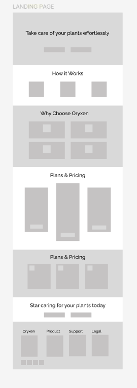


#### 6.3.1. Landing Page Mock-up

En esta sección se detallan los Mock-ups de la Landing Page de Oryxen, diseñados bajo un enfoque responsive para asegurar una visualización óptima tanto en navegadores web de escritorio como en dispositivos móviles. El diseño busca convertir visitantes en usuarios mediante una narrativa visual clara y una navegación intuitiva.

El diseño implementa rigurosamente el Design System establecido, utilizando la tipografía Raleway en distintos pesos para marcar una jerarquía visual clara y una paleta cromática basada en tonos crema y verdes que evocan equilibrio y sostenibilidad.

A continuación se presentan las evidencias de los mock-ups:

**Home:**
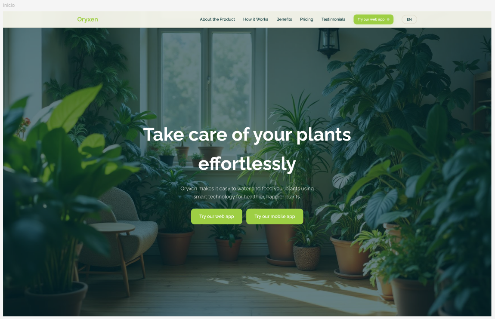

**About The Product:**
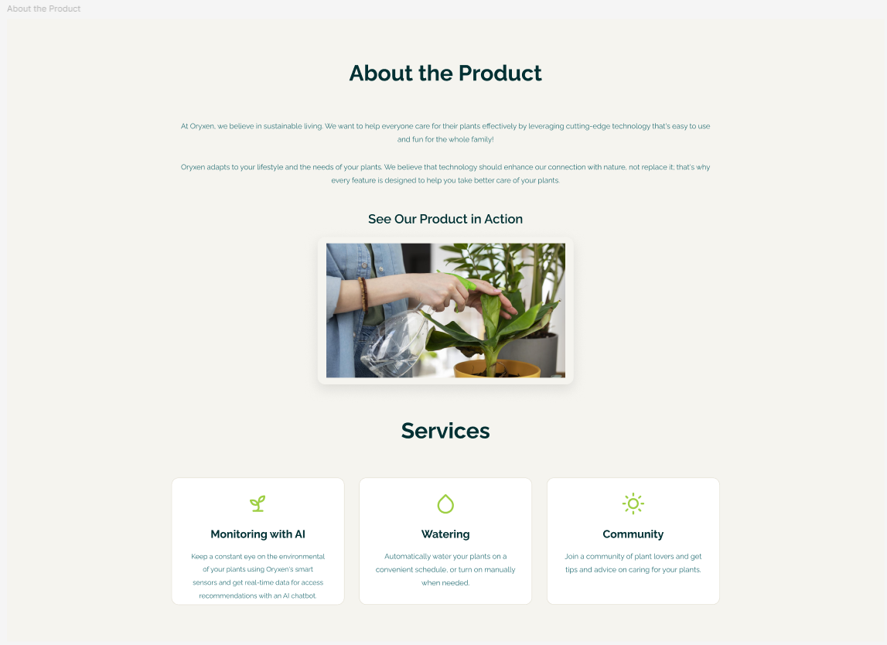

**How It Works:**
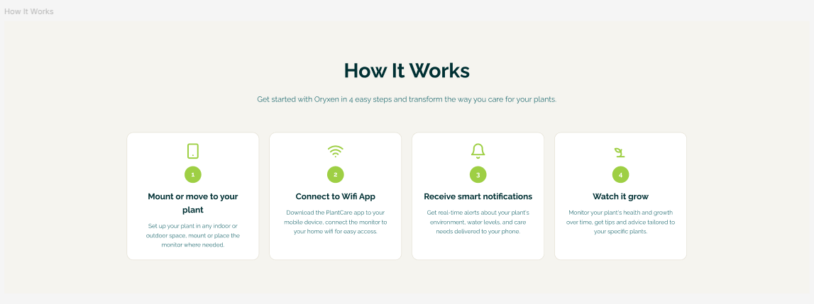

**Benefits:**
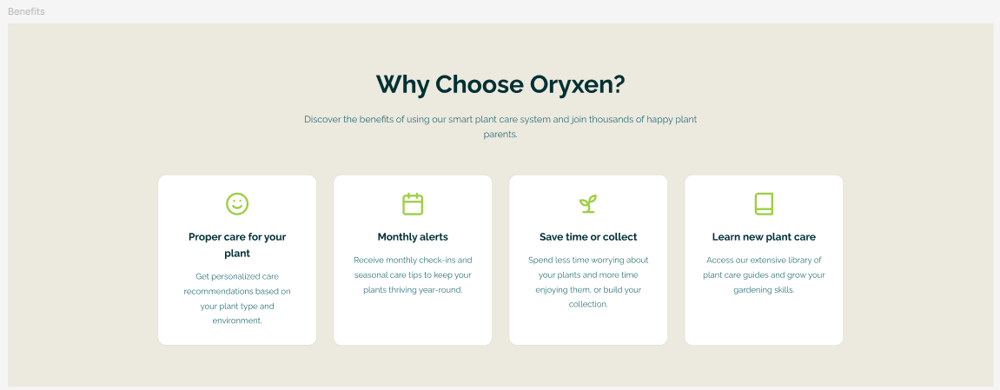

**Team:**
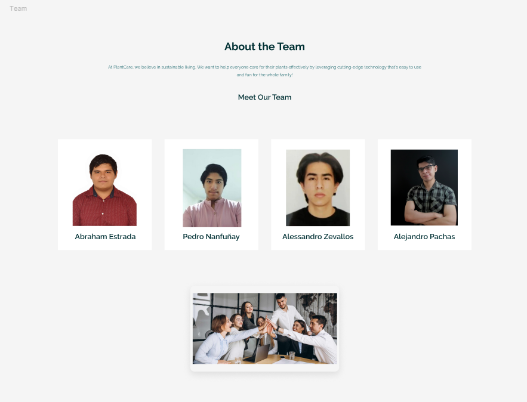

**Plans:**
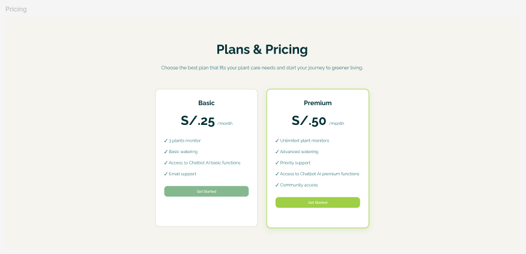

**Testimonials:**
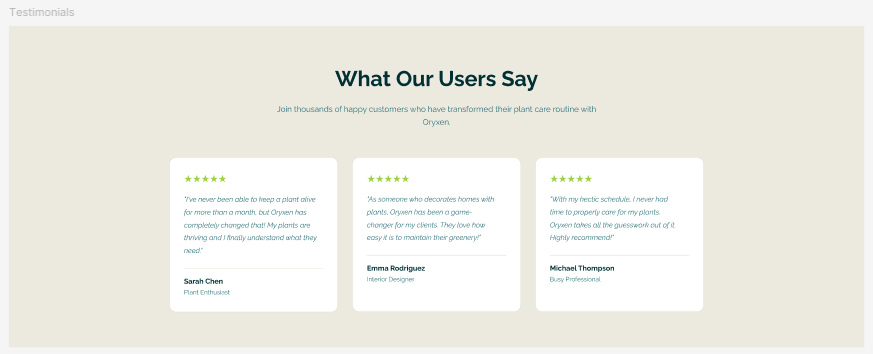

**Footer:**
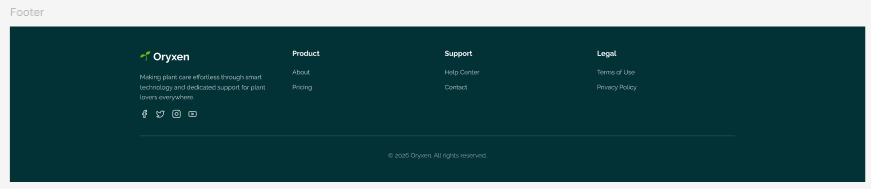


## 6.4. Applications UX/UI Design

El sistema de navegación de **Oryxen** está orientado a brindar una experiencia intuitiva, accesible y consistente tanto en plataformas mobile como web. La interfaz busca facilitar la interacción de los usuarios con las funcionalidades del sistema, permitiendo un uso sencillo y eficiente de las herramientas de monitoreo, automatización y gestión inteligente.

El diseño de las aplicaciones considera los siguientes principios:

*   **Experiencia de Usuario Intuitiva:** Las interfaces están diseñadas para que los usuarios puedan navegar y utilizar las funcionalidades principales de manera simple, reduciendo la complejidad de aprendizaje.
*   **Consistencia entre Plataformas:** Tanto la aplicación móvil como la aplicación web mantienen una identidad visual unificada, garantizando coherencia en los componentes, colores, tipografías y patrones de interacción.
*   **Diseño Responsivo y Accesible:** La interfaz se adapta a diferentes tamaños de pantalla y dispositivos, asegurando una experiencia fluida tanto en computadoras como en dispositivos móviles.
*   **Jerarquía Visual y Organización de Información:** Se prioriza una distribución clara de los elementos visuales y funcionalidades, facilitando el acceso rápido a información relevante y acciones principales del sistema.
*   **Enfoque en la Interacción del Usuario:** El diseño UI incorpora componentes visuales modernos y minimalistas que favorecen la interacción continua y mejoran la percepción de usabilidad de la plataforma.

### 6.4.1. Applications Wireframes

Aquí se muestran los wireframes desarrollados para la aplicación web y móvil Oryxen.

**Wireframes Web Application:**

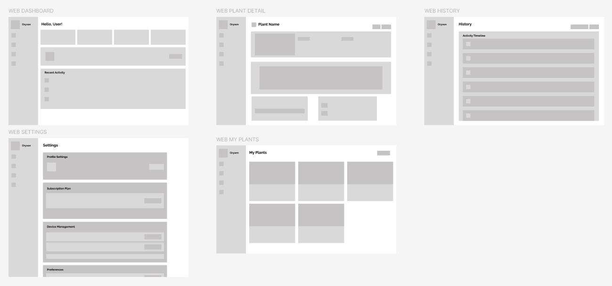


**Wireframes Web Application Responsive:**
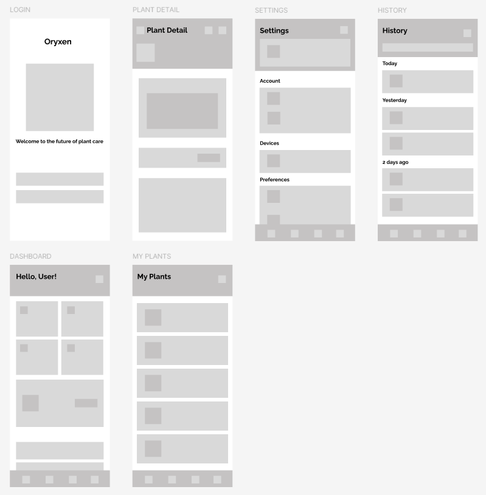


**Wireframes Mobile:**


[Enlace para acceder al prototipo de wireframes de Oryxen en Figma.](https://www.figma.com/design/K1K4Imdh3xHVPDeqIXi37D/SecurOn?node-id=87-44&t=ytQkGBOLqrfy4mp6-1)

### 6.4.2. Applications Wireflow Diagrams

En esta sección, se presentan los Wireflows de Oryxen, donde se muestran las rutas que los usuarios pueden seguir al interactuar con la aplicación web y móvil. Estos flujos reflejan los principales casos de uso de la plataforma: registro e inicio de sesión, gestión de plantas, vinculación de hardware y diagnóstico con inteligencia artificial. Para su realización se utilizó la herramienta LucidChart.

***
**Wireflow Diagrams Web Application:**

**User goal: Usuario se registra e inicia sesión**

**Descripción:**
Al acceder a la aplicación web, el usuario visualiza la pantalla de bienvenida (OnBoard) con las opciones de iniciar sesión o registrarse. Si no tiene cuenta, completa el formulario de Sign Up con su nombre, correo electrónico y contraseña. Una vez autenticado, es redirigido al Dashboard principal donde puede ver el estado de sus plantas.

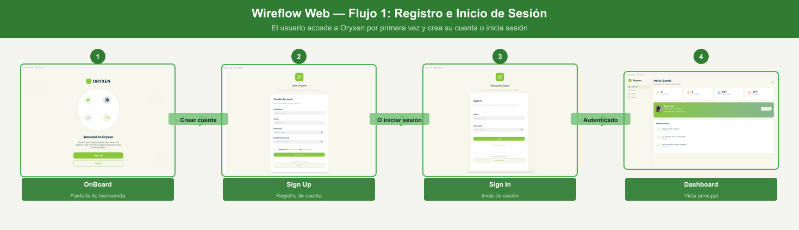

---

**User goal: Usuario registra una nueva planta manualmente**

**Descripción:**
Desde el Dashboard, el usuario accede a la sección Plant Grid y selecciona la opción para añadir una nueva planta. Completa el formulario con el nombre, la especie y la ubicación. El sistema sugiere automáticamente los umbrales de humedad recomendados según la especie elegida. Al confirmar, la planta aparece como una nueva tarjeta en el Dashboard.

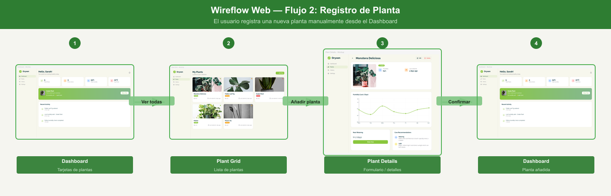

---

**User goal: Usuario visualiza detalles y métricas de una planta**

**Descripción:**
El usuario selecciona una planta desde el Dashboard o desde Plant Grid. Se muestra la vista Plant Details con las métricas actuales del sensor (humedad, temperatura), el historial de lecturas y las alertas activas. Desde esta vista puede acceder al historial completo en la sección History o ver analítica avanzada en Analytics.

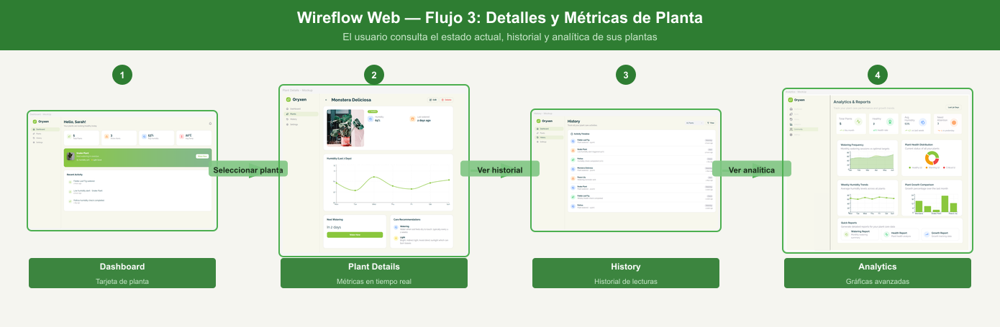

---

**User goal: Usuario explora la comunidad y analítica**

**Descripción:**
El usuario navega desde el menú principal hacia la sección Community, donde puede compartir experiencias con otros usuarios y ver publicaciones de la comunidad. También accede a Analytics para visualizar gráficas históricas del comportamiento de sus plantas. Desde Settings puede ajustar preferencias de notificación y datos de su cuenta.

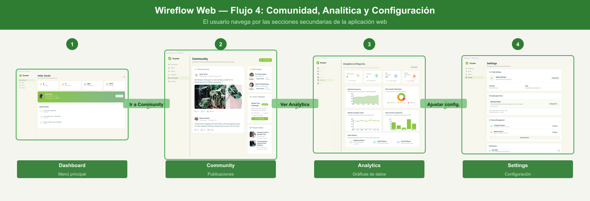

---

**Wireflow Diagrams Mobile Application:**

**User goal: Usuario se registra e inicia sesión**

**Descripción:**
Al abrir la aplicación móvil, el usuario ve la pantalla de OnBoard con las opciones de Sign Up y Sign In. Puede autenticarse mediante correo electrónico o Google (OAuth2). Una vez autenticado sin plantas registradas, el sistema muestra un estado vacío con el llamado a la acción "Añadir mi primera planta" y lo redirige al Dashboard al completar el registro.

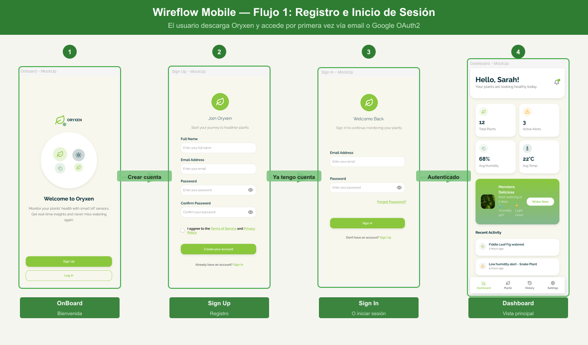

---

**User goal: Usuario vincula el hardware Sensor Lite**

**Descripción:**
Desde el Dashboard móvil, el usuario presiona el botón de acción flotante (FAB) y selecciona "Vincular Dispositivo". La aplicación solicita permisos de cámara y Bluetooth. El usuario escanea el código QR del Sensor Lite; el sistema lo registra y lo enlaza a la red WiFi local. Finalmente, el usuario asigna el sensor a una planta existente y el Dashboard se actualiza mostrando los datos en tiempo real.

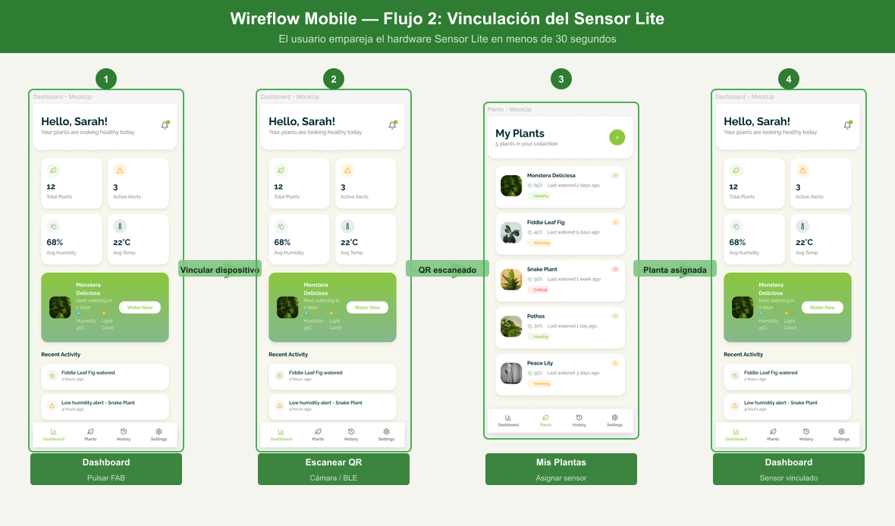

---

**User goal: Usuario solicita diagnóstico de IA para su planta**

**Descripción:**
El usuario, al notar un problema en su planta, ingresa a Plant Details desde el Dashboard y presiona el botón "Diagnóstico con IA". Se abre la cámara para capturar una fotografía de la hoja afectada. Tras el procesamiento en el backend, la app muestra el problema detectado (ej. clorosis, hongos) junto con las recomendaciones correctivas. El usuario puede aplicar la recomendación y programar un recordatorio de seguimiento automático.

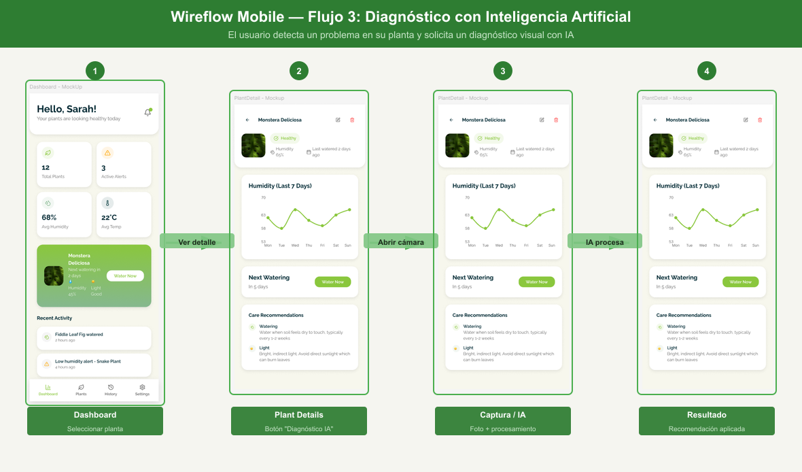

---

**User goal: Usuario consulta el historial y ajusta configuración**

**Descripción:**
Desde el menú inferior de la app, el usuario accede a la sección History para revisar el registro histórico de lecturas de humedad y temperatura de sus plantas. Desde Settings puede activar o desactivar notificaciones de alertas, cambiar entre el modo claro y oscuro (Dark Mode) y gestionar los datos de su cuenta.

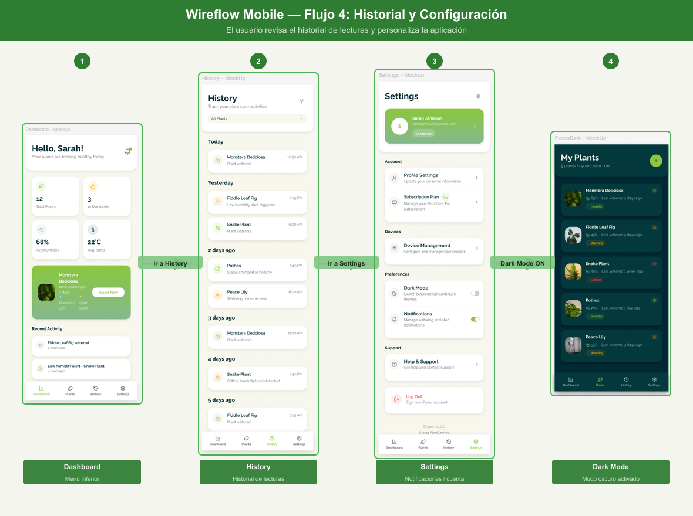


### 6.4.3. Applications Mock-ups

En esta sección se presentan los mock-ups para las aplicaciones móvil y web de Oryxen, diseñados para ofrecer una experiencia de usuario intuitiva y eficiente. Estas interfaces son la representación directa del Design System establecido, utilizando la tipografía Raleway para asegurar una lectura clara y una paleta de colores en tonos verdes y cremas que proyecta la identidad tecnológica y orgánica de la plataforma.

La arquitectura de la información se basa en una jerarquía visual que prioriza los estados críticos del jardín inteligente; el dashboard central destaca métricas de humedad y alertas urgentes, permitiendo una respuesta inmediata del usuario. Bajo principios de diseño inclusivo, se han optimizado los contrastes de color siguiendo las pautas de accesibilidad y se ha implementado una navegación táctil simplificada con amplios espacios en blanco para reducir la fatiga visual.

A continuación se presentan los mock-ups para la aplicación web y móvil:

**Aplicación Web:**

**On Board:**
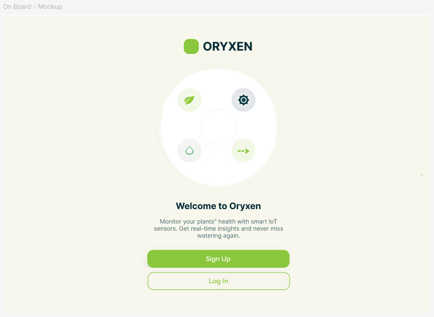

**Sign Up:**
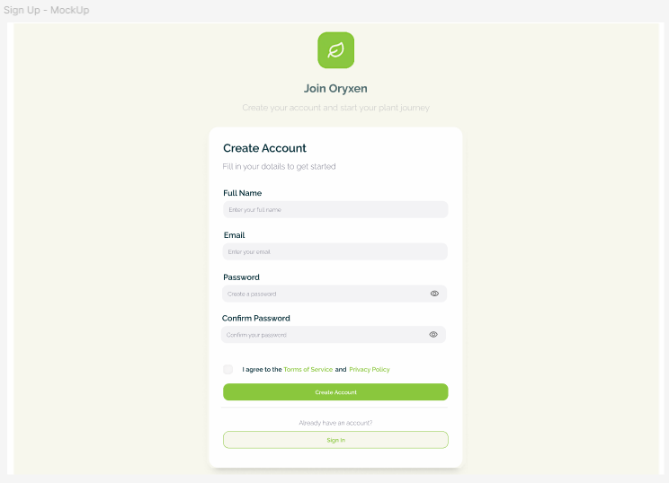

**Sign In:**
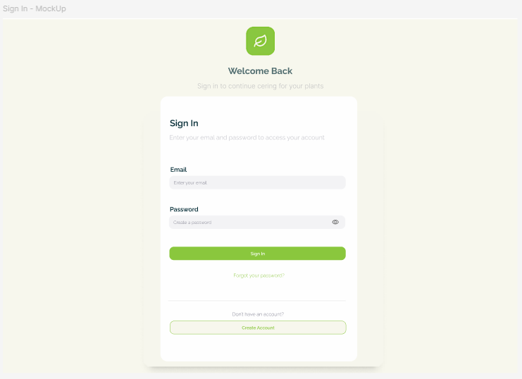

**Dashboard:**
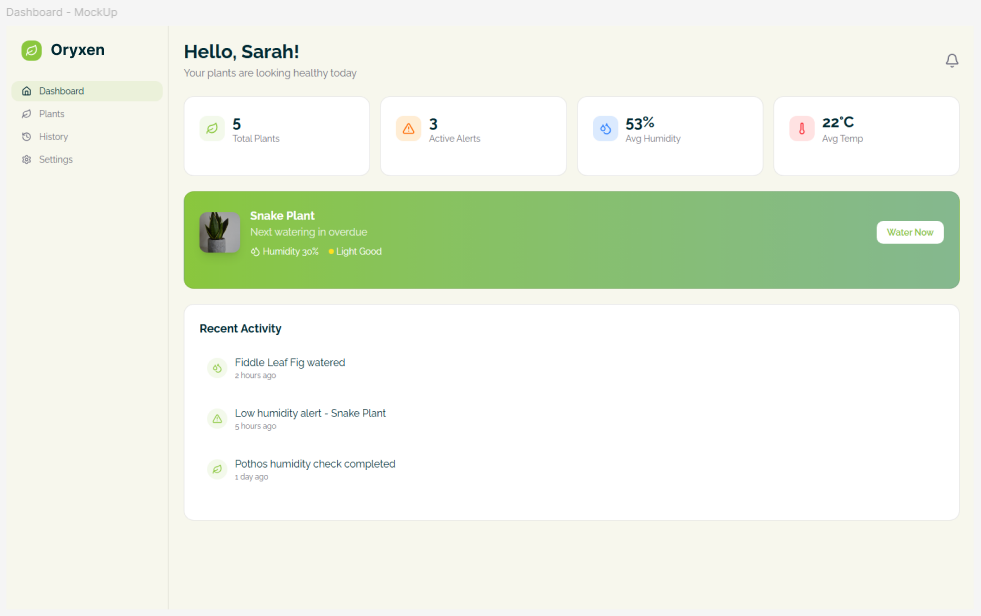

**Plant Grid:**
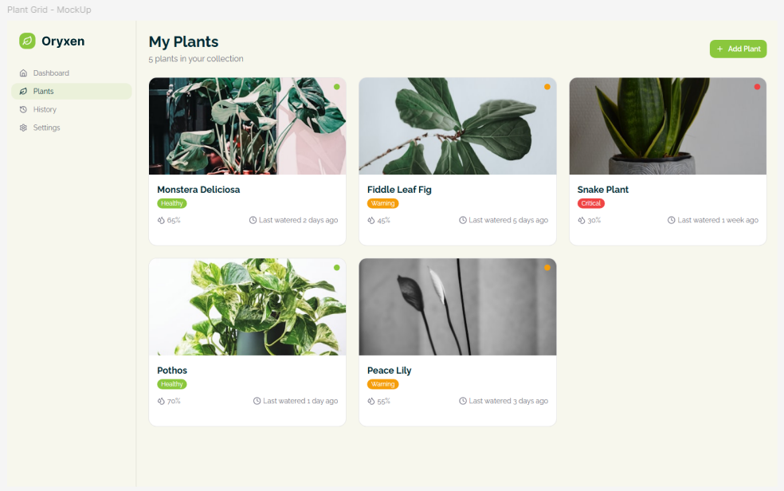

**Plant Details:**
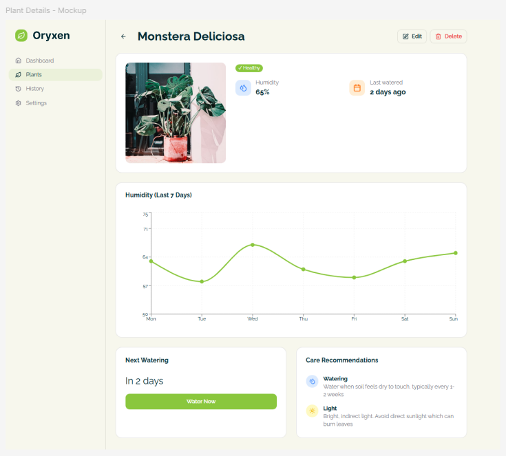

**History:**
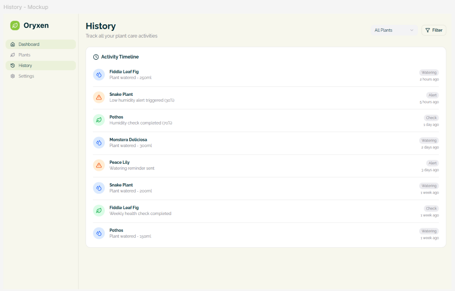

**Analytics:**
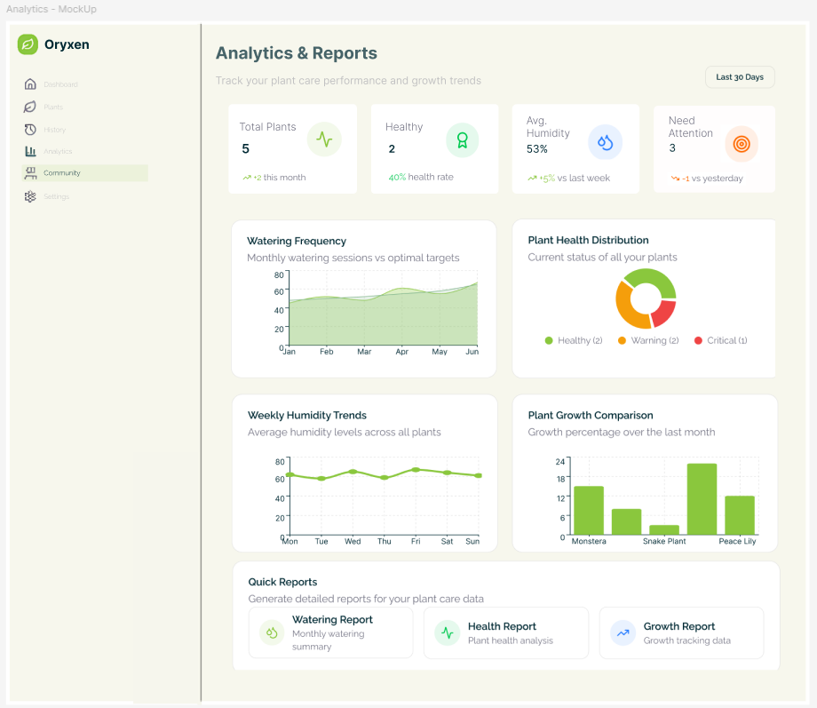

**Community:**
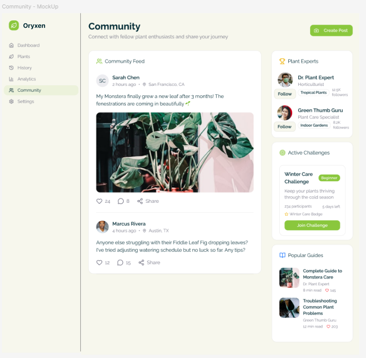

**Settings:**
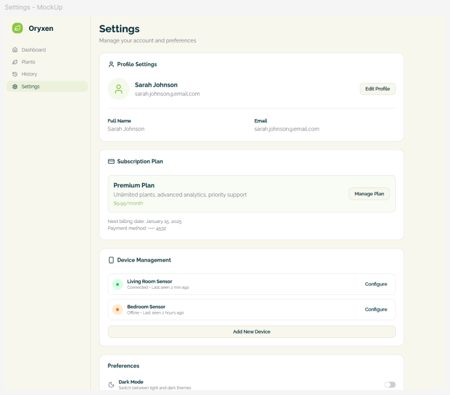


**Aplicación Móvil:**

**On Board:** <br>
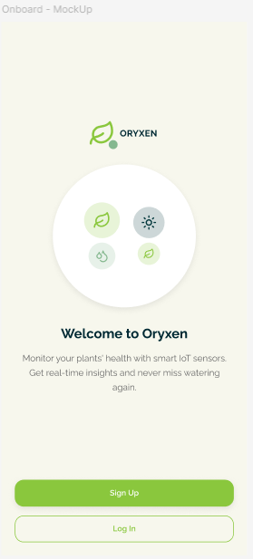

**Sign Up:**<br>
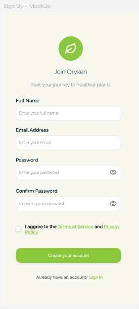

**Sign In:**<br>
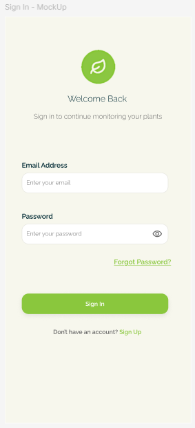

**Dashboard:**<br>
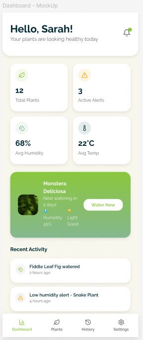

**Plants:**<br>
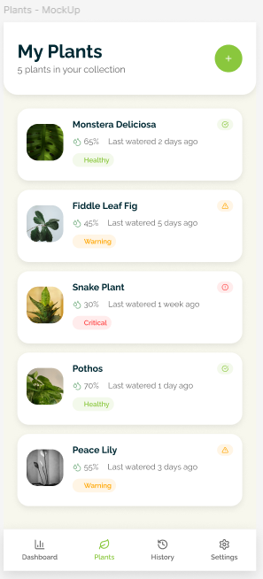

**Plant Details:**<br>
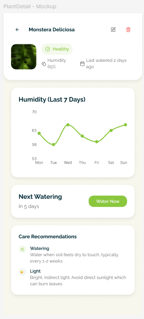

**History:**<br>
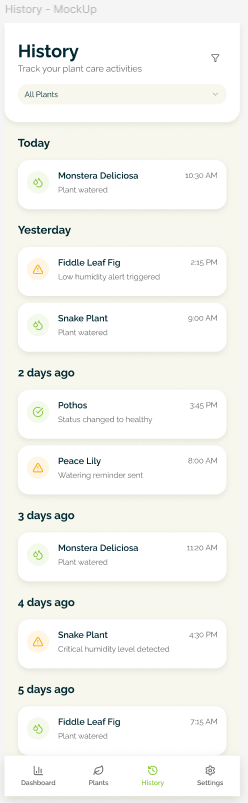

**Settings:**<br>
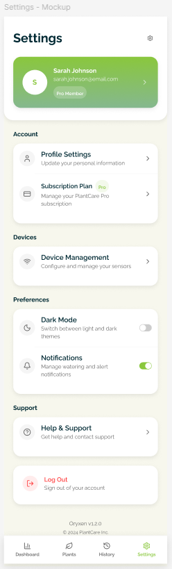

**Dark Mode:**<br>
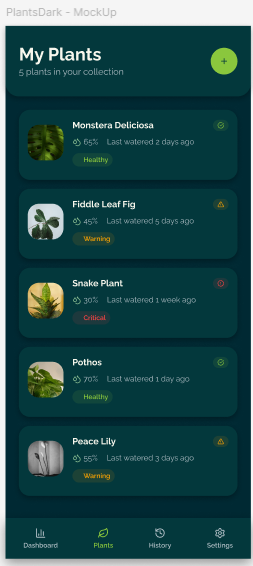


### 6.4.4. Applications User Flow Diagrams

Los diagramas de flujo de usuario (*User Flows*) mapean el recorrido paso a paso que realiza un consumidor dentro de las aplicaciones (Web y Móvil) de Oryxen para completar tareas específicas. Estos flujos han sido diseñados minimizando la fricción cognitiva y apoyando nuestra estrategia de adopción progresiva: permitiendo al usuario experimentar valor inmediato en el plan gratuito y facilitando transiciones naturales hacia la compra de hardware (Sensor Lite) o la suscripción Premium.

A continuación, se detallan los tres flujos críticos del negocio:

#### A. Flujo 1: Onboarding y Registro Manual de Planta (Plan Básico / Freemium)
Este es el primer contacto del usuario con la aplicación. El objetivo es que registre su primera planta lo más rápido posible, experimentando el valor de tener un inventario centralizado, sin requerir hardware físico inicial.

1.  **Inicio:** El usuario abre la aplicación móvil.
2.  **Autenticación:** Pantalla de *Sign Up* / *Login*. El usuario elige autenticarse rápidamente vía Google (OAuth2) o correo electrónico.
3.  **Pantalla de Bienvenida:** El sistema detecta que el usuario no tiene plantas y muestra un *Empty State* con un CTA principal: "Añadir mi primera planta".
4.  **Formulario de Registro:** El usuario ingresa la información básica (Nombre, Especie, Ubicación). 
5.  **Configuración de Umbrales:** El sistema sugiere parámetros predeterminados de humedad según la especie seleccionada. El usuario acepta.
6.  **Fin (Éxito):** El usuario es redirigido al *Dashboard* principal, donde visualiza la tarjeta de su nueva planta recién agregada.


#### B. Flujo 2: Vinculación de Hardware "Sensor Lite" (Expansión de la experiencia)
Este flujo representa el momento en que un usuario decide automatizar su monitoreo tras adquirir el hardware de entrada de Oryxen. Destaca la restricción de usabilidad (QA-04) que exige una vinculación en menos de 30 segundos.

1.  **Inicio:** Desde el *Dashboard*, el usuario presiona el *Floating Action Button* (FAB) y selecciona "Vincular Dispositivo".
2.  **Permisos:** La aplicación solicita acceso a la cámara y Bluetooth.
3.  **Escaneo QR:** El usuario escanea el código QR ubicado en la base del *Sensor Lite*.
4.  **Validación y Emparejamiento:** El sistema reconoce el ID del sensor, lo registra en el backend y lo enlaza a la red WiFi local mediante Bluetooth (BLE).
5.  **Asignación:** La app pregunta: "¿A qué planta pertenece este sensor?". El usuario selecciona una planta previamente registrada (ej. "Monstera de la Sala").
6.  **Fin (Éxito):** Pantalla de confirmación animada. El *Dashboard* se actualiza y la tarjeta de la planta ahora muestra la métrica de humedad y temperatura en tiempo real.


#### C. Flujo 3: Diagnóstico Visual con Inteligencia Artificial (Plan Premium)
Este flujo ilustra cómo un usuario interactúa con la característica estrella de la aplicación para resolver un problema complejo de salud en su planta.

1.  **Inicio:** El usuario nota hojas amarillas en su planta. Ingresa a la app y selecciona la planta desde el *Dashboard*.
2.  **Llamada a la Acción:** En la vista de detalle, presiona el botón "Diagnóstico con IA".
3.  **Captura de Imagen:** Se abre la cámara integrada. El usuario toma una fotografía de la hoja afectada.
4.  **Procesamiento (Loading):** Pantalla de carga mientras la imagen es sanitizada (eliminación de GPS/EXIF) y procesada por el motor de visión artificial en el backend.
5.  **Resultados y Recomendación:** El sistema muestra una alerta contextual con el problema detectado (ej. "Falta de nutrientes / Clorosis") y una lista de acciones correctivas inmediatas y a largo plazo.
6.  **Fin (Seguimiento):** El usuario presiona el botón "Aplicar recomendación". El sistema programa automáticamente un recordatorio de seguimiento para evaluar la mejora en 7 días.


### 6.5. Applications Prototyping

[](https://postimg.cc/YLMyWCrf)

Link del video app movil: https://upcedupe-my.sharepoint.com/:v:/g/personal/u202216035_upc_edu_pe/IQDQXbb_sP6gQbtmDmIo70zvAexpD0dW6jAVRMliIWUcS6A?nav=eyJyZWZlcnJhbEluZm8iOnsicmVmZXJyYWxBcHAiOiJTdHJlYW1XZWJBcHAiLCJyZWZlcnJhbFZpZXciOiJTaGFyZURpYWxvZy1MaW5rIiwicmVmZXJyYWxBcHBQbGF0Zm9ybSI6IldlYiIsInJlZmVycmFsTW9kZSI6InZpZXcifX0%3D&e=8SMDbO

[](https://postimg.cc/0KPHwykZ)

Link del video app web: https://upcedupe-my.sharepoint.com/:v:/g/personal/u202216035_upc_edu_pe/IQD90adpuh2HRaN3xZ5TbRREAbDzTw7cJ7ru2NqoLsuGbEg?nav=eyJyZWZlcnJhbEluZm8iOnsicmVmZXJyYWxBcHAiOiJTdHJlYW1XZWJBcHAiLCJyZWZlcnJhbFZpZXciOiJTaGFyZURpYWxvZy1MaW5rIiwicmVmZXJyYWxBcHBQbGF0Zm9ybSI6IldlYiIsInJlZmVycmFsTW9kZSI6InZpZXcifX0%3D&e=c79d7N


# Capítulo VII: Product Implementation, Validation & Deployment

## 7.1. Software Configuration Management

### 7.1.1. Software Development Environment Configuration

El equipo establece las herramientas de software que cada integrante debe utilizar para contribuir en el ciclo de vida del proyecto. La selección cubre todas las actividades del proceso de ingeniería: gestión del proyecto, diseño, desarrollo, pruebas, despliegue y documentación.

| Actividad | Producto de Software | Propósito en el proyecto | Ruta de referencia / Descarga |
|-----------|---------------------|--------------------------|-------------------------------|
| Project Management | Trello | Gestión del Product Backlog y Sprint Boards mediante tableros Kanban para visualizar el avance de tareas por sprint. | https://trello.com |
| Project Management | GitHub Projects | Seguimiento de issues técnicos y pull requests asociados al código fuente de los repositorios. | https://github.com |
| Requirements Management | Pivotal Tracker | Registro, priorización y estimación de User Stories y Technical Stories del Product Backlog. | https://www.pivotaltracker.com |
| Product UX Design | Figma | Creación de wireframes, mock-ups y prototipos interactivos para la Landing Page y aplicaciones Web/Mobile. | https://www.figma.com |
| Product UX Design | UXPressia | Elaboración de User Personas, Empathy Maps e Impact Maps para los segmentos objetivo identificados. | https://uxpressia.com |
| Architecture Modeling | Structurizr | Modelado de diagramas C4 Model (Context, Container, Component) para la arquitectura de software de la solución. | https://structurizr.com |
| Architecture Modeling | LucidChart | Diagramas de EventStorming, Domain Storytelling, Bounded Context Mapping y Class Diagrams UML. | https://lucidchart.com |
| Architecture Modeling | Vertabelo | Diseño de diagramas de base de datos (Database Design Diagrams) para los Bounded Contexts del sistema. | https://vertabelo.com |
| Software Development (Backend) | JetBrains Rider 2024.x | IDE principal para el desarrollo del servicio backend en C# con ASP.NET Core 8, con soporte para .NET y refactoring avanzado. | https://www.jetbrains.com/rider (descarga) |
| Software Development (Backend) | .NET SDK 8.0 | Runtime y SDK necesario para compilar, ejecutar y publicar el backend ASP.NET Core de la solución. | https://dotnet.microsoft.com/download (descarga) |
| Software Development (Backend) | Docker Desktop | Contenedorización local de servicios de infraestructura (PostgreSQL 15, Redis 7) para el entorno de desarrollo. | https://www.docker.com/products/docker-desktop (descarga) |
| Software Development (Web App) | Visual Studio Code 1.89+ | Editor de código para desarrollo de la Web Application en Vue.js 3 + TypeScript, con extensiones Vue Official y ESLint. | https://code.visualstudio.com (descarga) |
| Software Development (Web App) | Node.js v20 LTS | Entorno de ejecución necesario para npm, Vite 8 y las dependencias del proyecto Vue.js. | https://nodejs.org (descarga) |
| Software Development (Web App) | Vue DevTools | Extensión de navegador para depuración de componentes Vue 3 y estado de stores Pinia en tiempo real. | https://devtools.vuejs.org |
| Software Development (Mobile) | Android Studio Jellyfish (2023.3) | IDE para el desarrollo de la aplicación móvil nativa en Kotlin para la plataforma Android. | https://developer.android.com/studio (descarga) |
| Software Development (Landing) | Visual Studio Code | Editor para la implementación de la Landing Page estática en HTML5, CSS3 y JavaScript puro. | https://code.visualstudio.com (descarga) |
| Software Testing | Postman v11 | Pruebas manuales de endpoints REST y colecciones de prueba de integración de la API del backend. | https://www.postman.com |
| Software Testing | xUnit (.NET) | Framework de pruebas unitarias para las clases del Domain Layer del backend en C#. | NuGet Package: `xunit` |
| Software Deployment | Firebase CLI | Despliegue de la Web Application y Landing Page en Firebase Hosting y gestión de proyectos Firebase. | https://firebase.google.com/docs/cli |
| Software Deployment | GitHub Actions | Pipeline de CI/CD para automatizar builds, pruebas y despliegues desde los repositorios de la organización en GitHub. | https://github.com/features/actions |
| Software Documentation | GitHub + Markdown | Control de versiones del informe de proyecto en formato Markdown (README.md) dentro del repositorio público de la organización. | https://github.com/1ASI0728-2610-11770-G4-Oryxen/Documentation-Report |
| Software Documentation | Swagger UI / OpenAPI 3.0 | Documentación interactiva de los endpoints REST del backend, generada automáticamente con Swashbuckle en ASP.NET Core. | https://swagger.io |

### 7.1.2. Source Code Management

En esta sección se presenta el enfoque seleccionado para la gestión del código fuente que se centraliza en GitHub, implementando un sistema robusto de control de versiones bajo la organización: https://github.com/1ASI0728-2610-11770-G4-Oryxen. Esta estructura nos permite mantener un flujo de trabajo colaborativo y organizado: <br>

**Oryxen-Documentation-Report:** https://github.com/1ASI0728-2610-11770-G4-Oryxen/Documentation-Report<br>
**Oryxen-Landing-Page:** https://github.com/1ASI0728-2610-11770-G4-Oryxen/Oryxen-Landing-Page <br>
**Oryxen-Web-Application:** https://github.com/1ASI0728-2610-11770-G4-Oryxen/Oryxen-Web-Application <br>
**Oryxen-Mobile-Application:** https://github.com/1ASI0728-2610-11770-G4-Oryxen/Oryxen-Mobile-Application <br>
**Oryxen-Backend:** https://github.com/1ASI0728-2610-11770-G4-Oryxen/Oryxen-Backend <br>

<br>

**GitFlow Workflow:**<br>
Para el desarrollo de los artefactos de nuestra solución, se implementa el modelo GitFlow propuesto por Vincent Driessen, adaptado a un entorno de desarrollo y despliegue continuo. Las ramas a implementar son:

- `main:` Rama principal para producción
- `develop:` Rama de desarrollo
- `feature/nombre-descriptivo:` Rama para desarrollo de nuevas funcionalidades
- `fix/x.y.z:` Rama para corrección de errores
- `release/x.y.z:` Rama para despliegue de versiones estables

<br>

**Conventional Commits:**<br>
Se utilizarán **Conventional Commits** para facilitar el versionado semántico.

- `feat:` Nueva funcionalidad
- `fix:` Corrección de errores
- `test:` Pruebas agregadas o modificadas
- `docs:` Documentación

<br>

**Source Code Style Guide & Coding Conventions:**<br>
Para mantener la coherencia y legibilidad del código, el equipo adopta las siguientes guías y convenciones:

- **Nomenclatura:**
  - Todos los nombres de variables, funciones, clases y archivos se escriben en inglés.
  - Se aplica camelCase para variables y funciones, PascalCase para clases, y snake_case para nombres de archivos.


### 7.1.3. Source Code Style Guide & Conventions

Para mantener la coherencia, legibilidad y calidad del código fuente en todos los repositorios de la solución, el equipo adopta las siguientes guías y convenciones estándar de la industria, aplicadas a cada tecnología utilizada en el proyecto. Todos los identificadores se escriben en **inglés** como norma transversal.

**C# / ASP.NET Core (Oryxen-Backend)**

Se adoptan las [Microsoft C# Coding Conventions](https://learn.microsoft.com/en-us/dotnet/csharp/fundamentals/coding-style/identifier-names) y las convenciones de Domain-Driven Design para nombrar los artefactos del dominio:

- **PascalCase**: clases, interfaces, métodos, propiedades, eventos, enumeraciones y namespaces públicos.
  Ejemplos: `UserAccount`, `GetUserByIdAsync()`, `AuthProvider`, `IUserRepository`
- **camelCase**: variables locales y parámetros de métodos.
  Ejemplos: `userId`, `accessToken`, `dateRange`
- **_camelCase** (prefijo guion bajo): campos privados o protegidos de instancia.
  Ejemplos: `_userRepository`, `_jwtTokenAdapter`, `_passwordEncoder`
- **IPascalCase**: interfaces con prefijo `I` obligatorio.
  Ejemplos: `IUserRepository`, `ITokenDomainService`, `INotificationPublisher`
- **Namespaces** siguen la estructura de carpetas del proyecto:
  `GrassFarming.{BoundedContext}.{Layer}.{Sublayer}`
  Ejemplo: `GrassFarming.Auth.Application.CommandHandlers`
- Los métodos asíncronos llevan el sufijo `Async`:
  `RegisterUserAsync()`, `ValidateTokenAsync()`, `GenerateReportAsync()`
- Los Commands se nombran en imperativo: `RegisterUserCommand`, `GenerateReportCommand`
- Los Queries en forma de consulta nominal: `GetUserByIdQuery`, `ListReportsQuery`

**Vue.js 3 + TypeScript (Oryxen-Web-Application)**

Se adoptan el [Google TypeScript Style Guide](https://google.github.io/styleguide/tsguide.html) y la [Vue.js Official Style Guide](https://vuejs.org/style-guide) (Prioridades A y B obligatorias):

- **PascalCase**: nombres de componentes Vue, tanto en nombre de archivo como en su uso en templates.
  Ejemplos: `PlantCard.vue`, `AuthLoginForm.vue`, `<PlantCard />`
- **camelCase**: variables TypeScript, funciones, props de componentes y propiedades de Pinia stores.
  Ejemplos: `const isLoading = ref(false)`, `function getUserData()`, prop `plantId`
- **kebab-case**: nombres de eventos personalizados y atributos en templates HTML.
  Ejemplos: `@plant-updated`, `v-bind:plant-id`, nombre de ruta `plant-detail`
- **SCREAMING_SNAKE_CASE**: constantes de aplicación.
  Ejemplos: `const MAX_RETRY_COUNT = 3`, `const API_BASE_URL = '...'`
- Los archivos de componentes utilizan `<script setup lang="ts">` (Composition API con sintaxis de azúcar).
- Los stores de Pinia siguen el patrón `use{Name}Store()`:
  `useAuthStore()`, `usePlantStore()`, `useNotificationStore()`
- Se prohíbe el uso implícito de `any`; todos los tipos deben declararse explícitamente con TypeScript.
- Un componente realiza una única responsabilidad; la lógica compleja se extrae a composables en `src/composables/`.
- Los archivos de servicios de API se ubican en `src/services/` con nombre en camelCase: `plantService.ts`, `authService.ts`.
- Importaciones ordenadas: librerías externas → aliases internos (`@/`) → rutas relativas.

**HTML5 / CSS3 / JavaScript (Oryxen-Landing-Page)**

- **BEM** (Block\_\_Element--Modifier) para nombrar clases CSS.
  Ejemplos: `.hero__cta-button`, `.card--featured`, `.nav__menu-item--active`
- Elementos HTML5 semánticos obligatorios: `<header>`, `<nav>`, `<main>`, `<section>`, `<article>`, `<footer>`.
- Los atributos `id` y `class` usan **kebab-case**.
  Ejemplos: `id="hero-section"`, `class="pricing-plans"`
- No se permiten estilos en línea (`style="..."`); todo el CSS se centraliza en archivos externos.
- Las variables CSS se declaran en el selector `:root` del archivo principal: `--color-primary`, `--font-size-base`, `--spacing-md`.

**Gherkin (Feature Files — BDD Testing)**

Se adoptan las [Gherkin Conventions for Readable Specifications](https://specflow.org/gherkin/gherkin-conventions-for-readable-specifications/):

- Los archivos `.feature` usan **kebab-case**: `user-authentication.feature`, `plant-registration.feature`
- Los escenarios usan **Title Case** en inglés: `Scenario: Successful user login with valid credentials`
- Los steps usan **tiempo presente imperativo** en inglés: `Given`, `When`, `Then`, `And`, `But`
  Ejemplo: `Given a registered user with email "user@example.com"`
- Los steps no referencian detalles de implementación ni elementos de UI específicos (evitar "click button #submit").

### 7.1.4. Software Deployment Configuration

En esta sección se especifica la configuración de despliegue de cada producto digital de la solución, partiendo de los repositorios de código fuente hasta su publicación. El entorno de desarrollo local (localhost) replica la topología de microservicios que se promueve a la nube en las entregas posteriores.

**Topología de despliegue (entorno local):**

```
                         ┌──────────────────────────┐
   Visitante  ─────────► │  Oryxen-Landing-Page     │  (HTML5/CSS3/JS estático)
                         │  Firebase Hosting / :5500│
                         └─────────────┬────────────┘
                                       │ CTA "Open the app"
                                       ▼
   Usuario    ─────────► ┌──────────────────────────┐      ┌───────────────────────┐
   (Web)                 │  Oryxen-Web-Application   │ ───► │  Oryxen-Backend (API) │
                         │  Vue 3 + Vite  :5173     │ REST │  ASP.NET Core  :5170  │
                         └──────────────────────────┘ JWT  │  /swagger (OpenAPI)   │
   Usuario    ─────────► ┌──────────────────────────┐      │                       │
   (Mobile)              │  Oryxen-Mobile-App        │ ───► │                       │
                         │  Android (10.0.2.2:5170) │ REST └──────────┬────────────┘
                         └──────────────────────────┘                 │ EF Core / Npgsql
   Sensor Lite ────────► POST /api/v1/telemetry  ────────────────────►│
   (simulador)                                                        ▼
                                                          ┌───────────────────────┐
                                                          │  PostgreSQL 15        │
                                                          │  Docker  :5432        │
                                                          └───────────────────────┘
```

**Pasos de despliegue por producto:**

| Producto | Build | Despliegue local | Destino de publicación |
|----------|-------|------------------|------------------------|
| **Oryxen-Backend** (RESTful API) | `dotnet build Oryxen.API.slnx` | `docker compose up -d` (PostgreSQL) → `dotnet run --project src/Oryxen.API`. Las migraciones de EF Core se aplican automáticamente al inicio. Expone `http://localhost:5170` y Swagger en `/swagger`. | Azure App Service / Google Cloud Run + Azure Database for PostgreSQL. |
| **Oryxen-Web-Application** | `npm install` → `npm run build` (genera `dist/`) | `npm run dev` → `http://localhost:5173`. Variable `VITE_API_BASE_URL` apunta al backend. | Firebase Hosting (`firebase deploy`). |
| **Oryxen-Landing-Page** | Sitio estático (sin build step) | Servir la carpeta con cualquier servidor estático (Live Server / `firebase serve`). | Firebase Hosting (`firebase deploy`). |
| **Oryxen-Mobile-Application** | `./gradlew assembleRelease` (Android Studio) | Ejecución en emulador/dispositivo (API 24+), apuntando a `http://10.0.2.2:5170`. | Firebase App Distribution / Google Play. |

La base de datos local se gestiona de forma reproducible mediante `docker-compose.yml` (imagen `postgres:15-alpine`), con credenciales parametrizadas en el archivo `.env` y healthcheck `pg_isready`. El diagrama de despliegue de C4 Model que formaliza esta topología se mantiene en el workspace de arquitectura del equipo (Structurizr).

## 7.2. Solution Implementation

### 7.2.1. Sprint 1

#### 7.2.1.1. Sprint Planning 1

En esta sección se presenta el resumen del Sprint Planning Meeting del Sprint 1. Al ser el primer sprint del ciclo de implementación, el objetivo se centró en establecer la presencia digital del producto (Landing Page) y los cimientos de identidad y telemetría del backend que habilitan el resto de capacidades de Oryxen.

| **Sprint #** | Sprint 1 |
|--------------|----------|
| **Sprint Planning Background** | |
| Date | 2026-06-02 |
| Time | 07:00 PM |
| Location | Reunión virtual (Discord — canal del equipo Oryxen) |
| Prepared By | Estrada Cajamune, Abraham Andrés (Team Leader) |
| Attendees | Estrada Cajamune, Abraham Andrés / Nanfuñay Liza, Pedro Jesús / Pachas Chavez, Alejandro Alberto / Zevallos Linares, Alessandro Netto |
| Sprint 0 Review Summary | No aplica. El Sprint 1 es el primer sprint de implementación; parte de los artefactos de diseño estratégico y táctico (Capítulos IV y V) y de UX (Capítulo VI) aprobados en TB1/TP1. |
| Sprint 0 Retrospective Summary | No aplica. El equipo acordó adoptar GitFlow + Conventional Commits y una reunión de sincronización cada 48 horas como base de trabajo. |
| **Sprint Goal & User Stories** | |
| Sprint 1 Goal | Publicar la Landing Page responsiva de Oryxen e implementar el núcleo de Auth & Identity (registro, login y refresh con JWT) junto con la ingesta de telemetría del Sensor Lite, dejando el ecosistema Web ↔ Backend integrado en entorno local. Métrica de cumplimiento: flujo end-to-end (registro → login → telemetría con Health Score) operativo. |
| Sprint 1 Velocity | 30 Story Points |
| Sum of Story Points | 24 Story Points (US-001, US-002, US-003, US-004, US-005, US-006, US-009) |

#### 7.2.1.2. Sprint Backlog 1

Para el Sprint 1, el equipo enfocó sus esfuerzos en la construcción y despliegue de la Landing Page de Oryxen y en la implementación de los flujos de autenticación de usuarios (registro, inicio de sesión y Google OAuth) en la Web Application, sentando las bases para el onboarding de los primeros usuarios beta de la plataforma.

**Sprint 1 Goal:** Desplegar la Landing Page funcional de Oryxen e implementar la autenticación core del usuario (registro, login y Google OAuth) en la Web Application, permitiendo el acceso inicial de usuarios beta a la plataforma.

**Sprint 1 Velocity:** 30 Story Points

*(Captura del Sprint Board — Sprint 1 en Trello)*

**Trello Sprint Board:** https://trello.com/invite/b/69eb915dbfebde12de7929b0/ATTI72c244ba9b9b2af37b84a4adac09acbd15A9C4C2/product-backlog-oryxen

| Sprint # | Sprint 1 | | | | | | |
|----------|----------|-|-|-|-|-|-|
| **User Story** | | **Work-Item / Task** | | | | | |
| **Id** | **Title** | **Id** | **Title** | **Description** | **Estimation (Hours)** | **Assigned To** | **Status** |
| US-001 | Acceso a la Landing Page | T001 | Setup LP project structure | Crear la estructura base del proyecto HTML5/CSS3/JS de la Landing Page con organización de carpetas y configuración del entorno de desarrollo local. | 3 | Zevallos Linares, Alessandro Netto | Done |
| US-001 | Acceso a la Landing Page | T002 | Implement responsive layout | Implementar el layout principal con CSS Grid y Flexbox garantizando responsividad completa para mobile web browser y desktop web browser. | 4 | Zevallos Linares, Alessandro Netto | Done |
| US-001 | Acceso a la Landing Page | T003 | Deploy to Firebase Hosting | Configurar Firebase Hosting y ejecutar el despliegue inicial de la Landing Page verificando la URL pública del sitio. | 2 | Zevallos Linares, Alessandro Netto | Done |
| US-002 | Secciones informativas diferenciadas | T004 | Hero and About section | Implementar la sección hero con headline y tagline de Oryxen, y la sección "About" describiendo la propuesta de valor diferenciada para personas ocupadas y aficionados. | 3 | Zevallos Linares, Alessandro Netto | Done |
| US-002 | Secciones informativas diferenciadas | T005 | Services and Benefits sections | Implementar la sección de servicios (monitoreo IoT, diagnóstico IA, alertas) y la sección de beneficios diferenciados por segmento de usuario. | 3 | Zevallos Linares, Alessandro Netto | Done |
| US-002 | Secciones informativas diferenciadas | T006 | How it Works section | Implementar la sección paso a paso del proceso de uso del producto: desde la instalación del Sensor Lite hasta el primer monitoreo activo. | 2 | Zevallos Linares, Alessandro Netto | Done |
| US-003 | Call to Action contextual | T007 | CTA buttons in hero section | Añadir botones de CTA contextuales en la sección hero redirigiendo a la Web Application (registro y descarga de app). | 1 | Zevallos Linares, Alessandro Netto | Done |
| US-003 | Call to Action contextual | T008 | CTA buttons in pricing section | Añadir botones de CTA en la sección de planes y precios con redirección al flujo de registro de la Web Application. | 1 | Nanfuñay Liza, Pedro Jesús | Done |
| US-004 | Testimonios segmentados | T009 | Testimonials section | Implementar la sección de testimonios con cards diferenciados por perfil de usuario, mostrando casos reales de personas ocupadas y aficionados a la jardinería. | 3 | Zevallos Linares, Alessandro Netto | Done |
| US-004 | Testimonios segmentados | T010 | Plans and pricing section | Implementar la sección de planes con cards comparativos de Freemium y Premium, incluyendo características, precios y hardware Sensor Lite. | 2 | Pachas Chavez, Alejandro Alberto | Done |
| US-004 | Testimonios segmentados | T011 | Team and footer section | Implementar la sección del equipo de GrassFarming con perfiles y el footer con links de navegación, redes sociales y términos de servicio. | 2 | Pachas Chavez, Alejandro Alberto | Done |
| US-005 | Registro de usuario | T012 | RegisterForm component | Crear el componente Vue `RegisterForm.vue` con campos de nombre, email y contraseña usando componentes de PrimeVue (InputText, Password). | 4 | Estrada Cajamune, Abraham Andrés | Done |
| US-005 | Registro de usuario | T013 | Firebase Auth register integration | Integrar `createUserWithEmailAndPassword` de Firebase Auth v12 para persistir nuevos usuarios y crear su perfil en Firestore. | 3 | Estrada Cajamune, Abraham Andrés | Done |
| US-005 | Registro de usuario | T014 | Form validation and error handling | Implementar validación reactiva de campos (formato de email, longitud mínima de contraseña) y manejo tipado de errores de Firebase Auth. | 2 | Estrada Cajamune, Abraham Andrés | Done |
| US-006 | Inicio de sesión | T015 | LoginForm component | Crear el componente Vue `LoginForm.vue` con campos de email y contraseña, incluyendo feedback visual del estado de carga (loading state). | 3 | Estrada Cajamune, Abraham Andrés | Done |
| US-006 | Inicio de sesión | T016 | Firebase Auth sign-in integration | Integrar `signInWithEmailAndPassword` de Firebase Auth y manejar la persistencia de sesión con `setPersistence(LOCAL)`. | 2 | Estrada Cajamune, Abraham Andrés | Done |
| US-006 | Inicio de sesión | T017 | Pinia auth session store | Implementar `useAuthStore()` con Pinia para centralizar el estado de autenticación del usuario (user, isAuthenticated, isLoading) entre vistas. | 2 | Estrada Cajamune, Abraham Andrés | Done |
| US-009 | Autenticación externa segura | T018 | Firebase Google provider config | Configurar el proveedor OAuth de Google en Firebase Console y registrar las credenciales en `src/firebase.ts` del proyecto Vue. | 2 | Estrada Cajamune, Abraham Andrés | Done |
| US-009 | Autenticación externa segura | T019 | GoogleSignIn button component | Implementar el componente `GoogleSignInButton.vue` que invoca `signInWithPopup` con `GoogleAuthProvider` de Firebase Auth. | 2 | Estrada Cajamune, Abraham Andrés | Done |
| US-009 | Autenticación externa segura | T020 | OAuth callback and user profile sync | Manejar el resultado del callback de OAuth, sincronizar el perfil del usuario de Google con `useAuthStore()` y redirigir al dashboard principal. | 3 | Estrada Cajamune, Abraham Andrés | Done |

#### 7.2.1.3. Development Evidence for Sprint Review

En esta sección se registra la evidencia de implementación del Sprint 1. Los avances principales cubren el desarrollo y despliegue completo de la Landing Page de Oryxen (todas sus secciones) y el scaffolding inicial de la Web Application con integración de Firebase Authentication (Vue 3 + TypeScript + Pinia + PrimeVue). Los commits se distribuyen entre los repositorios `Oryxen-Landing-Page`, `Oryxen-Web-Application` y `Documentation-Report` bajo la organización GitHub de la solución.

| **Repository** | **Branch** | **Commit Id** | **Commit Message** | **Commit Message Body** | **Committed on (Date)** |
|----------------|-----------|--------------|-------------------|------------------------|------------------------|
| 1ASI0728-2610-11770-G4-Oryxen/Oryxen-Landing-Page | main | 0180565 | feat: add hero and about section | Implements responsive hero section with segmented CTA buttons and "About Oryxen" section describing the value proposition for both target segments. | 08/06/2026 |
| 1ASI0728-2610-11770-G4-Oryxen/Oryxen-Landing-Page | main | 3229368 | feat: add services section | Adds services section showcasing IoT real-time monitoring, AI-powered diagnostics and smart alert capabilities with visual cards. | 08/06/2026 |
| 1ASI0728-2610-11770-G4-Oryxen/Oryxen-Landing-Page | main | 0b687c3 | feat: add how it works section | Implements 3-step onboarding flow section covering Sensor Lite QR setup, plant profile creation and first health monitoring. | 14/06/2026 |
| 1ASI0728-2610-11770-G4-Oryxen/Oryxen-Landing-Page | main | f66b04f | feat: add benefits section | Adds benefits section with differentiated feature cards for busy users (automation, minimal effort) and plant enthusiasts (analytics, advanced reports). | 14/06/2026 |
| 1ASI0728-2610-11770-G4-Oryxen/Oryxen-Landing-Page | main | a8fa3a3 | feat: add team section | Adds GrassFarming team section with member profiles, photos, roles and academic background. | 15/06/2026 |
| 1ASI0728-2610-11770-G4-Oryxen/Oryxen-Landing-Page | main | ecef7cc | feat: add plans & pricing section | Implements Freemium and Premium subscription plan cards with feature comparison, Sensor Lite hardware pricing and upgrade CTA buttons. | 15/06/2026 |
| 1ASI0728-2610-11770-G4-Oryxen/Oryxen-Landing-Page | main | f2e24b1 | feat: add testimonials and footer section | Adds segmented user testimonials (busy user and enthusiast profiles) and footer with navigation links, social media and Terms of Service link. | 15/06/2026 |
| 1ASI0728-2610-11770-G4-Oryxen/Oryxen-Web-Application | main | e74cd83 | initial commit. | Scaffolding of Oryxen Web Application: Vue 3.5 + Vite 8 + TypeScript + PrimeVue 4 + Pinia 3 + Firebase SDK v12 + Vue Router 5. Base project structure with src/components, src/views, src/stores, src/services, src/router and Firebase config. | 16/06/2026 |
| 1ASI0728-2610-11770-G4-Oryxen/Documentation-Report | feature/chapter-7 | 6ec9a9a | docs(chapter-7): add source code management | Documents GitFlow workflow implementation, Conventional Commits strategy, Semantic Versioning and repository URLs for all five Oryxen digital product repositories. | 04/06/2026 |

#### 7.2.1.4. Testing Suite Evidence for Sprint Review

En esta sección se presentan las evidencias de la Testing Suite desarrollada durante el Sprint 1.
Debido a que este Sprint se centró en la construcción de un MVP funcional con mockups y estructura inicial, se incluyeron principalmente pruebas iniciales de documentación y configuración del entorno de testing, así como planificación y estructura base para futuras pruebas automatizadas.
Aún no se implementaron Unit Tests ni Integration Tests completos, ya que se requería primero consolidar la arquitectura y los módulos funcionales del Frontend y Backend. Sin embargo, se avanzó con la preparación del repositorio y la documentación técnica para los próximos sprints.

|User Story|Avance durante el Sprint|	Testing asociado|
|-|-|-|
|US-001 - Acceso a la Landing Page| Funcional |Verificación manual de acceso y carga inicial de la página|
|US-002 - Secciones informativas diferenciadas|Funcional |Revisión manual de estructura visual y navegación entre secciones|
|US-003	- Call to Action contextual|Funcional|Validación manual del funcionamiento de CTAs y navegación|
|US-004	Testimonios segmentados|En proceso|Planificado: Validación de maquetación y contenido dinámico|
|US-005	Registro de usuario|Funcional|Planificado: Validación de campos obligatorios y flujo de registro|
|US-006	Inicio de sesión|Funcional|Planificado: Validación de credenciales y redirección post-login (Acceptance Test)|
|US-010	Cerrar sesión|Funcional|Planificado: Validación de cierre de sesión y limpieza de sesión|
|US-011	Registro simplificado de planta|En proceso|Planificado: Verificación de estructura de formulario y persistencia simulada|
|US-012	Edición rápida de información de planta|En proceso|Planificado: Validación de edición en modo mock y actualización visual|
|US-013	Eliminación confirmada de planta|En proceso|Planificado: Test de confirmación modal y actualización en vista|
|US-021	Análisis histórico con gráficos avanzados|En proceso (funcional con mockups)|Planificado: Validación de carga de datos simulados y render básico|
|US-022	Reportes semanales detallados|En proceso (funcional con mockups)|Planificado: Verificación de estructura del reporte y navegación|
|US-023	Reportes de largo plazo|En proceso (funcional con mockups)|Planificado: Validación del flujo visual|
|US-027	Integración automática a la comunidad|En proceso (funcional con mockups)|Planificado: Validación de acceso automático y flujo simulado|
|US-028	Feed comunitario|En proceso (funcional con mockups)|Planificado: Verificación de publicación y visualización en mock|
|US-032	Interacción y aprendizaje comunitario|En proceso (funcional con mockups)|Planificado: Validación de reacciones y comentarios simulados|

#### 7.2.1.5.	Execution Evidence for Sprint Review

#### 7.2.1.6. Services Documentation Evidence for Sprint Review

El backend de Oryxen (ASP.NET Core 9) documenta sus endpoints REST mediante **OpenAPI 3.0**, generado automáticamente con **Swashbuckle**. La documentación interactiva se despliega en `http://localhost:5170/swagger` e incorpora el esquema de seguridad **Bearer (JWT)**, lo que permite autenticar las pruebas pegando el `accessToken` directamente en Swagger UI mediante el botón *Authorize*.

A continuación, la relación de endpoints documentados que forman parte del alcance del Sprint 1:

| Verbo | Endpoint | Auth | Parámetros / Body | Descripción |
|-------|----------|------|-------------------|-------------|
| `POST` | `/api/v1/auth/register` | Anónimo | `{ email, password, fullName }` | Registra una cuenta (rol `FARMER` + suscripción Freemium) y devuelve el par de tokens. |
| `POST` | `/api/v1/auth/login` | Anónimo | `{ email, password }` | Autentica credenciales y devuelve `accessToken` + `refreshToken`. |
| `POST` | `/api/v1/auth/refresh` | Anónimo | `{ refreshToken }` | Rota el refresh token y emite un nuevo par de tokens. |
| `GET` | `/api/v1/auth/me` | Bearer | — | Devuelve los claims de identidad del usuario autenticado. |
| `POST` | `/api/v1/telemetry` | Anónimo (dispositivo) | `{ deviceId, plantId, humidity, temperature, lightLevel, soilMoisture }` | Ingesta una lectura del Sensor Lite y devuelve el `healthScore` calculado. |
| `GET` | `/api/v1/telemetry/{plantId}` | `FARMER` / `ADMIN` | `plantId`, query `from?`, `to?` | Devuelve el historial reciente de telemetría de una planta. |

**Ejemplo — `POST /api/v1/auth/login`**

Request:
```json
{ "email": "farmer@oryxen.io", "password": "Sembrar2026!" }
```
Response `200 OK`:
```json
{
  "accessToken": "eyJhbGciOiJIUzI1NiIsInR5cCI6IkpXVCJ9...",
  "refreshToken": "k4Jr...base64...==",
  "accessTokenExpiresAt": "2026-06-19T04:24:26Z",
  "email": "farmer@oryxen.io",
  "fullName": "Abraham Estrada",
  "roles": ["FARMER"]
}
```

**Ejemplo — `POST /api/v1/telemetry`**

Request:
```json
{ "deviceId": "SL-SIM-001", "plantId": "11111111-2222-3333-4444-555555555555",
  "humidity": 52, "temperature": 22, "lightLevel": 850, "soilMoisture": 62 }
```
Response `201 Created` (el `healthScore` lo deriva el `PlantHealthCalculator` del dominio):
```json
{
  "id": "f3a1...", "deviceId": "SL-SIM-001",
  "plantId": "11111111-2222-3333-4444-555555555555",
  "humidity": 52, "temperature": 22, "lightLevel": 850,
  "soilMoisture": 62, "healthScore": 100, "recordedAt": "2026-06-19T03:54:00Z"
}
```

#### 7.2.1.7.	Software Deployment Evidence for Sprint Review

#### 7.2.1.8.	Team Collaboration Insights during Sprint

## 7.3. Validation Interviews

### 7.3.1. Diseño de Entrevistas

### 7.3.2. Registro de Entrevistas

### 7.3.3. Evaluaciones según heurísticas

## 7.4. Video About-the-Product


# Conclusiones

## Conclusiones y recomendaciones

- **TB1:** Para este primer avance del TB1, todos los integrantes del equipo desarrollaron con éxito la entrega inicial del trabajo final, logrando plantear una solución tecnológica que optimice el proceso del cuidado de plantas mediante un sistema que usa sensores para el monitoreo de la salud de una planta, así como la implementación de funciones con IA para recomendar acciones al usuario según el estado de la planta. Además, se implementaron detalladamente los requisitos funcionales y técnicos a través de un product backlog y se sentaron las bases de una arquitectura estratégica mediante el método Attribute-Driven Design (ADD), garantizando que el sistema sea capaz de soportar atributos de calidad como la alta disponibilidad, el rendimiento en tiempo real y la seguridad de los datos desde su fase conceptual <br> **Recomendaciones:** Como recomendaciones para la continuidad del proyecto, se sugiere mantener una coherencia entre las historias de usuario definidas y los diagramas de arquitectura que se desarrollarán en las siguientes etapas. De esta manera, garantizamos que todas nuestras decisiones estén justificados por los escenarios de calidad. Además, profundizar en la estructuración de los modelos de datos para garantizar que la integración entre los servicios de Inteligencia Artificial y la telemetría de los sensores sea fluida, segura y altamente escalable.

# Bibliografía

Client challenge. (s. f.). Scribd. https://es.scribd.com/document/794400266/Lean-UX-2013-001-050-en-es

Conventional Commits. (s. f.). Conventional Commits v1.0.0. https://www.conventionalcommits.org/en/v1.0.0/

Domain driven design. (s. f.). Open Practice Library. https://openpracticelibrary.com/perspective/domain-driven-design/

El cuidado de las plantas de jardín. (s. f.). Google Books. https://books.google.com.pe/books?id=k1w_mc6NLOQC

EventStorming Resources. (2025, 17 de marzo). EventStorming. https://www.eventstorming.com/resources/

Mendoza, C. M. H., Rubio, J. P. S., Carillo, A. M., Vidal, L. M. R., & Guzmán, R. H. (2022). Sistema IoT para el cuidado de plantas ornamentales. Polo del Conocimiento: Revista científico-profesional, 7(9), 1188-1202. https://dialnet.unirioja.es/servlet/articulo?codigo=8652919

Preston-Werner, T. (s. f.). Semantic Versioning 2.0.0. Semantic Versioning. https://semver.org/

Sairyss. (2022, 29 de diciembre). Domain-Driven Hexagon: Guide on Domain-Driven Design, Hexagonal architecture, best practices (TypeScript and NestJS examples). DEV Community. https://dev.to/sairyss/domain-driven-hexagon-18g5

# Anexos
